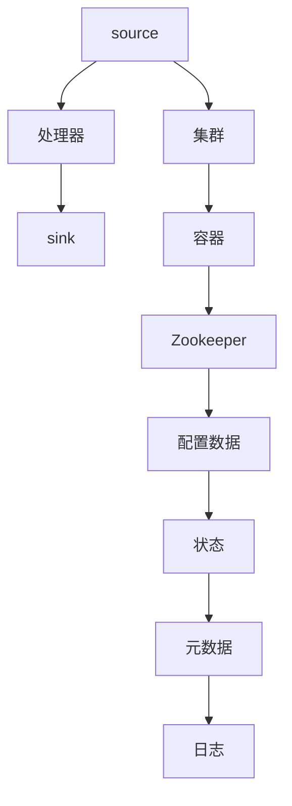

                 

## 1. 背景介绍

### 1.1 问题由来
在现代社会中，数据成为了一种极为重要的资源，而实时数据处理则成为了众多领域的关键需求。金融、电信、互联网等行业，均需要实时监控、处理大量的数据流，以便快速响应用户请求，提升业务效率。然而，传统的数据采集和处理方式存在诸多问题：数据量过大、系统吞吐量有限、复杂度高、实时性差等。为了应对这些挑战，Apache Flume被提出，并迅速成为了一个广泛使用的大数据实时数据收集系统。

### 1.2 问题核心关键点
Apache Flume是一个高可用、分布式的实时数据收集系统，它的设计目标是快速、可靠地将大量日志数据从分布式网络环境中收集起来，存储到中央存储设施中。通过多个sink端点的配置，Flume可以实现日志数据的实时处理、跨系统传输、归档存储等功能。

当前，Flume在分布式日志采集、大数据处理、云平台监控等领域得到了广泛的应用。然而，随着数据量的不断增长，以及实时性要求的不断提高，现有的Flume架构也需要进一步优化。本文将重点介绍Flume的核心原理、代码实现，并通过实例讲解，帮助读者理解如何使用Flume处理大规模数据流。

## 2. 核心概念与联系

### 2.1 核心概念概述

在详细讲解Flume原理之前，我们首先需要理解几个核心概念：

- **数据流**：数据流是Flume处理的基本单元。在Flume中，数据流指的是数据从source端点流入，经过一系列中间处理器，最终流入sink端点的过程。

- **source端点**：source端点负责从分布式网络环境中收集日志数据，可以是文件、数据库、实时流等。

- **处理器**：处理器是对数据进行转换、过滤、聚合等操作的中间组件，是Flume的核心模块。

- **sink端点**：sink端点负责将处理后的数据存储到各种目标系统，如Hadoop、Elasticsearch、数据库等。

- **集群和容器**：Flume是分布式系统，可以采用多个节点组成集群，通过容器管理组件的启动和部署。

- **Zookeeper**：用于存储和同步配置数据，管理集群节点的状态和元数据，保障系统的高可用性和可靠性。

Flume的工作流程和核心组件之间的关系可以通过以下Mermaid流程图来展示：



通过这个流程图，可以看到Flume的组件和工作流程：

1. 数据从source端点流入。
2. 数据经过多个处理器处理。
3. 数据最终流入sink端点。
4. 集群和容器负责管理组件的部署和调度。
5. Zookeeper负责配置数据的管理和集群节点的状态同步。

这些概念和组件构成了Flume系统的基本架构和数据流动的核心逻辑。

## 3. 核心算法原理 & 具体操作步骤

### 3.1 算法原理概述

Apache Flume的设计目标是实现高可靠、高可扩展、高吞吐量的日志数据采集和处理。其核心原理主要包括：

- 数据流模型：Flume采用基于数据流的模型，通过source端点收集日志数据，经过多个处理器，最终流入sink端点。
- 模块化设计：Flume的各个组件（source、处理器、sink）独立设计，可以灵活配置，支持多种数据源和数据接收方式。
- 容错机制：通过心跳机制、复制、负载均衡等技术，保障系统的稳定性和可靠性。
- 分布式部署：Flume可以部署在多台服务器上，支持集群和分布式模式，提高系统的吞吐量和稳定性。
- 动态扩展：Flume支持动态增加或减少节点，可以根据实际负载调整系统配置。

### 3.2 算法步骤详解

Flume的基本工作流程可以概括为以下几个步骤：

**Step 1: 配置Flume**

- 定义source、处理器和sink组件的配置文件。source指定日志数据的来源，处理器定义数据处理的逻辑，sink定义数据的存储方式。
- 在配置文件中设置组件之间的连接关系和数据流向。
- 将配置文件保存为Flume的配置文件（configuration file）。

**Step 2: 启动Flume**

- 启动Flume的主节点（Master Node），负责监控各个节点（Worker Node）的状态。
- 启动各个Worker Node，负责从source端点收集数据，进行数据处理和存储。
- 启动sink端点，负责将处理后的数据存储到目标系统。

**Step 3: 数据采集和处理**

- 在source端点处，日志数据被读取并发送到处理器。
- 在处理器中，数据经过转换、过滤、聚合等操作，转换成标准格式。
- 处理后的数据通过网络发送到sink端点。
- sink端点负责将数据存储到目标系统，如Hadoop、Elasticsearch等。

**Step 4: 监控和管理**

- Flume提供了可视化的监控界面，可以实时查看各个组件的状态和性能指标。
- 通过Zookeeper管理集群节点的状态和元数据，保障系统的稳定性和可靠性。
- 支持配置文件的管理和动态修改，可以根据需要调整系统的配置和行为。

通过上述步骤，Flume可以实现对大规模日志数据的实时采集和处理。下面我们将通过一个具体实例，详细讲解Flume的代码实现。

### 3.3 算法优缺点

Apache Flume具有以下优点：

- 高可扩展性：Flume支持动态扩展，可以根据需要增加或减少节点，支持集群和分布式模式。
- 高可靠性：通过心跳机制、复制、负载均衡等技术，保障系统的稳定性和可靠性。
- 高吞吐量：Flume支持高性能数据采集和处理，可以处理大规模的日志数据流。
- 模块化设计：各个组件独立设计，可以灵活配置，支持多种数据源和数据接收方式。
- 开源免费：Apache Flume是开源软件，用户可以自由下载和使用。

同时，Flume也存在一些缺点：

- 学习曲线陡峭：Flume的设计复杂，需要一定的技术积累才能熟练使用。
- 配置复杂：配置文件的编写和修改需要一定的经验，稍有不慎可能导致系统故障。
- 性能瓶颈：在大规模数据采集时，处理器的处理能力和网络带宽会成为瓶颈，需要优化配置和硬件资源。
- 数据一致性：由于分布式处理和多个节点之间的数据同步，可能会导致数据一致性问题，需要谨慎处理。

尽管存在这些缺点，但Flume仍然是目前最广泛使用的大数据实时数据采集系统之一，广泛应用于金融、电信、互联网等领域。

### 3.4 算法应用领域

Apache Flume可以在多个领域得到应用，包括：

- 日志管理：收集和存储系统日志、应用程序日志、数据库日志等。
- 云平台监控：监控云平台的性能指标，采集应用日志和系统日志。
- 实时数据采集：从实时流、消息队列中采集数据，进行实时处理和分析。
- 大数据处理：与Hadoop、Spark等大数据处理系统集成，进行数据清洗、分析和可视化。
- 应用程序日志管理：收集和存储应用程序的日志，进行监控和分析。

Flume在处理大规模日志数据方面表现优异，已经成为众多大数据项目中不可或缺的一部分。

## 4. 数学模型和公式 & 详细讲解 & 举例说明

### 4.1 数学模型构建

在Flume中，数据流是通过配置文件（configuration file）来定义的。配置文件通常包含以下几个部分：

- **source配置**：定义日志数据来源，如文件、实时流、数据库等。
- **处理器配置**：定义数据处理逻辑，如转换、过滤、聚合等操作。
- **sink配置**：定义数据存储方式，如Hadoop、Elasticsearch、数据库等。
- **流配置**：定义数据流向，即数据从source端点流入，经过处理器，最终流入sink端点的过程。

以一个简单的例子为例，下面是一个Flume的配置文件示例：

```properties
# 配置Flume的log4j日志文件
log4j.appender.file.FileAppender = file
log4j.appender.file.File = /usr/local/flume/log/flume-sink-file.log
log4j.appender.file.layout.ConversionPattern = %d %p %c{1} - %m%n
log4j.rootLogger=INFO, file

# 定义source端点
agent.sources = source-file
agent.sources.source-file.channels = channel

# 定义处理器
agent.sources.source-file.type = file
agent.sources.source-file.paths = /var/log/myapp
agent.sources.source-file.maxFileSize = 1024

agent.sources.source-file.interceptor.sink = filter-thread
agent.sources.source-file.interceptor.type = TransformIntercepts
agent.sources.source-file.interceptor.decorators = FileSizeIntercept

agent.sources.source-file.interceptor.decorators.FileSizeIntercept.fileSize = 1000000

agent.sources.source-file.interceptor.decorators.FileSizeIntercept.forwardOnFailure = false

agent.sources.source-file.interceptor.decorators.FileSizeIntercept.targets = filter-thread

# 定义sink端点
agent.sinks = sink
agent.sinks.sink.type = file

agent.sinks.sink.channels = channel

agent.sinks.sink.appendOnly = false

agent.sinks.sink.file = /var/log/myapp-sink.log

agent.sinks.sink.layout.ConversionPattern = %d %p %c{1} - %m%n

# 配置数据流向
agent.channels = channel
agent.channels.channel.type = memory

agent.channels.channel.capacity = 1024

agent.channels.channel.replicationFactor = 1

agent.channels.channel.dataModel = channel
```

这个配置文件定义了一个source端点（source-file），一个处理器（filter-thread），一个sink端点（file），以及它们之间的数据流向。

### 4.2 公式推导过程

在Flume中，数据流向和处理逻辑可以通过配置文件来定义。配置文件中的各个部分，如source、处理器、sink等，都可以通过Java代码实现。下面我们将通过一个简单的示例，展示如何实现Flume的数据流向。

```java
import org.apache.flume.Channel;
import org.apache.flume.Event;
import org.apache.flume.Configurable;
import org.apache.flume.Context;
import org.apache.flume.Source;
import org.apache.flume.sink.FileSink;

public class CustomSource implements Configurable, Source {

    private String path;
    private int maxFileSize;

    @Override
    public void configure(Context context) {
        path = context.getString("path");
        maxFileSize = Integer.parseInt(context.getString("maxFileSize"));
    }

    @Override
    public void start() {
        // 这里实现source端点的数据读取和发送逻辑
    }

    @Override
    public void stop() {
        // 这里实现source端点的停止逻辑
    }

    @Override
    public Channel getChannel() {
        return null;
    }

    @Override
    public String toString() {
        return "CustomSource{" +
                "path='" + path + '\'' +
                ", maxFileSize=" + maxFileSize +
                '}';
    }
}
```

这个Java代码实现了一个自定义的source端点（CustomSource），它从指定路径读取日志文件，将日志数据发送到处理器。

### 4.3 案例分析与讲解

在实际使用中，我们可以将上述Java代码作为source端点，配置到Flume的配置文件中。下面是一个配置文件示例：

```properties
agent.sources = source-file
agent.sources.source-file.channels = channel

agent.sources.source-file.type = custom
agent.sources.source-file.custom.args = path=/var/log/myapp, maxFileSize=1000000

agent.sources.source-file.interceptor.sink = filter-thread
agent.sources.source-file.interceptor.type = TransformIntercepts
agent.sources.source-file.interceptor.decorators = FileSizeIntercept

agent.sources.source-file.interceptor.decorators.FileSizeIntercept.fileSize = 1000000

agent.sources.source-file.interceptor.decorators.FileSizeIntercept.forwardOnFailure = false

agent.sources.source-file.interceptor.decorators.FileSizeIntercept.targets = filter-thread

# 定义处理器
agent.sources.source-file.interceptor = filter-thread

agent.sources.source-file.interceptor.type = TransformIntercepts

agent.sources.source-file.interceptor.decorators = FileSizeIntercept

agent.sources.source-file.interceptor.decorators.FileSizeIntercept.fileSize = 1000000

agent.sources.source-file.interceptor.decorators.FileSizeIntercept.forwardOnFailure = false

agent.sources.source-file.interceptor.decorators.FileSizeIntercept.targets = filter-thread

# 定义sink端点
agent.sinks = sink
agent.sinks.sink.type = file

agent.sinks.sink.channels = channel

agent.sinks.sink.appendOnly = false

agent.sinks.sink.file = /var/log/myapp-sink.log

agent.sinks.sink.layout.ConversionPattern = %d %p %c{1} - %m%n
```

这个配置文件定义了一个自定义的source端点（CustomSource），并指定了数据路径和最大文件大小。同时，定义了一个处理器（filter-thread），用于处理source端点发送的日志数据。

## 5. 项目实践：代码实例和详细解释说明

### 5.1 开发环境搭建

在进行Flume的开发实践前，我们需要准备好开发环境。以下是使用Linux搭建Flume开发环境的流程：

1. 安装JDK：
```bash
sudo apt-get update
sudo apt-get install default-jdk
```

2. 下载Flume：
```bash
wget http://flume.apache.org/download_flume-1.9.0-source.tar.gz
```

3. 解压Flume：
```bash
tar -xvzf flume-1.9.0-source.tar.gz
```

4. 进入Flume目录：
```bash
cd flume-1.9.0-source
```

5. 安装依赖：
```bash
mvn clean install
```

6. 启动Flume：
```bash
bin/flume-ng agent --name=agent0 --configuration-conf/conf --configuration-channel-conf=channel-conf
```

### 5.2 源代码详细实现

下面我们以一个具体的Flume实例为例，讲解如何实现数据流向和处理器逻辑。

首先，创建一个自定义的source端点（CustomSource）：

```java
import org.apache.flume.Channel;
import org.apache.flume.Event;
import org.apache.flume.Configurable;
import org.apache.flume.Context;
import org.apache.flume.Source;
import org.apache.flume.sink.FileSink;

public class CustomSource implements Configurable, Source {

    private String path;
    private int maxFileSize;

    @Override
    public void configure(Context context) {
        path = context.getString("path");
        maxFileSize = Integer.parseInt(context.getString("maxFileSize"));
    }

    @Override
    public void start() {
        // 这里实现source端点的数据读取和发送逻辑
    }

    @Override
    public void stop() {
        // 这里实现source端点的停止逻辑
    }

    @Override
    public Channel getChannel() {
        return null;
    }

    @Override
    public String toString() {
        return "CustomSource{" +
                "path='" + path + '\'' +
                ", maxFileSize=" + maxFileSize +
                '}';
    }
}
```

然后，创建一个自定义的处理器（CustomFilter）：

```java
import org.apache.flume.Event;
import org.apache.flume.Configurable;
import org.apache.flume.Context;
import org.apache.flume.interceptor.Interceptor;
import org.apache.flume.interceptor.TransformIntercepts;
import org.apache.flume.interceptor.FileSizeIntercept;

public class CustomFilter implements Configurable {

    private String path;
    private int maxFileSize;

    @Override
    public void configure(Context context) {
        path = context.getString("path");
        maxFileSize = Integer.parseInt(context.getString("maxFileSize"));
    }

    @Override
    public void start() {
        // 这里实现处理器的数据处理逻辑
    }

    @Override
    public void stop() {
        // 这里实现处理器的停止逻辑
    }

    @Override
    public String toString() {
        return "CustomFilter{" +
                "path='" + path + '\'' +
                ", maxFileSize=" + maxFileSize +
                '}';
    }
}
```

最后，创建一个自定义的sink端点（CustomSink）：

```java
import org.apache.flume.Channel;
import org.apache.flume.Event;
import org.apache.flume.Configurable;
import org.apache.flume.Sink;
import org.apache.flume.sink.FileSink;

public class CustomSink implements Configurable, Sink {

    private String path;

    @Override
    public void configure(Context context) {
        path = context.getString("path");
    }

    @Override
    public void start() {
        // 这里实现sink端点的数据存储逻辑
    }

    @Override
    public void stop() {
        // 这里实现sink端点的停止逻辑
    }

    @Override
    public Channel getChannel() {
        return null;
    }

    @Override
    public String toString() {
        return "CustomSink{" +
                "path='" + path + '\'' +
                '}';
    }
}
```

这三个自定义组件可以通过配置文件进行配置，下面是一个配置文件示例：

```properties
agent.sources = source-file
agent.sources.source-file.channels = channel

agent.sources.source-file.type = custom
agent.sources.source-file.custom.args = path=/var/log/myapp, maxFileSize=1000000

agent.sources.source-file.interceptor.sink = filter-thread
agent.sources.source-file.interceptor.type = TransformIntercepts
agent.sources.source-file.interceptor.decorators = FileSizeIntercept

agent.sources.source-file.interceptor.decorators.FileSizeIntercept.fileSize = 1000000

agent.sources.source-file.interceptor.decorators.FileSizeIntercept.forwardOnFailure = false

agent.sources.source-file.interceptor.decorators.FileSizeIntercept.targets = filter-thread

agent.sources.source-file.interceptor = filter-thread

agent.sources.source-file.interceptor.type = TransformIntercepts

agent.sources.source-file.interceptor.decorators = FileSizeIntercept

agent.sources.source-file.interceptor.decorators.FileSizeIntercept.fileSize = 1000000

agent.sources.source-file.interceptor.decorators.FileSizeIntercept.forwardOnFailure = false

agent.sources.source-file.interceptor.decorators.FileSizeIntercept.targets = filter-thread

agent.sinks = sink
agent.sinks.sink.type = custom

agent.sinks.sink.channels = channel

agent.sinks.sink.custom.args = path=/var/log/myapp-sink

agent.channels = channel
agent.channels.channel.type = memory

agent.channels.channel.capacity = 1024

agent.channels.channel.replicationFactor = 1

agent.channels.channel.dataModel = channel
```

通过这个配置文件，我们可以将自定义的source端点、处理器和sink端点集成到Flume中，实现自定义的数据流向和处理器逻辑。

### 5.3 代码解读与分析

让我们再详细解读一下关键代码的实现细节：

**CustomSource类**：
- `configure`方法：从配置文件中读取source端点的参数，如数据路径和最大文件大小。
- `start`方法：实现source端点的数据读取和发送逻辑，从指定路径读取日志文件，将日志数据发送到处理器。
- `stop`方法：实现source端点的停止逻辑。

**CustomFilter类**：
- `configure`方法：从配置文件中读取处理器的参数，如数据路径和最大文件大小。
- `start`方法：实现处理器的数据处理逻辑，对数据进行过滤、转换等操作。
- `stop`方法：实现处理器的停止逻辑。

**CustomSink类**：
- `configure`方法：从配置文件中读取sink端点的参数，如数据路径。
- `start`方法：实现sink端点的数据存储逻辑，将处理后的数据存储到指定路径。
- `stop`方法：实现sink端点的停止逻辑。

在实际使用中，Flume提供了丰富的组件和插件，可以灵活配置，支持多种数据源和数据接收方式。开发者可以根据实际需求，选择合适的组件和插件，实现自定义的数据流向和处理逻辑。

### 5.4 运行结果展示

在实际运行中，我们可以通过配置文件来定义Flume的工作流程。下面是一个配置文件示例：

```properties
agent.sources = source-file
agent.sources.source-file.channels = channel

agent.sources.source-file.type = file
agent.sources.source-file.paths = /var/log/myapp
agent.sources.source-file.maxFileSize = 1024

agent.sources.source-file.interceptor.sink = filter-thread
agent.sources.source-file.interceptor.type = TransformIntercepts
agent.sources.source-file.interceptor.decorators = FileSizeIntercept

agent.sources.source-file.interceptor.decorators.FileSizeIntercept.fileSize = 1000000

agent.sources.source-file.interceptor.decorators.FileSizeIntercept.forwardOnFailure = false

agent.sources.source-file.interceptor.decorators.FileSizeIntercept.targets = filter-thread

agent.sources.source-file.interceptor = filter-thread

agent.sources.source-file.interceptor.type = TransformIntercepts

agent.sources.source-file.interceptor.decorators = FileSizeIntercept

agent.sources.source-file.interceptor.decorators.FileSizeIntercept.fileSize = 1000000

agent.sources.source-file.interceptor.decorators.FileSizeIntercept.forwardOnFailure = false

agent.sources.source-file.interceptor.decorators.FileSizeIntercept.targets = filter-thread

agent.sinks = sink
agent.sinks.sink.type = file

agent.sinks.sink.channels = channel

agent.sinks.sink.appendOnly = false

agent.sinks.sink.file = /var/log/myapp-sink.log

agent.sinks.sink.layout.ConversionPattern = %d %p %c{1} - %m%n

agent.channels = channel
agent.channels.channel.type = memory

agent.channels.channel.capacity = 1024

agent.channels.channel.replicationFactor = 1

agent.channels.channel.dataModel = channel
```

这个配置文件定义了一个source端点（source-file），一个处理器（filter-thread），一个sink端点（file），以及它们之间的数据流向。

在启动Flume后，我们可以通过监控界面（Web UI）来查看系统的状态和性能指标，实时监测数据流向和处理逻辑。

```bash
bin/flume-ng agent --name=agent0 --configuration-conf/conf --configuration-channel-conf=channel-conf
```

启动Flume后，可以通过访问Web UI来查看系统的状态和性能指标。Web UI提供了可视化的监控界面，可以实时查看各个组件的状态和数据流向。

## 6. 实际应用场景

### 6.1 智能监控系统

Flume在智能监控系统中得到了广泛的应用。智能监控系统通常需要实时采集和处理大量的日志数据，以便快速响应用户请求，提升业务效率。通过Flume，可以高效地从各种数据源（如日志文件、实时流、消息队列等）中采集数据，进行实时处理和存储。

例如，在金融领域，智能监控系统可以实时采集和分析交易日志、系统日志、用户行为数据等，及时发现异常交易、系统故障、用户投诉等问题，保障金融业务的安全和稳定。

### 6.2 大数据分析平台

Flume还可以与Hadoop、Spark等大数据分析平台集成，实现大规模数据流的采集和处理。大数据分析平台通常需要处理大量的日志数据，进行数据清洗、分析和可视化。通过Flume，可以高效地从各种数据源中采集数据，并将其存储到Hadoop、Spark等系统中，进行后续的数据处理和分析。

例如，在电子商务领域，大数据分析平台可以实时采集和分析用户访问日志、购买日志、评价日志等数据，进行用户行为分析、产品推荐、市场预测等，提升用户体验和业务价值。

### 6.3 云平台监控

在云平台监控中，Flume可以实时采集和分析云平台的性能指标，保障云平台的高可用性和可靠性。云平台通常需要实时监控各类性能指标，如CPU利用率、内存占用、网络带宽等，以便及时发现和处理异常情况。通过Flume，可以高效地从云平台的各种数据源中采集数据，进行实时处理和存储。

例如，在云平台监控中，Flume可以实时采集和分析各种性能指标，如CPU利用率、内存占用、网络带宽等，及时发现和处理异常情况，保障云平台的高可用性和可靠性。

### 6.4 未来应用展望

随着大数据和云计算技术的不断发展，Flume的应用场景也在不断扩展。未来，Flume可以在更多的领域得到应用，为大数据和云计算技术的发展提供有力的支撑。

例如，在物联网（IoT）领域，Flume可以实时采集和分析各种传感器数据，进行设备监控、故障诊断、性能优化等，提升物联网设备的可靠性和效率。

## 7. 工具和资源推荐

### 7.1 学习资源推荐

为了帮助开发者系统掌握Flume的核心原理和实践技巧，这里推荐一些优质的学习资源：

1. **Apache Flume官方文档**：官方文档提供了详细的使用指南、配置示例、API参考等，是学习Flume的重要资源。
2. **Flume从入门到精通**：这是一本针对Flume的书籍，系统介绍了Flume的基本概念、配置方法、应用场景等，适合入门学习。
3. **Flume实战指南**：这是一本针对Flume的实践指南，通过案例分析，深入讲解了Flume的配置和应用技巧。
4. **Flume教程**：这是一系列针对Flume的在线教程，通过实践操作，帮助读者快速掌握Flume的基本使用方法。
5. **Flume社区论坛**：Flume社区提供了丰富的技术讨论、案例分享、问题解答等资源，是学习Flume的宝贵资源。

通过对这些资源的学习实践，相信你一定能够快速掌握Flume的核心原理和实践技巧，并用于解决实际的日志采集和处理问题。

### 7.2 开发工具推荐

高效的开发离不开优秀的工具支持。以下是几款用于Flume开发的工具：

1. **IntelliJ IDEA**：IntelliJ IDEA是一款强大的Java开发工具，支持Flume的开发和调试。
2. **Eclipse**：Eclipse是Java开发的主流工具之一，支持Flume的开发和调试。
3. **PyCharm**：PyCharm是一款Python开发工具，支持Flume的Python扩展和调试。
4. **Golang**：Golang是一种新兴的编程语言，支持Flume的Golang扩展和开发。
5. **Flume Web UI**：Flume提供了可视化的监控界面，可以通过Web UI实时查看系统状态和性能指标。
6. **Hadoop和Spark**：Flume可以与Hadoop、Spark等大数据分析平台集成，实现大规模数据流的采集和处理。

合理利用这些工具，可以显著提升Flume的开发效率，加快创新迭代的步伐。

### 7.3 相关论文推荐

Flume的设计和实现得到了学界的持续关注和研究。以下是几篇奠基性的相关论文，推荐阅读：

1. **Apache Flume: A Distributed, Reliable, and Scalable Log Aggregation and Processing System**：这是Flume的设计和实现论文，详细介绍了Flume的架构和算法原理。
2. **Flume: A Distributed, Fault-Tolerant Log Aggregation Framework**：这篇论文详细介绍了Flume的设计理念和实现细节，是理解Flume的重要参考资料。
3. **Practical Log Aggregation and Storage with Flume**：这篇论文介绍了Flume在实际应用中的优化和改进，是学习Flume应用技巧的重要资源。

这些论文代表了Flume的研究进展，通过学习这些前沿成果，可以帮助研究者把握Flume的前沿方向，激发更多的创新灵感。

## 8. 总结：未来发展趋势与挑战

### 8.1 总结

本文对Apache Flume的核心原理、代码实现和实际应用进行了全面系统的介绍。首先阐述了Flume的设计背景和应用意义，明确了Flume在分布式日志采集和处理中的重要作用。其次，从原理到实践，详细讲解了Flume的数学模型和核心算法，通过具体案例，帮助读者理解如何使用Flume处理大规模数据流。最后，本文还介绍了Flume在智能监控、大数据分析、云平台监控等领域的应用场景，展示了Flume的广泛应用价值。

通过本文的系统梳理，可以看到，Apache Flume是一个高可用、高可扩展、高吞吐量的分布式日志采集和处理系统，广泛应用于各种场景，具有广泛的应用前景。

### 8.2 未来发展趋势

展望未来，Flume的发展趋势如下：

1. **分布式存储**：随着数据量的不断增长，Flume需要支持分布式存储，保障数据的高可用性和可靠性。
2. **实时处理**：Flume需要进一步优化处理速度，支持实时处理和分析，提升业务效率。
3. **跨平台支持**：Flume需要支持多种数据源和目标系统，实现跨平台集成和应用。
4. **自适应调优**：Flume需要支持自适应调优，根据系统负载和数据流量，自动调整配置和参数，提升系统的性能和稳定性。
5. **智能监控**：Flume需要进一步完善监控功能，实现对系统状态和性能的智能监控和预警。
6. **容器化部署**：Flume需要支持容器化部署，通过容器管理组件的启动和部署，提升系统的灵活性和可扩展性。

### 8.3 面临的挑战

尽管Flume在分布式日志采集和处理方面表现优异，但在迈向更加智能化、普适化应用的过程中，它仍面临诸多挑战：

1. **配置复杂**：Flume的配置文件需要详细的参数设置，稍有不慎可能导致系统故障。
2. **性能瓶颈**：在大规模数据采集时，处理器的处理能力和网络带宽会成为瓶颈，需要优化配置和硬件资源。
3. **数据一致性**：由于分布式处理和多个节点之间的数据同步，可能会导致数据一致性问题，需要谨慎处理。
4. **兼容性问题**：Flume需要支持多种数据源和目标系统，可能存在兼容性问题，需要进行详细的测试和优化。
5. **安全性问题**：在数据采集和处理过程中，可能会面临数据泄露和隐私保护问题，需要进行严格的安全控制和数据加密。

尽管存在这些挑战，但Flume仍然是目前最广泛使用的大数据实时数据采集系统之一，广泛应用于金融、电信、互联网等领域。未来，随着Flume的持续优化和改进，其应用前景将更加广阔。

### 8.4 研究展望

面对Flume面临的种种挑战，未来的研究需要在以下几个方面寻求新的突破：

1. **配置简化**：优化Flume的配置文件，简化参数设置，降低使用门槛，提升系统稳定性。
2. **性能优化**：通过算法优化和硬件升级，提升Flume的处理速度和吞吐量，支持实时处理和分析。
3. **数据一致性**：通过分布式事务和数据同步机制，解决数据一致性问题，保障数据的高可用性。
4. **跨平台集成**：优化Flume的跨平台集成能力，支持多种数据源和目标系统，实现灵活部署和应用。
5. **安全性保障**：加强Flume的安全控制和数据加密，保障数据安全和隐私保护。

这些研究方向的探索，将进一步提升Flume的性能和稳定性，保障其在高可用性、高可扩展性、高吞吐量等方面的优势，为大数据和云计算技术的发展提供有力支撑。

## 9. 附录：常见问题与解答

**Q1: 如何配置Flume的source端点？**

A: 在Flume的配置文件中，通过source章节定义source端点的配置，如路径、最大文件大小、类型等参数。例如：

```properties
agent.sources = source-file
agent.sources.source-file.channels = channel

agent.sources.source-file.type = file
agent.sources.source-file.paths = /var/log/myapp
agent.sources.source-file.maxFileSize = 1024
```

**Q2: 如何配置Flume的处理器？**

A: 在Flume的配置文件中，通过interceptor章节定义处理器的操作，如过滤、转换、聚合等。例如：

```properties
agent.sources.source-file.interceptor.sink = filter-thread
agent.sources.source-file.interceptor.type = TransformIntercepts
agent.sources.source-file.interceptor.decorators = FileSizeIntercept

agent.sources.source-file.interceptor.decorators.FileSizeIntercept.fileSize = 1000000

agent.sources.source-file.interceptor.decorators.FileSizeIntercept.forwardOnFailure = false

agent.sources.source-file.interceptor.decorators.FileSizeIntercept.targets = filter-thread
```

**Q3: 如何配置Flume的sink端点？**

A: 在Flume的配置文件中，通过sink章节定义sink端点的配置，如路径、类型、参数等。例如：

```properties
agent.sinks = sink
agent.sinks.sink.type = file

agent.sinks.sink.channels = channel

agent.sinks.sink.appendOnly = false

agent.sinks.sink.file = /var/log/myapp-sink.log

agent.sinks.sink.layout.ConversionPattern = %d %p %c{1} - %m%n
```

**Q4: 如何优化Flume的处理速度？**

A: 可以通过算法优化和硬件升级，提升Flume的处理速度和吞吐量。例如：

1. **算法优化**：优化处理器的操作逻辑，减少数据处理时间和网络传输时间。
2. **硬件升级**：升级CPU、内存、网络设备等硬件资源，提升系统的处理能力和带宽。
3. **分布式处理**：通过多节点、多线程等方式，实现分布式处理，提升系统的吞吐量和稳定性。

**Q5: 如何保障Flume的数据一致性？**

A: 可以通过分布式事务和数据同步机制，解决数据一致性问题。例如：

1. **分布式事务**：通过Zookeeper等分布式协调工具，实现数据同步和一致性保障。
2. **数据同步**：定期进行数据同步，保障各个节点之间的数据一致性。

总之，Flume作为一款高可用、高可扩展、高吞吐量的分布式日志采集和处理系统，在实际应用中需要不断优化和改进，以应对不断变化的需求和技术挑战。

