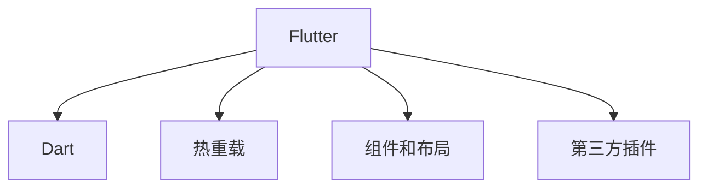

                 

## 1. 背景介绍

### 1.1 问题由来
在移动应用开发领域，传统的iOS和Android平台各自拥有庞大的生态系统和庞大的用户群，开发者需要分别开发两套应用才能覆盖全平台。然而，这种“烟囱式”的开发模式存在代码冗余、维护成本高、更新频率慢等诸多问题。为了解决这些问题，跨平台开发工具应运而生，其中最流行的是React Native和Flutter。

Flutter是一个由Google开发的移动应用开发框架，它允许开发者使用一套代码构建原生iOS和Android应用程序。Flutter的独特之处在于，它使用了自己的渲染引擎，这使得它在性能和用户体验方面比React Native更胜一筹。此外，Flutter的组件和布局系统更加直观和灵活，使得开发者可以轻松构建出高品质的用户界面。

### 1.2 问题核心关键点
Flutter的主要优势包括：
- **性能优异**：使用自己的渲染引擎，保证了应用程序的流畅性和响应速度。
- **组件丰富**：提供了大量预制组件，大大加快了开发速度。
- **布局灵活**：提供了强大的布局系统，使得开发者可以轻松构建出高品质的用户界面。
- **热重载**：支持热重载功能，可以实时查看应用界面的变化，大大提高了开发效率。
- **跨平台统一**：可以构建一套代码，支持iOS和Android平台，降低了维护成本。
- **丰富的第三方插件**：社区中有大量的第三方插件，可以轻松实现各种功能。

Flutter的这些优势使得它成为移动应用开发的新选择，特别是在企业级应用和游戏开发领域，开发者更倾向于使用Flutter。

### 1.3 问题研究意义
通过学习Flutter跨平台开发技术，开发者可以实现一次编写多平台的应用程序，显著降低开发成本和维护成本。此外，Flutter提供了强大的组件和布局系统，使得开发者可以轻松构建出高质量的用户界面，提升用户体验。Flutter的热重载和快速迭代特性，使得开发效率大大提升，帮助企业快速推出高品质的应用程序。

总之，Flutter跨平台开发技术不仅能够提高开发效率，降低开发成本，还能够提升应用程序的性能和用户体验，因此具有重要的研究意义。

## 2. 核心概念与联系

### 2.1 核心概念概述

为了更好地理解Flutter跨平台开发技术，我们首先需要了解一些核心概念：

- **Flutter**：一个由Google开发的移动应用开发框架，使用自己的渲染引擎，能够构建出高性能、流畅的原生应用程序。
- **Dart**：Flutter的编程语言，类似于JavaScript，但提供了更好的类型系统和性能。
- **热重载**：Flutter的一个特性，可以在不重新编译应用的情况下，实时查看应用界面的变化，大大提高了开发效率。
- **组件和布局**：Flutter提供了强大的组件和布局系统，使得开发者可以轻松构建出高质量的用户界面。
- **第三方插件**：Flutter社区中有大量的第三方插件，可以轻松实现各种功能。

这些核心概念之间的逻辑关系可以通过以下Mermaid流程图来展示：



这个流程图展示了一体化在Flutter开发中的关键概念及其之间的关系：

1. Flutter使用Dart作为编程语言。
2. Flutter提供了热重载功能，大大提高了开发效率。
3. Flutter提供了强大的组件和布局系统。
4. Flutter社区中有大量的第三方插件。

## 3. 核心算法原理 & 具体操作步骤

### 3.1 算法原理概述

Flutter跨平台开发的核心算法原理是使用自己的渲染引擎，将代码渲染为原生UI界面。这与传统的跨平台工具如React Native不同，React Native使用JavaScript进行UI渲染，因此性能和体验较差。Flutter的渲染引擎使用了Skia图形库，具有极高的性能和灵活性。

Flutter的算法原理包括以下几个关键步骤：

1. **组件树构建**：开发者编写的Flutter代码会被编译为组件树，组件树包含了所有UI组件和布局信息。
2. **渲染引擎调用**：组件树被渲染引擎调用，生成原生UI界面。
3. **热重载更新**：热重载功能使得开发者可以在不重新编译应用的情况下，实时查看应用界面的变化，大大提高了开发效率。

### 3.2 算法步骤详解

Flutter跨平台开发的主要步骤如下：

**Step 1: 环境搭建**
- 安装Flutter SDK：从官网下载安装Flutter SDK，并配置环境变量。
- 安装Android Studio和Xcode：Flutter支持iOS和Android平台，因此需要安装对应的IDE。

**Step 2: 创建项目**
- 使用Flutter命令创建新项目：`flutter create app_name`
- 进入项目目录：`cd app_name`
- 初始化项目：`flutter run`

**Step 3: 开发应用**
- 编写Dart代码：Flutter的代码使用Dart语言编写，可以使用IDE中的编辑器或命令行工具。
- 构建组件树：开发者可以自定义组件，Flutter提供了大量的预制组件和布局系统。
- 使用热重载功能：实时查看应用界面的变化，优化代码。

**Step 4: 测试和发布**
- 测试应用：在测试设备上测试应用，修复bug和优化体验。
- 构建应用：使用Flutter的发布工具生成应用的APK或IPA。
- 发布应用：将生成的APK或IPA发布到Google Play或Apple App Store。

### 3.3 算法优缺点

Flutter跨平台开发技术有以下优点：
1. **性能优异**：使用自己的渲染引擎，保证了应用程序的流畅性和响应速度。
2. **组件丰富**：提供了大量预制组件，大大加快了开发速度。
3. **布局灵活**：提供了强大的布局系统，使得开发者可以轻松构建出高品质的用户界面。
4. **热重载**：支持热重载功能，可以实时查看应用界面的变化，大大提高了开发效率。
5. **跨平台统一**：可以构建一套代码，支持iOS和Android平台，降低了维护成本。
6. **丰富的第三方插件**：社区中有大量的第三方插件，可以轻松实现各种功能。

同时，该技术也存在一些缺点：
1. **学习曲线陡峭**：Flutter的Dart语言需要一定的学习成本。
2. **文档不够完善**：Flutter社区还处于快速发展阶段，文档不够完善。
3. **社区生态还不够成熟**：与React Native相比，Flutter社区的生态还不够成熟。
4. **插件数量相对较少**：虽然社区中有大量第三方插件，但与React Native相比，插件数量仍然较少。

### 3.4 算法应用领域

Flutter跨平台开发技术广泛应用于以下几个领域：

- **企业级应用**：由于Flutter具有高效、跨平台、性能优异的优势，企业级应用是其主要应用场景之一。
- **游戏开发**：Flutter在游戏开发领域也有广泛应用，特别是对性能要求高的游戏。
- **移动应用**：Flutter可以构建出高性能、流畅的原生应用程序，因此在移动应用开发领域也有大量应用。
- **跨平台应用**：由于Flutter可以构建出跨平台的应用程序，因此在跨平台应用开发领域也有广泛应用。

## 4. 数学模型和公式 & 详细讲解

### 4.1 数学模型构建

在Flutter中，开发人员使用Dart语言编写代码，构建组件树，并将其渲染为原生UI界面。Dart语言类似于JavaScript，但提供了更好的类型系统和性能。

Flutter的数学模型包括以下几个关键步骤：

1. **组件树构建**：开发者编写的Dart代码会被编译为组件树，组件树包含了所有UI组件和布局信息。
2. **渲染引擎调用**：组件树被渲染引擎调用，生成原生UI界面。

### 4.2 公式推导过程

以下是Flutter中的数学公式推导过程：

1. **组件树构建**：

   ```
   组件树 = Dart代码 -> 编译 -> 组件树
   ```

2. **渲染引擎调用**：

   ```
   原生UI界面 = 渲染引擎 -> 组件树
   ```

### 4.3 案例分析与讲解

以下是一个简单的Flutter应用程序案例分析：

```dart
import 'package:flutter/material.dart';

void main() {
  runApp(MyApp());
}

class MyApp extends StatelessWidget {
  @override
  Widget build(BuildContext context) {
    return MaterialApp(
      title: 'Flutter App',
      home: Scaffold(
        appBar: AppBar(title: Text('Flutter App')),
        body: Center(
          child: Column(
            mainAxisAlignment: MainAxisAlignment.center,
            children: <Widget>[
              Text('Welcome to Flutter'),
            ],
          ),
        ),
      ),
    );
  }
}
```

在这个案例中，我们创建了一个简单的Flutter应用程序，使用了Material Design样式，并展示了一个“Welcome to Flutter”的文本。Flutter的组件和布局系统使得开发者可以轻松构建出高质量的用户界面。

## 5. 项目实践：代码实例和详细解释说明

### 5.1 开发环境搭建

在进行Flutter开发前，我们需要准备好开发环境。以下是Flutter开发环境的搭建流程：

1. 安装Flutter SDK：从官网下载安装Flutter SDK，并配置环境变量。
2. 安装Android Studio和Xcode：Flutter支持iOS和Android平台，因此需要安装对应的IDE。

### 5.2 源代码详细实现

以下是一个简单的Flutter应用程序的源代码实现：

```dart
import 'package:flutter/material.dart';

void main() {
  runApp(MyApp());
}

class MyApp extends StatelessWidget {
  @override
  Widget build(BuildContext context) {
    return MaterialApp(
      title: 'Flutter App',
      home: Scaffold(
        appBar: AppBar(title: Text('Flutter App')),
        body: Center(
          child: Column(
            mainAxisAlignment: MainAxisAlignment.center,
            children: <Widget>[
              Text('Welcome to Flutter'),
            ],
          ),
        ),
      ),
    );
  }
}
```

在这个代码中，我们使用了Material Design样式，并展示了一个“Welcome to Flutter”的文本。Flutter的组件和布局系统使得开发者可以轻松构建出高质量的用户界面。

### 5.3 代码解读与分析

Flutter的代码使用Dart语言编写，代码结构清晰，易于理解。以下是对代码的详细解读：

- `import 'package:flutter/material.dart';`：导入Flutter的Material库，使得我们可以使用Material Design样式。
- `void main() { runApp(MyApp()); }`：创建Flutter应用程序的入口函数。
- `class MyApp extends StatelessWidget { @override Widget build(BuildContext context) { return MaterialApp( title: 'Flutter App', home: Scaffold( appBar: AppBar(title: Text('Flutter App')), body: Center( child: Column( mainAxisAlignment: MainAxisAlignment.center, children: <Widget>[
  Text('Welcome to Flutter'),
  ],
 ), ), ); } }`：创建MyApp类，继承自StatelessWidget，并实现了build方法，返回MaterialApp，包含Scaffold组件，展示了“Welcome to Flutter”的文本。

## 6. 实际应用场景

### 6.1 智能客服系统

基于Flutter的智能客服系统可以广泛应用于企业客服领域。传统客服系统需要大量人力维护，高峰期响应缓慢，而且无法保证一致性和专业性。使用Flutter开发智能客服系统，可以7x24小时不间断服务，快速响应客户咨询，提升客户咨询体验。

在技术实现上，我们可以使用Flutter的Dart语言和组件系统，构建出一个智能客服系统。系统可以自动理解用户意图，匹配最佳答复，并通过Flutter的热重载功能，实时更新回复内容，提升客服系统的智能化水平。

### 6.2 金融数据分析

在金融领域，数据量和数据质量都是至关重要的。使用Flutter开发的金融数据分析应用，可以实时采集和处理大量数据，并进行可视化展示。Flutter的热重载功能使得开发人员可以实时查看数据的变化，快速迭代优化模型，提升金融数据分析的准确性和实时性。

此外，Flutter的组件和布局系统使得开发人员可以构建出美观直观的用户界面，提升用户体验。

### 6.3 电商商品推荐

在电商领域，商品推荐系统是提升用户购买率的重要工具。使用Flutter开发的电商商品推荐应用，可以实时分析用户行为数据，并进行精准的商品推荐。Flutter的热重载功能使得开发人员可以实时查看推荐结果的变化，快速迭代优化算法，提升推荐系统的精准度。

此外，Flutter的组件和布局系统使得开发人员可以构建出美观直观的用户界面，提升用户体验。

### 6.4 未来应用展望

随着Flutter技术的不断发展，基于Flutter的跨平台开发应用将更加广泛。未来，Flutter将会在以下领域得到更广泛的应用：

- **智能家居**：使用Flutter开发智能家居应用，可以轻松实现语音控制、智能识别等功能，提升家居智能化水平。
- **车载系统**：使用Flutter开发车载系统应用，可以轻松实现导航、娱乐、安全等功能，提升车载系统的智能化水平。
- **健康医疗**：使用Flutter开发健康医疗应用，可以实时采集和处理健康数据，并进行可视化展示，提升医疗服务的智能化水平。

## 7. 工具和资源推荐

### 7.1 学习资源推荐

为了帮助开发者系统掌握Flutter跨平台开发技术，这里推荐一些优质的学习资源：

1. Flutter官方文档：Flutter官方提供的官方文档，详细介绍了Flutter的API和开发流程。
2. Flutter中文网：Flutter中文网提供了大量的Flutter开发教程和案例，适合初学者和进阶开发者。
3. Flutter Design System：Flutter Design System提供了丰富的UI组件和样式指南，帮助开发者快速构建出高品质的用户界面。
4. Flutter社区：Flutter社区提供了大量的开发资源和工具，帮助开发者解决问题，提升开发效率。
5. Flutter在中国：Flutter在中国社区提供了大量的Flutter开发教程和案例，适合中文开发者。

通过对这些资源的学习实践，相信你一定能够快速掌握Flutter跨平台开发技术，并用于解决实际的开发问题。

### 7.2 开发工具推荐

高效的开发离不开优秀的工具支持。以下是几款用于Flutter开发的工具：

1. Android Studio和Xcode：Flutter支持iOS和Android平台，因此需要安装对应的IDE。
2. Flutter SDK：Flutter的开发环境，包含Dart语言和渲染引擎。
3. Flutter Hot Reload：Flutter的热重载功能，可以在不重新编译应用的情况下，实时查看应用界面的变化，大大提高了开发效率。
4. Flutter Design System：Flutter Design System提供了丰富的UI组件和样式指南，帮助开发者快速构建出高品质的用户界面。
5. Flutter社区：Flutter社区提供了大量的开发资源和工具，帮助开发者解决问题，提升开发效率。

合理利用这些工具，可以显著提升Flutter跨平台开发任务的开发效率，加快创新迭代的步伐。

### 7.3 相关论文推荐

Flutter跨平台开发技术的发展源于学界的持续研究。以下是几篇奠基性的相关论文，推荐阅读：

1. "Flutter: A fast, fluid UI framework for building modern applications"：Flutter官方发布的文章，介绍了Flutter的基本原理和应用场景。
2. "Rethinking UI In Flutter"：Flutter官方发布的文章，探讨了Flutter的UI设计和开发技巧。
3. "Designing Great UIs with Flutter"：Flutter官方发布的文章，提供了丰富的UI设计指南和示例。

这些论文代表了一部分Flutter跨平台开发技术的发展脉络，通过学习这些前沿成果，可以帮助研究者把握学科前进方向，激发更多的创新灵感。

## 8. 总结：未来发展趋势与挑战

### 8.1 总结

本文对Flutter跨平台开发技术进行了全面系统的介绍。首先阐述了Flutter跨平台开发技术的研究背景和意义，明确了Flutter在跨平台开发中的独特优势。其次，从原理到实践，详细讲解了Flutter跨平台开发的基本流程和核心算法，给出了Flutter开发任务的具体代码实现。同时，本文还广泛探讨了Flutter跨平台开发技术在智能客服、金融数据分析、电商商品推荐等多个行业领域的应用前景，展示了Flutter跨平台开发技术的广阔应用场景。此外，本文精选了Flutter跨平台开发技术的各类学习资源，力求为读者提供全方位的技术指引。

通过本文的系统梳理，可以看到，Flutter跨平台开发技术已经成为移动应用开发的新选择，极大地提高了开发效率和用户体验。未来，随着Flutter技术的不断发展，基于Flutter的跨平台开发应用将更加广泛，为开发者和用户带来更多的便利和体验。

### 8.2 未来发展趋势

展望未来，Flutter跨平台开发技术将呈现以下几个发展趋势：

1. **性能优化**：随着Flutter技术的不断演进，将会有更多的性能优化技术出现，如代码分割、混合精度计算等，进一步提升应用程序的性能和用户体验。
2. **生态系统完善**：Flutter社区将不断完善其生态系统，提供更多的第三方插件和工具，帮助开发者更好地开发和维护Flutter应用程序。
3. **跨平台统一**：Flutter将进一步提升跨平台的统一性，使得开发者可以构建出更加一致、流畅的用户体验。
4. **企业级应用**：Flutter在企业级应用领域将会有更多的应用，特别是在金融、医疗、电商等高风险领域。
5. **智能化升级**：Flutter将不断引入智能化技术，如机器学习、自然语言处理等，提升应用的用户体验和智能化水平。

以上趋势凸显了Flutter跨平台开发技术的广阔前景，这些方向的探索发展，必将进一步提升Flutter开发工具的性能和用户体验，为开发者和用户带来更多的便利和体验。

### 8.3 面临的挑战

尽管Flutter跨平台开发技术已经取得了瞩目成就，但在迈向更加智能化、普适化应用的过程中，它仍面临着诸多挑战：

1. **学习曲线陡峭**：Flutter的Dart语言需要一定的学习成本，部分开发者需要花费时间学习。
2. **文档不够完善**：Flutter社区还处于快速发展阶段，文档不够完善，部分开发者在开发过程中会遇到困难。
3. **社区生态还不够成熟**：与React Native相比，Flutter社区的生态还不够成熟，部分开发者在开发过程中会遇到插件不足的问题。
4. **性能问题**：部分应用在开发过程中可能会遇到性能问题，需要通过优化代码来提升性能。

这些挑战凸显了Flutter跨平台开发技术在实际应用中的复杂性和挑战性，需要开发者在实际开发过程中不断探索和优化。

### 8.4 研究展望

面对Flutter跨平台开发技术所面临的种种挑战，未来的研究需要在以下几个方面寻求新的突破：

1. **性能优化**：开发更多的性能优化技术，如代码分割、混合精度计算等，进一步提升应用程序的性能和用户体验。
2. **生态系统完善**：Flutter社区将不断完善其生态系统，提供更多的第三方插件和工具，帮助开发者更好地开发和维护Flutter应用程序。
3. **智能化升级**：Flutter将不断引入智能化技术，如机器学习、自然语言处理等，提升应用的用户体验和智能化水平。
4. **跨平台统一**：Flutter将进一步提升跨平台的统一性，使得开发者可以构建出更加一致、流畅的用户体验。

这些研究方向将引领Flutter跨平台开发技术迈向更高的台阶，为开发者和用户带来更多的便利和体验。

## 9. 附录：常见问题与解答

**Q1：Flutter与React Native相比，有哪些优势？**

A: Flutter相比React Native有以下优势：
1. 性能优异：使用自己的渲染引擎，保证了应用程序的流畅性和响应速度。
2. 组件丰富：提供了大量预制组件，大大加快了开发速度。
3. 布局灵活：提供了强大的布局系统，使得开发者可以轻松构建出高品质的用户界面。
4. 热重载：支持热重载功能，可以实时查看应用界面的变化，大大提高了开发效率。
5. 跨平台统一：可以构建一套代码，支持iOS和Android平台，降低了维护成本。
6. 丰富的第三方插件：社区中有大量的第三方插件，可以轻松实现各种功能。

**Q2：如何提升Flutter应用程序的性能？**

A: 提升Flutter应用程序的性能可以从以下几个方面入手：
1. 代码优化：优化代码结构，减少不必要的计算和渲染。
2. 混合精度计算：使用混合精度计算，减少内存占用和计算资源消耗。
3. 代码分割：使用代码分割技术，减少加载时间和内存占用。
4. 缓存策略：使用缓存策略，减少不必要的数据请求和计算。
5. 内存管理：使用内存管理工具，减少内存泄漏和占用。
6. 热重载优化：优化热重载功能，减少应用启动时间和加载时间。

**Q3：Flutter开发中如何处理UI设计？**

A: Flutter提供了丰富的UI组件和布局系统，可以轻松构建出高品质的用户界面。开发者可以使用Flutter Design System提供的样式指南，快速构建出美观直观的用户界面。同时，Flutter的热重载功能可以实时查看应用界面的变化，优化UI设计。

**Q4：如何处理Flutter开发中的Bug？**

A: Flutter社区活跃，开发者可以借助社区的力量快速解决Bug。开发者可以在社区中提问、提交Bug，其他开发者可能会提供解决方案或帮助解决Bug。同时，Flutter官方文档和Flutter中文网也提供了丰富的开发资源和案例，帮助开发者解决问题。

**Q5：Flutter在企业级应用开发中如何发挥作用？**

A: Flutter在企业级应用开发中具有以下优势：
1. 高效开发：使用Flutter可以高效开发企业级应用，节省开发时间和成本。
2. 跨平台统一：Flutter可以构建一套代码，支持iOS和Android平台，降低了维护成本。
3. 性能优异：使用Flutter的渲染引擎，保证了应用程序的流畅性和响应速度。
4. 热重载：支持热重载功能，可以实时查看应用界面的变化，快速迭代优化UI设计。
5. 丰富的组件和布局：提供了丰富的UI组件和布局系统，使得开发者可以轻松构建出高品质的用户界面。

以上是Flutter跨平台开发技术在企业级应用开发中的优势。开发者可以借助这些优势，构建出高效、稳定、可靠的企业级应用。

