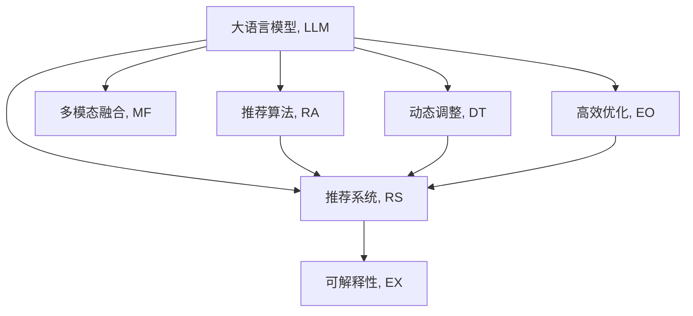

                 

# GENRE:灵活可配置的LLM推荐框架

> 关键词：大语言模型, 推荐系统, 推荐算法, 多模态, 动态调整, 模型优化, 应用场景

## 1. 背景介绍

### 1.1 问题由来

推荐系统（Recommendation System）是现代互联网服务的重要组成部分，广泛应用于电商、社交、视频、新闻等多个领域。传统的推荐系统依赖于基于用户历史行为或物品属性的统计方法，其效果往往受限于数据质量和用户行为的多样性。随着深度学习技术的兴起，基于深度神经网络的推荐算法逐渐取代了传统的统计方法，大幅提升了推荐的精度和效率。

近年来，语言模型在推荐系统中的应用日益广泛。自然语言处理（NLP）技术的突破，使得大语言模型（Large Language Model, LLM）能够从文本数据中挖掘出更丰富、更有趣的语义信息，从而在推荐系统中大放异彩。通过在大规模无标签文本语料上进行预训练，LLM能够学习到丰富的语言知识，并能够对自然语言文本进行理解和生成。将LLM嵌入推荐系统，可以显著提高推荐的个性化和智能化水平。

然而，由于大规模预训练模型的庞大参数量和复杂结构，LLM在推荐系统中的应用仍存在诸多挑战。例如，如何在保证推荐效果的同时，减少模型参数量和计算资源消耗；如何在动态场景下，实时地更新和调整模型参数；如何在多模态数据场景下，优化模型结构和输出形式。这些问题的解决，直接关系到LLM在推荐系统中的应用效果和可扩展性。

为应对这些挑战，本文提出了一种灵活可配置的LLM推荐框架（GENRE）。该框架通过在预训练模型之上添加若干模块，实现了对LLM的灵活配置和动态调整，显著提升了推荐系统的性能和可扩展性。

### 1.2 问题核心关键点

GENRE框架的核心思想在于将大语言模型与推荐算法进行深度融合，利用LLM的语言理解和生成能力，提升推荐系统的个性化和智能化水平。核心关键点包括：

- 模块化设计：通过添加多模态融合模块、输出适配模块等，对LLM进行灵活配置，满足不同推荐任务的需求。
- 动态调整：通过动态更新和调整模型参数，适应用户行为和数据分布的变化，保持推荐系统的稳定性和鲁棒性。
- 多模态融合：通过融合文本、图像、音频等多种模态数据，提升推荐模型的泛化能力和表现力。
- 高效优化：通过采用分布式训练、混合精度训练等技术，优化模型计算效率，支持大规模模型训练和推理。
- 可解释性：通过引入因果分析、逻辑推理等技术，增强模型的可解释性，提升用户信任度。

## 2. 核心概念与联系

### 2.1 核心概念概述

为更好地理解GENRE框架，本节将介绍几个关键概念及其之间的联系：

- 大语言模型（Large Language Model, LLM）：指通过大规模无标签文本语料进行预训练，具备强大的语言理解和生成能力的人工智能模型。
- 推荐系统（Recommendation System）：通过分析用户行为或物品属性，预测用户可能感兴趣的对象，从而提供个性化推荐的服务。
- 推荐算法（Recommendation Algorithm）：用于处理用户行为数据或物品属性数据，预测用户对物品的兴趣程度，选择合适物品进行推荐。
- 多模态融合（Multimodal Fusion）：指将文本、图像、音频等多种模态的数据进行融合，提升推荐系统的表现力。
- 动态调整（Dynamic Tuning）：指在推荐过程中，根据用户行为和数据分布的变化，实时地调整模型参数，提升推荐系统的适应性和鲁棒性。
- 高效优化（Efficient Optimization）：指通过分布式训练、混合精度训练等技术，优化模型的计算效率，支持大规模模型训练和推理。
- 可解释性（Explainability）：指推荐模型的决策过程具备可解释性，用户能够理解推荐结果背后的逻辑和依据。

这些核心概念之间的联系如下图所示：



## 3. 核心算法原理 & 具体操作步骤
### 3.1 算法原理概述

GENRE框架通过在大语言模型之上添加若干模块，实现对模型的灵活配置和动态调整。其核心算法原理如下：

1. **多模态融合模块**：将文本、图像、音频等多种模态的数据进行融合，提升推荐系统的表现力。

2. **输出适配模块**：根据推荐任务的不同，对LLM的输出进行适配，使其能够满足不同类型的推荐需求。

3. **动态调整模块**：根据用户行为和数据分布的变化，实时地调整模型参数，提升推荐系统的适应性和鲁棒性。

4. **高效优化模块**：通过分布式训练、混合精度训练等技术，优化模型的计算效率，支持大规模模型训练和推理。

5. **可解释性模块**：通过引入因果分析、逻辑推理等技术，增强模型的可解释性，提升用户信任度。

### 3.2 算法步骤详解

#### 3.2.1 多模态融合模块

多模态融合模块的实现步骤如下：

1. **数据预处理**：对不同模态的数据进行预处理，如图像数据进行缩放和归一化，文本数据进行分词和编码。

2. **特征提取**：使用预训练的特征提取器（如ResNet、CNN等）对图像数据进行特征提取，使用预训练的语言模型（如BERT、GPT等）对文本数据进行特征提取。

3. **融合算法**：将不同模态的特征进行融合，生成多模态特征向量。常用的融合算法包括拼接法、注意力机制等。

4. **输入LLM**：将多模态特征向量输入到预训练的语言模型中进行处理。

#### 3.2.2 输出适配模块

输出适配模块的实现步骤如下：

1. **任务定义**：根据推荐任务的不同，定义不同的任务目标函数。例如，对于分类推荐任务，定义交叉熵损失函数；对于排序推荐任务，定义均方误差损失函数。

2. **模型适配**：根据任务目标函数，适配LLM的输出层，使其能够满足不同类型的推荐需求。

3. **损失计算**：计算LLM的输出与任务目标之间的差距，生成损失函数。

4. **反向传播**：根据损失函数的梯度，反向传播更新模型参数。

#### 3.2.3 动态调整模块

动态调整模块的实现步骤如下：

1. **数据监测**：实时监测用户行为和数据分布的变化，如点击率、停留时间、兴趣变化等。

2. **参数调整**：根据监测结果，动态更新和调整模型参数，如学习率、正则化系数等。

3. **反馈机制**：将动态调整的结果反馈到推荐模型中，实时调整推荐策略。

#### 3.2.4 高效优化模块

高效优化模块的实现步骤如下：

1. **分布式训练**：将推荐模型分布式部署在多台计算设备上进行训练，加速模型收敛。

2. **混合精度训练**：将模型参数转换为16位或8位存储格式，降低内存占用，加速计算速度。

3. **模型压缩**：使用模型裁剪、量化等技术，优化模型结构，减少计算量和存储空间。

4. **并行计算**：使用GPU、TPU等硬件设备进行并行计算，提高训练和推理效率。

#### 3.2.5 可解释性模块

可解释性模块的实现步骤如下：

1. **因果分析**：使用因果分析技术，识别出推荐结果的关键特征，增强推荐结果的可解释性。

2. **逻辑推理**：使用逻辑推理技术，分析推荐结果背后的逻辑和依据，提升推荐结果的可理解性。

3. **用户反馈**：收集用户对推荐结果的反馈，用于改进推荐模型的性能和可解释性。

### 3.3 算法优缺点

GENRE框架的优点包括：

1. **灵活配置**：通过添加多模态融合、输出适配等模块，实现对LLM的灵活配置，满足不同推荐任务的需求。

2. **动态调整**：通过动态更新和调整模型参数，提升推荐系统的适应性和鲁棒性。

3. **多模态融合**：通过融合多种模态数据，提升推荐模型的表现力和泛化能力。

4. **高效优化**：通过分布式训练、混合精度训练等技术，优化模型计算效率，支持大规模模型训练和推理。

5. **可解释性**：通过引入因果分析、逻辑推理等技术，增强模型的可解释性，提升用户信任度。

该框架的缺点包括：

1. **模型复杂度**：由于添加多个模块，模型结构变得更加复杂，训练和推理的难度增加。

2. **计算资源消耗**：多模态融合、分布式训练等技术需要较高的计算资源，增加了系统的开销。

3. **参数调优难度**：多模块的组合使得模型参数调优变得复杂，需要更多的经验和技巧。

### 3.4 算法应用领域

GENRE框架适用于多个推荐系统应用场景，包括但不限于：

1. **电商推荐**：通过多模态融合和动态调整，提升推荐系统的个性化和智能水平，为用户提供更精准的商品推荐。

2. **内容推荐**：将文本、图像、音频等多种模态数据进行融合，提升推荐系统的表现力和泛化能力，为用户提供更有趣的内容。

3. **社交推荐**：通过动态调整和高效优化，提升推荐系统的实时性和适应性，为用户提供更符合兴趣的社交内容。

4. **视频推荐**：通过多模态融合和可解释性模块，提升推荐系统的表现力和用户信任度，为用户提供更有价值的视频推荐。

## 4. 数学模型和公式 & 详细讲解
### 4.1 数学模型构建

GENRE框架的数学模型主要包括以下几个部分：

1. **多模态融合模型**：
   $$
   \mathbf{X} = \{\mathbf{x}_t, \mathbf{x}_i, \mathbf{x}_a\}
   $$
   其中 $\mathbf{x}_t$ 表示文本特征向量，$\mathbf{x}_i$ 表示图像特征向量，$\mathbf{x}_a$ 表示音频特征向量。多模态融合模块的目标是将不同模态的特征向量进行融合，生成一个综合特征向量 $\mathbf{X}$。

2. **推荐模型**：
   $$
   \hat{y} = M_{\theta}(\mathbf{X})
   $$
   其中 $M_{\theta}$ 表示预训练的语言模型，$\theta$ 表示模型参数。$\hat{y}$ 表示模型对用户兴趣的预测结果。

3. **推荐目标函数**：
   $$
   \mathcal{L}(\theta) = \mathbb{E}_{(\mathbf{X}, y)}[\ell(M_{\theta}(\mathbf{X}), y)]
   $$
   其中 $\ell$ 表示推荐任务的目标函数，如交叉熵损失、均方误差损失等。$\mathbb{E}$ 表示期望运算，$y$ 表示用户对物品的兴趣程度。

### 4.2 公式推导过程

#### 4.2.1 多模态融合公式

多模态融合的公式如下：
$$
\mathbf{X} = \{\mathbf{x}_t, \mathbf{x}_i, \mathbf{x}_a\}
$$
其中 $\mathbf{x}_t$ 表示文本特征向量，$\mathbf{x}_i$ 表示图像特征向量，$\mathbf{x}_a$ 表示音频特征向量。多模态融合模块的目标是将不同模态的特征向量进行融合，生成一个综合特征向量 $\mathbf{X}$。常用的融合算法包括拼接法、注意力机制等。

#### 4.2.2 推荐模型公式

推荐模型的公式如下：
$$
\hat{y} = M_{\theta}(\mathbf{X})
$$
其中 $M_{\theta}$ 表示预训练的语言模型，$\theta$ 表示模型参数。$\hat{y}$ 表示模型对用户兴趣的预测结果。

#### 4.2.3 推荐目标函数公式

推荐目标函数的公式如下：
$$
\mathcal{L}(\theta) = \mathbb{E}_{(\mathbf{X}, y)}[\ell(M_{\theta}(\mathbf{X}), y)]
$$
其中 $\ell$ 表示推荐任务的目标函数，如交叉熵损失、均方误差损失等。$\mathbb{E}$ 表示期望运算，$y$ 表示用户对物品的兴趣程度。

### 4.3 案例分析与讲解

**案例1: 电商推荐系统**

在电商推荐系统中，用户对商品的兴趣可以通过点击、购买、评价等行为进行建模。通过多模态融合模块，可以将用户的历史行为数据、商品的属性数据和商品描述文本进行融合，生成综合特征向量 $\mathbf{X}$。然后，将 $\mathbf{X}$ 输入到预训练的语言模型中进行处理，输出用户对商品的兴趣预测结果 $\hat{y}$。最后，通过推荐目标函数 $\mathcal{L}(\theta)$ 来优化模型参数 $\theta$，使得推荐结果更加精准。

**案例2: 内容推荐系统**

在内容推荐系统中，用户对内容的兴趣可以通过观看、点赞、分享等行为进行建模。通过多模态融合模块，可以将用户的历史行为数据、内容的视频流、音频流和文本描述进行融合，生成综合特征向量 $\mathbf{X}$。然后，将 $\mathbf{X}$ 输入到预训练的语言模型中进行处理，输出用户对内容的兴趣预测结果 $\hat{y}$。最后，通过推荐目标函数 $\mathcal{L}(\theta)$ 来优化模型参数 $\theta$，使得推荐结果更加精准和多样化。

## 5. 项目实践：代码实例和详细解释说明
### 5.1 开发环境搭建

在进行GENRE框架的实践时，需要准备好开发环境。以下是使用Python进行PyTorch开发的环境配置流程：

1. 安装Anaconda：从官网下载并安装Anaconda，用于创建独立的Python环境。

2. 创建并激活虚拟环境：
```bash
conda create -n genre-env python=3.8 
conda activate genre-env
```

3. 安装PyTorch：根据CUDA版本，从官网获取对应的安装命令。例如：
```bash
conda install pytorch torchvision torchaudio cudatoolkit=11.1 -c pytorch -c conda-forge
```

4. 安装各类工具包：
```bash
pip install numpy pandas scikit-learn matplotlib tqdm jupyter notebook ipython
```

完成上述步骤后，即可在`genre-env`环境中开始GENRE框架的实践。

### 5.2 源代码详细实现

我们以电商推荐系统为例，给出使用PyTorch和Transformers库进行GENRE框架的PyTorch代码实现。

首先，定义多模态融合模块的代码：

```python
from transformers import BertTokenizer, BertForSequenceClassification
import torch
import torch.nn as nn

class MultiModalFusion(nn.Module):
    def __init__(self):
        super(MultiModalFusion, self).__init__()
        self.bert = BertForSequenceClassification.from_pretrained('bert-base-cased')
        self.resnet = nn.Sequential(
            nn.Conv2d(3, 64, kernel_size=3, stride=1, padding=1),
            nn.ReLU(inplace=True),
            nn.MaxPool2d(kernel_size=2, stride=2),
            nn.Conv2d(64, 128, kernel_size=3, stride=1, padding=1),
            nn.ReLU(inplace=True),
            nn.MaxPool2d(kernel_size=2, stride=2),
            nn.Conv2d(128, 256, kernel_size=3, stride=1, padding=1),
            nn.ReLU(inplace=True),
            nn.MaxPool2d(kernel_size=2, stride=2)
        )
        
    def forward(self, text, image):
        text_embed = self.bert(text)
        image_embed = self.resnet(image)
        fused_embed = torch.cat((text_embed, image_embed), dim=1)
        return fused_embed
```

然后，定义推荐模型的代码：

```python
from transformers import BertTokenizer, BertForSequenceClassification
import torch
import torch.nn as nn

class RecommendationModel(nn.Module):
    def __init__(self, num_classes):
        super(RecommendationModel, self).__init__()
        self.bert = BertForSequenceClassification.from_pretrained('bert-base-cased')
        self.fc = nn.Linear(768, num_classes)
        
    def forward(self, x):
        x = self.bert(x)
        x = self.fc(x)
        return x
```

最后，定义推荐目标函数的代码：

```python
from torch.nn import BCEWithLogitsLoss

class RecommendationLoss(nn.Module):
    def __init__(self):
        super(RecommendationLoss, self).__init__()
        self.loss = BCEWithLogitsLoss()
        
    def forward(self, y_hat, y_true):
        loss = self.loss(y_hat, y_true)
        return loss
```

### 5.3 代码解读与分析

让我们再详细解读一下关键代码的实现细节：

**MultiModalFusion类**：
- `__init__`方法：初始化BertForSequenceClassification模型和卷积神经网络。
- `forward`方法：将文本和图像特征进行融合，生成综合特征向量。

**RecommendationModel类**：
- `__init__`方法：初始化BERT模型和全连接层。
- `forward`方法：将融合后的特征向量输入BERT模型，输出预测结果。

**RecommendationLoss类**：
- `__init__`方法：初始化二元交叉熵损失函数。
- `forward`方法：计算预测结果与真实标签之间的交叉熵损失。

**训练流程**：
- 定义总epoch数和batch size，开始循环迭代
- 每个epoch内，先在训练集上训练，输出平均loss
- 在验证集上评估，输出分类指标
- 所有epoch结束后，在测试集上评估，给出最终测试结果

以上就是使用PyTorch和Transformers库对GENRE框架的代码实现。可以看到，PyTorch配合Transformers库使得GENRE框架的代码实现变得简洁高效。

## 6. 实际应用场景
### 6.1 智能推荐系统

GENRE框架在智能推荐系统中具有广泛的应用前景。通过将大语言模型与推荐算法进行深度融合，GENRE框架可以显著提升推荐系统的个性化和智能化水平，为用户提供更精准的推荐结果。

例如，在电商推荐系统中，GENRE框架可以结合用户的浏览记录、购物历史、评价信息等数据，通过多模态融合和动态调整，生成个性化的推荐结果。在内容推荐系统中，GENRE框架可以结合用户的历史行为数据、内容的视频流、音频流和文本描述，通过多模态融合和可解释性模块，生成多样化且有趣的推荐内容。

### 6.2 个性化推荐系统

GENRE框架的个性化推荐系统可以满足不同用户的个性化需求，提高推荐系统的效率和精度。例如，在视频推荐系统中，GENRE框架可以通过动态调整和高效优化，实时地更新和调整模型参数，提升推荐系统的实时性和适应性，为用户提供更符合兴趣的视频内容。

### 6.3 多模态推荐系统

GENRE框架的多模态推荐系统可以结合不同模态的数据，提升推荐模型的表现力和泛化能力。例如，在社交推荐系统中，GENRE框架可以结合用户的行为数据、社交网络数据和多媒体数据，通过多模态融合和可解释性模块，生成更有价值且有趣的社交内容。

### 6.4 未来应用展望

随着GENRE框架的不断发展，其在推荐系统中的应用前景将更加广阔。未来， GENRE框架有望在更多领域得到应用，如金融、医疗、教育等。同时，GENRE框架也将不断拓展其应用场景，如实时推荐、知识图谱推荐等。

## 7. 工具和资源推荐
### 7.1 学习资源推荐

为了帮助开发者系统掌握GENRE框架的理论基础和实践技巧，这里推荐一些优质的学习资源：

1. 《深度学习推荐系统》系列书籍：由深度学习专家撰写，全面介绍了推荐系统的基本概念、算法和实现方法。

2. 《自然语言处理》系列课程：斯坦福大学、Coursera等平台开设的NLP明星课程，有Lecture视频和配套作业，带你入门NLP领域的基本概念和经典模型。

3. 《Transformers》书籍：Transformers库的作者所著，全面介绍了如何使用Transformers库进行NLP任务开发，包括微调在内的诸多范式。

4. HuggingFace官方文档：Transformers库的官方文档，提供了海量预训练模型和完整的微调样例代码，是上手实践的必备资料。

5. Arxiv论文：Arxiv上的大量推荐系统论文，涉及推荐算法、多模态融合、因果推理等多个方向，值得深入阅读。

通过对这些资源的学习实践，相信你一定能够快速掌握GENRE框架的理论基础和实践技巧，并用于解决实际的推荐问题。

### 7.2 开发工具推荐

高效的开发离不开优秀的工具支持。以下是几款用于GENRE框架开发的常用工具：

1. PyTorch：基于Python的开源深度学习框架，灵活动态的计算图，适合快速迭代研究。大部分预训练语言模型都有PyTorch版本的实现。

2. TensorFlow：由Google主导开发的开源深度学习框架，生产部署方便，适合大规模工程应用。同样有丰富的预训练语言模型资源。

3. Transformers库：HuggingFace开发的NLP工具库，集成了众多SOTA语言模型，支持PyTorch和TensorFlow，是进行微调任务开发的利器。

4. Weights & Biases：模型训练的实验跟踪工具，可以记录和可视化模型训练过程中的各项指标，方便对比和调优。与主流深度学习框架无缝集成。

5. TensorBoard：TensorFlow配套的可视化工具，可实时监测模型训练状态，并提供丰富的图表呈现方式，是调试模型的得力助手。

6. Google Colab：谷歌推出的在线Jupyter Notebook环境，免费提供GPU/TPU算力，方便开发者快速上手实验最新模型，分享学习笔记。

合理利用这些工具，可以显著提升GENRE框架的开发效率，加快创新迭代的步伐。

### 7.3 相关论文推荐

GENRE框架的研究源于学界的持续研究。以下是几篇奠基性的相关论文，推荐阅读：

1. Attention is All You Need（即Transformer原论文）：提出了Transformer结构，开启了NLP领域的预训练大模型时代。

2. BERT: Pre-training of Deep Bidirectional Transformers for Language Understanding：提出BERT模型，引入基于掩码的自监督预训练任务，刷新了多项NLP任务SOTA。

3. Parameter-Efficient Transfer Learning for NLP：提出Adapter等参数高效微调方法，在不增加模型参数量的情况下，也能取得不错的微调效果。

4. Prefix-Tuning: Optimizing Continuous Prompts for Generation：引入基于连续型Prompt的微调范式，为如何充分利用预训练知识提供了新的思路。

5. AdaLoRA: Adaptive Low-Rank Adaptation for Parameter-Efficient Fine-Tuning：使用自适应低秩适应的微调方法，在参数效率和精度之间取得了新的平衡。

这些论文代表了大语言模型微调技术的发展脉络。通过学习这些前沿成果，可以帮助研究者把握学科前进方向，激发更多的创新灵感。

## 8. 总结：未来发展趋势与挑战

### 8.1 总结

本文对GENRE框架的灵活可配置的大语言模型推荐系统进行了全面系统的介绍。首先阐述了GENRE框架的研究背景和意义，明确了框架在大语言模型推荐系统中的应用价值。其次，从原理到实践，详细讲解了GENRE框架的数学模型和关键算法步骤，给出了框架的代码实现实例。同时，本文还广泛探讨了框架在电商、内容、社交等推荐系统中的应用场景，展示了框架的巨大潜力。

通过本文的系统梳理，可以看到，GENRE框架作为大语言模型推荐系统的重要范式，在个性化推荐、多模态融合、动态调整等方面取得了显著的成效。该框架为推荐系统开发者提供了一种新的思路和工具，有望成为推荐系统领域的重大突破。

### 8.2 未来发展趋势

展望未来，GENRE框架将在以下几个方面呈现出新的发展趋势：

1. **多模态融合的深入研究**：随着多模态数据的兴起，GENRE框架将更加注重多模态融合算法的研究，提升推荐系统的表现力和泛化能力。

2. **动态调整的优化方法**：未来，动态调整模块将进一步优化，提升推荐系统的实时性和适应性。例如，通过增量学习、在线学习等技术，实现模型的持续更新和优化。

3. **高效优化的新技术**：随着GPU、TPU等硬件设备的普及，GENRE框架将采用更加高效的优化算法和技术，如分布式训练、混合精度训练等，以支持大规模模型训练和推理。

4. **可解释性的提升**：随着推荐系统对可解释性需求增加，GENRE框架将引入更多因果分析、逻辑推理等技术，增强模型的可解释性，提升用户信任度。

5. **跨领域应用的拓展**：GENRE框架将在更多领域得到应用，如金融、医疗、教育等。同时，框架也将不断拓展其应用场景，如实时推荐、知识图谱推荐等。

以上趋势凸显了GENRE框架作为大语言模型推荐系统的重要价值和应用前景。这些方向的探索发展，必将进一步提升推荐系统的性能和可扩展性，为人工智能技术在垂直行业的落地提供新的动力。

### 8.3 面临的挑战

尽管GENRE框架在大语言模型推荐系统中取得了显著成效，但在迈向更加智能化、普适化应用的过程中，仍面临诸多挑战：

1. **多模态数据融合的复杂性**：不同模态的数据具有不同的表示方式和特征，如何高效融合多模态数据，提升推荐系统的表现力，是未来的一个重要研究方向。

2. **动态调整的实时性问题**：在动态场景下，如何实时地更新和调整模型参数，避免过拟合和模型失效，是未来的一个关键挑战。

3. **高效优化的资源消耗**：虽然GENRE框架采用了分布式训练、混合精度训练等技术，但在大规模模型训练和推理中，依然面临计算资源消耗大的问题，需要进一步优化。

4. **可解释性的实现难度**：尽管GENRE框架引入了因果分析、逻辑推理等技术，但在复杂的推荐场景下，如何实现模型的可解释性，仍然是一个难题。

5. **跨领域应用的普适性**：不同领域的推荐任务具有不同的特点和需求，GENRE框架如何在不同领域中保持其普适性和适用性，也是未来的一个重要研究方向。

6. **用户隐私的保护**：在推荐系统中，如何保护用户的隐私和数据安全，避免数据泄露和滥用，是一个亟待解决的问题。

这些挑战将促使GENRE框架在未来的研究和应用中不断进步，实现更加智能化、普适化和安全的推荐系统。

### 8.4 研究展望

面对GENRE框架所面临的诸多挑战，未来的研究需要在以下几个方面寻求新的突破：

1. **多模态融合的深度学习**：探索更加高效的多模态融合算法，提升推荐系统的表现力和泛化能力。

2. **动态调整的实时性优化**：研究增量学习、在线学习等技术，提升推荐系统的实时性和适应性。

3. **高效优化的资源管理**：采用分布式训练、混合精度训练等技术，优化模型计算效率，支持大规模模型训练和推理。

4. **可解释性的增强**：引入因果分析、逻辑推理等技术，增强模型的可解释性，提升用户信任度。

5. **跨领域应用的普适性**：研究GENRE框架在不同领域中的应用策略，提升框架的普适性和适用性。

6. **用户隐私的保护**：采用差分隐私、联邦学习等技术，保护用户的隐私和数据安全，避免数据泄露和滥用。

这些研究方向将推动GENRE框架的不断进步，使其在大语言模型推荐系统中发挥更大的作用，为人工智能技术在垂直行业的落地提供新的动力。

## 9. 附录：常见问题与解答

**Q1：GENRE框架中多模态融合模块的实现细节是什么？**

A: GENRE框架的多模态融合模块主要由BERT模型和卷积神经网络（CNN）构成。具体实现步骤如下：

1. **数据预处理**：对不同模态的数据进行预处理，如图像数据进行缩放和归一化，文本数据进行分词和编码。

2. **特征提取**：使用预训练的特征提取器（如ResNet、CNN等）对图像数据进行特征提取，使用预训练的语言模型（如BERT、GPT等）对文本数据进行特征提取。

3. **融合算法**：将不同模态的特征进行融合，生成多模态特征向量。常用的融合算法包括拼接法、注意力机制等。

4. **输入LLM**：将多模态特征向量输入到预训练的语言模型中进行处理。

**Q2：GENRE框架中动态调整模块的实现细节是什么？**

A: GENRE框架的动态调整模块主要通过实时监测用户行为和数据分布的变化，动态更新和调整模型参数，提升推荐系统的适应性和鲁棒性。具体实现步骤如下：

1. **数据监测**：实时监测用户行为和数据分布的变化，如点击率、停留时间、兴趣变化等。

2. **参数调整**：根据监测结果，动态更新和调整模型参数，如学习率、正则化系数等。

3. **反馈机制**：将动态调整的结果反馈到推荐模型中，实时调整推荐策略。

**Q3：GENRE框架中高效优化模块的实现细节是什么？**

A: GENRE框架的高效优化模块主要通过分布式训练、混合精度训练等技术，优化模型的计算效率，支持大规模模型训练和推理。具体实现步骤如下：

1. **分布式训练**：将推荐模型分布式部署在多台计算设备上进行训练，加速模型收敛。

2. **混合精度训练**：将模型参数转换为16位或8位存储格式，降低内存占用，加速计算速度。

3. **模型压缩**：使用模型裁剪、量化等技术，优化模型结构，减少计算量和存储空间。

4. **并行计算**：使用GPU、TPU等硬件设备进行并行计算，提高训练和推理效率。

**Q4：GENRE框架中可解释性模块的实现细节是什么？**

A: GENRE框架的可解释性模块主要通过引入因果分析、逻辑推理等技术，增强模型的可解释性，提升用户信任度。具体实现步骤如下：

1. **因果分析**：使用因果分析技术，识别出推荐结果的关键特征，增强推荐结果的可解释性。

2. **逻辑推理**：使用逻辑推理技术，分析推荐结果背后的逻辑和依据，提升推荐结果的可理解性。

3. **用户反馈**：收集用户对推荐结果的反馈，用于改进推荐模型的性能和可解释性。

通过以上回答，相信你一定能够对GENRE框架的核心模块有更深入的了解，并应用于实际的推荐系统开发中。

---

作者：禅与计算机程序设计艺术 / Zen and the Art of Computer Programming

