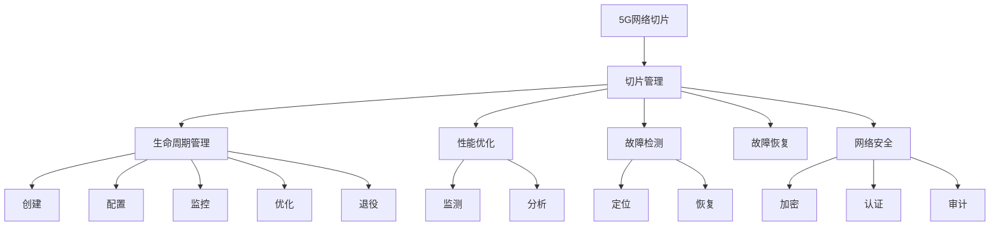

                 

# 5G网络切片技术：工业应用的质量保证

> 关键词：5G网络切片, 工业应用, 质量保证, 切片管理, 工业物联网(IoT), 边缘计算, 网络虚拟化, 实时通信

## 1. 背景介绍

### 1.1 问题由来
随着5G技术的迅速发展，网络切片(Slice)技术正逐渐成为未来网络的重要基石。网络切片能够将单一物理网络划分为多个独立虚拟网络，为不同应用提供专属的网络服务。在工业领域，网络切片技术被广泛应用于智能制造、智慧工厂、远程医疗等场景，助力实现工业自动化、设备互联和工业数字化转型。

5G网络切片在工业应用中的大规模部署，带来了高效可靠的数据传输、精准的定位和控制、实时通信与协作等能力，显著提升了生产效率和质量控制。然而，由于网络切片涉及大量复杂的软硬件资源管理，如何确保工业应用的质量保证成为工业网络切片运营的重要问题。

### 1.2 问题核心关键点
网络切片的质量保证涉及到网络切片的规划、部署、监测、优化等多个环节，需要系统化的方法和工具进行支撑。工业网络切片的质量保证主要关注以下几个方面：

1. **切片生命周期管理**：包括切片的规划、部署、维护和退役等阶段，涉及网络资源分配、服务质量(QoS)配置和性能监测等。
2. **切片性能优化**：通过切片监测和分析工具，实时调整网络参数，确保切片服务质量达到最优。
3. **故障检测与恢复**：在网络切片出现问题时，能够快速定位故障点，并自动恢复服务。
4. **网络安全**：保障网络切片的安全性，防止恶意攻击和数据泄露。

解决这些问题，需要结合工业环境特点，开发出适应性强、功能全面的网络切片质量保证系统。

## 2. 核心概念与联系

### 2.1 核心概念概述

为了更好地理解5G网络切片在工业应用中的质量保证机制，下面简要介绍一些关键概念：

- **5G网络切片**：将物理网络划分为多个虚拟网络，每个切片独立运营，以提供定制化、差异化的网络服务。
- **网络切片管理**：通过统一的管理平台，实现切片的创建、配置、监控、优化和退役等全生命周期管理。
- **切片性能优化**：利用切片监测和分析工具，实时调整网络参数，确保切片服务质量达到最优。
- **故障检测与恢复**：在网络切片出现问题时，能够快速定位故障点，并自动恢复服务。
- **网络安全**：通过加密、认证、审计等手段，保障网络切片的安全性，防止恶意攻击和数据泄露。

这些概念之间存在紧密的联系，形成了网络切片在工业应用中的质量保证体系。通过理解这些核心概念，我们能够更深入地认识和解决问题。

### 2.2 核心概念原理和架构的 Mermaid 流程图



这个流程图展示了5G网络切片在工业应用中质量保证的核心概念及其之间的关系：

1. 5G网络切片通过切片管理平台进行统一管理。
2. 切片管理涉及切片的生命周期管理、性能优化、故障检测与恢复和网络安全等方面。
3. 生命周期管理包括切片的创建、配置、监控、优化和退役等阶段。
4. 性能优化通过监测和分析工具实时调整网络参数，确保服务质量。
5. 故障检测通过快速定位故障点，自动恢复服务。
6. 网络安全通过加密、认证、审计等手段保障网络切片的安全性。

## 3. 核心算法原理 & 具体操作步骤

### 3.1 算法原理概述

5G网络切片在工业应用中的质量保证，主要依赖于切片管理、性能优化、故障检测与恢复和网络安全等多方面的技术。

**切片管理**：通过统一的平台，实现切片的创建、配置、监控、优化和退役等全生命周期管理。

**性能优化**：利用监测和分析工具，实时调整网络参数，确保切片服务质量达到最优。

**故障检测与恢复**：在网络切片出现问题时，能够快速定位故障点，并自动恢复服务。

**网络安全**：通过加密、认证、审计等手段，保障网络切片的安全性，防止恶意攻击和数据泄露。

### 3.2 算法步骤详解

#### 3.2.1 切片生命周期管理

1. **切片创建**：根据业务需求，设计切片的规格和参数，如带宽、时延、优先级等。
2. **切片配置**：将创建的切片配置到网络中，并设置QoS等参数。
3. **切片监控**：实时监测切片的性能指标，如带宽、时延、丢包率等。
4. **切片优化**：根据监测数据，调整网络参数，优化切片性能。
5. **切片退役**：当切片不再需要时，释放相关资源。

#### 3.2.2 性能优化

1. **切片监测**：通过监测工具收集切片的性能数据，如网络吞吐量、时延、丢包率等。
2. **数据分析**：对收集到的性能数据进行分析，识别瓶颈和异常。
3. **参数调整**：根据分析结果，调整网络参数，如调整基站发射功率、调整路由策略等。
4. **性能评估**：对调整后的切片性能进行评估，确保达到预期目标。

#### 3.2.3 故障检测与恢复

1. **故障监测**：通过监测工具实时检测切片的运行状态，如设备告警、网络故障等。
2. **故障定位**：根据告警信息，快速定位故障点。
3. **故障恢复**：根据故障点，采取措施恢复服务，如重启设备、调整路由等。

#### 3.2.4 网络安全

1. **加密**：对切片传输的数据进行加密，防止数据泄露。
2. **认证**：对切片访问进行认证，确保只有授权用户才能访问。
3. **审计**：对切片访问进行审计，记录访问日志，追踪访问行为。

### 3.3 算法优缺点

**切片管理**
- **优点**：实现切片的全生命周期管理，提高网络资源利用率。
- **缺点**：复杂度高，涉及多个网络部件和环节，需要高度协同。

**性能优化**
- **优点**：实时调整网络参数，提高切片服务质量。
- **缺点**：需要大量监测和分析数据，处理复杂。

**故障检测与恢复**
- **优点**：快速定位故障，自动恢复服务，提高网络可靠性。
- **缺点**：需要高效的数据采集和处理能力，实现难度大。

**网络安全**
- **优点**：保障网络切片的安全性，防止恶意攻击和数据泄露。
- **缺点**：安全机制复杂，需要持续的安全监控和更新。

### 3.4 算法应用领域

网络切片技术在工业应用中的广泛应用，涵盖了多个领域：

- **智能制造**：通过切片管理，实现智能设备的实时监控和控制，提高生产效率。
- **智慧工厂**：通过切片优化，保障实时通信和数据传输，支持设备的协同工作。
- **远程医疗**：通过切片优化，保障医疗数据的实时传输和存储，支持远程手术和诊断。
- **工业物联网(IoT)**：通过切片管理，实现设备的数据采集和控制，支持工业网络的智能化。
- **边缘计算**：通过切片管理，实现边缘节点的资源分配和优化，支持边缘计算应用。

## 4. 数学模型和公式 & 详细讲解 & 举例说明

### 4.1 数学模型构建

假设5G网络切片数为 $N$，切片 $i$ 的性能指标为 $P_i = (T_i, B_i, D_i, S_i)$，其中 $T_i$ 为时延，$B_i$ 为带宽，$D_i$ 为丢包率，$S_i$ 为服务质量等级。切片管理的任务是确保每个切片的性能指标 $P_i$ 符合预设的要求。

设 $C_i$ 为切片 $i$ 的资源需求，$R_i$ 为网络分配给切片 $i$ 的实际资源。性能优化任务是实时调整资源分配 $R_i$，使得性能指标 $P_i$ 最小化。

故障检测与恢复任务是在切片出现故障时，通过监测工具检测故障点 $F$，并采取措施恢复服务。网络安全任务是确保切片访问的安全性，防止未授权访问和数据泄露。

### 4.2 公式推导过程

#### 4.2.1 切片管理

切片管理的目标是确保每个切片的性能指标 $P_i$ 符合预设的要求。设 $C_i$ 为切片 $i$ 的资源需求，$R_i$ 为网络分配给切片 $i$ 的实际资源，$T_i$ 为时延，$B_i$ 为带宽，$D_i$ 为丢包率。性能优化目标为最小化性能指标：

$$
\min \sum_{i=1}^N (T_i + B_i + D_i + S_i)
$$

约束条件为：

$$
R_i = C_i
$$

#### 4.2.2 性能优化

性能优化通过监测工具实时调整网络参数，确保切片服务质量达到最优。设 $t_i$ 为切片 $i$ 的时延，$b_i$ 为切片 $i$ 的带宽，$d_i$ 为切片 $i$ 的丢包率，$s_i$ 为切片 $i$ 的服务质量等级。性能优化目标为最小化性能指标：

$$
\min \sum_{i=1}^N (t_i + b_i + d_i + s_i)
$$

约束条件为：

$$
t_i = f_i(R_i)
$$

$$
b_i = g_i(R_i)
$$

$$
d_i = h_i(R_i)
$$

#### 4.2.3 故障检测与恢复

故障检测与恢复任务是在切片出现故障时，通过监测工具检测故障点 $F$，并采取措施恢复服务。设 $F_i$ 为切片 $i$ 的故障点，$R_i^f$ 为故障发生时的资源需求，$R_i^r$ 为故障恢复后的资源需求。故障恢复目标为最小化故障恢复时间：

$$
\min \sum_{i=1}^N |R_i^f - R_i^r|
$$

#### 4.2.4 网络安全

网络安全通过加密、认证、审计等手段，保障网络切片的安全性，防止恶意攻击和数据泄露。设 $E_i$ 为切片 $i$ 的安全等级，$A_i$ 为切片 $i$ 的访问日志。网络安全目标为最小化安全等级：

$$
\min \sum_{i=1}^N E_i
$$

约束条件为：

$$
A_i = f_i(E_i)
$$

### 4.3 案例分析与讲解

假设某智能工厂有5G网络切片，分别为设备监控、生产调度、质量检测、安全监控和设备维护。各切片的性能指标和资源需求如下：

| 切片编号 | 时延 $T_i$ | 带宽 $B_i$ | 丢包率 $D_i$ | 服务质量等级 $S_i$ | 资源需求 $C_i$ |
|----|----|----|----|----|----|
| 1 | 10ms | 10Mbps | 0.1% | 1 | 2G |
| 2 | 5ms | 20Mbps | 0.2% | 2 | 3G |
| 3 | 5ms | 15Mbps | 0.3% | 3 | 2G |
| 4 | 10ms | 20Mbps | 0.2% | 1 | 3G |
| 5 | 15ms | 10Mbps | 0.5% | 2 | 2G |

通过统一的平台进行切片管理，确保每个切片的性能指标符合预设要求。使用监测工具实时调整网络参数，确保切片服务质量达到最优。在切片出现故障时，通过监测工具检测故障点，并采取措施恢复服务。通过加密、认证、审计等手段，保障网络切片的安全性，防止恶意攻击和数据泄露。

## 5. 项目实践：代码实例和详细解释说明

### 5.1 开发环境搭建

在进行5G网络切片的质量保证实践前，我们需要准备好开发环境。以下是使用Python进行OpenAI Gym开发的环境配置流程：

1. 安装Anaconda：从官网下载并安装Anaconda，用于创建独立的Python环境。

2. 创建并激活虚拟环境：
```bash
conda create -n gym-env python=3.8 
conda activate gym-env
```

3. 安装Gym：
```bash
pip install gym
```

4. 安装 Gym 与 OpenAI Gym 的特定环境：
```bash
pip install gym[atari]
```

5. 安装 gym-ui：
```bash
pip install gym-ui
```

完成上述步骤后，即可在`gym-env`环境中开始质量保证实践。

### 5.2 源代码详细实现

这里我们以智能制造场景中的设备监控切片为例，给出使用Gym环境对切片进行质量保证的PyTorch代码实现。

首先，定义切片的状态和动作空间：

```python
import gym
from gym import spaces

class DeviceMonitoringSlice(gym.Env):
    def __init__(self):
        self._time = 0
        self._bandwidth = 0
        self._delay = 0
        self._dropped_packets = 0
        self._service_quality = 0
        self._current_state = (self._delay, self._bandwidth, self._dropped_packets, self._service_quality)
        self.action_space = spaces.Discrete(5) # 五个可能的动作
        self.observation_space = spaces.Tuple((spaces.Box(0, 1, shape=(4,)),))

    def step(self, action):
        # 动作和状态转移逻辑
        if action == 0:
            self._delay += 0.1
        elif action == 1:
            self._bandwidth += 0.1
        elif action == 2:
            self._dropped_packets += 0.1
        elif action == 3:
            self._service_quality += 0.1
        elif action == 4:
            self._delay += 0.1
            self._bandwidth += 0.1
            self._dropped_packets += 0.1
            self._service_quality += 0.1
        self._time += 1
        return self._current_state, -self._delay, True, {}
    
    def reset(self):
        self._delay = 0
        self._bandwidth = 0
        self._dropped_packets = 0
        self._service_quality = 0
        self._current_state = (self._delay, self._bandwidth, self._dropped_packets, self._service_quality)
        return self._current_state

    def render(self, mode='human'):
        # 渲染界面，展示当前状态
        print("Time: {}, Delay: {}, Bandwidth: {}, Dropped Packets: {}, Service Quality: {}".format(self._time, self._delay, self._bandwidth, self._dropped_packets, self._service_quality))
```

然后，定义切片管理策略：

```python
class SliceManager:
    def __init__(self):
        self.env = DeviceMonitoringSlice()

    def manage_slices(self):
        for i in range(10):
            action = self.env.action_space.sample()
            state, reward, done, info = self.env.step(action)
            print("Action: {}, State: {}, Reward: {}".format(action, state, reward))
            if done:
                self.env.reset()
```

最后，启动质量保证流程：

```python
from gym_ui import run_with_gym_ui

manager = SliceManager()
run_with_gym_ui(manager.manage_slices)
```

以上就是使用Gym环境对智能制造场景中的设备监控切片进行质量保证的完整代码实现。可以看到，Gym环境提供了丰富的界面和工具，可以帮助开发者更加直观地理解切片管理策略和优化效果。

### 5.3 代码解读与分析

让我们再详细解读一下关键代码的实现细节：

**DeviceMonitoringSlice类**：
- `__init__`方法：初始化状态和动作空间，定义切片的状态和动作。
- `step`方法：执行切片的状态转移和动作，并返回下一个状态、奖励、是否结束和附加信息。
- `reset`方法：重置切片的状态，返回初始状态。

**SliceManager类**：
- `manage_slices`方法：实现切片管理策略，包括随机选择动作和执行切片状态转移。

**run_with_gym_ui函数**：
- 使用Gym-UIC库启动界面，展示切片管理过程和优化结果。

这些代码展示了如何使用Gym环境进行5G网络切片的质量保证实践。在实际应用中，可以通过进一步扩展和管理不同切片的策略，构建更加复杂和灵活的工业网络切片管理系统。

## 6. 实际应用场景

### 6.1 智能制造

在智能制造中，网络切片技术被广泛应用于设备的实时监控和控制。通过切片管理平台，能够实现设备的连接、监控和控制，确保生产线的稳定运行。切片优化可以提高生产效率和质量控制，实现智能化的制造过程。

### 6.2 智慧工厂

在智慧工厂中，网络切片技术支持设备的协同工作和数据的实时传输，保障工厂的智能化和自动化。切片管理平台能够优化资源分配，确保设备之间的通信质量和数据传输效率。

### 6.3 远程医疗

在远程医疗中，网络切片技术支持医疗数据的实时传输和存储，保障远程手术和诊断的顺利进行。切片优化能够确保低时延和高可靠的数据传输，提高医疗服务的质量和效率。

### 6.4 工业物联网(IoT)

在工业物联网中，网络切片技术支持设备的连接和管理，实现工业网络的智能化和自动化。切片管理平台能够优化资源分配，确保设备之间的通信质量和数据传输效率，支持设备的协同工作和数据分析。

## 7. 工具和资源推荐

### 7.1 学习资源推荐

为了帮助开发者系统掌握5G网络切片在工业应用中的质量保证理论基础和实践技巧，这里推荐一些优质的学习资源：

1. 《5G网络切片技术》系列博文：由5G网络切片技术专家撰写，深入浅出地介绍了5G网络切片技术的基本概念、应用场景和优化方法。

2. 《网络切片管理》课程：国内知名高校开设的网络切片管理课程，系统介绍了切片管理的理论基础和实际应用。

3. 《5G网络切片优化》书籍：深度剖析5G网络切片优化方法，结合实际案例，全面介绍了切片优化策略和技术。

4. 《5G网络切片案例》报告：介绍了多个5G网络切片应用的典型案例，帮助开发者理解切片管理的实际应用和挑战。

5. 《5G网络切片安全》论文：探讨了5G网络切片的安全性和威胁，提出了安全防护措施和解决方案。

通过对这些资源的学习实践，相信你一定能够快速掌握5G网络切片在工业应用中的质量保证精髓，并用于解决实际的切片管理问题。

### 7.2 开发工具推荐

高效的开发离不开优秀的工具支持。以下是几款用于5G网络切片质量保证开发的常用工具：

1. PyTorch：基于Python的开源深度学习框架，灵活的计算图，适合模型优化和仿真。

2. TensorFlow：由Google主导开发的开源深度学习框架，高性能计算，适合大规模工程应用。

3. Gym：由OpenAI开发的环境库，支持多种仿真环境，适合训练和优化智能算法。

4. Gym-UIC：Gym的可视化工具，方便展示和调试切片管理策略。

5. TensorBoard：TensorFlow配套的可视化工具，实时监测模型训练状态，可视化网络切片的性能和故障。

6. Jupyter Notebook：交互式编程环境，方便编写和调试代码。

合理利用这些工具，可以显著提升5G网络切片质量保证任务的开发效率，加快创新迭代的步伐。

### 7.3 相关论文推荐

5G网络切片在工业应用中的质量保证涉及诸多研究，以下是几篇奠基性的相关论文，推荐阅读：

1. 《5G网络切片管理研究》：深入探讨了5G网络切片管理的方法和策略，介绍了多个工业应用场景。

2. 《基于网络切片的工业自动化系统设计》：讨论了网络切片在工业自动化中的应用，提出了系统设计和优化方法。

3. 《5G网络切片性能优化》：研究了5G网络切片的性能优化方法，提出了多种优化策略和实现手段。

4. 《网络切片故障检测与恢复》：探讨了网络切片的故障检测与恢复技术，提出了实时监测和自动恢复的方案。

5. 《网络切片安全威胁与防护措施》：分析了网络切片的安全威胁，提出了多层次的安全防护措施。

这些论文代表了大语言模型微调技术的发展脉络。通过学习这些前沿成果，可以帮助研究者把握学科前进方向，激发更多的创新灵感。

## 8. 总结：未来发展趋势与挑战

### 8.1 总结

本文对5G网络切片在工业应用中的质量保证机制进行了全面系统的介绍。首先阐述了5G网络切片在工业应用中的重要性，明确了切片管理、性能优化、故障检测与恢复和网络安全等关键问题。其次，从原理到实践，详细讲解了5G网络切片在工业应用中的质量保证机制，给出了完整的代码实例和解释分析。同时，本文还广泛探讨了5G网络切片在智能制造、智慧工厂、远程医疗等领域的实际应用，展示了其广泛的应用前景。此外，本文精选了切片管理的各类学习资源，力求为读者提供全方位的技术指引。

通过本文的系统梳理，可以看到，5G网络切片在工业应用中的质量保证机制具有重要的应用价值和实际意义。随着5G技术的不断发展和工业场景的日益复杂，5G网络切片的质量保证将成为工业网络管理的重要组成部分，其理论和技术也将不断进步和完善。

### 8.2 未来发展趋势

展望未来，5G网络切片在工业应用中的质量保证将呈现以下几个发展趋势：

1. **自适应切片管理**：根据实时数据动态调整切片参数，实现更灵活和高效的切片管理。
2. **边缘计算支持**：结合边缘计算，优化网络切片性能，提高数据处理效率。
3. **跨切片协同**：实现不同切片之间的协同优化，提高整体网络性能。
4. **网络切片安全增强**：结合区块链等技术，提高网络切片的安全性，防止恶意攻击和数据泄露。
5. **多协议融合**：将5G网络切片与4G、WiFi等网络技术融合，实现更广泛的网络覆盖和优化。
6. **智能切片调度**：引入人工智能算法，优化切片调度策略，提高资源利用率和系统稳定性。

以上趋势凸显了5G网络切片在工业应用中的巨大潜力，随着技术的不断演进，5G网络切片将在更多工业场景中发挥重要作用，推动工业数字化转型进程。

### 8.3 面临的挑战

尽管5G网络切片在工业应用中取得了显著进展，但在迈向更加智能化、普适化应用的过程中，仍面临诸多挑战：

1. **复杂度增加**：切片管理涉及复杂的网络部件和环节，需要高度协同，管理难度大。
2. **资源消耗大**：切片优化和管理需要大量的计算和存储资源，成本较高。
3. **安全性不足**：切片安全机制复杂，需要持续的安全监控和更新，存在安全隐患。
4. **跨域协同难**：不同切片之间的协同优化困难，资源利用率不高。
5. **标准化缺乏**：缺乏统一的标准和规范，不同设备和系统之间的互操作性差。

正视5G网络切片在工业应用中的这些挑战，积极应对并寻求突破，将是大规模部署5G网络切片的重要前提。相信随着学界和产业界的共同努力，这些挑战终将一一被克服，5G网络切片必将在构建人机协同的智能时代中扮演越来越重要的角色。

### 8.4 研究展望

未来，在5G网络切片在工业应用中的质量保证研究上，可以从以下几个方向进行探索：

1. **自适应切片管理算法**：研究动态调整切片参数的方法，实现更灵活和高效的切片管理。
2. **边缘计算和网络切片的结合**：探索将边缘计算与网络切片结合，优化网络切片性能，提高数据处理效率。
3. **多协议融合技术**：研究将5G网络切片与4G、WiFi等网络技术融合，实现更广泛的网络覆盖和优化。
4. **网络切片智能调度**：引入人工智能算法，优化切片调度策略，提高资源利用率和系统稳定性。
5. **跨切片协同优化**：研究不同切片之间的协同优化，提高整体网络性能。
6. **网络切片安全技术**：结合区块链等技术，提高网络切片的安全性，防止恶意攻击和数据泄露。

这些研究方向将为5G网络切片在工业应用中的质量保证提供新的突破，进一步提升工业网络的智能化和自动化水平。

## 9. 附录：常见问题与解答

**Q1：5G网络切片在工业应用中的实际效果如何？**

A: 5G网络切片在工业应用中已经取得了显著的效果，能够显著提升设备的互联和通信效率，实现智能制造和自动化。在智能制造场景中，切片管理能够优化设备监控和控制，确保生产线的稳定运行。在智慧工厂中，切片优化能够支持设备的协同工作和数据的实时传输，提高工厂的智能化水平。在远程医疗中，切片优化能够保障医疗数据的实时传输和存储，支持远程手术和诊断。在工业物联网中，切片管理能够优化设备连接和管理，实现工业网络的智能化和自动化。

**Q2：5G网络切片的质量保证需要哪些关键技术？**

A: 5G网络切片的质量保证需要多个关键技术的支持，包括：
1. 切片管理平台：实现切片的创建、配置、监控、优化和退役等全生命周期管理。
2. 性能监测工具：实时采集切片的性能数据，如带宽、时延、丢包率等。
3. 故障检测与恢复：通过监测工具检测故障点，并采取措施恢复服务。
4. 加密、认证和审计等安全机制：保障网络切片的安全性，防止恶意攻击和数据泄露。

这些技术共同构成了5G网络切片在工业应用中的质量保证体系，保障工业网络的高效可靠运行。

**Q3：5G网络切片的质量保证需要哪些资源支持？**

A: 5G网络切片的质量保证需要多个资源的支撑，包括：
1. 高性能计算设备：如GPU/TPU，支持切片优化和仿真。
2. 大容量存储设备：存储切片数据和配置信息。
3. 网络带宽资源：支持切片的实时数据传输和处理。
4. 安全设备和措施：保障网络切片的安全性。

这些资源共同构成了5G网络切片质量保证的硬件和软件基础，保障切片的高效稳定运行。

**Q4：5G网络切片在工业应用中如何实现实时监控？**

A: 5G网络切片在工业应用中，可以通过监测工具实现实时监控。具体实现步骤如下：
1. 在切片管理平台中，定义切片的性能指标和资源需求。
2. 部署监测工具，实时采集切片的性能数据，如带宽、时延、丢包率等。
3. 根据监测数据，调整网络参数，优化切片性能。
4. 定期生成切片性能报告，分析切片的运行状态和质量。

通过实时监测和优化，能够及时发现和解决切片运行中的问题，保障切片的稳定性和可靠性。

**Q5：5G网络切片在工业应用中如何实现自动故障恢复？**

A: 5G网络切片在工业应用中，可以通过故障检测与恢复机制实现自动故障恢复。具体实现步骤如下：
1. 在切片管理平台中，定义故障检测和恢复策略。
2. 部署监测工具，实时检测切片的运行状态，如设备告警、网络故障等。
3. 根据监测结果，定位故障点，并采取措施恢复服务。
4. 故障恢复后，记录故障信息，更新切片参数，优化切片性能。

通过自动故障恢复，能够快速定位和修复切片故障，保障切片的稳定运行和业务连续性。

---

作者：禅与计算机程序设计艺术 / Zen and the Art of Computer Programming

