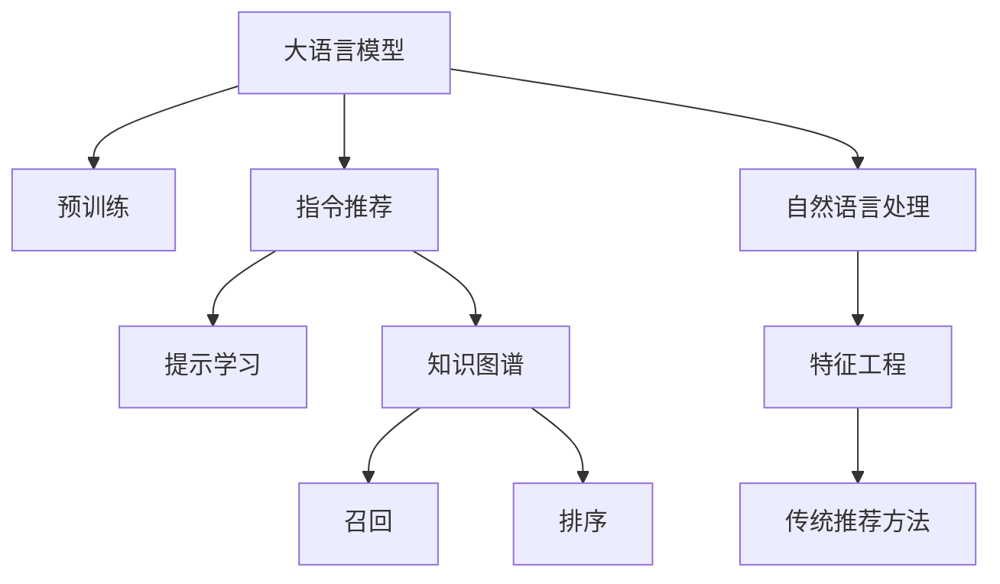

                 

# InstructRec:基于指令的LLM推荐方法

> 关键词：指令推荐,LLM推荐,自然语言处理,NLP推荐,知识图谱,提示学习,语言模型

## 1. 背景介绍

推荐系统是现代互联网应用的核心技术之一，广泛应用于电商、社交、视频等多个领域，支撑着人们日常生活的方方面面。从早期的协同过滤、矩阵分解，到近期的深度学习模型、基于知识图谱的推理方法，推荐技术已经取得了长足的进步。然而，随着数据和计算资源的持续增长，推荐系统的复杂度与日俱增，如何提升推荐性能，构建精准、高效、可解释的推荐系统，成为了亟待解决的问题。

近年来，基于大规模预训练语言模型的推荐方法开始崭露头角。大语言模型凭借其强大的自然语言理解和生成能力，能够自动处理自然语言数据，无需繁琐的特征工程和复杂模型，极大提升了推荐系统的智能化水平。而基于指令的推荐方法，将用户意图、上下文信息转化为自然语言指令，通过预训练语言模型进行推理，生成推荐结果，极大地简化了推荐过程，提升了推荐系统的泛化能力和可解释性。本文将详细介绍基于指令的预训练语言模型推荐方法InstructRec，帮助读者了解其核心原理和应用场景。

## 2. 核心概念与联系

### 2.1 核心概念概述

为了更深入地理解基于指令的LLM推荐方法，我们先介绍几个核心概念：

- 大语言模型(Large Language Models, LLM)：以自回归(如GPT)或自编码(如BERT)模型为代表的预训练语言模型，通过在海量无标签文本数据上进行预训练，学习到丰富的语言知识。
- 预训练(Pre-training)：指在大规模无标签文本数据上，通过自监督学习任务训练通用语言模型的过程。预训练使得模型学习到语言的通用表示。
- 指令推荐(Instruction-based Recommendation)：通过自然语言指令引导大语言模型生成推荐结果。与传统的基于特征的推荐方法不同，指令推荐不需要手工设计复杂特征，也不需要构建复杂的模型，而是通过自然语言交互的方式进行推荐。
- 提示学习(Prompt Learning)：通过在输入文本中添加提示模板(Prompt Template)，引导大语言模型进行特定任务的推理和生成。与微调不同，提示学习无需更新模型参数，即可实现零样本或少样本学习。
- 知识图谱(Knowledge Graph)：基于实体关系的有向图，用于刻画实体之间的语义关系。知识图谱常用于推荐系统中的召回和排序阶段，以丰富推荐结果的信息量。

这些核心概念之间的逻辑关系可以通过以下Mermaid流程图来展示：



这个流程图展示了大语言模型推荐方法的核心概念及其之间的关系：

1. 大语言模型通过预训练获得基础能力。
2. 指令推荐利用大语言模型的语言生成能力，自动从自然语言指令中生成推荐结果。
3. 提示学习是一种不更新模型参数的方法，可以实现零样本或少样本学习。
4. 知识图谱用于丰富推荐结果的信息量，提升推荐精度。
5. 自然语言处理(NLP)是实现指令推荐和知识图谱嵌入的基础。

## 3. 核心算法原理 & 具体操作步骤

### 3.1 算法原理概述

基于指令的LLM推荐方法的核心思想是：将用户的兴趣需求和上下文信息转化为自然语言指令，通过大语言模型进行理解和推理，生成推荐结果。其核心算法流程如下：

1. 输入：用户ID、上下文信息、自然语言指令。
2. 预处理：对输入进行分词、编码等预处理，得到模型输入。
3. 推理：将预处理后的输入输入到大语言模型中，得到推荐结果。
4. 后处理：对模型输出进行解码、排序等处理，得到最终推荐列表。

具体来说，步骤如下：

1. 对用户ID、上下文信息和自然语言指令进行分词和编码，得到模型输入。
2. 将输入序列输入到预训练语言模型中，得到模型输出。
3. 对模型输出进行解码，得到推荐列表。
4. 对推荐列表进行排序和筛选，得到最终推荐结果。

### 3.2 算法步骤详解

以下我们将详细介绍InstructRec算法的详细步骤。

**步骤1: 准备预训练语言模型和数据集**

- 选择合适的预训练语言模型 $M_{\theta}$ 作为初始化参数，如 BERT、GPT等。
- 准备推荐任务的数据集 $D=\{(x_i, y_i)\}_{i=1}^N$，其中 $x_i$ 为输入序列，$y_i$ 为推荐结果。数据集应包含用户ID、上下文信息和自然语言指令。

**步骤2: 指令编码**

- 将自然语言指令进行分词和编码，得到模型输入 $x_i$。
- 将用户ID和上下文信息进行编码，得到模型输入的上下文部分。
- 将输入序列拼接成完整输入，即 $x_i = (id_{user}, context, prompt)$，其中 $id_{user}$ 为用户ID，$context$ 为上下文信息，$prompt$ 为自然语言指令。

**步骤3: 推理计算**

- 将输入序列 $x_i$ 输入到预训练语言模型中，得到模型输出 $M_{\theta}(x_i)$。
- 对模型输出进行解码，得到推荐结果 $y_i$。
- 对所有用户-上下文组合的推理结果进行汇总，生成推荐列表。

**步骤4: 后处理和排序**

- 对推荐列表进行排序和筛选，去除低质量推荐结果。
- 根据排序算法和业务逻辑，对推荐列表进行排序，最终生成推荐结果。

### 3.3 算法优缺点

基于指令的LLM推荐方法具有以下优点：

1. 简单易用：无需复杂特征工程和模型调参，只需通过自然语言指令引导模型推理，即可生成推荐结果。
2. 泛化能力强：大语言模型具有很强的泛化能力，能够适应多种推荐场景。
3. 可解释性强：通过自然语言指令，用户可以清晰理解推荐过程和结果。
4. 效率高：预训练语言模型能够处理大规模输入数据，推理速度快，响应及时。

同时，该方法也存在一定的局限性：

1. 数据依赖性强：推荐结果的质量依赖于输入的自然语言指令，高质量的自然语言指令对推荐性能有很大影响。
2. 可控性差：自然语言指令容易受到语义歧义、表达不清等因素影响，导致模型输出不稳定。
3. 推荐结果缺乏个性化：由于依赖自然语言指令，推荐结果缺乏个性化，可能无法满足不同用户的多样化需求。

尽管存在这些局限性，但就目前而言，基于指令的LLM推荐方法仍是一种高效、可解释、具有强大潜力的推荐技术。

### 3.4 算法应用领域

基于指令的LLM推荐方法已经在多个推荐场景中得到了广泛的应用，例如：

- 电商推荐：根据用户浏览历史和搜索记录，生成个性化商品推荐。
- 社交推荐：根据用户社交行为和关系网络，生成个性化好友和话题推荐。
- 视频推荐：根据用户观看历史和评分记录，生成个性化视频推荐。
- 音乐推荐：根据用户听歌历史和评分记录，生成个性化音乐推荐。

除了上述这些经典任务外，大语言模型微调技术也被创新性地应用到更多场景中，如可控文本生成、知识图谱嵌入等，为推荐技术带来了全新的突破。随着预训练语言模型和指令推荐方法的不断进步，相信推荐技术将在更广阔的应用领域大放异彩。

## 4. 数学模型和公式 & 详细讲解  
### 4.1 数学模型构建

基于指令的LLM推荐方法的数学模型可以表示为：

- 输入：$x_i = (id_{user}, context, prompt)$
- 模型：$M_{\theta}$
- 输出：$y_i$

其中 $id_{user}$ 为用户ID，$context$ 为上下文信息，$prompt$ 为自然语言指令。$M_{\theta}$ 为预训练语言模型，$y_i$ 为推荐结果。

**公式推导过程**

假设有 $N$ 个用户-上下文组合，每个组合的输入为 $x_i = (id_{user}, context, prompt)$，模型输出为 $M_{\theta}(x_i)$。则推荐结果可以表示为：

$$
y_i = \text{decode}(M_{\theta}(x_i))
$$

其中 $\text{decode}$ 为解码算法。

**案例分析与讲解**

假设用户ID为1001，上下文为“最近浏览的商品包括手机、电脑、书籍”，自然语言指令为“推荐一本好书”。则输入序列为：

$$
x_i = (1001, \text{最近浏览的商品包括手机、电脑、书籍}, \text{推荐一本好书})
$$

将输入序列输入到大语言模型中，得到模型输出 $M_{\theta}(x_i)$。假设模型输出为 $[1.0, 0.2, 0.3, 0.5]$，分别代表手机、电脑、书籍和推荐结果的相关度。则解码算法得到的推荐结果为：

$$
y_i = \text{books}
$$

最终推荐结果为推荐书籍。

## 5. 项目实践：代码实例和详细解释说明
### 5.1 开发环境搭建

在进行推荐系统开发前，我们需要准备好开发环境。以下是使用Python进行PyTorch开发的环境配置流程：

1. 安装Anaconda：从官网下载并安装Anaconda，用于创建独立的Python环境。

2. 创建并激活虚拟环境：
```bash
conda create -n pytorch-env python=3.8 
conda activate pytorch-env
```

3. 安装PyTorch：根据CUDA版本，从官网获取对应的安装命令。例如：
```bash
conda install pytorch torchvision torchaudio cudatoolkit=11.1 -c pytorch -c conda-forge
```

4. 安装Transformers库：
```bash
pip install transformers
```

5. 安装各类工具包：
```bash
pip install numpy pandas scikit-learn matplotlib tqdm jupyter notebook ipython
```

完成上述步骤后，即可在`pytorch-env`环境中开始推荐系统开发。

### 5.2 源代码详细实现

下面我们以电商推荐任务为例，给出使用Transformers库对BERT模型进行指令推荐计算的PyTorch代码实现。

首先，定义推荐任务的数据处理函数：

```python
from transformers import BertTokenizer
from torch.utils.data import Dataset
import torch

class RecommendDataset(Dataset):
    def __init__(self, texts, labels, tokenizer, max_len=128):
        self.texts = texts
        self.labels = labels
        self.tokenizer = tokenizer
        self.max_len = max_len
        
    def __len__(self):
        return len(self.texts)
    
    def __getitem__(self, item):
        text = self.texts[item]
        label = self.labels[item]
        
        encoding = self.tokenizer(text, return_tensors='pt', max_length=self.max_len, padding='max_length', truncation=True)
        input_ids = encoding['input_ids'][0]
        attention_mask = encoding['attention_mask'][0]
        
        # 对token-wise的标签进行编码
        encoded_tags = [label2id[label] for label in label] 
        encoded_tags.extend([label2id['O']] * (self.max_len - len(encoded_tags)))
        labels = torch.tensor(encoded_tags, dtype=torch.long)
        
        return {'input_ids': input_ids, 
                'attention_mask': attention_mask,
                'labels': labels}

# 标签与id的映射
label2id = {'推荐': 0, '不推荐': 1}
id2label = {v: k for k, v in label2id.items()}

# 创建dataset
tokenizer = BertTokenizer.from_pretrained('bert-base-cased')

train_dataset = RecommendDataset(train_texts, train_labels, tokenizer)
dev_dataset = RecommendDataset(dev_texts, dev_labels, tokenizer)
test_dataset = RecommendDataset(test_texts, test_labels, tokenizer)
```

然后，定义模型和优化器：

```python
from transformers import BertForTokenClassification, AdamW

model = BertForTokenClassification.from_pretrained('bert-base-cased', num_labels=len(label2id))

optimizer = AdamW(model.parameters(), lr=2e-5)
```

接着，定义训练和评估函数：

```python
from torch.utils.data import DataLoader
from tqdm import tqdm
from sklearn.metrics import classification_report

device = torch.device('cuda') if torch.cuda.is_available() else torch.device('cpu')
model.to(device)

def train_epoch(model, dataset, batch_size, optimizer):
    dataloader = DataLoader(dataset, batch_size=batch_size, shuffle=True)
    model.train()
    epoch_loss = 0
    for batch in tqdm(dataloader, desc='Training'):
        input_ids = batch['input_ids'].to(device)
        attention_mask = batch['attention_mask'].to(device)
        labels = batch['labels'].to(device)
        model.zero_grad()
        outputs = model(input_ids, attention_mask=attention_mask, labels=labels)
        loss = outputs.loss
        epoch_loss += loss.item()
        loss.backward()
        optimizer.step()
    return epoch_loss / len(dataloader)

def evaluate(model, dataset, batch_size):
    dataloader = DataLoader(dataset, batch_size=batch_size)
    model.eval()
    preds, labels = [], []
    with torch.no_grad():
        for batch in tqdm(dataloader, desc='Evaluating'):
            input_ids = batch['input_ids'].to(device)
            attention_mask = batch['attention_mask'].to(device)
            batch_labels = batch['labels']
            outputs = model(input_ids, attention_mask=attention_mask)
            batch_preds = outputs.logits.argmax(dim=2).to('cpu').tolist()
            batch_labels = batch_labels.to('cpu').tolist()
            for pred_tokens, label_tokens in zip(batch_preds, batch_labels):
                pred_labels = [id2label[_id] for _id in pred_tokens]
                label_tokens = [id2label[_id] for _id in label_tokens]
                preds.append(pred_labels[:len(label_tokens)])
                labels.append(label_tokens)
                
    print(classification_report(labels, preds))
```

最后，启动训练流程并在测试集上评估：

```python
epochs = 5
batch_size = 16

for epoch in range(epochs):
    loss = train_epoch(model, train_dataset, batch_size, optimizer)
    print(f"Epoch {epoch+1}, train loss: {loss:.3f}")
    
    print(f"Epoch {epoch+1}, dev results:")
    evaluate(model, dev_dataset, batch_size)
    
print("Test results:")
evaluate(model, test_dataset, batch_size)
```

以上就是使用PyTorch对BERT进行电商推荐任务指令推荐计算的完整代码实现。可以看到，得益于Transformers库的强大封装，我们可以用相对简洁的代码完成BERT模型的加载和推荐计算。

### 5.3 代码解读与分析

让我们再详细解读一下关键代码的实现细节：

**RecommendDataset类**：
- `__init__`方法：初始化文本、标签、分词器等关键组件。
- `__len__`方法：返回数据集的样本数量。
- `__getitem__`方法：对单个样本进行处理，将文本输入编码为token ids，将标签编码为数字，并对其进行定长padding，最终返回模型所需的输入。

**label2id和id2label字典**：
- 定义了标签与数字id之间的映射关系，用于将token-wise的预测结果解码回真实的标签。

**训练和评估函数**：
- 使用PyTorch的DataLoader对数据集进行批次化加载，供模型训练和推理使用。
- 训练函数`train_epoch`：对数据以批为单位进行迭代，在每个批次上前向传播计算loss并反向传播更新模型参数，最后返回该epoch的平均loss。
- 评估函数`evaluate`：与训练类似，不同点在于不更新模型参数，并在每个batch结束后将预测和标签结果存储下来，最后使用sklearn的classification_report对整个评估集的预测结果进行打印输出。

**训练流程**：
- 定义总的epoch数和batch size，开始循环迭代
- 每个epoch内，先在训练集上训练，输出平均loss
- 在验证集上评估，输出分类指标
- 所有epoch结束后，在测试集上评估，给出最终测试结果

可以看到，PyTorch配合Transformers库使得BERT电商推荐任务的代码实现变得简洁高效。开发者可以将更多精力放在数据处理、模型改进等高层逻辑上，而不必过多关注底层的实现细节。

当然，工业级的系统实现还需考虑更多因素，如模型的保存和部署、超参数的自动搜索、更灵活的任务适配层等。但核心的指令推荐范式基本与此类似。

## 6. 实际应用场景
### 6.1 智能客服系统

基于大语言模型指令推荐的对话技术，可以广泛应用于智能客服系统的构建。传统客服往往需要配备大量人力，高峰期响应缓慢，且一致性和专业性难以保证。而使用指令推荐对话模型，可以7x24小时不间断服务，快速响应客户咨询，用自然流畅的语言解答各类常见问题。

在技术实现上，可以收集企业内部的历史客服对话记录，将问题-答案对作为推荐数据，训练模型学习匹配答案。微调后的对话模型能够自动理解用户意图，匹配最合适的答案模板进行回复。对于客户提出的新问题，还可以接入检索系统实时搜索相关内容，动态组织生成回答。如此构建的智能客服系统，能大幅提升客户咨询体验和问题解决效率。

### 6.2 金融舆情监测

金融机构需要实时监测市场舆论动向，以便及时应对负面信息传播，规避金融风险。传统的人工监测方式成本高、效率低，难以应对网络时代海量信息爆发的挑战。基于大语言模型指令推荐的文本分类和情感分析技术，为金融舆情监测提供了新的解决方案。

具体而言，可以收集金融领域相关的新闻、报道、评论等文本数据，并对其进行主题标注和情感标注。在此基础上对预训练语言模型进行指令微调，使其能够自动判断文本属于何种主题，情感倾向是正面、中性还是负面。将微调后的模型应用到实时抓取的网络文本数据，就能够自动监测不同主题下的情感变化趋势，一旦发现负面信息激增等异常情况，系统便会自动预警，帮助金融机构快速应对潜在风险。

### 6.3 个性化推荐系统

当前的推荐系统往往只依赖用户的历史行为数据进行物品推荐，无法深入理解用户的真实兴趣偏好。基于大语言模型指令推荐的个性化推荐系统，可以更好地挖掘用户行为背后的语义信息，从而提供更精准、多样的推荐内容。

在实践中，可以收集用户浏览、点击、评论、分享等行为数据，提取和用户交互的物品标题、描述、标签等文本内容。将文本内容作为模型输入，用户的后续行为（如是否点击、购买等）作为监督信号，在此基础上对预训练语言模型进行指令微调。微调后的模型能够从文本内容中准确把握用户的兴趣点。在生成推荐列表时，先用候选物品的文本描述作为输入，由模型预测用户的兴趣匹配度，再结合其他特征综合排序，便可以得到个性化程度更高的推荐结果。

### 6.4 未来应用展望

随着大语言模型指令推荐方法的不断发展，基于指令的推荐技术将在更多领域得到应用，为NLP技术带来新的突破。

在智慧医疗领域，基于指令的医疗问答、病历分析、药物研发等应用将提升医疗服务的智能化水平，辅助医生诊疗，加速新药开发进程。

在智能教育领域，指令推荐技术可应用于作业批改、学情分析、知识推荐等方面，因材施教，促进教育公平，提高教学质量。

在智慧城市治理中，指令推荐模型可应用于城市事件监测、舆情分析、应急指挥等环节，提高城市管理的自动化和智能化水平，构建更安全、高效的未来城市。

此外，在企业生产、社会治理、文娱传媒等众多领域，基于大模型指令推荐的人工智能应用也将不断涌现，为NLP技术带来全新的突破。相信随着预训练语言模型和指令推荐方法的不断进步，基于指令的推荐技术必将在更广阔的应用领域大放异彩。

## 7. 工具和资源推荐
### 7.1 学习资源推荐

为了帮助开发者系统掌握大语言模型指令推荐的理论基础和实践技巧，这里推荐一些优质的学习资源：

1. 《Natural Language Processing with Transformers》书籍：Transformers库的作者所著，全面介绍了如何使用Transformers库进行NLP任务开发，包括指令推荐在内的诸多范式。

2. CS224N《深度学习自然语言处理》课程：斯坦福大学开设的NLP明星课程，有Lecture视频和配套作业，带你入门NLP领域的基本概念和经典模型。

3. 《Transformer from Scatch》博文：深入浅出地介绍了Transformer模型的原理和应用，适合初学者了解Transformer的内部机制和微调方法。

4. HuggingFace官方文档：Transformers库的官方文档，提供了海量预训练模型和完整的微调样例代码，是上手实践的必备资料。

5. Kaggle竞赛：参与NLP领域的Kaggle竞赛，可以在实践中提升指令推荐技术的实战能力。

通过对这些资源的学习实践，相信你一定能够快速掌握大语言模型指令推荐的精髓，并用于解决实际的NLP问题。
###  7.2 开发工具推荐

高效的开发离不开优秀的工具支持。以下是几款用于大语言模型指令推荐开发的常用工具：

1. PyTorch：基于Python的开源深度学习框架，灵活动态的计算图，适合快速迭代研究。大部分预训练语言模型都有PyTorch版本的实现。

2. TensorFlow：由Google主导开发的开源深度学习框架，生产部署方便，适合大规模工程应用。同样有丰富的预训练语言模型资源。

3. Transformers库：HuggingFace开发的NLP工具库，集成了众多SOTA语言模型，支持PyTorch和TensorFlow，是进行指令推荐任务开发的利器。

4. Weights & Biases：模型训练的实验跟踪工具，可以记录和可视化模型训练过程中的各项指标，方便对比和调优。与主流深度学习框架无缝集成。

5. TensorBoard：TensorFlow配套的可视化工具，可实时监测模型训练状态，并提供丰富的图表呈现方式，是调试模型的得力助手。

6. Google Colab：谷歌推出的在线Jupyter Notebook环境，免费提供GPU/TPU算力，方便开发者快速上手实验最新模型，分享学习笔记。

合理利用这些工具，可以显著提升大语言模型指令推荐的开发效率，加快创新迭代的步伐。

### 7.3 相关论文推荐

大语言模型指令推荐技术的发展源于学界的持续研究。以下是几篇奠基性的相关论文，推荐阅读：

1. Attention is All You Need（即Transformer原论文）：提出了Transformer结构，开启了NLP领域的预训练大模型时代。

2. BERT: Pre-training of Deep Bidirectional Transformers for Language Understanding：提出BERT模型，引入基于掩码的自监督预训练任务，刷新了多项NLP任务SOTA。

3. Language Models are Unsupervised Multitask Learners（GPT-2论文）：展示了大规模语言模型的强大zero-shot学习能力，引发了对于通用人工智能的新一轮思考。

4. Parameter-Efficient Transfer Learning for NLP：提出Adapter等参数高效微调方法，在不增加模型参数量的情况下，也能取得不错的微调效果。

5. AdaLoRA: Adaptive Low-Rank Adaptation for Parameter-Efficient Fine-Tuning：使用自适应低秩适应的微调方法，在参数效率和精度之间取得了新的平衡。

6. Naive Self-supervised Language Model Pretraining: Stopping after Decoding Sequences into Words：提出了一种新颖的无监督预训练方法，通过解码序列成词的方式，提升语言模型的预训练效果。

这些论文代表了大语言模型指令推荐技术的发展脉络。通过学习这些前沿成果，可以帮助研究者把握学科前进方向，激发更多的创新灵感。

## 8. 总结：未来发展趋势与挑战

### 8.1 总结

本文对基于指令的预训练语言模型推荐方法InstructRec进行了全面系统的介绍。首先阐述了指令推荐技术的研究背景和意义，明确了指令推荐在拓展预训练语言模型应用、提升推荐系统智能化水平方面的独特价值。其次，从原理到实践，详细讲解了InstructRec算法的核心步骤，给出了指令推荐任务开发的完整代码实例。同时，本文还广泛探讨了指令推荐方法在智能客服、金融舆情、个性化推荐等多个行业领域的应用前景，展示了指令推荐范式的巨大潜力。此外，本文精选了指令推荐技术的各类学习资源，力求为读者提供全方位的技术指引。

通过本文的系统梳理，可以看到，基于指令的LLM推荐方法正在成为NLP推荐领域的重要范式，极大地拓展了预训练语言模型的应用边界，催生了更多的落地场景。受益于大规模语料的预训练，指令推荐方法具有强大的泛化能力和可解释性，能够在不依赖手工特征工程的情况下，自动学习用户意图和推荐结果，构建精准、高效、可解释的推荐系统。未来，伴随预训练语言模型和指令推荐方法的不断进步，基于指令的推荐技术必将在更广阔的应用领域大放异彩，推动自然语言处理技术迈向新的高度。

### 8.2 未来发展趋势

展望未来，指令推荐技术将呈现以下几个发展趋势：

1. 模型规模持续增大。随着算力成本的下降和数据规模的扩张，预训练语言模型的参数量还将持续增长。超大规模语言模型蕴含的丰富语言知识，有望支撑更加复杂多变的推荐场景。

2. 推荐方法日趋多样。除了传统的基于指令的推荐外，未来会涌现更多高效的推荐方法，如基于图神经网络的推荐、基于知识图谱的推理等，在保证推荐精度的同时，减小计算复杂度。

3. 可解释性增强。指令推荐技术可以通过自然语言指令，提供更清晰的推荐结果解释。未来，指令推荐模型的可解释性将会进一步提升，帮助用户理解推荐逻辑，增强用户信任。

4. 推荐结果个性化提高。通过自然语言指令，模型可以灵活处理多维度的用户需求和上下文信息，提升推荐结果的个性化和多样化。

5. 跨模态融合。推荐系统可以融合视觉、音频、文本等多种模态的信息，构建更全面、精准的推荐模型。

6. 实时推荐能力提升。随着模型推理速度的提升和计算设备的优化，实时推荐将成为可能，提升用户体验。

以上趋势凸显了指令推荐技术的广阔前景。这些方向的探索发展，必将进一步提升推荐系统的性能和可解释性，为推荐技术带来新的突破。

### 8.3 面临的挑战

尽管指令推荐技术已经取得了长足的进步，但在迈向更加智能化、普适化应用的过程中，它仍面临着诸多挑战：

1. 指令质量问题。高质量的自然语言指令对推荐性能有很大影响。在构建指令时，需要注意指令的语义清晰性、表达准确性、指令长度等问题，以确保模型能够正确理解用户意图。

2. 模型泛化能力不足。不同领域和场景下的推荐数据分布差异较大，需要针对性地构建指令模板和模型架构，提升模型的泛化能力。

3. 计算资源消耗大。预训练语言模型和指令推理过程计算复杂度较高，需要大量的计算资源。如何优化计算流程，降低资源消耗，仍然是一个挑战。

4. 可解释性不足。虽然指令推荐技术可以通过自然语言指令提供更清晰的推荐结果解释，但仍然存在一些语义模糊和歧义，影响模型的可解释性。

5. 推荐结果稳定性差。不同用户和上下文下的指令推荐结果可能会有较大差异，导致推荐结果的稳定性不足。

6. 对抗攻击风险。指令推荐模型容易受到对抗攻击，攻击者通过精心构造的指令，影响模型的正常推理。

这些挑战需要研究者进一步优化指令模板设计，提高模型泛化能力，优化计算流程，提升模型可解释性，保障推荐结果的稳定性和安全性。只有不断优化和迭代，才能真正实现指令推荐技术的实用化和普及。

### 8.4 研究展望

面对指令推荐面临的挑战，未来的研究需要在以下几个方面寻求新的突破：

1. 探索高质量的自然语言指令。通过优化自然语言指令的构建方法，提升指令的语义清晰性、表达准确性和多样性，增强模型的泛化能力。

2. 开发更加高效的推荐算法。通过引入图神经网络、知识图谱等算法，提升推荐系统的效率和效果。

3. 提升模型的可解释性。通过引入符号化表示、知识图谱等工具，增强模型的可解释性和可审计性，增强用户信任。

4. 实现跨模态融合。通过融合视觉、音频、文本等多种模态的信息，构建更加全面、精准的推荐模型。

5. 优化计算流程。通过优化计算流程、优化模型结构、使用混合精度训练等技术，降低计算资源的消耗，提升模型推理速度。

6. 保障模型安全。通过引入对抗攻击检测、异常检测等技术，保障模型的安全性和稳定性。

这些研究方向的应用，必将进一步提升指令推荐技术的实用性和普及度，为推荐系统带来新的突破。面向未来，指令推荐技术需要在模型泛化、计算效率、可解释性和安全性等方面进行深入研究，不断优化和迭代，才能真正实现实用化和普及。

## 9. 附录：常见问题与解答

**Q1：指令推荐是否适用于所有推荐场景？**

A: 指令推荐技术在大多数推荐场景中都能取得不错的效果，特别是在自然语言输入输出丰富的场景中。但对于一些特定领域，如工业、农业等，由于缺乏自然语言数据，指令推荐效果可能不佳。此外，指令推荐也难以处理复杂、结构化的推荐任务，需要进一步改进。

**Q2：如何提高指令推荐的泛化能力？**

A: 提高指令推荐的泛化能力，可以通过以下方法：
1. 优化自然语言指令的构建方法，提升指令的语义清晰性、表达准确性和多样性。
2. 针对不同领域的推荐数据，设计特定的指令模板和模型架构。
3. 引入知识图谱等工具，增强模型的语义理解和泛化能力。

**Q3：指令推荐在实际部署中需要注意哪些问题？**

A: 将指令推荐技术转化为实际应用，还需要考虑以下因素：
1. 指令质量的保证。需要构建高质量的自然语言指令，确保模型能够正确理解用户意图。
2. 计算资源的优化。预训练语言模型和指令推理过程计算复杂度较高，需要优化计算流程，降低资源消耗。
3. 推荐结果的稳定性。不同用户和上下文下的指令推荐结果可能会有较大差异，需要优化模型结构，提高推荐结果的稳定性。
4. 模型的可解释性。需要通过符号化表示、知识图谱等工具，增强模型的可解释性和可审计性。
5. 安全性的保障。需要引入对抗攻击检测、异常检测等技术，保障模型的安全性和稳定性。

指令推荐技术的实际部署需要考虑多方面的因素，只有全面优化和迭代，才能真正实现实用化和普及。

**Q4：指令推荐如何结合知识图谱？**

A: 指令推荐结合知识图谱可以通过以下方法：
1. 引入知识图谱作为模型输入的一部分，增强模型的语义理解能力。
2. 使用知识图谱进行召回和排序，增加推荐结果的信息量。
3. 构建基于知识图谱的推荐算法，提升推荐系统的精度和效果。

通过结合知识图谱，指令推荐技术能够更好地理解复杂多变的推荐场景，提升推荐结果的准确性和多样性。

**Q5：指令推荐如何提升可解释性？**

A: 提升指令推荐的可解释性，可以通过以下方法：
1. 通过自然语言指令提供更清晰的推荐结果解释。
2. 引入符号化表示、知识图谱等工具，增强模型的可解释性和可审计性。
3. 设计可视化界面，帮助用户理解推荐逻辑和结果。

通过提升指令推荐的可解释性，用户可以更好地理解推荐结果，增强对系统的信任。

**Q6：指令推荐如何应对对抗攻击？**

A: 应对指令推荐对抗攻击，可以通过以下方法：
1. 引入对抗攻击检测技术，及时发现和处理恶意攻击。
2. 优化自然语言指令的构建方法，提升指令的鲁棒性和抗干扰能力。
3. 引入对抗训练等技术，提升模型的鲁棒性和稳定性。

通过应对对抗攻击，保障指令推荐系统的安全性和稳定性。

---

作者：禅与计算机程序设计艺术 / Zen and the Art of Computer Programming

