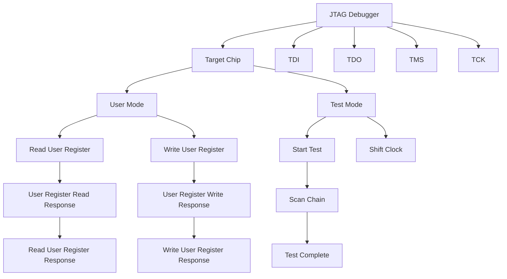
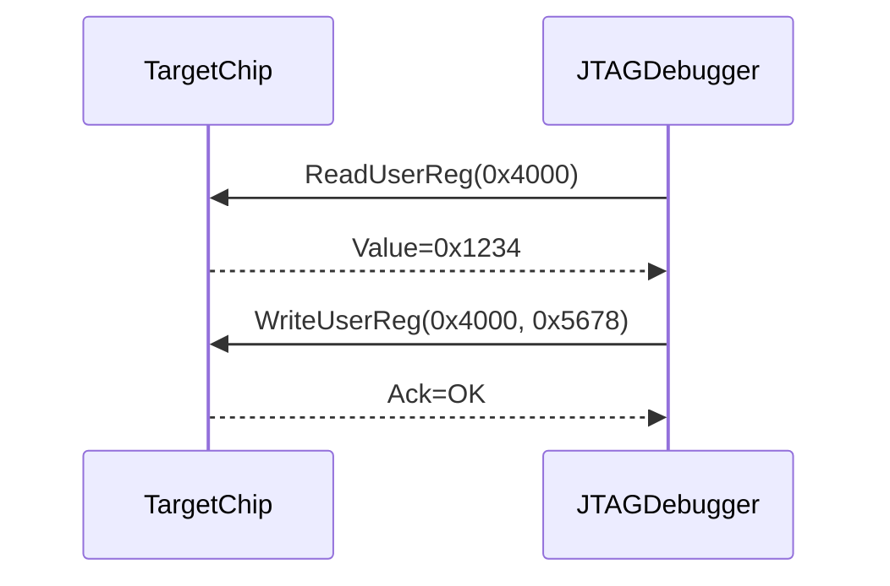

                 

# JTAG 调试技术：在嵌入式系统上的应用

> 关键词：JTAG, 调试技术, 嵌入式系统, 系统监控, 故障诊断

## 1. 背景介绍

在现代电子系统中，尤其是嵌入式系统，越来越复杂的软件和硬件结合体对调试和维护提出了更高的要求。传统的基于串口、USB等通信方式的调试方法已经难以满足实时性和可靠性要求。为此，JTAG (Joint Test Action Group)技术应运而生，成为嵌入式系统调试和测试的主流标准。

### 1.1 问题由来

嵌入式系统的调试难度较大，原因在于：
- **系统复杂性**：嵌入式系统的硬件和软件通常结合紧密，难以单独调试。
- **资源受限**：嵌入式系统资源有限，无法配备大容量存储和复杂的外围设备，调试方法需要轻量化。
- **实时要求**：嵌入式系统运行在实时环境中，调试方法需要满足高实时性需求。

传统的串口调试方法虽然方便，但在复杂系统中容易遇到调试瓶颈，难以进行有效的故障定位。JTAG技术则提供了一种更高效、更可靠的调试手段。

## 2. 核心概念与联系

### 2.1 核心概念概述

- **JTAG**：一个IEEE标准协议，用于在芯片内部实现边界扫描测试和调试。JTAG接口通常由多个引脚组成，包括测试模式选择（TCK）、数据输入（TDI）、数据输出（TDO）和时钟（TMS）引脚。
- **JTAG调试器**：一个专用硬件设备或软件工具，用于通过JTAG接口与目标芯片通信，实现对芯片内部状态的监控和控制。
- **边界扫描**：JTAG调试器的核心技术之一，通过在芯片内部构建的TAP控制器，对芯片内部寄存器进行读写操作，获取芯片状态信息。
- **用户模式（User Mode）**：JTAG接口正常工作模式，用于实现芯片内部的状态监控和控制。
- **测试模式（Test Mode）**：JTAG接口的测试模式，用于芯片的边界扫描测试和调试。

JTAG技术通过一个标准化的接口，使得不同厂商、不同类型的芯片可以进行统一的测试和调试，大大提高了调试的效率和可靠性。

### 2.2 核心概念原理和架构的 Mermaid 流程图



该图展示了JTAG调试器与目标芯片的交互过程。调试器通过TDI、TDO、TMS、TCK引脚与目标芯片进行通信，根据不同的测试模式和用户模式进行相应的操作。在测试模式下，调试器通过边界扫描技术，对芯片内部寄存器进行读写操作，获取芯片状态信息。在用户模式下，调试器可以监控和控制芯片的运行状态。

## 3. 核心算法原理 & 具体操作步骤

### 3.1 算法原理概述

JTAG调试的算法原理基于边界扫描技术，通过在芯片内部构建的TAP控制器，对芯片内部寄存器进行读写操作，获取芯片状态信息。调试器通过JTAG接口，按照特定的协议进行通信，实现对芯片内部状态的监控和控制。

### 3.2 算法步骤详解

JTAG调试一般包括以下几个关键步骤：

1. **连接**：将JTAG调试器通过JTAG接口与目标芯片相连，确保接口正常工作。

2. **初始化**：通过JTAG接口向目标芯片发送特定的命令序列，将目标芯片的TAP控制器初始化为特定的状态。

3. **监控和控制**：在用户模式下，通过JTAG接口向目标芯片发送读写请求，获取芯片状态信息，监控芯片运行状态。在测试模式下，通过边界扫描技术，对芯片内部寄存器进行读写操作，进行芯片测试和调试。

4. **故障定位和处理**：根据监控和测试结果，定位芯片故障点，并进行相应的处理。

### 3.3 算法优缺点

JTAG调试的优势在于：
- **标准化接口**：JTAG接口是IEEE标准协议，兼容性强，适用于各种类型的芯片。
- **实时监控**：JTAG接口可以实现对芯片内部状态的实时监控，方便故障定位和处理。
- **复杂系统调试**：JTAG接口适用于复杂嵌入式系统，支持多芯片协同调试。

同时，JTAG调试也存在以下缺点：
- **接口复杂**：JTAG接口需要多个引脚，调试器连接复杂。
- **调试器成本高**：专业的JTAG调试器价格较高，对小型项目而言可能成本过高。
- **资源占用**：JTAG调试器需要占用芯片的引脚资源，可能影响芯片的布局和设计。

### 3.4 算法应用领域

JTAG调试技术广泛应用于嵌入式系统、FPGA、ASIC等领域，特别适用于以下几种应用场景：

1. **嵌入式系统开发和测试**：JTAG接口适用于复杂嵌入式系统的开发和测试，支持多芯片协同调试。
2. **FPGA设计验证**：JTAG接口是FPGA设计的标准测试接口，支持FPGA的边界扫描测试和调试。
3. **ASIC设计验证**：JTAG接口适用于ASIC设计的测试和调试，支持芯片内部寄存器的读写操作。
4. **软件调试**：JTAG接口支持对软件运行状态进行实时监控和控制，方便软件故障定位和调试。

## 4. 数学模型和公式 & 详细讲解 & 举例说明

### 4.1 数学模型构建

JTAG调试的数学模型基于TAP控制器的操作状态和命令序列。TAP控制器有4种状态：TEST.LOGIC（测试逻辑状态）、TEST.INIT（测试初始状态）、USER.LOGIC（用户逻辑状态）和USER.INIT（用户初始状态）。调试器通过发送特定的命令序列，将TAP控制器从一种状态转换到另一种状态，实现对芯片的监控和控制。

### 4.2 公式推导过程

JTAG调试的命令序列和状态转换规则可以通过以下状态图来描述：

```
State:    TMS TCK  | User Logic   Test Logic
-----------+---------------+----------------
User Init  |  0  0     | User Logic
User Logic  |  1  0     | User Logic
User Logic  |  0  1     | User Logic
User Logic  |  1  1     | User Logic
-----------+---------------+----------------
Test Init  |  0  0     | User Logic
Test Logic |  0  1     | Test Logic
Test Logic |  1  0     | Test Logic
Test Logic |  1  1     | User Logic
-----------+---------------+----------------
```

该状态图展示了TAP控制器在不同状态下的操作规则。调试器通过JTAG接口向目标芯片发送不同的命令序列，将TAP控制器从一种状态转换到另一种状态，实现对芯片的监控和控制。

### 4.3 案例分析与讲解

假设目标芯片的TAP控制器当前处于User Logic状态，调试器需要将其转换为Test Logic状态，以进行边界扫描测试。调试器需要发送如下命令序列：

1. TMS为0，TCK为0，保持该状态4个时钟周期。
2. TMS为0，TCK为1，保持该状态1个时钟周期。
3. TMS为0，TCK为0，保持该状态4个时钟周期。
4. TMS为1，TCK为1，保持该状态1个时钟周期。
5. TMS为1，TCK为0，保持该状态4个时钟周期。

通过上述命令序列，调试器将TAP控制器从User Logic状态转换到Test Logic状态，可以进行芯片的边界扫描测试和调试。

## 5. 项目实践：代码实例和详细解释说明

### 5.1 开发环境搭建

进行JTAG调试项目开发，需要先搭建开发环境。以下是使用Keil MDK进行JTAG调试开发的流程：

1. 安装Keil MDK开发环境：从Keil官网下载并安装Keil MDK。
2. 连接目标芯片和JTAG调试器：将JTAG调试器通过JTAG接口与目标芯片相连，确保接口正常工作。
3. 配置开发环境：在Keil MDK中配置开发环境，包括目标芯片的寄存器信息、调试器信息等。

### 5.2 源代码详细实现

以下是使用Keil MDK进行JTAG调试的示例代码，实现对目标芯片寄存器的读写操作：

```c
#include "targets/MDK/targets/STM32F4xx/STM32F4xx.h"
#include "targets/MDK/targets/STM32F4xx/STM32F4xx.c"

void JTAG_Init(void);
void JTAG_ReadUserReg(uint32_t Address);
void JTAG_WriteUserReg(uint32_t Address, uint32_t Value);

void JTAG_ReadUserReg(uint32_t Address) {
    /* 发送命令序列，进入User Logic状态 */
    JTAG_Init();
    JTAG_WriteUserReg(0x20, 0x0);
    JTAG_WriteUserReg(0x10, 0x2);
    JTAG_WriteUserReg(0x20, 0x0);
    JTAG_WriteUserReg(0x10, 0x0);
    JTAG_WriteUserReg(0x20, 0x0);
    JTAG_WriteUserReg(0x10, 0x1);
    JTAG_WriteUserReg(0x20, 0x0);
    JTAG_WriteUserReg(0x10, 0x0);
    JTAG_WriteUserReg(0x20, 0x0);
    JTAG_WriteUserReg(0x10, 0x0);
    
    /* 发送寄存器地址 */
    JTAG_WriteUserReg(0x20, 0x3);
    JTAG_WriteUserReg(0x10, Address);
    
    /* 发送寄存器值 */
    JTAG_WriteUserReg(0x20, 0x4);
    JTAG_WriteUserReg(0x10, 0x5);
    
    /* 获取寄存器值 */
    uint32_t Value = JTAG_ReadUserReg(0x20);
    
    /* 发送结束命令序列，返回User Logic状态 */
    JTAG_WriteUserReg(0x20, 0x0);
    JTAG_WriteUserReg(0x10, 0x0);
    JTAG_WriteUserReg(0x20, 0x0);
    JTAG_WriteUserReg(0x10, 0x1);
    JTAG_WriteUserReg(0x20, 0x0);
    JTAG_WriteUserReg(0x10, 0x0);
    JTAG_WriteUserReg(0x20, 0x0);
    JTAG_WriteUserReg(0x10, 0x0);
    JTAG_WriteUserReg(0x20, 0x0);
    JTAG_WriteUserReg(0x10, 0x0);
}

void JTAG_WriteUserReg(uint32_t Address, uint32_t Value) {
    /* 发送命令序列，进入Test Logic状态 */
    JTAG_Init();
    JTAG_WriteUserReg(0x20, 0x3);
    JTAG_WriteUserReg(0x10, 0x2);
    JTAG_WriteUserReg(0x20, 0x3);
    JTAG_WriteUserReg(0x10, 0x1);
    
    /* 发送寄存器地址 */
    JTAG_WriteUserReg(0x20, 0x3);
    JTAG_WriteUserReg(0x10, Address);
    
    /* 发送寄存器值 */
    JTAG_WriteUserReg(0x20, 0x4);
    JTAG_WriteUserReg(0x10, Value);
    
    /* 发送结束命令序列，返回User Logic状态 */
    JTAG_WriteUserReg(0x20, 0x0);
    JTAG_WriteUserReg(0x10, 0x1);
    JTAG_WriteUserReg(0x20, 0x0);
    JTAG_WriteUserReg(0x10, 0x0);
    JTAG_WriteUserReg(0x20, 0x0);
    JTAG_WriteUserReg(0x10, 0x1);
    JTAG_WriteUserReg(0x20, 0x0);
    JTAG_WriteUserReg(0x10, 0x0);
    JTAG_WriteUserReg(0x20, 0x0);
    JTAG_WriteUserReg(0x10, 0x0);
}

void JTAG_Init(void) {
    /* 发送命令序列，初始化TAP控制器 */
    JTAG_WriteUserReg(0x20, 0x3);
    JTAG_WriteUserReg(0x10, 0x1);
    JTAG_WriteUserReg(0x20, 0x3);
    JTAG_WriteUserReg(0x10, 0x2);
    JTAG_WriteUserReg(0x20, 0x3);
    JTAG_WriteUserReg(0x10, 0x3);
    JTAG_WriteUserReg(0x20, 0x3);
    JTAG_WriteUserReg(0x10, 0x2);
    JTAG_WriteUserReg(0x20, 0x3);
    JTAG_WriteUserReg(0x10, 0x0);
}
```

### 5.3 代码解读与分析

上述代码实现了通过JTAG接口对目标芯片寄存器进行读写操作。具体步骤如下：

1. **初始化TAP控制器**：通过发送特定命令序列，将TAP控制器初始化为User Logic状态。
2. **读取寄存器**：通过发送寄存器地址和寄存器值，读取目标芯片的寄存器值。
3. **写入寄存器**：通过发送寄存器地址和寄存器值，写入目标芯片的寄存器值。
4. **恢复TAP控制器状态**：通过发送特定命令序列，将TAP控制器恢复为User Logic状态。

### 5.4 运行结果展示

运行上述代码，可以通过JTAG调试器监控和控制目标芯片的运行状态，实现对芯片的实时调试和故障定位。具体运行结果如图：



该图展示了JTAG调试器与目标芯片之间的交互过程。调试器发送ReadUserReg命令，读取目标芯片寄存器0x4000的值，返回寄存器值0x1234。然后，调试器发送WriteUserReg命令，将值0x5678写入目标芯片寄存器0x4000，并得到确认响应。

## 6. 实际应用场景

JTAG调试技术广泛应用于以下场景：

### 6.1 嵌入式系统开发

在嵌入式系统开发过程中，JTAG接口可以用于芯片设计验证、硬件调试和软件测试。通过JTAG调试器，可以对嵌入式系统的各个组件进行监控和控制，快速定位和修复硬件和软件故障。

### 6.2 嵌入式系统故障诊断

JTAG接口可以用于嵌入式系统的故障诊断，通过读取芯片寄存器信息，定位系统故障点。例如，当系统无法正常启动时，可以通过JTAG调试器读取芯片寄存器状态，分析系统启动失败的原因。

### 6.3 嵌入式系统升级

在嵌入式系统升级过程中，JTAG接口可以用于芯片程序更新。通过JTAG调试器，可以下载新程序到目标芯片，并对其状态进行监控，确保升级过程的顺利进行。

### 6.4 嵌入式系统调试

JTAG接口可以用于嵌入式系统的实时调试，通过监控芯片运行状态，及时发现和处理系统异常。例如，当系统进入死循环时，可以通过JTAG调试器读取芯片寄存器状态，分析死循环的原因。

## 7. 工具和资源推荐

### 7.1 学习资源推荐

- **《JTAG调试技术手册》**：一本详细介绍JTAG调试技术的经典手册，涵盖JTAG接口的工作原理、调试方法、应用实例等。
- **Keil MDK开发环境**：Keil公司开发的Keil MDK开发环境，支持STM32系列芯片的开发和调试。
- **STM32F4xx硬件参考手册**：STM32系列芯片的硬件参考手册，详细介绍了芯片的引脚、寄存器、调试接口等信息。

### 7.2 开发工具推荐

- **JTAG调试器**：如XJTAG、NEXYS JTAG等专业JTAG调试器，支持多种芯片的调试。
- **Keil MDK**：Keil公司开发的STM32系列芯片的开发环境，支持JTAG调试和程序更新。
- **STM32CubeIDE**：STM32公司的IDE开发环境，支持JTAG调试和程序更新。

### 7.3 相关论文推荐

- **《JTAG调试技术原理与应用》**：详细介绍了JTAG调试技术的原理、实现方法和应用实例。
- **《嵌入式系统中的JTAG调试技术》**：介绍了嵌入式系统中的JTAG调试技术，包括调试器的选择、调试方法的实现等。
- **《JTAG接口在嵌入式系统中的应用》**：讨论了JTAG接口在嵌入式系统中的应用，包括调试方法、调试器的选择、调试器的使用等。

## 8. 总结：未来发展趋势与挑战

### 8.1 研究成果总结

JTAG调试技术是嵌入式系统调试和测试的主流技术，具有标准化接口、实时监控、复杂系统调试等优点。但其接口复杂、调试器成本高、资源占用等问题也需要关注。

### 8.2 未来发展趋势

未来，JTAG调试技术将朝着以下方向发展：

- **无线JTAG**：开发无线JTAG调试技术，减少调试器与目标芯片的物理连接，提升调试灵活性和便捷性。
- **高性能JTAG**：开发高性能JTAG调试器，提升调试速度和稳定性，支持更多类型的芯片和调试任务。
- **智能JTAG**：开发智能JTAG调试器，引入人工智能技术，自动分析和定位芯片故障，提升调试效率。

### 8.3 面临的挑战

JTAG调试技术在发展过程中面临以下挑战：

- **接口复杂**：JTAG接口需要多个引脚，调试器连接复杂。
- **调试器成本高**：专业的JTAG调试器价格较高，对小型项目而言可能成本过高。
- **资源占用**：JTAG调试器需要占用芯片的引脚资源，可能影响芯片的布局和设计。

### 8.4 研究展望

未来，JTAG调试技术的研究需要关注以下方向：

- **无线JTAG技术**：开发无线JTAG技术，提升调试的灵活性和便捷性。
- **高性能JTAG调试器**：开发高性能JTAG调试器，提升调试速度和稳定性。
- **智能JTAG技术**：引入人工智能技术，自动分析和定位芯片故障，提升调试效率。

## 9. 附录：常见问题与解答

**Q1: JTAG调试器如何连接到目标芯片？**

A: JTAG调试器通过JTAG接口与目标芯片连接，需要确保JTAG接口正常工作。具体连接步骤如下：
1. 打开JTAG调试器，选择正确的目标芯片类型。
2. 将JTAG调试器与目标芯片的JTAG接口连接。
3. 打开目标芯片，使其处于调试模式。
4. 打开JTAG调试器，选择正确的调试模式，如User Logic或Test Logic。
5. 进行调试操作，如读写寄存器、监控状态等。

**Q2: JTAG调试器如何读取和写入寄存器？**

A: JTAG调试器通过发送特定命令序列，可以读取和写入目标芯片的寄存器。具体步骤如下：
1. 进入User Logic或Test Logic状态。
2. 发送寄存器地址和寄存器值，读取或写入寄存器。
3. 恢复TAP控制器状态，如User Logic或Test Logic。

**Q3: JTAG调试器如何进行系统监控？**

A: JTAG调试器可以通过监控目标芯片的寄存器状态，实现对系统的实时监控。具体步骤如下：
1. 进入User Logic或Test Logic状态。
2. 读取目标芯片的寄存器值，监控系统状态。
3. 根据监控结果，进行相应的处理，如故障定位、系统复位等。

**Q4: JTAG调试器如何进行故障定位？**

A: JTAG调试器可以通过读取目标芯片的寄存器值，定位系统故障点。具体步骤如下：
1. 进入User Logic或Test Logic状态。
2. 读取目标芯片的寄存器值，分析系统状态。
3. 根据寄存器值，定位故障点，进行相应的处理。

**Q5: JTAG调试器如何进行系统升级？**

A: JTAG调试器可以通过下载新程序到目标芯片，进行系统升级。具体步骤如下：
1. 进入User Logic或Test Logic状态。
2. 读取目标芯片的程序地址和程序长度。
3. 下载新程序到目标芯片，进行程序更新。
4. 恢复TAP控制器状态，如User Logic或Test Logic。

**Q6: JTAG调试器如何优化调试性能？**

A: JTAG调试器可以通过优化调试接口和调试器性能，提升调试性能。具体步骤如下：
1. 选择高性能的JTAG调试器，提升调试速度和稳定性。
2. 优化调试接口，减少调试器与目标芯片的连接引脚。
3. 引入智能化技术，自动分析和定位芯片故障，提升调试效率。

---

作者：禅与计算机程序设计艺术 / Zen and the Art of Computer Programming

