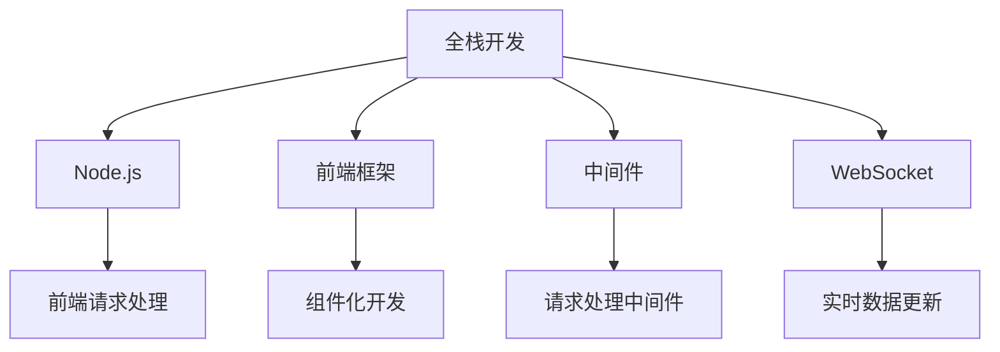

                 

## 1. 背景介绍

### 1.1 问题由来

随着互联网的蓬勃发展，Web应用的需求愈发多样化。传统的Web前端和后端开发方式割裂，导致开发效率低下、代码维护困难、前后端沟通成本高。为解决这些问题，全栈开发模式应运而生。全栈开发要求开发者具备前端和后端开发能力，能够从项目整体的角度设计和实现Web应用，提升开发效率和代码质量。

### 1.2 问题核心关键点

- **前端与后端无缝集成**：前端和后端需要共享数据模型、业务逻辑，提高开发效率和代码复用率。
- **一致的用户体验**：前后端实现统一，提升应用的用户体验和互动性。
- **高效的数据交互**：前后端数据交互流畅，减少数据丢失和延迟。
- **实时更新与动态内容**：通过WebSocket等技术，实现数据实时更新和动态内容的展示。
- **统一的技术栈**：前后端使用相同的技术栈，降低技术栈切换的复杂性。

### 1.3 问题研究意义

全栈开发模式能提升Web应用的前后端协作效率，减少代码重复，提高应用性能和用户体验，具备较高的开发效率和较低的维护成本。但全栈开发也面临着前后端职责不清、知识面过宽、技术栈复杂等问题。因此，如何通过技术手段实现前后端的无缝集成、统一技术栈、提升开发效率和用户体验，是全栈开发的关键挑战。

## 2. 核心概念与联系

### 2.1 核心概念概述

- **全栈开发**：指前后端开发使用相同的技术栈，开发者具备前端和后端开发的综合能力，实现从需求分析到部署上线的全过程。
- **Node.js**：基于Chrome V8引擎的JavaScript运行时环境，支持异步、非阻塞I/O、高并发处理等特性，适合构建高性能的网络应用。
- **前端框架**：如React、Vue等，提供组件化、状态管理、路由控制等功能，便于快速开发高交互、高性能的前端应用。
- **中间件**：在Node.js中，中间件是连接前后端的桥梁，实现请求解析、数据处理、响应返回等功能。
- **WebSocket**：支持全双工通信的协议，实现数据实时更新和推送，适合构建需要实时交互的Web应用。

这些核心概念之间的逻辑关系可以通过以下Mermaid流程图来展示：



该流程图展示出全栈开发中各个关键组件及其之间的关系：

1. **Node.js**作为后端执行环境，处理前端请求。
2. **前端框架**通过组件化开发，提升开发效率和代码复用性。
3. **中间件**实现请求处理、数据解析等功能。
4. **WebSocket**实现实时数据更新，提升用户体验。

## 3. 核心算法原理 & 具体操作步骤

### 3.1 算法原理概述

全栈开发的核心是实现前后端的无缝集成，通过统一的技术栈、共享数据模型、实现实时数据更新等功能。其核心算法原理包括以下几点：

- **异步I/O处理**：Node.js通过非阻塞I/O和事件驱动机制，实现高效的数据处理和实时通信。
- **状态管理**：前后端共享状态管理，通过状态管理库(如Redux、Vuex)实现数据的统一管理。
- **组件化开发**：前端框架提供组件化的开发模式，通过组件复用提升开发效率和可维护性。
- **WebSocket通信**：通过WebSocket实现实时数据更新，提高用户体验和交互性。

### 3.2 算法步骤详解

全栈开发的实施步骤如下：

1. **技术选型**：选择合适的全栈开发框架和中间件，如Express、Koa、Socket.io等。
2. **后端开发**：实现后端API接口，包括数据存储、业务逻辑处理等。
3. **前端开发**：使用前端框架(如React、Vue)实现前端页面逻辑和UI界面。
4. **数据交互**：实现前后端数据交互，包括请求解析、数据处理、响应返回等功能。
5. **实时更新**：通过WebSocket实现数据实时更新和推送。

### 3.3 算法优缺点

全栈开发具有以下优点：

- **提高开发效率**：前后端使用统一技术栈，减少切换带来的开发成本，提高开发效率。
- **提升用户体验**：通过实时数据更新、动态内容展示等技术，提升应用的用户体验。
- **代码复用率高**：前后端代码共享，减少重复劳动，提高代码复用率。

但全栈开发也面临以下挑战：

- **技术栈复杂**：全栈开发者需要掌握多种技术栈，导致技术学习成本高。
- **维护难度大**：前后端代码混杂，维护难度增加。
- **性能瓶颈**：Node.js单线程处理并发请求时，可能面临性能瓶颈。

### 3.4 算法应用领域

全栈开发模式广泛应用于Web应用、移动应用、桌面应用等领域，特别适合构建实时性、交互性要求高的应用场景。具体应用领域包括：

- **电商平台**：通过全栈开发实现高效的订单管理、商品展示、用户互动等功能。
- **社交媒体**：实现实时消息推送、动态内容展示、用户互动等核心功能。
- **游戏应用**：通过WebSocket实现实时数据更新，提升游戏体验。
- **教育培训**：通过实时互动、动态内容展示等技术，提高在线教育效果。

## 4. 数学模型和公式 & 详细讲解 & 举例说明

### 4.1 数学模型构建

全栈开发中的核心数学模型主要涉及以下几个方面：

- **异步I/O处理**：利用事件循环机制实现异步操作。
- **状态管理**：通过状态树(如Redux)实现数据管理。
- **组件化开发**：通过组件树(如React)实现UI展示。
- **WebSocket通信**：利用WebSocket协议实现实时数据传输。

### 4.2 公式推导过程

以下以WebSocket为例，展示其通信机制的数学模型：

- **数据模型**：WebSocket协议采用二进制格式传输数据，定义了四个基本帧类型：CONTROL、TEXT、BINARY、CLOSE。
- **通信机制**：通过WebSocket建立连接，客户端和服务器进行双向数据传输，实现实时更新和推送。

### 4.3 案例分析与讲解

假设客户端需要从服务器获取最新的消息，可以按照以下步骤进行操作：

1. **连接建立**：客户端通过WebSocket建立与服务器连接。
2. **数据传输**：服务器将最新消息转换为WebSocket帧，通过连接发送至客户端。
3. **数据接收**：客户端收到消息后，进行解析和处理。
4. **数据展示**：将处理后的消息展示在页面上。

通过WebSocket协议，实现了实时数据更新和推送，提升了用户体验。

## 5. 项目实践：代码实例和详细解释说明

### 5.1 开发环境搭建

1. **Node.js环境配置**：安装Node.js和npm，配置开发环境。
2. **中间件选择**：选择Express或Koa作为中间件框架，安装依赖包。
3. **前端框架选择**：选择React或Vue作为前端框架，安装依赖包。
4. **WebSocket配置**：安装Socket.io库，配置WebSocket连接。

### 5.2 源代码详细实现

以下以使用Express框架和WebSocket协议为例，展示全栈开发的核心代码实现：

```javascript
// 后端代码示例
const express = require('express');
const app = express();
const http = require('http').createServer(app);
const io = require('socket.io')(http);

io.on('connection', (socket) => {
  console.log('client connected');
  socket.on('message', (msg) => {
    console.log('received message:', msg);
    io.emit('message', msg);
  });
});

http.listen(3000, () => {
  console.log('server started on port 3000');
});

// 前端代码示例
import React from 'react';
import { connect } from 'react-redux';

class App extends React.Component {
  constructor(props) {
    super(props);
    this.state = { message: '' };
  }

  handleChange = (event) => {
    this.setState({ message: event.target.value });
  }

  handleSubmit = (event) => {
    event.preventDefault();
    this.props.sendMsg(this.state.message);
    this.setState({ message: '' });
  }

  render() {
    return (
      <div>
        <form onSubmit={this.handleSubmit}>
          <input type="text" value={this.state.message} onChange={this.handleChange} />
          <button type="submit">Send</button>
        </form>
      </div>
    );
  }
}

const mapStateToProps = (state) => ({
  message: state.message,
});

const mapDispatchToProps = (dispatch) => ({
  sendMsg: (msg) => dispatch({ type: 'SEND_MSG', payload: msg }),
});

export default connect(mapStateToProps, mapDispatchToProps)(App);
```

### 5.3 代码解读与分析

- **后端代码分析**：使用Express框架搭建服务器，监听端口，实现WebSocket连接。通过Socket.io库实现WebSocket连接和数据传输。
- **前端代码分析**：使用React框架实现UI界面和数据管理。通过Redux库实现状态管理，将消息发送至后端。
- **全栈开发思路**：前后端代码共享，使用相同的技术栈，通过Redux实现状态管理，通过Socket.io实现实时数据传输。

### 5.4 运行结果展示

运行以上代码，即可在前后端实现实时消息的展示和推送。通过WebSocket协议，实现了前后端数据实时更新，提升了用户体验。

## 6. 实际应用场景

### 6.1 社交媒体

社交媒体应用通常需要实时消息推送、动态内容展示等功能。通过全栈开发模式，可以实现前后端无缝集成，提升应用的用户体验和互动性。

### 6.2 在线教育

在线教育平台需要实现实时互动、动态内容展示等功能。通过全栈开发模式，实现高效的数据交互和实时更新，提升在线教育效果。

### 6.3 电商平台

电商平台需要高效的商品展示、订单管理等功能。通过全栈开发模式，实现前后端代码共享，提升开发效率和代码复用率。

### 6.4 游戏应用

游戏应用需要实时数据更新和动态内容展示。通过WebSocket协议，实现前后端数据实时更新，提升游戏体验。

## 7. 工具和资源推荐

### 7.1 学习资源推荐

为了帮助开发者系统掌握全栈开发的知识，这里推荐一些优质的学习资源：

1. **《JavaScript全栈开发实战》**：介绍Node.js、Express、React等核心技术，涵盖前后端开发、实时通信、状态管理等内容。
2. **《Vue.js官方文档》**：详细介绍Vue.js框架的使用方法和API接口，涵盖组件化开发、状态管理、路由控制等功能。
3. **《WebSocket协议详解》**：深入讲解WebSocket协议的工作原理和实现方法，适合技术栈复杂的应用场景。
4. **《Node.js权威指南》**：介绍Node.js的核心功能和使用方法，涵盖异步I/O、模块化开发、中间件等内容。
5. **《Redux官方文档》**：详细介绍Redux状态管理库的使用方法和API接口，适合需要复杂状态管理的应用场景。

通过这些资源的学习实践，相信你一定能够快速掌握全栈开发的核心技术，并用于解决实际的Web应用问题。

### 7.2 开发工具推荐

全栈开发需要同时掌握前端和后端开发工具。以下是几款常用的开发工具：

1. **Visual Studio Code**：轻量级、功能强大的代码编辑器，支持多种编程语言和插件扩展，适合前后端开发。
2. **Git**：版本控制系统，支持代码版本管理、协作开发等功能，适合多人协作开发。
3. **npm**：Node.js的包管理工具，支持安装依赖包、发布代码等功能，适合Node.js项目。
4. **Webpack**：模块打包工具，支持代码打包、压缩、优化等功能，适合前端项目。
5. **PostgreSQL**：开源数据库，支持高并发、数据持久化等功能，适合后端数据存储。

合理利用这些工具，可以显著提升全栈开发的工作效率，加快项目迭代的速度。

### 7.3 相关论文推荐

全栈开发模式是当前Web开发的主流方向，以下是几篇奠基性的相关论文，推荐阅读：

1. **《全栈开发模式：前端与后端的无缝集成》**：介绍全栈开发模式的优势和实现方法，适合技术栈复杂的应用场景。
2. **《Node.js高性能编程实战》**：详细介绍Node.js的核心功能和使用方法，涵盖异步I/O、模块化开发、中间件等内容。
3. **《React核心技术解析》**：详细介绍React框架的使用方法和API接口，涵盖组件化开发、状态管理、路由控制等功能。
4. **《Vue.js实战指南》**：详细介绍Vue.js框架的使用方法和API接口，适合新手入门和进阶开发。
5. **《WebSocket协议详解》**：深入讲解WebSocket协议的工作原理和实现方法，适合技术栈复杂的应用场景。

这些论文代表了大前端开发的核心技术，通过学习这些前沿成果，可以帮助研究者把握学科前进方向，激发更多的创新灵感。

## 8. 总结：未来发展趋势与挑战

### 8.1 总结

本文对基于Node.js的全栈开发模式进行了全面系统的介绍。首先阐述了全栈开发的背景和意义，明确了全栈开发在提升开发效率、用户体验和代码复用率方面的独特价值。其次，从原理到实践，详细讲解了全栈开发的核心算法原理和操作步骤，给出了全栈开发任务开发的完整代码实例。同时，本文还探讨了全栈开发在社交媒体、在线教育、电商平台、游戏应用等多个行业领域的应用前景，展示了全栈开发范式的广阔前景。此外，本文精选了全栈开发的各类学习资源，力求为读者提供全方位的技术指引。

通过本文的系统梳理，可以看到，全栈开发模式正在成为Web开发的重要方向，极大地提升了Web应用的前后端协作效率，提升了用户体验和开发效率。但全栈开发也面临着前后端职责不清、知识面过宽、技术栈复杂等问题。因此，如何通过技术手段实现前后端的无缝集成、统一技术栈、提升开发效率和用户体验，是全栈开发的关键挑战。

### 8.2 未来发展趋势

展望未来，全栈开发模式将呈现以下几个发展趋势：

1. **微服务架构的引入**：通过微服务架构，将全栈应用拆分为多个小型服务，提高应用的灵活性和可维护性。
2. **容器化部署**：通过Docker等容器技术，实现应用的自动化部署和运维，提升应用的稳定性和扩展性。
3. **云原生技术的应用**：通过Kubernetes等云原生技术，实现应用的自动扩展、自愈和弹性伸缩，提升应用的可用性和性能。
4. **低代码开发平台**：通过低代码开发平台，提高应用的开发效率和代码复用率，降低开发门槛。
5. **实时数据流处理**：通过Apache Kafka等技术，实现数据的实时流处理和分析，提升应用的数据处理能力和实时性。

以上趋势凸显了全栈开发技术的广阔前景。这些方向的探索发展，必将进一步提升Web应用的开发效率和用户体验，为Web技术的发展注入新的活力。

### 8.3 面临的挑战

尽管全栈开发技术已经取得了瞩目成就，但在迈向更加智能化、普适化应用的过程中，它仍面临着诸多挑战：

1. **技术栈复杂**：全栈开发者需要掌握多种技术栈，导致技术学习成本高。
2. **维护难度大**：前后端代码混杂，维护难度增加。
3. **性能瓶颈**：Node.js单线程处理并发请求时，可能面临性能瓶颈。
4. **数据一致性问题**：前后端数据一致性问题难以保证，导致应用出现bug和错误。
5. **安全性问题**：全栈应用需要考虑前后端的安全性，防止SQL注入、跨站脚本等安全问题。

### 8.4 未来突破

面对全栈开发面临的种种挑战，未来的研究需要在以下几个方面寻求新的突破：

1. **技术栈统一**：通过统一技术栈，减少前后端代码的切换和复用，提高开发效率和可维护性。
2. **微服务架构**：通过微服务架构，将全栈应用拆分为多个小型服务，提高应用的灵活性和可维护性。
3. **容器化部署**：通过Docker等容器技术，实现应用的自动化部署和运维，提升应用的稳定性和扩展性。
4. **云原生技术**：通过Kubernetes等云原生技术，实现应用的自动扩展、自愈和弹性伸缩，提升应用的可用性和性能。
5. **低代码开发平台**：通过低代码开发平台，提高应用的开发效率和代码复用率，降低开发门槛。
6. **实时数据流处理**：通过Apache Kafka等技术，实现数据的实时流处理和分析，提升应用的数据处理能力和实时性。

这些研究方向的探索，必将引领全栈开发技术迈向更高的台阶，为Web技术的发展注入新的活力。只有勇于创新、敢于突破，才能不断拓展全栈开发技术的边界，让Web技术更好地造福人类社会。

## 9. 附录：常见问题与解答

**Q1：全栈开发是否适用于所有Web应用？**

A: 全栈开发适用于数据交互频繁、实时性要求高的Web应用，如社交媒体、在线教育、电商等。但对于一些需要高度安全性、高扩展性的应用，前后端分离仍然是一个更好的选择。

**Q2：全栈开发和前后端分离有何区别？**

A: 全栈开发和前后端分离的主要区别在于前后端代码的分离和共享。全栈开发前后端代码共享，提升开发效率和代码复用率，但可能导致维护难度增加。前后端分离前后端代码分离，提高应用的稳定性和扩展性，但可能导致前后端沟通成本增加。

**Q3：全栈开发需要哪些技术栈？**

A: 全栈开发需要掌握前端和后端的技术栈。前端技术栈包括HTML、CSS、JavaScript、React、Vue等；后端技术栈包括Node.js、Express、Koa、Socket.io等。掌握这些技术栈，是进行全栈开发的基础。

**Q4：全栈开发如何实现实时数据更新？**

A: 全栈开发通过WebSocket协议实现实时数据更新。服务器将数据转换为WebSocket帧，通过WebSocket连接发送至客户端，实现数据的实时更新和推送。

**Q5：全栈开发需要考虑哪些安全性问题？**

A: 全栈开发需要考虑前后端的安全性问题，包括SQL注入、跨站脚本、跨站请求伪造等。通过合理的安全设计和技术手段，如输入验证、输出编码、CORS配置等，保障全栈应用的安全性。

通过这些问题的解答，相信你对全栈开发有了更加全面的认识，能够更好地应用于实际的Web应用开发中。

---

作者：禅与计算机程序设计艺术 / Zen and the Art of Computer Programming

