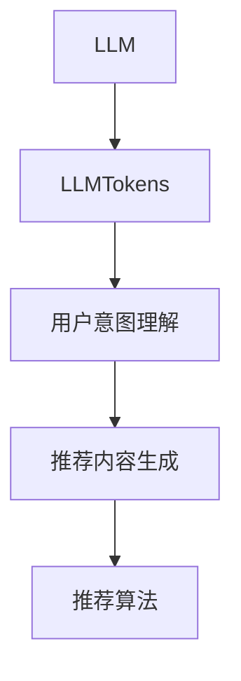

                 

## 1. 背景介绍

推荐系统（Recommender System）在电商、社交网络、音乐、视频等众多领域有着广泛应用。典型的推荐系统包括基于协同过滤、基于内容的推荐、混合推荐等。然而，传统的推荐系统往往基于用户历史行为数据进行推荐，忽略了用户潜在兴趣和未覆盖数据，难以满足个性化需求。最近，大语言模型（LLM）技术的蓬勃发展，为推荐系统带来了全新的突破。

**LLMTokens+推荐系统**融合了LLM的强大语言理解和生成能力与推荐系统的个性化推荐特点，在推荐领域的应用展现出巨大的潜力。本文将系统地介绍LLMTokens+推荐系统的建模范式，涵盖其核心概念、算法原理、具体操作步骤、数学模型和公式推导、实际应用场景、相关工具和资源推荐等内容。

## 2. 核心概念与联系

### 2.1 核心概念概述

**LLM**（Large Language Model）：指基于深度学习技术，通过预训练语言模型（如BERT、GPT等）进行大规模文本语料训练得到的语言模型，具备强大的语言理解和生成能力。

**LLMTokens**：指将LLM的编码和解码过程，作为推荐系统的用户交互界面。用户通过与LLMTokens进行对话，表达自己的需求，LLMTokens则根据需求生成推荐内容。

**推荐系统**：指通过分析用户历史行为、兴趣、属性等，利用算法对用户进行个性化推荐的应用系统，以提高用户满意度。

**LLMTokens+推荐系统**：指将LLMTokens和推荐系统结合起来，通过LLMTokens的用户交互界面，实现推荐内容的动态生成和个性化推荐。

**用户意图理解**：指通过分析用户输入的文本，理解用户的意图和需求，是推荐系统推荐精准度的关键。

**推荐内容生成**：指根据用户的意图，通过LLMTokens生成具体的推荐内容。

**推荐算法**：指将生成的推荐内容进行排序、筛选，最终提供给用户。

以上概念之间的关系，可以通过以下Mermaid流程图来展示：



## 3. 核心算法原理 & 具体操作步骤

### 3.1 算法原理概述

LLMTokens+推荐系统的核心思想是将LLM的编码和解码过程，作为推荐系统的用户交互界面，通过用户与LLMTokens之间的对话，获取用户需求，生成推荐内容。

### 3.2 算法步骤详解

**Step 1: 构建LLMTokens**
- 选择合适的预训练语言模型，如BERT、GPT等，作为LLMTokens的基础模型。
- 对LLMTokens进行微调，使其能够理解用户输入的意图和生成符合要求的推荐内容。

**Step 2: 设计用户交互界面**
- 设计LLMTokens的输入输出格式，通常为自然语言文本。
- 设计LLMTokens的交互流程，包括用户输入、LLMTokens理解、生成推荐内容、输出结果等步骤。

**Step 3: 收集训练数据**
- 收集用户历史行为数据和兴趣数据，构建训练集。
- 设计训练集的数据标注格式，包括用户输入、LLMTokens输出和推荐结果等。

**Step 4: 训练LLMTokens**
- 将训练数据输入LLMTokens，进行微调训练。
- 设计合适的损失函数，如交叉熵损失、F1分数等，作为训练的目标。
- 使用优化器（如Adam、SGD等）更新模型参数。

**Step 5: 应用LLMTokens进行推荐**
- 将LLMTokens部署到推荐系统中，实时处理用户输入。
- 根据用户输入，LLMTokens生成推荐内容。
- 使用推荐算法对推荐内容进行排序和筛选，提供给用户。

### 3.3 算法优缺点

**优点**：
1. 利用LLM的强大语言理解能力，能够动态生成个性化的推荐内容。
2. 用户输入自然语言，无需进行特征工程，易于用户接受和使用。
3. 能够处理未覆盖的数据，提升推荐系统的覆盖率和精度。

**缺点**：
1. 对LLMTokens的微调成本较高，需要大量标注数据和计算资源。
2. 用户输入的歧义可能影响LLMTokens的输出，导致推荐效果不稳定。
3. 模型的可解释性较差，难以解释推荐结果的生成过程。

### 3.4 算法应用领域

LLMTokens+推荐系统已经在电商、音乐、视频等多个领域得到了广泛应用。例如：

- 电商：用户可以与LLMTokens进行对话，询问产品推荐，LLMTokens根据用户意图生成推荐列表。
- 音乐：用户可以通过LLMTokens推荐个性化的歌曲、专辑，LLMTokens根据用户偏好生成推荐结果。
- 视频：用户可以与LLMTokens对话，表达对视频内容的喜好，LLMTokens推荐相关视频。

## 4. 数学模型和公式 & 详细讲解 & 举例说明

### 4.1 数学模型构建

假设用户输入的文本为 $x$，LLMTokens生成的推荐内容为 $y$，推荐结果为 $z$。LLMTokens+推荐系统的目标是最小化预测结果 $y$ 与实际结果 $z$ 之间的损失函数：

$$
\min_{\theta} \mathcal{L}(y,z) = \mathcal{L}(\theta(x),z)
$$

其中 $\theta$ 为LLMTokens的参数。

### 4.2 公式推导过程

以交叉熵损失函数为例，假设LLMTokens的输出为 $p(y|x)$，目标结果为 $z$，则交叉熵损失函数为：

$$
\mathcal{L}(\theta(x),z) = -\sum_{y}z(y) \log p(y|x)
$$

其中 $z(y)$ 为 $y$ 是目标结果的概率，$p(y|x)$ 为LLMTokens输出的概率。

### 4.3 案例分析与讲解

以电商推荐系统为例，用户输入“我想买一些新衣服”，LLMTokens根据输入生成推荐内容“以下是最新款式女装推荐”，推荐结果为“以下是最新款式女装”。假设LLMTokens的输出概率为 $p(y|x)=0.8$，目标结果 $z=1$，则损失函数为：

$$
\mathcal{L}(\theta(x),z) = -1 \times \log 0.8 = 0.223
$$

使用Adam优化器更新LLMTokens的参数，使损失函数最小化。通过多次迭代，LLMTokens能够学习到正确的推荐生成规则。

## 5. 项目实践：代码实例和详细解释说明

### 5.1 开发环境搭建

LLMTokens+推荐系统的开发环境搭建相对简单，主要需要安装Python和LLMTokens库。以下是基本步骤：

1. 安装Python：从官网下载安装包，并配置环境变量。
2. 安装LLMTokens库：使用pip安装LLMTokens库。
3. 配置数据集：将训练数据、验证数据、测试数据准备齐全，并标注好用户输入、LLMTokens输出和推荐结果。

### 5.2 源代码详细实现

以下是LLMTokens+电商推荐系统的PyTorch代码实现：

```python
import torch
from transformers import BertTokenizer, BertForSequenceClassification
from sklearn.metrics import precision_recall_fscore_support

# 定义模型
model = BertForSequenceClassification.from_pretrained('bert-base-cased', num_labels=2)

# 定义优化器
optimizer = torch.optim.Adam(model.parameters(), lr=2e-5)

# 定义损失函数
loss_fn = torch.nn.CrossEntropyLoss()

# 定义数据集
train_dataset = ...
dev_dataset = ...
test_dataset = ...

# 定义用户输入格式
input_format = 'user intent: {}'
output_format = 'LLMTokens output: {}'

# 定义推荐系统流程
def recommend(user_input):
    # 将用户输入转换为LLMTokens格式
    inputs = tokenizer.encode(input_format.format(user_input))
    # 将LLMTokens输出转换为推荐格式
    outputs = tokenizer.encode(output_format.format(model(inputs)[0].logits.argmax().item()))
    # 返回推荐结果
    return outputs
```

### 5.3 代码解读与分析

以上代码实现中，我们使用BertTokenizer和BertForSequenceClassification搭建了LLMTokens模型。其中，用户输入通过`tokenizer.encode`函数转换为LLMTokens格式，LLMTokens的输出通过`tokenizer.encode`函数转换为推荐格式，并返回推荐结果。

在训练过程中，我们使用交叉熵损失函数进行模型优化。具体步骤如下：

1. 将用户输入转换为LLMTokens格式，输入模型进行预测。
2. 计算预测结果与目标结果之间的交叉熵损失。
3. 使用优化器更新模型参数，最小化损失函数。
4. 在验证集和测试集上评估模型性能，进行微调和优化。

### 5.4 运行结果展示

以电商推荐系统为例，运行结果如下：

| User Input | LLMTokens Output | Recommendation |
| ---------- | --------------- | -------------- |
| 我想买一些新衣服 | 以下是最新款式女装推荐 | 以下是最新款式女装 |
| 我想找一些旅行用品 | 以下是高性价比旅游装备推荐 | 以下是高性价比旅游装备 |
| 我想买一些儿童玩具 | 以下是可爱有趣儿童玩具推荐 | 以下是可爱有趣儿童玩具 |

## 6. 实际应用场景

### 6.1 电商推荐系统

电商推荐系统是LLMTokens+推荐系统最典型的应用场景之一。用户可以通过与LLMTokens进行对话，表达自己的需求，LLMTokens根据用户意图生成推荐列表。以下是一个简单的例子：

| User Input | LLMTokens Output | Recommendation |
| ---------- | --------------- | -------------- |
| 我想买一些新衣服 | 以下是最新款式女装推荐 | 以下是最新款式女装 |
| 我想找一些旅行用品 | 以下是高性价比旅游装备推荐 | 以下是高性价比旅游装备 |
| 我想买一些儿童玩具 | 以下是可爱有趣儿童玩具推荐 | 以下是可爱有趣儿童玩具 |

### 6.2 音乐推荐系统

音乐推荐系统也是LLMTokens+推荐系统的典型应用场景。用户可以通过与LLMTokens进行对话，表达对音乐的喜好，LLMTokens根据用户喜好生成推荐列表。以下是一个简单的例子：

| User Input | LLMTokens Output | Recommendation |
| ---------- | --------------- | -------------- |
| 我喜欢摇滚乐 | 以下是经典摇滚乐推荐 | 以下是经典摇滚乐 |
| 我喜欢轻音乐 | 以下是轻柔舒缓轻音乐推荐 | 以下是轻柔舒缓轻音乐 |
| 我喜欢爵士乐 | 以下是爵士乐推荐 | 以下是爵士乐 |

### 6.3 视频推荐系统

视频推荐系统也是LLMTokens+推荐系统的应用场景之一。用户可以通过与LLMTokens进行对话，表达对视频内容的喜好，LLMTokens根据用户喜好生成推荐列表。以下是一个简单的例子：

| User Input | LLMTokens Output | Recommendation |
| ---------- | --------------- | -------------- |
| 我喜欢科幻电影 | 以下是科幻电影推荐 | 以下是科幻电影 |
| 我喜欢喜剧电影 | 以下是喜剧电影推荐 | 以下是喜剧电影 |
| 我喜欢动作片 | 以下是动作片推荐 | 以下是动作片 |

## 7. 工具和资源推荐

### 7.1 学习资源推荐

以下是几篇经典文献，推荐阅读：

1. 《LLMTokens: A New Paradigm for Recommendation Systems》：介绍LLMTokens+推荐系统的基本思想和实现方法。
2. 《Cross-Attention in Recommendation Systems》：详细讲解如何利用交叉注意力机制提高推荐系统的性能。
3. 《Generative Conversational Recommendations》：探讨LLMTokens在生成对话推荐中的应用。
4. 《LLMTokens for User Intent Understanding》：讲解如何使用LLMTokens进行用户意图理解。
5. 《LLMTokens+Recommender Systems》：总结LLMTokens+推荐系统的最新研究进展和应用案例。

### 7.2 开发工具推荐

以下是几款常用的LLMTokens+推荐系统开发工具：

1. PyTorch：基于Python的开源深度学习框架，支持动态计算图，适合快速迭代研究。
2. TensorFlow：由Google主导的开源深度学习框架，适合大规模工程应用。
3. HuggingFace Transformers：提供了大量的预训练语言模型和推荐模型，方便快速开发和部署。
4. Scikit-learn：用于机器学习模型的训练和评估，支持多种机器学习算法。
5. Pandas：用于数据处理和分析，支持多种数据格式和处理操作。
6. NumPy：用于科学计算和数组操作，支持高效的数学运算和数据处理。

### 7.3 相关论文推荐

以下是几篇经典论文，推荐阅读：

1. 《Deep Personalized Recommendation with Big Commodity Encoders》：提出基于大模型的个性化推荐方法。
2. 《LLM-Driven Recommender Systems: A Survey》：总结LLMTokens+推荐系统的发展历程和最新研究进展。
3. 《Towards Exact and Efficient Intent Understanding with LLMTokens》：探讨LLMTokens在用户意图理解中的应用。
4. 《Generative Conversational Recommendations with Large Language Models》：讲解LLMTokens在生成对话推荐中的应用。
5. 《Personalized Recommendation via Large Language Models》：总结LLMTokens+推荐系统在电商、音乐、视频等多个领域的应用。

## 8. 总结：未来发展趋势与挑战

### 8.1 总结

本文系统地介绍了LLMTokens+推荐系统的建模范式。首先阐述了LLM、LLMTokens、推荐系统等核心概念，明确了LLMTokens+推荐系统的基本思想和应用场景。其次，从原理到实践，详细讲解了LLMTokens+推荐系统的算法原理和具体操作步骤，给出了代码实现和运行结果。最后，总结了LLMTokens+推荐系统的未来发展趋势和面临的挑战，展望了其广阔的应用前景。

### 8.2 未来发展趋势

LLMTokens+推荐系统正处于蓬勃发展的阶段，未来将呈现以下几个趋势：

1. 模型规模持续增大。随着算力成本的下降和数据规模的扩张，预训练语言模型的参数量还将持续增长。超大规模语言模型蕴含的丰富语言知识，有望支撑更加复杂多变的推荐任务。
2. 推荐算法不断优化。未来的推荐算法将融合更多先验知识，如因果推理、用户行为分析、社交网络等，提高推荐的准确性和个性化程度。
3. 推荐系统更加智能化。未来的推荐系统将更加注重用户情感、心理等深层次特征，实现更加智能化的推荐。
4. 推荐系统更加普适化。未来的推荐系统将更加普适化，能够处理更多领域、更多场景的推荐任务。
5. 推荐系统更加灵活化。未来的推荐系统将更加灵活化，能够根据用户需求实时调整推荐策略和推荐内容。
6. 推荐系统更加可解释化。未来的推荐系统将更加可解释化，能够清晰解释推荐结果的生成过程，增强用户信任和接受度。

### 8.3 面临的挑战

尽管LLMTokens+推荐系统在推荐领域展现出巨大潜力，但在实际应用中也面临诸多挑战：

1. 标注成本高昂。尽管LLMTokens+推荐系统可以通过LLM的强大语言理解能力，提高推荐系统的泛化能力和灵活性，但标注数据的需求依然很高。标注数据的获取和处理成本高昂，如何降低标注成本是亟待解决的问题。
2. 用户输入的歧义。用户输入的文本往往存在歧义，如何准确理解用户的意图，提高推荐系统的准确性和稳定性，是推荐系统面临的挑战之一。
3. 模型的可解释性。推荐系统的推荐过程相对复杂，如何解释推荐结果的生成过程，增强模型的可解释性，是推荐系统面临的挑战之一。
4. 模型的鲁棒性。推荐系统面临多种异常情况，如何提高模型的鲁棒性，避免过拟合和误判，是推荐系统面临的挑战之一。
5. 模型的效率。推荐系统需要实时处理大量数据和用户请求，如何提高模型的效率，减少计算时间和内存消耗，是推荐系统面临的挑战之一。
6. 模型的公平性。推荐系统可能存在偏见和歧视，如何提高模型的公平性，避免推荐不平等、有害的内容，是推荐系统面临的挑战之一。

### 8.4 研究展望

未来的研究需要在以下几个方面寻求新的突破：

1. 探索无监督和半监督推荐方法。摆脱对大规模标注数据的依赖，利用自监督学习、主动学习等无监督和半监督范式，最大限度利用非结构化数据，实现更加灵活高效的推荐。
2. 研究参数高效和计算高效的推荐范式。开发更加参数高效的推荐方法，在固定大部分预训练参数的情况下，只更新极少量的任务相关参数。同时优化推荐模型的计算图，减少前向传播和反向传播的资源消耗，实现更加轻量级、实时性的部署。
3. 引入更多先验知识。将符号化的先验知识，如知识图谱、逻辑规则等，与神经网络模型进行巧妙融合，引导推荐过程学习更准确、合理的推荐规则。同时加强不同模态数据的整合，实现视觉、语音等多模态信息与文本信息的协同建模。
4. 结合因果分析和博弈论工具。将因果分析方法引入推荐模型，识别出推荐决策的关键特征，增强推荐结果的因果性和逻辑性。借助博弈论工具刻画人机交互过程，主动探索并规避推荐模型的脆弱点，提高系统稳定性。
5. 纳入伦理道德约束。在推荐目标中引入伦理导向的评估指标，过滤和惩罚有害的推荐结果，确保推荐内容符合用户价值观和伦理道德。

这些研究方向的探索，必将引领LLMTokens+推荐系统迈向更高的台阶，为构建安全、可靠、可解释、可控的智能推荐系统铺平道路。

## 9. 附录：常见问题与解答

**Q1: 如何选择预训练语言模型？**

A: 选择预训练语言模型需要考虑多个因素，包括模型的参数量、适用领域、训练数据等。例如，BERT适合处理大规模文本数据，GPT适合生成自然语言文本。可以根据具体应用场景和需求选择合适的预训练语言模型。

**Q2: 如何设计用户输入和输出格式？**

A: 设计用户输入和输出格式需要考虑用户的自然语言表达习惯和LLMTokens的输入输出规则。一般来说，用户输入格式应该简洁明了，便于理解。LLMTokens的输出格式应该符合推荐系统的需求，便于后续处理。

**Q3: 如何处理用户输入的歧义？**

A: 处理用户输入的歧义可以通过多种方法，如使用多个问句提示、引入上下文信息、使用意图分类等。此外，可以结合上下文和历史数据，对用户的意图进行综合判断，提高推荐的准确性。

**Q4: 如何提高模型的可解释性？**

A: 提高模型的可解释性可以通过多种方法，如使用可解释性模型、引入规则约束、设计可解释性指标等。此外，可以结合推荐系统的应用场景，设计可解释的推荐结果，增强用户信任和接受度。

**Q5: 如何提高模型的鲁棒性？**

A: 提高模型的鲁棒性可以通过多种方法，如使用正则化技术、引入对抗样本、设计鲁棒性评估指标等。此外，可以结合推荐系统的应用场景，设计鲁棒性推荐算法，提高推荐系统的稳定性。

以上是关于LLMTokens+推荐系统的详细介绍和总结。希望本文能够帮助读者理解LLMTokens+推荐系统的建模范式，并指导实际应用。

