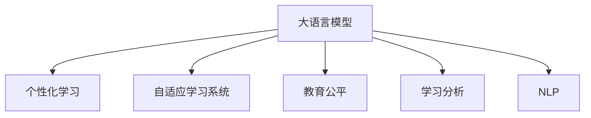

                 

# LLM 在教育领域：个性化学习和教育公平

> 关键词：大语言模型, 个性化学习, 教育公平, 自适应学习系统, 学习分析, 自然语言处理(NLP), 教育技术

## 1. 背景介绍

### 1.1 问题由来

教育是社会进步的基石，而个性化教育是提升教育质量和促进教育公平的关键。随着信息技术的发展，教育领域不断引入先进技术，如在线学习平台、智能辅导系统、自适应学习系统等，以期实现个性化教育。其中，大语言模型(Large Language Model, LLM)因其强大的自然语言理解和生成能力，在教育领域展现出巨大的应用潜力。

### 1.2 问题核心关键点

大语言模型在教育领域的应用主要体现在以下几个方面：

- **个性化学习**：通过分析学生的语言行为和反馈，大语言模型能够提供个性化推荐和指导，帮助学生针对性学习，提高学习效率。
- **教育公平**：在教育资源分配不均的情况下，大语言模型能够提供无门槛的学习支持，使更多学生能够享受到优质教育资源。
- **自适应学习系统**：结合学习者的兴趣、能力和进度，大语言模型能够动态调整教学内容和节奏，实现因材施教。
- **学习分析**：通过自然语言处理(NLP)技术，大语言模型能够对学生的学习行为和表现进行深入分析，提供数据支持的教学决策。

尽管如此，大语言模型在教育领域的应用仍面临诸多挑战，如数据隐私保护、模型鲁棒性、交互体验设计等。如何在充分保障教育公平和个性化的同时，提升大语言模型的应用效果，是教育技术领域的一个重要研究方向。

### 1.3 问题研究意义

大语言模型在教育领域的创新应用，对于提升教育质量、缩小教育差距、促进教育公平具有重要意义。通过深度学习技术，大语言模型可以更精准地分析学生需求，提供更加个性化和灵活的学习体验，从而提高学习效果和效率。同时，大语言模型能够跨越时间和空间的限制，让更多学生享受到优质教育资源，打破地域和资源的壁垒，推动教育公平的实现。

## 2. 核心概念与联系

### 2.1 核心概念概述

为更好地理解大语言模型在教育领域的应用，本节将介绍几个密切相关的核心概念：

- **大语言模型**：如GPT-3、BERT等，以自回归或自编码模型为代表的大规模预训练语言模型。通过在海量无标签文本数据上进行预训练，学习通用的语言表示，具备强大的语言理解和生成能力。

- **个性化学习**：根据学习者的个体差异，动态调整学习内容和策略，实现差异化、针对性教学。

- **自适应学习系统**：结合学习者的实时表现，动态调整教学内容和节奏，实现因材施教。

- **教育公平**：在教育资源分配不均的情况下，通过技术手段提供无门槛的学习支持，缩小教育差距，促进教育公平。

- **学习分析**：通过数据分析和机器学习技术，对学习者的学习行为和表现进行深入分析，提供数据支持的教学决策。

- **自然语言处理(NLP)**：涉及文本分析、语言模型、情感分析、语义理解等技术，为大语言模型提供基础支持。

这些核心概念之间的逻辑关系可以通过以下Mermaid流程图来展示：



这个流程图展示了大语言模型的核心概念及其之间的关系：

1. 大语言模型通过预训练获得基础能力。
2. 个性化学习和自适应学习系统结合大语言模型，实现因材施教和动态调整。
3. 教育公平通过技术手段和大语言模型实现资源普惠。
4. 学习分析利用NLP技术和大语言模型，提供数据支持的教学决策。

## 3. 核心算法原理 & 具体操作步骤
### 3.1 算法原理概述

大语言模型在教育领域的应用，主要基于自适应学习和个性化推荐两个关键环节。其核心思想是：利用大语言模型的自然语言理解和生成能力，分析学生的语言行为和反馈，动态调整教学内容和节奏，提供个性化推荐，从而实现因材施教。

形式化地，假设学生 $i$ 的学习进度和兴趣为 $x_i$，教学内容的难度和特征为 $y_i$，则学习效果 $z_i$ 可以表示为：

$$
z_i = f(x_i, y_i, \theta)
$$

其中 $f$ 为学习模型，$\theta$ 为大语言模型参数。目标是最大化 $z_i$ 的值，即：

$$
\max_{x_i, y_i, \theta} \sum_{i=1}^N z_i
$$

在实际操作中，我们通常使用监督学习或强化学习方法，通过学生的数据反馈调整教学内容 $y_i$ 和大语言模型参数 $\theta$，从而优化学习效果。

### 3.2 算法步骤详解

基于大语言模型的个性化学习和教育公平应用，一般包括以下几个关键步骤：

**Step 1: 数据收集与预处理**
- 收集学生的学习数据，包括课堂互动、作业提交、考试成绩等。
- 对数据进行清洗和格式化，将其转换为大语言模型可处理的格式。

**Step 2: 模型训练与优化**
- 使用监督学习或强化学习算法，训练大语言模型。
- 根据学生的学习数据，动态调整教学内容和难度。
- 定期评估模型效果，优化模型参数。

**Step 3: 个性化推荐与自适应学习**
- 分析学生的语言行为和反馈，动态生成个性化推荐。
- 结合学习者的实时表现，动态调整教学内容和节奏。

**Step 4: 教育公平支持**
- 使用大语言模型提供无门槛的学习支持，如在线课程、智能辅导等。
- 根据学习者的需求，提供个性化的学习资源和工具。

**Step 5: 学习分析与数据支持**
- 利用NLP技术和大语言模型，对学习者的学习行为和表现进行深入分析。
- 提供数据支持的教学决策，优化教学策略和资源分配。

以上是基于大语言模型的个性化学习和教育公平应用的一般流程。在实际应用中，还需要针对具体任务的特点，对各个环节进行优化设计，如改进训练算法、引入更多的正则化技术、搜索最优的超参数组合等，以进一步提升模型效果。

### 3.3 算法优缺点

基于大语言模型的个性化学习和教育公平方法具有以下优点：
1. 个性化精准度高。大语言模型能够分析学生的语言行为和反馈，提供精准的个性化推荐，实现因材施教。
2. 资源普惠性强。大语言模型能够提供无门槛的学习支持，缩小教育差距，促进教育公平。
3. 自适应能力强。动态调整教学内容和节奏，使学习者的学习体验更加灵活、高效。
4. 数据支持深入。利用NLP技术和大语言模型，提供深入的数据分析，优化教学策略和资源分配。

同时，该方法也存在一定的局限性：
1. 数据隐私保护。学生学习数据的隐私保护是大语言模型应用中一个重要问题，需要严格遵守相关法律法规。
2. 模型鲁棒性不足。大语言模型可能对输入数据存在一定的偏见，影响教学效果和公平性。
3. 交互体验设计。如何设计自然、友好的人机交互界面，增强学生的学习体验，是大语言模型应用中的一个挑战。
4. 学习行为分析复杂。学生的学习行为和表现可能受到多种因素的影响，难以通过单一模型全面分析。

尽管存在这些局限性，但就目前而言，基于大语言模型的个性化学习和教育公平方法仍然是大规模教育技术应用的重要手段。未来相关研究的重点在于如何进一步降低数据隐私风险，提高模型的鲁棒性，增强交互体验设计，同时兼顾可解释性和伦理安全性等因素。

### 3.4 算法应用领域

基于大语言模型的个性化学习和教育公平方法，在教育领域已经得到了广泛的应用，涵盖多个方面：

- **自适应学习系统**：如Knewton、ALEKS等，结合大语言模型，实现因材施教，动态调整教学内容和节奏。
- **个性化推荐系统**：如Coursera、Khan Academy等，利用大语言模型，提供个性化学习资源和工具。
- **在线课程平台**：如EdX、Udacity等，使用大语言模型，提供高质量的在线课程和智能辅导。
- **智能辅导系统**：如Duolingo、Babbel等，结合大语言模型，提供智能化的语言学习支持。
- **学习分析系统**：如Blackboard、Moodle等，利用NLP技术和大语言模型，进行学习行为分析，提供数据支持的教学决策。

除了上述这些应用外，大语言模型还被创新性地应用到更多教育场景中，如学习动机激发、情感支持、知识图谱构建等，为教育技术的发展提供了新的动力。

## 4. 数学模型和公式 & 详细讲解 & 举例说明

### 4.1 数学模型构建

本节将使用数学语言对基于大语言模型的个性化学习和教育公平过程进行更加严格的刻画。

记学生 $i$ 的学习进度和兴趣为 $x_i$，教学内容的难度和特征为 $y_i$，学习效果 $z_i$ 可以表示为：

$$
z_i = f(x_i, y_i, \theta)
$$

其中 $f$ 为学习模型，$\theta$ 为大语言模型参数。假设收集到的学习数据为 $D=\{(x_i, y_i, z_i)\}_{i=1}^N$，则学习模型的训练目标为：

$$
\min_{x_i, y_i, \theta} \sum_{i=1}^N (z_i - f(x_i, y_i, \theta))^2
$$

在实际操作中，我们通常使用基于梯度的优化算法，如AdamW、SGD等，来近似求解上述最优化问题。

### 4.2 公式推导过程

以下我们以学习效果最大化为例，推导基于大语言模型的学习效果最大化目标函数及其梯度计算公式。

假设学生 $i$ 的学习进度和兴趣为 $x_i$，教学内容的难度和特征为 $y_i$，学习效果 $z_i$ 可以表示为：

$$
z_i = f(x_i, y_i, \theta)
$$

则学习效果最大化目标函数为：

$$
\max_{x_i, y_i, \theta} \sum_{i=1}^N z_i
$$

将其展开，得：

$$
\max_{x_i, y_i, \theta} \sum_{i=1}^N f(x_i, y_i, \theta)
$$

根据梯度下降法，目标函数的梯度为：

$$
\nabla_{x_i, y_i, \theta} \sum_{i=1}^N f(x_i, y_i, \theta) = \sum_{i=1}^N \nabla_{x_i, y_i, \theta} f(x_i, y_i, \theta)
$$

其中 $\nabla_{x_i, y_i, \theta} f(x_i, y_i, \theta)$ 为目标函数对 $x_i, y_i, \theta$ 的偏导数，可通过反向传播算法高效计算。

在得到目标函数的梯度后，即可带入参数更新公式，完成模型的迭代优化。重复上述过程直至收敛，最终得到学习效果最大化的最优模型参数 $\theta^*$。

## 5. 项目实践：代码实例和详细解释说明

### 5.1 开发环境搭建

在进行基于大语言模型的个性化学习和教育公平应用实践前，我们需要准备好开发环境。以下是使用Python进行PyTorch开发的环境配置流程：

1. 安装Anaconda：从官网下载并安装Anaconda，用于创建独立的Python环境。

2. 创建并激活虚拟环境：
```bash
conda create -n pytorch-env python=3.8 
conda activate pytorch-env
```

3. 安装PyTorch：根据CUDA版本，从官网获取对应的安装命令。例如：
```bash
conda install pytorch torchvision torchaudio cudatoolkit=11.1 -c pytorch -c conda-forge
```

4. 安装Transformers库：
```bash
pip install transformers
```

5. 安装各类工具包：
```bash
pip install numpy pandas scikit-learn matplotlib tqdm jupyter notebook ipython
```

完成上述步骤后，即可在`pytorch-env`环境中开始开发实践。

### 5.2 源代码详细实现

下面我们以个性化推荐系统为例，给出使用Transformers库对BERT模型进行个性化推荐的PyTorch代码实现。

首先，定义个性化推荐任务的数据处理函数：

```python
from transformers import BertTokenizer
from torch.utils.data import Dataset
import torch

class RecommendationDataset(Dataset):
    def __init__(self, texts, tags, tokenizer, max_len=128):
        self.texts = texts
        self.tags = tags
        self.tokenizer = tokenizer
        self.max_len = max_len
        
    def __len__(self):
        return len(self.texts)
    
    def __getitem__(self, item):
        text = self.texts[item]
        tags = self.tags[item]
        
        encoding = self.tokenizer(text, return_tensors='pt', max_length=self.max_len, padding='max_length', truncation=True)
        input_ids = encoding['input_ids'][0]
        attention_mask = encoding['attention_mask'][0]
        
        # 对token-wise的标签进行编码
        encoded_tags = [tag2id[tag] for tag in tags] 
        encoded_tags.extend([tag2id['O']] * (self.max_len - len(encoded_tags)))
        labels = torch.tensor(encoded_tags, dtype=torch.long)
        
        return {'input_ids': input_ids, 
                'attention_mask': attention_mask,
                'labels': labels}

# 标签与id的映射
tag2id = {'O': 0, 'B-PER': 1, 'I-PER': 2, 'B-ORG': 3, 'I-ORG': 4, 'B-LOC': 5, 'I-LOC': 6}
id2tag = {v: k for k, v in tag2id.items()}

# 创建dataset
tokenizer = BertTokenizer.from_pretrained('bert-base-cased')

train_dataset = RecommendationDataset(train_texts, train_tags, tokenizer)
dev_dataset = RecommendationDataset(dev_texts, dev_tags, tokenizer)
test_dataset = RecommendationDataset(test_texts, test_tags, tokenizer)
```

然后，定义模型和优化器：

```python
from transformers import BertForTokenClassification, AdamW

model = BertForTokenClassification.from_pretrained('bert-base-cased', num_labels=len(tag2id))

optimizer = AdamW(model.parameters(), lr=2e-5)
```

接着，定义训练和评估函数：

```python
from torch.utils.data import DataLoader
from tqdm import tqdm
from sklearn.metrics import classification_report

device = torch.device('cuda') if torch.cuda.is_available() else torch.device('cpu')
model.to(device)

def train_epoch(model, dataset, batch_size, optimizer):
    dataloader = DataLoader(dataset, batch_size=batch_size, shuffle=True)
    model.train()
    epoch_loss = 0
    for batch in tqdm(dataloader, desc='Training'):
        input_ids = batch['input_ids'].to(device)
        attention_mask = batch['attention_mask'].to(device)
        labels = batch['labels'].to(device)
        model.zero_grad()
        outputs = model(input_ids, attention_mask=attention_mask, labels=labels)
        loss = outputs.loss
        epoch_loss += loss.item()
        loss.backward()
        optimizer.step()
    return epoch_loss / len(dataloader)

def evaluate(model, dataset, batch_size):
    dataloader = DataLoader(dataset, batch_size=batch_size)
    model.eval()
    preds, labels = [], []
    with torch.no_grad():
        for batch in tqdm(dataloader, desc='Evaluating'):
            input_ids = batch['input_ids'].to(device)
            attention_mask = batch['attention_mask'].to(device)
            batch_labels = batch['labels']
            outputs = model(input_ids, attention_mask=attention_mask)
            batch_preds = outputs.logits.argmax(dim=2).to('cpu').tolist()
            batch_labels = batch_labels.to('cpu').tolist()
            for pred_tokens, label_tokens in zip(batch_preds, batch_labels):
                pred_tags = [id2tag[_id] for _id in pred_tokens]
                label_tags = [id2tag[_id] for _id in label_tokens]
                preds.append(pred_tags[:len(label_tags)])
                labels.append(label_tags)
                
    print(classification_report(labels, preds))
```

最后，启动训练流程并在测试集上评估：

```python
epochs = 5
batch_size = 16

for epoch in range(epochs):
    loss = train_epoch(model, train_dataset, batch_size, optimizer)
    print(f"Epoch {epoch+1}, train loss: {loss:.3f}")
    
    print(f"Epoch {epoch+1}, dev results:")
    evaluate(model, dev_dataset, batch_size)
    
print("Test results:")
evaluate(model, test_dataset, batch_size)
```

以上就是使用PyTorch对BERT进行个性化推荐任务的微调代码实现。可以看到，得益于Transformers库的强大封装，我们可以用相对简洁的代码完成BERT模型的加载和微调。

### 5.3 代码解读与分析

让我们再详细解读一下关键代码的实现细节：

**RecommendationDataset类**：
- `__init__`方法：初始化文本、标签、分词器等关键组件。
- `__len__`方法：返回数据集的样本数量。
- `__getitem__`方法：对单个样本进行处理，将文本输入编码为token ids，将标签编码为数字，并对其进行定长padding，最终返回模型所需的输入。

**tag2id和id2tag字典**：
- 定义了标签与数字id之间的映射关系，用于将token-wise的预测结果解码回真实的标签。

**训练和评估函数**：
- 使用PyTorch的DataLoader对数据集进行批次化加载，供模型训练和推理使用。
- 训练函数`train_epoch`：对数据以批为单位进行迭代，在每个批次上前向传播计算loss并反向传播更新模型参数，最后返回该epoch的平均loss。
- 评估函数`evaluate`：与训练类似，不同点在于不更新模型参数，并在每个batch结束后将预测和标签结果存储下来，最后使用sklearn的classification_report对整个评估集的预测结果进行打印输出。

**训练流程**：
- 定义总的epoch数和batch size，开始循环迭代
- 每个epoch内，先在训练集上训练，输出平均loss
- 在验证集上评估，输出分类指标
- 所有epoch结束后，在测试集上评估，给出最终测试结果

可以看到，PyTorch配合Transformers库使得BERT微调的代码实现变得简洁高效。开发者可以将更多精力放在数据处理、模型改进等高层逻辑上，而不必过多关注底层的实现细节。

当然，工业级的系统实现还需考虑更多因素，如模型的保存和部署、超参数的自动搜索、更灵活的任务适配层等。但核心的微调范式基本与此类似。

## 6. 实际应用场景

### 6.1 智能教育平台

基于大语言模型的个性化学习技术，可以广泛应用于智能教育平台的构建。传统教育往往以知识传授为主，难以兼顾学生的个性化需求。而使用个性化学习技术，可以实时分析学生的学习行为和反馈，动态调整教学内容和节奏，实现因材施教，提高学习效果。

在技术实现上，可以收集学生的学习数据，结合大语言模型进行个性化推荐和分析，提供适应学生需求的学习资源和策略。同时，智能教育平台可以通过自然语言处理(NLP)技术，对学生的学习行为和表现进行深入分析，提供数据支持的教学决策，优化教学策略和资源分配。

### 6.2 在线辅导系统

在线辅导系统是另一个典型应用场景。通过大语言模型的自适应学习技术，在线辅导系统可以实现智能化的个性化辅导，使学生在遇到学习难题时，能够及时获得针对性的解答和指导。

在具体实现上，可以通过收集学生的学习数据和反馈，结合大语言模型进行个性化推荐和分析，动态调整教学内容和节奏，提供适应学生需求的学习资源和策略。同时，系统还可以通过自然语言处理(NLP)技术，对学生的学习行为和表现进行深入分析，提供数据支持的教学决策，优化教学策略和资源分配。

### 6.3 自适应学习系统

自适应学习系统可以结合大语言模型的个性化学习技术，实现因材施教。通过分析学生的学习进度和兴趣，动态调整教学内容和难度，使学习者能够在自己的节奏下高效学习。

在具体实现上，可以收集学生的学习数据，结合大语言模型进行个性化推荐和分析，动态调整教学内容和节奏，提供适应学生需求的学习资源和策略。同时，系统还可以通过自然语言处理(NLP)技术，对学生的学习行为和表现进行深入分析，提供数据支持的教学决策，优化教学策略和资源分配。

### 6.4 未来应用展望

随着大语言模型和个性化学习技术的发展，基于大语言模型的教育应用将呈现以下几个发展趋势：

1. **深度个性化**：未来的大语言模型将能够更深层次地理解学生的个性化需求，提供更加精准和灵活的学习体验。
2. **跨领域应用**：基于大语言模型的个性化学习技术，将不仅局限于语言学习，而是拓展到数学、科学等多个学科领域，实现跨领域的个性化教学。
3. **多模态学习**：未来的个性化学习系统将结合视觉、听觉等多模态信息，提供更丰富、全面的学习体验。
4. **终身学习**：未来的个性化学习系统将具备终身学习的能力，能够不断适应学生的学习需求，提供持续的学习支持。
5. **智能辅助**：未来的个性化学习系统将与虚拟助手、智能辅导等技术结合，提供更加全面、智能的学习支持。

这些趋势将进一步拓展大语言模型在教育领域的应用范围，使教育技术更好地服务于学生的个性化需求，促进教育公平和质量的提升。

## 7. 工具和资源推荐
### 7.1 学习资源推荐

为了帮助开发者系统掌握大语言模型在教育领域的应用理论基础和实践技巧，这里推荐一些优质的学习资源：

1. 《深度学习与教育技术》课程：斯坦福大学开设的深度学习与教育技术课程，涵盖深度学习在教育领域的应用，包括个性化学习、自适应学习等内容。

2. 《教育技术中的机器学习》书籍：介绍机器学习在教育技术中的应用，涵盖个性化推荐、自适应学习、智能辅导等内容。

3. 《学习分析：从数据到决策》书籍：介绍学习分析技术在教育领域的应用，涵盖学习数据收集、处理、分析等内容。

4. Coursera、edX等在线平台：提供众多与教育技术相关的课程和项目，涵盖个性化学习、自适应学习、智能辅导等多个方向。

5. Kaggle等数据竞赛平台：提供教育领域的公开数据集和竞赛任务，帮助开发者进行实践和训练。

通过对这些资源的学习实践，相信你一定能够快速掌握大语言模型在教育领域的应用技巧，并用于解决实际的个性化学习问题。
###  7.2 开发工具推荐

高效的开发离不开优秀的工具支持。以下是几款用于大语言模型在教育领域应用开发的常用工具：

1. PyTorch：基于Python的开源深度学习框架，灵活动态的计算图，适合快速迭代研究。大部分预训练语言模型都有PyTorch版本的实现。

2. TensorFlow：由Google主导开发的开源深度学习框架，生产部署方便，适合大规模工程应用。同样有丰富的预训练语言模型资源。

3. Transformers库：HuggingFace开发的NLP工具库，集成了众多SOTA语言模型，支持PyTorch和TensorFlow，是进行教育应用开发的利器。

4. Weights & Biases：模型训练的实验跟踪工具，可以记录和可视化模型训练过程中的各项指标，方便对比和调优。与主流深度学习框架无缝集成。

5. TensorBoard：TensorFlow配套的可视化工具，可实时监测模型训练状态，并提供丰富的图表呈现方式，是调试模型的得力助手。

6. Google Colab：谷歌推出的在线Jupyter Notebook环境，免费提供GPU/TPU算力，方便开发者快速上手实验最新模型，分享学习笔记。

合理利用这些工具，可以显著提升大语言模型在教育领域应用开发的效率，加快创新迭代的步伐。

### 7.3 相关论文推荐

大语言模型在教育领域的应用源于学界的持续研究。以下是几篇奠基性的相关论文，推荐阅读：

1. "Deep Learning for Personalized Education: A Survey"（2018）：综述了深度学习在个性化教育中的应用，包括自适应学习、个性化推荐等内容。

2. "Personalized Learning and Education Technologies: A Survey"（2020）：综述了个性化学习技术在教育领域的应用，包括自适应学习、个性化推荐、智能辅导等内容。

3. "Adaptive Learning with Deep Learning: A Survey"（2019）：综述了深度学习在自适应学习中的应用，包括自适应学习系统、个性化推荐等内容。

4. "Learning Analytics: From Data to Insights for Learning in Education and E-Learning"（2014）：介绍学习分析技术在教育领域的应用，涵盖学习数据分析、数据可视化等内容。

这些论文代表了大语言模型在教育领域的应用方向，为研究者提供了理论基础和实践思路。

## 8. 总结：未来发展趋势与挑战

### 8.1 总结

本文对基于大语言模型的个性化学习和教育公平进行了全面系统的介绍。首先阐述了个性化学习和教育公平在教育领域的重要性，明确了大语言模型在这一领域的独特价值。其次，从原理到实践，详细讲解了基于大语言模型的个性化学习技术，给出了教育应用开发的完整代码实例。同时，本文还广泛探讨了个性化学习技术在智能教育平台、在线辅导系统、自适应学习系统等多个教育场景中的应用前景，展示了个性化学习技术的应用潜力。

通过本文的系统梳理，可以看到，基于大语言模型的个性化学习和教育公平技术正在成为教育技术的重要手段，极大地拓展了教育技术的边界，提升了教育质量和效率。未来，伴随大语言模型和个性化学习技术的不断发展，教育技术必将在更广阔的领域落地应用，推动教育公平和质量的全面提升。

### 8.2 未来发展趋势

展望未来，大语言模型在教育领域的应用将呈现以下几个发展趋势：

1. **深度个性化**：未来的大语言模型将能够更深层次地理解学生的个性化需求，提供更加精准和灵活的学习体验。
2. **跨领域应用**：基于大语言模型的个性化学习技术，将不仅局限于语言学习，而是拓展到数学、科学等多个学科领域，实现跨领域的个性化教学。
3. **多模态学习**：未来的个性化学习系统将结合视觉、听觉等多模态信息，提供更丰富、全面的学习体验。
4. **终身学习**：未来的个性化学习系统将具备终身学习的能力，能够不断适应学生的学习需求，提供持续的学习支持。
5. **智能辅助**：未来的个性化学习系统将与虚拟助手、智能辅导等技术结合，提供更加全面、智能的学习支持。

这些趋势将进一步拓展大语言模型在教育领域的应用范围，使教育技术更好地服务于学生的个性化需求，促进教育公平和质量的提升。

### 8.3 面临的挑战

尽管大语言模型在教育领域的应用已经取得显著进展，但在迈向更加智能化、普适化应用的过程中，仍面临诸多挑战：

1. **数据隐私保护**：学生学习数据的隐私保护是大语言模型应用中一个重要问题，需要严格遵守相关法律法规。
2. **模型鲁棒性不足**：大语言模型可能对输入数据存在一定的偏见，影响教学效果和公平性。
3. **交互体验设计**：如何设计自然、友好的人机交互界面，增强学生的学习体验，是大语言模型应用中的一个挑战。
4. **学习行为分析复杂**：学生的学习行为和表现可能受到多种因素的影响，难以通过单一模型全面分析。

尽管存在这些局限性，但就目前而言，基于大语言模型的个性化学习和教育公平方法仍然是大规模教育技术应用的重要手段。未来相关研究的重点在于如何进一步降低数据隐私风险，提高模型的鲁棒性，增强交互体验设计，同时兼顾可解释性和伦理安全性等因素。

### 8.4 研究展望

面对大语言模型在教育领域应用所面临的挑战，未来的研究需要在以下几个方面寻求新的突破：

1. **探索无监督和半监督学习**：摆脱对大规模标注数据的依赖，利用自监督学习、主动学习等无监督和半监督范式，最大限度利用非结构化数据，实现更加灵活高效的个性化学习。
2. **研究参数高效和计算高效的微调范式**：开发更加参数高效的微调方法，在固定大部分预训练参数的同时，只更新极少量的任务相关参数。同时优化微调模型的计算图，减少前向传播和反向传播的资源消耗，实现更加轻量级、实时性的部署。
3. **融合因果和对比学习范式**：通过引入因果推断和对比学习思想，增强个性化学习模型建立稳定因果关系的能力，学习更加普适、鲁棒的语言表征，从而提升模型的泛化性和抗干扰能力。
4. **引入更多先验知识**：将符号化的先验知识，如知识图谱、逻辑规则等，与神经网络模型进行巧妙融合，引导个性化学习过程学习更准确、合理的语言模型。同时加强不同模态数据的整合，实现视觉、语音等多模态信息与文本信息的协同建模。
5. **结合因果分析和博弈论工具**：将因果分析方法引入个性化学习模型，识别出模型决策的关键特征，增强输出解释的因果性和逻辑性。借助博弈论工具刻画人机交互过程，主动探索并规避模型的脆弱点，提高系统稳定性。
6. **纳入伦理道德约束**：在模型训练目标中引入伦理导向的评估指标，过滤和惩罚有偏见、有害的输出倾向。同时加强人工干预和审核，建立模型行为的监管机制，确保输出符合人类价值观和伦理道德。

这些研究方向的探索，必将引领大语言模型在教育领域的应用走向更高的台阶，为构建安全、可靠、可解释、可控的智能系统铺平道路。面向未来，大语言模型在教育领域的应用还需与其他人工智能技术进行更深入的融合，如知识表示、因果推理、强化学习等，多路径协同发力，共同推动教育技术的发展。只有勇于创新、敢于突破，才能不断拓展语言模型的边界，让智能技术更好地造福教育事业。

## 9. 附录：常见问题与解答

**Q1：大语言模型在个性化学习中如何保证数据隐私？**

A: 保护学生学习数据的隐私是大语言模型应用中一个重要问题。常用的方法包括：
1. 数据匿名化：对学生的学习数据进行匿名化处理，保护个人隐私。
2. 数据加密：对敏感数据进行加密处理，防止数据泄露。
3. 访问控制：对数据访问进行严格控制，确保只有授权人员能够访问数据。
4. 差分隐私：通过加入噪声，保护个体隐私，同时保证数据统计特性。

这些方法可以结合使用，确保在数据收集和处理过程中，保护学生的隐私权益。

**Q2：大语言模型在教育公平中的应用有哪些？**

A: 大语言模型在教育公平中的应用主要体现在以下几个方面：
1. **无门槛学习支持**：通过在线课程、智能辅导等技术，提供无门槛的学习支持，缩小教育差距。
2. **个性化学习资源**：根据学生的学习需求和能力，提供个性化的学习资源和工具，实现因材施教。
3. **数据驱动决策**：通过分析学生的学习行为和表现，提供数据支持的教学决策，优化教学策略和资源分配。
4. **终身学习支持**：提供持续的学习支持，使学生能够不断适应新的学习需求，实现终身学习。

通过这些应用，大语言模型能够帮助更多学生享受到优质教育资源，缩小教育差距，促进教育公平。

**Q3：大语言模型在教育公平中如何提高模型的鲁棒性？**

A: 提高大语言模型在教育公平中的鲁棒性，可以从以下几个方面入手：
1. **数据多样性**：收集多样化的数据，避免模型对单一数据集的过度拟合。
2. **对抗样本训练**：引入对抗样本，提高模型对噪声和攻击的鲁棒性。
3. **模型融合**：结合多种模型，利用模型集成方法，提升模型的泛化能力和鲁棒性。
4. **正则化技术**：使用L2正则、Dropout等技术，防止模型过拟合。
5. **主动学习**：通过主动学习算法，在有限标注数据下，最大化模型性能。

这些方法可以结合使用，提升大语言模型在教育公平中的鲁棒性和泛化能力。

**Q4：大语言模型在个性化学习中如何进行学习行为分析？**

A: 大语言模型在个性化学习中进行学习行为分析，可以通过自然语言处理(NLP)技术，对学生的学习数据进行深入分析，具体包括：
1. **文本分析**：通过文本分类、情感分析等技术，分析学生的学习状态和情感。
2. **学习轨迹分析**：通过时间序列分析，掌握学生的学习进度和行为变化。
3. **知识图谱构建**：将学生的学习数据构建为知识图谱，进行知识推理和关系发现。

这些分析结果可以用于数据支持的教学决策，优化教学策略和资源分配，提升个性化学习的效率和效果。

**Q5：大语言模型在个性化学习中如何进行用户交互设计？**

A: 大语言模型在个性化学习中进行用户交互设计，可以从以下几个方面入手：
1. **自然语言界面**：提供自然语言界面，增强学生的学习体验，使其更易于操作和使用。
2. **交互式推荐**：通过自然语言处理(NLP)技术，实现交互式推荐，使学习者能够主动探索学习资源。
3. **实时反馈**：提供实时反馈，及时调整学习策略，满足学习者的个性化需求。
4. **情感支持**：通过自然语言处理(NLP)技术，识别学生的情感状态，提供情感支持。

这些设计方法可以结合使用，提升大语言模型在个性化学习中的用户体验和效果。

---

作者：禅与计算机程序设计艺术 / Zen and the Art of Computer Programming

