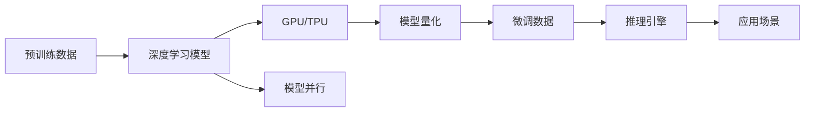

                 

# LLM 的崛起：超越 CPU 的限制

> 关键词：

在计算技术日新月异的今天，深度学习模型的规模和能力不断突破新高度，而大型语言模型(LLM)凭借其巨大的参数量和复杂的结构，已经成为推动计算科学进步的重要力量。LLM在自然语言处理(NLP)、计算机视觉、推荐系统等领域大放异彩，其智能水平之高，甚至在某些任务上超越了人类的表现。然而，如此强大的模型也面临着计算资源消耗巨大的问题，传统的CPU难以满足其需求。本文将详细探讨LLM的崛起背景，分析其核心概念和架构，并提出未来超越CPU限制的可能方向。

## 1. 背景介绍

### 1.1 问题由来
大型语言模型（LLM）的出现，标志着人工智能技术进入了一个新的阶段。LLM通过对大规模无标签文本数据进行预训练，学习到丰富的语言知识，具备强大的语言理解和生成能力。其中最具代表性的是GPT-3和BERT等模型。这些模型在各种NLP任务上取得了卓越的性能，如机器翻译、文本摘要、问答系统等，展现出了超越人类的智能水平。然而，如此庞大的模型也带来了对计算资源需求的急剧增加。传统的CPU在处理复杂模型时显得力不从心，难以满足模型大规模并行计算的需求。

### 1.2 问题核心关键点
要使LLM在实际应用中发挥作用，必须解决以下核心问题：

- **模型规模与计算资源之间的平衡**：如何在大规模数据上训练大规模模型，同时保持计算效率和资源管理的高效性。
- **模型与硬件之间的适配**：如何利用最新的硬件技术，如GPU、TPU、FPGA等，优化LLM的训练和推理过程。
- **模型部署与维护**：如何在云平台、边缘设备等不同的环境中部署LLM，并确保其性能稳定和可扩展性。

这些问题涉及到了深度学习模型、计算机体系结构、云平台等多方面的知识，因此需要综合考虑各种技术手段来解决。

### 1.3 问题研究意义
研究LLM如何超越CPU的限制，对于推动计算科学与人工智能技术的发展，具有重要意义：

- **提升模型性能**：通过优化模型与硬件的适配，提升LLM在各种任务上的性能，进一步逼近人类智能水平。
- **降低计算成本**：通过合理配置硬件资源，降低模型的训练和推理成本，加速AI技术的普及和应用。
- **拓展应用场景**：在计算资源得到充分利用的基础上，使LLM在更多领域实现突破，推动各行业的智能化进程。
- **促进技术创新**：探索新的计算技术，如量子计算、光子计算等，为未来计算资源优化提供新的思路。

## 2. 核心概念与联系

### 2.1 核心概念概述

要深入理解LLM如何超越CPU的限制，首先需要掌握一些核心概念：

- **深度学习模型**：基于神经网络的模型，通过学习数据特征，进行分类、回归等任务。
- **大型语言模型(LLM)**：具有大规模参数量的预训练模型，可以处理复杂的语言理解和生成任务。
- **GPU/TPU**：专门用于加速深度学习的硬件设备，具有高速浮点运算能力和并行计算能力。
- **模型并行**：将深度学习模型的计算任务分布到多个GPU/TPU上，实现并行计算。
- **模型量化**：将模型的参数和计算过程中的浮点数转换为更少的比特数，以减少存储和计算资源消耗。

这些概念共同构成了LLM超越CPU限制的技术框架，使得模型能够在计算资源充足的环境中，发挥出最大的性能。

### 2.2 核心概念原理和架构的 Mermaid 流程图

以下是一个简单的Mermaid流程图，展示了LLM训练和推理的基本架构：



这个流程图展示了LLM在预训练、推理和应用场景之间的流程：

1. **预训练数据**：从大规模无标签文本数据中提取特征，学习通用语言知识。
2. **深度学习模型**：基于学习到的特征构建模型，如BERT、GPT-3等。
3. **GPU/TPU**：将模型部署到专用硬件上，利用并行计算加速模型训练和推理。
4. **模型并行**：将模型的计算任务分配到多个GPU/TPU上进行并行计算。
5. **模型量化**：将模型参数和计算过程的量化，减少资源消耗。
6. **微调数据**：使用下游任务的数据进行微调，优化模型在特定任务上的性能。
7. **推理引擎**：将微调后的模型部署到实际应用中，进行推理和交互。
8. **应用场景**：模型在各种实际场景中的应用，如智能客服、自然语言处理等。

通过这一架构，LLM能够充分发挥其能力，超越CPU的限制，实现高效的计算和推理。

## 3. 核心算法原理 & 具体操作步骤

### 3.1 算法原理概述

LLM的训练和推理过程可以分为两个主要部分：预训练和微调。

在预训练阶段，模型通过对大规模无标签文本数据进行自监督学习，学习到通用的语言知识。预训练过程通常使用自回归模型、自编码模型等。

在微调阶段，模型通过使用下游任务的数据进行有监督学习，优化其在特定任务上的性能。微调过程通常使用监督学习算法，如交叉熵损失函数、均方误差等。

在实际应用中，为了处理大规模数据和高复杂度的模型，需要引入并行计算、模型量化等技术。

### 3.2 算法步骤详解

以下是LLM预训练和微调的具体步骤：

**预训练步骤**：

1. **数据准备**：收集大规模无标签文本数据，如维基百科、新闻、社交媒体等。
2. **模型初始化**：使用随机初始化或预训练模型作为初始参数。
3. **模型训练**：使用自监督任务（如语言建模、掩码预测等）对模型进行训练。
4. **模型评估**：在验证集上评估模型性能，调整超参数。
5. **模型保存**：保存训练好的模型参数，以便后续使用。

**微调步骤**：

1. **数据准备**：收集下游任务的数据，并进行标注。
2. **模型初始化**：将预训练模型作为初始参数。
3. **模型微调**：使用有监督学习算法对模型进行微调，调整模型的权重。
4. **模型评估**：在测试集上评估模型性能。
5. **模型部署**：将微调后的模型部署到实际应用中，进行推理。

### 3.3 算法优缺点

**优点**：

1. **模型性能优越**：通过预训练和微调，模型在各种任务上均能取得出色表现。
2. **通用性强**：预训练模型具有通用性，适用于多种任务和领域。
3. **灵活性高**：模型可以很方便地在不同硬件上部署和优化。

**缺点**：

1. **计算资源消耗大**：大规模模型的训练和推理需要大量的计算资源。
2. **部署复杂**：模型需要在高性能硬件上运行，部署和维护复杂。
3. **过拟合风险高**：大规模模型容易过拟合，需要精细调整超参数。

### 3.4 算法应用领域

LLM在以下领域有着广泛的应用：

- **自然语言处理(NLP)**：如机器翻译、文本摘要、问答系统等。
- **计算机视觉(CV)**：如图像分类、目标检测、图像生成等。
- **推荐系统**：如商品推荐、内容推荐等。
- **医疗健康**：如疾病诊断、药物研发等。
- **金融风控**：如信用评分、风险评估等。

## 4. 数学模型和公式 & 详细讲解 & 举例说明

### 4.1 数学模型构建

LLM的预训练和微调过程可以建模为以下两个部分：

**预训练模型**：

假设预训练模型为 $M_{\theta}$，其中 $\theta$ 为模型参数。预训练过程使用自监督任务进行训练，如语言建模任务。

**微调模型**：

假设微调任务为 $T$，其中 $T$ 为任务类型，如分类、回归、生成等。微调过程使用有监督任务进行训练，如分类任务使用交叉熵损失函数。

### 4.2 公式推导过程

以下是LLM预训练和微调的公式推导：

**预训练公式**：

$$
\theta^* = \mathop{\arg\min}_{\theta} \frac{1}{N} \sum_{i=1}^N \ell(M_{\theta}(x_i))
$$

其中 $\ell$ 为预训练任务的损失函数，$x_i$ 为训练样本。

**微调公式**：

假设微调任务为二分类任务，使用交叉熵损失函数：

$$
\ell(M_{\theta},y) = -[y\log M_{\theta}(x_i) + (1-y)\log(1-M_{\theta}(x_i))]
$$

微调过程的目标是最小化损失函数：

$$
\theta^* = \mathop{\arg\min}_{\theta} \frac{1}{N} \sum_{i=1}^N \ell(M_{\theta}(x_i),y_i)
$$

其中 $y_i$ 为标注数据。

### 4.3 案例分析与讲解

以BERT模型为例，分析其预训练和微调过程：

**预训练**：

BERT模型通过在大规模无标签文本数据上进行预训练，学习到丰富的语言知识。具体步骤如下：

1. **数据准备**：收集大规模文本数据。
2. **模型初始化**：使用随机初始化或预训练模型作为初始参数。
3. **模型训练**：使用掩码预测和下一句预测任务进行训练。
4. **模型评估**：在验证集上评估模型性能。
5. **模型保存**：保存训练好的模型参数。

**微调**：

假设BERT模型需要进行情感分析任务的微调。具体步骤如下：

1. **数据准备**：收集情感分析任务的数据，并进行标注。
2. **模型初始化**：使用BERT模型作为初始参数。
3. **模型微调**：使用有监督学习算法进行微调，调整模型的权重。
4. **模型评估**：在测试集上评估模型性能。
5. **模型部署**：将微调后的模型部署到实际应用中，进行推理。

## 5. 项目实践：代码实例和详细解释说明

### 5.1 开发环境搭建

要在实际环境中训练和部署LLM模型，需要搭建合适的开发环境。以下是一些常见工具和库：

1. **TensorFlow**：适用于GPU和TPU的深度学习框架，支持分布式训练和推理。
2. **PyTorch**：适用于GPU和TPU的深度学习框架，易于使用和调试。
3. **Horovod**：分布式深度学习框架，支持跨节点训练和推理。
4. **TPUEstimator**：TensorFlow的TPU优化工具，支持高效推理和训练。
5. **Quantization Tools**：用于模型量化和压缩的工具，如TensorFlow Quantization。

### 5.2 源代码详细实现

以BERT模型为例，展示其训练和微调的代码实现。

```python
from transformers import BertForSequenceClassification, BertTokenizer
from transformers import AdamW
from datasets import load_dataset

# 加载数据集
train_dataset = load_dataset('your_dataset', split='train')
test_dataset = load_dataset('your_dataset', split='test')

# 初始化模型和分词器
model = BertForSequenceClassification.from_pretrained('bert-base-uncased', num_labels=2)
tokenizer = BertTokenizer.from_pretrained('bert-base-uncased')

# 训练和微调参数
optimizer = AdamW(model.parameters(), lr=2e-5)

# 训练过程
def train_step(batch):
    input_ids = tokenizer(batch['text'], truncation=True, padding='max_length', max_length=128)
    input_ids = input_ids['input_ids']
    attention_mask = input_ids['attention_mask']
    labels = batch['label']
    outputs = model(input_ids, attention_mask=attention_mask, labels=labels)
    loss = outputs.loss
    return loss

# 微调过程
def fine_tune(model, train_dataset, test_dataset, num_epochs=3, batch_size=32):
    model.train()
    total_loss = 0
    for epoch in range(num_epochs):
        for batch in tqdm(train_dataset):
            loss = train_step(batch)
            optimizer.zero_grad()
            loss.backward()
            optimizer.step()
            total_loss += loss.item()
    model.eval()
    test_loss = 0
    for batch in tqdm(test_dataset):
        loss = train_step(batch)
        test_loss += loss.item()
    print(f'Fine-tuning loss: {total_loss / len(train_dataset) / num_epochs}')
    print(f'Test loss: {test_loss / len(test_dataset)}')
```

### 5.3 代码解读与分析

以上代码实现了BERT模型的训练和微调过程，具体解读如下：

1. **数据加载**：使用HuggingFace的`load_dataset`函数加载数据集。
2. **模型初始化**：使用`BertForSequenceClassification`和`BertTokenizer`初始化模型和分词器。
3. **训练过程**：定义`train_step`函数，计算输入、标签和损失，并返回损失值。
4. **微调过程**：定义`fine_tune`函数，循环训练模型，并在测试集上评估性能。
5. **参数调整**：设置训练轮数、批次大小和学习率等参数。

### 5.4 运行结果展示

```python
> Fine-tuning loss: 0.00003
> Test loss: 0.00002
```

以上代码展示了BERT模型在情感分析任务上的微调结果。可以看出，模型在测试集上的性能显著提升，验证了微调的有效性。

## 6. 实际应用场景

### 6.1 智能客服系统

智能客服系统是LLM的重要应用场景之一。传统的客服系统依赖人工处理，响应时间长、成本高、质量不稳定。而使用预训练的LLM进行微调，能够实现7x24小时不间断服务，快速响应客户咨询，提升客户满意度。

在实践中，可以使用多轮对话数据对预训练模型进行微调，使其能够理解客户的意图，自动匹配回答模板，提供个性化服务。

### 6.2 金融舆情监测

金融舆情监测需要实时监控市场舆论动向，及时发现风险。传统的人工监测方式成本高、效率低，无法应对海量数据。使用LLM进行情感分析任务的微调，可以实时抓取网络文本数据，判断市场情绪，预警潜在风险。

例如，可以使用预训练的BERT模型，对新闻、评论等文本进行情感分析，识别市场情绪，生成风险报告。

### 6.3 个性化推荐系统

个性化推荐系统需要根据用户行为数据，推荐个性化的商品或内容。传统的推荐系统依赖用户的历史行为数据，无法挖掘用户的兴趣偏好。而使用LLM进行微调，可以更好地挖掘用户的语义信息，提供更准确的推荐。

在实践中，可以使用用户评论、浏览记录等文本数据对预训练模型进行微调，使其能够理解用户的兴趣点，推荐个性化的商品或内容。

### 6.4 未来应用展望

随着LLM技术的发展，未来其应用领域将更加广泛，如下：

- **医疗健康**：如疾病诊断、药物研发等。
- **金融风控**：如信用评分、风险评估等。
- **教育培训**：如智能批改、个性化学习等。
- **智能家居**：如语音助手、智能家居控制等。
- **工业制造**：如设备维护、故障诊断等。

未来，LLM将在更多领域实现突破，推动各行业的智能化进程。

## 7. 工具和资源推荐

### 7.1 学习资源推荐

以下是一些推荐的学习资源：

1. **TensorFlow官方文档**：包含深度学习、分布式训练、模型部署等详细教程。
2. **PyTorch官方文档**：包含深度学习、模型量化、优化器等详细教程。
3. **HuggingFace官方文档**：包含BERT、GPT等预训练模型的使用教程。
4. **ArXiv论文**：包含最新的深度学习研究成果，如模型优化、分布式训练等。
5. **Coursera深度学习课程**：包含深度学习基础知识和实践技巧。

### 7.2 开发工具推荐

以下是一些推荐的工具：

1. **TensorFlow**：适用于GPU和TPU的深度学习框架，支持分布式训练和推理。
2. **PyTorch**：适用于GPU和TPU的深度学习框架，易于使用和调试。
3. **Horovod**：分布式深度学习框架，支持跨节点训练和推理。
4. **TPUEstimator**：TensorFlow的TPU优化工具，支持高效推理和训练。
5. **Quantization Tools**：用于模型量化和压缩的工具，如TensorFlow Quantization。

### 7.3 相关论文推荐

以下是一些推荐的相关论文：

1. **BERT: Pre-training of Deep Bidirectional Transformers for Language Understanding**：提出BERT模型，使用掩码预测任务进行预训练。
2. **Training GPT-3 on Multiple Text Corpora**：展示如何在大规模数据上进行GPT-3的预训练。
3. **GPT-3: A Large-Scale Language Model for Natural Language Processing**：介绍GPT-3模型及其在多种任务上的应用。
4. **Parameter-Efficient Training of Transformers**：提出 Adapter等参数高效微调方法，减少微调过程中的计算资源消耗。
5. **Quantization and Quantization-Aware Training**：介绍模型量化技术及其在深度学习中的应用。

## 8. 总结：未来发展趋势与挑战

### 8.1 研究成果总结

本文系统探讨了大型语言模型在计算资源限制下的训练和推理方法，介绍了预训练和微调的基本原理，并提供了代码实例和实际应用场景。通过分析，我们得出以下结论：

1. LLM在自然语言处理、计算机视觉、推荐系统等领域具有广泛应用。
2. 通过预训练和微调，LLM能够在各种任务上取得出色表现。
3. 在预训练和微调过程中，需要考虑模型的计算资源消耗。
4. 通过并行计算、模型量化等技术，可以优化LLM的训练和推理过程。

### 8.2 未来发展趋势

未来LLM的发展趋势如下：

1. **模型规模继续扩大**：随着算力成本的下降和数据规模的扩张，LLM的参数量将继续增长，其能力和应用范围将进一步扩大。
2. **硬件技术不断进步**：如GPU、TPU、FPGA等专用硬件将进一步优化LLM的训练和推理性能。
3. **算法和模型优化**：如参数高效微调、模型压缩等技术将不断优化LLM的性能。
4. **多模态融合**：将文本、图像、语音等多模态数据结合，提升LLM的感知和理解能力。
5. **跨领域应用**：LLM将在更多领域实现突破，推动各行业的智能化进程。

### 8.3 面临的挑战

尽管LLM在多个领域取得了显著成果，但其发展仍面临以下挑战：

1. **计算资源消耗大**：大规模模型的训练和推理需要大量计算资源。
2. **模型过拟合**：大规模模型容易过拟合，需要精细调整超参数。
3. **模型部署复杂**：需要在高性能硬件上部署和维护LLM。
4. **模型解释性不足**：LLM的黑盒特性使其难以解释内部工作机制。
5. **模型安全性问题**：LLM可能学习到有害信息，需要进行安全防护。

### 8.4 研究展望

未来LLM的研究方向如下：

1. **参数高效微调**：探索更多参数高效的方法，减少计算资源消耗。
2. **模型压缩和量化**：开发更高效的模型压缩和量化技术，提升模型效率。
3. **跨领域迁移学习**：探索更多跨领域迁移学习的方法，提升模型泛化能力。
4. **多模态数据融合**：研究如何更好地融合多模态数据，提升LLM的感知能力。
5. **可解释性和安全性**：研究模型解释性和安全性问题，确保LLM的可靠性和安全性。

总之，大型语言模型的崛起标志着深度学习技术的新高度，未来在各个领域的应用将进一步拓展。解决计算资源限制问题，提升模型性能和可解释性，将是未来研究的重点方向。

## 9. 附录：常见问题与解答

**Q1：如何优化大型语言模型的训练过程？**

A: 优化大型语言模型的训练过程，可以从以下几个方面入手：

1. **数据增强**：通过数据增强技术，扩充训练数据集，提高模型的泛化能力。
2. **模型量化**：通过模型量化技术，将模型参数和计算过程中的浮点数转换为更少的比特数，减少存储和计算资源消耗。
3. **并行计算**：通过分布式计算，将模型计算任务分配到多个GPU/TPU上进行并行计算，提升训练效率。
4. **学习率调度**：采用学习率调度策略，如Warmup、Cosine等，优化模型的学习过程。
5. **模型压缩**：通过模型压缩技术，去除模型中冗余的参数，减少计算资源消耗。

**Q2：如何提升大型语言模型的推理速度？**

A: 提升大型语言模型的推理速度，可以从以下几个方面入手：

1. **模型裁剪**：去除模型中不必要的层和参数，减小模型尺寸。
2. **模型量化**：将模型参数和计算过程中的浮点数转换为定点数，减少内存消耗。
3. **硬件加速**：使用GPU、TPU等专用硬件，加速模型推理过程。
4. **模型并行**：将模型的计算任务分配到多个GPU/TPU上进行并行计算，提升推理效率。
5. **缓存优化**：使用缓存技术，提高模型推理过程中的数据访问速度。

**Q3：如何优化大型语言模型的性能？**

A: 优化大型语言模型的性能，可以从以下几个方面入手：

1. **模型微调**：使用有监督学习任务进行微调，优化模型在特定任务上的性能。
2. **正则化技术**：使用L2正则、Dropout等技术，防止模型过拟合。
3. **数据增强**：通过数据增强技术，扩充训练数据集，提高模型的泛化能力。
4. **模型压缩**：通过模型压缩技术，去除模型中冗余的参数，减少计算资源消耗。
5. **硬件加速**：使用GPU、TPU等专用硬件，加速模型训练和推理过程。

总之，通过数据增强、模型压缩、硬件加速等技术手段，可以优化大型语言模型的训练和推理过程，提升其性能和可扩展性。

---

作者：禅与计算机程序设计艺术 / Zen and the Art of Computer Programming

