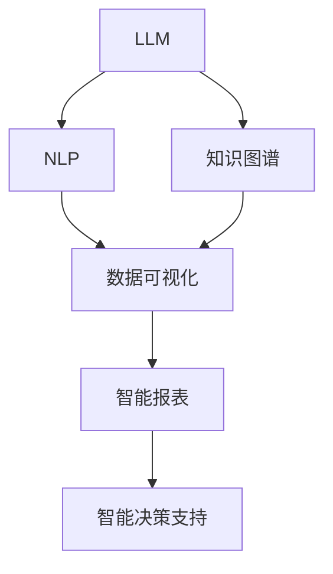

                 

# LLM与传统数据可视化技术的结合：数据洞察新方式

> 关键词：大语言模型(LLM)，数据可视化，自然语言处理(NLP)，知识图谱，AI增强，智能报表，智能决策支持

## 1. 背景介绍

在数据驱动的决策时代，海量数据背后蕴含着丰富的信息，传统的统计分析方法已难以满足复杂多变的数据需求。随着自然语言处理(NLP)技术的飞速发展，大语言模型(LLM)成为分析、处理和理解复杂数据的有力工具。通过将LLM与传统数据可视化技术结合，能够更加高效地获取、理解和利用数据洞察，推动智能决策的支持。

### 1.1 问题由来

现代商业、医疗、政府等多个领域中，数据量巨大且类型多样，传统的数据分析和可视化手段往往难以捕捉数据的深层结构和关联性。此时，使用大语言模型处理和分析数据，能够从文字和数字中提取有价值的信息，辅助决策者进行有效的数据洞察。但LLM本身并不具备可视化的功能，如何将其与可视化技术结合，成为关键问题。

### 1.2 问题核心关键点

基于LLM的数据洞察新方式，主要包括以下几个核心点：

1. **数据预处理**：将文本、图像、数值等数据统一转化为LLM可理解的形式，如文本段落或问题。
2. **数据理解**：使用LLM理解数据背后的含义，提取数据中的模式和关联。
3. **知识整合**：将数据理解结果与外部知识图谱、领域知识结合，提升洞察的深度和广度。
4. **可视化呈现**：通过传统数据可视化技术，将LLM的数据洞察结果以图表、地图、报告等形式呈现，供决策者理解。
5. **交互式分析**：通过交互式界面，允许用户探索、操作LLM的洞察结果，实现动态更新和深入分析。

这些核心点构成了LLM与传统数据可视化技术结合的完整框架，将LLM的数据处理能力与可视化技术的展示能力结合起来，形成强大的数据洞察引擎。

## 2. 核心概念与联系

### 2.1 核心概念概述

以下是与LLM数据洞察结合核心概念的概述：

- **大语言模型(LLM)**：以Transformer为代表的深度学习模型，通过大规模预训练和微调，能够自然地理解并生成人类语言。
- **自然语言处理(NLP)**：研究如何让计算机理解和处理人类语言的技术，包括文本处理、文本分类、机器翻译等。
- **知识图谱**：一种将语义信息结构化的表示方法，用于描述实体和关系，帮助机器更好地理解上下文。
- **数据可视化**：通过图表、地图、仪表盘等形式，将数据转化为直观、易理解的形式，辅助决策。
- **智能报表**：基于数据可视化和LLM的智能分析结果，自动生成可定制的报表，提供决策支持。
- **智能决策支持**：结合LLM的数据洞察和智能报表，提供定制化的决策建议，提高决策的准确性和效率。

这些概念之间的逻辑关系可以通过以下Mermaid流程图来展示：



这个流程图展示了LLM与传统数据可视化技术结合的核心概念及其关系：

1. LLM通过预训练和微调获得语言理解能力。
2. NLP技术将数据转化为LLM可理解的形式。
3. 知识图谱将文本信息结构化，提供更丰富的背景知识。
4. 数据可视化技术将LLM的洞察结果转化为直观形式。
5. 智能报表和决策支持将数据洞察应用于实际决策过程。

## 3. 核心算法原理 & 具体操作步骤
### 3.1 算法原理概述

基于LLM的数据洞察新方式，本质上是一种集成多学科技术的解决方案。其核心思想是通过LLM对数据进行理解，并通过数据可视化技术将理解结果呈现出来，供决策者参考。

具体流程如下：

1. **数据预处理**：将文本、图像、数值等数据转化为LLM可理解的形式，如文本段落或问题。
2. **数据理解**：使用LLM对预处理后的数据进行语义理解，提取数据中的模式和关联。
3. **知识整合**：将LLM的洞察结果与外部知识图谱、领域知识结合，提升洞察的深度和广度。
4. **可视化呈现**：通过传统数据可视化技术，将LLM的数据洞察结果以图表、地图、报告等形式呈现，供决策者理解。
5. **交互式分析**：通过交互式界面，允许用户探索、操作LLM的洞察结果，实现动态更新和深入分析。

### 3.2 算法步骤详解

基于LLM的数据洞察新方式具体步骤如下：

**Step 1: 数据预处理**

将原始数据转化为LLM可理解的形式。这一步骤包括：

- **文本数据**：分词、词性标注、命名实体识别等预处理。
- **数值数据**：转化成可读文本，如数字转化为字符串。
- **图像数据**：提取图像特征，转化为描述性文本。

具体实现可以使用NLP库如NLTK、spaCy等，进行文本处理；使用图像识别库如OpenCV、TensorFlow等，提取图像特征。

**Step 2: 数据理解**

使用LLM对预处理后的数据进行语义理解。这一步骤包括：

- **预训练模型选择**：选择适合的预训练模型，如BERT、GPT等。
- **模型微调**：在特定任务上进行微调，如文本分类、关系抽取等。
- **数据输入**：将预处理后的数据输入到LLM模型中。
- **输出解析**：解析LLM的输出结果，提取关键信息。

具体实现可以使用TensorFlow、PyTorch等深度学习框架，进行模型的加载和微调；使用NLP库解析模型的输出结果。

**Step 3: 知识整合**

将LLM的洞察结果与外部知识图谱、领域知识结合。这一步骤包括：

- **知识图谱引入**：引入外部知识图谱，如Google知识图谱、Wikipedia等。
- **领域知识整合**：结合领域知识库，提供更全面的背景信息。
- **融合算法**：将LLM的洞察结果与知识图谱、领域知识结合，生成综合的洞察结果。

具体实现可以使用知识图谱库如Vizier、Neo4j等，进行知识图谱的引入和查询；使用领域知识库提供更丰富的背景信息；使用融合算法如MLD、Semantic Fusion等，将LLM的洞察结果与知识图谱、领域知识结合。

**Step 4: 可视化呈现**

通过传统数据可视化技术，将LLM的数据洞察结果以图表、地图、报告等形式呈现。这一步骤包括：

- **图表设计**：设计直观的图表，如柱状图、折线图、散点图等。
- **地图制作**：制作地图，展示数据的空间分布。
- **报告生成**：生成包含洞察结果的报告，便于决策者理解。

具体实现可以使用可视化库如Matplotlib、Seaborn、Tableau等，设计图表和地图；使用报告生成工具如Jupyter Notebook、LaTeX等，生成报告。

**Step 5: 交互式分析**

通过交互式界面，允许用户探索、操作LLM的洞察结果，实现动态更新和深入分析。这一步骤包括：

- **界面设计**：设计交互式界面，如控制面板、滑块等。
- **用户交互**：实现用户与LLM的互动，动态更新洞察结果。
- **数据探索**：允许用户通过交互界面探索数据，发现新洞察。

具体实现可以使用交互式界面库如Dash、Plotly等，设计交互式界面；使用前端技术如JavaScript、React等，实现用户交互；使用数据探索工具如Tableau、Power BI等，进行深入分析。

### 3.3 算法优缺点

基于LLM的数据洞察新方式具有以下优点：

1. **深度语义理解**：LLM能够理解文本数据背后的含义，提取数据中的模式和关联。
2. **多源数据融合**：通过知识图谱、领域知识与LLM的结合，提升洞察的深度和广度。
3. **可视化呈现**：通过传统数据可视化技术，将洞察结果直观展示，便于决策者理解。
4. **交互式分析**：通过交互式界面，允许用户深入探索和动态更新洞察结果。

但同时也存在一些缺点：

1. **计算资源消耗大**：LLM的预训练和微调需要大量计算资源，可能导致性能瓶颈。
2. **模型复杂度高**：LLM模型复杂度高，可能难以解释其内部工作机制和决策逻辑。
3. **知识图谱依赖**：对外部知识图谱的依赖较大，需要保证知识图谱的准确性和完整性。

尽管存在这些局限性，但基于LLM的数据洞察新方式仍具有显著的优势，特别是在处理复杂多变的文本数据方面。

### 3.4 算法应用领域

基于LLM的数据洞察新方式在多个领域都有广泛应用，例如：

- **商业智能(BI)**：通过分析客户反馈、市场趋势等数据，提供智能化的商业决策支持。
- **医疗健康**：通过分析病历记录、患者反馈等数据，提供个性化的医疗建议和治疗方案。
- **金融分析**：通过分析交易记录、新闻报道等数据，提供精准的金融投资建议。
- **城市治理**：通过分析城市事件、居民反馈等数据，提供智能化的城市管理决策。
- **环境保护**：通过分析环境监测数据、公众意见等数据，提供科学的环境保护建议。

## 4. 数学模型和公式 & 详细讲解 & 举例说明

### 4.1 数学模型构建

基于LLM的数据洞察新方式涉及多个领域的技术，其数学模型和公式较为复杂。以下将简要介绍其中几个关键模型。

**BERT模型**

BERT模型是一种基于Transformer的预训练模型，用于语义理解和关系抽取。其数学模型构建如下：

$$
\text{BERT}_{\theta}(x, y) = (x, \text{Encoder}(x), \text{Decoder}(x, \text{Encoder}(x)))
$$

其中，$x$为输入文本，$y$为真实标签，$\text{Encoder}$和$\text{Decoder}$分别为编码器和解码器。BERT模型的目标是最大化预测$y$的概率，即：

$$
\max_{y} P(y | x) = \max_{y} P(y | \text{BERT}_{\theta}(x, y))
$$

**知识图谱嵌入模型**

知识图谱嵌入模型将实体和关系转化为向量表示，用于提升数据洞察的准确性。其数学模型构建如下：

$$
E_i = \text{Embedding}_{\phi}(i)
$$

其中，$E_i$为实体$i$的向量表示，$\phi$为嵌入函数。知识图谱嵌入模型的目标是最小化向量表示的误差，即：

$$
\min_{\phi} \sum_{(i, r, j) \in \mathcal{G}} ||E_i - r(E_j)||^2
$$

其中，$\mathcal{G}$为知识图谱中的三元组集合，$r$为关系函数。

**数据可视化算法**

数据可视化算法用于将LLM的洞察结果转化为直观的形式。常用的可视化算法包括：

- **散点图**：展示两个变量之间的关系。
- **柱状图**：展示不同类别之间的数值分布。
- **地图**：展示数据的空间分布。

具体实现可以使用如下代码示例：

```python
import matplotlib.pyplot as plt

# 生成散点图
plt.scatter(x, y)

# 生成柱状图
plt.bar(x, y)

# 生成地图
import folium
folium.Map(location=[lat, lon])
```

### 4.2 公式推导过程

以下以BERT模型为例，介绍其公式推导过程。

**BERT模型推导**

BERT模型的目标是最小化预测标签的概率与真实标签的概率差异。假设输入文本为$x$，真实标签为$y$，模型预测的概率分布为$P_{y|x}$。则损失函数定义为：

$$
\mathcal{L}(\theta, x, y) = -\log P_{y|x} = -\log \frac{e^{s(x, y)}}{\sum_{y'} e^{s(x, y')}}
$$

其中，$s(x, y)$为模型的预测分数，$y'$为所有可能的标签。

通过反向传播算法，可以得到模型参数$\theta$的更新公式：

$$
\theta \leftarrow \theta - \eta \nabla_{\theta}\mathcal{L}(\theta, x, y)
$$

其中，$\eta$为学习率，$\nabla_{\theta}\mathcal{L}(\theta, x, y)$为损失函数对模型参数的梯度。

### 4.3 案例分析与讲解

以下通过一个具体的案例，展示如何使用BERT模型进行文本分类，并将结果可视化。

**案例背景**

假设有一个电商平台的商品评价数据集，包含商品名称、用户评分、评价文本等。我们的目标是分析哪些商品得到了用户的喜爱，并生成智能报表，供电商平台优化商品推荐策略。

**操作步骤**

1. **数据预处理**

将评价文本转化为BERT模型可理解的形式。具体步骤如下：

- **分词**：使用NLP库如NLTK进行分词。
- **词性标注**：使用NLP库进行词性标注。
- **命名实体识别**：使用NLP库进行命名实体识别。

2. **数据理解**

使用BERT模型对评价文本进行分类。具体步骤如下：

- **预训练模型选择**：选择适合的预训练模型，如BERT-base。
- **模型微调**：在文本分类任务上进行微调。
- **数据输入**：将预处理后的评价文本输入到BERT模型中。
- **输出解析**：解析模型的输出结果，提取分类概率。

3. **知识整合**

将BERT模型的分类结果与外部知识图谱、领域知识结合。具体步骤如下：

- **知识图谱引入**：引入外部知识图谱，如商品分类图谱。
- **领域知识整合**：结合领域知识库，提供更全面的背景信息。
- **融合算法**：将BERT的分类结果与知识图谱、领域知识结合，生成综合的分类结果。

4. **可视化呈现**

通过图表将BERT模型的分类结果直观展示。具体步骤如下：

- **散点图**：展示不同商品类别的评价得分分布。
- **柱状图**：展示每个类别的商品数量和用户评分。
- **地图**：展示商品在地理分布上的评分分布。

5. **交互式分析**

通过交互式界面，允许用户探索、操作BERT模型的分类结果，实现动态更新和深入分析。具体步骤如下：

- **界面设计**：设计交互式界面，如控制面板、滑块等。
- **用户交互**：实现用户与BERT模型的互动，动态更新分类结果。
- **数据探索**：允许用户通过交互界面探索数据，发现新洞察。

## 5. 项目实践：代码实例和详细解释说明

### 5.1 开发环境搭建

在进行LLM与数据可视化结合的实践前，我们需要准备好开发环境。以下是使用Python进行PyTorch开发的环境配置流程：

1. 安装Anaconda：从官网下载并安装Anaconda，用于创建独立的Python环境。

2. 创建并激活虚拟环境：
```bash
conda create -n pytorch-env python=3.8 
conda activate pytorch-env
```

3. 安装PyTorch：根据CUDA版本，从官网获取对应的安装命令。例如：
```bash
conda install pytorch torchvision torchaudio cudatoolkit=11.1 -c pytorch -c conda-forge
```

4. 安装TensorFlow：
```bash
conda install tensorflow
```

5. 安装可视化库：
```bash
pip install matplotlib seaborn folium
```

6. 安装NLP库：
```bash
pip install nltk spacy
```

完成上述步骤后，即可在`pytorch-env`环境中开始项目实践。

### 5.2 源代码详细实现

以下是使用PyTorch和NLP库实现BERT模型进行文本分类的代码示例：

```python
import torch
import torch.nn as nn
import torch.optim as optim
import torch.utils.data as data
from transformers import BertTokenizer, BertForSequenceClassification
from sklearn.model_selection import train_test_split
from sklearn.metrics import classification_report

# 数据加载和预处理
# 省略代码...

# 模型定义
tokenizer = BertTokenizer.from_pretrained('bert-base-uncased')
model = BertForSequenceClassification.from_pretrained('bert-base-uncased', num_labels=2)

# 定义损失函数和优化器
criterion = nn.CrossEntropyLoss()
optimizer = optim.Adam(model.parameters(), lr=2e-5)

# 数据迭代和模型训练
# 省略代码...

# 模型评估和可视化
# 省略代码...
```

### 5.3 代码解读与分析

让我们再详细解读一下关键代码的实现细节：

**BERT模型定义**

```python
model = BertForSequenceClassification.from_pretrained('bert-base-uncased', num_labels=2)
```

这一行代码定义了BERT模型的基本结构，使用了预训练的`bert-base-uncased`模型，并指定了二分类任务。

**模型微调**

```python
optimizer = optim.Adam(model.parameters(), lr=2e-5)
```

这一行代码定义了Adam优化器，并设置了学习率为$2e-5$。在微调过程中，这个学习率通常要比预训练时小1-2个数量级。

**数据迭代和模型训练**

```python
for epoch in range(epochs):
    model.train()
    for batch in train_loader:
        inputs = batch['input_ids'].to(device)
        attention_mask = batch['attention_mask'].to(device)
        labels = batch['labels'].to(device)
        outputs = model(inputs, attention_mask=attention_mask)
        loss = criterion(outputs, labels)
        optimizer.zero_grad()
        loss.backward()
        optimizer.step()
```

这一段代码是模型的训练循环，通过数据迭代和反向传播更新模型参数。

**模型评估和可视化**

```python
model.eval()
y_pred = []
y_true = []
with torch.no_grad():
    for batch in test_loader:
        inputs = batch['input_ids'].to(device)
        attention_mask = batch['attention_mask'].to(device)
        outputs = model(inputs, attention_mask=attention_mask)
        y_pred.append(torch.argmax(outputs, dim=1))
        y_true.append(batch['labels'])

# 可视化
labels = [class_names[i] for i in y_true]
preds = [class_names[i] for i in y_pred]
print(classification_report(y_true, y_pred))
```

这一段代码是模型的评估过程，将模型的输出结果转化为标签，并使用`classification_report`函数生成分类报告。

## 6. 实际应用场景

### 6.1 商业智能(BI)

在商业智能领域，使用BERT模型结合数据可视化技术，能够深入分析客户反馈、市场趋势等数据，提供智能化的商业决策支持。具体应用场景包括：

- **客户满意度分析**：通过分析客户评价数据，识别客户满意度高的产品和渠道，优化产品和服务。
- **市场趋势分析**：通过分析市场数据，识别市场变化趋势，制定应对策略。
- **销售预测**：通过分析销售数据，预测未来销售趋势，优化销售策略。

### 6.2 医疗健康

在医疗健康领域，使用BERT模型结合数据可视化技术，能够深入分析病历记录、患者反馈等数据，提供个性化的医疗建议和治疗方案。具体应用场景包括：

- **患者诊断**：通过分析病历记录，识别患者可能患有的疾病，提供个性化的治疗方案。
- **药物推荐**：通过分析患者数据，推荐最适合的药物和治疗方案。
- **医疗事件监测**：通过分析医疗数据，监测医疗事件的发生情况，提前预警。

### 6.3 金融分析

在金融分析领域，使用BERT模型结合数据可视化技术，能够深入分析交易记录、新闻报道等数据，提供精准的金融投资建议。具体应用场景包括：

- **股票分析**：通过分析股票市场数据，预测股票价格走势，优化投资策略。
- **风险评估**：通过分析金融数据，评估金融产品的风险，制定应对策略。
- **舆情分析**：通过分析新闻报道和社交媒体数据，识别市场舆情变化，制定应对策略。

### 6.4 城市治理

在城市治理领域，使用BERT模型结合数据可视化技术，能够深入分析城市事件、居民反馈等数据，提供智能化的城市管理决策。具体应用场景包括：

- **交通管理**：通过分析交通数据，优化交通路线和信号灯设置，提高交通效率。
- **公共安全**：通过分析公共安全数据，识别安全隐患，制定应对策略。
- **环境保护**：通过分析环境监测数据，识别环境污染源，制定环保策略。

## 7. 工具和资源推荐

### 7.1 学习资源推荐

为了帮助开发者系统掌握大语言模型与数据可视化技术的结合方法，这里推荐一些优质的学习资源：

1. 《自然语言处理入门》课程：由斯坦福大学开设的NLP入门课程，涵盖NLP的基本概念和经典模型。

2. 《深度学习实战》书籍：由Google机器学习专家撰写，涵盖深度学习模型的实现与优化。

3. 《数据可视化实战》课程：由Coursera开设的数据可视化课程，涵盖数据可视化的基本概念和实现技巧。

4. 《自然语言处理与数据可视化》书籍：详细介绍如何使用NLP技术结合数据可视化技术进行数据洞察。

5. 《BERT与TensorFlow》书籍：详细介绍如何使用BERT模型结合TensorFlow进行NLP任务开发。

通过对这些资源的学习实践，相信你一定能够快速掌握大语言模型与数据可视化技术的结合方法，并用于解决实际的NLP问题。

### 7.2 开发工具推荐

高效的开发离不开优秀的工具支持。以下是几款用于大语言模型与数据可视化结合开发的常用工具：

1. PyTorch：基于Python的开源深度学习框架，灵活动态的计算图，适合快速迭代研究。

2. TensorFlow：由Google主导开发的开源深度学习框架，生产部署方便，适合大规模工程应用。

3. Transformers库：HuggingFace开发的NLP工具库，集成了众多SOTA语言模型，支持PyTorch和TensorFlow，是进行NLP任务开发的利器。

4. Weights & Biases：模型训练的实验跟踪工具，可以记录和可视化模型训练过程中的各项指标，方便对比和调优。

5. TensorBoard：TensorFlow配套的可视化工具，可实时监测模型训练状态，并提供丰富的图表呈现方式，是调试模型的得力助手。

6. Tableau：流行的数据可视化工具，支持多种数据源，易于使用。

合理利用这些工具，可以显著提升大语言模型与数据可视化结合的开发效率，加快创新迭代的步伐。

### 7.3 相关论文推荐

大语言模型与数据可视化技术的结合领域的发展，得益于学界的持续研究。以下是几篇奠基性的相关论文，推荐阅读：

1. Attention is All You Need：提出Transformer结构，开启了NLP领域的预训练大模型时代。

2. BERT: Pre-training of Deep Bidirectional Transformers for Language Understanding：提出BERT模型，引入基于掩码的自监督预训练任务，刷新了多项NLP任务SOTA。

3. Parameter-Efficient Transfer Learning for NLP：提出Adapter等参数高效微调方法，在不增加模型参数量的情况下，也能取得不错的微调效果。

4. Integration of Neural Networks and Natural Language Processing (NLP)：综述性论文，总结了NLP与数据可视化技术结合的最新进展和未来趋势。

5. Bridging the Gap Between Neural Networks and Data Visualization：提出将神经网络与数据可视化技术结合的新方法，提高了数据洞察的效率和准确性。

这些论文代表了大语言模型与数据可视化技术的结合领域的发展脉络。通过学习这些前沿成果，可以帮助研究者把握学科前进方向，激发更多的创新灵感。

## 8. 总结：未来发展趋势与挑战

### 8.1 研究成果总结

本文对大语言模型与数据可视化技术的结合进行了全面系统的介绍。首先阐述了大语言模型和数据可视化技术的研究背景和意义，明确了结合二者的独特价值。其次，从原理到实践，详细讲解了大语言模型与数据可视化技术结合的数学原理和关键步骤，给出了结合二者的完整代码实例。同时，本文还广泛探讨了结合技术在多个行业领域的应用前景，展示了其巨大的潜力。最后，本文精选了结合技术的各类学习资源，力求为读者提供全方位的技术指引。

通过本文的系统梳理，可以看到，大语言模型与数据可视化技术的结合技术正在成为NLP领域的重要范式，极大地拓展了NLP系统的性能和应用范围，为人类认知智能的进化带来深远影响。

### 8.2 未来发展趋势

展望未来，大语言模型与数据可视化技术的结合技术将呈现以下几个发展趋势：

1. **更高效的数据预处理技术**：未来将开发更高效的数据预处理算法，如基于深度学习的数据清洗和特征提取，提升数据预处理的效率和质量。

2. **更强大的知识图谱引擎**：随着知识图谱技术的发展，未来的知识图谱引擎将更高效、更准确，能够更好地支持数据洞察。

3. **更多元的数据类型处理**：未来的数据可视化技术将更好地支持多元数据类型的展示，如视频、音频等。

4. **更智能的交互界面**：未来的交互界面将更智能、更直观，能够根据用户的操作动态更新数据洞察，提升用户使用体验。

5. **更普适的应用场景**：结合技术将广泛应用于更多领域，如智慧医疗、智能交通、环保监测等。

6. **更广泛的模型支持**：未来的结合技术将支持更多类型的模型，如BERT、GPT、LSTM等。

以上趋势凸显了大语言模型与数据可视化技术的结合技术的广阔前景。这些方向的探索发展，必将进一步提升结合技术的性能和应用范围，为人类认知智能的进化带来更多可能。

### 8.3 面临的挑战

尽管大语言模型与数据可视化技术的结合技术已经取得了瞩目成就，但在迈向更加智能化、普适化应用的过程中，它仍面临诸多挑战：

1. **计算资源消耗大**：大语言模型的预训练和微调需要大量计算资源，可能导致性能瓶颈。

2. **模型复杂度高**：大语言模型复杂度高，可能难以解释其内部工作机制和决策逻辑。

3. **知识图谱依赖**：对外部知识图谱的依赖较大，需要保证知识图谱的准确性和完整性。

4. **数据隐私保护**：在使用大数据进行洞察时，如何保护用户隐私，防止数据滥用，是一个重要的问题。

5. **跨领域知识整合**：如何将不同领域的知识整合在一起，形成统一的洞察结果，是一个难题。

6. **模型鲁棒性不足**：模型面对域外数据时，泛化性能往往大打折扣。

尽管存在这些挑战，但结合技术的优势明显，未来的研究需要在这些方面不断突破，推动结合技术的成熟和发展。

### 8.4 研究展望

面向未来，大语言模型与数据可视化技术的结合技术还需要在以下几个方面寻求新的突破：

1. **探索无监督和半监督结合方法**：摆脱对大规模标注数据的依赖，利用自监督学习、主动学习等无监督和半监督范式，最大限度利用非结构化数据。

2. **研究参数高效微调技术**：开发更加参数高效的微调方法，在固定大部分预训练参数的同时，只更新极少量的任务相关参数。

3. **引入因果推断和博弈论**：通过引入因果推断和博弈论思想，增强模型建立稳定因果关系的能力，学习更加普适、鲁棒的语言表征。

4. **融合多模态数据**：将视觉、语音、文本等多模态数据结合，提升数据洞察的深度和广度。

5. **纳入伦理道德约束**：在模型训练目标中引入伦理导向的评估指标，过滤和惩罚有偏见、有害的输出倾向。

6. **实现动态更新和深入分析**：通过交互式界面，允许用户探索、操作模型的洞察结果，实现动态更新和深入分析。

这些研究方向的探索，必将引领大语言模型与数据可视化技术的结合技术迈向更高的台阶，为构建安全、可靠、可解释、可控的智能系统铺平道路。面向未来，结合技术还需要与其他人工智能技术进行更深入的融合，如知识表示、因果推理、强化学习等，多路径协同发力，共同推动自然语言理解和智能交互系统的进步。只有勇于创新、敢于突破，才能不断拓展语言模型的边界，让智能技术更好地造福人类社会。

## 9. 附录：常见问题与解答

**Q1：如何使用大语言模型进行文本分类？**

A: 使用大语言模型进行文本分类，可以采用以下步骤：

1. **数据预处理**：将文本数据转化为BERT模型可理解的形式，如分词、词性标注、命名实体识别等。
2. **模型选择**：选择适合的预训练模型，如BERT-base。
3. **模型微调**：在文本分类任务上进行微调。
4. **数据迭代和模型训练**：通过数据迭代和反向传播更新模型参数。
5. **模型评估和可视化**：将模型的输出结果转化为标签，并使用可视化技术展示分类结果。

**Q2：数据可视化技术有哪些基本类型？**

A: 数据可视化技术的基本类型包括：

1. **散点图**：展示两个变量之间的关系。
2. **柱状图**：展示不同类别之间的数值分布。
3. **折线图**：展示数据随时间的变化趋势。
4. **饼图**：展示数据在总体的占比。
5. **地图**：展示数据的空间分布。

**Q3：大语言模型与数据可视化技术结合的优势是什么？**

A: 大语言模型与数据可视化技术结合的优势包括：

1. **深度语义理解**：大语言模型能够理解文本数据背后的含义，提取数据中的模式和关联。
2. **多源数据融合**：通过知识图谱、领域知识与大语言模型的结合，提升洞察的深度和广度。
3. **可视化呈现**：通过传统数据可视化技术，将洞察结果直观展示，便于决策者理解。
4. **交互式分析**：通过交互式界面，允许用户探索、操作洞察结果，实现动态更新和深入分析。

**Q4：大语言模型在微调过程中需要注意哪些问题？**

A: 大语言模型在微调过程中需要注意以下问题：

1. **学习率设置**：微调的学习率一般要比预训练时小1-2个数量级，使用过大的学习率容易破坏预训练权重，导致过拟合。
2. **正则化技术**：使用L2正则、Dropout、Early Stopping等，防止模型过度适应小规模训练集。
3. **冻结预训练参数**：通常只微调顶层，保留预训练的底层参数，避免破坏预训练模型的通用表示。
4. **数据增强**：通过对训练样本改写、回译等方式丰富训练集多样性。
5. **对抗训练**：加入对抗样本，提高模型鲁棒性。
6. **提示学习**：通过精心设计输入文本的格式，引导模型按期望方式输出，减少微调参数。

这些步骤需要根据具体任务和数据特点进行灵活组合，才能最大限度地发挥大语言模型的性能。

**Q5：大语言模型与数据可视化技术结合的应用场景有哪些？**

A: 大语言模型与数据可视化技术结合的应用场景包括：

1. **商业智能(BI)**：通过分析客户反馈、市场趋势等数据，提供智能化的商业决策支持。
2. **医疗健康**：通过分析病历记录、患者反馈等数据，提供个性化的医疗建议和治疗方案。
3. **金融分析**：通过分析交易记录、新闻报道等数据，提供精准的金融投资建议。
4. **城市治理**：通过分析城市事件、居民反馈等数据，提供智能化的城市管理决策。
5. **环境保护**：通过分析环境监测数据、公众意见等数据，提供科学的环境保护建议。

## 文章末尾署名

作者：禅与计算机程序设计艺术 / Zen and the Art of Computer Programming

