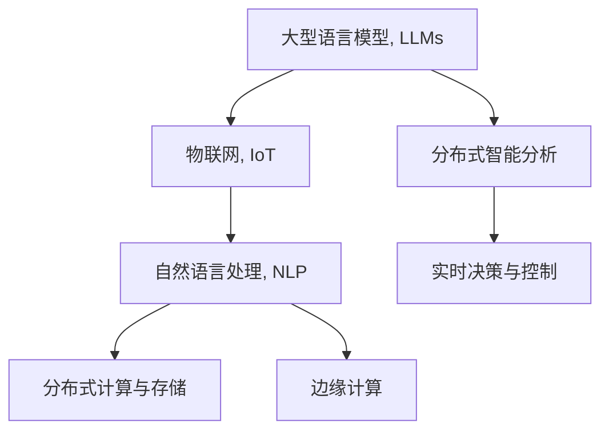

                 

# LLM与物联网的结合前景

> 关键词：

## 1. 背景介绍

### 1.1 问题由来

近年来，物联网(IoT)技术迅猛发展，涵盖了从智能家居、工业互联网到智慧城市等多个领域。物联网设备生成的海量数据需要实时处理和智能分析，才能充分挖掘数据价值，为人类生产生活提供决策支持。传统的集中式存储和计算方式已难以满足实时性、多样性、安全性的需求，因此，分布式智能计算技术成为物联网的重要支撑。

与此同时，人工智能(AI)领域也取得了显著突破，特别是在自然语言处理(NLP)领域，基于大规模预训练语言模型(Large Language Models, LLMs)的微调、提示学习等技术，显著提升了语言理解的深度和广度。LLMs可以理解自然语言描述，进行推理、问答、生成等操作，表现出强大的通用性和灵活性。

将LLMs与物联网结合，利用其强大的语言理解和推理能力，对物联网设备生成的数据进行实时智能分析，可大幅提升数据利用率，带来新的业务模式和应用场景。这种结合将为物联网领域带来全新的视角和变革性影响，成为未来技术发展的重要方向。

## 2. 核心概念与联系

### 2.1 核心概念概述

为更好地理解LLM与物联网的结合前景，本节将介绍几个密切相关的核心概念：

- 大型语言模型(Large Language Models, LLMs)：指基于深度学习技术构建的大规模预训练语言模型，如GPT、BERT等，具备强大的语言理解和生成能力。
- 物联网(IoT)：指通过信息感知技术，全面采集物联设备生成的数据，实现实时、可靠、安全的交互和控制。
- 自然语言处理(Natural Language Processing, NLP)：指通过计算机技术，使计算机能够理解和生成人类语言的技术，如文本分类、实体识别、问答等。
- 分布式计算与存储：指通过多台计算设备协同工作，实现海量数据的分布式存储和高效计算。
- 边缘计算：指将计算能力分布在靠近数据源的设备上，实现快速响应和实时决策。

这些概念之间的逻辑关系可以通过以下Mermaid流程图来展示：



这个流程图展示了LLM、IoT、NLP、分布式计算与存储、边缘计算等概念的关联关系，及其在结合过程中对实时决策和控制的支持。

## 3. 核心算法原理 & 具体操作步骤
### 3.1 算法原理概述

LLM与物联网结合的核心算法原理在于利用LLMs强大的语言理解和推理能力，对物联网设备生成的数据进行实时智能分析，从而提升数据的利用率，实现更加精准的决策和控制。具体实现步骤分为数据采集、数据预处理、模型训练与微调、实时推理四个阶段。

### 3.2 算法步骤详解

#### 3.2.1 数据采集

- 从各类物联网设备采集数据，包括温度、湿度、位置、视频流等。
- 将采集到的数据进行编码，转换成LLMs能够处理的标准格式。

#### 3.2.2 数据预处理

- 对采集到的数据进行清洗、去噪、归一化等处理。
- 将数据集划分为训练集、验证集和测试集，保证模型训练的有效性。

#### 3.2.3 模型训练与微调

- 选择合适的预训练语言模型，如BERT、GPT等，作为初始化参数。
- 使用训练集数据对模型进行监督微调，使其适应物联网设备的语言描述。
- 在验证集上评估微调效果，根据指标决定是否调整微调参数。

#### 3.2.4 实时推理

- 将新采集到的数据输入微调后的模型。
- 模型根据输入数据，生成对物联网设备的控制指令或数据分析结果。
- 利用边缘计算技术，在靠近数据源的设备上进行实时推理，减少延迟。

### 3.3 算法优缺点

#### 3.3.1 优点

- 提升数据利用率：利用LLM强大的语言理解和推理能力，深度挖掘物联网数据中的隐含信息。
- 提高决策精准度：LLM可以理解自然语言描述，进行复杂推理，提升决策的准确性和智能性。
- 支持多样化的应用场景：LLM适用于各种文本描述，灵活应用于物联网的各类任务。
- 实时性良好：边缘计算技术使得模型推理速度极快，满足实时性需求。

#### 3.3.2 缺点

- 数据采集成本高：物联网设备种类繁多，采集和标准化数据成本较高。
- 模型依赖大量数据：微调模型需要大量标注数据，标注成本较高。
- 推理资源消耗大：大型语言模型的推理计算量较大，边缘设备资源有限。
- 安全性和隐私问题：LLM处理敏感数据时，存在隐私泄露和安全风险。

### 3.4 算法应用领域

LLM与物联网结合的方法，在多个应用领域展现出广阔的前景，主要包括：

- 智能家居：利用自然语言处理技术，实现语音控制、情景感知、个性化推荐等功能。
- 工业互联网：通过分析设备传感器数据，提升生产效率，预测设备故障，优化供应链管理。
- 智慧城市：在城市运行管理中，实时处理各类数据，提供智能交通、智慧环保、公共安全等应用。
- 智慧农业：通过分析气象、土壤、作物数据，实现精准农业，提升作物产量和质量。

此外，LLM与物联网的结合还在医疗、物流、教育等多个领域展现出应用潜力。未来，随着技术的不断进步和应用场景的拓展，这种结合将为物联网带来更深层次的智能化提升。

## 4. 数学模型和公式 & 详细讲解

### 4.1 数学模型构建

#### 4.1.1 数据模型

物联网设备生成的数据可以表示为时间序列 $(x_t)$，其中 $t$ 表示时间。每个时间点的数据 $x_t$ 包含多个维度，如温度、湿度、位置等。设 $d$ 为数据维度，$T$ 为数据长度，则数据集可以表示为 $X = \{(x_t, y_t)\}_{t=1}^T$，其中 $y_t$ 为与 $x_t$ 对应的标签信息。

#### 4.1.2 语言模型

大型语言模型可以表示为 $P(w|w_{<t})$，其中 $w$ 为语言序列，$w_{<t}$ 为序列中的前 $t-1$ 个单词。预训练语言模型通常基于自回归模型或自编码模型进行训练，如BERT、GPT等。

### 4.2 公式推导过程

#### 4.2.1 数据预处理

数据预处理过程包括数据清洗、去噪、归一化等。设数据集 $D$ 包含 $N$ 个样本，每个样本 $x_i$ 包含 $d$ 个特征。

$$
x_i = [x_{i,1}, x_{i,2}, \ldots, x_{i,d}]
$$

其中 $x_{i,j}$ 为第 $i$ 个样本的第 $j$ 个特征。

#### 4.2.2 模型训练与微调

选择预训练语言模型 $M_{\theta}$ 作为初始化参数。设微调任务为 $T$，训练集为 $D_T$，微调损失函数为 $\mathcal{L}_T$。在微调过程中，目标是最小化损失函数：

$$
\theta^* = \mathop{\arg\min}_{\theta} \mathcal{L}_T(M_{\theta}, D_T)
$$

其中 $\mathcal{L}_T$ 可以是交叉熵损失、均方误差损失等。微调模型的输出为 $y_{t+1} = M_{\theta}(x_t, w_{<t})$，其中 $w_{<t}$ 为自然语言描述。

#### 4.2.3 实时推理

设实时推理的输入为 $x_{new}$，输出为 $y_{new}$。推理过程为：

$$
y_{new} = M_{\theta}(x_{new}, w_{<t})
$$

其中 $w_{<t}$ 为对 $x_{new}$ 的自然语言描述。

### 4.3 案例分析与讲解

#### 4.3.1 智能家居应用

在智能家居场景中，用户可以通过语音指令控制智能设备。例如，用户说“打开客厅的灯”，系统将这句话作为自然语言描述，输入到微调后的语言模型中，生成控制指令，并发送给相应的设备。微调后的模型可以理解自然语言，进行推理，生成符合用户意愿的控制指令。

#### 4.3.2 工业互联网应用

在工业互联网场景中，设备传感器数据需要进行实时分析，以优化生产流程。例如，采集到某台机器的振动数据异常，系统将此异常数据作为自然语言描述，输入到微调后的语言模型中，生成分析报告，并进行故障预测和维护。微调后的模型可以理解设备状态描述，进行推理，生成有用的分析结果。

## 5. 项目实践：代码实例和详细解释说明

### 5.1 开发环境搭建

在进行LLM与物联网结合的项目开发前，我们需要准备好开发环境。以下是使用Python进行PyTorch和TensorFlow开发的通用环境配置流程：

1. 安装Anaconda：从官网下载并安装Anaconda，用于创建独立的Python环境。

2. 创建并激活虚拟环境：
```bash
conda create -n pytorch-env python=3.8 
conda activate pytorch-env
```

3. 安装PyTorch：根据CUDA版本，从官网获取对应的安装命令。例如：
```bash
conda install pytorch torchvision torchaudio cudatoolkit=11.1 -c pytorch -c conda-forge
```

4. 安装TensorFlow：使用以下命令安装TensorFlow：
```bash
pip install tensorflow
```

5. 安装各类工具包：
```bash
pip install numpy pandas scikit-learn matplotlib tqdm jupyter notebook ipython
```

完成上述步骤后，即可在`pytorch-env`环境中开始项目开发。

### 5.2 源代码详细实现

下面我们以智能家居控制应用为例，给出使用PyTorch和TensorFlow对BERT模型进行微调的PyTorch代码实现。

#### 5.2.1 数据处理

首先，定义智能家居数据处理函数：

```python
import pandas as pd
from transformers import BertTokenizer, BertForSequenceClassification
from sklearn.model_selection import train_test_split

# 加载智能家居数据集
data = pd.read_csv('smart_home_data.csv', sep=';')

# 数据清洗与处理
def preprocess_data(data):
    # 去除无用列
    data = data.drop(['timestamp'], axis=1)
    # 处理标签
    data['label'] = data['action'].apply(lambda x: 1 if x in ['open', 'close', 'on', 'off'] else 0)
    return data

# 预处理数据集
data = preprocess_data(data)
X = data[['temperature', 'humidity', 'lighting', 'motion']].to_numpy()
y = data['label'].to_numpy()

# 划分训练集和测试集
X_train, X_test, y_train, y_test = train_test_split(X, y, test_size=0.2, random_state=42)
```

#### 5.2.2 模型训练与微调

接着，定义模型和优化器：

```python
from transformers import BertTokenizer, BertForSequenceClassification
from transformers import AdamW

# 加载预训练模型和tokenizer
model = BertForSequenceClassification.from_pretrained('bert-base-cased', num_labels=2)
tokenizer = BertTokenizer.from_pretrained('bert-base-cased')

# 定义优化器
optimizer = AdamW(model.parameters(), lr=2e-5)
```

定义训练和评估函数：

```python
from torch.utils.data import DataLoader
from tqdm import tqdm
from sklearn.metrics import accuracy_score

# 将数据转换为tokenized形式
def tokenize_data(X, y):
    X = [tokenizer.encode(x, add_special_tokens=True, max_length=256) for x in X]
    y = [1 if y == 1 else 0 for y in y]
    return X, y

X_train, X_test, y_train, y_test = tokenize_data(X_train, y_train), tokenize_data(X_test, y_test)

# 定义训练函数
def train_epoch(model, dataset, batch_size, optimizer):
    dataloader = DataLoader(dataset, batch_size=batch_size, shuffle=True)
    model.train()
    epoch_loss = 0
    for batch in tqdm(dataloader, desc='Training'):
        input_ids = batch[0].to(device)
        attention_mask = batch[1].to(device)
        labels = batch[2].to(device)
        model.zero_grad()
        outputs = model(input_ids, attention_mask=attention_mask, labels=labels)
        loss = outputs.loss
        epoch_loss += loss.item()
        loss.backward()
        optimizer.step()
    return epoch_loss / len(dataloader)

# 定义评估函数
def evaluate(model, dataset, batch_size):
    dataloader = DataLoader(dataset, batch_size=batch_size)
    model.eval()
    preds, labels = [], []
    with torch.no_grad():
        for batch in tqdm(dataloader, desc='Evaluating'):
            input_ids = batch[0].to(device)
            attention_mask = batch[1].to(device)
            labels = batch[2].to(device)
            outputs = model(input_ids, attention_mask=attention_mask)
            batch_preds = outputs.logits.argmax(dim=1).to('cpu').tolist()
            batch_labels = labels.to('cpu').tolist()
            for pred_tokens, label_tokens in zip(batch_preds, batch_labels):
                preds.append(pred_tokens[:len(label_tokens)])
                labels.append(label_tokens)
    return accuracy_score(labels, preds)
```

最后，启动训练流程并在测试集上评估：

```python
epochs = 5
batch_size = 16

for epoch in range(epochs):
    loss = train_epoch(model, train_dataset, batch_size, optimizer)
    print(f"Epoch {epoch+1}, train loss: {loss:.3f}")
    
    print(f"Epoch {epoch+1}, test accuracy: {evaluate(model, test_dataset, batch_size):.3f}")
    
print("Test accuracy:", evaluate(model, test_dataset, batch_size))
```

以上就是使用PyTorch对BERT进行智能家居控制任务微调的完整代码实现。可以看到，依托于PyTorch和Transformers库，代码实现相对简洁高效。

### 5.3 代码解读与分析

#### 5.3.1 数据预处理

```python
def preprocess_data(data):
    # 去除无用列
    data = data.drop(['timestamp'], axis=1)
    # 处理标签
    data['label'] = data['action'].apply(lambda x: 1 if x in ['open', 'close', 'on', 'off'] else 0)
    return data
```

- 首先去除数据中的无用列。
- 将动作标签转换为二分类标签。

#### 5.3.2 模型训练与微调

```python
def tokenize_data(X, y):
    X = [tokenizer.encode(x, add_special_tokens=True, max_length=256) for x in X]
    y = [1 if y == 1 else 0 for y in y]
    return X, y
```

- 将数据集转换为tokenized形式。
- 将标签转换为二分类标签。

#### 5.3.3 模型训练

```python
model.train()
optimizer.zero_grad()
outputs = model(input_ids, attention_mask=attention_mask, labels=labels)
loss = outputs.loss
loss.backward()
optimizer.step()
```

- 将模型设置为训练模式。
- 计算输入和标签，并计算损失。
- 反向传播更新模型参数。

#### 5.3.4 模型评估

```python
model.eval()
preds, labels = [], []
with torch.no_grad():
    for batch in dataloader:
        input_ids = batch[0].to(device)
        attention_mask = batch[1].to(device)
        labels = batch[2].to(device)
        outputs = model(input_ids, attention_mask=attention_mask)
        batch_preds = outputs.logits.argmax(dim=1).to('cpu').tolist()
        batch_labels = labels.to('cpu').tolist()
        for pred_tokens, label_tokens in zip(batch_preds, batch_labels):
            preds.append(pred_tokens[:len(label_tokens)])
            labels.append(label_tokens)
```

- 将模型设置为评估模式。
- 不更新模型参数，进行推理预测。
- 计算预测结果和标签，并存储。

## 6. 实际应用场景

### 6.1 智能家居

智能家居是大规模应用物联网与大型语言模型的典型场景。用户可以通过语音指令控制家居设备，如开关灯、调节温度等。

微调后的模型可以理解用户的自然语言指令，进行推理，生成相应的控制指令，从而实现智能家居的自动化控制。这种应用不仅提升了用户体验，还节约了大量的人力物力成本。

### 6.2 工业互联网

在工业互联网中，物联网设备生成的数据需要进行实时分析和处理，以优化生产流程、预测设备故障、优化供应链管理等。

通过微调模型，可以将设备的传感器数据转换成自然语言描述，进行分析与推理，生成优化方案和预警信息。例如，采集到某台机器的振动数据异常，模型可以生成分析报告，并进行故障预测和维护。

### 6.3 智慧城市

智慧城市是物联网与大型语言模型结合的另一个典型应用场景。城市管理部门可以利用物联网设备采集到的各类数据，进行实时监控和分析。

例如，通过摄像头采集到的视频数据，结合自然语言描述，可以自动识别车辆违法行为、监控人流密度等。模型可以理解自然语言描述，进行推理，生成有用的分析结果，辅助城市管理部门进行决策。

### 6.4 未来应用展望

未来，随着技术的不断进步，LLM与物联网的结合将展现出更广阔的前景。以下列举几个主要的发展方向：

#### 6.4.1 实时环境感知

通过物联网设备采集到的环境数据，结合自然语言描述，可以实现实时环境感知。例如，采集到某地区的空气质量数据，模型可以生成自然语言描述，辅助城市管理部门发布预警信息。

#### 6.4.2 智能决策支持

在智慧城市、智能家居等领域，利用物联网设备采集到的数据，结合自然语言描述，可以实现智能决策支持。例如，在智能交通管理中，模型可以理解自然语言描述，进行推理，生成最优的交通控制方案。

#### 6.4.3 智能客服

在智能客服领域，利用自然语言处理技术，实现自动回答用户咨询、推荐产品等。例如，用户输入问题“如何购买产品”，模型可以理解自然语言描述，进行推理，生成相应的回答。

#### 6.4.4 健康监测

在医疗领域，利用物联网设备采集到的健康数据，结合自然语言描述，可以实现健康监测和预警。例如，采集到某人的心率数据异常，模型可以生成自然语言描述，提醒医生进行检查。

## 7. 工具和资源推荐

### 7.1 学习资源推荐

为了帮助开发者系统掌握LLM与物联网的结合方法，以下是一些优质的学习资源：

1. **深度学习基础**：推荐《深度学习入门》一书，涵盖深度学习的基础知识，如神经网络、反向传播、优化器等。

2. **自然语言处理基础**：推荐斯坦福大学《自然语言处理与深度学习》课程，涵盖自然语言处理的基本概念和技术。

3. **物联网基础**：推荐《物联网技术与应用》一书，介绍物联网的基本概念、技术架构和应用场景。

4. **边缘计算基础**：推荐《边缘计算》一书，涵盖边缘计算的基本概念、技术架构和应用场景。

5. **大型语言模型基础**：推荐《Transformers: A Survey》一书，涵盖大型语言模型的基本概念和应用。

### 7.2 开发工具推荐

在实际开发过程中，合理使用以下开发工具，可以显著提升开发效率：

1. **PyTorch**：Python语言的高效深度学习框架，支持动态计算图，适合快速迭代研究。

2. **TensorFlow**：Google主导的深度学习框架，生产部署方便，适合大规模工程应用。

3. **Transformers库**：HuggingFace开发的自然语言处理工具库，集成了众多预训练语言模型，支持PyTorch和TensorFlow，方便微调和推理。

4. **TensorBoard**：TensorFlow配套的可视化工具，实时监测模型训练状态，提供丰富的图表呈现方式。

5. **Weights & Biases**：模型训练的实验跟踪工具，记录和可视化模型训练过程中的各项指标，方便对比和调优。

### 7.3 相关论文推荐

LLM与物联网结合领域的研究，涉及多个学科的交叉，以下几篇论文值得深入学习：

1. **IoT-Deep: A Review of Internet of Things for Deep Learning**：综述了物联网与深度学习结合的研究进展，涵盖数据采集、模型训练、边缘计算等方面。

2. **Large-Scale Multilingual Model Fine-Tuning for Smart Home Control**：研究了多语言微调模型在智能家居控制中的应用，提出了基于多语言模型和自然语言处理技术的智能家居解决方案。

3. **AIoT: An Overview of AI for Internet of Things**：综述了人工智能与物联网结合的研究进展，涵盖感知、决策、交互等方面。

4. **Real-Time Edge Computing with Big Data: A Survey**：综述了边缘计算与大数据结合的研究进展，涵盖边缘计算架构、数据处理、安全隐私等方面。

## 8. 总结：未来发展趋势与挑战

### 8.1 研究成果总结

本文对大型语言模型与物联网结合进行了全面系统的介绍，展示了其在智能家居、工业互联网、智慧城市等众多领域的应用前景，介绍了其算法原理和具体操作步骤。通过案例分析，展示了具体的代码实现和模型评估过程，并给出了详细的解释和分析。

### 8.2 未来发展趋势

未来，大型语言模型与物联网的结合将展现出更广阔的前景。以下列举几个主要的发展方向：

1. **实时环境感知**：结合物联网设备采集到的环境数据，利用自然语言处理技术，实现实时环境感知。

2. **智能决策支持**：利用物联网设备采集到的数据，结合自然语言处理技术，实现智能决策支持。

3. **智能客服**：在智能客服领域，利用自然语言处理技术，实现自动回答用户咨询、推荐产品等。

4. **健康监测**：在医疗领域，利用物联网设备采集到的健康数据，结合自然语言处理技术，实现健康监测和预警。

### 8.3 面临的挑战

尽管大型语言模型与物联网的结合技术已经取得了显著进展，但在实际应用中仍面临以下挑战：

1. **数据采集成本高**：物联网设备种类繁多，采集和标准化数据成本较高。

2. **模型依赖大量数据**：微调模型需要大量标注数据，标注成本较高。

3. **推理资源消耗大**：大型语言模型的推理计算量较大，边缘设备资源有限。

4. **安全性和隐私问题**：大型语言模型处理敏感数据时，存在隐私泄露和安全风险。

5. **计算资源消耗大**：微调模型需要大量的计算资源，推广到大规模应用时，计算成本较高。

### 8.4 研究展望

为了应对这些挑战，未来研究需要在以下几个方面寻求新的突破：

1. **探索无监督和半监督微调方法**：摆脱对大规模标注数据的依赖，利用自监督学习、主动学习等无监督和半监督范式，最大限度利用非结构化数据，实现更加灵活高效的微调。

2. **研究参数高效和计算高效的微调范式**：开发更加参数高效的微调方法，在固定大部分预训练参数的同时，只更新极少量的任务相关参数。同时优化微调模型的计算图，减少前向传播和反向传播的资源消耗，实现更加轻量级、实时性的部署。

3. **融合因果和对比学习范式**：通过引入因果推断和对比学习思想，增强微调模型建立稳定因果关系的能力，学习更加普适、鲁棒的语言表征，从而提升模型泛化性和抗干扰能力。

4. **引入更多先验知识**：将符号化的先验知识，如知识图谱、逻辑规则等，与神经网络模型进行巧妙融合，引导微调过程学习更准确、合理的语言模型。同时加强不同模态数据的整合，实现视觉、语音等多模态信息与文本信息的协同建模。

5. **结合因果分析和博弈论工具**：将因果分析方法引入微调模型，识别出模型决策的关键特征，增强输出解释的因果性和逻辑性。借助博弈论工具刻画人机交互过程，主动探索并规避模型的脆弱点，提高系统稳定性。

6. **纳入伦理道德约束**：在模型训练目标中引入伦理导向的评估指标，过滤和惩罚有偏见、有害的输出倾向。同时加强人工干预和审核，建立模型行为的监管机制，确保输出符合人类价值观和伦理道德。

## 9. 附录：常见问题与解答

**Q1：大型语言模型与物联网结合是否适用于所有应用场景？**

A: 大型语言模型与物联网结合的适用性取决于具体应用场景的特点。对于一些需要实时性、安全性要求较高的场景，如医疗、金融等，需要先进行严格的数据清洗和安全处理，避免敏感信息泄露。

**Q2：如何选择合适的自然语言描述？**

A: 自然语言描述的准确性直接影响模型的推理效果。选择自然语言描述时，需要考虑其简洁性、准确性、清晰性等方面。建议结合领域专家的知识，进行人工筛选和标注。

**Q3：微调模型如何进行优化？**

A: 微调模型的优化可以从多个方面入手，如选择合适的优化器、设置合适的学习率、添加正则化技术等。同时，可以利用数据增强、对抗训练等技术，提高模型的鲁棒性和泛化能力。

**Q4：模型推理速度如何提升？**

A: 模型推理速度可以通过优化计算图、使用边缘计算等技术进行提升。此外，合理选择模型结构和硬件设备，如使用GPU加速推理，也能显著提高模型推理速度。

**Q5：如何确保数据和模型的安全？**

A: 确保数据和模型安全需要从数据采集、传输、存储、推理等各个环节进行全面考虑。建议使用数据加密、访问控制、匿名化处理等技术，保障数据和模型安全。

通过以上系统梳理，可以清晰地理解大型语言模型与物联网结合的技术原理和实现方法，掌握其在多个领域的应用前景。未来，随着技术的不断进步和应用场景的拓展，这种结合必将为物联网领域带来更深层次的智能化提升，成为技术发展的重要方向。

---

作者：禅与计算机程序设计艺术 / Zen and the Art of Computer Programming

