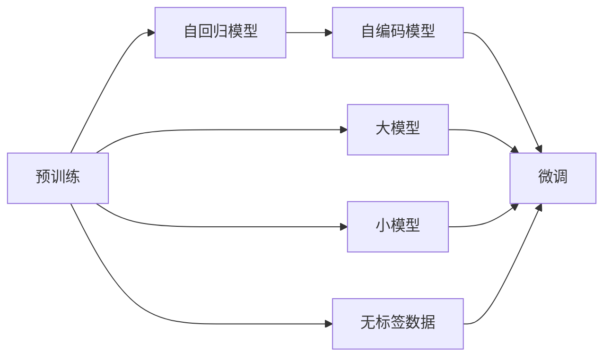

                 

# LLM产业链版图:从无到有

## 1. 背景介绍

在人工智能领域，自然语言处理(Natural Language Processing, NLP)已日益成为炙手可热的技术领域之一。其中，大语言模型(Large Language Model, LLM)作为NLP领域的重要里程碑，逐渐从学术研究向工业界应用转变。本文将从大语言模型的背景入手，探讨其产业链版图及如何从无到有，并详细分析其核心概念与联系。

## 2. 核心概念与联系

### 2.1 核心概念概述

大语言模型通常基于自回归或自编码的Transformer结构，使用大规模无标签文本数据进行预训练，旨在学习到自然语言的通用表示，并在特定任务上进行微调。大语言模型主要分为以下几类：

1. **自回归模型**：如GPT系列，在训练过程中通过前文预测后文，是生成式语言模型。
2. **自编码模型**：如BERT系列，在训练过程中通过掩码语言模型等任务，是预训练的语言模型。

### 2.2 核心概念原理和架构的 Mermaid 流程图



从图中可以看出，大语言模型的产业链版图包含以下几个关键环节：

1. **预训练阶段**：使用大规模无标签文本数据对模型进行预训练，学习通用的语言表示。
2. **微调阶段**：在预训练模型基础上，针对特定任务进行微调，如问答、翻译、摘要等。
3. **部署与应用**：将微调后的模型部署到实际应用中，如智能客服、金融舆情监测、个性化推荐系统等。

## 3. 核心算法原理 & 具体操作步骤

### 3.1 算法原理概述

大语言模型的核心原理是通过大规模无标签数据预训练，学习到语言的通用表示，然后针对特定任务进行微调。微调的目标是通过调整模型的参数，使其在特定任务上达到最优性能。

### 3.2 算法步骤详解

1. **数据准备**：收集与预训练数据集类似的无标签文本数据，用于训练大语言模型。
2. **模型选择**：选择适合任务的预训练模型，如BERT、GPT等。
3. **微调配置**：根据任务特点，配置模型结构、学习率、批大小等参数。
4. **数据增强**：通过数据增强、对抗训练等方式丰富数据集。
5. **模型训练**：在标注数据集上对模型进行微调训练，最小化任务相关的损失函数。
6. **评估与优化**：在验证集上评估模型性能，调整超参数，直至模型收敛。
7. **模型部署**：将微调后的模型部署到实际应用场景中，进行推理和预测。

### 3.3 算法优缺点

#### 优点

1. **泛化能力强**：大模型通常在特定任务上具有较强的泛化能力，能够在有限的标注数据上取得良好的性能。
2. **参数高效**：微调过程中，可以通过参数高效的方法只更新少量参数，降低资源消耗。
3. **灵活性高**：大模型能够适应多种任务，如问答、翻译、摘要等，灵活性高。

#### 缺点

1. **计算成本高**：大模型训练和微调需要较高的计算资源和算力。
2. **过拟合风险**：大模型在特定任务上容易过拟合，需要谨慎处理。
3. **缺乏可解释性**：大模型通常作为“黑盒”模型，其内部工作机制难以解释。

### 3.4 算法应用领域

大语言模型的应用领域非常广泛，主要包括以下几个方面：

1. **自然语言理解**：如情感分析、意图识别、命名实体识别等。
2. **自然语言生成**：如文本摘要、机器翻译、对话系统等。
3. **信息检索**：如问答系统、知识图谱构建等。
4. **文本挖掘**：如主题建模、事件监测等。
5. **社交媒体分析**：如舆情分析、内容过滤等。

## 4. 数学模型和公式 & 详细讲解 & 举例说明

### 4.1 数学模型构建

大语言模型的数学模型通常包括编码器-解码器结构，其中编码器负责提取输入文本的语义表示，解码器负责生成输出文本。这里以BERT为例，其预训练目标函数为：

$$
\mathcal{L}_{pre}(\theta) = -\sum_{i=1}^n \log \frac{e^{\mathbf{z}_i^\top \mathbf{h}(x_i)}}{\sum_{j=1}^n e^{\mathbf{z}_j^\top \mathbf{h}(x_i)}}
$$

其中，$\mathbf{z}_i$ 为掩码标记向量，$\mathbf{h}(x_i)$ 为输入文本 $x_i$ 的语义表示，$\theta$ 为模型参数。

### 4.2 公式推导过程

1. **自回归模型**：

   假设输入序列为 $x_1, x_2, ..., x_T$，输出序列为 $y_1, y_2, ..., y_T$，模型预测输出序列的条件概率为：

   $$
   p(y_1, ..., y_T|x_1, ..., x_T) = \prod_{t=1}^T p(y_t|y_{<t}, x_1, ..., x_T)
   $$

   其中 $y_{<t} = y_1, ..., y_{t-1}$。在训练过程中，通过最大化似然函数 $\log p(y_1, ..., y_T|x_1, ..., x_T)$ 来学习模型参数。

2. **自编码模型**：

   以BERT为例，在预训练阶段，通过掩码语言模型进行训练，目标是最大化输入序列 $x$ 和掩码序列 $\tilde{x}$ 的语义表示之间的相似性：

   $$
   \mathcal{L}_{mask}(\theta) = -\sum_{i=1}^n \log \frac{e^{\mathbf{z}_i^\top \mathbf{h}(x_i)}}{\sum_{j=1}^n e^{\mathbf{z}_j^\top \mathbf{h}(x_i)}}
   $$

### 4.3 案例分析与讲解

以BERT在情感分析任务上的微调为例，具体步骤如下：

1. **数据准备**：收集情感分析数据集，将其分为训练集、验证集和测试集。
2. **模型选择**：选择BERT-base作为预训练模型。
3. **微调配置**：设置微调学习率为2e-5，批大小为16。
4. **模型训练**：在训练集上训练，使用交叉熵损失函数。
5. **评估与优化**：在验证集上评估模型性能，调整学习率等参数。
6. **模型部署**：将微调后的模型部署到实际应用中，进行情感分析预测。

## 5. 项目实践：代码实例和详细解释说明

### 5.1 开发环境搭建

1. **环境安装**：

   ```bash
   pip install torch transformers
   ```

2. **模型加载**：

   ```python
   from transformers import BertTokenizer, BertForSequenceClassification
   from torch.utils.data import DataLoader
   import torch
   
   tokenizer = BertTokenizer.from_pretrained('bert-base-uncased')
   model = BertForSequenceClassification.from_pretrained('bert-base-uncased', num_labels=2)
   ```

### 5.2 源代码详细实现

以下是一个简单的情感分析任务的微调代码示例：

```python
def train_epoch(model, data_loader, optimizer):
    model.train()
    total_loss = 0
    for batch in data_loader:
        input_ids = batch['input_ids'].to(device)
        attention_mask = batch['attention_mask'].to(device)
        labels = batch['labels'].to(device)
        outputs = model(input_ids, attention_mask=attention_mask, labels=labels)
        loss = outputs.loss
        total_loss += loss.item()
        optimizer.zero_grad()
        loss.backward()
        optimizer.step()
    return total_loss / len(data_loader)

def evaluate(model, data_loader):
    model.eval()
    total_correct, total_labels = 0, 0
    for batch in data_loader:
        input_ids = batch['input_ids'].to(device)
        attention_mask = batch['attention_mask'].to(device)
        labels = batch['labels'].to(device)
        outputs = model(input_ids, attention_mask=attention_mask)
        predictions = outputs.logits.argmax(dim=1).to('cpu').tolist()
        total_correct += sum([pred == label for pred, label in zip(predictions, labels)])
        total_labels += len(labels)
    print(f"Accuracy: {total_correct / total_labels}")
```

### 5.3 代码解读与分析

1. **数据准备**：使用PyTorch和Transformers库，加载数据集和模型。
2. **训练循环**：在每个epoch中，对模型进行前向传播和反向传播，计算损失函数。
3. **评估**：在验证集上评估模型性能，计算准确率。

## 6. 实际应用场景

### 6.1 智能客服系统

大语言模型在智能客服系统中可用来自动解答用户咨询，提升服务效率。具体流程如下：

1. **数据收集**：收集历史客服对话记录。
2. **模型微调**：在对话数据上微调大语言模型，使其能够理解用户意图并生成回复。
3. **部署应用**：将微调后的模型部署到客服系统中，实时接收用户咨询并生成回复。

### 6.2 金融舆情监测

大语言模型在金融舆情监测中可用来实时分析舆情变化，防范金融风险。具体流程如下：

1. **数据收集**：收集金融领域相关的新闻、报道、评论等文本数据。
2. **模型微调**：在金融数据上微调大语言模型，使其能够识别舆情变化趋势。
3. **风险预警**：通过实时舆情监测，及时预警可能存在的风险。

### 6.3 个性化推荐系统

大语言模型在个性化推荐系统中可用来分析用户兴趣，推荐相关内容。具体流程如下：

1. **数据收集**：收集用户行为数据，提取文本内容。
2. **模型微调**：在用户行为数据上微调大语言模型，分析用户兴趣。
3. **推荐生成**：根据用户兴趣，生成个性化推荐内容。

### 6.4 未来应用展望

大语言模型在医疗、教育、智能城市治理等领域也有广泛应用前景。未来，大语言模型将更全面地融入各行各业，提升工作效率，实现智能化转型。

## 7. 工具和资源推荐

### 7.1 学习资源推荐

1. **《Transformer from the Inside to the Outside》**：详细介绍了Transformer模型原理和应用，是入门大语言模型的好书。
2. **Hugging Face官方文档**：提供了丰富的预训练模型和微调样例，是快速上手微调的重要资源。
3. **GPT-3论文**：详细介绍了GPT-3模型的架构和训练方法，是理解大语言模型的重要参考资料。

### 7.2 开发工具推荐

1. **PyTorch**：功能强大的深度学习框架，支持多种模型架构和训练方式。
2. **TensorFlow**：灵活的深度学习框架，支持分布式训练和模型部署。
3. **Transformers**：提供了丰富的预训练模型和微调API，简化开发过程。

### 7.3 相关论文推荐

1. **BERT论文**：介绍了BERT模型的预训练方法和效果。
2. **GPT-2论文**：详细介绍了GPT-2模型的架构和训练方法。
3. **XLNet论文**：介绍了XLNet模型的架构和训练方法。

## 8. 总结：未来发展趋势与挑战

### 8.1 研究成果总结

大语言模型在NLP领域取得了显著进展，广泛应用于智能客服、金融舆情监测、个性化推荐系统等场景。微调技术使得大模型能够适应特定任务，提升模型性能。

### 8.2 未来发展趋势

未来大语言模型将朝以下几个方向发展：

1. **模型规模增大**：更大规模的模型能够学习更丰富的语言表示，提升泛化能力。
2. **计算效率提升**：通过优化算法和模型结构，提升大语言模型的计算效率。
3. **跨领域迁移能力增强**：通过迁移学习等方法，提高大语言模型在不同领域的应用能力。
4. **多模态融合**：将视觉、语音等多模态信息与文本信息融合，提升语言模型的理解和生成能力。

### 8.3 面临的挑战

大语言模型在实际应用中仍面临以下挑战：

1. **计算成本高**：大规模模型的训练和微调需要高算力和高存储资源。
2. **数据依赖性强**：需要大量高质量标注数据，难以适应长尾应用场景。
3. **泛化能力不足**：面对新数据时，模型可能出现泛化能力不足的问题。
4. **模型可解释性差**：大语言模型通常作为“黑盒”模型，难以解释其内部工作机制。

### 8.4 研究展望

未来需要重点关注以下几个方面：

1. **低资源优化**：通过优化算法和模型结构，降低大语言模型的计算成本。
2. **迁移学习**：通过迁移学习等方法，提高大语言模型的跨领域适应能力。
3. **多模态融合**：将视觉、语音等多模态信息与文本信息融合，提升语言模型的理解和生成能力。
4. **模型可解释性**：通过因果分析等方法，提高大语言模型的可解释性。

## 9. 附录：常见问题与解答

**Q1: 大语言模型是否适用于所有NLP任务？**

A: 大语言模型在大多数NLP任务上都能取得不错的效果，但对于某些特定领域的任务，如医学、法律等，需要进一步在特定领域数据上进行微调。

**Q2: 如何选择大语言模型？**

A: 根据任务类型选择合适的模型，如自回归模型（GPT系列）或自编码模型（BERT系列）。

**Q3: 如何进行数据增强？**

A: 数据增强可以通过回译、近义替换等方式，丰富训练集的多样性，提高模型的泛化能力。

**Q4: 如何优化模型参数？**

A: 可以通过参数高效方法，如Adapter、Prefix等，只更新少量参数，避免过拟合。

**Q5: 如何评估模型性能？**

A: 可以通过交叉熵、准确率等指标评估模型性能，并使用验证集调整超参数。

**Q6: 如何部署模型？**

A: 将模型保存为TensorFlow模型或PyTorch模型，并使用相应的API进行部署和推理。

作者：禅与计算机程序设计艺术 / Zen and the Art of Computer Programming

