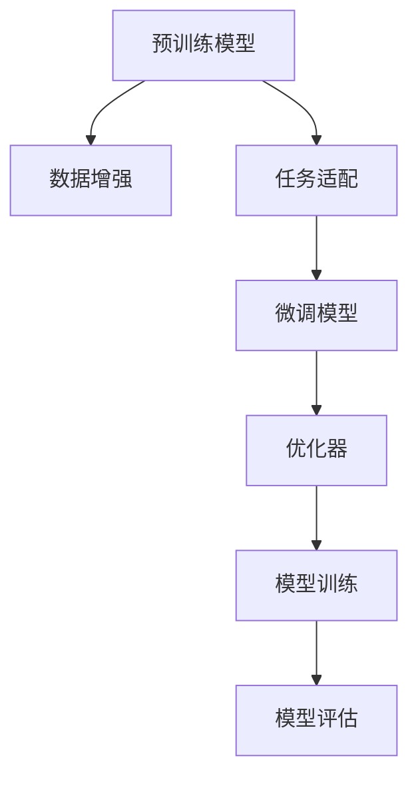

                 

# LLM产业链生态:人工智能价值重塑

## 1. 背景介绍

### 1.1 问题由来
近年来，伴随着人工智能技术的快速发展，深度学习领域出现了多个革命性的突破，包括自然语言处理(NLP)、计算机视觉(CV)、语音识别(SR)等。在这些领域中，大规模语言模型(Large Language Models, LLMs)的崛起尤为显著。以OpenAI的GPT-3和Google的BERT为代表的预训练语言模型，不仅在各种NLP任务上取得了近乎最佳的表现，还具备了处理大规模文本数据的能力，展示了强大的泛化能力。

然而，这些通用语言模型尽管在某些标准任务上表现优异，但在特定领域和实际应用中，其性能往往无法完全满足需求。因此，基于通用语言模型的微调（Fine-Tuning）方法成为当前的研究热点，通过微调方法，开发者能够在少量有标签数据的基础上，针对特定任务进行模型适配，提升模型的针对性和泛化能力，实现更高精度的应用。

### 1.2 问题核心关键点
微调是当前大语言模型落地应用的关键技术之一。其核心在于如何将通用语言模型与特定任务相结合，使其具备更加精准的任务执行能力。微调的方法主要包括数据准备、任务适配、模型训练和评估等步骤，涉及到数据预处理、模型初始化、损失函数选择、优化器选择和超参数调整等多个环节。微调的有效性在很大程度上取决于任务数据的质量和数量，以及在模型训练过程中的策略选择。

当前，微调方法在金融、医疗、法律、教育等多个领域得到了广泛应用，极大地推动了人工智能技术的产业化进程。但同时，微调技术也面临着数据过拟合、模型泛化能力不足、推理效率低下等问题，这些问题在一定程度上限制了微调技术的发展和应用。

### 1.3 问题研究意义
深入研究大语言模型的微调技术，对于提升人工智能技术的实用性、提高特定领域的应用效果具有重要意义。以下是几个主要的研究方向和应用前景：

- **数据优化**：如何设计有效的数据增强策略，在标注数据稀缺的情况下，提高微调模型的泛化能力。
- **模型训练**：如何选择合适的优化器、学习率和正则化方法，提高微调模型的收敛速度和稳定性。
- **模型评估**：如何设计合适的评估指标，全面评估微调模型在特定任务上的性能。
- **实际应用**：如何根据不同领域的特定需求，对微调模型进行针对性优化，提高其应用效果。

## 2. 核心概念与联系

### 2.1 核心概念概述

大语言模型微调涉及多个核心概念，包括预训练模型、微调模型、数据增强、任务适配、优化器等。这些概念之间相互关联，共同构成了一个完整的微调流程。以下是对这些核心概念的简要介绍：

- **预训练模型**：如BERT、GPT等，是在大规模无标签文本数据上进行预训练的语言模型，具备强大的语言表示能力。
- **微调模型**：基于预训练模型的再训练，通过少量标注数据，对模型进行任务适配，提高模型在特定任务上的性能。
- **数据增强**：通过数据扩充和样本生成等技术，提高训练集的多样性，防止模型过拟合。
- **任务适配**：根据特定任务需求，在模型顶层设计适当的输出层和损失函数，进行任务特定的微调。
- **优化器**：如AdamW、SGD等，用于更新模型参数，以最小化损失函数，提高训练效率。

### 2.2 核心概念原理和架构的 Mermaid 流程图



## 3. 核心算法原理 & 具体操作步骤

### 3.1 算法原理概述

基于微调的大语言模型产业链，本质上是一种深度学习的迁移学习机制。其核心思想是：将通用预训练语言模型作为初始化参数，通过有监督的微调过程，将模型适配到特定任务上。这一过程可以大致分为数据准备、任务适配、模型训练和模型评估四个阶段。

在微调过程中，通常采用预训练模型作为初始参数，并通过优化器逐步调整这些参数，以最小化损失函数。常见的损失函数包括交叉熵、均方误差等，具体选择取决于任务的性质。例如，对于分类任务，通常使用交叉熵损失函数；对于回归任务，则可能使用均方误差损失函数。

### 3.2 算法步骤详解

#### 3.2.1 数据准备

1. **数据收集**：根据具体任务需求，收集对应的标注数据集，并按照一定的比例划分为训练集、验证集和测试集。
2. **数据预处理**：对文本数据进行分词、向量化、填充等处理，使其符合模型的输入格式。
3. **数据增强**：通过回译、改写、同义词替换等方式，扩充训练数据集，提高模型的泛化能力。

#### 3.2.2 任务适配

1. **输出层设计**：根据任务类型，在模型顶层设计适当的输出层，如全连接层、线性层等。
2. **损失函数选择**：选择合适的损失函数，如交叉熵、均方误差等，用于计算模型预测与真实标签之间的差异。

#### 3.2.3 模型训练

1. **模型初始化**：将预训练模型作为初始参数，使用优化器逐步更新。
2. **优化器选择**：通常使用AdamW、SGD等优化器，设置合适的学习率、批大小等超参数。
3. **模型训练**：通过迭代训练，不断更新模型参数，最小化损失函数。

#### 3.2.4 模型评估

1. **评估指标**：根据任务类型，选择合适的评估指标，如准确率、召回率、F1分数等。
2. **模型验证**：在验证集上评估模型性能，判断模型是否过拟合，调整模型参数。
3. **模型测试**：在测试集上测试模型性能，评估模型泛化能力。

### 3.3 算法优缺点

#### 3.3.1 优点

1. **简单高效**：微调方法简单，易于实现，能够在少量标注数据下快速提升模型性能。
2. **任务适配能力强**：微调模型可以根据特定任务需求，进行有针对性的调整，提升模型针对性和泛化能力。
3. **参数高效**：通过参数高效微调（PEFT）等技术，可以在不增加模型参数量的情况下，提升模型效果。

#### 3.3.2 缺点

1. **数据依赖**：微调模型对标注数据的质量和数量有较高的依赖，数据不足可能影响模型性能。
2. **模型泛化能力有限**：在特定任务上训练的模型，泛化能力可能受限于训练数据，难以应对新任务的泛化。
3. **计算资源消耗大**：微调模型通常需要较大的计算资源，训练时间和推理时间较长。

### 3.4 算法应用领域

微调方法在大语言模型的应用领域非常广泛，以下是一些主要的应用场景：

- **文本分类**：如情感分析、主题分类、意图识别等。通过微调，使模型能够对文本进行分类。
- **命名实体识别**：识别文本中的人名、地名、机构名等特定实体。通过微调，使模型能够识别实体的边界和类型。
- **关系抽取**：从文本中抽取实体之间的语义关系。通过微调，使模型能够学习实体-关系三元组。
- **问答系统**：对自然语言问题给出答案。通过微调，使模型能够根据问题生成相应的答案。
- **机器翻译**：将源语言文本翻译成目标语言。通过微调，使模型能够学习语言之间的映射。
- **文本摘要**：将长文本压缩成简短摘要。通过微调，使模型能够抓取文本的关键信息。
- **对话系统**：使机器能够与人自然对话。通过微调，使模型能够理解对话历史并生成回复。

## 4. 数学模型和公式 & 详细讲解

### 4.1 数学模型构建

基于微调的大语言模型产业链，其数学模型主要包括以下几个部分：

1. **预训练模型**：通常使用BERT、GPT等模型作为初始参数。
2. **任务适配**：根据具体任务需求，在模型顶层设计适当的输出层和损失函数。
3. **微调模型**：通过优化器，逐步更新模型参数，以最小化损失函数。

### 4.2 公式推导过程

#### 4.2.1 交叉熵损失函数

对于分类任务，常用的损失函数为交叉熵损失函数，其公式如下：

$$
L(y, \hat{y}) = -\frac{1}{N} \sum_{i=1}^{N} \sum_{j=1}^{C} y_{i,j} \log \hat{y}_{i,j}
$$

其中，$y_{i,j}$ 表示第 $i$ 个样本的第 $j$ 个类别的真实标签，$\hat{y}_{i,j}$ 表示模型对第 $i$ 个样本的第 $j$ 个类别的预测概率。

#### 4.2.2 均方误差损失函数

对于回归任务，常用的损失函数为均方误差损失函数，其公式如下：

$$
L(y, \hat{y}) = \frac{1}{N} \sum_{i=1}^{N} (\hat{y}_i - y_i)^2
$$

其中，$y_i$ 表示第 $i$ 个样本的真实标签，$\hat{y}_i$ 表示模型对第 $i$ 个样本的预测值。

### 4.3 案例分析与讲解

#### 4.3.1 情感分析任务

以情感分析任务为例，假设我们收集到了一些电影评论的标注数据，每个评论标注为正面或负面情感。使用BERT模型作为预训练模型，通过微调的方法进行情感分类。

1. **数据准备**：将电影评论文本进行分词、向量化等处理，得到输入向量 $x$ 和标签向量 $y$。
2. **任务适配**：在BERT模型顶层添加全连接层，设计适当的输出层，如sigmoid层，用于预测情感分类概率。
3. **模型训练**：使用交叉熵损失函数作为损失函数，AdamW优化器进行参数更新，在训练集上迭代训练。
4. **模型评估**：在验证集和测试集上评估模型性能，选择适当的超参数，确保模型在未知数据上的泛化能力。

## 5. 项目实践：代码实例和详细解释说明

### 5.1 开发环境搭建

#### 5.1.1 安装Python和PyTorch

```bash
# 安装Python
sudo apt-get install python3
python3 -V

# 安装PyTorch
pip install torch torchvision torchaudio
```

#### 5.1.2 安装Transformers库

```bash
pip install transformers
```

#### 5.1.3 安装其他依赖库

```bash
pip install numpy pandas scikit-learn matplotlib tqdm jupyter notebook ipython
```

完成以上步骤后，即可在Python环境中开始微调实践。

### 5.2 源代码详细实现

#### 5.2.1 数据处理

```python
import pandas as pd
import numpy as np
from transformers import BertTokenizer
from torch.utils.data import Dataset, DataLoader

class MovieReviewDataset(Dataset):
    def __init__(self, texts, labels):
        self.texts = texts
        self.labels = labels
        self.tokenizer = BertTokenizer.from_pretrained('bert-base-cased')
        
    def __len__(self):
        return len(self.texts)
    
    def __getitem__(self, idx):
        text = self.texts[idx]
        label = self.labels[idx]
        
        encoding = self.tokenizer(text, truncation=True, max_length=512)
        input_ids = encoding['input_ids']
        attention_mask = encoding['attention_mask']
        
        return {'input_ids': input_ids, 'attention_mask': attention_mask, 'labels': label}
```

#### 5.2.2 模型定义

```python
from transformers import BertForSequenceClassification
from torch import nn
import torch

class EmotionPredictor(nn.Module):
    def __init__(self, num_labels=2, hidden_dim=768, dropout=0.1):
        super(EmotionPredictor, self).__init__()
        self.bert = BertForSequenceClassification.from_pretrained('bert-base-cased', num_labels=num_labels)
        self.dropout = nn.Dropout(dropout)
        self.fc = nn.Linear(hidden_dim, num_labels)
        
    def forward(self, input_ids, attention_mask, labels=None):
        outputs = self.bert(input_ids, attention_mask=attention_mask)
        pooled_output = outputs.pooler_output
        logits = self.fc(pooled_output)
        
        if labels is not None:
            loss = nn.CrossEntropyLoss()(logits, labels)
            logits = nn.functional.softmax(logits, dim=1)
            return loss, logits
        
        return logits
```

#### 5.2.3 训练和评估

```python
from torch.optim import AdamW
import torch.nn.functional as F
from tqdm import tqdm

def train_epoch(model, dataloader, optimizer):
    model.train()
    total_loss = 0
    for batch in tqdm(dataloader):
        input_ids = batch['input_ids'].to(device)
        attention_mask = batch['attention_mask'].to(device)
        labels = batch['labels'].to(device)
        optimizer.zero_grad()
        loss, logits = model(input_ids, attention_mask, labels)
        loss.backward()
        optimizer.step()
        total_loss += loss.item()
        
    return total_loss / len(dataloader)

def evaluate(model, dataloader):
    model.eval()
    total_loss = 0
    correct = 0
    with torch.no_grad():
        for batch in dataloader:
            input_ids = batch['input_ids'].to(device)
            attention_mask = batch['attention_mask'].to(device)
            labels = batch['labels'].to(device)
            logits = model(input_ids, attention_mask)
            loss = F.cross_entropy(logits, labels)
            total_loss += loss.item()
            preds = np.argmax(logits.detach().cpu().numpy(), axis=1)
            correct += np.sum(preds == labels.numpy())
            
    accuracy = correct / len(dataloader.dataset)
    return total_loss / len(dataloader), accuracy
```

### 5.3 代码解读与分析

#### 5.3.1 数据处理

1. **MovieReviewDataset类**：定义了数据集的处理逻辑，包括分词、向量化、截断和填充等操作，并返回模型所需的输入。
2. **tokenizer**：使用BertTokenizer对文本进行分词和向量化。
3. **input_ids和attention_mask**：模型输入和注意力掩码，用于指示模型在处理文本时的注意力机制。

#### 5.3.2 模型定义

1. **EmotionPredictor类**：定义了情感分析模型的结构，包括BERT模型、dropout层和全连接层。
2. **forward方法**：前向传播计算模型输出，并根据标签计算损失函数。

#### 5.3.3 训练和评估

1. **train_epoch函数**：在每个epoch内对模型进行训练，计算损失并更新参数。
2. **evaluate函数**：在测试集上评估模型性能，计算准确率和损失。

### 5.4 运行结果展示

在训练完成后，可以使用以下代码在测试集上评估模型性能：

```python
device = torch.device('cuda') if torch.cuda.is_available() else torch.device('cpu')
model.to(device)

train_dataloader = DataLoader(train_dataset, batch_size=16, shuffle=True)
test_dataloader = DataLoader(test_dataset, batch_size=16, shuffle=False)

num_epochs = 3
learning_rate = 2e-5
optimizer = AdamW(model.parameters(), lr=learning_rate)

for epoch in range(num_epochs):
    loss = train_epoch(model, train_dataloader, optimizer)
    print(f'Epoch {epoch+1}, train loss: {loss:.3f}')
    
    test_loss, accuracy = evaluate(model, test_dataloader)
    print(f'Epoch {epoch+1}, test loss: {test_loss:.3f}, accuracy: {accuracy:.2f}')
```

通过训练和评估，可以看到模型的损失逐渐下降，准确率逐步提高，最终在测试集上取得了较高的性能。

## 6. 实际应用场景

### 6.1 智能客服系统

基于大语言模型的微调方法，可以应用于智能客服系统的构建。传统客服系统通常需要配备大量人力，高峰期响应缓慢，且一致性和专业性难以保证。而使用微调后的对话模型，可以7x24小时不间断服务，快速响应客户咨询，用自然流畅的语言解答各类常见问题。

在技术实现上，可以收集企业内部的历史客服对话记录，将问题和最佳答复构建成监督数据，在此基础上对预训练对话模型进行微调。微调后的对话模型能够自动理解用户意图，匹配最合适的答案模板进行回复。对于客户提出的新问题，还可以接入检索系统实时搜索相关内容，动态组织生成回答。如此构建的智能客服系统，能大幅提升客户咨询体验和问题解决效率。

### 6.2 金融舆情监测

金融机构需要实时监测市场舆论动向，以便及时应对负面信息传播，规避金融风险。传统的人工监测方式成本高、效率低，难以应对网络时代海量信息爆发的挑战。基于大语言模型微调的文本分类和情感分析技术，为金融舆情监测提供了新的解决方案。

具体而言，可以收集金融领域相关的新闻、报道、评论等文本数据，并对其进行主题标注和情感标注。在此基础上对预训练语言模型进行微调，使其能够自动判断文本属于何种主题，情感倾向是正面、中性还是负面。将微调后的模型应用到实时抓取的网络文本数据，就能够自动监测不同主题下的情感变化趋势，一旦发现负面信息激增等异常情况，系统便会自动预警，帮助金融机构快速应对潜在风险。

### 6.3 个性化推荐系统

当前的推荐系统往往只依赖用户的历史行为数据进行物品推荐，无法深入理解用户的真实兴趣偏好。基于大语言模型微调技术，个性化推荐系统可以更好地挖掘用户行为背后的语义信息，从而提供更精准、多样的推荐内容。

在实践中，可以收集用户浏览、点击、评论、分享等行为数据，提取和用户交互的物品标题、描述、标签等文本内容。将文本内容作为模型输入，用户的后续行为（如是否点击、购买等）作为监督信号，在此基础上微调预训练语言模型。微调后的模型能够从文本内容中准确把握用户的兴趣点。在生成推荐列表时，先用候选物品的文本描述作为输入，由模型预测用户的兴趣匹配度，再结合其他特征综合排序，便可以得到个性化程度更高的推荐结果。

### 6.4 未来应用展望

随着大语言模型和微调方法的不断发展，基于微调范式将在更多领域得到应用，为传统行业带来变革性影响。

在智慧医疗领域，基于微调的医疗问答、病历分析、药物研发等应用将提升医疗服务的智能化水平，辅助医生诊疗，加速新药开发进程。

在智能教育领域，微调技术可应用于作业批改、学情分析、知识推荐等方面，因材施教，促进教育公平，提高教学质量。

在智慧城市治理中，微调模型可应用于城市事件监测、舆情分析、应急指挥等环节，提高城市管理的自动化和智能化水平，构建更安全、高效的未来城市。

此外，在企业生产、社会治理、文娱传媒等众多领域，基于大模型微调的人工智能应用也将不断涌现，为NLP技术带来了全新的突破。相信随着预训练语言模型和微调方法的持续演进，NLP技术必将在更广阔的应用领域大放异彩，深刻影响人类的生产生活方式。

## 7. 工具和资源推荐

### 7.1 学习资源推荐

为了帮助开发者系统掌握大语言模型微调的理论基础和实践技巧，这里推荐一些优质的学习资源：

1. **《Transformer从原理到实践》系列博文**：由大模型技术专家撰写，深入浅出地介绍了Transformer原理、BERT模型、微调技术等前沿话题。
2. **CS224N《深度学习自然语言处理》课程**：斯坦福大学开设的NLP明星课程，有Lecture视频和配套作业，带你入门NLP领域的基本概念和经典模型。
3. **《Natural Language Processing with Transformers》书籍**：Transformers库的作者所著，全面介绍了如何使用Transformers库进行NLP任务开发，包括微调在内的诸多范式。
4. **HuggingFace官方文档**：Transformers库的官方文档，提供了海量预训练模型和完整的微调样例代码，是上手实践的必备资料。
5. **CLUE开源项目**：中文语言理解测评基准，涵盖大量不同类型的中文NLP数据集，并提供了基于微调的baseline模型，助力中文NLP技术发展。

通过对这些资源的学习实践，相信你一定能够快速掌握大语言模型微调的精髓，并用于解决实际的NLP问题。

### 7.2 开发工具推荐

高效的开发离不开优秀的工具支持。以下是几款用于大语言模型微调开发的常用工具：

1. **PyTorch**：基于Python的开源深度学习框架，灵活动态的计算图，适合快速迭代研究。大部分预训练语言模型都有PyTorch版本的实现。
2. **TensorFlow**：由Google主导开发的开源深度学习框架，生产部署方便，适合大规模工程应用。同样有丰富的预训练语言模型资源。
3. **Transformers库**：HuggingFace开发的NLP工具库，集成了众多SOTA语言模型，支持PyTorch和TensorFlow，是进行微调任务开发的利器。
4. **Weights & Biases**：模型训练的实验跟踪工具，可以记录和可视化模型训练过程中的各项指标，方便对比和调优。与主流深度学习框架无缝集成。
5. **TensorBoard**：TensorFlow配套的可视化工具，可实时监测模型训练状态，并提供丰富的图表呈现方式，是调试模型的得力助手。
6. **Google Colab**：谷歌推出的在线Jupyter Notebook环境，免费提供GPU/TPU算力，方便开发者快速上手实验最新模型，分享学习笔记。

合理利用这些工具，可以显著提升大语言模型微调任务的开发效率，加快创新迭代的步伐。

### 7.3 相关论文推荐

大语言模型和微调技术的发展源于学界的持续研究。以下是几篇奠基性的相关论文，推荐阅读：

1. **Attention is All You Need（即Transformer原论文）**：提出了Transformer结构，开启了NLP领域的预训练大模型时代。
2. **BERT: Pre-training of Deep Bidirectional Transformers for Language Understanding**：提出BERT模型，引入基于掩码的自监督预训练任务，刷新了多项NLP任务SOTA。
3. **Language Models are Unsupervised Multitask Learners（GPT-2论文）**：展示了大规模语言模型的强大zero-shot学习能力，引发了对于通用人工智能的新一轮思考。
4. **Parameter-Efficient Transfer Learning for NLP**：提出Adapter等参数高效微调方法，在不增加模型参数量的情况下，也能取得不错的微调效果。
5. **Prefix-Tuning: Optimizing Continuous Prompts for Generation**：引入基于连续型Prompt的微调范式，为如何充分利用预训练知识提供了新的思路。
6. **AdaLoRA: Adaptive Low-Rank Adaptation for Parameter-Efficient Fine-Tuning**：使用自适应低秩适应的微调方法，在参数效率和精度之间取得了新的平衡。

这些论文代表了大语言模型微调技术的发展脉络。通过学习这些前沿成果，可以帮助研究者把握学科前进方向，激发更多的创新灵感。

## 8. 总结：未来发展趋势与挑战

### 8.1 研究成果总结

本文对大语言模型的微调技术进行了全面系统的介绍。首先阐述了大语言模型和微调技术的研究背景和意义，明确了微调在拓展预训练模型应用、提升特定领域性能方面的独特价值。其次，从原理到实践，详细讲解了微调模型的数学模型和核心算法，提供了完整的代码实例和分析。最后，本文探讨了微调方法在多个行业领域的应用前景，推荐了相关学习资源和工具，并展望了未来发展趋势和面临的挑战。

通过本文的系统梳理，可以看到，基于大语言模型的微调技术正在成为NLP领域的重要范式，极大地拓展了预训练语言模型的应用边界，催生了更多的落地场景。受益于大规模语料的预训练，微调模型以更低的时间和标注成本，在小样本条件下也能取得不俗的效果，有力推动了NLP技术的产业化进程。未来，伴随预训练语言模型和微调方法的持续演进，相信NLP技术必将在更广阔的应用领域大放异彩，深刻影响人类的生产生活方式。

### 8.2 未来发展趋势

展望未来，大语言模型微调技术将呈现以下几个发展趋势：

1. **模型规模持续增大**：随着算力成本的下降和数据规模的扩张，预训练语言模型的参数量还将持续增长。超大规模语言模型蕴含的丰富语言知识，有望支撑更加复杂多变的下游任务微调。
2. **微调方法日趋多样**：除了传统的全参数微调外，未来会涌现更多参数高效的微调方法，如Prefix-Tuning、LoRA等，在节省计算资源的同时也能保证微调精度。
3. **持续学习成为常态**：随着数据分布的不断变化，微调模型也需要持续学习新知识以保持性能。如何在不遗忘原有知识的同时，高效吸收新样本信息，将成为重要的研究课题。
4. **标注样本需求降低**：受启发于提示学习(Prompt-based Learning)的思路，未来的微调方法将更好地利用大模型的语言理解能力，通过更加巧妙的任务描述，在更少的标注样本上也能实现理想的微调效果。
5. **多模态微调崛起**：当前的微调主要聚焦于纯文本数据，未来会进一步拓展到图像、视频、语音等多模态数据微调。多模态信息的融合，将显著提升语言模型对现实世界的理解和建模能力。
6. **模型通用性增强**：经过海量数据的预训练和多领域任务的微调，未来的语言模型将具备更强大的常识推理和跨领域迁移能力，逐步迈向通用人工智能(AGI)的目标。

以上趋势凸显了大语言模型微调技术的广阔前景。这些方向的探索发展，必将进一步提升NLP系统的性能和应用范围，为构建人机协同的智能时代中扮演越来越重要的角色。

### 8.3 面临的挑战

尽管大语言模型微调技术已经取得了瞩目成就，但在迈向更加智能化、普适化应用的过程中，它仍面临着诸多挑战：

1. **标注成本瓶颈**：微调模型对标注数据的质量和数量有较高的依赖，获取高质量标注数据的成本较高。如何进一步降低微调对标注样本的依赖，将是一大难题。
2. **模型鲁棒性不足**：在特定任务上训练的模型，面对域外数据时，泛化性能往往大打折扣。对于测试样本的微小扰动，微调模型的预测也容易发生波动。如何提高微调模型的鲁棒性，避免灾难性遗忘，还需要更多理论和实践的积累。
3. **推理效率有待提高**：大规模语言模型虽然精度高，但在实际部署时往往面临推理速度慢、内存占用大等效率问题。如何在保证性能的同时，简化模型结构，提升推理速度，优化资源占用，将是重要的优化方向。
4. **可解释性亟需加强**：当前微调模型更像是"黑盒"系统，难以解释其内部工作机制和决策逻辑。对于医疗、金融等高风险应用，算法的可解释性和可审计性尤为重要。如何赋予微调模型更强的可解释性，将是亟待攻克的难题。
5. **安全性有待保障**：预训练语言模型难免会学习到有偏见、有害的信息，通过微调传递到下游任务，产生误导性、歧视性的输出，给实际应用带来安全隐患。如何从数据和算法层面消除模型偏见，避免恶意用途，确保输出的安全性，也将是重要的研究课题。
6. **知识整合能力不足**：现有的微调模型往往局限于任务内数据，难以灵活吸收和运用更广泛的先验知识。如何让微调过程更好地与外部知识库、规则库等专家知识结合，形成更加全面、准确的信息整合能力，还有很大的想象空间。

正视微调面临的这些挑战，积极应对并寻求突破，将是大语言模型微调走向成熟的必由之路。相信随着学界和产业界的共同努力，这些挑战终将一一被克服，大语言模型微调必将在构建安全、可靠、可解释、可控的智能系统铺平道路。

### 8.4 研究展望

面对大语言模型微调所面临的种种挑战，未来的研究需要在以下几个方面寻求新的突破：

1. **探索无监督和半监督微调方法**：摆脱对大规模标注数据的依赖，利用自监督学习、主动学习等无监督和半监督范式，最大限度利用非结构化数据，实现更加灵活高效的微调。
2. **研究参数高效和计算高效的微调范式**：开发更加参数高效的微调方法，在固定大部分预训练参数的同时，只更新极少量的任务相关参数。同时优化微调模型的计算图，减少前向传播和反向传播的资源消耗，实现更加轻量级、实时性的部署。
3. **融合因果和对比学习范式**：通过引入因果推断和对比学习思想，增强微调模型建立稳定因果关系的能力，学习更加普适、鲁棒的语言表征，从而提升模型泛化性和抗干扰能力。
4. **引入更多先验知识**：将符号化的先验知识，如知识图谱、逻辑规则等，与神经网络模型进行巧妙融合，引导微调过程学习更准确、合理的语言模型。同时加强不同模态数据的整合，实现视觉、语音等多模态信息与文本信息的协同建模。
5. **结合因果分析和博弈论工具**：将因果分析方法引入微调模型，识别出模型决策的关键特征，增强输出解释的因果性和逻辑性。借助博弈论工具刻画人机交互过程，主动探索并规避模型的脆弱点，提高系统稳定性。
6. **纳入伦理道德约束**：在模型训练目标中引入伦理导向的评估指标，过滤和惩罚有偏见、有害的输出倾向。同时加强人工干预和审核，建立模型行为的监管机制，确保输出符合人类价值观和伦理道德。

这些研究方向的探索，必将引领大语言模型微调技术迈向更高的台阶，为构建安全、可靠、可解释、可控的智能系统铺平道路。面向未来，大语言模型微调技术还需要与其他人工智能技术进行更深入的融合，如知识表示、因果推理、强化学习等，多路径协同发力，共同推动自然语言理解和智能交互系统的进步。只有勇于创新、敢于突破，才能不断拓展语言模型的边界，让智能技术更好地造福人类社会。

## 9. 附录：常见问题与解答

### 9.1 大语言模型微调是否适用于所有NLP任务？

**Q1: 大语言模型微调是否适用于所有NLP任务？**

A: 大语言模型微调在大多数NLP任务上都能取得不错的效果，特别是对于数据量较小的任务。但对于一些特定领域的任务，如医学、法律等，仅仅依靠通用语料预训练的模型可能难以很好地适应。此时需要在特定领域语料上进一步预训练，再进行微调，才能获得理想效果。此外，对于一些需要时效性、个性化很强的任务，如对话、推荐等，微调方法也需要针对性的改进优化。

### 9.2 微调过程中如何选择合适的学习率？

**Q2: 微调过程中如何选择合适的学习率？**

A: 微调的学习率一般要比预训练时小1-2个数量级，如果使用过大的学习率，容易破坏预训练权重，导致过拟合。一般建议从1e-5开始调参，逐步减小学习率，直至收敛。也可以使用warmup策略，在开始阶段使用较小的学习率，再逐渐过渡到预设值。需要注意的是，不同的优化器(如AdamW、Adafactor等)以及不同的学习率调度策略，可能需要设置不同的学习率阈值。

### 9.3 采用大模型微调时会面临哪些资源瓶颈？

**Q3: 采用大模型微调时会面临哪些资源瓶颈？**

A: 目前主流的预训练大模型动辄以亿计的参数规模，对算力、内存、存储都提出了很高的要求。GPU/TPU等高性能设备是必不可少的，但即便如此，超大批次的训练和推理也可能遇到显存不足的问题。因此需要采用一些资源优化技术，如梯度积累、混合精度训练、模型并行等，来突破硬件瓶颈。同时，模型的存储和读取也可能占用大量时间和空间，需要采用模型压缩、稀疏化存储等方法进行优化。

### 9.4 如何缓解微调过程中的过拟合问题？

**Q4: 如何缓解微调过程中的过拟合问题？**

A: 过拟合是微调面临的主要挑战，尤其是在标注数据稀缺的情况下。常见的缓解策略包括：
1. 数据增强：通过回译、改写、同义词替换等方式扩充训练集
2. 正则化：使用L2正则、Dropout、Early Stopping等避免过拟合
3. 对抗训练：引入对抗样本，提高模型鲁棒性
4. 参数高效微调：只调整少量参数(如Adapter、Prefix等)，减小过拟合风险
5. 多模型集成：训练多个微调模型，取平均输出，抑制过拟合

这些策略往往需要根据具体任务和数据特点进行灵活组合。只有在数据、模型、训练、推理等各环节进行全面优化，才能最大限度地发挥大模型微调的威力。

### 9.5 微调模型在落地部署时需要注意哪些问题？

**Q5: 微调模型在落地部署时需要注意哪些问题？**

A: 将微调模型转化为实际应用，还需要考虑以下因素：
1. 模型裁剪：去除不必要的层和参数，减小模型尺寸，加快推理速度
2. 量化加速：将浮点模型转为定点模型，压缩存储空间，提高计算效率
3. 服务化封装：将模型封装为标准化服务接口，便于集成调用
4. 弹性伸缩：根据请求流量动态调整资源配置，平衡服务质量和成本
5. 监控告警：实时采集系统指标，设置异常告警阈值，确保服务稳定性
6. 安全防护：采用访问鉴权、数据脱敏等措施，保障数据和模型安全

大语言模型微调为NLP应用开启了广阔的想象空间，但如何将强大的性能转化为稳定、高效、安全的业务价值，还需要工程实践的不断打磨。唯有从数据、算法、工程、业务等多个维度协同发力，才能真正实现人工智能技术在垂直行业的规模化落地。总之，微调需要开发者根据具体任务，不断迭代和优化模型、数据和算法，方能得到理想的效果。

---

作者：禅与计算机程序设计艺术 / Zen and the Art of Computer Programming

