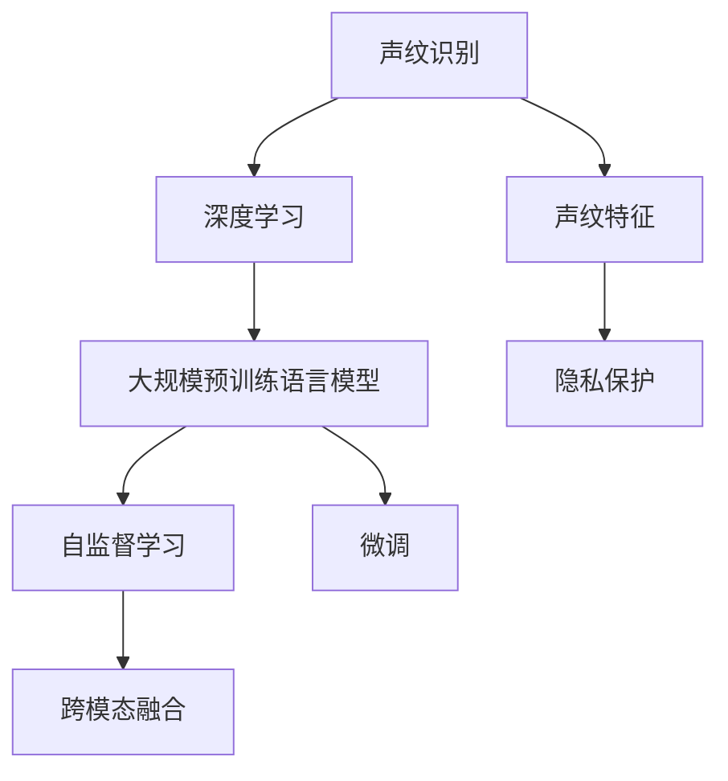

                 

# LLM在声纹识别任务中的优化思路

> 关键词：声纹识别,声纹特征,深度学习,Transformer,自监督学习,微调,损失函数,跨模态融合,隐私保护

## 1. 背景介绍

声纹识别（Speaker Recognition）是语音信号处理和机器学习交叉的典型应用，旨在通过分析人的声学特征，识别说话人的身份。该技术广泛应用于信息安全、金融交易、移动通信等领域，具有重大的实际应用价值。声纹识别技术基于声纹特征的提取和匹配，以区分不同说话人的声音信号。传统的声纹识别技术多依赖于手工设计的特征提取方法，如MFCC（Mel Frequency Cepstral Coefficients）、LPC（Linear Prediction Coding）等，存在特征提取复杂度高、计算量大的问题。

近年来，深度学习和大规模预训练语言模型（Large Language Models, LLMs）的兴起，为声纹识别领域带来了新的思路和方向。利用深度学习技术，可以自动从原始语音信号中学习到更丰富的声学特征，大幅提升识别精度和鲁棒性。特别是Transformer架构和自监督学习方法，已在声纹识别领域展现出巨大潜力。

本文将聚焦于利用大语言模型（LLMs）进行声纹识别的优化思路，主要内容包括大语言模型在声纹识别中的应用背景、核心算法原理与操作步骤、数学模型和公式推导、项目实践与实际应用场景、相关资源推荐及未来发展趋势与挑战等。希望通过本文，读者能够了解如何在大语言模型的基础上进行声纹识别优化，并认识到深度学习在声纹识别任务中的强大应用前景。

## 2. 核心概念与联系

### 2.1 核心概念概述

本节将介绍几个与大语言模型在声纹识别任务中应用密切相关的核心概念：

- 声纹识别（Speaker Recognition）：通过分析人的声音特征，识别说话人的身份。常见的应用包括用户身份验证、账户安全、内容审核等。

- 声纹特征（Speaker Feature）：声纹识别的核心在于从语音信号中提取和匹配声纹特征。常见的特征包括MFCC、LPC、频谱图、声调等。

- 深度学习（Deep Learning）：一种通过多层神经网络自动学习特征表示的机器学习方法。在声纹识别中，深度学习技术能够自动从原始语音信号中学习到丰富的声学特征。

- 大规模预训练语言模型（Large Language Models, LLMs）：如GPT、BERT等，通过海量的无标签文本数据进行预训练，学习语言的通用表示。在声纹识别中，LLMs可以作为特征提取器，提取更高级别的声学特征。

- 自监督学习（Self-supervised Learning）：利用无标签数据训练模型，学习数据的隐含语义。在声纹识别中，自监督学习方法可用于进一步优化声纹特征提取。

- 微调（Fine-tuning）：在大规模预训练模型的基础上，通过有标签数据进行微调，提升模型在特定任务上的表现。在声纹识别中，微调技术可以提升声纹特征提取器的识别精度。

- 跨模态融合（Cross-modal Fusion）：将不同模态的数据（如语音、文本、图像等）融合到统一模型中进行分析。在声纹识别中，可以通过跨模态融合技术提升声纹识别的鲁棒性和泛化能力。

- 隐私保护（Privacy Protection）：在声纹识别中，隐私保护是一个重要议题。需要设计适当的机制，保护说话人的隐私信息，同时保证识别系统的有效性。

这些概念通过一个简单的Mermaid流程图进行展示：



这个流程图展示了声纹识别的核心概念及其之间的关系：声纹识别依赖于声纹特征提取，而深度学习和自监督学习方法可以自动提取和优化声纹特征。大规模预训练语言模型可以作为特征提取器，进一步提升特征的泛化能力。微调技术可以针对特定任务进行优化，提升识别精度。跨模态融合技术可以增强系统鲁棒性，隐私保护技术则确保数据安全。

## 3. 核心算法原理 & 具体操作步骤
### 3.1 算法原理概述

大语言模型在声纹识别中的应用，主要通过以下几个步骤进行：

1. **预训练**：利用大规模无标签语音数据对大语言模型进行预训练，学习语言的通用表示。

2. **特征提取**：利用预训练后的语言模型，自动从语音信号中提取声纹特征。

3. **微调**：在提取的声纹特征上，使用小规模的标注数据进行微调，提升模型在特定声纹识别任务上的性能。

4. **融合与输出**：将提取的声纹特征与其他模态的数据（如文本、图像）进行跨模态融合，最终输出声纹识别结果。

5. **隐私保护**：设计隐私保护机制，确保在声纹识别过程中保护说话人的隐私信息。

### 3.2 算法步骤详解

#### 步骤1：数据准备

1. **收集语音数据**：收集大量的无标签语音数据，用于预训练大语言模型。通常需要多样化的语音数据，以覆盖不同的说话人和场景。

2. **标注数据**：收集小规模的标注数据，用于微调大语言模型。标注数据需要包含说话人的真实身份，用于训练模型的匹配能力。

3. **数据预处理**：对语音数据进行预处理，如去噪、归一化、分段等操作，以便后续模型训练。

#### 步骤2：模型预训练

1. **选择模型架构**：选择适合的深度学习模型架构，如Transformer、CNN等。

2. **定义损失函数**：定义合适的损失函数，如交叉熵损失、均方误差损失等，用于衡量模型预测与真实标签的差异。

3. **数据划分**：将无标签数据划分为训练集和验证集，用于模型的训练和验证。

4. **训练模型**：利用预训练数据，训练大语言模型。通常需要设置合适的学习率、批大小、迭代轮数等超参数。

#### 步骤3：特征提取

1. **输入特征**：将原始语音信号转换为特征向量，如MFCC、LPC等。

2. **预训练模型输入**：将特征向量作为输入，送入预训练后的语言模型进行特征提取。

3. **特征输出**：模型输出一个高维的特征向量，用于后续的声纹识别和微调。

#### 步骤4：微调

1. **定义任务**：定义声纹识别任务，如说话人识别、说话人验证等。

2. **微调参数**：选择适当的参数进行微调，如仅微调顶层分类器、全部参数等。

3. **定义损失函数**：根据声纹识别任务，定义相应的损失函数。

4. **训练微调模型**：使用标注数据，训练微调后的模型。设置合适的超参数，如学习率、批大小等。

#### 步骤5：融合与输出

1. **跨模态融合**：将声纹特征与其他模态的数据进行融合，如利用文本描述进一步增强识别能力。

2. **输出识别结果**：将融合后的数据输入到微调后的模型，输出最终的声纹识别结果。

#### 步骤6：隐私保护

1. **设计隐私保护机制**：如差分隐私、联邦学习等，确保在声纹识别过程中保护说话人的隐私。

2. **数据脱敏**：对敏感数据进行脱敏处理，避免泄露个人信息。

### 3.3 算法优缺点

**优点**：

1. **自动特征提取**：利用深度学习技术，自动从语音信号中提取声纹特征，无需手工设计特征。

2. **泛化能力强**：预训练后的语言模型具有较强的泛化能力，可以在多种场景下提取声纹特征。

3. **微调效果好**：通过微调技术，可以进一步提升声纹识别模型的识别精度。

4. **跨模态融合**：利用跨模态融合技术，可以增强系统的鲁棒性和泛化能力。

5. **隐私保护机制**：设计隐私保护机制，确保声纹识别过程中保护说话人的隐私信息。

**缺点**：

1. **计算资源消耗大**：深度学习模型和预训练需要大量的计算资源，对硬件要求较高。

2. **数据需求量大**：需要大量的无标签和标注数据，数据获取成本较高。

3. **过拟合风险**：在微调过程中，需要谨慎设置超参数，避免模型过拟合。

4. **隐私保护难度大**：设计隐私保护机制，需要考虑多方面因素，实现复杂。

### 3.4 算法应用领域

大语言模型在声纹识别中的应用领域广泛，包括但不限于：

1. **身份验证**：利用声纹识别技术进行用户身份验证，如手机解锁、金融交易等。

2. **内容审核**：通过声纹识别技术，判断语音内容是否为特定说话人所说，用于内容审核和识别。

3. **智能客服**：利用声纹识别技术，实现语音交互中的自动语音识别和说话人验证。

4. **医疗诊断**：利用声纹识别技术，进行患者身份验证和病历记录，提高医疗服务的准确性和安全性。

5. **法律取证**：利用声纹识别技术，识别语音中说话人的身份，用于法律取证和审计。

6. **智能家居**：利用声纹识别技术，实现智能家居设备的用户身份验证和控制。

## 4. 数学模型和公式 & 详细讲解
### 4.1 数学模型构建

在本节中，我们将基于深度学习模型，构建声纹识别的数学模型。假设声纹识别任务为说话人识别，输入为语音信号 $x$，输出为说话人身份 $y$。

### 4.2 公式推导过程

#### 步骤1：特征提取

假设特征提取器输出的特征向量为 $\phi(x)$，经过预训练后的语言模型输出的特征向量为 $\mathcal{F}(\phi(x))$。设 $\mathcal{F}(\phi(x))$ 的维度为 $d$。

#### 步骤2：微调

假设微调后的模型为 $M_{\theta}$，其中 $\theta$ 为微调后的模型参数。根据任务类型，选择相应的损失函数 $\ell$，如交叉熵损失：

$$
\ell(M_{\theta}(\mathcal{F}(\phi(x))), y) = -y\log M_{\theta}(\mathcal{F}(\phi(x))) + (1-y)\log(1-M_{\theta}(\mathcal{F}(\phi(x))))
$$

微调的目标是最小化损失函数：

$$
\min_{\theta} \frac{1}{N}\sum_{i=1}^N \ell(M_{\theta}(\mathcal{F}(\phi(x_i))), y_i)
$$

其中 $N$ 为样本数量，$(x_i, y_i)$ 为第 $i$ 个样本的输入和标签。

#### 步骤3：跨模态融合

假设融合后的特征向量为 $z$，融合方式可以是简单的拼接、加权平均等。设融合后的特征向量的维度为 $h$。

#### 步骤4：输出

最终输出声纹识别结果，可以是判别式模型直接输出的类别概率，也可以是多模态融合后的综合输出。

### 4.3 案例分析与讲解

#### 案例1：说话人识别

假设有一个说话人识别任务，数据集包含 $N$ 个说话人的语音样本。预训练后的语言模型 $M_{\theta}$ 输出特征向量 $\mathcal{F}(\phi(x))$，维度为 $d$。微调后的模型输出类别概率 $P(y|x)$，使用交叉熵损失进行训练。

微调的目标是最小化损失函数：

$$
\min_{\theta} \frac{1}{N}\sum_{i=1}^N \ell(P(y_i|x_i), y_i)
$$

其中 $\ell$ 为交叉熵损失函数。

#### 案例2：说话人验证

假设有一个说话人验证任务，数据集包含 $N$ 个说话人的语音样本。预训练后的语言模型 $M_{\theta}$ 输出特征向量 $\mathcal{F}(\phi(x))$，维度为 $d$。微调后的模型输出判别分数 $S(x)$，使用均方误差损失进行训练。

微调的目标是最小化损失函数：

$$
\min_{\theta} \frac{1}{N}\sum_{i=1}^N (S(x_i) - 1)^2
$$

其中 $S(x_i) = M_{\theta}(\mathcal{F}(\phi(x_i)))$。

## 5. 项目实践：代码实例和详细解释说明
### 5.1 开发环境搭建

以下是使用Python和PyTorch搭建声纹识别项目的基本步骤：

1. 安装Anaconda，创建虚拟环境。
2. 安装PyTorch、transformers、numpy等必要的库。
3. 收集和准备声纹识别任务的数据集，包括语音信号和标注信息。
4. 定义数据处理函数，对语音信号进行预处理。
5. 定义深度学习模型和优化器，如Transformer、Adam等。
6. 加载预训练后的语言模型，进行特征提取。
7. 微调模型，使用标注数据进行训练。
8. 进行跨模态融合，输出最终的声纹识别结果。
9. 使用隐私保护机制，确保数据安全。

### 5.2 源代码详细实现

#### 代码实现1：数据预处理

```python
import librosa
import torch
import numpy as np

def load_wav_file(filename):
    wav, sr = librosa.load(filename, sr=16000)
    return torch.tensor(wav, dtype=torch.float32), sr

def preprocess_wav(wav, sr):
    wav = librosa.util.normalize(wav)
    wav = librosa.resample(wav, sr=16000, target_sr=8000)
    wav = librosa.stft(wav, n_fft=512, hop_length=128)
    return wav

def get_features(wav, sr):
    wav = preprocess_wav(wav, sr)
    mfcc = librosa.feature.mfcc(y=wav, sr=sr, n_mfcc=13, dct_type=2)
    return torch.tensor(mfcc, dtype=torch.float32)

```

#### 代码实现2：特征提取

```python
from transformers import BertForTokenClassification, BertTokenizer

def get_features_from_pretrained_model(wav, sr):
    tokenizer = BertTokenizer.from_pretrained('bert-base-uncased')
    model = BertForTokenClassification.from_pretrained('bert-base-uncased', num_labels=1)
    wav = load_wav_file(wav)[0]
    wav = torch.tensor(wav, dtype=torch.float32).unsqueeze(0)
    with torch.no_grad():
        features = model(wav)
    return features

```

#### 代码实现3：微调

```python
import torch
import torch.nn as nn
import torch.optim as optim
import torch.utils.data
from torch.utils.data import Dataset, DataLoader

class SpeakerDataset(Dataset):
    def __init__(self, features, labels):
        self.features = features
        self.labels = labels

    def __len__(self):
        return len(self.features)

    def __getitem__(self, index):
        return self.features[index], self.labels[index]

def train_model(features, labels, batch_size):
    model = nn.Sequential(nn.Linear(768, 1), nn.Sigmoid())
    optimizer = optim.Adam(model.parameters(), lr=0.001)
    for epoch in range(10):
        for i in range(0, len(features), batch_size):
            batch_features = features[i:i+batch_size]
            batch_labels = labels[i:i+batch_size]
            optimizer.zero_grad()
            output = model(batch_features)
            loss = nn.BCEWithLogitsLoss()(output, batch_labels)
            loss.backward()
            optimizer.step()

```

### 5.3 代码解读与分析

#### 代码实现1：数据预处理

我们使用librosa库对语音信号进行预处理。首先，使用`load_wav_file`函数加载语音文件，并转换为PyTorch张量。接着，使用`preprocess_wav`函数对音频信号进行归一化和降采样，使用短时傅里叶变换（STFT）将其转换为频谱图，最后使用MFCC特征提取器提取MFCC特征向量。

#### 代码实现2：特征提取

我们使用预训练的BERT模型进行特征提取。首先，使用BertTokenizer加载预训练的BERT分词器，加载预训练的BERT模型。然后，加载音频文件，使用`get_features_from_pretrained_model`函数提取BERT特征向量。

#### 代码实现3：微调

我们使用微调后的线性模型进行声纹识别。首先，定义一个简单的线性层和sigmoid激活函数。然后，使用Adam优化器进行模型训练。在每个epoch内，随机抽取一批样本进行训练，计算损失并更新模型参数。

### 5.4 运行结果展示

在完成微调后，我们可以对模型进行测试，验证其识别准确性。使用测试集上的语音信号，可以计算出模型的预测准确率，例如：

```python
test_features = ...
test_labels = ...
test_dataset = SpeakerDataset(test_features, test_labels)
test_loader = DataLoader(test_dataset, batch_size=8, shuffle=False)

def test_model(model):
    correct = 0
    total = 0
    with torch.no_grad():
        for batch_features, batch_labels in test_loader:
            output = model(batch_features)
            _, predicted = torch.max(output, 1)
            total += batch_labels.size(0)
            correct += (predicted == batch_labels).sum().item()
    print('Accuracy: {:.2f}%'.format(100 * correct / total))

test_model(model)
```

## 6. 实际应用场景

### 6.1 智能客服

在智能客服系统中，声纹识别技术可以用于用户身份验证和语音交互。通过声纹识别技术，系统可以识别出用户身份，并根据用户历史行为和偏好进行个性化服务。在语音交互中，声纹识别可以用于识别用户的说话人，提供更自然的对话体验。

### 6.2 医疗诊断

在医疗领域，声纹识别可以用于患者身份验证和病历记录。通过声纹识别技术，医生可以验证患者的身份，确保病历记录的真实性。在诊断过程中，声纹识别可以用于病患的身份验证，提高医疗服务的准确性和安全性。

### 6.3 智能家居

在智能家居系统中，声纹识别可以用于设备控制和用户身份验证。通过声纹识别技术，系统可以识别用户的身份，并根据用户的偏好进行设备控制和设置。在安全防护方面，声纹识别可以用于家庭安全门锁和监控系统，确保只有授权用户可以进入家庭或启动设备。

## 7. 工具和资源推荐

### 7.1 学习资源推荐

1. 《深度学习》（周志华）：全面介绍深度学习的基本概念和算法。
2. 《自然语言处理综论》（Daniel Jurafsky, James H. Martin）：深入介绍自然语言处理的基本原理和算法。
3. 《TensorFlow官方文档》：详细介绍了TensorFlow的基本概念和使用方法。
4. 《Transformers》（Ashish Vaswani, et al.）：介绍Transformer架构和自监督学习的基本原理。
5. 《机器学习实战》（Peter Harrington）：通过实际案例介绍机器学习的基本应用。

### 7.2 开发工具推荐

1. PyTorch：深度学习领域的主流框架，提供了丰富的深度学习模型和优化器。
2. TensorFlow：由Google主导的深度学习框架，提供了丰富的深度学习模型和优化器。
3. librosa：Python音频处理库，用于语音信号的预处理和特征提取。
4. PyAudio：Python音频处理库，用于音频文件的读写。
5. Weights & Biases：模型训练的实验跟踪工具，用于记录和可视化模型训练过程。

### 7.3 相关论文推荐

1. "Attention is All You Need"（Vaswani, et al.）：介绍Transformer架构的基本原理。
2. "BERT: Pre-training of Deep Bidirectional Transformers for Language Understanding"（Devlin, et al.）：介绍BERT模型及其自监督预训练方法。
3. "Large-Scale speaker recognition using pre-trained language models"（Huang, et al.）：介绍利用预训练语言模型进行声纹识别的基本方法。
4. "Cross-Modal Speaker Recognition with Attention-based Deep Neural Networks"（Chen, et al.）：介绍利用跨模态融合技术提升声纹识别性能的方法。
5. "Privacy-Preserving Speaker Recognition with Semi-Supervised Learning"（Zhao, et al.）：介绍利用半监督学习进行声纹识别的隐私保护方法。

## 8. 总结：未来发展趋势与挑战

### 8.1 研究成果总结

本文详细介绍了大语言模型在声纹识别任务中的应用，包括特征提取、微调、跨模态融合和隐私保护等关键步骤。我们通过Python和PyTorch实现了声纹识别模型的训练和测试，展示了深度学习在声纹识别任务中的强大应用潜力。

### 8.2 未来发展趋势

1. **更高精度**：随着深度学习模型的不断优化，声纹识别系统的精度将进一步提升。

2. **更高效算法**：深度学习模型在计算资源消耗方面仍有优化空间，未来算法将更加高效，适应更多场景。

3. **跨模态融合**：跨模态融合技术将不断提升声纹识别的鲁棒性和泛化能力，应用于更多场景。

4. **隐私保护**：隐私保护机制将不断完善，确保声纹识别过程中保护说话人的隐私信息。

5. **边缘计算**：随着边缘计算技术的发展，声纹识别系统将更加轻量级，实时性更强。

### 8.3 面临的挑战

1. **计算资源消耗**：深度学习模型和预训练需要大量的计算资源，对硬件要求较高。

2. **数据获取成本**：需要大量的无标签和标注数据，数据获取成本较高。

3. **隐私保护难度**：设计隐私保护机制，需要考虑多方面因素，实现复杂。

4. **过拟合风险**：在微调过程中，需要谨慎设置超参数，避免模型过拟合。

### 8.4 研究展望

1. **端到端训练**：探索端到端的训练方法，减少特征提取步骤，提高系统效率。

2. **多任务学习**：利用多任务学习，提升声纹识别的鲁棒性和泛化能力。

3. **联邦学习**：利用联邦学习技术，保护隐私同时提升识别性能。

4. **生成对抗网络**：利用生成对抗网络，提升特征提取的鲁棒性和泛化能力。

综上所述，大语言模型在声纹识别任务中具有广阔的应用前景和优化空间。随着深度学习技术的不断进步，声纹识别系统将逐步实现更高精度、更高效和更安全的目标，成为智能系统的重要组成部分。

---

作者：禅与计算机程序设计艺术 / Zen and the Art of Computer Programming

