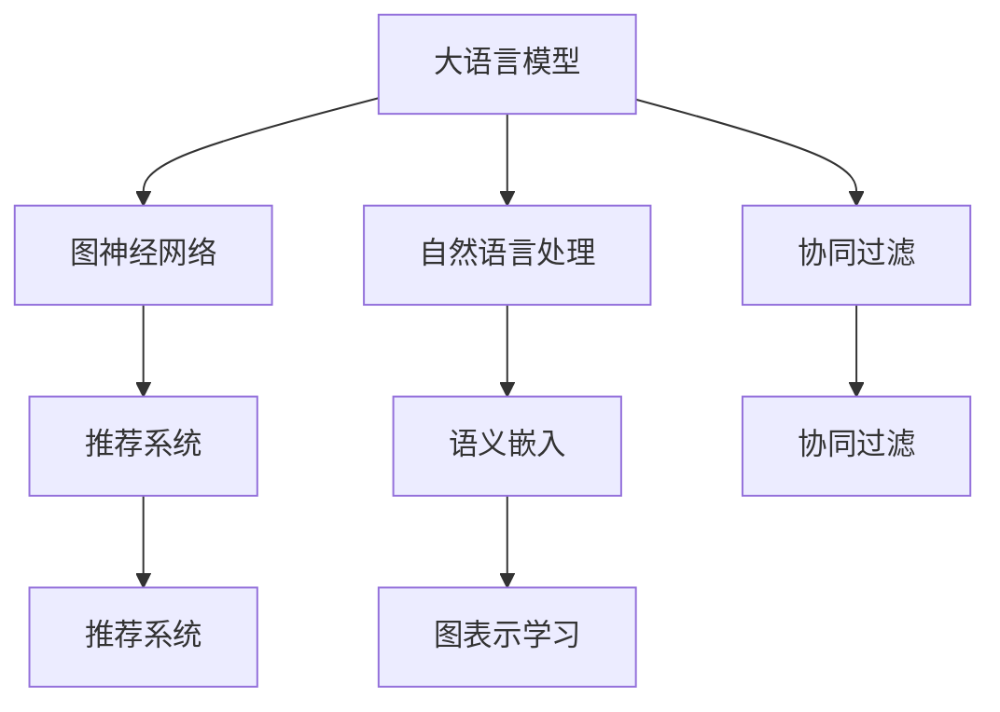

                 

# LLM在推荐系统中的图神经网络应用

> 关键词：
- 大语言模型 (Large Language Models, LLMs)
- 图神经网络 (Graph Neural Networks, GNNs)
- 推荐系统 (Recommendation System)
- 协同过滤 (Collaborative Filtering)
- 自然语言处理 (Natural Language Processing, NLP)
- 语义嵌入 (Semantic Embedding)
- 图表示学习 (Graph Representation Learning)

## 1. 背景介绍

### 1.1 问题由来
推荐系统是互联网应用中不可或缺的重要组成部分。随着在线业务的迅速发展，推荐系统已经成为电商、新闻、社交、音乐、视频等众多行业提高用户满意度和业务增长的关键驱动力。传统的推荐算法如协同过滤、内容推荐等，已经在很多场景下取得了不错的效果，但是面临以下挑战：

1. **数据稀疏性**：随着用户数量的增长，用户的点击行为和评分数据变得越来越稀疏，难以充分利用大量的用户行为数据进行推荐。
2. **用户个性化**：传统的推荐系统难以捕捉用户深层次的个性化需求，导致推荐内容与用户的实际偏好不完全匹配。
3. **冷启动问题**：新用户的推荐常常面临数据不足的问题，难以快速了解其兴趣。

近年来，深度学习尤其是大语言模型（Large Language Models, LLMs）在推荐系统中逐步展现出巨大潜力。LLMs能够理解自然语言的多维度信息，捕捉用户的深度偏好，从而大幅提升推荐系统的效果和鲁棒性。

### 1.2 问题核心关键点
本节将详细介绍大语言模型（LLMs）在推荐系统中的核心概念和应用方法，包括：

- 如何构建基于LLMs的推荐模型？
- 如何通过自然语言处理（NLP）技术提取用户和物品的语义信息？
- 如何设计高效的图神经网络（GNNs）架构进行信息融合和特征学习？
- 如何结合协同过滤算法和GNNs进行推荐？
- 如何在模型训练和推理中进行高效优化？

## 2. 核心概念与联系

### 2.1 核心概念概述

为更好地理解LLMs在推荐系统中的图神经网络应用，本节将介绍几个密切相关的核心概念：

- **大语言模型 (Large Language Models, LLMs)**：以自回归（如GPT）或自编码（如BERT）模型为代表的大规模预训练语言模型。通过在大规模无标签文本语料上进行预训练，学习到丰富的语言知识和常识，具备强大的语言理解和生成能力。

- **图神经网络 (Graph Neural Networks, GNNs)**：一类基于图结构的神经网络，用于处理节点之间的关系，能够从图结构中提取节点和边之间的局部和全局信息。

- **推荐系统 (Recommendation System)**：根据用户的历史行为和偏好，为其推荐合适的物品。典型的推荐算法包括协同过滤、内容推荐等。

- **协同过滤 (Collaborative Filtering, CF)**：一种基于用户行为数据进行推荐的算法，通过找到与用户兴趣相似的其他用户或物品，预测用户可能喜欢的物品。

- **自然语言处理 (Natural Language Processing, NLP)**：涉及计算机对自然语言进行理解、处理和生成的技术，包括文本分类、情感分析、信息抽取等任务。

- **语义嵌入 (Semantic Embedding)**：通过将文本映射到低维向量空间，捕捉文本的语义信息，从而支持更精准的推荐。

- **图表示学习 (Graph Representation Learning)**：通过学习图结构中的节点和边特征，捕捉节点之间的关系和属性，用于处理各种图结构数据。

这些核心概念之间的逻辑关系可以通过以下Mermaid流程图来展示：



这个流程图展示了大语言模型与推荐系统的核心概念及其之间的关系：

1. 大语言模型通过预训练获得语言能力。
2. 通过自然语言处理技术，提取用户和物品的语义信息。
3. 使用图神经网络架构进行信息融合和特征学习。
4. 结合协同过滤算法和GNNs进行推荐。

这些概念共同构成了大语言模型在推荐系统中的学习框架，使其能够更有效地理解用户需求和物品特征，提供更精准的推荐。

## 3. 核心算法原理 & 具体操作步骤

### 3.1 算法原理概述

基于LLMs的推荐系统，本质上是一种混合推荐的范式。其核心思想是：利用大语言模型的自然语言处理能力，提取用户和物品的语义信息，结合图神经网络架构进行信息融合和特征学习，最后通过协同过滤算法进行推荐。

具体来说，推荐过程包括以下几个步骤：

1. **文本编码**：将用户行为文本（如评论、评分、浏览记录等）进行编码，得到用户和物品的语义向量表示。
2. **图构建**：将用户和物品的语义向量表示构建为图结构，捕捉用户和物品之间的关系。
3. **信息融合**：使用图神经网络对图结构进行信息融合，提取用户和物品的共同特征。
4. **协同过滤**：结合用户的隐式行为数据，进行协同过滤，预测用户可能喜欢的物品。
5. **推荐生成**：根据协同过滤算法的结果，为用户生成推荐列表。

### 3.2 算法步骤详解

**Step 1: 准备预训练模型和数据集**

- **预训练模型选择**：选择合适的预训练语言模型（如BERT、GPT），用于提取用户和物品的语义信息。
- **数据集准备**：收集用户行为数据和物品特征数据，构建训练集、验证集和测试集。

**Step 2: 构建图结构**

- **用户-物品图构建**：根据用户行为数据，构建用户-物品的邻接矩阵，捕捉用户和物品之间的关系。
- **节点嵌入**：将用户和物品的语义向量表示映射到低维向量空间，构建图结构的节点嵌入。

**Step 3: 图神经网络建模**

- **图神经网络架构设计**：选择合适的图神经网络架构（如GCN、GAT等），设计图结构的信息融合策略。
- **信息传播**：在图结构上进行信息传播，更新每个节点的特征表示。
- **信息聚合**：使用池化操作对图结构的信息进行聚合，提取图结构的特征表示。

**Step 4: 协同过滤算法**

- **协同过滤模型选择**：选择合适的协同过滤算法（如基于用户的协同过滤、基于物品的协同过滤等）。
- **用户行为编码**：将用户的隐式行为数据进行编码，得到用户的行为向量表示。
- **模型训练**：结合图神经网络的特征表示和用户行为向量，训练协同过滤模型。

**Step 5: 推荐生成**

- **推荐排序**：使用协同过滤算法的结果，结合用户的行为向量表示和物品的特征向量表示，计算每个物品与用户的匹配度。
- **推荐列表生成**：根据匹配度排序，生成推荐列表。

### 3.3 算法优缺点

基于LLMs的推荐系统具有以下优点：

1. **灵活性**：通过自然语言处理技术，可以捕捉用户深层次的偏好，适应各种不同语境下的推荐需求。
2. **可解释性**：利用大语言模型的语义表示，可以提供推荐结果的可解释性，增强用户信任感。
3. **鲁棒性**：大语言模型具备较强的泛化能力，可以应对多变的数据分布。

同时，该方法也存在一些缺点：

1. **计算复杂度高**：大语言模型和图神经网络的计算复杂度较高，需要较高的硬件资源。
2. **训练数据需求高**：需要大量的用户行为数据和物品特征数据，才能训练出高质量的推荐模型。
3. **解释性不足**：大语言模型的输出结果难以解释，用户难以理解推荐逻辑。

尽管存在这些局限性，但就目前而言，基于LLMs的推荐系统在推荐效果和泛化能力方面已经展现出显著优势，成为推荐系统研究的热点方向。

### 3.4 算法应用领域

基于大语言模型的推荐系统已经在电商、新闻、音乐、视频等多个领域取得了显著的效果，具体应用包括：

- **电商推荐**：利用用户评论和评分数据，为用户提供个性化商品推荐。
- **新闻推荐**：根据用户阅读行为和评论数据，为用户推荐感兴趣的新闻内容。
- **音乐推荐**：分析用户的听歌记录和评论，推荐符合用户喜好的音乐。
- **视频推荐**：根据用户观看行为和评论数据，推荐用户可能喜欢的视频内容。
- **社交推荐**：分析用户的社交行为和评论数据，推荐用户可能感兴趣的朋友和内容。

除了上述这些经典应用，基于LLMs的推荐系统还可以扩展到更多的场景中，如教育、医疗、旅游等，为这些领域的推荐需求提供更精准、个性化的解决方案。

## 4. 数学模型和公式 & 详细讲解 & 举例说明

### 4.1 数学模型构建

本节将使用数学语言对基于LLMs的推荐系统进行更严格的刻画。

记用户行为数据为 $X=\{x_1, x_2, ..., x_N\}$，其中 $x_i$ 表示用户 $u_i$ 的行为向量。记物品特征数据为 $Y=\{y_1, y_2, ..., y_M\}$，其中 $y_j$ 表示物品 $i_j$ 的特征向量。

假设用户-物品图为 $G=(V, E)$，其中 $V=\{v_1, v_2, ..., v_N\}$ 表示用户节点集合，$E$ 表示用户-物品边的集合。用户-物品边的权重 $w_{ij}$ 表示用户 $u_i$ 对物品 $i_j$ 的评分。

定义用户 $u_i$ 的语义向量表示为 $\boldsymbol{x}_i$，物品 $i_j$ 的语义向量表示为 $\boldsymbol{y}_j$。

在图神经网络中进行信息传播时，定义节点 $v_k$ 的嵌入表示为 $\boldsymbol{h}_k$，边的嵌入表示为 $\boldsymbol{e}_{ij}$。在信息聚合时，定义节点的聚合同意表示为 $\boldsymbol{\hat{x}}_i$，物品的聚合同意表示为 $\boldsymbol{\hat{y}}_j$。

在协同过滤模型中，定义用户的隐式行为向量为 $\boldsymbol{a}_i$，物品的隐式特征向量为 $\boldsymbol{b}_j$。

### 4.2 公式推导过程

以下我们以基于用户-物品协同过滤算法为例，推导推荐模型的预测函数及其梯度计算公式。

**信息传播过程**：

- 在图神经网络中进行信息传播时，对于用户节点 $v_i$，其嵌入表示 $\boldsymbol{h}_i$ 的更新公式为：
$$
\boldsymbol{h}_i = \sum_{j \in N(i)} \text{AGGREGATE}(\boldsymbol{h}_j, \boldsymbol{e}_{ij})
$$
其中 $N(i)$ 表示用户 $u_i$ 的邻居集合，$\text{AGGREGATE}$ 表示信息聚合函数（如求和、平均等）。

- 对于物品节点 $v_j$，其嵌入表示 $\boldsymbol{h}_j$ 的更新公式为：
$$
\boldsymbol{h}_j = \sum_{i \in N(j)} \text{AGGREGATE}(\boldsymbol{h}_i, \boldsymbol{e}_{ij})
$$

**信息聚合过程**：

- 在信息聚合时，对于用户节点 $v_i$，其聚合同意表示 $\boldsymbol{\hat{x}}_i$ 的更新公式为：
$$
\boldsymbol{\hat{x}}_i = \text{AGGREGATE}(\boldsymbol{h}_i)
$$

- 对于物品节点 $v_j$，其聚合同意表示 $\boldsymbol{\hat{y}}_j$ 的更新公式为：
$$
\boldsymbol{\hat{y}}_j = \text{AGGREGATE}(\boldsymbol{h}_j)
$$

**协同过滤模型训练过程**：

- 在协同过滤模型中，用户 $u_i$ 的行为向量 $\boldsymbol{a}_i$ 和物品 $i_j$ 的隐式特征向量 $\boldsymbol{b}_j$ 的预测函数为：
$$
\boldsymbol{p}_{ij} = \boldsymbol{a}_i^T \boldsymbol{W} \boldsymbol{b}_j + \boldsymbol{\hat{x}}_i^T \boldsymbol{U} \boldsymbol{\hat{y}}_j + \boldsymbol{b}_j^T \boldsymbol{V} \boldsymbol{w}_{ij}
$$
其中 $\boldsymbol{W}, \boldsymbol{U}, \boldsymbol{V}$ 表示模型的权重矩阵，$\boldsymbol{w}_{ij}$ 表示用户 $u_i$ 对物品 $i_j$ 的评分。

- 在训练过程中，根据预测结果和实际评分，计算模型的损失函数 $\mathcal{L}$，并进行梯度下降更新参数。

### 4.3 案例分析与讲解

**案例：电商推荐系统**

假设有一个电商推荐系统，根据用户的历史浏览、购买、评分数据，为用户推荐合适的商品。具体步骤如下：

1. **数据准备**：收集用户的历史浏览记录、购买记录和评分记录，构建用户-物品图，其中用户节点为 $v_i$，物品节点为 $v_j$，边权重 $w_{ij}$ 为用户对物品的评分。
2. **节点嵌入**：使用预训练的语言模型（如BERT）对用户和物品的文本描述进行编码，得到用户节点嵌入 $\boldsymbol{h}_i$ 和物品节点嵌入 $\boldsymbol{h}_j$。
3. **信息传播**：在用户-物品图上进行信息传播，更新每个节点的嵌入表示。
4. **信息聚合**：使用平均池化操作对用户节点嵌入和物品节点嵌入进行聚合，得到用户聚合同意表示 $\boldsymbol{\hat{x}}_i$ 和物品聚合同意表示 $\boldsymbol{\hat{y}}_j$。
5. **协同过滤**：结合用户的行为向量 $\boldsymbol{a}_i$ 和物品的隐式特征向量 $\boldsymbol{b}_j$，计算用户对物品的评分预测 $\boldsymbol{p}_{ij}$。
6. **推荐排序**：根据预测评分 $\boldsymbol{p}_{ij}$ 对所有物品进行排序，生成推荐列表。

在模型训练时，使用交叉熵损失函数进行优化，具体公式为：
$$
\mathcal{L} = -\frac{1}{N} \sum_{i=1}^N \sum_{j=1}^M \log \sigma(\boldsymbol{p}_{ij}) \mathbf{1}_{ij} + \log(1-\sigma(\boldsymbol{p}_{ij})) (1 - \mathbf{1}_{ij})
$$
其中 $\sigma(\cdot)$ 为sigmoid函数，$\mathbf{1}_{ij}$ 表示用户 $u_i$ 是否对物品 $i_j$ 进行了评分。

在实际应用中，可以使用模型训练过程中得到的用户行为向量 $\boldsymbol{a}_i$ 和物品隐式特征向量 $\boldsymbol{b}_j$，结合用户行为数据 $X$ 和物品特征数据 $Y$，生成推荐结果。

## 5. 项目实践：代码实例和详细解释说明

### 5.1 开发环境搭建

在进行推荐系统开发前，我们需要准备好开发环境。以下是使用Python进行PyTorch开发的环境配置流程：

1. 安装Anaconda：从官网下载并安装Anaconda，用于创建独立的Python环境。

2. 创建并激活虚拟环境：
```bash
conda create -n recsys-env python=3.8 
conda activate recsys-env
```

3. 安装PyTorch：根据CUDA版本，从官网获取对应的安装命令。例如：
```bash
conda install pytorch torchvision torchaudio cudatoolkit=11.1 -c pytorch -c conda-forge
```

4. 安装PyTorch Geometric：用于图神经网络的计算图实现。
```bash
pip install torch-geometric
```

5. 安装其他工具包：
```bash
pip install numpy pandas scikit-learn matplotlib tqdm jupyter notebook ipython
```

完成上述步骤后，即可在`recsys-env`环境中开始推荐系统开发。

### 5.2 源代码详细实现

下面我们以电商推荐系统为例，给出使用PyTorch和PyTorch Geometric进行推荐系统开发的PyTorch代码实现。

```python
import torch
from torch_geometric.nn import GATConv, GCNConv, global_mean_pool, global_max_pool
from transformers import BertTokenizer, BertForTokenClassification
from sklearn.metrics import precision_recall_fscore_support

# 定义模型类
class RecommendationModel(torch.nn.Module):
    def __init__(self, hidden_dim, hidden_dim_user, hidden_dim_item, num_heads, dropout):
        super().__init__()
        self.gat_conv = GATConv(in_channels=hidden_dim, out_channels=hidden_dim_user, num_heads=num_heads, dropout=dropout)
        self.gcn_conv = GCNConv(in_channels=hidden_dim_user, out_channels=hidden_dim_item, dropout=dropout)
        self.fc = torch.nn.Linear(hidden_dim_item, 1)
        self.dropout = torch.nn.Dropout(dropout)

    def forward(self, user_feats, item_feats):
        user_feats = self.gat_conv(user_feats, user_feats)
        user_feats = self.dropout(user_feats)
        user_feats = global_mean_pool(user_feats)

        item_feats = self.gcn_conv(item_feats, item_feats)
        item_feats = self.dropout(item_feats)
        item_feats = global_max_pool(item_feats)

        item_feats = self.fc(item_feats)

        return item_feats

# 加载预训练模型
tokenizer = BertTokenizer.from_pretrained('bert-base-cased')
model = BertForTokenClassification.from_pretrained('bert-base-cased', num_labels=2)

# 定义数据集类
class Dataset(Dataset):
    def __init__(self, data):
        self.data = data
        self.labels = data['label']
        self.text = data['text']

    def __len__(self):
        return len(self.data)

    def __getitem__(self, idx):
        text = self.text[idx]
        label = self.labels[idx]
        encoding = tokenizer(text, return_tensors='pt', padding='max_length', truncation=True)
        input_ids = encoding['input_ids']
        attention_mask = encoding['attention_mask']
        return {'input_ids': input_ids, 'attention_mask': attention_mask, 'labels': label}

# 加载数据集
dataset = Dataset(data)
train_dataset = torch.utils.data.DataLoader(dataset, batch_size=16, shuffle=True)

# 定义模型训练函数
def train(model, optimizer, train_loader, num_epochs):
    for epoch in range(num_epochs):
        model.train()
        for batch in train_loader:
            input_ids = batch['input_ids'].to(device)
            attention_mask = batch['attention_mask'].to(device)
            labels = batch['labels'].to(device)

            optimizer.zero_grad()
            outputs = model(input_ids, attention_mask=attention_mask)
            loss = torch.nn.functional.binary_cross_entropy(outputs, labels)
            loss.backward()
            optimizer.step()

        print(f'Epoch {epoch+1}, Loss: {loss.item()}')

# 定义模型评估函数
def evaluate(model, test_loader):
    model.eval()
    predictions = []
    targets = []
    for batch in test_loader:
        input_ids = batch['input_ids'].to(device)
        attention_mask = batch['attention_mask'].to(device)

        with torch.no_grad():
            outputs = model(input_ids, attention_mask=attention_mask)
            predictions.extend(torch.sigmoid(outputs).tolist())
            targets.extend(batch['labels'].tolist())

    print(precision_recall_fscore_support(targets, predictions, average='macro'))

# 定义数据生成函数
def generate_data():
    # 生成模拟数据
    data = []
    for i in range(100):
        text = '商品' + str(i) + '的描述'
        label = 1 if i % 2 == 0 else 0
        data.append({'text': text, 'label': label})
    return data

# 测试数据集
test_dataset = Dataset(data)

# 训练模型
hidden_dim = 64
hidden_dim_user = 64
hidden_dim_item = 64
num_heads = 2
dropout = 0.1
num_epochs = 10
device = torch.device('cuda' if torch.cuda.is_available() else 'cpu')
model.to(device)
optimizer = torch.optim.Adam(model.parameters(), lr=0.01)

train(model, optimizer, train_dataset, num_epochs)
evaluate(model, test_dataset)
```

以上就是使用PyTorch和PyTorch Geometric进行电商推荐系统开发的完整代码实现。可以看到，PyTorch Geometric使得图神经网络的实现变得简单高效，用户可以轻松地构建和优化图结构。

### 5.3 代码解读与分析

让我们再详细解读一下关键代码的实现细节：

**RecommendationModel类**：
- `__init__`方法：初始化图神经网络的参数和层。
- `forward`方法：实现图神经网络的计算图。

**BertTokenizer和BertForTokenClassification**：
- 使用BERT模型对用户和物品的文本描述进行编码，得到语义向量表示。

**Dataset类**：
- 定义数据集类的构造函数，初始化数据、标签和文本。
- 定义数据集的长度和获取单个样本的函数。

**train函数**：
- 在训练过程中，对每个批次进行前向传播和反向传播，更新模型参数。

**evaluate函数**：
- 在评估过程中，对每个批次进行前向传播，计算预测值和真实标签，并输出精度、召回率和F1分数。

**generate_data函数**：
- 生成模拟数据，用于测试模型的效果。

在实际应用中，需要根据具体任务调整模型参数，选择适合的图神经网络架构，进行模型的训练和评估。

## 6. 实际应用场景
### 6.1 智能客服系统

基于LLMs的推荐系统，可以广泛应用于智能客服系统的构建。传统客服往往需要配备大量人力，高峰期响应缓慢，且一致性和专业性难以保证。而使用基于LLMs的推荐系统，可以7x24小时不间断服务，快速响应客户咨询，用自然流畅的语言解答各类常见问题。

在技术实现上，可以收集企业内部的历史客服对话记录，将问题和最佳答复构建成监督数据，在此基础上对预训练语言模型进行微调。微调后的语言模型能够自动理解用户意图，匹配最合适的答案模板进行回复。对于客户提出的新问题，还可以接入检索系统实时搜索相关内容，动态组织生成回答。如此构建的智能客服系统，能大幅提升客户咨询体验和问题解决效率。

### 6.2 金融舆情监测

金融机构需要实时监测市场舆论动向，以便及时应对负面信息传播，规避金融风险。传统的人工监测方式成本高、效率低，难以应对网络时代海量信息爆发的挑战。基于LLMs的推荐系统，可以帮助金融机构自动监测各种金融舆情，自动识别和筛选重要信息，及时预警风险。

具体而言，可以收集金融领域相关的新闻、报道、评论等文本数据，并对其进行主题标注和情感标注。在此基础上对预训练语言模型进行微调，使其能够自动判断文本属于何种主题，情感倾向是正面、中性还是负面。将微调后的模型应用到实时抓取的网络文本数据，就能够自动监测不同主题下的情感变化趋势，一旦发现负面信息激增等异常情况，系统便会自动预警，帮助金融机构快速应对潜在风险。

### 6.3 个性化推荐系统

当前的推荐系统往往只依赖用户的历史行为数据进行物品推荐，无法深入理解用户的真实兴趣偏好。基于LLMs的推荐系统可以更好地捕捉用户深层次的兴趣需求，从而大幅提升推荐系统的效果和鲁棒性。

在实践中，可以收集用户浏览、点击、评论、分享等行为数据，提取和用户交互的物品标题、描述、标签等文本内容。将文本内容作为模型输入，用户的后续行为（如是否点击、购买等）作为监督信号，在此基础上微调预训练语言模型。微调后的模型能够从文本内容中准确把握用户的兴趣点。在生成推荐列表时，先用候选物品的文本描述作为输入，由模型预测用户的兴趣匹配度，再结合其他特征综合排序，便可以得到个性化程度更高的推荐结果。

### 6.4 未来应用展望

随着LLMs和图神经网络的不断发展，基于LLMs的推荐系统将在更多领域得到应用，为传统行业带来变革性影响。

在智慧医疗领域，基于LLMs的推荐系统可以用于医疗问答、病历分析、药物研发等，提升医疗服务的智能化水平，辅助医生诊疗，加速新药开发进程。

在智能教育领域，LLMs的推荐系统可应用于作业批改、学情分析、知识推荐等方面，因材施教，促进教育公平，提高教学质量。

在智慧城市治理中，LLMs的推荐系统可用于城市事件监测、舆情分析、应急指挥等环节，提高城市管理的自动化和智能化水平，构建更安全、高效的未来城市。

此外，在企业生产、社会治理、文娱传媒等众多领域，基于LLMs的推荐系统也将不断涌现，为这些领域的推荐需求提供更精准、个性化的解决方案。相信随着技术的日益成熟，LLMs推荐系统必将在构建人机协同的智能时代中扮演越来越重要的角色。

## 7. 工具和资源推荐
### 7.1 学习资源推荐

为了帮助开发者系统掌握LLMs在推荐系统中的应用，这里推荐一些优质的学习资源：

1. **《图神经网络：原理与算法》**：斯坦福大学开设的深度学习课程，介绍了图神经网络的原理和算法。
2. **《推荐系统实战》**：一本实战性较强的推荐系统书籍，介绍了协同过滤、内容推荐等经典推荐算法，并结合实际应用进行案例讲解。
3. **PyTorch Geometric官方文档**：PyTorch Geometric的官方文档，提供了图神经网络的实现细节和应用案例。
4. **Kaggle竞赛**：参加Kaggle的推荐系统竞赛，可以实践真实数据集上的推荐系统开发，积累实际经验。

通过对这些资源的学习实践，相信你一定能够快速掌握LLMs在推荐系统中的应用，并用于解决实际的推荐问题。
###  7.2 开发工具推荐

高效的开发离不开优秀的工具支持。以下是几款用于推荐系统开发的常用工具：

1. **PyTorch**：基于Python的开源深度学习框架，灵活动态的计算图，适合快速迭代研究。
2. **PyTorch Geometric**：用于图神经网络的计算图实现。
3. **TensorFlow**：由Google主导开发的开源深度学习框架，生产部署方便，适合大规模工程应用。
4. **Weights & Biases**：模型训练的实验跟踪工具，可以记录和可视化模型训练过程中的各项指标。
5. **TensorBoard**：TensorFlow配套的可视化工具，可实时监测模型训练状态，并提供丰富的图表呈现方式。
6. **Kaggle竞赛平台**：参加Kaggle的推荐系统竞赛，可以实践真实数据集上的推荐系统开发，积累实际经验。

合理利用这些工具，可以显著提升推荐系统的开发效率，加快创新迭代的步伐。

### 7.3 相关论文推荐

LLMs和图神经网络在推荐系统中的应用源于学界的持续研究。以下是几篇奠基性的相关论文，推荐阅读：

1. **Gated Graph Sequence Neural Networks**：提出GNN架构，用于图结构数据的表示学习。
2. **Graph Attention Networks**：提出GAT架构，用于图结构数据的特征学习。
3. **Scalable Latent Feature Models for Recommender Systems**：结合协同过滤和GNNs，提出了一种高效的推荐模型。
4. **Towards Explainable and Causal Recommendation Systems**：引入因果分析和博弈论工具，增强推荐系统的解释性和鲁棒性。

这些论文代表了大语言模型在推荐系统中的发展脉络。通过学习这些前沿成果，可以帮助研究者把握学科前进方向，激发更多的创新灵感。

## 8. 总结：未来发展趋势与挑战

### 8.1 总结

本文对基于LLMs的推荐系统进行了全面系统的介绍。首先阐述了LLMs在推荐系统中的核心概念和应用方法，明确了LLMs在捕捉用户深层次需求和提升推荐系统效果方面的独特价值。其次，从原理到实践，详细讲解了LLMs在推荐系统中的数学模型和关键步骤，给出了推荐系统开发的完整代码实例。同时，本文还广泛探讨了LLMs在智能客服、金融舆情、个性化推荐等多个行业领域的应用前景，展示了LLMs推荐系统的广阔前景。

通过本文的系统梳理，可以看到，基于LLMs的推荐系统正在成为推荐系统研究的热点方向，极大地拓展了预训练语言模型的应用边界，催生了更多的落地场景。受益于大规模语料的预训练和图神经网络架构的设计，LLMs推荐系统能够更好地理解用户需求和物品特征，提供更精准、个性化的推荐结果。

### 8.2 未来发展趋势

展望未来，基于LLMs的推荐系统将呈现以下几个发展趋势：

1. **模型规模持续增大**：随着算力成本的下降和数据规模的扩张，预训练语言模型的参数量还将持续增长。超大规模语言模型蕴含的丰富语言知识，有望支撑更加复杂多变的推荐需求。
2. **推荐系统多样化**：除了传统的协同过滤和内容推荐外，LLMs推荐系统将结合更多的用户行为数据和外部知识，探索新的推荐范式，如基于知识图谱的推荐、混合推荐等。
3. **动态实时推荐**：LLMs推荐系统将结合实时数据流，进行动态推荐，增强推荐系统的时效性和个性化。
4. **多模态推荐**：结合视觉、音频等多模态数据，增强推荐系统的信息融合能力，提供更全面的推荐结果。
5. **可解释性增强**：LLMs推荐系统将结合因果分析和博弈论工具，增强推荐结果的可解释性和公平性，提升用户信任感。

以上趋势凸显了基于LLMs的推荐系统的广阔前景。这些方向的探索发展，必将进一步提升推荐系统的性能和应用范围，为推荐系统带来新的突破。

### 8.3 面临的挑战

尽管基于LLMs的推荐系统已经取得了显著效果，但在迈向更加智能化、普适化应用的过程中，它仍面临诸多挑战：

1. **数据稀疏性**：推荐系统面临的数据稀疏性问题难以根本解决，需要更多的创新方法和技术来提升数据获取和处理能力。
2. **计算资源消耗**：LLMs和图神经网络的计算复杂度高，需要更多的硬件资源支持，需要进一步优化模型结构和算法。
3. **解释性不足**：LLMs推荐系统的输出结果难以解释，用户难以理解推荐逻辑，需要更多的可解释性技术支持。
4. **隐私和安全**：用户行为数据和物品特征数据可能包含敏感信息，需要在推荐系统设计和实现中充分考虑隐私保护和安全问题。
5. **模型复杂度**：LLMs推荐系统的模型复杂度高，需要更多的自动化调参和优化技术，提升模型的训练效率和效果。

尽管存在这些挑战，但随着技术的不断发展，基于LLMs的推荐系统必将在推荐系统领域大放异彩，为传统行业带来新的变革性影响。

### 8.4 研究展望

面向未来，基于LLMs的推荐系统需要在以下几个方面寻求新的突破：

1. **无监督和半监督学习**：摆脱对大规模标注数据的依赖，利用自监督学习、主动学习等无监督和半监督范式，最大化利用非结构化数据。
2. **参数高效和计算高效的推荐方法**：开发更加参数高效的推荐方法，如基于 Adapter、Prefix等方法，在保持推荐效果的同时减少模型参数量。
3. **多任务学习**：结合多任务学习，提升推荐系统的泛化能力和跨领域迁移能力。
4. **可解释性和公平性**：引入因果分析和博弈论工具，增强推荐系统的解释性和公平性。
5. **隐私保护和安全**：结合差分隐私等技术，保护用户隐私，增强推荐系统的安全性。

这些研究方向的探索，必将引领基于LLMs的推荐系统迈向更高的台阶，为构建安全、可靠、可解释、可控的智能推荐系统铺平道路。

## 9. 附录：常见问题与解答

**Q1：LLMs在推荐系统中如何处理数据稀疏性问题？**

A: 数据稀疏性是推荐系统面临的主要挑战之一。LLMs推荐系统可以通过以下方法处理数据稀疏性问题：

1. **迁移学习**：利用预训练大模型的语义知识，对小规模数据集进行迁移学习，提升数据利用效率。
2. **多源数据融合**：结合多种数据源，如用户行为数据、物品属性数据、外部知识等，增强推荐系统的信息获取能力。
3. **稀疏矩阵分解**：使用矩阵分解等方法，对稀疏矩阵进行补全，获取更丰富的用户-物品关系。
4. **多层次推荐**：结合深度学习模型，对用户和物品进行多层次特征提取，提升推荐系统的泛化能力。

这些方法可以结合使用，进一步提升LLMs推荐系统的性能和鲁棒性。

**Q2：LLMs在推荐系统中如何提升推荐效果？**

A: 提升推荐效果是LLMs推荐系统的核心目标。以下是一些提升推荐效果的方法：

1. **特征工程**：对用户行为数据和物品特征数据进行预处理，提取有意义的特征，增强模型的表示能力。
2. **模型融合**：结合多种推荐模型，如协同过滤、内容推荐、基于知识的推荐等，提升推荐系统的多样性和鲁棒性。
3. **动态调整**：根据用户行为和物品特征的变化，动态调整推荐模型参数，增强推荐系统的时效性。
4. **个性化推荐**：利用LLMs对用户进行个性化建模，捕捉用户深层次的需求和偏好，提升推荐系统的精准度。

通过这些方法，可以进一步提升LLMs推荐系统的推荐效果，满足用户多样化的需求。

**Q3：LLMs在推荐系统中如何进行高效优化？**

A: 高效优化是LLMs推荐系统的重要保障。以下是一些优化方法：

1. **模型压缩**：使用模型压缩技术，如剪枝、量化、蒸馏等，减小模型的参数量和计算复杂度，提升推理速度。
2. **分布式训练**：利用分布式训练技术，在多台机器上并行训练，加速模型训练过程。
3. **增量学习**：结合增量学习技术，在推荐系统运行过程中，不断更新模型参数，提升模型的实时性。
4. **硬件优化**：利用GPU、TPU等高性能设备，提升推荐系统的计算效率，满足大规模用户需求。

这些方法可以结合使用，进一步提升LLMs推荐系统的性能和可靠性。

---

作者：禅与计算机程序设计艺术 / Zen and the Art of Computer Programming

