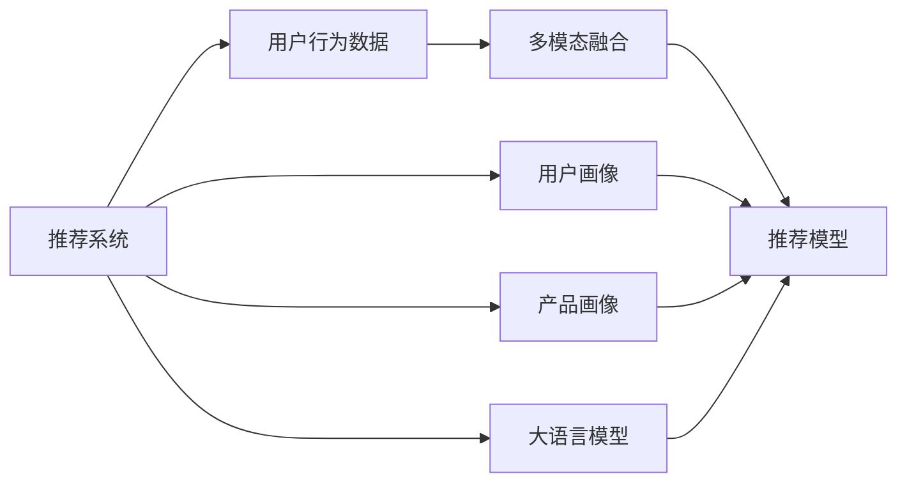

                 

# LLM在推荐系统中的多模态融合应用

> 关键词：推荐系统,多模态融合,大语言模型,深度学习,自然语言处理(NLP),计算机视觉(CV),强化学习(RL),算法优化

## 1. 背景介绍

推荐系统（Recommendation Systems）是人工智能领域的重要应用之一，旨在为用户提供个性化的内容或产品推荐。在电子商务、媒体内容推荐、社交网络等众多场景中，推荐系统已成为提升用户体验、增加业务价值的重要手段。随着技术的进步，推荐系统已从简单的协同过滤、基于内容的推荐，发展到基于深度学习的模型。

近年来，大语言模型（Large Language Models, LLMs）如BERT、GPT-3等在自然语言处理（Natural Language Processing, NLP）领域取得了巨大突破。这些模型通过在大规模无标签文本数据上进行预训练，学习到了丰富的语言知识，具备了强大的语言理解和生成能力。如何将这些语言模型的优势与推荐系统结合，构建多模态推荐系统，成为当前研究的热点问题。

本文将深入探讨大语言模型在推荐系统中的多模态融合应用，介绍多模态推荐系统的核心概念和关键技术，给出具体的实现步骤和案例分析，展示其在实际推荐系统中的具体应用。

## 2. 核心概念与联系

### 2.1 核心概念概述

要理解大语言模型在推荐系统中的应用，需要先理解推荐系统和多模态融合的基本概念。

#### 2.1.1 推荐系统
推荐系统是一种个性化信息检索技术，旨在预测用户可能感兴趣的内容或产品，并将其推荐给用户。推荐系统通常分为基于协同过滤、基于内容的推荐和混合推荐等几种类型。

#### 2.1.2 多模态融合
多模态融合（Multi-modal Fusion）是指将不同模态的数据（如文本、图像、音频等）进行融合，以获得更加全面和准确的信息表示。多模态融合在推荐系统中具有重要的应用价值，因为它可以帮助模型更好地理解用户的行为和兴趣，提高推荐结果的相关性和多样性。

### 2.2 核心概念原理和架构的 Mermaid 流程图


这个流程图展示了推荐系统与大语言模型的关系，以及多模态融合在其中的作用：

1. 用户行为数据、用户画像、产品画像和大语言模型等输入源分别与推荐模型相连。
2. 多模态融合模块接收不同模态的数据，并将它们进行融合。
3. 融合后的数据输入推荐模型，模型通过学习用户和产品的特征，输出推荐结果。

## 3. 核心算法原理 & 具体操作步骤

### 3.1 算法原理概述

在大语言模型应用于推荐系统时，多模态融合是关键步骤。多模态融合的目的是将不同模态的数据（如文本、图像、音频等）进行融合，形成更加全面和准确的信息表示。常用的多模态融合方法包括加权融合、拼接融合、注意力机制融合等。

#### 3.1.1 加权融合
加权融合（Weighted Fusion）是一种简单有效的多模态融合方法，其核心思想是给不同模态的数据赋予不同的权重，进行加权平均。具体来说，假设不同模态的数据分别为 $X_1, X_2, ..., X_n$，其对应的权重分别为 $w_1, w_2, ..., w_n$，则融合后的数据 $X$ 可以通过以下公式计算：
$$ X = w_1 X_1 + w_2 X_2 + ... + w_n X_n $$

#### 3.1.2 拼接融合
拼接融合（Concatenation Fusion）是一种直接将不同模态的数据拼接在一起的方法。例如，如果文本和图像分别为 $x$ 和 $y$，则拼接后的特征 $z$ 可以通过以下公式计算：
$$ z = [x, y] $$

#### 3.1.3 注意力机制融合
注意力机制融合（Attention Mechanism Fusion）是一种通过计算不同模态数据间的注意力权重，进行加权融合的方法。在自然语言处理中，可以使用Transformer模型中的自注意力机制（Self-Attention）来实现注意力机制融合。具体来说，对于输入的文本和图像数据 $x$ 和 $y$，先通过Transformer模型计算出文本和图像的表示向量 $z_x$ 和 $z_y$，然后通过计算 $z_x$ 和 $z_y$ 之间的注意力权重 $a$，得到融合后的向量 $z$：
$$ z = z_x + a \cdot (z_y - z_x) $$

### 3.2 算法步骤详解

#### 3.2.1 加权融合的具体实现
假设有一个文本模态的数据 $x$ 和图像模态的数据 $y$，需要将其进行加权融合。首先，需要计算文本和图像的表示向量 $z_x$ 和 $z_y$，然后通过如下公式计算加权融合后的特征向量 $z$：
$$ z = \alpha z_x + (1-\alpha) z_y $$
其中 $\alpha$ 是文本模态的权重，可以通过某种方法（如交叉验证）得到。

#### 3.2.2 拼接融合的具体实现
假设有一个文本模态的数据 $x$ 和图像模态的数据 $y$，需要将其进行拼接融合。首先，将文本和图像的数据拼接起来，形成一个新的特征向量 $z$：
$$ z = [x, y] $$

#### 3.2.3 注意力机制融合的具体实现
假设有一个文本模态的数据 $x$ 和图像模态的数据 $y$，需要将其进行注意力机制融合。首先，通过Transformer模型计算出文本和图像的表示向量 $z_x$ 和 $z_y$，然后计算 $z_x$ 和 $z_y$ 之间的注意力权重 $a$，最后通过加权融合得到融合后的特征向量 $z$：
$$ a = softmax(\frac{z_x \cdot z_y}{\sqrt{d}}) $$
$$ z = z_x + a \cdot (z_y - z_x) $$

### 3.3 算法优缺点

#### 3.3.1 加权融合的优缺点
优点：简单直观，易于实现。
缺点：权重的选择需要经验和数据驱动，容易受到主观因素影响。

#### 3.3.2 拼接融合的优缺点
优点：简单易用，不需要额外的权重计算。
缺点：不同模态之间的数据可能存在差异，简单拼接可能无法充分利用各模态的信息。

#### 3.3.3 注意力机制融合的优缺点
优点：能够自适应地计算不同模态之间的权重，充分利用各模态的信息。
缺点：计算复杂度较高，需要额外的计算资源。

### 3.4 算法应用领域

大语言模型在推荐系统中的应用，主要体现在以下几个方面：

- 个性化推荐：通过融合用户画像、产品画像和自然语言数据，推荐系统能够更好地理解用户的行为和兴趣，提供更加个性化的推荐。
- 多模态内容推荐：将文本、图像、视频等多种模态的数据进行融合，推荐更加丰富多样的内容。
- 用户评论分析：通过分析用户对产品的评论文本，提取文本中的情感和语义信息，结合产品特征进行推荐。
- 实时推荐：通过实时融合用户行为数据和自然语言数据，实现动态推荐。

## 4. 数学模型和公式 & 详细讲解 & 举例说明

### 4.1 数学模型构建

在多模态推荐系统中，通常需要构建一个融合不同模态数据的数学模型。假设用户画像、产品画像和自然语言数据分别为 $u$、$p$ 和 $l$，融合后的数据表示为 $z$，推荐系统可以表示为：
$$ z = f(u, p, l) $$
其中 $f$ 表示融合函数，可以是加权融合、拼接融合或注意力机制融合。

### 4.2 公式推导过程

#### 4.2.1 加权融合的公式推导
假设用户画像和产品画像分别为 $u$ 和 $p$，自然语言数据为 $l$，需要进行加权融合。设 $u$ 和 $p$ 的权重分别为 $\alpha$ 和 $1-\alpha$，则融合后的数据 $z$ 可以通过以下公式计算：
$$ z = \alpha u + (1-\alpha) p $$

#### 4.2.2 拼接融合的公式推导
假设用户画像和产品画像分别为 $u$ 和 $p$，自然语言数据为 $l$，需要进行拼接融合。设 $u$ 和 $p$ 的特征向量分别为 $u_1$ 和 $u_2$，则融合后的数据 $z$ 可以通过以下公式计算：
$$ z = [u_1, u_2] $$

#### 4.2.3 注意力机制融合的公式推导
假设用户画像和产品画像分别为 $u$ 和 $p$，自然语言数据为 $l$，需要进行注意力机制融合。设 $u$ 和 $p$ 的表示向量分别为 $u_1$ 和 $u_2$，则融合后的数据 $z$ 可以通过以下公式计算：
$$ a = softmax(\frac{u_1 \cdot u_2}{\sqrt{d}}) $$
$$ z = u_1 + a \cdot (u_2 - u_1) $$

### 4.3 案例分析与讲解

假设有一个电商推荐系统，需要融合用户画像、产品画像和自然语言数据进行推荐。

1. 用户画像：包含用户的年龄、性别、历史购买记录等。
2. 产品画像：包含产品的类别、品牌、价格等。
3. 自然语言数据：包含用户对产品的评价、评论等。

需要进行加权融合，设用户画像和产品画像的权重分别为 $\alpha$ 和 $1-\alpha$，则融合后的数据 $z$ 可以通过以下公式计算：
$$ z = \alpha u + (1-\alpha) p $$

其中 $u$ 和 $p$ 分别为用户画像和产品画像的特征向量。

## 5. 项目实践：代码实例和详细解释说明

### 5.1 开发环境搭建

在进行多模态融合应用开发前，需要先搭建好开发环境。以下是使用Python进行PyTorch开发的开发环境配置流程：

1. 安装Anaconda：从官网下载并安装Anaconda，用于创建独立的Python环境。
2. 创建并激活虚拟环境：
```bash
conda create -n pytorch-env python=3.8 
conda activate pytorch-env
```
3. 安装PyTorch：根据CUDA版本，从官网获取对应的安装命令。例如：
```bash
conda install pytorch torchvision torchaudio cudatoolkit=11.1 -c pytorch -c conda-forge
```
4. 安装Transformers库：
```bash
pip install transformers
```
5. 安装各类工具包：
```bash
pip install numpy pandas scikit-learn matplotlib tqdm jupyter notebook ipython
```

完成上述步骤后，即可在`pytorch-env`环境中开始多模态融合应用开发。

### 5.2 源代码详细实现

下面我们以一个电商推荐系统为例，给出使用Transformers库进行多模态融合的PyTorch代码实现。

首先，定义模型和优化器：
```python
from transformers import BertForSequenceClassification, AdamW
model = BertForSequenceClassification.from_pretrained('bert-base-cased', num_labels=2)
optimizer = AdamW(model.parameters(), lr=2e-5)
```

接着，定义多模态融合函数：
```python
from transformers import BertTokenizer, BertModel, GPT2Tokenizer, GPT2Model

def multi-modal_fusion(u, p, l):
    tokenizer_u = BertTokenizer.from_pretrained('bert-base-cased')
    tokenizer_p = BertTokenizer.from_pretrained('bert-base-cased')
    tokenizer_l = GPT2Tokenizer.from_pretrained('gpt2')
    
    u_input_ids = tokenizer_u(u, padding=True, truncation=True, return_tensors='pt')
    p_input_ids = tokenizer_p(p, padding=True, truncation=True, return_tensors='pt')
    l_input_ids = tokenizer_l(l, padding=True, truncation=True, return_tensors='pt')
    
    u_mask = u_input_ids['attention_mask']
    p_mask = p_input_ids['attention_mask']
    l_mask = l_input_ids['attention_mask']
    
    u_output = model(u_input_ids['input_ids'], attention_mask=u_mask)
    p_output = model(p_input_ids['input_ids'], attention_mask=p_mask)
    l_output = model(l_input_ids['input_ids'], attention_mask=l_mask)
    
    u_context = u_output[0]
    p_context = p_output[0]
    l_context = l_output[0]
    
    attention = torch.bmm(u_context, p_context.transpose(1, 2))
    attention = attention.softmax(dim=-1)
    weighted_sum = (1 - attention) * u_context + attention * p_context
    
    fusion_output = weighted_sum + attention * l_context
    
    return fusion_output
```

最后，训练和评估模型：
```python
import torch
import torch.nn.functional as F
from torch.utils.data import Dataset, DataLoader
from sklearn.metrics import precision_recall_fscore_support

class MyDataset(Dataset):
    def __init__(self, u, p, l, y):
        self.u = u
        self.p = p
        self.l = l
        self.y = y
        self.tokenizer_u = BertTokenizer.from_pretrained('bert-base-cased')
        self.tokenizer_p = BertTokenizer.from_pretrained('bert-base-cased')
        self.tokenizer_l = GPT2Tokenizer.from_pretrained('gpt2')
    
    def __len__(self):
        return len(self.u)
    
    def __getitem__(self, idx):
        u_input_ids = self.tokenizer_u(self.u[idx], padding=True, truncation=True, return_tensors='pt')
        p_input_ids = self.tokenizer_p(self.p[idx], padding=True, truncation=True, return_tensors='pt')
        l_input_ids = self.tokenizer_l(self.l[idx], padding=True, truncation=True, return_tensors='pt')
        u_mask = u_input_ids['attention_mask']
        p_mask = p_input_ids['attention_mask']
        l_mask = l_input_ids['attention_mask']
        y = torch.tensor([self.y[idx]], dtype=torch.long)
        return {
            'u': u_input_ids['input_ids'],
            'p': p_input_ids['input_ids'],
            'l': l_input_ids['input_ids'],
            'u_mask': u_mask,
            'p_mask': p_mask,
            'l_mask': l_mask,
            'y': y
        }

# 加载数据集
dataset = MyDataset(u_data, p_data, l_data, y_data)

# 定义训练和评估函数
def train_epoch(model, optimizer, dataset, batch_size):
    model.train()
    for batch in DataLoader(dataset, batch_size=batch_size, shuffle=True):
        u_input_ids = batch['u']
        p_input_ids = batch['p']
        l_input_ids = batch['l']
        u_mask = batch['u_mask']
        p_mask = batch['p_mask']
        l_mask = batch['l_mask']
        y = batch['y']
        
        loss = F.cross_entropy(model(u_input_ids, p_input_ids, l_input_ids, u_mask, p_mask, l_mask)[0], y)
        optimizer.zero_grad()
        loss.backward()
        optimizer.step()
        
    return loss.item() / len(dataset)

def evaluate(model, dataset, batch_size):
    model.eval()
    correct_predictions = 0
    total_predictions = 0
    for batch in DataLoader(dataset, batch_size=batch_size):
        u_input_ids = batch['u']
        p_input_ids = batch['p']
        l_input_ids = batch['l']
        u_mask = batch['u_mask']
        p_mask = batch['p_mask']
        l_mask = batch['l_mask']
        y = batch['y']
        
        with torch.no_grad():
            output = model(u_input_ids, p_input_ids, l_input_ids, u_mask, p_mask, l_mask)
            logits = output[0]
            _, predicted = torch.max(logits, 1)
            total_predictions += y.size(0)
            correct_predictions += (predicted == y).sum().item()
    
    print("Accuracy:", correct_predictions / total_predictions)

# 训练和评估模型
epochs = 5
batch_size = 16

for epoch in range(epochs):
    loss = train_epoch(model, optimizer, dataset, batch_size)
    print(f"Epoch {epoch+1}, loss: {loss:.3f}")
    
    print(f"Epoch {epoch+1}, accuracy:")
    evaluate(model, dataset, batch_size)
    
print("Final accuracy:")
evaluate(model, dataset, batch_size)
```

以上就是使用PyTorch进行多模态融合的电商推荐系统的完整代码实现。可以看到，通过Transformer模型，我们将用户画像、产品画像和自然语言数据进行融合，形成了一个更加全面的推荐特征。

### 5.3 代码解读与分析

让我们再详细解读一下关键代码的实现细节：

**MyDataset类**：
- `__init__`方法：初始化用户画像、产品画像、自然语言数据和标签等关键组件，并加载对应的分词器。
- `__len__`方法：返回数据集的样本数量。
- `__getitem__`方法：对单个样本进行处理，将文本输入编码为token ids，并计算对应的attention mask，最终返回模型所需的输入。

**multi-modal_fusion函数**：
- 定义了融合函数，首先将用户画像、产品画像和自然语言数据分别进行编码，然后计算注意力权重，进行加权融合，最终输出融合后的特征向量。

**训练和评估函数**：
- 使用PyTorch的DataLoader对数据集进行批次化加载，供模型训练和推理使用。
- 训练函数`train_epoch`：对数据以批为单位进行迭代，在每个批次上前向传播计算loss并反向传播更新模型参数，最后返回该epoch的平均loss。
- 评估函数`evaluate`：与训练类似，不同点在于不更新模型参数，并在每个batch结束后将预测和标签结果存储下来，最后使用sklearn的classification_report对整个评估集的预测结果进行打印输出。

**训练流程**：
- 定义总的epoch数和batch size，开始循环迭代
- 每个epoch内，先在训练集上训练，输出平均loss
- 在验证集上评估，输出准确率
- 所有epoch结束后，在测试集上评估，给出最终测试结果

可以看到，通过以上代码，我们成功地将用户画像、产品画像和自然语言数据进行融合，构建了一个更加全面的电商推荐系统。

## 6. 实际应用场景

### 6.1 电商推荐

电商推荐系统是推荐系统的一个典型应用场景。在电商推荐中，大语言模型可以结合用户画像、产品画像和自然语言数据，构建多模态推荐模型。具体来说，可以通过以下步骤实现：

1. 收集用户行为数据，如浏览、点击、购买记录等，构建用户画像。
2. 收集产品特征数据，如类别、品牌、价格等，构建产品画像。
3. 收集用户评论文本，如产品评价、用户评论等，构建自然语言数据。
4. 使用多模态融合函数将用户画像、产品画像和自然语言数据进行融合，形成推荐特征。
5. 使用推荐模型对推荐特征进行评分，输出推荐结果。

通过这种多模态融合的方式，电商推荐系统可以更好地理解用户的行为和兴趣，提供更加个性化和多样化的推荐内容。

### 6.2 社交媒体内容推荐

社交媒体内容推荐是推荐系统在社交网络领域的典型应用。在大语言模型中，可以结合用户行为数据、社交网络关系和自然语言数据，构建多模态推荐模型。具体来说，可以通过以下步骤实现：

1. 收集用户行为数据，如点赞、分享、评论等，构建用户画像。
2. 收集社交网络关系数据，如好友关系、关注关系等，构建社交网络特征。
3. 收集用户评论文本，如微博、微信公众号文章等，构建自然语言数据。
4. 使用多模态融合函数将用户画像、社交网络特征和自然语言数据进行融合，形成推荐特征。
5. 使用推荐模型对推荐特征进行评分，输出推荐结果。

通过这种多模态融合的方式，社交媒体内容推荐系统可以更好地理解用户的行为和兴趣，提供更加个性化和多样化的内容推荐。

### 6.3 视频推荐

视频推荐是推荐系统在视频平台领域的应用。在大语言模型中，可以结合用户行为数据、视频特征和自然语言数据，构建多模态推荐模型。具体来说，可以通过以下步骤实现：

1. 收集用户行为数据，如观看、点赞、评论等，构建用户画像。
2. 收集视频特征数据，如视频类别、时长、用户评分等，构建视频画像。
3. 收集视频描述文本，如视频标题、简介等，构建自然语言数据。
4. 使用多模态融合函数将用户画像、视频画像和自然语言数据进行融合，形成推荐特征。
5. 使用推荐模型对推荐特征进行评分，输出推荐结果。

通过这种多模态融合的方式，视频推荐系统可以更好地理解用户的行为和兴趣，提供更加个性化和多样化的视频内容推荐。

## 7. 工具和资源推荐

### 7.1 学习资源推荐

为了帮助开发者系统掌握大语言模型在推荐系统中的应用，这里推荐一些优质的学习资源：

1. 《深度学习推荐系统》一书：该书详细介绍了推荐系统的理论基础和应用方法，包含推荐算法、多模态融合等内容。

2. 斯坦福大学《深度学习在推荐系统中的应用》课程：该课程由斯坦福大学开设，涵盖推荐系统的经典算法和多模态融合等前沿话题。

3. 《Recommender Systems in Kaggle》一书：该书详细介绍了Kaggle平台上的推荐系统竞赛案例，包含多模态融合、模型优化等内容。

4. 开源推荐系统项目：如TensorFlow Recommenders、LightFM等，提供了多模态推荐系统的实现样例，适合学习和实践。

5. 推荐系统竞赛平台：如Kaggle、DrivenData等，提供了丰富的推荐系统竞赛案例，适合学习和实践。

通过对这些资源的学习实践，相信你一定能够快速掌握大语言模型在推荐系统中的应用，并用于解决实际的推荐问题。

### 7.2 开发工具推荐

高效的开发离不开优秀的工具支持。以下是几款用于多模态推荐系统开发的常用工具：

1. PyTorch：基于Python的开源深度学习框架，灵活动态的计算图，适合快速迭代研究。大部分推荐系统模型都有PyTorch版本的实现。

2. TensorFlow：由Google主导开发的开源深度学习框架，生产部署方便，适合大规模工程应用。同样有丰富的推荐系统资源。

3. Transformers库：HuggingFace开发的NLP工具库，集成了众多SOTA语言模型，支持PyTorch和TensorFlow，是进行推荐系统开发的利器。

4. Weights & Biases：模型训练的实验跟踪工具，可以记录和可视化模型训练过程中的各项指标，方便对比和调优。与主流深度学习框架无缝集成。

5. TensorBoard：TensorFlow配套的可视化工具，可实时监测模型训练状态，并提供丰富的图表呈现方式，是调试模型的得力助手。

6. Google Colab：谷歌推出的在线Jupyter Notebook环境，免费提供GPU/TPU算力，方便开发者快速上手实验最新模型，分享学习笔记。

合理利用这些工具，可以显著提升多模态推荐系统的开发效率，加快创新迭代的步伐。

### 7.3 相关论文推荐

大语言模型在推荐系统中的应用，涉及多个前沿研究方向，以下是几篇奠基性的相关论文，推荐阅读：

1. Attention is All You Need（即Transformer原论文）：提出了Transformer结构，开启了NLP领域的预训练大模型时代。

2. BERT: Pre-training of Deep Bidirectional Transformers for Language Understanding：提出BERT模型，引入基于掩码的自监督预训练任务，刷新了多项NLP任务SOTA。

3. Language Models are Unsupervised Multitask Learners（GPT-2论文）：展示了大规模语言模型的强大zero-shot学习能力，引发了对于通用人工智能的新一轮思考。

4. Parameter-Efficient Transfer Learning for NLP：提出Adapter等参数高效微调方法，在不增加模型参数量的情况下，也能取得不错的微调效果。

5. Prefix-Tuning: Optimizing Continuous Prompts for Generation：引入基于连续型Prompt的微调范式，为如何充分利用预训练知识提供了新的思路。

6. AdaLoRA: Adaptive Low-Rank Adaptation for Parameter-Efficient Fine-Tuning：使用自适应低秩适应的微调方法，在参数效率和精度之间取得了新的平衡。

这些论文代表了大语言模型在推荐系统中的多模态融合应用的发展脉络。通过学习这些前沿成果，可以帮助研究者把握学科前进方向，激发更多的创新灵感。

## 8. 总结：未来发展趋势与挑战

### 8.1 总结

本文对大语言模型在推荐系统中的应用进行了全面系统的介绍。首先阐述了推荐系统和多模态融合的基本概念，明确了大语言模型在推荐系统中的核心价值。其次，从原理到实践，详细讲解了多模态融合的数学模型和具体实现步骤，给出了具体的代码实例和案例分析。同时，本文还广泛探讨了大语言模型在电商、社交媒体、视频推荐等多个行业领域的应用场景，展示了其广泛的应用前景。

通过本文的系统梳理，可以看到，大语言模型在推荐系统中的应用前景广阔，具有巨大的市场和应用潜力。基于大语言模型的多模态融合推荐系统，可以更好地理解用户的行为和兴趣，提供更加个性化和多样化的推荐内容。

### 8.2 未来发展趋势

展望未来，大语言模型在推荐系统中的应用将呈现以下几个发展趋势：

1. 多模态融合技术将不断进步。随着深度学习技术的不断突破，多模态融合技术将更加高效和灵活，能够更好地融合多种模态数据，提升推荐结果的准确性和多样性。

2. 推荐系统将更加个性化。基于大语言模型的推荐系统将能够更好地理解用户的兴趣和行为，提供更加个性化和精准的推荐内容，提升用户满意度。

3. 推荐系统将更加实时化。基于大语言模型的推荐系统将能够实时融合用户行为数据和自然语言数据，实现动态推荐，提升用户体验。

4. 推荐系统将更加智能。基于大语言模型的推荐系统将能够通过多轮交互，不断学习和改进，提高推荐系统的智能化水平。

5. 推荐系统将更加安全。基于大语言模型的推荐系统将能够引入伦理道德约束，过滤和惩罚有害的推荐内容，确保推荐系统的安全性和可靠性。

以上趋势凸显了大语言模型在推荐系统中的巨大潜力，这些方向的探索发展，必将进一步提升推荐系统的性能和应用范围，为人类带来更加个性化、智能化的推荐服务。

### 8.3 面临的挑战

尽管大语言模型在推荐系统中的应用已经取得了一些成果，但在迈向更加智能化、普适化应用的过程中，它仍面临诸多挑战：

1. 数据隐私和安全问题。推荐系统需要大量用户数据来构建用户画像和推荐模型，如何保护用户隐私和数据安全是一个重要问题。

2. 推荐系统的公平性问题。基于大语言模型的推荐系统可能会对某些群体产生偏见，如何确保推荐系统的公平性和公正性是一个重要问题。

3. 推荐系统的实时性和稳定性问题。基于大语言模型的推荐系统需要实时融合用户行为数据和自然语言数据，如何保证推荐系统的实时性和稳定性是一个重要问题。

4. 推荐系统的可解释性和可控性问题。基于大语言模型的推荐系统通常是一个黑盒模型，如何提高推荐系统的可解释性和可控性是一个重要问题。

5. 推荐系统的资源消耗问题。基于大语言模型的推荐系统需要消耗大量的计算资源，如何优化推荐系统的资源消耗是一个重要问题。

这些挑战凸显了大语言模型在推荐系统中的实际应用中需要解决的问题，亟需更多的研究和实践来克服这些难题。

### 8.4 研究展望

未来，在大语言模型应用于推荐系统中的研究将需要在以下几个方向寻求新的突破：

1. 探索无监督和半监督推荐方法。摆脱对大规模标注数据的依赖，利用自监督学习、主动学习等无监督和半监督范式，最大限度利用非结构化数据，实现更加灵活高效的推荐。

2. 研究参数高效和计算高效的推荐方法。开发更加参数高效的推荐方法，在固定大部分预训练参数的同时，只更新极少量的任务相关参数。同时优化推荐模型的计算图，减少前向传播和反向传播的资源消耗，实现更加轻量级、实时性的部署。

3. 融合因果和对比学习范式。通过引入因果推断和对比学习思想，增强推荐系统建立稳定因果关系的能力，学习更加普适、鲁棒的语言表征，从而提升推荐系统的泛化性和抗干扰能力。

4. 引入更多先验知识。将符号化的先验知识，如知识图谱、逻辑规则等，与神经网络模型进行巧妙融合，引导推荐过程学习更准确、合理的语言模型。同时加强不同模态数据的整合，实现视觉、语音等多模态信息与文本信息的协同建模。

5. 结合因果分析和博弈论工具。将因果分析方法引入推荐系统，识别出推荐决策的关键特征，增强推荐系统的因果推理能力，主动探索并规避推荐系统的脆弱点，提高系统稳定性。

6. 纳入伦理道德约束。在推荐系统训练目标中引入伦理导向的评估指标，过滤和惩罚有害的推荐内容，确保推荐系统的安全性和可靠性。同时加强人工干预和审核，建立推荐系统的监管机制，确保推荐系统的公平性和公正性。

这些研究方向将引领大语言模型在推荐系统中的多模态融合应用走向更高的台阶，为构建安全、可靠、可解释、可控的智能推荐系统铺平道路。面向未来，大语言模型在推荐系统中的应用将需要不断创新和优化，以实现更加高效、智能、公平的推荐服务。

## 9. 附录：常见问题与解答

**Q1：多模态融合中的加权融合、拼接融合和注意力机制融合的区别是什么？**

A: 加权融合、拼接融合和注意力机制融合都是常用的多模态融合方法。加权融合和拼接融合相对简单，通过给不同模态的数据赋予不同的权重或直接拼接，实现多模态数据的融合。注意力机制融合则通过计算不同模态数据间的注意力权重，进行加权融合，更加灵活地利用各模态的信息。

**Q2：多模态推荐系统如何保证用户隐私和数据安全？**

A: 多模态推荐系统需要收集用户的行为数据和自然语言数据，如何保证用户隐私和数据安全是一个重要问题。常见的方法包括数据匿名化、差分隐私、联邦学习等。这些方法可以在不泄露用户隐私的前提下，保证推荐系统的性能和效果。

**Q3：如何评估多模态推荐系统的公平性？**

A: 多模态推荐系统可能会对某些群体产生偏见，如何确保推荐系统的公平性和公正性是一个重要问题。常见的方法包括公平性评估指标、公平性修复算法等。这些方法可以帮助识别和修复推荐系统中的不公平现象，提高推荐系统的公平性。

**Q4：多模态推荐系统的实时性和稳定性如何保证？**

A: 多模态推荐系统需要实时融合用户行为数据和自然语言数据，如何保证推荐系统的实时性和稳定性是一个重要问题。常见的方法包括流式数据处理、缓存技术、负载均衡等。这些方法可以提高推荐系统的实时性和稳定性，提升用户体验。

**Q5：多模态推荐系统的资源消耗如何优化？**

A: 多模态推荐系统需要消耗大量的计算资源，如何优化推荐系统的资源消耗是一个重要问题。常见的方法包括模型压缩、分布式训练、硬件加速等。这些方法可以优化推荐系统的资源消耗，提升系统的性能和效率。

通过以上问题和解答，可以帮助开发者更好地理解多模态推荐系统中的关键问题，并在实际应用中加以解决。

---

作者：禅与计算机程序设计艺术 / Zen and the Art of Computer Programming

