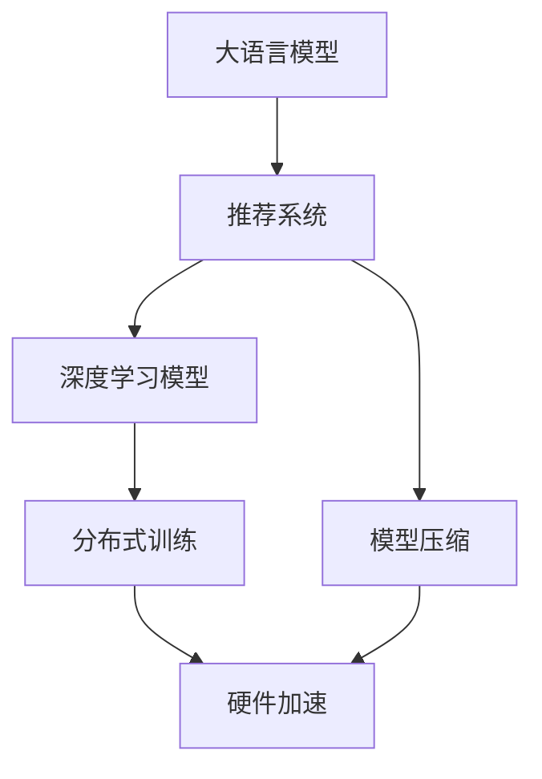

                 

# LLM在推荐系统的局限与成本：对硬件需求的探讨

> 关键词：大语言模型(LLM), 推荐系统, 深度学习, 推荐算法, 硬件需求, 模型压缩, 分布式训练, 硬件加速

## 1. 背景介绍

### 1.1 问题由来
在当前互联网时代，用户对于个性化推荐系统的需求日益增长，推荐系统也因此成为了电商、视频、音乐、新闻等诸多领域的热门应用。而推荐系统背后的核心技术，即推荐算法，目前依然以基于机器学习的模型为主，尤其是深度学习模型在推荐系统中的应用已经取得了广泛共识。近年来，大语言模型(LLM)在推荐系统中的应用逐渐引起了学术界和工业界的重视，众多研究者开始尝试将LLM应用于推荐场景，以期提升推荐系统的性能。

然而，尽管LLM在推荐系统中展现了巨大的潜力，但其在实际应用中仍存在不少局限和挑战。特别是针对硬件需求方面的问题，LLM的应用面临着显著的资源消耗和技术门槛。因此，本文将聚焦于LLM在推荐系统中的局限性及其对硬件需求的影响，深入探讨如何在硬件资源有限的条件下，更好地利用LLM进行推荐系统开发和优化。

## 2. 核心概念与联系

### 2.1 核心概念概述

为更好地理解LLM在推荐系统中的作用和局限，本节将介绍几个关键概念：

- 大语言模型(LLM)：一种基于深度学习，尤其是Transformer结构的大型语言模型。通过在大规模无标签文本语料上进行预训练，学习通用的语言表示，具备强大的语言理解和生成能力。

- 推荐系统：根据用户的历史行为和兴趣，为用户推荐个性化商品、内容、服务等的系统。目标是通过优化用户满意度，提升用户体验和业务转化率。

- 深度学习模型：基于神经网络结构的模型，能够自动学习和提取数据特征，广泛应用于各种智能系统，如推荐系统、图像识别、语音识别等。

- 硬件需求：指运行深度学习模型所需的基本计算资源，包括CPU、GPU、TPU等硬件设备和内存等存储资源。

- 模型压缩：指通过各种方法减小深度学习模型大小，以提高推理速度和资源利用效率的技术。

- 分布式训练：指将大规模深度学习模型的训练任务分布到多个计算节点上并行执行，以加速模型训练的策略。

- 硬件加速：指使用专门的硬件设备，如GPU、TPU等，对深度学习模型的训练和推理进行加速的方法。

这些概念之间的逻辑关系可以通过以下Mermaid流程图来展示：



这个流程图展示了LLM、推荐系统、深度学习模型之间的逻辑联系，以及如何通过模型压缩、分布式训练和硬件加速等手段提升LLM在推荐系统中的应用效率。

## 3. 核心算法原理 & 具体操作步骤
### 3.1 算法原理概述

LLM在推荐系统中的基本应用原理可以概括为以下几个步骤：

1. **数据预处理**：对原始用户行为数据进行清洗、归一化、特征工程等预处理工作，形成可用于模型训练的数据集。

2. **模型训练**：在预处理后的数据集上，使用LLM对推荐模型进行训练。通常使用监督学习或半监督学习方法，以优化模型参数，提升预测准确度。

3. **模型评估**：在测试集上对训练好的模型进行评估，使用AUC、RMSE、NDCG等指标衡量模型性能。

4. **模型微调**：根据评估结果，对模型进行微调，调整超参数，提升模型效果。

5. **模型部署**：将训练好的模型部署到生产环境中，用于实时推荐。

### 3.2 算法步骤详解

#### 3.2.1 数据预处理

数据预处理是推荐系统应用LLM的重要前提。一般包括以下几个步骤：

1. **数据清洗**：移除缺失、异常、重复等无效数据，确保数据质量。

2. **特征工程**：通过编码、归一化、特征选择等方法，将原始数据转换为模型所需的输入格式。

3. **数据分割**：将数据集划分为训练集、验证集和测试集，用于模型训练、调参和评估。

#### 3.2.2 模型训练

模型训练是推荐系统中LLM应用的核心环节。主要包括以下几个步骤：

1. **选择模型**：根据任务需求选择合适的LLM模型，如BERT、GPT等。

2. **搭建训练框架**：使用深度学习框架如TensorFlow、PyTorch等，搭建训练模型，并进行超参数配置。

3. **模型训练**：在训练集上使用LLM进行模型训练，同时应用分布式训练等技术，加快模型训练速度。

4. **模型评估**：在验证集上对训练好的模型进行评估，根据评估结果调整模型参数，避免过拟合。

#### 3.2.3 模型微调

模型微调是提升LLM在推荐系统中性能的关键步骤。主要包括以下几个步骤：

1. **选择微调策略**：根据任务需求选择合适的微调策略，如全参数微调、参数高效微调等。

2. **微调模型**：在少量标注数据上，使用LLM对模型进行微调，优化模型性能。

3. **模型部署**：将微调好的模型部署到生产环境中，用于实时推荐。

#### 3.2.4 模型评估

模型评估是衡量LLM在推荐系统中性能的重要环节。主要包括以下几个步骤：

1. **准备测试集**：收集用户行为数据，生成用于评估模型的测试集。

2. **模型预测**：在测试集上使用微调好的模型进行预测，生成推荐结果。

3. **评估指标**：根据评估指标如AUC、RMSE、NDCG等，衡量模型性能。

### 3.3 算法优缺点

#### 3.3.1 优点

1. **强大的语言理解能力**：LLM能够自然地处理和理解文本信息，适用于推荐系统中处理文本推荐任务。

2. **无需人工特征工程**：LLM能够自动学习文本特征，减少了人工特征工程的工作量。

3. **适应性强**：LLM在推荐系统中能够适应各种任务需求，如图书推荐、新闻推荐、商品推荐等。

#### 3.3.2 缺点

1. **计算资源消耗大**：LLM模型的参数量较大，训练和推理需要大量计算资源。

2. **训练时间长**：LLM模型的训练时间较长，需要大规模分布式计算资源。

3. **内存占用高**：LLM模型在推理时占用大量内存，对系统内存要求较高。

### 3.4 算法应用领域

LLM在推荐系统中的应用领域较为广泛，主要包括：

1. **文本推荐**：通过分析用户对文本的浏览、点赞、评论等行为，使用LLM进行文本推荐，如新闻、文章、商品描述等。

2. **语音推荐**：通过分析用户的语音指令和音频特征，使用LLM进行语音推荐，如音乐、播客、有声书等。

3. **视频推荐**：通过分析用户的观看行为和视频特征，使用LLM进行视频推荐，如电影、电视剧、短视频等。

4. **图像推荐**：通过分析用户对图像的浏览、点赞、评论等行为，使用LLM进行图像推荐，如图书、艺术品、旅游地标等。

5. **商品推荐**：通过分析用户的购物行为和商品属性，使用LLM进行商品推荐，如服装、电子产品、家居用品等。

## 4. 数学模型和公式 & 详细讲解  
### 4.1 数学模型构建

在推荐系统中使用LLM进行模型训练，通常采用监督学习或半监督学习的方法。以监督学习为例，设原始数据集为 $D=\{(x_i, y_i)\}_{i=1}^N$，其中 $x_i$ 为用户行为数据， $y_i$ 为推荐标签，模型训练的目标是优化模型参数 $\theta$，使得模型能够准确预测推荐标签 $y$。常见的优化目标函数包括均方误差损失函数 $L(y,\hat{y})=\frac{1}{N}\sum_{i=1}^N(y_i-\hat{y}_i)^2$ 和交叉熵损失函数 $L(y,\hat{y})=-\frac{1}{N}\sum_{i=1}^N[y_i\log\hat{y}_i+(1-y_i)\log(1-\hat{y}_i)]$。

### 4.2 公式推导过程

以交叉熵损失函数为例，推导其梯度更新公式。设模型 $M_{\theta}(x)$ 在输入 $x$ 上的输出为 $\hat{y}=\sigma(Wx+b)$，其中 $W$ 和 $b$ 为模型的可训练参数。交叉熵损失函数可以表示为：

$$
L(y,\hat{y})=-\frac{1}{N}\sum_{i=1}^N[y_i\log\hat{y}_i+(1-y_i)\log(1-\hat{y}_i)]
$$

梯度更新公式为：

$$
\theta \leftarrow \theta - \eta \nabla_{\theta}L(y,\hat{y})
$$

其中 $\nabla_{\theta}L(y,\hat{y})$ 表示损失函数对模型参数 $\theta$ 的梯度，可以通过反向传播算法计算得到。

### 4.3 案例分析与讲解

以新闻推荐为例，使用BERT模型进行推荐系统训练和微调。假设模型输入为新闻标题，输出为新闻类别标签。首先，对新闻标题进行分词和编码，得到输入序列 $x$。然后，将 $x$ 输入BERT模型，得到输出序列 $\hat{y}$。接着，使用交叉熵损失函数计算损失，并根据梯度更新公式更新模型参数。最后，在验证集上评估模型性能，根据评估结果调整模型参数和训练超参数，提升模型效果。

## 5. 项目实践：代码实例和详细解释说明
### 5.1 开发环境搭建

在进行LLM在推荐系统中的应用实践前，需要先搭建开发环境。以下是使用Python和PyTorch进行模型训练的开发环境配置流程：

1. 安装Anaconda：从官网下载并安装Anaconda，用于创建独立的Python环境。

2. 创建并激活虚拟环境：
```bash
conda create -n recommendation-env python=3.8 
conda activate recommendation-env
```

3. 安装PyTorch：根据CUDA版本，从官网获取对应的安装命令。例如：
```bash
conda install pytorch torchvision torchaudio cudatoolkit=11.1 -c pytorch -c conda-forge
```

4. 安装transformers库：
```bash
pip install transformers
```

5. 安装各类工具包：
```bash
pip install numpy pandas scikit-learn matplotlib tqdm jupyter notebook ipython
```

完成上述步骤后，即可在`recommendation-env`环境中开始LLM在推荐系统中的应用实践。

### 5.2 源代码详细实现

下面我们以新闻推荐为例，给出使用BERT模型进行推荐系统微调的PyTorch代码实现。

首先，定义新闻推荐任务的数据处理函数：

```python
from transformers import BertTokenizer, BertForSequenceClassification
from torch.utils.data import Dataset, DataLoader
import torch

class NewsRecommendationDataset(Dataset):
    def __init__(self, texts, labels, tokenizer, max_len=128):
        self.texts = texts
        self.labels = labels
        self.tokenizer = tokenizer
        self.max_len = max_len
        
    def __len__(self):
        return len(self.texts)
    
    def __getitem__(self, item):
        text = self.texts[item]
        label = self.labels[item]
        
        encoding = self.tokenizer(text, return_tensors='pt', max_length=self.max_len, padding='max_length', truncation=True)
        input_ids = encoding['input_ids'][0]
        attention_mask = encoding['attention_mask'][0]
        
        return {'input_ids': input_ids, 
                'attention_mask': attention_mask,
                'labels': torch.tensor(label, dtype=torch.long)}
```

然后，定义模型和优化器：

```python
from transformers import AdamW

model = BertForSequenceClassification.from_pretrained('bert-base-uncased', num_labels=2)

optimizer = AdamW(model.parameters(), lr=2e-5)
```

接着，定义训练和评估函数：

```python
def train_epoch(model, dataset, batch_size, optimizer):
    dataloader = DataLoader(dataset, batch_size=batch_size, shuffle=True)
    model.train()
    epoch_loss = 0
    for batch in dataloader:
        input_ids = batch['input_ids'].to(device)
        attention_mask = batch['attention_mask'].to(device)
        labels = batch['labels'].to(device)
        model.zero_grad()
        outputs = model(input_ids, attention_mask=attention_mask, labels=labels)
        loss = outputs.loss
        epoch_loss += loss.item()
        loss.backward()
        optimizer.step()
    return epoch_loss / len(dataloader)

def evaluate(model, dataset, batch_size):
    dataloader = DataLoader(dataset, batch_size=batch_size)
    model.eval()
    preds, labels = [], []
    with torch.no_grad():
        for batch in dataloader:
            input_ids = batch['input_ids'].to(device)
            attention_mask = batch['attention_mask'].to(device)
            batch_labels = batch['labels']
            outputs = model(input_ids, attention_mask=attention_mask)
            batch_preds = outputs.logits.argmax(dim=1).to('cpu').tolist()
            batch_labels = batch_labels.to('cpu').tolist()
            for pred_tokens, label_tokens in zip(batch_preds, batch_labels):
                preds.append(pred_tokens[:len(label_tokens)])
                labels.append(label_tokens)
                
    print(classification_report(labels, preds))
```

最后，启动训练流程并在测试集上评估：

```python
epochs = 5
batch_size = 16

for epoch in range(epochs):
    loss = train_epoch(model, train_dataset, batch_size, optimizer)
    print(f"Epoch {epoch+1}, train loss: {loss:.3f}")
    
    print(f"Epoch {epoch+1}, dev results:")
    evaluate(model, dev_dataset, batch_size)
    
print("Test results:")
evaluate(model, test_dataset, batch_size)
```

以上就是使用PyTorch对BERT模型进行新闻推荐任务微调的完整代码实现。可以看到，得益于Transformers库的强大封装，我们可以用相对简洁的代码完成BERT模型的加载和微调。

### 5.3 代码解读与分析

让我们再详细解读一下关键代码的实现细节：

**NewsRecommendationDataset类**：
- `__init__`方法：初始化新闻标题、标签、分词器等关键组件，并进行序列编码。
- `__len__`方法：返回数据集的样本数量。
- `__getitem__`方法：对单个样本进行处理，将新闻标题输入BERT模型，得到模型输出，并对其进行定长padding，最终返回模型所需的输入。

**模型定义**：
- 使用BertForSequenceClassification类定义BERT模型，输入为新闻标题序列，输出为新闻类别标签。
- 初始化AdamW优化器，设置学习率为2e-5。

**训练和评估函数**：
- 使用PyTorch的DataLoader对数据集进行批次化加载，供模型训练和推理使用。
- 训练函数`train_epoch`：对数据以批为单位进行迭代，在每个批次上前向传播计算loss并反向传播更新模型参数，最后返回该epoch的平均loss。
- 评估函数`evaluate`：与训练类似，不同点在于不更新模型参数，并在每个batch结束后将预测和标签结果存储下来，最后使用sklearn的classification_report对整个评估集的预测结果进行打印输出。

**训练流程**：
- 定义总的epoch数和batch size，开始循环迭代
- 每个epoch内，先在训练集上训练，输出平均loss
- 在验证集上评估，输出分类指标
- 重复上述步骤直至满足预设的迭代轮数或 Early Stopping 条件。

可以看到，PyTorch配合Transformers库使得BERT微调的代码实现变得简洁高效。开发者可以将更多精力放在数据处理、模型改进等高层逻辑上，而不必过多关注底层的实现细节。

## 6. 实际应用场景
### 6.1 智能推荐平台

基于大语言模型微调的推荐系统，可以广泛应用于智能推荐平台。智能推荐平台通过分析用户的历史行为、兴趣和当前需求，为用户推荐个性化的商品、内容、服务等，提升用户体验和业务转化率。

在技术实现上，可以收集用户浏览、购买、评价等行为数据，使用BERT等大语言模型进行文本特征提取，构建推荐模型。微调后的推荐模型能够自动学习用户兴趣，生成符合用户喜好的推荐内容。对于用户提出的新需求，还可以通过检索系统实时搜索相关内容，动态生成推荐结果。如此构建的智能推荐平台，能够为用户提供更为精准和个性化的服务，提升用户的满意度。

### 6.2 个性化医疗推荐

当前的医疗推荐系统往往只依赖于患者的历史诊疗记录进行推荐，难以兼顾患者的多样需求和个性化特征。基于大语言模型微调的推荐系统，能够更好地挖掘患者的需求和兴趣，提供更为精准和个性化的医疗服务。

在技术实现上，可以收集患者的病情描述、诊断结果、治疗方案等医疗信息，使用BERT等大语言模型进行文本特征提取。微调后的推荐模型能够自动学习患者的病历信息，生成个性化的治疗方案和健康建议。对于患者提出的新需求，还可以通过检索系统实时搜索相关内容，动态生成推荐结果。如此构建的个性化医疗推荐系统，能够帮助患者更好地了解自己的病情，提高治疗效果和满意度。

### 6.3 教育资源推荐

教育资源推荐系统通过分析学生的学习行为和兴趣，推荐个性化的教育资源，如课程、视频、教材等。传统的教育资源推荐系统通常依赖于学生的历史学习记录和行为数据，无法全面了解学生的兴趣和需求。而基于大语言模型微调的推荐系统，能够更好地挖掘学生的学习兴趣和需求，推荐更加贴合学生的个性化教育资源。

在技术实现上，可以收集学生学习历史、考试成绩、兴趣爱好等数据，使用BERT等大语言模型进行文本特征提取。微调后的推荐模型能够自动学习学生的学习兴趣，生成个性化的学习资源推荐。对于学生提出的新需求，还可以通过检索系统实时搜索相关内容，动态生成推荐结果。如此构建的教育资源推荐系统，能够提升学生的学习效果和满意度，促进教育公平。

### 6.4 未来应用展望

随着大语言模型微调技术的不断发展，基于微调范式将在更多领域得到应用，为各行各业带来变革性影响。

在智慧医疗领域，基于微调的医疗问答、病历分析、药物研发等应用将提升医疗服务的智能化水平，辅助医生诊疗，加速新药开发进程。

在智能教育领域，微调技术可应用于作业批改、学情分析、知识推荐等方面，因材施教，促进教育公平，提高教学质量。

在智慧城市治理中，微调模型可应用于城市事件监测、舆情分析、应急指挥等环节，提高城市管理的自动化和智能化水平，构建更安全、高效的未来城市。

此外，在企业生产、社会治理、文娱传媒等众多领域，基于大模型微调的人工智能应用也将不断涌现，为NLP技术带来了全新的突破。相信随着预训练语言模型和微调方法的不断进步，大语言模型微调必将在构建人机协同的智能时代中扮演越来越重要的角色。

## 7. 工具和资源推荐
### 7.1 学习资源推荐

为了帮助开发者系统掌握大语言模型微调的理论基础和实践技巧，这里推荐一些优质的学习资源：

1. 《Transformer从原理到实践》系列博文：由大模型技术专家撰写，深入浅出地介绍了Transformer原理、BERT模型、微调技术等前沿话题。

2. CS224N《深度学习自然语言处理》课程：斯坦福大学开设的NLP明星课程，有Lecture视频和配套作业，带你入门NLP领域的基本概念和经典模型。

3. 《Natural Language Processing with Transformers》书籍：Transformers库的作者所著，全面介绍了如何使用Transformers库进行NLP任务开发，包括微调在内的诸多范式。

4. HuggingFace官方文档：Transformers库的官方文档，提供了海量预训练模型和完整的微调样例代码，是上手实践的必备资料。

5. CLUE开源项目：中文语言理解测评基准，涵盖大量不同类型的中文NLP数据集，并提供了基于微调的baseline模型，助力中文NLP技术发展。

通过对这些资源的学习实践，相信你一定能够快速掌握大语言模型微调的精髓，并用于解决实际的NLP问题。
###  7.2 开发工具推荐

高效的开发离不开优秀的工具支持。以下是几款用于大语言模型微调开发的常用工具：

1. PyTorch：基于Python的开源深度学习框架，灵活动态的计算图，适合快速迭代研究。大部分预训练语言模型都有PyTorch版本的实现。

2. TensorFlow：由Google主导开发的开源深度学习框架，生产部署方便，适合大规模工程应用。同样有丰富的预训练语言模型资源。

3. Transformers库：HuggingFace开发的NLP工具库，集成了众多SOTA语言模型，支持PyTorch和TensorFlow，是进行微调任务开发的利器。

4. Weights & Biases：模型训练的实验跟踪工具，可以记录和可视化模型训练过程中的各项指标，方便对比和调优。与主流深度学习框架无缝集成。

5. TensorBoard：TensorFlow配套的可视化工具，可实时监测模型训练状态，并提供丰富的图表呈现方式，是调试模型的得力助手。

6. Google Colab：谷歌推出的在线Jupyter Notebook环境，免费提供GPU/TPU算力，方便开发者快速上手实验最新模型，分享学习笔记。

合理利用这些工具，可以显著提升大语言模型微调任务的开发效率，加快创新迭代的步伐。

### 7.3 相关论文推荐

大语言模型和微调技术的发展源于学界的持续研究。以下是几篇奠基性的相关论文，推荐阅读：

1. Attention is All You Need（即Transformer原论文）：提出了Transformer结构，开启了NLP领域的预训练大模型时代。

2. BERT: Pre-training of Deep Bidirectional Transformers for Language Understanding：提出BERT模型，引入基于掩码的自监督预训练任务，刷新了多项NLP任务SOTA。

3. Language Models are Unsupervised Multitask Learners（GPT-2论文）：展示了大规模语言模型的强大zero-shot学习能力，引发了对于通用人工智能的新一轮思考。

4. Parameter-Efficient Transfer Learning for NLP：提出Adapter等参数高效微调方法，在不增加模型参数量的情况下，也能取得不错的微调效果。

5. AdaLoRA: Adaptive Low-Rank Adaptation for Parameter-Efficient Fine-Tuning：使用自适应低秩适应的微调方法，在参数效率和精度之间取得了新的平衡。

这些论文代表了大语言模型微调技术的发展脉络。通过学习这些前沿成果，可以帮助研究者把握学科前进方向，激发更多的创新灵感。

## 8. 总结：未来发展趋势与挑战

### 8.1 总结

本文对大语言模型在推荐系统中的应用进行了全面系统的介绍。首先阐述了大语言模型在推荐系统中的作用和局限，明确了微调在提升推荐系统性能方面的独特价值。其次，从原理到实践，详细讲解了LLM在推荐系统中的数学模型和关键步骤，给出了微调任务开发的完整代码实例。同时，本文还广泛探讨了LLM在推荐系统中的应用场景，展示了其在智能推荐、个性化医疗、教育资源推荐等方面的潜在价值。此外，本文精选了微调技术的各类学习资源，力求为读者提供全方位的技术指引。

通过本文的系统梳理，可以看到，LLM在推荐系统中的应用既具有巨大潜力，也面临诸多挑战。LLM能够提供强大的语言理解和生成能力，提升推荐系统的性能，但同时也需要克服计算资源消耗大、训练时间长、内存占用高等难题。未来，在硬件加速、模型压缩、分布式训练等方面进行深入研究，将有助于克服这些挑战，充分发挥LLM在推荐系统中的作用。

### 8.2 未来发展趋势

展望未来，大语言模型在推荐系统中的应用将呈现以下几个发展趋势：

1. 模型压缩和剪枝：针对LLM参数量大的问题，未来将研究更多的模型压缩和剪枝方法，如知识蒸馏、低秩矩阵分解、通道剪枝等，以减少模型大小，提高推理速度。

2. 分布式训练：随着数据量的不断增大，LLM模型的训练将更加依赖分布式计算资源。未来将研究更高效的分布式训练方法，如异步更新、参数同步等，以加快模型训练速度。

3. 硬件加速：LLM模型的计算密集型特性决定了其对高性能硬件的需求。未来将研究更多硬件加速技术，如GPU、TPU、FPGA等，提升模型的训练和推理效率。

4. 混合架构：为了兼顾模型精度和计算资源，未来将研究混合架构的推荐系统，如深度神经网络与传统推荐算法结合，提高推荐效果和可解释性。

5. 跨模态融合：推荐系统不仅仅局限于文本数据，未来的趋势是将视觉、语音、图像等多模态数据与文本数据融合，提升推荐系统的多样性和丰富度。

6. 自动化优化：未来的推荐系统将进一步引入自动化优化技术，如自适应学习率、自动剪枝等，提高系统的自适应能力和优化效果。

以上趋势凸显了大语言模型在推荐系统中的广阔前景。这些方向的探索发展，必将进一步提升推荐系统的性能和用户体验，推动AI技术在各行业的广泛应用。

### 8.3 面临的挑战

尽管大语言模型在推荐系统中展现了巨大潜力，但在实际应用中仍面临诸多挑战：

1. 标注数据获取难：大语言模型微调需要大量的标注数据，而标注数据的获取成本高、周期长，是应用中面临的主要瓶颈。如何从少样本数据中高效学习，减少对标注数据的依赖，将是一大挑战。

2. 模型鲁棒性不足：LLM模型面对域外数据时，泛化性能往往大打折扣。对于测试样本的微小扰动，LLM模型的预测也容易发生波动。如何提高模型的鲁棒性，避免过拟合和灾难性遗忘，还需要更多理论和实践的积累。

3. 推理效率有待提高：LLM模型虽然精度高，但在实际部署时往往面临推理速度慢、内存占用大等效率问题。如何在保证性能的同时，简化模型结构，提升推理速度，优化资源占用，将是重要的优化方向。

4. 可解释性不足：LLM模型通常缺乏可解释性，难以解释其内部工作机制和决策逻辑。对于医疗、金融等高风险应用，算法的可解释性和可审计性尤为重要。如何赋予LLM模型更强的可解释性，将是亟待攻克的难题。

5. 安全性有待保障：LLM模型可能会学习到有害信息，传递到推荐系统中，产生误导性、歧视性的输出，给实际应用带来安全隐患。如何从数据和算法层面消除模型偏见，避免恶意用途，确保输出的安全性，也将是重要的研究课题。

6. 知识整合能力不足：现有的LLM模型往往局限于任务内数据，难以灵活吸收和运用更广泛的先验知识。如何让LLM模型更好地与外部知识库、规则库等专家知识结合，形成更加全面、准确的信息整合能力，还有很大的想象空间。

正视LLM在推荐系统中的应用面临的这些挑战，积极应对并寻求突破，将是大语言模型微调走向成熟的必由之路。相信随着学界和产业界的共同努力，这些挑战终将一一被克服，LLM在推荐系统中的应用必将迈向新的高度。

### 8.4 研究展望

面对大语言模型在推荐系统中的应用挑战，未来的研究需要在以下几个方面寻求新的突破：

1. 探索无监督和半监督微调方法。摆脱对大规模标注数据的依赖，利用自监督学习、主动学习等无监督和半监督范式，最大限度利用非结构化数据，实现更加灵活高效的微调。

2. 研究参数高效和计算高效的微调范式。开发更加参数高效的微调方法，在固定大部分预训练参数的同时，只更新极少量的任务相关参数。同时优化微调模型的计算图，减少前向传播和反向传播的资源消耗，实现更加轻量级、实时性的部署。

3. 融合因果和对比学习范式。通过引入因果推断和对比学习思想，增强LLM模型的建立稳定因果关系的能力，学习更加普适、鲁棒的语言表征，从而提升模型泛化性和抗干扰能力。

4. 引入更多先验知识。将符号化的先验知识，如知识图谱、逻辑规则等，与神经网络模型进行巧妙融合，引导微调过程学习更准确、合理的语言模型。同时加强不同模态数据的整合，实现视觉、语音等多模态信息与文本信息的协同建模。

5. 结合因果分析和博弈论工具。将因果分析方法引入LLM模型，识别出模型决策的关键特征，增强输出解释的因果性和逻辑性。借助博弈论工具刻画人机交互过程，主动探索并规避模型的脆弱点，提高系统稳定性。

6. 纳入伦理道德约束。在模型训练目标中引入伦理导向的评估指标，过滤和惩罚有偏见、有害的输出倾向。同时加强人工干预和审核，建立模型行为的监管机制，确保输出符合人类价值观和伦理道德。

这些研究方向的探索，必将引领大语言模型微调技术迈向更高的台阶，为构建安全、可靠、可解释、可控的智能系统铺平道路。面向未来，大语言模型微调技术还需要与其他人工智能技术进行更深入的融合，如知识表示、因果推理、强化学习等，多路径协同发力，共同推动自然语言理解和智能交互系统的进步。只有勇于创新、敢于突破，才能不断拓展语言模型的边界，让智能技术更好地造福人类社会。

## 9. 附录：常见问题与解答

**Q1：大语言模型在推荐系统中的应用效果如何？**

A: 大语言模型在推荐系统中的应用效果很大程度上取决于数据质量和模型设计。如果能够合理使用大语言模型，如BERT、GPT等，结合合适的特征提取和模型优化策略，可以显著提升推荐系统的性能。但需要注意的是，大语言模型的计算资源消耗大，训练时间长，模型压缩和剪枝技术显得尤为重要。

**Q2：大语言模型在推荐系统中的训练时间是多少？**

A: 大语言模型在推荐系统中的训练时间主要取决于数据量和模型复杂度。一般情况下，使用BERT等大语言模型，单个epoch的训练时间可能达到几个小时甚至几天，整个训练过程可能需要数周时间。针对大规模数据集，可以采用分布式训练等技术，缩短训练时间。

**Q3：大语言模型在推荐系统中需要哪些硬件设备？**

A: 大语言模型在推荐系统中需要高性能的计算资源，如GPU、TPU等。此外，由于模型参数量较大，还需要较大的内存空间。因此，硬件加速和内存优化技术在推荐系统中的应用显得尤为重要。

**Q4：大语言模型在推荐系统中的内存占用是多少？**

A: 大语言模型在推理时占用大量内存，内存占用量取决于模型参数量和推理任务。一般情况下，BERT等大语言模型在推理时占用内存可能达到几GB甚至几十GB。为了提高系统的可扩展性和运行效率，可以采用模型压缩、分阶段推理等技术。

**Q5：大语言模型在推荐系统中的推理速度是多少？**

A: 大语言模型在推理时速度较慢，推理速度主要取决于模型参数量和推理任务。一般情况下，BERT等大语言模型在推理时速度较慢，需要数秒甚至数十秒时间。为了提高推理速度，可以采用模型剪枝、分布式推理等技术。

以上Q&A反映了在推荐系统中应用大语言模型可能遇到的常见问题及解决方案，通过这些问题解答，可以帮助开发者更好地理解和应用大语言模型在推荐系统中的技术细节。

