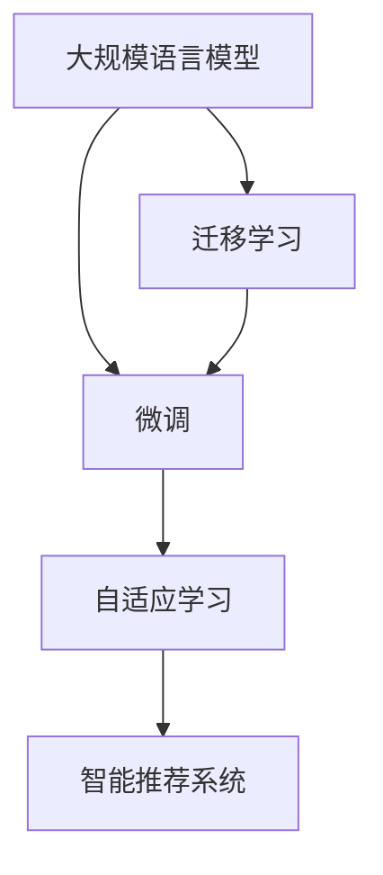

                 

## 1. 背景介绍

### 1.1 问题由来

近年来，随着人工智能技术特别是深度学习的发展，语言模型（Language Models，LLMs）在教育领域展现出巨大的潜力。语言模型，尤其是以Transformer为架构的大规模语言模型（如GPT-3、BERT等），不仅在语言理解、生成等方面表现出色，更在教育领域的应用中展现出了深远的影响。本文将探讨LLM在个性化学习中的潜在应用，以及如何构建一个高效、智能的教育平台，以实现真正的个性化学习。

### 1.2 问题核心关键点

个性化学习是教育领域的一项重要课题，其核心在于根据学生的个体差异和兴趣，提供定制化的教学内容和学习路径。而大规模语言模型通过海量的数据训练，拥有强大的语言理解和生成能力，能够对学生的学习行为进行精准分析和预测，从而实现个性化教育。

个性化学习的关键在于：
- **数据驱动**：通过收集和分析学生的学习数据，识别其兴趣和能力水平，以数据为依据制定学习计划。
- **模型适配**：将预训练的语言模型微调到适合个性化学习任务的模型，实现对特定教育场景的适配。
- **交互反馈**：通过学生与系统间的互动，不断调整学习策略，以实现更高效的个性化教学。

### 1.3 问题研究意义

在人工智能技术迅猛发展的背景下，LLM在个性化学习中的应用能够极大地提升教育质量和效率。通过个性化学习，教育系统能够更好地关注每个学生的独特需求，提供针对性的教学内容，从而提升学生的学习效果。此外，个性化学习还能帮助教育机构降低运营成本，实现教育资源的合理配置。

## 2. 核心概念与联系

### 2.1 核心概念概述

为更好地理解LLM在个性化学习中的应用，本节将介绍几个关键概念及其之间的联系：

- **大规模语言模型（Large Language Models，LLMs）**：指通过自监督学习从大规模无标签文本数据中训练得到的语言模型。例如GPT-3、BERT等模型，能够进行语言理解、生成等任务。
- **微调（Fine-tuning）**：在预训练模型的基础上，使用特定的教育数据集进行有监督学习，优化模型以适配教育任务的过程。
- **迁移学习（Transfer Learning）**：通过将预训练模型中的知识迁移到特定任务中，以减少在新任务上的训练时间和数据需求。
- **自适应学习（Adaptive Learning）**：根据学生的学习进度和反馈，动态调整学习内容和策略的过程。
- **智能推荐系统（Recommender Systems）**：通过分析用户的行为数据，推荐最适合的教育资源和内容，以提升学习效率。

这些概念之间的逻辑关系可以通过以下Mermaid流程图来展示：



这个流程图展示了大语言模型在个性化学习中的核心概念及其之间的关系：

1. 大语言模型通过预训练获得基础能力。
2. 微调是对预训练模型进行任务特定的优化，以适配教育任务。
3. 迁移学习通过将预训练知识迁移到特定任务，以减少训练成本。
4. 自适应学习根据学生反馈动态调整学习内容和策略。
5. 智能推荐系统通过分析用户行为，推荐最合适的教育资源。

这些概念共同构成了LLM在个性化学习中的应用框架，使其能够更好地支持个性化教育。

## 3. 核心算法原理 & 具体操作步骤
### 3.1 算法原理概述

基于LLM的个性化学习主要通过以下步骤实现：

1. **数据收集与预处理**：收集学生的学习行为数据（如阅读时间、练习成绩、互动记录等），进行数据清洗和特征工程。
2. **预训练模型适配**：选择预训练模型（如GPT-3、BERT等），根据教育任务微调模型参数，适配特定教学需求。
3. **自适应学习策略设计**：设计动态调整学习内容的算法，根据学生的学习进度和反馈，优化学习路径。
4. **智能推荐系统构建**：基于学生的兴趣和行为数据，构建推荐系统，推荐合适的教育资源和内容。
5. **个性化学习反馈机制**：通过学生与系统的交互反馈，不断调整学习策略，以实现更高效的个性化教学。

### 3.2 算法步骤详解

下面详细介绍基于LLM的个性化学习的核心算法步骤：

#### 3.2.1 数据收集与预处理

收集学生的学习行为数据，进行如下预处理：

1. **数据清洗**：去除噪声数据，如重复、缺失值等。
2. **特征工程**：提取有用的特征，如阅读时间、练习成绩、互动次数等。
3. **标准化**：将数据标准化到[0,1]区间，便于模型处理。
4. **划分数据集**：将数据集划分为训练集、验证集和测试集。

#### 3.2.2 预训练模型适配

选择合适的预训练模型，通过微调适配教育任务。具体步骤：

1. **选择模型**：根据教育任务需求，选择适合的预训练模型（如GPT-3、BERT等）。
2. **设计任务适配层**：在模型的顶层添加特定的输出层和损失函数，适配教育任务。
3. **微调模型**：使用教育数据集进行有监督学习，优化模型参数。
4. **评估模型**：在验证集上评估模型性能，调整超参数以优化模型。

#### 3.2.3 自适应学习策略设计

设计动态调整学习内容的算法，具体步骤：

1. **定义评估指标**：如阅读时间、练习成绩等。
2. **建立学习路径**：根据评估指标，动态调整学习内容。
3. **调整学习策略**：根据学生反馈，实时调整学习策略。
4. **反馈机制**：收集学生的反馈，调整学习路径和策略。

#### 3.2.4 智能推荐系统构建

基于学生的兴趣和行为数据，构建推荐系统，具体步骤：

1. **数据收集**：收集学生的学习行为数据，如阅读记录、练习记录等。
2. **特征提取**：提取有用的特征，如兴趣偏好、学习进度等。
3. **模型训练**：使用推荐算法（如协同过滤、内容推荐等），训练推荐模型。
4. **推荐内容**：根据学生的兴趣和行为，推荐合适的教育资源和内容。

#### 3.2.5 个性化学习反馈机制

通过学生与系统的交互反馈，不断调整学习策略，具体步骤：

1. **收集反馈**：通过问卷调查、互动记录等方式收集学生的反馈。
2. **分析反馈**：分析学生的反馈，识别学习中的问题和需求。
3. **调整策略**：根据反馈调整学习策略，优化学习路径。
4. **持续改进**：不断优化学习策略，提升学习效果。

### 3.3 算法优缺点

基于LLM的个性化学习算法具有以下优点：

1. **高效性**：通过预训练和微调，模型能够在短时间内适配特定教育任务，提高学习效率。
2. **个性化**：通过数据分析和反馈机制，实现对每个学生的个性化教学，提升学习效果。
3. **可扩展性**：适用于多种教育任务和场景，易于扩展和部署。

同时，该算法也存在一些缺点：

1. **数据需求高**：需要大量的学习行为数据，收集和处理成本较高。
2. **模型复杂性**：预训练和微调过程较复杂，需要较高的技术门槛。
3. **过拟合风险**：特别是在小样本情况下，模型可能出现过拟合，影响泛化能力。
4. **公平性问题**：如果数据存在偏见，模型可能学习到不公平的策略，影响教育公平性。

尽管存在这些局限性，基于LLM的个性化学习算法仍具有广泛的应用前景，并在不断优化和改进中。

### 3.4 算法应用领域

基于LLM的个性化学习算法已经在多个教育领域得到应用，包括：

- **K-12教育**：根据学生的学习行为和成绩，推荐合适的教材和练习题。
- **高等教育**：为学生提供个性化的课程推荐和学习路径规划。
- **职业培训**：根据学生的技能和兴趣，推荐相关的课程和实践机会。
- **语言学习**：根据学生的语言水平和兴趣，推荐合适的教材和练习材料。

此外，LLM在个性化学习中的应用还拓展到了更多场景中，如远程教育、终身学习等，为教育技术的发展提供了新的可能性。

## 4. 数学模型和公式 & 详细讲解 & 举例说明

### 4.1 数学模型构建

基于LLM的个性化学习算法可以通过以下数学模型进行描述：

假设学生的数据集为$D=\{(x_i,y_i)\}_{i=1}^N$，其中$x_i$表示学生的学习行为，$y_i$表示学生的学习效果。预训练模型为$M_{\theta}$，其中$\theta$为模型参数。微调的目标是最小化经验风险，即：

$$
\theta^* = \mathop{\arg\min}_{\theta} \mathcal{L}(\theta,D)
$$

其中$\mathcal{L}$为损失函数，$\mathcal{L}(\theta,D) = \frac{1}{N} \sum_{i=1}^N \ell(M_{\theta}(x_i),y_i)$，$\ell$为特定任务的损失函数，如均方误差、交叉熵等。

### 4.2 公式推导过程

以一个简单的线性回归任务为例，推导微调过程的数学公式。

假设学生的数据集为$D=\{(x_i,y_i)\}_{i=1}^N$，其中$x_i$表示学生的学习行为，$y_i$表示学生的学习效果。预训练模型为线性回归模型$M_{\theta}(x) = \theta_0 + \theta_1 x$，其中$\theta_0,\theta_1$为模型参数。微调的目标是最小化经验风险，即：

$$
\theta^* = \mathop{\arg\min}_{\theta} \mathcal{L}(\theta,D)
$$

其中$\mathcal{L}$为均方误差损失函数，$\mathcal{L}(\theta,D) = \frac{1}{N} \sum_{i=1}^N (y_i - M_{\theta}(x_i))^2$。

根据链式法则，损失函数对参数$\theta_k$的梯度为：

$$
\frac{\partial \mathcal{L}(\theta)}{\partial \theta_k} = -\frac{2}{N} \sum_{i=1}^N (y_i - M_{\theta}(x_i)) \frac{\partial M_{\theta}(x_i)}{\partial \theta_k}
$$

其中$\frac{\partial M_{\theta}(x_i)}{\partial \theta_k} = 1$，代入得：

$$
\frac{\partial \mathcal{L}(\theta)}{\partial \theta_k} = -\frac{2}{N} \sum_{i=1}^N (y_i - \theta_0 - \theta_1 x_i) = -\frac{2}{N} (y - \theta_0 - \theta_1 x)
$$

在得到损失函数的梯度后，即可带入参数更新公式，完成模型的迭代优化。重复上述过程直至收敛，最终得到适应教育任务的最优模型参数$\theta^*$。

### 4.3 案例分析与讲解

以一个实际案例为例，说明基于LLM的个性化学习算法在K-12教育中的应用。

假设一个K-12教育平台希望通过LLM为学生提供个性化的学习建议。具体步骤如下：

1. **数据收集**：收集学生的学习行为数据，如阅读时间、练习成绩、互动记录等。
2. **数据预处理**：进行数据清洗、特征提取和标准化处理。
3. **模型选择**：选择适合的预训练模型（如BERT、GPT-3等），并进行微调适配教育任务。
4. **自适应学习策略设计**：设计动态调整学习内容的算法，根据学生的学习进度和反馈，优化学习路径。
5. **智能推荐系统构建**：基于学生的兴趣和行为数据，构建推荐系统，推荐合适的教育资源和内容。
6. **个性化学习反馈机制**：通过学生与系统的交互反馈，不断调整学习策略，以实现更高效的个性化教学。

通过以上步骤，该教育平台可以实现在线个性化的教育服务，显著提升学生的学习效果和满意度。

## 5. 项目实践：代码实例和详细解释说明

### 5.1 开发环境搭建

在进行个性化学习实践前，我们需要准备好开发环境。以下是使用Python进行TensorFlow开发的环境配置流程：

1. 安装Anaconda：从官网下载并安装Anaconda，用于创建独立的Python环境。

2. 创建并激活虚拟环境：
```bash
conda create -n tensorflow-env python=3.8 
conda activate tensorflow-env
```

3. 安装TensorFlow：根据CUDA版本，从官网获取对应的安装命令。例如：
```bash
conda install tensorflow -c tf -c conda-forge
```

4. 安装TensorFlow Addons：
```bash
pip install tensorflow-addons
```

5. 安装各类工具包：
```bash
pip install numpy pandas scikit-learn matplotlib tqdm jupyter notebook ipython
```

完成上述步骤后，即可在`tensorflow-env`环境中开始个性化学习实践。

### 5.2 源代码详细实现

下面我们以一个简单的线性回归任务为例，给出使用TensorFlow实现基于LLM的个性化学习的PyTorch代码实现。

首先，定义线性回归模型的类：

```python
import tensorflow as tf
from tensorflow.keras import layers

class LinearRegression(tf.keras.Model):
    def __init__(self):
        super(LinearRegression, self).__init__()
        self.dense1 = layers.Dense(64, activation='relu')
        self.dense2 = layers.Dense(1)
    
    def call(self, inputs):
        x = self.dense1(inputs)
        x = self.dense2(x)
        return x
```

然后，定义数据预处理和训练函数：

```python
from tensorflow.keras import datasets, optimizers
from sklearn.model_selection import train_test_split

def load_data():
    (x_train, y_train), (x_test, y_test) = datasets.load_boston()
    x_train, x_test = x_train.to_numpy(), x_test.to_numpy()
    y_train, y_test = y_train.to_numpy(), y_test.to_numpy()
    x_train, x_valid, y_train, y_valid = train_test_split(x_train, y_train, test_size=0.2, random_state=42)
    return x_train, y_train, x_valid, y_valid, x_test, y_test

def train_model(model, x_train, y_train, x_valid, y_valid, epochs=10):
    optimizer = optimizers.Adam(learning_rate=0.01)
    model.compile(optimizer=optimizer, loss='mse')
    model.fit(x_train, y_train, epochs=epochs, validation_data=(x_valid, y_valid))
    return model

x_train, y_train, x_valid, y_valid, x_test, y_test = load_data()

model = LinearRegression()
model = train_model(model, x_train, y_train, x_valid, y_valid)
```

最后，进行测试和评估：

```python
y_pred = model.predict(x_test)
mse = tf.keras.losses.mean_squared_error(y_test, y_pred)
print('Mean Squared Error:', mse)
```

以上就是使用TensorFlow实现基于LLM的个性化学习的完整代码实现。可以看到，TensorFlow提供了强大的深度学习框架，使得模型的实现和训练变得简洁高效。

### 5.3 代码解读与分析

让我们再详细解读一下关键代码的实现细节：

**LinearRegression类**：
- `__init__`方法：初始化模型层，包括两个全连接层。
- `call`方法：定义前向传播的计算过程。

**load_data函数**：
- 使用sklearn的Boston房价数据集，提取训练集、验证集和测试集。
- 对数据进行归一化处理，并划分为训练集、验证集和测试集。

**train_model函数**：
- 定义Adam优化器，并设置学习率。
- 编译模型，指定损失函数为均方误差。
- 使用训练集和验证集训练模型，设置训练轮数为10。

**测试和评估**：
- 使用模型对测试集进行预测，计算预测值与真实值之间的均方误差。

可以看到，TensorFlow提供了完整的深度学习框架，使得模型的实现和训练变得简洁高效。开发者可以将更多精力放在数据处理、模型改进等高层逻辑上，而不必过多关注底层的实现细节。

当然，工业级的系统实现还需考虑更多因素，如模型的保存和部署、超参数的自动搜索、更灵活的任务适配层等。但核心的个性化学习范式基本与此类似。

## 6. 实际应用场景

### 6.1 智能学习助手

基于LLM的个性化学习算法可以应用于智能学习助手系统中，为学生提供实时个性化学习建议。例如，一个智能学习助手可以通过分析学生的学习行为数据，实时推荐适合的学习材料和练习题。这种智能推荐系统可以显著提升学生的学习效果，帮助其更高效地掌握知识。

### 6.2 自适应学习系统

自适应学习系统通过分析学生的学习进度和反馈，动态调整学习内容和策略。例如，一个自适应学习系统可以根据学生的阅读进度，推荐适合其阅读水平的书籍和文章，调整阅读难度，以实现最优的学习效果。这种系统可以适应不同学生的学习需求，提升学习效率和兴趣。

### 6.3 虚拟教师

虚拟教师通过自然语言处理和个性化学习算法，为学生提供个性化的教学服务。例如，一个虚拟教师可以根据学生的学习进度和反馈，实时调整教学内容和策略，提供针对性的解答和指导。这种虚拟教师可以提升学生的学习体验和效果，弥补传统教学中的不足。

### 6.4 未来应用展望

随着LLM和个性化学习算法的不断发展，未来的教育技术将更加智能化和个性化。以下是几个未来应用展望：

1. **多模态学习**：未来的教育技术将结合视觉、听觉等多种感官信息，提升学生的学习体验和效果。例如，通过视频、音频等多模态输入，帮助学生更好地理解和掌握知识。
2. **个性化推荐**：未来的推荐系统将更加精准和高效，根据学生的兴趣和需求，推荐适合的学习内容和资源。例如，通过分析学生的学习行为和反馈，动态调整推荐内容，实现更高效的个性化学习。
3. **自适应评估**：未来的评估系统将更加全面和客观，通过分析学生的学习数据，实时评估学习效果和知识掌握情况。例如，通过实时监测学生的答题情况和反馈，动态调整学习策略，优化学习效果。
4. **虚拟现实**：未来的教育技术将结合虚拟现实技术，提供沉浸式的学习体验。例如，通过虚拟现实技术，让学生进入虚拟课堂，进行互动式学习和实践。

## 7. 工具和资源推荐
### 7.1 学习资源推荐

为了帮助开发者系统掌握LLM在个性化学习中的应用，这里推荐一些优质的学习资源：

1. **《深度学习》课程**：斯坦福大学开设的深度学习课程，涵盖了深度学习的基础知识和前沿技术。
2. **《自然语言处理》课程**：斯坦福大学开设的自然语言处理课程，介绍了NLP的基本概念和经典模型。
3. **《Python深度学习》书籍**：介绍使用Python进行深度学习的技术，包括TensorFlow、Keras等框架的使用。
4. **LLM论文集**：收集了多篇LLM和个性化学习的相关论文，提供了丰富的理论和技术支持。
5. **在线学习平台**：如Coursera、edX等，提供丰富的在线课程和资源，帮助开发者快速上手学习。

通过对这些资源的学习实践，相信你一定能够快速掌握LLM在个性化学习中的应用，并用于解决实际的NLP问题。
###  7.2 开发工具推荐

高效的开发离不开优秀的工具支持。以下是几款用于LLM在个性化学习中应用的常用工具：

1. TensorFlow：基于Python的深度学习框架，提供了强大的计算图和自动微分功能，适合大规模模型的训练和推理。
2. PyTorch：基于Python的深度学习框架，提供了灵活的计算图和动态图，适合快速原型开发和研究。
3. TensorFlow Addons：TensorFlow的扩展库，提供了更多高级的深度学习组件和算法，如TensorFlow Addons等。
4. TensorBoard：TensorFlow配套的可视化工具，可以实时监测模型训练状态，并提供丰富的图表呈现方式。
5. Weights & Biases：模型训练的实验跟踪工具，可以记录和可视化模型训练过程中的各项指标，方便对比和调优。

合理利用这些工具，可以显著提升LLM在个性化学习中的应用开发效率，加快创新迭代的步伐。

### 7.3 相关论文推荐

LLM和个性化学习技术的发展源于学界的持续研究。以下是几篇奠基性的相关论文，推荐阅读：

1. Attention is All You Need：提出Transformer结构，开启了NLP领域的预训练大模型时代。
2. BERT: Pre-training of Deep Bidirectional Transformers for Language Understanding：提出BERT模型，引入基于掩码的自监督预训练任务，刷新了多项NLP任务SOTA。
3. Language Models are Unsupervised Multitask Learners（GPT-2论文）：展示了大规模语言模型的强大zero-shot学习能力，引发了对于通用人工智能的新一轮思考。
4. Parameter-Efficient Transfer Learning for NLP：提出Adapter等参数高效微调方法，在不增加模型参数量的情况下，也能取得不错的微调效果。
5. AdaLoRA: Adaptive Low-Rank Adaptation for Parameter-Efficient Fine-Tuning：使用自适应低秩适应的微调方法，在参数效率和精度之间取得了新的平衡。

这些论文代表了大语言模型在个性化学习中的应用方向和未来发展趋势。通过学习这些前沿成果，可以帮助研究者把握学科前进方向，激发更多的创新灵感。

## 8. 总结：未来发展趋势与挑战

### 8.1 总结

本文对基于LLM的个性化学习算法进行了全面系统的介绍。首先阐述了LLM在个性化学习中的应用背景和意义，明确了个性化学习在教育领域的重要价值。其次，从原理到实践，详细讲解了个性化学习算法的核心步骤，给出了具体的代码实现。同时，本文还广泛探讨了LLM在个性化学习中的实际应用场景，展示了其在教育领域的应用潜力。

通过本文的系统梳理，可以看到，基于LLM的个性化学习算法正在成为教育技术的重要范式，极大地提升了教育的个性化和效率。未来的教育系统将更加智能化和个性化，LLM在个性化学习中的应用也将更加广泛和深入。

### 8.2 未来发展趋势

展望未来，基于LLM的个性化学习技术将呈现以下几个发展趋势：

1. **多模态学习**：未来的教育技术将结合视觉、听觉等多种感官信息，提升学生的学习体验和效果。
2. **个性化推荐**：未来的推荐系统将更加精准和高效，根据学生的兴趣和需求，推荐适合的学习内容和资源。
3. **自适应评估**：未来的评估系统将更加全面和客观，通过分析学生的学习数据，实时评估学习效果和知识掌握情况。
4. **虚拟现实**：未来的教育技术将结合虚拟现实技术，提供沉浸式的学习体验。
5. **多学科融合**：未来的教育技术将与其他学科进行更深层次的融合，如文学、艺术、科学等，提供更全面的教育资源。

以上趋势凸显了LLM在个性化学习中的巨大潜力，这些方向的探索发展，必将进一步提升教育系统的智能化水平，为教育技术的发展带来新的突破。

### 8.3 面临的挑战

尽管基于LLM的个性化学习技术已经取得了显著成果，但在迈向更加智能化、普适化应用的过程中，仍面临诸多挑战：

1. **数据质量和隐私保护**：如何获取高质量的个性化学习数据，同时保护学生隐私，是未来需要解决的重要问题。
2. **模型公平性和鲁棒性**：预训练模型和微调过程可能存在偏见和歧视，如何构建公平、鲁棒的个性化学习模型，还需要更多理论和实践的积累。
3. **算力和资源消耗**：大规模模型和大规模数据的训练和推理，对算力和资源消耗较大，如何降低计算成本，提升系统效率，也是未来的重要研究方向。
4. **交互界面设计**：如何设计直观、易用的交互界面，提升学生的使用体验，也是未来需要解决的重要问题。
5. **教育公平性**：如何确保不同背景、不同能力水平的学生都能获得公平、高效的教育资源，也是未来需要关注的重要课题。

尽管存在这些挑战，未来的教育技术仍需积极应对并寻求突破，以实现真正公平、高效、个性化的教育。相信随着技术的不断进步，基于LLM的个性化学习技术必将在教育领域大放异彩，为学生的全面发展提供有力支持。

### 8.4 研究展望

面对基于LLM的个性化学习所面临的挑战，未来的研究需要在以下几个方面寻求新的突破：

1. **数据驱动的个性化学习**：探索更多高效的数据收集和预处理方法，提升个性化学习算法的效率和效果。
2. **模型鲁棒性增强**：研究更多公平、鲁棒的个性化学习模型，提升系统的稳定性和可靠性。
3. **多模态信息融合**：探索更多多模态信息融合方法，提升个性化学习算法的感知能力和效果。
4. **自适应评估体系**：研究更多自适应评估方法，提升个性化学习算法的评估能力和效果。
5. **人机协同教育**：探索更多人机协同教学方法，提升个性化学习算法的教学效果和学生体验。

这些研究方向的探索，必将引领基于LLM的个性化学习技术迈向更高的台阶，为教育技术的进步提供新的动力。面向未来，基于LLM的个性化学习技术还需要与其他人工智能技术进行更深入的融合，如知识表示、因果推理、强化学习等，共同推动教育技术的进步和发展。

## 9. 附录：常见问题与解答

**Q1：如何设计有效的个性化学习策略？**

A: 有效的个性化学习策略设计需要考虑以下几个关键因素：

1. **数据驱动**：收集和分析学生的学习数据，识别其兴趣和能力水平，以数据为依据制定学习计划。
2. **任务适配**：根据教育任务需求，选择合适的预训练模型，并进行微调适配特定任务。
3. **自适应学习**：设计动态调整学习内容的算法，根据学生的学习进度和反馈，优化学习路径。
4. **反馈机制**：通过学生与系统的交互反馈，不断调整学习策略，以实现更高效的个性化教学。

**Q2：如何选择适合的预训练模型？**

A: 选择适合的预训练模型需要考虑以下几个关键因素：

1. **任务适配性**：根据教育任务的需求，选择能够适配特定任务的预训练模型。
2. **模型大小**：根据计算资源和模型推理速度的要求，选择合适的模型规模。
3. **训练成本**：考虑模型的训练时间和成本，选择可行的预训练模型。
4. **性能评估**：在验证集上评估模型的性能，选择效果最优的预训练模型。

**Q3：如何降低个性化学习的数据需求？**

A: 降低个性化学习的数据需求，可以从以下几个方面进行优化：

1. **数据增强**：通过回译、近义替换等方式扩充训练集，增加数据的样本多样性。
2. **少样本学习**：利用微调和提示学习等方法，在小样本情况下也能够取得较好的效果。
3. **知识图谱**：结合外部知识库，引入先验知识，提升个性化学习的效果。
4. **自监督学习**：探索更多自监督学习方法，利用无标签数据进行模型训练，减少对标注数据的依赖。

**Q4：如何设计高效的学习反馈机制？**

A: 设计高效的学习反馈机制需要考虑以下几个关键因素：

1. **实时反馈**：及时收集和分析学生的学习反馈，动态调整学习策略。
2. **多样性**：采用多种反馈形式，如问答、投票、评论等，收集全面的学生反馈。
3. **可操作性**：将反馈结果转化为可行的学习策略，实现有效的教学调整。
4. **持续改进**：不断优化反馈机制，提升个性化学习的效果。

**Q5：如何构建高效的个性化推荐系统？**

A: 构建高效的个性化推荐系统需要考虑以下几个关键因素：

1. **用户行为分析**：收集和分析学生的学习行为数据，识别其兴趣和需求。
2. **推荐算法**：选择适合推荐任务的算法，如协同过滤、内容推荐等。
3. **实时更新**：根据学生的学习反馈和行为变化，实时更新推荐内容，提升推荐效果。
4. **多样性和公平性**：确保推荐内容的多样性和公平性，避免推荐偏差。

这些关键因素决定了个性化学习算法的效率和效果，需要在实际应用中不断优化和改进。相信随着技术的不断进步，基于LLM的个性化学习必将在教育领域大放异彩，为学生的全面发展提供有力支持。

---

作者：禅与计算机程序设计艺术 / Zen and the Art of Computer Programming

