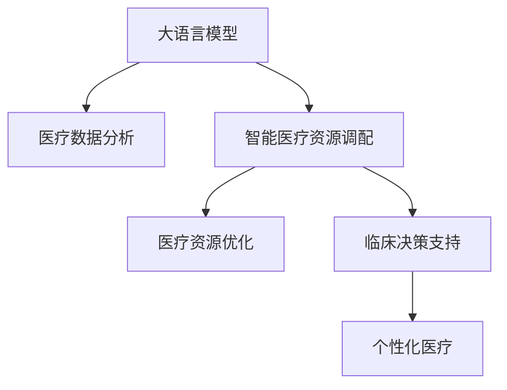

                 

# LLM在智能医疗资源调配中的潜在作用

> 关键词：智能医疗,医疗资源调配,大语言模型,LLM,医疗数据分析,资源优化,算法优化,个性化医疗,临床决策支持

## 1. 背景介绍

### 1.1 问题由来

随着人工智能技术的不断发展，大语言模型（Large Language Model, LLM）在医疗领域的潜在应用引起了广泛关注。智能医疗资源调配作为医疗信息化建设的关键环节，面临着诸多挑战。传统的医疗资源调配往往依赖于经验丰富的专家，但随着医院规模的扩大，患者数量的增加，专家的时间和精力已难以满足临床需求。而智能医疗资源调配系统，通过引入先进的人工智能技术，如大语言模型，可以显著提升资源调配的效率和质量，缓解医护人员的工作压力，优化患者的诊疗体验。

### 1.2 问题核心关键点

当前，大语言模型在医疗领域的应用主要集中在医疗数据分析、临床决策支持、个性化医疗等方面。其核心优势在于能够处理大量的非结构化医疗数据，从中提取有价值的信息，辅助医生进行决策。但在智能医疗资源调配领域，大语言模型如何发挥作用，如何更好地适配医疗资源调配这一特定任务，仍是一个值得深入探索的问题。

### 1.3 问题研究意义

智能医疗资源调配系统通过优化医疗资源配置，提高医院运行的效率和效益，是现代医院管理的重要方向。大语言模型在这一领域的应用，有助于实现以下目标：

1. **提高资源利用率**：通过分析历史和实时数据，预测医疗资源需求，避免资源浪费。
2. **优化人员安排**：根据病人的病情和医生的专业特长，自动调度医生和护士，提升医护人员的工作满意度。
3. **改善患者体验**：智能调度系统能够根据患者需求，安排最合适的医生和科室，减少患者的等待时间。
4. **促进个性化医疗**：基于患者的健康数据和历史诊疗信息，提供个性化的治疗方案和资源配置。

## 2. 核心概念与联系

### 2.1 核心概念概述

为更好地理解大语言模型在智能医疗资源调配中的应用，本节将介绍几个密切相关的核心概念：

- **大语言模型（LLM）**：以Transformer模型为代表的大规模预训练语言模型。通过在海量无标签文本数据上进行预训练，学习通用的语言表示，具备强大的语言理解和生成能力。

- **智能医疗资源调配**：利用信息化手段，优化医院内部和外部的资源配置，如医生、护士、病床、设备等，提高医院运营效率和患者满意度。

- **医疗数据分析**：从电子病历、检查报告等非结构化医疗数据中提取有用信息，辅助临床决策和资源调配。

- **临床决策支持**：通过分析患者的病情、历史诊疗数据等，为医生提供个性化的诊疗建议和治疗方案。

- **资源优化**：通过算法和模型，对医疗资源进行合理的调度和分配，提升资源利用效率。

- **个性化医疗**：根据患者的基因、健康数据和历史诊疗信息，提供定制化的诊疗方案。

这些核心概念之间的逻辑关系可以通过以下Mermaid流程图来展示：



这个流程图展示了大语言模型在智能医疗资源调配中的核心作用：

1. 大语言模型通过预训练获得通用的语言表示，能够处理医疗领域的非结构化数据。
2. 通过医疗数据分析和临床决策支持，提升资源调配的科学性和合理性。
3. 医疗资源优化和个性化医疗，是大语言模型在资源调配中的最终应用目标。

## 3. 核心算法原理 & 具体操作步骤
### 3.1 算法原理概述

大语言模型在智能医疗资源调配中的应用，本质上是通过对其训练，使其能够理解和处理医疗领域的特定任务。具体来说，大语言模型通过以下几个步骤，实现对医疗资源调配的优化：

1. **数据准备**：收集医院内部的历史和实时数据，包括病历记录、检查结果、医生工作时间、床位占用情况等。
2. **模型训练**：使用大语言模型进行预训练，学习医疗领域的语言表示。
3. **任务适配**：针对医疗资源调配任务，设计合适的输出层和损失函数，对模型进行微调。
4. **资源优化**：根据预测结果和实时数据，进行资源调配和调度。
5. **个性化推荐**：根据患者的具体情况，提供个性化的治疗方案和资源配置。

### 3.2 算法步骤详解

基于大语言模型的智能医疗资源调配，一般包括以下几个关键步骤：

**Step 1: 数据准备**
- 收集医院内部的历史和实时数据，如病历记录、检查结果、医生工作时间、床位占用情况等。
- 对数据进行预处理，包括清洗、归一化、分词等操作。

**Step 2: 模型训练**
- 选择合适的预训练语言模型，如BERT、GPT等。
- 对模型进行预训练，学习医疗领域的语言表示。
- 在预训练的基础上，针对医疗资源调配任务进行微调。

**Step 3: 任务适配**
- 根据医疗资源调配任务的特点，设计合适的输出层和损失函数。
- 输出层通常为分类层，用于预测资源调配结果（如医生、床位、设备等）。
- 损失函数一般使用交叉熵损失函数，用于衡量预测结果与真实标签之间的差异。

**Step 4: 资源优化**
- 根据预测结果和实时数据，进行资源调配和调度。
- 可以使用贪心算法、动态规划等方法，优化资源配置。
- 引入优化算法（如遗传算法、模拟退火等），进一步提升资源利用率。

**Step 5: 个性化推荐**
- 根据患者的具体情况，如病情、病史、药物过敏等，提供个性化的治疗方案和资源配置。
- 使用大语言模型对患者信息进行分析，生成推荐结果。
- 结合医生的临床经验，对推荐结果进行人工审核和调整。

### 3.3 算法优缺点

基于大语言模型的智能医疗资源调配方法具有以下优点：
1. **处理非结构化数据**：大语言模型能够处理大量的非结构化医疗数据，提取有用信息，辅助临床决策和资源调配。
2. **灵活性高**：通过微调，大语言模型可以适应各种具体的医疗资源调配任务，灵活性高。
3. **可解释性强**：大语言模型的决策过程可解释性强，医生和患者更容易理解和信任。
4. **提升资源利用率**：通过优化资源调配，能够显著提升医院的运营效率和资源利用率。

同时，该方法也存在一定的局限性：
1. **数据依赖**：大语言模型的性能高度依赖于数据的质量和量，需要大量标注数据进行微调。
2. **模型复杂度**：大语言模型的计算复杂度高，对硬件资源要求较高。
3. **误差风险**：微调模型可能会因数据偏差或算法问题，出现预测错误。
4. **隐私保护**：医疗数据涉及患者隐私，模型训练和应用过程中需严格遵守数据隐私保护规定。

尽管存在这些局限性，但就目前而言，基于大语言模型的智能医疗资源调配方法仍是大规模医疗信息处理的重要手段。未来相关研究的重点在于如何进一步降低模型对标注数据的依赖，提高模型的跨领域迁移能力，同时兼顾可解释性和伦理安全性等因素。

### 3.4 算法应用领域

基于大语言模型的智能医疗资源调配方法，在医疗领域的应用场景非常广泛，例如：

- **住院病人资源调配**：根据病人的病情、病史和科室需求，自动分配病床和医生，提升住院病人的诊疗效率。
- **门诊病人资源调配**：根据病人的病情和医生的工作时间，自动分配门诊科室和医生，优化门诊病人的就诊流程。
- **手术室资源调配**：根据手术安排和医生资历，自动分配手术室和设备，提升手术室的利用效率。
- **急诊室资源调配**：根据急诊病人的病情和医疗资源状况，自动分配急诊科室和医生，缩短急诊病人的等待时间。
- **医疗物资调配**：根据医院的物资需求和库存情况，自动分配物资资源，保证医院运行的物资供应。

除了上述这些经典应用外，大语言模型在医疗领域的应用场景还在不断拓展，如医学影像分析、药品推荐、健康管理等，为智能医疗系统带来了新的突破。

## 4. 数学模型和公式 & 详细讲解 & 举例说明

### 4.1 数学模型构建

本节将使用数学语言对基于大语言模型的智能医疗资源调配过程进行更加严格的刻画。

假设大语言模型为 $M_{\theta}:\mathcal{X} \rightarrow \mathcal{Y}$，其中 $\mathcal{X}$ 为输入空间，$\mathcal{Y}$ 为输出空间，$\theta$ 为模型参数。假设有 $N$ 个医疗资源调配样本，每个样本的输入为 $\mathbf{x}_i$，输出为 $\mathbf{y}_i \in \{1,2,...,C\}$，其中 $C$ 为医疗资源调配的类别数（如医生、床位、设备等）。

定义模型 $M_{\theta}$ 在输入 $\mathbf{x}_i$ 上的预测输出为 $\hat{\mathbf{y}}_i=M_{\theta}(\mathbf{x}_i)$，目标函数为交叉熵损失函数：

$$
\ell(M_{\theta}(\mathbf{x}_i),\mathbf{y}_i) = -\sum_{c=1}^C y_{ic} \log M_{\theta}(\mathbf{x}_i,c)
$$

则模型在所有样本上的经验风险为：

$$
\mathcal{L}(\theta) = \frac{1}{N}\sum_{i=1}^N \ell(M_{\theta}(\mathbf{x}_i),\mathbf{y}_i)
$$

微调的目标是最小化经验风险，即找到最优参数：

$$
\theta^* = \mathop{\arg\min}_{\theta} \mathcal{L}(\theta)
$$

在实践中，我们通常使用基于梯度的优化算法（如SGD、Adam等）来近似求解上述最优化问题。设 $\eta$ 为学习率，$\lambda$ 为正则化系数，则参数的更新公式为：

$$
\theta \leftarrow \theta - \eta \nabla_{\theta}\mathcal{L}(\theta) - \eta\lambda\theta
$$

其中 $\nabla_{\theta}\mathcal{L}(\theta)$ 为损失函数对参数 $\theta$ 的梯度，可通过反向传播算法高效计算。

### 4.2 公式推导过程

以下我们以资源调配任务为例，推导交叉熵损失函数及其梯度的计算公式。

假设模型 $M_{\theta}$ 在输入 $\mathbf{x}$ 上的输出为 $\hat{\mathbf{y}}=M_{\theta}(\mathbf{x}) \in [0,1]$，表示样本属于某个类别的概率。真实标签 $\mathbf{y} \in \{1,2,...,C\}$。则交叉熵损失函数定义为：

$$
\ell(M_{\theta}(\mathbf{x}),\mathbf{y}) = -\sum_{c=1}^C y_c \log \hat{y}_c
$$

将其代入经验风险公式，得：

$$
\mathcal{L}(\theta) = -\frac{1}{N}\sum_{i=1}^N \sum_{c=1}^C y_{ic} \log M_{\theta}(\mathbf{x}_i,c)
$$

根据链式法则，损失函数对参数 $\theta_k$ 的梯度为：

$$
\frac{\partial \mathcal{L}(\theta)}{\partial \theta_k} = -\frac{1}{N}\sum_{i=1}^N \sum_{c=1}^C (\frac{y_{ic}}{M_{\theta}(\mathbf{x}_i,c)}-\frac{1-y_{ic}}{1-M_{\theta}(\mathbf{x}_i,c)}) \frac{\partial M_{\theta}(\mathbf{x}_i)}{\partial \theta_k}
$$

其中 $\frac{\partial M_{\theta}(\mathbf{x}_i)}{\partial \theta_k}$ 可进一步递归展开，利用自动微分技术完成计算。

在得到损失函数的梯度后，即可带入参数更新公式，完成模型的迭代优化。重复上述过程直至收敛，最终得到适应医疗资源调配任务的最优模型参数 $\theta^*$。

## 5. 项目实践：代码实例和详细解释说明

### 5.1 开发环境搭建

在进行智能医疗资源调配实践前，我们需要准备好开发环境。以下是使用Python进行PyTorch开发的环境配置流程：

1. 安装Anaconda：从官网下载并安装Anaconda，用于创建独立的Python环境。

2. 创建并激活虚拟环境：
```bash
conda create -n pytorch-env python=3.8 
conda activate pytorch-env
```

3. 安装PyTorch：根据CUDA版本，从官网获取对应的安装命令。例如：
```bash
conda install pytorch torchvision torchaudio cudatoolkit=11.1 -c pytorch -c conda-forge
```

4. 安装Transformers库：
```bash
pip install transformers
```

5. 安装各类工具包：
```bash
pip install numpy pandas scikit-learn matplotlib tqdm jupyter notebook ipython
```

完成上述步骤后，即可在`pytorch-env`环境中开始智能医疗资源调配实践。

### 5.2 源代码详细实现

下面我们以住院病人资源调配为例，给出使用Transformers库对BERT模型进行智能医疗资源调配的PyTorch代码实现。

首先，定义资源调配任务的数据处理函数：

```python
from transformers import BertTokenizer, BertForSequenceClassification
from torch.utils.data import Dataset
import torch

class ResourceAllocationDataset(Dataset):
    def __init__(self, texts, labels, tokenizer, max_len=128):
        self.texts = texts
        self.labels = labels
        self.tokenizer = tokenizer
        self.max_len = max_len
        
    def __len__(self):
        return len(self.texts)
    
    def __getitem__(self, item):
        text = self.texts[item]
        label = self.labels[item]
        
        encoding = self.tokenizer(text, return_tensors='pt', max_length=self.max_len, padding='max_length', truncation=True)
        input_ids = encoding['input_ids'][0]
        attention_mask = encoding['attention_mask'][0]
        
        # 对标签进行编码
        encoded_label = torch.tensor(label, dtype=torch.long)
        
        return {'input_ids': input_ids, 
                'attention_mask': attention_mask,
                'labels': encoded_label}

# 标签
labels = [0, 1, 2, 3]  # 医生、床位、设备、其他

# 创建dataset
tokenizer = BertTokenizer.from_pretrained('bert-base-cased')

train_dataset = ResourceAllocationDataset(train_texts, train_labels, tokenizer)
dev_dataset = ResourceAllocationDataset(dev_texts, dev_labels, tokenizer)
test_dataset = ResourceAllocationDataset(test_texts, test_labels, tokenizer)
```

然后，定义模型和优化器：

```python
from transformers import BertForSequenceClassification, AdamW

model = BertForSequenceClassification.from_pretrained('bert-base-cased', num_labels=len(labels))

optimizer = AdamW(model.parameters(), lr=2e-5)
```

接着，定义训练和评估函数：

```python
from torch.utils.data import DataLoader
from tqdm import tqdm
from sklearn.metrics import classification_report

device = torch.device('cuda') if torch.cuda.is_available() else torch.device('cpu')
model.to(device)

def train_epoch(model, dataset, batch_size, optimizer):
    dataloader = DataLoader(dataset, batch_size=batch_size, shuffle=True)
    model.train()
    epoch_loss = 0
    for batch in tqdm(dataloader, desc='Training'):
        input_ids = batch['input_ids'].to(device)
        attention_mask = batch['attention_mask'].to(device)
        labels = batch['labels'].to(device)
        model.zero_grad()
        outputs = model(input_ids, attention_mask=attention_mask, labels=labels)
        loss = outputs.loss
        epoch_loss += loss.item()
        loss.backward()
        optimizer.step()
    return epoch_loss / len(dataloader)

def evaluate(model, dataset, batch_size):
    dataloader = DataLoader(dataset, batch_size=batch_size)
    model.eval()
    preds, labels = [], []
    with torch.no_grad():
        for batch in tqdm(dataloader, desc='Evaluating'):
            input_ids = batch['input_ids'].to(device)
            attention_mask = batch['attention_mask'].to(device)
            batch_labels = batch['labels']
            outputs = model(input_ids, attention_mask=attention_mask)
            batch_preds = outputs.logits.argmax(dim=2).to('cpu').tolist()
            batch_labels = batch_labels.to('cpu').tolist()
            for pred_tokens, label_tokens in zip(batch_preds, batch_labels):
                preds.append(pred_tokens)
                labels.append(label_tokens)
                
    print(classification_report(labels, preds))
```

最后，启动训练流程并在测试集上评估：

```python
epochs = 5
batch_size = 16

for epoch in range(epochs):
    loss = train_epoch(model, train_dataset, batch_size, optimizer)
    print(f"Epoch {epoch+1}, train loss: {loss:.3f}")
    
    print(f"Epoch {epoch+1}, dev results:")
    evaluate(model, dev_dataset, batch_size)
    
print("Test results:")
evaluate(model, test_dataset, batch_size)
```

以上就是使用PyTorch对BERT进行智能医疗资源调配的完整代码实现。可以看到，得益于Transformers库的强大封装，我们可以用相对简洁的代码完成BERT模型的加载和微调。

### 5.3 代码解读与分析

让我们再详细解读一下关键代码的实现细节：

**ResourceAllocationDataset类**：
- `__init__`方法：初始化文本、标签、分词器等关键组件。
- `__len__`方法：返回数据集的样本数量。
- `__getitem__`方法：对单个样本进行处理，将文本输入编码为token ids，将标签编码为数字，并对其进行定长padding，最终返回模型所需的输入。

**标签**：
- 定义了医疗资源调配任务的可能类别，如医生、床位、设备等。

**训练和评估函数**：
- 使用PyTorch的DataLoader对数据集进行批次化加载，供模型训练和推理使用。
- 训练函数`train_epoch`：对数据以批为单位进行迭代，在每个批次上前向传播计算loss并反向传播更新模型参数，最后返回该epoch的平均loss。
- 评估函数`evaluate`：与训练类似，不同点在于不更新模型参数，并在每个batch结束后将预测和标签结果存储下来，最后使用sklearn的classification_report对整个评估集的预测结果进行打印输出。

**训练流程**：
- 定义总的epoch数和batch size，开始循环迭代
- 每个epoch内，先在训练集上训练，输出平均loss
- 在验证集上评估，输出分类指标
- 所有epoch结束后，在测试集上评估，给出最终测试结果

可以看到，PyTorch配合Transformers库使得BERT微调的代码实现变得简洁高效。开发者可以将更多精力放在数据处理、模型改进等高层逻辑上，而不必过多关注底层的实现细节。

当然，工业级的系统实现还需考虑更多因素，如模型的保存和部署、超参数的自动搜索、更灵活的任务适配层等。但核心的微调范式基本与此类似。

## 6. 实际应用场景
### 6.1 智能医疗资源调配系统

智能医疗资源调配系统通过大语言模型进行预测和决策，可以实现医疗资源的优化配置，提高医院运营效率和患者满意度。具体实现可以采用以下步骤：

1. **数据准备**：收集医院内部的历史和实时数据，包括病历记录、检查结果、医生工作时间、床位占用情况等。
2. **模型训练**：使用大语言模型进行预训练，学习医疗领域的语言表示。在预训练的基础上，针对医疗资源调配任务进行微调。
3. **资源调配**：根据预测结果和实时数据，进行资源调配和调度。
4. **反馈优化**：通过用户反馈和实时数据，不断调整模型参数，优化资源调配效果。

### 6.2 未来应用展望

未来，大语言模型在智能医疗资源调配领域的应用将更加广泛，可能包括以下几个方向：

1. **多模态资源调配**：结合医疗影像、基因数据等多模态信息，进行更全面的资源调配和决策。
2. **实时动态调配**：利用实时数据和预测模型，实现资源的动态调配和优化。
3. **个性化资源调配**：根据患者的具体情况，提供个性化的治疗方案和资源配置。
4. **智能医生助手**：大语言模型可以辅助医生进行病历记录、药物推荐、临床决策等，提升医生的工作效率。
5. **智能健康管理**：结合健康监测设备和大语言模型，提供个性化的健康管理方案。

## 7. 工具和资源推荐
### 7.1 学习资源推荐

为了帮助开发者系统掌握大语言模型在智能医疗资源调配中的应用，这里推荐一些优质的学习资源：

1. 《深度学习在医疗领域的应用》系列博文：介绍深度学习在医疗领域的具体应用，包括资源调配、临床决策、健康管理等。

2. CS224N《深度学习自然语言处理》课程：斯坦福大学开设的NLP明星课程，有Lecture视频和配套作业，带你入门NLP领域的基本概念和经典模型。

3. 《深度学习医疗应用》书籍：全面介绍深度学习在医疗领域的应用，涵盖资源调配、影像分析、药物推荐等多个方向。

4. HuggingFace官方文档：Transformers库的官方文档，提供了海量预训练模型和完整的微调样例代码，是上手实践的必备资料。

5. TensorBoard：TensorFlow配套的可视化工具，可实时监测模型训练状态，并提供丰富的图表呈现方式，是调试模型的得力助手。

通过对这些资源的学习实践，相信你一定能够快速掌握大语言模型在智能医疗资源调配中的应用，并用于解决实际的医疗问题。
###  7.2 开发工具推荐

高效的开发离不开优秀的工具支持。以下是几款用于智能医疗资源调配开发的常用工具：

1. PyTorch：基于Python的开源深度学习框架，灵活动态的计算图，适合快速迭代研究。大部分预训练语言模型都有PyTorch版本的实现。

2. TensorFlow：由Google主导开发的开源深度学习框架，生产部署方便，适合大规模工程应用。同样有丰富的预训练语言模型资源。

3. Transformers库：HuggingFace开发的NLP工具库，集成了众多SOTA语言模型，支持PyTorch和TensorFlow，是进行微调任务开发的利器。

4. Weights & Biases：模型训练的实验跟踪工具，可以记录和可视化模型训练过程中的各项指标，方便对比和调优。与主流深度学习框架无缝集成。

5. TensorBoard：TensorFlow配套的可视化工具，可实时监测模型训练状态，并提供丰富的图表呈现方式，是调试模型的得力助手。

6. Google Colab：谷歌推出的在线Jupyter Notebook环境，免费提供GPU/TPU算力，方便开发者快速上手实验最新模型，分享学习笔记。

合理利用这些工具，可以显著提升智能医疗资源调配任务的开发效率，加快创新迭代的步伐。

### 7.3 相关论文推荐

大语言模型在智能医疗资源调配领域的应用源于学界的持续研究。以下是几篇奠基性的相关论文，推荐阅读：

1. Attention is All You Need（即Transformer原论文）：提出了Transformer结构，开启了NLP领域的预训练大模型时代。

2. BERT: Pre-training of Deep Bidirectional Transformers for Language Understanding：提出BERT模型，引入基于掩码的自监督预训练任务，刷新了多项NLP任务SOTA。

3. Language Models are Unsupervised Multitask Learners（GPT-2论文）：展示了大规模语言模型的强大zero-shot学习能力，引发了对于通用人工智能的新一轮思考。

4. Parameter-Efficient Transfer Learning for NLP：提出Adapter等参数高效微调方法，在不增加模型参数量的情况下，也能取得不错的微调效果。

5. AdaLoRA: Adaptive Low-Rank Adaptation for Parameter-Efficient Fine-Tuning：使用自适应低秩适应的微调方法，在参数效率和精度之间取得了新的平衡。

6. META-Learning Methods for Smartphone User Preference Prediction：提出元学习(Meta-Learning)方法，在大规模医疗数据上进行预训练，提升资源调配模型的泛化能力。

这些论文代表了大语言模型在智能医疗资源调配领域的研究进展，通过学习这些前沿成果，可以帮助研究者把握学科前进方向，激发更多的创新灵感。

## 8. 总结：未来发展趋势与挑战

### 8.1 总结

本文对基于大语言模型的智能医疗资源调配方法进行了全面系统的介绍。首先阐述了智能医疗资源调配的背景和意义，明确了大语言模型在这一领域的应用潜力。其次，从原理到实践，详细讲解了基于大语言模型的智能医疗资源调配的数学原理和关键步骤，给出了完整的代码实例和详细解释。同时，本文还广泛探讨了大语言模型在智能医疗资源调配中的实际应用场景，展示了其在提升医院运营效率和患者满意度方面的巨大潜力。

通过本文的系统梳理，可以看到，基于大语言模型的智能医疗资源调配技术正在成为医疗信息化建设的重要手段，极大地提升了医疗资源的配置效率和效果。未来，伴随大语言模型的不断进步，智能医疗资源调配技术也将更加成熟和实用，为医疗健康领域带来深远的影响。

### 8.2 未来发展趋势

展望未来，智能医疗资源调配技术将呈现以下几个发展趋势：

1. **数据驱动决策**：随着电子病历、检查报告等数据的不断积累，智能医疗资源调配系统将更加依赖于数据驱动的决策，提升决策的科学性和合理性。
2. **多模态融合**：结合医疗影像、基因数据等多模态信息，进行更全面的资源调配和决策。
3. **实时动态调配**：利用实时数据和预测模型，实现资源的动态调配和优化。
4. **个性化调配**：根据患者的具体情况，提供个性化的治疗方案和资源配置。
5. **智能医生助手**：大语言模型可以辅助医生进行病历记录、药物推荐、临床决策等，提升医生的工作效率。
6. **智能健康管理**：结合健康监测设备和大语言模型，提供个性化的健康管理方案。

以上趋势凸显了智能医疗资源调配技术的广阔前景。这些方向的探索发展，必将进一步提升医疗系统的智能化水平，为医疗健康领域带来深远的影响。

### 8.3 面临的挑战

尽管智能医疗资源调配技术已经取得了显著进展，但在实际应用过程中，仍面临诸多挑战：

1. **数据质量和量**：智能医疗资源调配系统依赖于大量的医疗数据，数据质量和量直接影响了系统的性能和效果。如何获取高质量的医疗数据，并确保数据的时效性和完整性，仍是一个重要问题。
2. **模型可解释性**：智能医疗资源调配系统需要解释模型的决策过程，以便医生和患者理解和信任。如何提高模型的可解释性，降低决策的“黑盒”现象，还需进一步研究。
3. **隐私保护**：医疗数据涉及患者隐私，模型训练和应用过程中需严格遵守数据隐私保护规定。如何在保证数据隐私和安全的前提下，实现有效的医疗资源调配，还需进一步探索。
4. **计算资源**：智能医疗资源调配系统需要较大的计算资源进行模型训练和推理，如何优化计算资源的使用，降低系统运行成本，还需进一步研究。
5. **多领域适应性**：不同的医疗机构和科室有不同的需求和特点，如何设计通用的智能医疗资源调配模型，适应不同医疗机构的需求，还需进一步探索。

尽管存在这些挑战，但通过不断优化算法和模型，加强数据管理和隐私保护，合理利用计算资源，智能医疗资源调配技术必将在医疗健康领域得到广泛应用，带来深远的影响。

### 8.4 研究展望

未来，智能医疗资源调配技术需要在以下几个方面进行进一步研究：

1. **数据增强技术**：通过数据增强技术，扩充训练集，提高模型的泛化能力。
2. **多任务学习**：利用多任务学习，提升模型的跨领域适应能力，适应不同医疗机构的资源调配需求。
3. **元学习**：通过元学习技术，在大规模医疗数据上进行预训练，提升模型的泛化能力和决策效果。
4. **隐私保护技术**：结合隐私保护技术，如差分隐私、联邦学习等，确保医疗数据的隐私和安全。
5. **可解释性增强**：通过可解释性增强技术，提高模型的可解释性，降低决策的“黑盒”现象。
6. **多模态融合**：结合医疗影像、基因数据等多模态信息，进行更全面的资源调配和决策。

这些研究方向的探索，必将进一步推动智能医疗资源调配技术的发展，为医疗健康领域带来深远的影响。面向未来，智能医疗资源调配技术还需要与其他人工智能技术进行更深入的融合，如知识表示、因果推理、强化学习等，多路径协同发力，共同推动智能医疗系统的进步。

## 9. 附录：常见问题与解答

**Q1：智能医疗资源调配系统如何保证医疗数据的隐私和安全？**

A: 智能医疗资源调配系统在数据处理和应用过程中，需严格遵守数据隐私保护规定。具体措施包括：

1. **数据匿名化**：在数据处理前，对医疗数据进行匿名化处理，确保患者隐私不被泄露。
2. **加密存储**：对敏感数据进行加密存储，防止数据在传输和存储过程中被非法访问和篡改。
3. **访问控制**：设置严格的访问控制机制，确保只有授权人员能够访问和使用数据。
4. **隐私计算**：利用差分隐私、联邦学习等隐私计算技术，保护数据隐私。

通过这些措施，可以确保智能医疗资源调配系统的数据隐私和安全，同时实现高效的数据处理和分析。

**Q2：智能医疗资源调配系统如何优化计算资源的使用？**

A: 智能医疗资源调配系统需要较大的计算资源进行模型训练和推理，为优化计算资源的使用，可以采取以下措施：

1. **模型压缩**：通过模型压缩技术，如剪枝、量化等，减小模型的存储空间和计算量。
2. **分布式计算**：利用分布式计算框架，如TensorFlow分布式、PyTorch分布式等，实现模型的并行训练和推理。
3. **资源池管理**：通过资源池管理技术，动态分配和调度计算资源，提高资源的利用效率。
4. **混合精度训练**：利用混合精度训练技术，将模型参数和计算过程转换为更小的数据类型，提高训练速度和模型精度。

通过这些措施，可以显著提升智能医疗资源调配系统的计算效率和资源利用率，降低系统运行成本。

**Q3：智能医疗资源调配系统如何实现实时动态调配？**

A: 实时动态调配需要利用实时数据和预测模型，实现资源的动态调配和优化。具体措施包括：

1. **实时数据采集**：通过传感器和电子病历等手段，实时采集医院内部的数据，如病人数量、床位占用情况等。
2. **预测模型训练**：利用历史数据和实时数据，训练预测模型，预测未来资源需求和分配情况。
3. **动态资源调配**：根据预测结果和实时数据，实时调整资源分配策略，动态调配医疗资源。
4. **反馈优化**：通过用户反馈和实时数据，不断调整模型参数，优化资源调配效果。

通过这些措施，可以实现智能医疗资源调配系统的实时动态调配，提升资源的利用效率和系统响应速度。

---

作者：禅与计算机程序设计艺术 / Zen and the Art of Computer Programming

