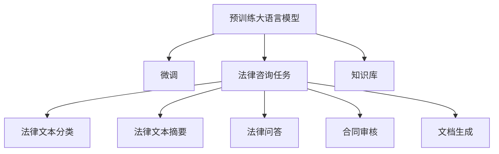

                 

# LLM在法律咨询中的角色：AI法律助手的崛起

> 关键词：人工智能,法律咨询,自然语言处理,预训练大模型,微调,Fine-Tuning

## 1. 背景介绍

### 1.1 问题由来
法律行业一直是人工智能技术应用的早期探索领域之一。从基于规则的知识库到基于统计的决策支持系统，法律领域对计算机技术的依赖日益加深。但传统的法律信息系统往往局限于信息检索和简单规则推理，难以处理复杂多变的法律问题。近年来，随着深度学习技术的快速进步，尤其是预训练大语言模型的崛起，法律咨询领域正迎来一场新的革命。

### 1.2 问题核心关键点
法律咨询的核心在于理解和解释法律文本，回答客户提出的各类法律问题。传统方法主要依赖专家知识库和规则系统，难以应对语义复杂、变化多端的法律条文。预训练大语言模型，如GPT系列、BERT等，通过大规模无标签文本的预训练，学习到丰富的语言表示，具备强大的语义理解和生成能力。在此基础上，通过微调等技术手段，可以构建强大的AI法律助手，提供快速、准确的法律咨询服务。

### 1.3 问题研究意义
构建AI法律助手，对于提升法律咨询的效率、降低咨询成本、保障法律服务的公正性具有重要意义：

1. **提升效率**：AI法律助手可以7x24小时不间断服务，减少人工工作量，提高响应速度。
2. **降低成本**：与传统法律顾问的高昂咨询费用相比，AI法律助手可以大幅降低咨询门槛。
3. **保障公正**：AI法律助手可以避免人为偏见，提供客观、一致的咨询建议，减少司法过程中的不确定性。
4. **优化资源**：AI法律助手可以处理大量重复性咨询，释放律师的时间和精力，专注于复杂案件处理。

本文将系统介绍如何利用预训练大语言模型构建AI法律助手，并分析其在法律咨询中的应用前景。

## 2. 核心概念与联系

### 2.1 核心概念概述

为更好地理解如何构建AI法律助手，本节将介绍几个关键概念及其相互关系：

- 预训练大语言模型(LLM)：通过大规模无标签文本的预训练，学习到丰富的语言表示，具备强大的语义理解和生成能力。
- 微调(Fine-Tuning)：在预训练模型的基础上，使用有标签的法律咨询数据，通过有监督学习优化模型在特定法律咨询任务上的性能。
- 法律咨询任务：包括法律文本分类、法律文本摘要、法律问答、合同审核等。
- 知识库：包含法律条文、案例、注释、专家意见等，用于提供参考依据。
- 文档生成：利用预训练模型生成法律文档，如起诉状、答辩状、协议书等。

这些核心概念之间的逻辑关系可以通过以下Mermaid流程图来展示：



这个流程图展示了预训练大语言模型如何通过微调技术转化为AI法律助手，并应用于不同类型的法律咨询任务。

## 3. 核心算法原理 & 具体操作步骤
### 3.1 算法原理概述

构建AI法律助手的过程主要包括以下几个步骤：

1. **预训练大模型选择**：选择如GPT-3、BERT等预训练大模型作为初始化参数。
2. **任务适配层设计**：针对具体法律咨询任务，设计相应的任务适配层，如分类头、摘要模型、问答模型等。
3. **数据集准备**：收集法律领域的标注数据，划分为训练集、验证集和测试集。
4. **微调模型训练**：在预训练模型的基础上，使用微调算法优化模型在特定法律咨询任务上的性能。
5. **测试和部署**：在测试集上评估模型性能，将微调后的模型部署到生产环境，供实际应用使用。

### 3.2 算法步骤详解

**Step 1: 预训练大模型选择**

预训练大模型是构建AI法律助手的核心组件。当前最为流行的预训练大模型包括：

- GPT系列：如GPT-3、GPT-J等，具备强大的自然语言理解和生成能力。
- BERT系列：如BERT-base、RoBERTa等，擅长处理文本分类、实体识别等任务。
- T5系列：如T5-large、mT5等，适用于多种NLP任务，包括问答、摘要、生成等。

在选择预训练模型时，需要考虑其预训练任务类型、模型规模、推理速度等因素。对于法律咨询任务，一般选择经过法律领域预训练的模型，如LegalBERT、LawFair等，以确保模型的适用性。

**Step 2: 任务适配层设计**

任务适配层是将预训练大模型转化为特定法律咨询任务的接口。具体设计如下：

- **文本分类**：在预训练模型的顶部添加分类头，使用交叉熵损失函数，训练模型将法律文本分类为不同类型。
- **文本摘要**：利用预训练模型作为编码器，设计解码器生成法律文本的摘要。
- **法律问答**：在预训练模型的顶部添加分类头和解码器，使用注意力机制匹配问题与答案。
- **合同审核**：利用预训练模型作为特征提取器，设计分类器判断合同的合规性。
- **文档生成**：在预训练模型的顶部添加解码器，生成起诉状、答辩状、协议书等法律文档。

**Step 3: 数据集准备**

数据集是微调模型的基础，具体分为以下几个步骤：

- **数据收集**：收集法律领域的标注数据，如法律条文、案例、协议等。
- **数据清洗**：清洗数据，去除无关内容、格式不一致等问题。
- **数据划分**：将数据划分为训练集、验证集和测试集，一般比例为7:1:1。
- **数据增强**：使用同义词替换、数据回译等方法增强数据多样性，减少过拟合。

**Step 4: 微调模型训练**

微调模型的步骤如下：

1. **初始化模型**：使用预训练模型和任务适配层进行初始化。
2. **设置超参数**：选择合适的学习率、优化器、批大小等超参数。
3. **训练模型**：使用训练集数据进行梯度下降，优化模型参数。
4. **验证模型**：在验证集上评估模型性能，调整超参数。
5. **测试模型**：在测试集上最终评估模型性能，决定是否停止训练。

**Step 5: 测试和部署**

模型训练完成后，需要在测试集上评估其性能，并部署到实际应用环境中：

1. **模型评估**：使用测试集数据，评估模型的准确率、召回率等指标。
2. **模型优化**：根据测试结果调整模型参数，进行额外训练。
3. **部署模型**：将优化后的模型部署到生产环境，如云平台、本地服务器等。
4. **持续优化**：定期收集新数据，重新微调模型，保持模型的时效性和准确性。

### 3.3 算法优缺点

构建AI法律助手的微调方法具有以下优点：

- **高效**：仅需少量标注数据，即可显著提升模型性能，降低开发成本。
- **灵活**：模型结构可灵活调整，适用于多种法律咨询任务。
- **可解释性**：部分任务适配层不涉及额外神经网络，有助于理解模型的决策过程。

同时，该方法也存在一些缺点：

- **数据依赖**：依赖标注数据的质量和数量，无法应对少量标注数据的任务。
- **泛化能力**：在法律领域外，模型性能可能下降，需要更多领域数据进行预训练。
- **复杂性**：任务适配层的复杂设计增加了模型的可维护性风险。
- **伦理问题**：模型可能继承预训练模型的偏见，输出错误的信息。

### 3.4 算法应用领域

AI法律助手在多个法律咨询任务上已展现出其强大的应用能力：

- **法律文本分类**：自动将法律文本分类为合同、协议、判决书等类型。
- **法律文本摘要**：自动生成法律文本的简洁摘要，节省阅读时间。
- **法律问答系统**：自动回答用户的法律问题，提供快速咨询服务。
- **合同审核**：自动审核合同的合规性，识别风险条款。
- **法律文档生成**：自动生成起诉状、答辩状、协议书等法律文档。

## 4. 数学模型和公式 & 详细讲解 & 举例说明

### 4.1 数学模型构建

我们以法律文本分类为例，介绍如何使用微调方法构建AI法律助手。

设预训练模型为 $M_{\theta}$，任务为将法律文本分类为 $C$ 个类别。假设训练集为 $D=\{(x_i,y_i)\}_{i=1}^N$，其中 $x_i$ 为文本，$y_i$ 为对应的类别标签。

定义交叉熵损失函数为：

$$
\ell(M_{\theta}(x_i),y_i) = -y_i\log M_{\theta}(x_i) - (1-y_i)\log(1-M_{\theta}(x_i))
$$

则在数据集 $D$ 上的经验风险为：

$$
\mathcal{L}(\theta) = \frac{1}{N}\sum_{i=1}^N \ell(M_{\theta}(x_i),y_i)
$$

微调的目标是最小化经验风险，即找到最优参数：

$$
\theta^* = \mathop{\arg\min}_{\theta} \mathcal{L}(\theta)
$$

在实践中，我们通常使用基于梯度的优化算法（如AdamW、SGD等）来近似求解上述最优化问题。设 $\eta$ 为学习率，$\lambda$ 为正则化系数，则参数的更新公式为：

$$
\theta \leftarrow \theta - \eta \nabla_{\theta}\mathcal{L}(\theta) - \eta\lambda\theta
$$

其中 $\nabla_{\theta}\mathcal{L}(\theta)$ 为损失函数对参数 $\theta$ 的梯度，可通过反向传播算法高效计算。

### 4.2 公式推导过程

以下我们以法律文本分类为例，推导交叉熵损失函数及其梯度的计算公式。

假设模型 $M_{\theta}$ 在输入 $x$ 上的输出为 $\hat{y}=M_{\theta}(x) \in [0,1]$，表示样本属于第 $k$ 类的概率。真实标签 $y \in \{1,2,\cdots,C\}$。则二分类交叉熵损失函数定义为：

$$
\ell(M_{\theta}(x),y) = -y_i\log M_{\theta}(x_i) - (1-y_i)\log(1-M_{\theta}(x_i))
$$

将其代入经验风险公式，得：

$$
\mathcal{L}(\theta) = -\frac{1}{N}\sum_{i=1}^N [y_i\log M_{\theta}(x_i)+(1-y_i)\log(1-M_{\theta}(x_i))]
$$

根据链式法则，损失函数对参数 $\theta_k$ 的梯度为：

$$
\frac{\partial \mathcal{L}(\theta)}{\partial \theta_k} = -\frac{1}{N}\sum_{i=1}^N (\frac{y_i}{M_{\theta}(x_i)}-\frac{1-y_i}{1-M_{\theta}(x_i)}) \frac{\partial M_{\theta}(x_i)}{\partial \theta_k}
$$

其中 $\frac{\partial M_{\theta}(x_i)}{\partial \theta_k}$ 可进一步递归展开，利用自动微分技术完成计算。

在得到损失函数的梯度后，即可带入参数更新公式，完成模型的迭代优化。重复上述过程直至收敛，最终得到适应法律文本分类的最优模型参数 $\theta^*$。

## 5. 项目实践：代码实例和详细解释说明

### 5.1 开发环境搭建

在进行法律文本分类微调实践前，我们需要准备好开发环境。以下是使用Python进行PyTorch开发的环境配置流程：

1. 安装Anaconda：从官网下载并安装Anaconda，用于创建独立的Python环境。

2. 创建并激活虚拟环境：
```bash
conda create -n pytorch-env python=3.8 
conda activate pytorch-env
```

3. 安装PyTorch：根据CUDA版本，从官网获取对应的安装命令。例如：
```bash
conda install pytorch torchvision torchaudio cudatoolkit=11.1 -c pytorch -c conda-forge
```

4. 安装Transformers库：
```bash
pip install transformers
```

5. 安装各类工具包：
```bash
pip install numpy pandas scikit-learn matplotlib tqdm jupyter notebook ipython
```

完成上述步骤后，即可在`pytorch-env`环境中开始微调实践。

### 5.2 源代码详细实现

这里我们以法律文本分类任务为例，给出使用Transformers库对BERT模型进行微调的PyTorch代码实现。

首先，定义法律文本分类任务的数据处理函数：

```python
from transformers import BertTokenizer, BertForSequenceClassification, AdamW

tokenizer = BertTokenizer.from_pretrained('bert-base-cased')

def preprocess(text):
    return tokenizer.encode_plus(text, add_special_tokens=True, max_length=128, padding='max_length', return_tensors='pt')
    
# 准备标注数据集
train_data = [("这是一份合同", 0), ("这是一个协议书", 1), ...]
dev_data = [("这是一份判决书", 2), ...]
test_data = [("这是一份合同", 0), ...]

# 构建数据集
from torch.utils.data import Dataset, DataLoader
class LegalDataset(Dataset):
    def __init__(self, texts, labels):
        self.texts = texts
        self.labels = labels
        self.tokenizer = tokenizer
        
    def __len__(self):
        return len(self.texts)
    
    def __getitem__(self, item):
        text, label = self.texts[item], self.labels[item]
        return self.tokenizer(text, padding='max_length', return_tensors='pt', max_length=128)

# 划分数据集
train_dataset = LegalDataset(train_data, train_labels)
dev_dataset = LegalDataset(dev_data, dev_labels)
test_dataset = LegalDataset(test_data, test_labels)

# 模型和优化器
model = BertForSequenceClassification.from_pretrained('bert-base-cased', num_labels=3)
optimizer = AdamW(model.parameters(), lr=2e-5)

# 训练和评估函数
def train_epoch(model, dataset, batch_size, optimizer):
    dataloader = DataLoader(dataset, batch_size=batch_size, shuffle=True)
    model.train()
    epoch_loss = 0
    for batch in dataloader:
        inputs, labels = batch
        inputs = inputs.to(device)
        labels = labels.to(device)
        model.zero_grad()
        outputs = model(inputs, labels=labels)
        loss = outputs.loss
        epoch_loss += loss.item()
        loss.backward()
        optimizer.step()
    return epoch_loss / len(dataloader)

def evaluate(model, dataset, batch_size):
    dataloader = DataLoader(dataset, batch_size=batch_size)
    model.eval()
    preds, labels = [], []
    with torch.no_grad():
        for batch in dataloader:
            inputs, labels = batch
            inputs = inputs.to(device)
            labels = labels.to(device)
            outputs = model(inputs)
            logits = outputs.logits
            probs = torch.softmax(logits, dim=1)
            preds.append(probs.argmax(dim=1))
            labels.append(labels)
    print(classification_report(labels, preds))

# 训练过程
device = torch.device('cuda') if torch.cuda.is_available() else torch.device('cpu')
model.to(device)

epochs = 5
batch_size = 16

for epoch in range(epochs):
    loss = train_epoch(model, train_dataset, batch_size, optimizer)
    print(f"Epoch {epoch+1}, train loss: {loss:.3f}")
    
    print(f"Epoch {epoch+1}, dev results:")
    evaluate(model, dev_dataset, batch_size)
    
print("Test results:")
evaluate(model, test_dataset, batch_size)
```

### 5.3 代码解读与分析

让我们再详细解读一下关键代码的实现细节：

**LegalDataset类**：
- `__init__`方法：初始化文本、标签、分词器等关键组件。
- `__len__`方法：返回数据集的样本数量。
- `__getitem__`方法：对单个样本进行处理，将文本输入编码为token ids，返回模型所需的输入。

**预训练大模型**：
- 使用BertTokenizer从预训练模型中加载分词器。
- 定义预处理函数 `preprocess`，将文本转换为token ids，并填充到固定长度。
- 准备训练集、验证集和测试集，创建Dataset对象。

**模型和优化器**：
- 使用BertForSequenceClassification加载预训练模型，并设置分类标签数。
- 创建AdamW优化器，设置学习率。

**训练和评估函数**：
- 使用PyTorch的DataLoader对数据集进行批次化加载，供模型训练和推理使用。
- 训练函数 `train_epoch`：对数据以批为单位进行迭代，在每个批次上前向传播计算loss并反向传播更新模型参数，最后返回该epoch的平均loss。
- 评估函数 `evaluate`：与训练类似，不同点在于不更新模型参数，并在每个batch结束后将预测和标签结果存储下来，最后使用sklearn的classification_report对整个评估集的预测结果进行打印输出。

**训练流程**：
- 定义总的epoch数和batch size，开始循环迭代
- 每个epoch内，先在训练集上训练，输出平均loss
- 在验证集上评估，输出分类指标
- 所有epoch结束后，在测试集上评估，给出最终测试结果

可以看到，PyTorch配合Transformers库使得BERT微调的代码实现变得简洁高效。开发者可以将更多精力放在数据处理、模型改进等高层逻辑上，而不必过多关注底层的实现细节。

当然，工业级的系统实现还需考虑更多因素，如模型的保存和部署、超参数的自动搜索、更灵活的任务适配层等。但核心的微调范式基本与此类似。

## 6. 实际应用场景

### 6.1 智能法律咨询系统

智能法律咨询系统是大语言模型在法律咨询领域的主要应用场景。该系统能够提供7x24小时不间断的法律咨询服务，覆盖各类法律问题和场景，如合同审核、案件查询、法律文书生成等。

具体实现流程如下：

1. **需求收集**：收集不同法律领域的咨询需求，如合同、侵权、婚姻等。
2. **数据标注**：标注大量法律案例，为模型微调提供数据基础。
3. **模型训练**：使用预训练大模型进行微调，构建法律问答系统。
4. **系统集成**：将微调后的模型集成到智能咨询系统中，如网站、移动应用等。
5. **用户交互**：用户通过系统提出法律问题，系统自动回答并生成相关文档。

智能法律咨询系统可以大大提高法律服务的效率和可及性，尤其是在司法资源紧张的地区，能够为普通民众提供及时、准确的法律咨询。

### 6.2 智能合同审核系统

智能合同审核系统是大语言模型在合同领域的重要应用。该系统能够自动审核合同文本的合规性，识别合同中的关键条款和风险点，为律师和企业提供初步审核意见。

具体实现流程如下：

1. **数据收集**：收集各类合同文本，如劳动合同、租赁合同、买卖合同等。
2. **数据标注**：标注合同文本的合规性和风险点，为模型微调提供数据基础。
3. **模型训练**：使用预训练大模型进行微调，构建合同审核系统。
4. **系统集成**：将微调后的模型集成到智能审核系统中，供企业内部使用。
5. **用户交互**：用户上传合同文本，系统自动审核并生成审核报告。

智能合同审核系统能够帮助企业快速识别合同风险，提升合同管理的效率和质量，降低法律风险。

### 6.3 法律文本生成系统

法律文本生成系统是大语言模型在法律文档生成领域的应用。该系统能够自动生成起诉状、答辩状、协议书等法律文档，减轻律师的文书撰写工作量，提高文档生成速度。

具体实现流程如下：

1. **需求收集**：收集各类法律文书的生成需求，如起诉状、答辩状、协议书等。
2. **数据收集**：收集大量的法律文书样本，如法院判决书、律师答辩状等。
3. **数据标注**：标注法律文书的内容和结构，为模型微调提供数据基础。
4. **模型训练**：使用预训练大模型进行微调，构建法律文本生成系统。
5. **系统集成**：将微调后的模型集成到智能文书系统中，供律师使用。
6. **用户交互**：用户输入法律事实和请求，系统自动生成相应的法律文书。

法律文本生成系统能够提高文书撰写的效率和质量，减轻律师的工作负担，同时也能提高文书的一致性和规范性。

### 6.4 未来应用展望

随着大语言模型微调技术的不断发展，法律咨询领域将迎来更多创新应用。

1. **智能法律援助**：在司法资源匮乏的地区，通过AI法律助手提供基本的法律咨询，为公众提供便捷、公平的法律服务。
2. **智能合同管理**：结合智能合同审核系统，提供自动化的合同生成、审核、管理等服务，提升企业合同管理的智能化水平。
3. **智能法律研究**：利用AI法律助手进行法律文本分类、摘要、问答等，为法律研究人员提供数据支持，加速法律知识发现和知识图谱构建。
4. **智能法律培训**：使用AI法律助手进行法律知识的普及和培训，提升公众的法律素养和意识。

这些应用场景将进一步拓展大语言模型在法律咨询领域的潜力，为构建公平、高效、智能的法律服务体系提供有力支撑。

## 7. 工具和资源推荐
### 7.1 学习资源推荐

为了帮助开发者系统掌握大语言模型微调的理论基础和实践技巧，这里推荐一些优质的学习资源：

1. 《Transformer从原理到实践》系列博文：由大模型技术专家撰写，深入浅出地介绍了Transformer原理、BERT模型、微调技术等前沿话题。

2. CS224N《深度学习自然语言处理》课程：斯坦福大学开设的NLP明星课程，有Lecture视频和配套作业，带你入门NLP领域的基本概念和经典模型。

3. 《Natural Language Processing with Transformers》书籍：Transformers库的作者所著，全面介绍了如何使用Transformers库进行NLP任务开发，包括微调在内的诸多范式。

4. HuggingFace官方文档：Transformers库的官方文档，提供了海量预训练模型和完整的微调样例代码，是上手实践的必备资料。

5. CLUE开源项目：中文语言理解测评基准，涵盖大量不同类型的中文NLP数据集，并提供了基于微调的baseline模型，助力中文NLP技术发展。

通过对这些资源的学习实践，相信你一定能够快速掌握大语言模型微调的精髓，并用于解决实际的NLP问题。
### 7.2 开发工具推荐

高效的开发离不开优秀的工具支持。以下是几款用于大语言模型微调开发的常用工具：

1. PyTorch：基于Python的开源深度学习框架，灵活动态的计算图，适合快速迭代研究。大部分预训练语言模型都有PyTorch版本的实现。

2. TensorFlow：由Google主导开发的开源深度学习框架，生产部署方便，适合大规模工程应用。同样有丰富的预训练语言模型资源。

3. Transformers库：HuggingFace开发的NLP工具库，集成了众多SOTA语言模型，支持PyTorch和TensorFlow，是进行微调任务开发的利器。

4. Weights & Biases：模型训练的实验跟踪工具，可以记录和可视化模型训练过程中的各项指标，方便对比和调优。与主流深度学习框架无缝集成。

5. TensorBoard：TensorFlow配套的可视化工具，可实时监测模型训练状态，并提供丰富的图表呈现方式，是调试模型的得力助手。

6. Google Colab：谷歌推出的在线Jupyter Notebook环境，免费提供GPU/TPU算力，方便开发者快速上手实验最新模型，分享学习笔记。

合理利用这些工具，可以显著提升大语言模型微调任务的开发效率，加快创新迭代的步伐。

### 7.3 相关论文推荐

大语言模型和微调技术的发展源于学界的持续研究。以下是几篇奠基性的相关论文，推荐阅读：

1. Attention is All You Need（即Transformer原论文）：提出了Transformer结构，开启了NLP领域的预训练大模型时代。

2. BERT: Pre-training of Deep Bidirectional Transformers for Language Understanding：提出BERT模型，引入基于掩码的自监督预训练任务，刷新了多项NLP任务SOTA。

3. Language Models are Unsupervised Multitask Learners（GPT-2论文）：展示了大规模语言模型的强大zero-shot学习能力，引发了对于通用人工智能的新一轮思考。

4. Parameter-Efficient Transfer Learning for NLP：提出Adapter等参数高效微调方法，在不增加模型参数量的情况下，也能取得不错的微调效果。

5. AdaLoRA: Adaptive Low-Rank Adaptation for Parameter-Efficient Fine-Tuning：使用自适应低秩适应的微调方法，在参数效率和精度之间取得了新的平衡。

这些论文代表了大语言模型微调技术的发展脉络。通过学习这些前沿成果，可以帮助研究者把握学科前进方向，激发更多的创新灵感。

## 8. 总结：未来发展趋势与挑战

### 8.1 总结

本文对基于预训练大语言模型构建AI法律助手进行了全面系统的介绍。首先阐述了法律咨询领域对AI技术的需求，明确了大语言模型微调在提升法律咨询效率、降低成本、保障公正等方面的独特价值。其次，从原理到实践，详细讲解了如何使用微调方法构建AI法律助手，并分析其在法律咨询中的应用前景。

通过本文的系统梳理，可以看到，大语言模型微调技术正在成为法律咨询领域的重要范式，极大地拓展了预训练语言模型的应用边界，催生了更多的落地场景。受益于大规模语料的预训练，微调模型以更低的时间和标注成本，在小样本条件下也能取得不俗的效果，有力推动了法律咨询技术的产业化进程。未来，伴随预训练语言模型和微调方法的持续演进，相信法律咨询技术必将在更广阔的应用领域大放异彩，深刻影响人类的生产生活方式。

### 8.2 未来发展趋势

展望未来，大语言模型微调技术将呈现以下几个发展趋势：

1. **法律知识整合**：将法律领域的专家知识和规则系统，与大语言模型进行深度融合，构建知识图谱和专家系统，提升模型的法律知识和推理能力。
2. **多模态融合**：结合法律文本、图像、视频等多模态数据，构建跨模态的法律咨询系统，提升模型的感知和理解能力。
3. **深度推理**：引入因果推断和逻辑推理机制，使模型能够进行复杂的法律推理和论证，提高系统的决策准确性。
4. **个性化服务**：根据用户的背景和需求，动态调整模型的输出策略，提供个性化的法律咨询和建议。
5. **持续学习**：定期收集新的法律数据，更新微调模型，确保模型与时俱进，适应法律领域的不断变化。

这些趋势凸显了大语言模型微调技术在法律咨询领域的应用潜力，预示着未来法律服务将更加智能、高效、个性化。

### 8.3 面临的挑战

尽管大语言模型微调技术已经取得了瞩目成就，但在迈向更加智能化、普适化应用的过程中，它仍面临着诸多挑战：

1. **数据隐私和安全**：法律咨询涉及大量敏感信息，如何保护用户隐私和数据安全，是一个重要的问题。
2. **伦理和合规性**：AI法律助手输出的法律建议是否符合伦理和法律要求，需要进行严格的审查和规范。
3. **可解释性和透明性**：模型的决策过程需要具备可解释性，确保用户的理解和信任。
4. **模型鲁棒性**：如何在法律领域外，模型仍能保持较高的泛化能力，是一个挑战。
5. **模型复杂度**：如何构建高效、易维护的法律咨询系统，需要优化模型结构和训练过程。

### 8.4 研究展望

面对大语言模型微调面临的这些挑战，未来的研究需要在以下几个方面寻求新的突破：

1. **数据隐私保护**：开发隐私保护技术，确保数据匿名化和安全传输，保护用户隐私。
2. **伦理和合规性审查**：建立AI法律助手的伦理审查机制，确保其输出符合伦理和法律要求。
3. **可解释性增强**：引入可解释性技术，如注意力机制、局部激活图等，增强模型的决策过程的可解释性。
4. **鲁棒性提升**：通过多任务学习、对抗训练等方法，提升模型在不同场景下的鲁棒性。
5. **模型简化**：采用模型剪枝、知识蒸馏等技术，简化模型结构，降低计算资源消耗。

这些研究方向的探索，必将引领大语言模型微调技术迈向更高的台阶，为构建智能、公平、安全的法律服务体系提供有力支撑。

## 9. 附录：常见问题与解答

**Q1：大语言模型微调是否适用于所有法律咨询任务？**

A: 大语言模型微调在大多数法律咨询任务上都能取得不错的效果，特别是对于数据量较小的任务。但对于一些特定领域的任务，如医学、法律等，仅仅依靠通用语料预训练的模型可能难以很好地适应。此时需要在特定领域语料上进一步预训练，再进行微调，才能获得理想效果。此外，对于一些需要时效性、个性化很强的任务，如对话、推荐等，微调方法也需要针对性的改进优化。

**Q2：微调过程中如何选择合适的学习率？**

A: 微调的学习率一般要比预训练时小1-2个数量级，如果使用过大的学习率，容易破坏预训练权重，导致过拟合。一般建议从1e-5开始调参，逐步减小学习率，直至收敛。也可以使用warmup策略，在开始阶段使用较小的学习率，再逐渐过渡到预设值。需要注意的是，不同的优化器(如AdamW、Adafactor等)以及不同的学习率调度策略，可能需要设置不同的学习率阈值。

**Q3：采用大模型微调时会面临哪些资源瓶颈？**

A: 目前主流的预训练大模型动辄以亿计的参数规模，对算力、内存、存储都提出了很高的要求。GPU/TPU等高性能设备是必不可少的，但即便如此，超大批次的训练和推理也可能遇到显存不足的问题。因此需要采用一些资源优化技术，如梯度积累、混合精度训练、模型并行等，来突破硬件瓶颈。同时，模型的存储和读取也可能占用大量时间和空间，需要采用模型压缩、稀疏化存储等方法进行优化。

**Q4：如何缓解微调过程中的过拟合问题？**

A: 过拟合是微调面临的主要挑战，尤其是在标注数据不足的情况下。常见的缓解策略包括：
1. 数据增强：通过回译、近义替换等方式扩充训练集
2. 正则化：使用L2正则、Dropout、Early Stopping等避免过拟合
3. 对抗训练：引入对抗样本，提高模型鲁棒性
4. 参数高效微调：只调整少量参数(如Adapter、Prefix等)，减小过拟合风险
5. 多模型集成：训练多个微调模型，取平均输出，抑制过拟合

这些策略往往需要根据具体任务和数据特点进行灵活组合。只有在数据、模型、训练、推理等各环节进行全面优化，才能最大限度地发挥大模型微调的威力。

**Q5：如何构建高效的智能法律咨询系统？**

A: 构建高效的智能法律咨询系统，需要考虑以下几个关键点：

1. **数据收集**：收集大量的法律咨询案例和文本数据，覆盖各类法律领域。
2. **数据预处理**：清洗和标注数据，去除无关内容，标注法律类型、条款、风险点等。
3. **模型选择**：选择预训练大模型，并进行微调。
4. **任务适配层设计**：根据具体法律咨询任务，设计相应的任务适配层，如分类头、摘要模型、问答模型等。
5. **系统集成**：将微调后的模型集成到智能咨询系统中，提供用户交互接口。
6. **用户反馈**：收集用户反馈，持续优化模型和系统性能。

通过以上步骤，可以构建高效、智能、普适的智能法律咨询系统，为公众提供快速、准确的法律服务。

---

作者：禅与计算机程序设计艺术 / Zen and the Art of Computer Programming

