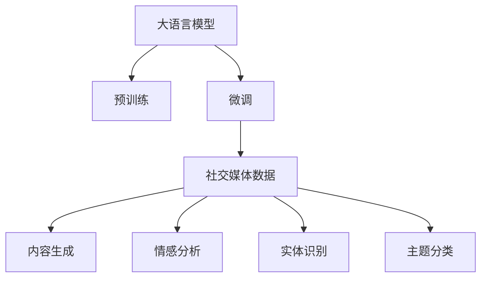

                 

# LLM在社交媒体中的应用：内容生成与分析

> 关键词：社交媒体,内容生成,自然语言处理(NLP),深度学习,语言模型,情感分析

## 1. 背景介绍

### 1.1 问题由来
社交媒体作为信息传播的重要平台，正在改变着人们的沟通方式。从微博、微信、抖音，到国际上的Twitter、Facebook等，全球范围内每天都有大量的文本内容被生产、传播和分析。这些文本数据蕴含了丰富的社会信息，可应用于舆情监测、情感分析、热点追踪等诸多领域。然而，大规模文本数据的处理和分析任务，传统的NLP方法难以胜任。

近年来，深度学习技术在NLP领域取得了巨大突破，特别是基于预训练语言模型(Pretrained Language Models, PLMs)的方法。预训练语言模型，如GPT、BERT、RoBERTa等，通过在海量无标签文本数据上进行预训练，学习到丰富的语言知识和语义信息，具备强大的文本生成和分析能力。将这些大模型应用于社交媒体文本数据的处理，已成为当前热门研究方向。

### 1.2 问题核心关键点
大语言模型(LLM)在社交媒体中的应用主要集中在内容生成与分析两个方面。内容生成主要包括自动摘要、文本生成、对话系统等任务，而分析任务则涵盖情感分析、实体识别、主题分类等。这些任务的共同特点是：输入文本数据具有大量噪声、缺乏规范格式，且标注数据往往稀疏、不均衡。因此，如何高效利用大语言模型，在社交媒体文本数据上完成高质量的生成与分析，成为当前的重要研究方向。

## 2. 核心概念与联系

### 2.1 核心概念概述

为更好地理解大语言模型在社交媒体中的应用，本节将介绍几个密切相关的核心概念：

- 大语言模型(LLM)：以自回归模型(如GPT)或自编码模型(如BERT)为代表的大规模预训练语言模型。通过在大规模无标签文本语料上进行预训练，学习到丰富的语言知识和语义信息，具备强大的文本生成和分析能力。

- 预训练(Pre-training)：指在大规模无标签文本语料上，通过自监督学习任务训练通用语言模型的过程。常见的预训练任务包括掩码语言模型、单词预测、句子相似度等。预训练使得模型学习到语言的通用表示。

- 微调(Fine-tuning)：指在预训练模型的基础上，使用下游任务的少量标注数据，通过有监督学习优化模型在特定任务上的性能。通常只需要调整顶层分类器或解码器，并以较小的学习率更新全部或部分的模型参数。

- 社交媒体(Social Media)：指以用户生成内容(UGC)为核心的信息传播平台，包括微博、微信、抖音等。社交媒体文本数据具有噪声多、格式不规范、标注数据稀疏等特点。

- 内容生成(Content Generation)：指使用大语言模型生成新的文本内容，如自动摘要、文本生成、对话系统等。这些生成任务在社交媒体上具有广泛的应用前景，如自动生成新闻、博文、回复等。

- 情感分析(Sentiment Analysis)：指使用大语言模型分析文本中的情感倾向，判断文本的情感极性，如正面、负面或中性。情感分析是社交媒体舆情监测的重要组成部分。

- 实体识别(Entity Recognition)：指使用大语言模型识别文本中的人名、地名、机构名等特定实体。实体识别在社交媒体中用于抓取关键信息，提升信息抽取的准确性。

- 主题分类(Topic Classification)：指使用大语言模型对文本进行主题归类，如新闻、体育、财经等。主题分类有助于快速获取社交媒体上的热点和趋势信息。

这些核心概念之间的逻辑关系可以通过以下Mermaid流程图来展示：



这个流程图展示了大语言模型在社交媒体文本数据上的应用流程：

1. 大语言模型通过预训练获得基础能力。
2. 在社交媒体文本数据上，使用微调方法进一步优化模型。
3. 微调后的模型可用于文本生成、情感分析、实体识别和主题分类等任务。

## 3. 核心算法原理 & 具体操作步骤
### 3.1 算法原理概述

基于大语言模型在社交媒体中的应用，我们主要关注内容生成和分析两个方面。其中，内容生成主要包括自动摘要、文本生成、对话系统等任务，而分析任务则涵盖情感分析、实体识别、主题分类等。这些任务本质上都是自然语言处理(NLP)问题，可以通过使用预训练语言模型进行微调来解决。

假设预训练语言模型为 $M_{\theta}$，其中 $\theta$ 为预训练得到的模型参数。给定社交媒体任务 $T$ 的标注数据集 $D=\{(x_i, y_i)\}_{i=1}^N$，微调的目标是找到新的模型参数 $\hat{\theta}$，使得：

$$
\hat{\theta}=\mathop{\arg\min}_{\theta} \mathcal{L}(M_{\theta},D)
$$

其中 $\mathcal{L}$ 为针对任务 $T$ 设计的损失函数，用于衡量模型预测输出与真实标签之间的差异。常见的损失函数包括交叉熵损失、均方误差损失等。

通过梯度下降等优化算法，微调过程不断更新模型参数 $\theta$，最小化损失函数 $\mathcal{L}$，使得模型输出逼近真实标签。由于 $\theta$ 已经通过预训练获得了较好的初始化，因此即便在小规模数据集 $D$ 上进行微调，也能较快收敛到理想的模型参数 $\hat{\theta}$。

### 3.2 算法步骤详解

基于大语言模型在社交媒体中的应用，本节将详细介绍内容生成和分析任务的微调步骤。

**内容生成任务：**

1. 收集社交媒体上与任务相关的文本数据 $D=\{(x_i, y_i)\}_{i=1}^N$，其中 $x_i$ 为输入文本，$y_i$ 为目标文本（如自动摘要、回复等）。
2. 使用预训练语言模型 $M_{\theta}$ 作为初始化参数。
3. 设计适合任务的输出层和损失函数。例如，对于自动摘要任务，输出层通常为最后一层的全连接层，损失函数为交叉熵损失。
4. 选择适当的超参数，如学习率、批大小、迭代轮数等，进行梯度训练。
5. 在验证集上评估模型性能，根据性能指标决定是否触发 Early Stopping。
6. 在测试集上测试模型，评估效果。

**分析任务：**

1. 收集社交媒体上与任务相关的文本数据 $D=\{(x_i, y_i)\}_{i=1}^N$，其中 $x_i$ 为输入文本，$y_i$ 为标签（如情感极性、实体类型、主题标签等）。
2. 使用预训练语言模型 $M_{\theta}$ 作为初始化参数。
3. 设计适合任务的输出层和损失函数。例如，对于情感分析任务，输出层为最后一层的全连接层，损失函数为交叉熵损失。
4. 选择适当的超参数，如学习率、批大小、迭代轮数等，进行梯度训练。
5. 在验证集上评估模型性能，根据性能指标决定是否触发 Early Stopping。
6. 在测试集上测试模型，评估效果。

**3.3 算法优缺点**

大语言模型在社交媒体中的应用具有以下优点：

1. 高效性。相比于传统的NLP方法，基于预训练语言模型的微调方法可以大大降低模型训练和调参的成本，提升模型的训练效率。
2. 泛化能力强。预训练语言模型具备强大的泛化能力，能够处理各种类型的社交媒体文本数据，包括短文本、长文本、多模态数据等。
3. 准确度高。预训练语言模型在自然语言处理任务上通常能取得更好的性能，特别是对于大规模标注数据稀缺的任务。

然而，这些方法也存在一些局限性：

1. 依赖标注数据。微调的效果很大程度上取决于标注数据的质量和数量，获取高质量标注数据的成本较高。
2. 过拟合风险。当目标任务与预训练数据的分布差异较大时，微调的性能提升有限，甚至可能出现过拟合现象。
3. 参数需求高。大语言模型的参数量较大，对计算资源和存储资源的需求较高，难以在小规模设备上高效运行。
4. 安全性问题。社交媒体文本数据可能包含敏感信息或有害内容，需要考虑数据隐私和安全性问题。

尽管存在这些局限性，但就目前而言，基于预训练语言模型的微调方法仍是大规模社交媒体文本处理的常用技术。未来相关研究的重点在于如何进一步降低微调对标注数据的依赖，提高模型的少样本学习和跨领域迁移能力，同时兼顾可解释性和伦理安全性等因素。

### 3.4 算法应用领域

基于大语言模型在社交媒体中的应用，主要包括以下几个领域：

- 内容生成：如自动摘要、文本生成、对话系统等。使用大语言模型可以生成高质量的文本内容，提升内容传播的效率和效果。
- 情感分析：分析社交媒体上的用户情感，识别正面、负面或中性的情感倾向，用于舆情监测、品牌评估等。
- 实体识别：识别社交媒体上的实体信息，如人名、地名、机构名等，用于信息抽取、推荐系统等。
- 主题分类：对社交媒体文本进行主题归类，如新闻、体育、财经等，用于热点追踪、内容推荐等。
- 事件监测：监控社交媒体上的热点事件，识别事件的主要参与者、时间、地点等信息，用于实时预警、舆情分析等。
- 多模态分析：将文本、图像、音频等多模态信息进行融合，提升社交媒体文本分析的准确性和全面性。

这些应用场景展示了社交媒体文本数据的多样性和复杂性，也体现了大语言模型在其中的重要地位。通过不断探索和应用，大语言模型必将在社交媒体领域发挥更大的作用。

## 4. 数学模型和公式 & 详细讲解 & 举例说明

### 4.1 数学模型构建

本节将使用数学语言对基于大语言模型在社交媒体上的应用进行严格刻画。

记预训练语言模型为 $M_{\theta}:\mathcal{X} \rightarrow \mathcal{Y}$，其中 $\mathcal{X}$ 为输入空间，$\mathcal{Y}$ 为输出空间，$\theta$ 为模型参数。假设社交媒体任务 $T$ 的训练集为 $D=\{(x_i, y_i)\}_{i=1}^N$，其中 $x_i \in \mathcal{X}$ 为输入文本，$y_i \in \mathcal{Y}$ 为目标文本或标签。

定义模型 $M_{\theta}$ 在输入 $x$ 上的损失函数为 $\ell(M_{\theta}(x),y)$，则在数据集 $D$ 上的经验风险为：

$$
\mathcal{L}(\theta) = \frac{1}{N} \sum_{i=1}^N \ell(M_{\theta}(x_i),y_i)
$$

微调的优化目标是最小化经验风险，即找到最优参数：

$$
\theta^* = \mathop{\arg\min}_{\theta} \mathcal{L}(\theta)
$$

在实践中，我们通常使用基于梯度的优化算法（如SGD、Adam等）来近似求解上述最优化问题。设 $\eta$ 为学习率，$\lambda$ 为正则化系数，则参数的更新公式为：

$$
\theta \leftarrow \theta - \eta \nabla_{\theta}\mathcal{L}(\theta) - \eta\lambda\theta
$$

其中 $\nabla_{\theta}\mathcal{L}(\theta)$ 为损失函数对参数 $\theta$ 的梯度，可通过反向传播算法高效计算。

### 4.2 公式推导过程

以下我们以情感分析任务为例，推导交叉熵损失函数及其梯度的计算公式。

假设模型 $M_{\theta}$ 在输入 $x$ 上的输出为 $\hat{y}=M_{\theta}(x) \in [0,1]$，表示样本属于正面情感的概率。真实标签 $y \in \{0,1\}$。则二分类交叉熵损失函数定义为：

$$
\ell(M_{\theta}(x),y) = -[y\log \hat{y} + (1-y)\log (1-\hat{y})]
$$

将其代入经验风险公式，得：

$$
\mathcal{L}(\theta) = -\frac{1}{N}\sum_{i=1}^N [y_i\log M_{\theta}(x_i)+(1-y_i)\log(1-M_{\theta}(x_i))]
$$

根据链式法则，损失函数对参数 $\theta_k$ 的梯度为：

$$
\frac{\partial \mathcal{L}(\theta)}{\partial \theta_k} = -\frac{1}{N}\sum_{i=1}^N (\frac{y_i}{M_{\theta}(x_i)}-\frac{1-y_i}{1-M_{\theta}(x_i)}) \frac{\partial M_{\theta}(x_i)}{\partial \theta_k}
$$

其中 $\frac{\partial M_{\theta}(x_i)}{\partial \theta_k}$ 可进一步递归展开，利用自动微分技术完成计算。

在得到损失函数的梯度后，即可带入参数更新公式，完成模型的迭代优化。重复上述过程直至收敛，最终得到适应社交媒体任务的最优模型参数 $\theta^*$。

### 4.3 案例分析与讲解

**案例分析：情感分析**

1. 数据准备：收集社交媒体上的文本数据，并进行情感标注。标注数据可以来源于公开的情感分析数据集，如IMDb电影评论数据集，也可以自行标注。

2. 模型构建：使用预训练语言模型，如BERT、GPT-2等，作为初始化参数。根据任务需求，设计输出层和损失函数。

3. 微调训练：将训练集数据分批次输入模型，前向传播计算损失函数。反向传播计算参数梯度，根据设定的优化算法和学习率更新模型参数。周期性在验证集上评估模型性能，根据性能指标决定是否触发 Early Stopping。

4. 模型评估：在测试集上评估微调后的模型性能，对比微调前后的精度提升。使用微调后的模型对新文本进行情感预测，评估模型的泛化能力。

## 5. 项目实践：代码实例和详细解释说明

### 5.1 开发环境搭建

在进行微调实践前，我们需要准备好开发环境。以下是使用Python进行PyTorch开发的环境配置流程：

1. 安装Anaconda：从官网下载并安装Anaconda，用于创建独立的Python环境。

2. 创建并激活虚拟环境：
```bash
conda create -n pytorch-env python=3.8 
conda activate pytorch-env
```

3. 安装PyTorch：根据CUDA版本，从官网获取对应的安装命令。例如：
```bash
conda install pytorch torchvision torchaudio cudatoolkit=11.1 -c pytorch -c conda-forge
```

4. 安装Transformers库：
```bash
pip install transformers
```

5. 安装各类工具包：
```bash
pip install numpy pandas scikit-learn matplotlib tqdm jupyter notebook ipython
```

完成上述步骤后，即可在`pytorch-env`环境中开始微调实践。

### 5.2 源代码详细实现

下面我以情感分析任务为例，给出使用Transformers库对BERT模型进行微调的PyTorch代码实现。

首先，定义情感分析任务的数据处理函数：

```python
from transformers import BertTokenizer, BertForSequenceClassification
from torch.utils.data import Dataset, DataLoader
import torch
from sklearn.metrics import accuracy_score

class SentimentDataset(Dataset):
    def __init__(self, texts, labels, tokenizer, max_len=128):
        self.texts = texts
        self.labels = labels
        self.tokenizer = tokenizer
        self.max_len = max_len
        
    def __len__(self):
        return len(self.texts)
    
    def __getitem__(self, item):
        text = self.texts[item]
        label = self.labels[item]
        
        encoding = self.tokenizer(text, return_tensors='pt', max_length=self.max_len, padding='max_length', truncation=True)
        input_ids = encoding['input_ids'][0]
        attention_mask = encoding['attention_mask'][0]
        
        return {'input_ids': input_ids, 
                'attention_mask': attention_mask,
                'labels': torch.tensor(label, dtype=torch.long)}
```

然后，定义模型和优化器：

```python
from transformers import AdamW

model = BertForSequenceClassification.from_pretrained('bert-base-uncased', num_labels=2)

optimizer = AdamW(model.parameters(), lr=2e-5)
```

接着，定义训练和评估函数：

```python
from tqdm import tqdm
import torch.nn.functional as F

device = torch.device('cuda') if torch.cuda.is_available() else torch.device('cpu')
model.to(device)

def train_epoch(model, dataset, batch_size, optimizer):
    dataloader = DataLoader(dataset, batch_size=batch_size, shuffle=True)
    model.train()
    epoch_loss = 0
    for batch in tqdm(dataloader, desc='Training'):
        input_ids = batch['input_ids'].to(device)
        attention_mask = batch['attention_mask'].to(device)
        labels = batch['labels'].to(device)
        model.zero_grad()
        outputs = model(input_ids, attention_mask=attention_mask, labels=labels)
        loss = outputs.loss
        epoch_loss += loss.item()
        loss.backward()
        optimizer.step()
    return epoch_loss / len(dataloader)

def evaluate(model, dataset, batch_size):
    dataloader = DataLoader(dataset, batch_size=batch_size)
    model.eval()
    preds, labels = [], []
    with torch.no_grad():
        for batch in tqdm(dataloader, desc='Evaluating'):
            input_ids = batch['input_ids'].to(device)
            attention_mask = batch['attention_mask'].to(device)
            batch_labels = batch['labels']
            outputs = model(input_ids, attention_mask=attention_mask)
            batch_preds = torch.sigmoid(outputs.logits).to('cpu').tolist()
            batch_labels = batch_labels.to('cpu').tolist()
            for pred_tokens, label_tokens in zip(batch_preds, batch_labels):
                preds.append(pred_tokens[:len(label_tokens)])
                labels.append(label_tokens)
                
    print(accuracy_score(labels, preds))
```

最后，启动训练流程并在测试集上评估：

```python
epochs = 5
batch_size = 16

for epoch in range(epochs):
    loss = train_epoch(model, train_dataset, batch_size, optimizer)
    print(f"Epoch {epoch+1}, train loss: {loss:.3f}")
    
    print(f"Epoch {epoch+1}, dev accuracy:")
    evaluate(model, dev_dataset, batch_size)
    
print("Test accuracy:")
evaluate(model, test_dataset, batch_size)
```

以上就是使用PyTorch对BERT进行情感分析任务微调的完整代码实现。可以看到，得益于Transformers库的强大封装，我们可以用相对简洁的代码完成BERT模型的加载和微调。

### 5.3 代码解读与分析

让我们再详细解读一下关键代码的实现细节：

**SentimentDataset类**：
- `__init__`方法：初始化文本、标签、分词器等关键组件。
- `__len__`方法：返回数据集的样本数量。
- `__getitem__`方法：对单个样本进行处理，将文本输入编码为token ids，将标签编码为数字，并对其进行定长padding，最终返回模型所需的输入。

**模型和优化器**：
- 使用BertForSequenceClassification类，指定num_labels参数，根据任务需求设计输出层。
- 使用AdamW优化器，设置学习率等超参数。

**训练和评估函数**：
- 使用PyTorch的DataLoader对数据集进行批次化加载，供模型训练和推理使用。
- 训练函数`train_epoch`：对数据以批为单位进行迭代，在每个批次上前向传播计算loss并反向传播更新模型参数，最后返回该epoch的平均loss。
- 评估函数`evaluate`：与训练类似，不同点在于不更新模型参数，并在每个batch结束后将预测和标签结果存储下来，最后使用sklearn的accuracy_score函数评估模型的准确率。

**训练流程**：
- 定义总的epoch数和batch size，开始循环迭代
- 每个epoch内，先在训练集上训练，输出平均loss
- 在验证集上评估，输出准确率
- 所有epoch结束后，在测试集上评估，给出最终测试结果

可以看到，PyTorch配合Transformers库使得BERT微调的代码实现变得简洁高效。开发者可以将更多精力放在数据处理、模型改进等高层逻辑上，而不必过多关注底层的实现细节。

当然，工业级的系统实现还需考虑更多因素，如模型的保存和部署、超参数的自动搜索、更灵活的任务适配层等。但核心的微调范式基本与此类似。

## 6. 实际应用场景
### 6.1 智能客服系统

基于大语言模型在社交媒体上的应用，智能客服系统可以更加智能化地为用户提供服务。传统客服往往需要配备大量人力，高峰期响应缓慢，且一致性和专业性难以保证。而使用微调后的语言模型，可以7x24小时不间断服务，快速响应客户咨询，用自然流畅的语言解答各类常见问题。

在技术实现上，可以收集企业内部的历史客服对话记录，将问题和最佳答复构建成监督数据，在此基础上对预训练对话模型进行微调。微调后的对话模型能够自动理解用户意图，匹配最合适的答案模板进行回复。对于客户提出的新问题，还可以接入检索系统实时搜索相关内容，动态组织生成回答。如此构建的智能客服系统，能大幅提升客户咨询体验和问题解决效率。

### 6.2 社交媒体舆情监测

金融机构需要实时监测市场舆论动向，以便及时应对负面信息传播，规避金融风险。传统的人工监测方式成本高、效率低，难以应对网络时代海量信息爆发的挑战。基于大语言模型在社交媒体上的应用，社交媒体舆情监测系统可以自动抓取、分析和反馈社交媒体上的文本数据，实时监测不同情感倾向的舆情变化，及时预警潜在的市场风险。

具体而言，可以收集社交媒体上的新闻、报道、评论等文本数据，并对其进行情感分析。将微调后的情感分析模型应用到实时抓取的网络文本数据，就能够自动监测不同情感倾向的舆情变化趋势，一旦发现负面信息激增等异常情况，系统便会自动预警，帮助金融机构快速应对潜在风险。

### 6.3 个性化推荐系统

当前的推荐系统往往只依赖用户的历史行为数据进行物品推荐，无法深入理解用户的真实兴趣偏好。基于大语言模型在社交媒体上的应用，个性化推荐系统可以更好地挖掘用户行为背后的语义信息，从而提供更精准、多样的推荐内容。

在实践中，可以收集用户浏览、点击、评论、分享等行为数据，提取和用户交互的物品标题、描述、标签等文本内容。将文本内容作为模型输入，用户的后续行为（如是否点击、购买等）作为监督信号，在此基础上微调预训练语言模型。微调后的模型能够从文本内容中准确把握用户的兴趣点。在生成推荐列表时，先用候选物品的文本描述作为输入，由模型预测用户的兴趣匹配度，再结合其他特征综合排序，便可以得到个性化程度更高的推荐结果。

### 6.4 未来应用展望

随着大语言模型和微调方法的不断发展，基于微调范式将在更多领域得到应用，为传统行业带来变革性影响。

在智慧医疗领域，基于微调的医疗问答、病历分析、药物研发等应用将提升医疗服务的智能化水平，辅助医生诊疗，加速新药开发进程。

在智能教育领域，微调技术可应用于作业批改、学情分析、知识推荐等方面，因材施教，促进教育公平，提高教学质量。

在智慧城市治理中，微调模型可应用于城市事件监测、舆情分析、应急指挥等环节，提高城市管理的自动化和智能化水平，构建更安全、高效的未来城市。

此外，在企业生产、社会治理、文娱传媒等众多领域，基于大语言模型微调的人工智能应用也将不断涌现，为经济社会发展注入新的动力。相信随着技术的日益成熟，微调方法将成为人工智能落地应用的重要范式，推动人工智能技术在垂直行业的规模化落地。

## 7. 工具和资源推荐
### 7.1 学习资源推荐

为了帮助开发者系统掌握大语言模型在社交媒体上的应用，这里推荐一些优质的学习资源：

1. 《自然语言处理综论》：斯坦福大学Coursera课程，系统介绍NLP领域的基本概念和前沿技术，包括预训练语言模型和微调方法。

2. 《深度学习与自然语言处理》：斯坦福大学公开课，详细讲解深度学习在NLP任务上的应用，涵盖文本分类、情感分析、命名实体识别等多个方面。

3. 《Transformers：深度学习中的自监督表示学习》：HuggingFace开源书籍，全面介绍Transformers库及其在大规模预训练和微调中的应用。

4. 《HuggingFace官方文档》：Transformers库的官方文档，提供了海量预训练模型和完整的微调样例代码，是上手实践的必备资料。

5. 《HuggingFace官方博客》：HuggingFace社区的官方博客，包含大量实际应用案例和技术分享，适合学习者参考。

通过对这些资源的学习实践，相信你一定能够快速掌握大语言模型在社交媒体上的应用方法，并用于解决实际的NLP问题。
### 7.2 开发工具推荐

高效的开发离不开优秀的工具支持。以下是几款用于大语言模型在社交媒体上应用的常用工具：

1. PyTorch：基于Python的开源深度学习框架，灵活动态的计算图，适合快速迭代研究。大部分预训练语言模型都有PyTorch版本的实现。

2. TensorFlow：由Google主导开发的开源深度学习框架，生产部署方便，适合大规模工程应用。同样有丰富的预训练语言模型资源。

3. Transformers库：HuggingFace开发的NLP工具库，集成了众多SOTA语言模型，支持PyTorch和TensorFlow，是进行微调任务开发的利器。

4. Weights & Biases：模型训练的实验跟踪工具，可以记录和可视化模型训练过程中的各项指标，方便对比和调优。与主流深度学习框架无缝集成。

5. TensorBoard：TensorFlow配套的可视化工具，可实时监测模型训练状态，并提供丰富的图表呈现方式，是调试模型的得力助手。

6. Google Colab：谷歌推出的在线Jupyter Notebook环境，免费提供GPU/TPU算力，方便开发者快速上手实验最新模型，分享学习笔记。

合理利用这些工具，可以显著提升大语言模型在社交媒体上应用的开发效率，加快创新迭代的步伐。

### 7.3 相关论文推荐

大语言模型在社交媒体上的应用源于学界的持续研究。以下是几篇奠基性的相关论文，推荐阅读：

1. Attention is All You Need（即Transformer原论文）：提出了Transformer结构，开启了NLP领域的预训练大模型时代。

2. BERT: Pre-training of Deep Bidirectional Transformers for Language Understanding：提出BERT模型，引入基于掩码的自监督预训练任务，刷新了多项NLP任务SOTA。

3. Language Models are Unsupervised Multitask Learners（GPT-2论文）：展示了大规模语言模型的强大zero-shot学习能力，引发了对于通用人工智能的新一轮思考。

4. Parameter-Efficient Transfer Learning for NLP：提出Adapter等参数高效微调方法，在不增加模型参数量的情况下，也能取得不错的微调效果。

5. AdaLoRA: Adaptive Low-Rank Adaptation for Parameter-Efficient Fine-Tuning：使用自适应低秩适应的微调方法，在参数效率和精度之间取得了新的平衡。

这些论文代表了大语言模型在社交媒体上的应用的发展脉络。通过学习这些前沿成果，可以帮助研究者把握学科前进方向，激发更多的创新灵感。

## 8. 总结：未来发展趋势与挑战

### 8.1 总结

本文对基于大语言模型在社交媒体上的应用进行了全面系统的介绍。首先阐述了大语言模型和微调技术的研究背景和意义，明确了微调在拓展预训练模型应用、提升社交媒体文本处理性能方面的独特价值。其次，从原理到实践，详细讲解了内容生成和分析任务的微调步骤，给出了微调任务开发的完整代码实例。同时，本文还广泛探讨了大语言模型在社交媒体上的应用前景，展示了微调范式的巨大潜力。

通过本文的系统梳理，可以看到，基于大语言模型的微调方法正在成为社交媒体文本处理的常用技术，极大地拓展了预训练语言模型的应用边界，催生了更多的落地场景。得益于大规模语料的预训练，微调模型以更低的时间和标注成本，在小样本条件下也能取得理想的效果，有力推动了NLP技术的产业化进程。未来，伴随预训练语言模型和微调方法的持续演进，相信NLP技术将在更广阔的应用领域大放异彩，深刻影响人类的生产生活方式。

### 8.2 未来发展趋势

展望未来，大语言模型在社交媒体上的应用将呈现以下几个发展趋势：

1. 模型规模持续增大。随着算力成本的下降和数据规模的扩张，预训练语言模型的参数量还将持续增长。超大规模语言模型蕴含的丰富语言知识，有望支撑更加复杂多变的社交媒体文本处理任务。

2. 微调方法日趋多样。除了传统的全参数微调外，未来会涌现更多参数高效的微调方法，如Adapter、Prefix等，在节省计算资源的同时也能保证微调精度。

3. 持续学习成为常态。随着数据分布的不断变化，微调模型也需要持续学习新知识以保持性能。如何在不遗忘原有知识的同时，高效吸收新样本信息，将成为重要的研究课题。

4. 标注样本需求降低。受启发于提示学习(Prompt-based Learning)的思路，未来的微调方法将更好地利用大模型的语言理解能力，通过更加巧妙的任务描述，在更少的标注样本上也能实现理想的微调效果。

5. 多模态微调崛起。当前的微调主要聚焦于纯文本数据，未来会进一步拓展到图像、视频、语音等多模态数据微调。多模态信息的融合，将显著提升社交媒体文本分析的准确性和全面性。

6. 模型通用性增强。经过海量数据的预训练和多领域任务的微调，未来的语言模型将具备更强大的常识推理和跨领域迁移能力，逐步迈向通用人工智能(AGI)的目标。

以上趋势凸显了大语言模型在社交媒体上的应用的广阔前景。这些方向的探索发展，必将进一步提升社交媒体文本处理的性能和应用范围，为社交媒体带来新的技术和商业价值。

### 8.3 面临的挑战

尽管大语言模型在社交媒体上的应用已经取得了瞩目成就，但在迈向更加智能化、普适化应用的过程中，它仍面临着诸多挑战：

1. 标注成本瓶颈。虽然微调大大降低了标注数据的需求，但对于长尾应用场景，难以获得充足的高质量标注数据，成为制约微调性能的瓶颈。如何进一步降低微调对标注样本的依赖，将是一大难题。

2. 模型鲁棒性不足。当前微调模型面对域外数据时，泛化性能往往大打折扣。对于测试样本的微小扰动，微调模型的预测也容易发生波动。如何提高微调模型的鲁棒性，避免灾难性遗忘，还需要更多理论和实践的积累。

3. 推理效率有待提高。大规模语言模型虽然精度高，但在实际部署时往往面临推理速度慢、内存占用大等效率问题。如何在保证性能的同时，简化模型结构，提升推理速度，优化资源占用，将是重要的优化方向。

4. 可解释性亟需加强。当前微调模型更像是"黑盒"系统，难以解释其内部工作机制和决策逻辑。对于医疗、金融等高风险应用，算法的可解释性和可审计性尤为重要。如何赋予微调模型更强的可解释性，将是亟待攻克的难题。

5. 安全性问题。社交媒体文本数据可能包含敏感信息或有害内容，需要考虑数据隐私和安全性问题。如何在使用微调模型时保护数据隐私，确保模型的安全可靠，也将是重要的研究方向。

尽管存在这些挑战，但大语言模型在社交媒体上的应用前景广阔，未来研究会继续围绕降低标注成本、提升鲁棒性、提高推理效率、增强可解释性等方面进行深入探索，以推动技术的不断进步和成熟。

### 8.4 研究展望

面对大语言模型在社交媒体上应用所面临的挑战，未来的研究需要在以下几个方面寻求新的突破：

1. 探索无监督和半监督微调方法。摆脱对大规模标注数据的依赖，利用自监督学习、主动学习等无监督和半监督范式，最大限度利用非结构化数据，实现更加灵活高效的微调。

2. 研究参数高效和计算高效的微调范式。开发更加参数高效的微调方法，在固定大部分预训练参数的同时，只更新极少量的任务相关参数。同时优化微调模型的计算图，减少前向传播和反向传播的资源消耗，实现更加轻量级、实时性的部署。

3. 引入更多先验知识。将符号化的先验知识，如知识图谱、逻辑规则等，与神经网络模型进行巧妙融合，引导微调过程学习更准确、合理的语言模型。同时加强不同模态数据的整合，实现视觉、语音等多模态信息与文本信息的协同建模。

4. 结合因果分析和博弈论工具。将因果分析方法引入微调模型，识别出模型决策的关键特征，增强输出解释的因果性和逻辑性。借助博弈论工具刻画人机交互过程，主动探索并规避模型的脆弱点，提高系统稳定性。

5. 纳入伦理道德约束。在模型训练目标中引入伦理导向的评估指标，过滤和惩罚有偏见、有害的输出倾向。同时加强人工干预和审核，建立模型行为的监管机制，确保输出符合人类价值观和伦理道德。

这些研究方向的探索，必将引领大语言模型在社交媒体上的应用走向更高的台阶，为构建安全、可靠、可解释、可控的智能系统铺平道路。面向未来，大语言模型在社交媒体上的应用还需要与其他人工智能技术进行更深入的融合，如知识表示、因果推理、强化学习等，多路径协同发力，共同推动自然语言理解和智能交互系统的进步。只有勇于创新、敢于突破，才能不断拓展语言模型的边界，让智能技术更好地造福人类社会。

## 9. 附录：常见问题与解答

**Q1：大语言模型在社交媒体上的应用是否会侵犯用户隐私？**

A: 在社交媒体上应用大语言模型时，需要注意数据隐私和用户隐私的保护。社交媒体上的文本数据可能包含敏感信息，如用户个人信息、私密对话等。因此，在数据收集和处理过程中，应采取适当的匿名化和隐私保护措施，确保用户数据的安全。

**Q2：微调模型的性能如何影响社交媒体舆情监测的准确性？**

A: 微调模型的性能直接影响社交媒体舆情监测的准确性。如果微调模型的性能不佳，可能会导致舆情监测结果不准确，误导决策。因此，选择合适的模型和微调策略，以及在数据集上进行充分的训练和调参，是提高舆情监测准确性的关键。

**Q3：微调过程中如何避免过拟合？**

A: 过拟合是微调过程中常见的问题。为避免过拟合，可以采取以下措施：
1. 数据增强：通过回译、近义替换等方式扩充训练集，增加数据的多样性。
2. 正则化：使用L2正则、Dropout等方法，防止模型过度适应训练数据。
3. 对抗训练：引入对抗样本，提高模型的鲁棒性和泛化能力。
4. 参数高效微调：仅更新少量参数，减小过拟合风险。
5. 早停策略：在验证集上监测模型性能，一旦性能不再提升，立即停止训练。

这些策略往往需要根据具体任务和数据特点进行灵活组合。只有在数据、模型、训练、推理等各环节进行全面优化，才能最大限度地发挥大语言模型的潜力。

**Q4：如何评估微调后的社交媒体情感分析模型？**

A: 评估微调后的社交媒体情感分析模型通常使用多种指标：
1. 准确率(accuracy)：预测正确的样本数占总样本数的比例。
2. 精确率(precision)：预测为正样本且实际为正样本的样本数占预测为正样本的样本数的比例。
3. 召回率(recall)：预测为正样本且实际为正样本的样本数占实际为正样本的样本数的比例。
4. F1-score：精确率和召回率的调和平均值。
5. ROC曲线和AUC值：通过绘制ROC曲线，评估模型在不同阈值下的性能表现。

以上指标可以在模型训练和评估过程中使用，帮助评估模型的性能和调整超参数。

**Q5：社交媒体情感分析任务的微调需要注意哪些细节？**

A: 社交媒体情感分析任务的微调需要注意以下细节：
1. 数据预处理：对社交媒体文本进行清洗、分词、去除停用词等预处理，提高数据质量。
2. 标注数据的选择：选择适当的情感标注数据集，确保标注数据的代表性性和可靠性。
3. 模型选择和超参数设置：选择合适的预训练模型和超参数，如学习率、批大小、迭代轮数等。
4. 模型训练：在训练过程中，使用交叉验证等方法，评估模型性能，调整模型参数。
5. 模型评估：在测试集上评估模型性能，对比微调前后的精度提升。
6. 模型部署：将微调后的模型部署到实际应用中，进行实时情感分析。

合理注意以上细节，可以提升微调模型的性能和可靠性，实现高效、准确的情感分析。

---

作者：禅与计算机程序设计艺术 / Zen and the Art of Computer Programming

