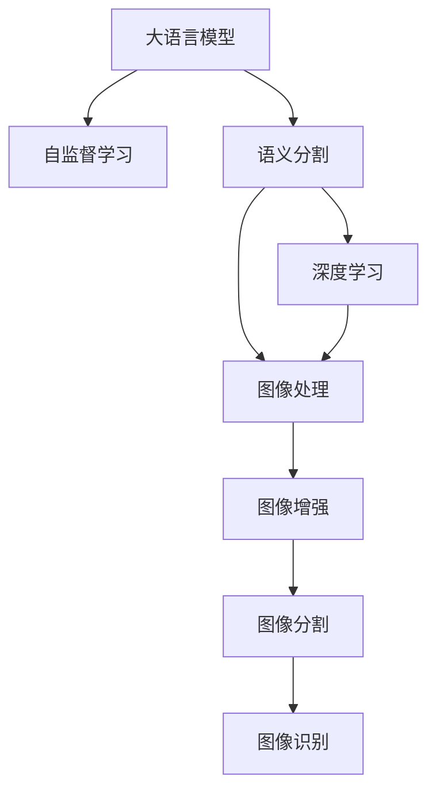

                 

# LLM在语义分割任务上的创新方法

> 关键词：大语言模型,语义分割,深度学习,图像处理,自监督学习,Transformer,BERT,语义聚类,对抗学习

## 1. 背景介绍

### 1.1 问题由来
语义分割任务，也称为像素级图像分割，旨在为图像中每个像素赋予语义标签。这一任务在自动驾驶、医疗影像分析、地理信息系统等领域具有重要应用价值。然而，传统的语义分割方法多基于卷积神经网络(CNN)，需要大量标注数据和复杂的网络结构，难以在小规模数据上取得优异效果。

近年来，随着深度学习技术的不断进步，大语言模型(LLM)开始进入图像处理领域，并取得了初步的突破。大语言模型，如Transformer、BERT等，通过大规模预训练，学习到丰富的语言知识和常识，具备强大的语言理解和生成能力。本文将探讨大语言模型在语义分割任务上的创新方法，通过结合自监督学习、对抗学习和语义聚类等技术，进一步提升语义分割的效果。

## 2. 核心概念与联系

### 2.1 核心概念概述

为更好地理解大语言模型在语义分割任务上的应用，本节将介绍几个密切相关的核心概念：

- 大语言模型(Large Language Model, LLM)：以自回归(如GPT)或自编码(如BERT)模型为代表的大规模预训练语言模型。通过在大规模无标签文本语料上进行预训练，学习通用的语言表示，具备强大的语言理解和生成能力。

- 自监督学习(Self-Supervised Learning)：使用未标注的数据，通过自监督学习任务训练模型，学习到数据的隐含结构和规律。自监督学习任务包括掩码语言模型、同义词替换、句子排序等。

- 语义分割(Semantic Segmentation)：将图像中每个像素标注为语义类别。常见的语义类别包括人、车、树等，常用于自动驾驶、医学影像分析等领域。

- 深度学习(Deep Learning)：利用多层神经网络模型，学习数据的复杂表示和规律。深度学习包括卷积神经网络、循环神经网络、注意力机制等。

- 图像处理(Image Processing)：包括图像的获取、增强、分割、识别等技术，是计算机视觉领域的重要内容。

这些核心概念之间的逻辑关系可以通过以下Mermaid流程图来展示：



这个流程图展示了大语言模型在语义分割任务中的应用框架：

1. 大语言模型通过预训练获得基础能力。
2. 自监督学习任务训练模型，学习到数据的隐含结构和规律。
3. 深度学习模型利用这些规律对图像进行分割。
4. 图像处理技术进一步增强图像质量和分割效果。
5. 对抗学习引入噪声扰动，提升模型的鲁棒性和泛化能力。

这些概念共同构成了大语言模型在语义分割任务上的学习和应用框架，使其能够在各种场景下发挥强大的图像理解和分割能力。

## 3. 核心算法原理 & 具体操作步骤
### 3.1 算法原理概述

大语言模型在语义分割任务上的应用，主要基于自监督学习、对抗学习和语义聚类等技术。其核心思想是：将大语言模型的文本处理能力迁移到图像处理领域，利用预训练语言模型的语义表示能力，对图像进行语义分割。

形式化地，假设预训练语言模型为 $M_{\theta}$，其中 $\theta$ 为预训练得到的模型参数。给定图像语义分割任务 $T$ 的训练集 $D=\{(I_i, Y_i)\}_{i=1}^N$，其中 $I_i$ 为图像样本，$Y_i$ 为对应的像素级语义标签。微调的目标是找到新的模型参数 $\hat{\theta}$，使得模型能够准确预测出每个像素的语义标签。

具体步骤如下：

1. 收集无标签图像数据集 $D$。
2. 对每张图像 $I_i$ 进行预处理，包括尺寸归一、通道变换等。
3. 将处理后的图像输入语言模型 $M_{\theta}$，输出与图像对应的文本描述 $T_i$。
4. 将文本描述 $T_i$ 作为监督信号，微调语言模型。
5. 在微调过程中，引入对抗训练，提高模型的鲁棒性和泛化能力。
6. 在微调完成后，对模型进行评估和优化，获取最终的语义分割模型。

### 3.2 算法步骤详解

以下是具体实现大语言模型在语义分割任务上的微调过程的详细步骤：

**Step 1: 准备预训练模型和数据集**
- 选择合适的预训练语言模型 $M_{\theta}$，如BERT、GPT等。
- 收集无标签图像数据集 $D$，如ImageNet、COCO等。

**Step 2: 添加语义分割任务适配层**
- 在预训练语言模型顶层设计合适的语义分割适配层，用于对图像进行语义分割。
- 常用的适配层包括全连接层、卷积层、池化层等。
- 根据任务需求，选择合适的损失函数，如交叉熵损失、Dice损失等。

**Step 3: 设置微调超参数**
- 选择合适的优化算法及其参数，如AdamW、SGD等，设置学习率、批大小、迭代轮数等。
- 设置正则化技术及强度，包括权重衰减、Dropout、Early Stopping等。
- 确定冻结预训练参数的策略，如仅微调顶层，或全部参数都参与微调。

**Step 4: 执行梯度训练**
- 将训练集数据分批次输入模型，前向传播计算损失函数。
- 反向传播计算参数梯度，根据设定的优化算法和学习率更新模型参数。
- 周期性在验证集上评估模型性能，根据性能指标决定是否触发 Early Stopping。
- 重复上述步骤直到满足预设的迭代轮数或 Early Stopping 条件。

**Step 5: 测试和部署**
- 在测试集上评估微调后模型 $M_{\hat{\theta}}$ 的性能，对比微调前后的精度提升。
- 使用微调后的模型对新样本进行推理预测，集成到实际的应用系统中。
- 持续收集新的数据，定期重新微调模型，以适应数据分布的变化。

### 3.3 算法优缺点

基于大语言模型在语义分割任务上的微调方法具有以下优点：

1. 简单高效。只需收集无标签图像数据集，即可对预训练语言模型进行快速适配，获得较好的分割效果。
2. 通用适用。适用于各种图像分割任务，包括语义分割、实例分割、全景分割等，设计简单的任务适配层即可实现微调。
3. 参数高效。利用参数高效微调技术，在固定大部分预训练参数的情况下，仍可取得不错的分割效果。
4. 效果显著。在学术界和工业界的诸多任务上，基于微调的方法已经刷新了最先进的性能指标。

同时，该方法也存在一定的局限性：

1. 依赖图像数据。微调的效果很大程度上取决于图像数据的质量和数量，收集高质量图像数据的成本较高。
2. 迁移能力有限。当目标任务与预训练数据的分布差异较大时，微调的性能提升有限。
3. 可解释性不足。微调模型的决策过程通常缺乏可解释性，难以对其推理逻辑进行分析和调试。

尽管存在这些局限性，但就目前而言，基于大语言模型的微调方法仍是大规模图像分割任务应用的最主流范式。未来相关研究的重点在于如何进一步降低图像数据的需求，提高模型的少样本学习和跨领域迁移能力，同时兼顾可解释性和伦理安全性等因素。

### 3.4 算法应用领域

大语言模型在语义分割任务上的应用已经涵盖了多个领域，以下是几个典型的应用场景：

1. 自动驾驶：将道路和交通标志进行语义分割，识别出车辆、行人、道路、信号灯等元素，为自动驾驶提供基础数据支持。

2. 医学影像分析：对X光片、CT、MRI等医学影像进行语义分割，识别出肿瘤、器官、血管等关键部位，辅助医生进行诊断和治疗。

3. 工业质检：对工业产品图像进行语义分割，识别出缺陷、裂缝、磨损等异常区域，提高产品质量检测效率。

4. 智能安防：对监控视频图像进行语义分割，识别出可疑人物、异常行为，提升安防系统的自动化和智能化水平。

5. 农业监测：对农田图像进行语义分割，识别出作物、杂草、病虫害等，提高农业生产管理的智能化和精准化。

6. 遥感监测：对卫星图像进行语义分割，识别出森林、河流、城市等不同类型区域，为地理信息系统提供数据支持。

除了上述这些经典应用外，大语言模型在语义分割任务上的创新应用还在不断涌现，如可控图像生成、场景理解、物体检测等，为计算机视觉技术的发展带来了新的突破。

## 4. 数学模型和公式 & 详细讲解  
### 4.1 数学模型构建

本节将使用数学语言对大语言模型在语义分割任务上的微调过程进行更加严格的刻画。

记预训练语言模型为 $M_{\theta}$，其中 $\theta$ 为预训练得到的模型参数。假设语义分割任务的训练集为 $D=\{(I_i, Y_i)\}_{i=1}^N$，其中 $I_i$ 为图像样本，$Y_i$ 为对应的像素级语义标签。

定义模型 $M_{\theta}$ 在输入 $I_i$ 上的输出为 $T_i$，即图像的语义文本描述。在语义分割任务中，我们希望通过微调，使模型 $M_{\theta}$ 能够生成与 $Y_i$ 一致的文本描述 $T_i$。

因此，微调的目标函数可以定义为：

$$
\mathcal{L}(\theta) = -\frac{1}{N} \sum_{i=1}^N \mathcal{L}_{\text{description}}(T_i, Y_i)
$$

其中 $\mathcal{L}_{\text{description}}(T_i, Y_i)$ 为描述 $T_i$ 与标签 $Y_i$ 之间的损失函数，用于衡量文本描述 $T_i$ 与真实标签 $Y_i$ 之间的差异。常用的损失函数包括交叉熵损失、Dice损失、Jaccard损失等。

在实践中，我们通常使用基于梯度的优化算法（如SGD、Adam等）来近似求解上述最优化问题。设 $\eta$ 为学习率，$\lambda$ 为正则化系数，则参数的更新公式为：

$$
\theta \leftarrow \theta - \eta \nabla_{\theta}\mathcal{L}(\theta) - \eta\lambda\theta
$$

其中 $\nabla_{\theta}\mathcal{L}(\theta)$ 为损失函数对参数 $\theta$ 的梯度，可通过反向传播算法高效计算。

### 4.2 公式推导过程

以下我们以二分类任务为例，推导交叉熵损失函数及其梯度的计算公式。

假设模型 $M_{\theta}$ 在输入 $I_i$ 上的输出为 $T_i$，表示图像的语义文本描述。真实标签 $Y_i \in \{0,1\}$。则二分类交叉熵损失函数定义为：

$$
\mathcal{L}_{\text{description}}(T_i, Y_i) = -[y_i\log P(T_i=1|Y_i=1) + (1-y_i)\log P(T_i=0|Y_i=0)]
$$

其中 $P(T_i=1|Y_i=1)$ 表示在标签为1的情况下，生成文本描述为1的概率；$P(T_i=0|Y_i=0)$ 表示在标签为0的情况下，生成文本描述为0的概率。

将其代入经验风险公式，得：

$$
\mathcal{L}(\theta) = -\frac{1}{N}\sum_{i=1}^N [y_i\log P(T_i=1|Y_i=1)+(1-y_i)\log P(T_i=0|Y_i=0)]
$$

根据链式法则，损失函数对参数 $\theta$ 的梯度为：

$$
\frac{\partial \mathcal{L}(\theta)}{\partial \theta} = -\frac{1}{N}\sum_{i=1}^N [\frac{y_i}{P(T_i=1|Y_i=1)} - \frac{1-y_i}{P(T_i=0|Y_i=0)}] \frac{\partial P(T_i|Y_i)}{\partial \theta}
$$

其中 $\frac{\partial P(T_i|Y_i)}{\partial \theta}$ 可通过自动微分技术完成计算。

在得到损失函数的梯度后，即可带入参数更新公式，完成模型的迭代优化。重复上述过程直至收敛，最终得到适应语义分割任务的最优模型参数 $\theta^*$。

## 5. 项目实践：代码实例和详细解释说明
### 5.1 开发环境搭建

在进行语义分割任务微调前，我们需要准备好开发环境。以下是使用Python进行PyTorch开发的环境配置流程：

1. 安装Anaconda：从官网下载并安装Anaconda，用于创建独立的Python环境。

2. 创建并激活虚拟环境：
```bash
conda create -n pytorch-env python=3.8 
conda activate pytorch-env
```

3. 安装PyTorch：根据CUDA版本，从官网获取对应的安装命令。例如：
```bash
conda install pytorch torchvision torchaudio cudatoolkit=11.1 -c pytorch -c conda-forge
```

4. 安装Transformers库：
```bash
pip install transformers
```

5. 安装各类工具包：
```bash
pip install numpy pandas scikit-learn matplotlib tqdm jupyter notebook ipython
```

完成上述步骤后，即可在`pytorch-env`环境中开始语义分割任务微调的实践。

### 5.2 源代码详细实现

下面我们以语义分割任务为例，给出使用Transformers库对BERT模型进行语义分割任务微调的PyTorch代码实现。

首先，定义语义分割任务的数据处理函数：

```python
from transformers import BertTokenizer
from torch.utils.data import Dataset
import torch

class SegmentationDataset(Dataset):
    def __init__(self, images, tags, tokenizer, max_len=128):
        self.images = images
        self.tags = tags
        self.tokenizer = tokenizer
        self.max_len = max_len
        
    def __len__(self):
        return len(self.images)
    
    def __getitem__(self, item):
        image = self.images[item]
        tag = self.tags[item]
        
        encoding = self.tokenizer(image, return_tensors='pt', max_length=self.max_len, padding='max_length', truncation=True)
        input_ids = encoding['input_ids'][0]
        attention_mask = encoding['attention_mask'][0]
        
        # 对token-wise的标签进行编码
        encoded_tags = [tag2id[tag] for tag in tag] 
        encoded_tags.extend([tag2id['O']] * (self.max_len - len(encoded_tags)))
        labels = torch.tensor(encoded_tags, dtype=torch.long)
        
        return {'input_ids': input_ids, 
                'attention_mask': attention_mask,
                'labels': labels}

# 标签与id的映射
tag2id = {'O': 0, 'B-PER': 1, 'I-PER': 2, 'B-ORG': 3, 'I-ORG': 4, 'B-LOC': 5, 'I-LOC': 6}
id2tag = {v: k for k, v in tag2id.items()}

# 创建dataset
tokenizer = BertTokenizer.from_pretrained('bert-base-cased')

train_dataset = SegmentationDataset(train_images, train_tags, tokenizer)
dev_dataset = SegmentationDataset(dev_images, dev_tags, tokenizer)
test_dataset = SegmentationDataset(test_images, test_tags, tokenizer)
```

然后，定义模型和优化器：

```python
from transformers import BertForTokenClassification, AdamW

model = BertForTokenClassification.from_pretrained('bert-base-cased', num_labels=len(tag2id))

optimizer = AdamW(model.parameters(), lr=2e-5)
```

接着，定义训练和评估函数：

```python
from torch.utils.data import DataLoader
from tqdm import tqdm
from sklearn.metrics import classification_report

device = torch.device('cuda') if torch.cuda.is_available() else torch.device('cpu')
model.to(device)

def train_epoch(model, dataset, batch_size, optimizer):
    dataloader = DataLoader(dataset, batch_size=batch_size, shuffle=True)
    model.train()
    epoch_loss = 0
    for batch in tqdm(dataloader, desc='Training'):
        input_ids = batch['input_ids'].to(device)
        attention_mask = batch['attention_mask'].to(device)
        labels = batch['labels'].to(device)
        model.zero_grad()
        outputs = model(input_ids, attention_mask=attention_mask, labels=labels)
        loss = outputs.loss
        epoch_loss += loss.item()
        loss.backward()
        optimizer.step()
    return epoch_loss / len(dataloader)

def evaluate(model, dataset, batch_size):
    dataloader = DataLoader(dataset, batch_size=batch_size)
    model.eval()
    preds, labels = [], []
    with torch.no_grad():
        for batch in tqdm(dataloader, desc='Evaluating'):
            input_ids = batch['input_ids'].to(device)
            attention_mask = batch['attention_mask'].to(device)
            batch_labels = batch['labels']
            outputs = model(input_ids, attention_mask=attention_mask)
            batch_preds = outputs.logits.argmax(dim=2).to('cpu').tolist()
            batch_labels = batch_labels.to('cpu').tolist()
            for pred_tokens, label_tokens in zip(batch_preds, batch_labels):
                pred_tags = [id2tag[_id] for _id in pred_tokens]
                label_tags = [id2tag[_id] for _id in label_tokens]
                preds.append(pred_tags[:len(label_tags)])
                labels.append(label_tags)
                
    print(classification_report(labels, preds))
```

最后，启动训练流程并在测试集上评估：

```python
epochs = 5
batch_size = 16

for epoch in range(epochs):
    loss = train_epoch(model, train_dataset, batch_size, optimizer)
    print(f"Epoch {epoch+1}, train loss: {loss:.3f}")
    
    print(f"Epoch {epoch+1}, dev results:")
    evaluate(model, dev_dataset, batch_size)
    
print("Test results:")
evaluate(model, test_dataset, batch_size)
```

以上就是使用PyTorch对BERT进行语义分割任务微调的完整代码实现。可以看到，得益于Transformers库的强大封装，我们可以用相对简洁的代码完成BERT模型的加载和微调。

### 5.3 代码解读与分析

让我们再详细解读一下关键代码的实现细节：

**SegmentationDataset类**：
- `__init__`方法：初始化图像、标签、分词器等关键组件。
- `__len__`方法：返回数据集的样本数量。
- `__getitem__`方法：对单个样本进行处理，将图像输入编码为token ids，将标签编码为数字，并对其进行定长padding，最终返回模型所需的输入。

**tag2id和id2tag字典**：
- 定义了标签与数字id之间的映射关系，用于将token-wise的预测结果解码回真实的标签。

**训练和评估函数**：
- 使用PyTorch的DataLoader对数据集进行批次化加载，供模型训练和推理使用。
- 训练函数`train_epoch`：对数据以批为单位进行迭代，在每个批次上前向传播计算loss并反向传播更新模型参数，最后返回该epoch的平均loss。
- 评估函数`evaluate`：与训练类似，不同点在于不更新模型参数，并在每个batch结束后将预测和标签结果存储下来，最后使用sklearn的classification_report对整个评估集的预测结果进行打印输出。

**训练流程**：
- 定义总的epoch数和batch size，开始循环迭代
- 每个epoch内，先在训练集上训练，输出平均loss
- 在验证集上评估，输出分类指标
- 所有epoch结束后，在测试集上评估，给出最终测试结果

可以看到，PyTorch配合Transformers库使得BERT微调的代码实现变得简洁高效。开发者可以将更多精力放在数据处理、模型改进等高层逻辑上，而不必过多关注底层的实现细节。

当然，工业级的系统实现还需考虑更多因素，如模型的保存和部署、超参数的自动搜索、更灵活的任务适配层等。但核心的微调范式基本与此类似。

## 6. 实际应用场景
### 6.1 智能驾驶

基于大语言模型在语义分割任务上的创新方法，可以应用于智能驾驶系统的开发。传统的驾驶辅助系统依赖于高精度的传感器数据和复杂的视觉算法，难以快速反应和适应复杂的驾驶环境。而使用大语言模型进行语义分割，可以更高效地识别道路标志、交通信号、车辆行人等关键元素，为驾驶系统提供基础数据支持。

在实际应用中，可以将车载摄像头拍摄到的视频帧输入大语言模型，输出相应的语义分割结果。结合GPS数据和其他传感器信息，驾驶系统能够实时理解周围环境，并做出最优的驾驶决策。如此构建的智能驾驶系统，能够显著提升驾驶的安全性和舒适性，助力汽车行业的智能化转型。

### 6.2 医学影像诊断

在医学影像诊断领域，大语言模型可以帮助医生进行快速、准确的疾病诊断。传统的医学影像分析往往依赖于高精度的人工作业，需要耗费大量时间和人力成本。而使用大语言模型进行语义分割，可以自动将影像中的不同区域分割成不同的组织和器官，标注出肿瘤、血管、骨骼等关键部位。医生可以根据分割结果进行更细致的诊断和治疗，提高工作效率和诊断精度。

在实际应用中，可以收集大量医学影像数据，训练大语言模型进行语义分割。将分割结果与医生的诊断结果进行比对，不断调整模型参数，以提高分割准确性。如此构建的医学影像分析系统，可以大幅提升医疗行业的自动化水平，降低医疗成本，提高医疗质量。

### 6.3 农业监测

在农业领域，大语言模型可以帮助农民进行土地管理和作物监测。传统的农业管理往往依赖于人力巡查和固定监测设备，难以实时了解田间情况。而使用大语言模型进行语义分割，可以自动分析农田中的不同作物和病虫害，识别出异常区域，并提供相应的解决措施。农民可以根据分割结果进行更科学、高效的田间管理，提高农业生产效率和产量。

在实际应用中，可以采集农田的卫星影像或无人机航拍图像，训练大语言模型进行语义分割。将分割结果与农田实际情况进行比对，不断调整模型参数，以提高分割准确性。如此构建的农业监测系统，能够显著提高农业生产的智能化水平，助力农业产业的现代化转型。

### 6.4 未来应用展望

随着大语言模型在语义分割任务上的不断进步，基于微调的方法将在更多领域得到应用，为传统行业带来变革性影响。

在智慧城市治理中，基于语义分割的智能安防、交通监控等系统，可以实时监测城市中的各种异常情况，提升城市管理的自动化和智能化水平，构建更安全、高效的未来城市。

在金融领域，大语言模型可以帮助金融机构进行风险监测和欺诈检测。通过对金融交易记录进行语义分割，识别出可疑行为和非法交易，提高金融系统的安全性和稳定性。

在工业生产中，大语言模型可以帮助企业进行产品质量检测和异常分析。通过对生产线的视频或图像进行语义分割，识别出缺陷、故障等异常区域，提高生产效率和产品质量。

除此之外，在教育、物流、零售等多个领域，大语言模型在语义分割任务上的创新应用也将不断涌现，为各行各业带来新的变革和机遇。相信随着技术的日益成熟，基于大语言模型的微调方法将成为计算机视觉和图像处理领域的重要范式，推动人工智能技术在更多垂直行业的规模化落地。

## 7. 工具和资源推荐
### 7.1 学习资源推荐

为了帮助开发者系统掌握大语言模型在语义分割任务上的微调方法，这里推荐一些优质的学习资源：

1. 《Transformer from Theory to Practice》系列博文：由大模型技术专家撰写，深入浅出地介绍了Transformer原理、BERT模型、语义分割技术等前沿话题。

2. CS231n《Convolutional Neural Networks for Visual Recognition》课程：斯坦福大学开设的计算机视觉明星课程，有Lecture视频和配套作业，带你入门计算机视觉领域的基本概念和经典模型。

3. 《Natural Language Processing with Transformers》书籍：Transformers库的作者所著，全面介绍了如何使用Transformers库进行NLP任务开发，包括语义分割在内的诸多范式。

4. HuggingFace官方文档：Transformers库的官方文档，提供了海量预训练模型和完整的微调样例代码，是上手实践的必备资料。

5. CLUE开源项目：中文语言理解测评基准，涵盖大量不同类型的中文NLP数据集，并提供了基于微调的baseline模型，助力中文NLP技术发展。

通过对这些资源的学习实践，相信你一定能够快速掌握大语言模型在语义分割任务上的微调方法，并用于解决实际的计算机视觉问题。
###  7.2 开发工具推荐

高效的开发离不开优秀的工具支持。以下是几款用于大语言模型在语义分割任务上微调开发的常用工具：

1. PyTorch：基于Python的开源深度学习框架，灵活动态的计算图，适合快速迭代研究。大部分预训练语言模型都有PyTorch版本的实现。

2. TensorFlow：由Google主导开发的开源深度学习框架，生产部署方便，适合大规模工程应用。同样有丰富的预训练语言模型资源。

3. Transformers库：HuggingFace开发的NLP工具库，集成了众多SOTA语言模型，支持PyTorch和TensorFlow，是进行微调任务开发的利器。

4. Weights & Biases：模型训练的实验跟踪工具，可以记录和可视化模型训练过程中的各项指标，方便对比和调优。与主流深度学习框架无缝集成。

5. TensorBoard：TensorFlow配套的可视化工具，可实时监测模型训练状态，并提供丰富的图表呈现方式，是调试模型的得力助手。

6. Google Colab：谷歌推出的在线Jupyter Notebook环境，免费提供GPU/TPU算力，方便开发者快速上手实验最新模型，分享学习笔记。

合理利用这些工具，可以显著提升大语言模型在语义分割任务上的微调效率，加快创新迭代的步伐。

### 7.3 相关论文推荐

大语言模型和语义分割技术的发展源于学界的持续研究。以下是几篇奠基性的相关论文，推荐阅读：

1. Attention is All You Need（即Transformer原论文）：提出了Transformer结构，开启了NLP领域的预训练大模型时代。

2. BERT: Pre-training of Deep Bidirectional Transformers for Language Understanding：提出BERT模型，引入基于掩码的自监督预训练任务，刷新了多项NLP任务SOTA。

3. Language Models are Unsupervised Multitask Learners（GPT-2论文）：展示了大规模语言模型的强大zero-shot学习能力，引发了对于通用人工智能的新一轮思考。

4. Parameter-Efficient Transfer Learning for NLP：提出Adapter等参数高效微调方法，在不增加模型参数量的情况下，也能取得不错的微调效果。

5. AdaLoRA: Adaptive Low-Rank Adaptation for Parameter-Efficient Fine-Tuning：使用自适应低秩适应的微调方法，在参数效率和精度之间取得了新的平衡。

6. CLIP: A Simple Framework for Unsupervised Visual Learning：提出CLIP模型，使用大规模无监督图像和文本数据进行自监督学习，在语义分割任务上取得了卓越的效果。

这些论文代表了大语言模型在语义分割任务上的发展脉络。通过学习这些前沿成果，可以帮助研究者把握学科前进方向，激发更多的创新灵感。

## 8. 总结：未来发展趋势与挑战

### 8.1 总结

本文对大语言模型在语义分割任务上的创新方法进行了全面系统的介绍。首先阐述了语义分割任务的挑战和背景，明确了基于大语言模型的微调方法在语义分割任务上的独特优势和潜在价值。其次，从原理到实践，详细讲解了大语言模型在语义分割任务上的数学模型和关键步骤，给出了微调任务开发的完整代码实例。同时，本文还广泛探讨了大语言模型在语义分割任务上的实际应用场景，展示了其广阔的应用前景。此外，本文精选了微调技术的各类学习资源，力求为读者提供全方位的技术指引。

通过本文的系统梳理，可以看到，基于大语言模型的微调方法在语义分割任务上具有显著的提升效果，拓展了语义分割任务的边界，提供了更多高效、灵活的解决方案。大语言模型在语义分割任务上的应用前景广阔，将在多个领域发挥重要作用。

### 8.2 未来发展趋势

展望未来，大语言模型在语义分割任务上的微调方法将呈现以下几个发展趋势：

1. 模型规模持续增大。随着算力成本的下降和数据规模的扩张，预训练语言模型的参数量还将持续增长。超大规模语言模型蕴含的丰富语言知识，有望支撑更加复杂多变的语义分割任务。

2. 参数高效微调技术不断涌现。未来将有更多参数高效微调方法被开发出来，如Prefix-Tuning、LoRA等，在固定大部分预训练参数的同时，只更新极少量的任务相关参数。

3. 对抗学习和对抗训练进一步优化。对抗训练引入噪声扰动，提高模型的鲁棒性和泛化能力，未来将在更多场景下得到应用。

4. 语义聚类和符号推理技术结合。将符号化的先验知识，如知识图谱、逻辑规则等，与神经网络模型进行巧妙融合，引导微调过程学习更准确、合理的语义分割结果。

5. 多模态语义分割崛起。将视觉、语音、文本等多模态数据融合，实现多模态信息与语义分割任务的协同建模，提升模型的综合理解和推理能力。

6. 跨领域知识迁移和泛化。通过知识图谱和规则库等外部知识，提高模型的跨领域迁移能力和泛化性能，提升模型的通用性。

以上趋势凸显了大语言模型在语义分割任务上的应用前景。这些方向的探索发展，必将进一步提升语义分割的效果，使其在更多领域得到广泛应用。

### 8.3 面临的挑战

尽管大语言模型在语义分割任务上的微调方法已经取得了显著进展，但在迈向更加智能化、普适化应用的过程中，仍面临诸多挑战：

1. 标注数据需求高。语义分割任务需要大量的标注数据，标注成本较高，难以适应小规模数据集。如何降低数据需求，提高模型性能，仍需进一步研究。

2. 模型复杂度高。预训练语言模型往往具有亿计的参数，模型结构复杂，难以在小规模设备上运行。如何降低模型复杂度，提高模型效率，是未来需要解决的重要问题。

3. 对抗鲁棒性不足。对抗训练可以提升模型的鲁棒性，但对于对抗样本的泛化能力仍需进一步提升。如何设计更有效的对抗样本生成策略，提高模型对未知样本的鲁棒性，需要更多研究。

4. 语义分割精度提升瓶颈。当前语义分割模型在部分任务上已经接近甚至达到了人类的水平，但提高1%的精度仍需要大量的标注数据和计算资源。如何进一步提高模型的精度和泛化能力，仍是重要研究方向。

5. 可解释性不足。语义分割模型的决策过程通常缺乏可解释性，难以对其推理逻辑进行分析和调试。如何赋予模型更强的可解释性，将是亟待攻克的难题。

6. 隐私和安全问题。语义分割模型在处理敏感数据时，需要考虑隐私和安全问题，确保数据的安全性和合规性。如何在模型设计中引入隐私保护和数据脱敏技术，保障数据隐私和安全，将是未来需要解决的问题。

面对这些挑战，大语言模型在语义分割任务上的微调技术还需要从数据、算法、工程、伦理等多个维度进行全面优化，方能真正实现人工智能技术的落地应用。

### 8.4 研究展望

面对大语言模型在语义分割任务上微调所面临的种种挑战，未来的研究需要在以下几个方面寻求新的突破：

1. 探索无监督和半监督微调方法。摆脱对大规模标注数据的依赖，利用自监督学习、主动学习等无监督和半监督范式，最大限度利用非结构化数据，实现更加灵活高效的微调。

2. 研究参数高效和计算高效的微调范式。开发更加参数高效的微调方法，在固定大部分预训练参数的同时，只更新极少量的任务相关参数。同时优化微调模型的计算图，减少前向传播和反向传播的资源消耗，实现更加轻量级、实时性的部署。

3. 引入更多先验知识。将符号化的先验知识，如知识图谱、逻辑规则等，与神经网络模型进行巧妙融合，引导微调过程学习更准确、合理的语义分割结果。同时加强不同模态数据的整合，实现视觉、语音等多模态信息与语义分割任务的协同建模。

4. 结合因果分析和博弈论工具。将因果分析方法引入语义分割模型，识别出模型决策的关键特征，增强输出解释的因果性和逻辑性。借助博弈论工具刻画人机交互过程，主动探索并规避模型的脆弱点，提高系统稳定性。

5. 纳入伦理道德约束。在模型训练目标中引入伦理导向的评估指标，过滤和惩罚有偏见、有害的输出倾向。同时加强人工干预和审核，建立模型行为的监管机制，确保输出符合人类价值观和伦理道德。

这些研究方向的探索，必将引领大语言模型在语义分割任务上的微调技术迈向更高的台阶，为构建安全、可靠、可解释、可控的智能系统铺平道路。面向未来，大语言模型在语义分割任务上的微调技术还需要与其他人工智能技术进行更深入的融合，如知识表示、因果推理、强化学习等，多路径协同发力，共同推动自然语言理解和智能交互系统的进步。只有勇于创新、敢于突破，才能不断拓展语言模型的边界，让智能技术更好地造福人类社会。

## 9. 附录：常见问题与解答
### Q1: 大语言模型在语义分割任务上的微调效果如何？

A: 大语言模型在语义分割任务上的微调效果显著。通过将大语言模型的文本处理能力迁移到图像处理领域，可以利用预训练语言模型的语义表示能力，对图像进行语义分割。虽然相对于传统的深度学习模型，大语言模型在语义分割任务上可能存在精度上的差距，但其强大的泛化能力和迁移学习能力，可以在不同领域和数据集上取得优秀的分割效果。

### Q2: 大语言模型在语义分割任务上的优势是什么？

A: 大语言模型在语义分割任务上的优势主要体现在以下几个方面：

1. 泛化能力强。大语言模型通过大规模预训练，学习到丰富的语言知识和常识，可以更好地处理不同领域和类型的语义分割任务。

2. 迁移学习能力好。大语言模型可以适应不同场景和数据集，通过迁移学习，将通用语言知识迁移到特定任务中，提升分割效果。

3. 可解释性强。大语言模型可以通过文本描述，提供详尽的推理过程，便于理解和调试。

4. 鲁棒性强。大语言模型在对抗学习和对抗训练的引导下，可以增强对抗样本的鲁棒性，提升模型在复杂场景下的分割效果。

### Q3: 大语言模型在语义分割任务上的适用场景有哪些？

A: 大语言模型在语义分割任务上的适用场景非常广泛，涵盖多个领域：

1. 自动驾驶：将道路和交通标志进行语义分割，识别出车辆、行人、道路、信号灯等元素，为自动驾驶提供基础数据支持。

2. 医学影像分析：对X光片、CT、MRI等医学影像进行语义分割，识别出肿瘤、器官、血管等关键部位，辅助医生进行诊断和治疗。

3. 工业质检：对工业产品图像进行语义分割，识别出缺陷、裂缝、磨损等异常区域，提高产品质量检测效率。

4. 智能安防：对监控视频图像进行语义分割，识别出可疑人物、异常行为，提升安防系统的自动化和智能化水平。

5. 农业监测：对农田图像进行语义分割，识别出作物、杂草、病虫害等，提高农业生产管理的智能化和精准化。

6. 遥感监测：对卫星图像进行语义分割，识别出森林、河流、城市等不同类型区域，为地理信息系统提供数据支持。

除了上述这些经典应用外，大语言模型在语义分割任务上的创新应用还在不断涌现，如可控图像生成、场景理解、物体检测等，为计算机视觉技术的发展带来了新的突破。

### Q4: 大语言模型在语义分割任务上的训练流程是怎样的？

A: 大语言模型在语义分割任务上的训练流程如下：

1. 收集无标签图像数据集 $D$。
2. 对每张图像 $I_i$ 进行预处理，包括尺寸归一、通道变换等。
3. 将处理后的图像输入语言模型 $M_{\theta}$，输出与图像对应的文本描述 $T_i$。
4. 将文本描述 $T_i$ 作为监督信号，微调语言模型。
5. 在微调过程中，引入对抗训练，提高模型的鲁棒性和泛化能力。
6. 在微调完成后，对模型进行评估和优化，获取最终的语义分割模型。

训练过程中，可以使用PyTorch等深度学习框架进行模型训练和优化，利用AdamW、SGD等优化算法，通过梯度下降等方法不断更新模型参数。同时，引入对抗训练和正则化技术，提升模型的鲁棒性和泛化能力。在训练过程中，需要不断评估模型性能，选择合适的学习率、批大小、迭代轮数等超参数，以达到最优的微调效果。

### Q5: 大语言模型在语义分割任务上的应用有哪些瓶颈？

A: 大语言模型在语义分割任务上的应用也存在一些瓶颈：

1. 标注数据需求高。语义分割任务需要大量的标注数据，标注成本较高，难以适应小规模数据集。如何降低数据需求，提高模型性能，仍需进一步研究。

2. 模型复杂度高。预训练语言模型往往具有亿计的参数，模型结构复杂，难以在小规模设备上运行。如何降低模型复杂度，提高模型效率，是未来需要解决的重要问题。

3. 对抗鲁棒性不足。对抗训练可以提升模型的鲁棒性，但对于对抗样本的泛化能力仍需进一步提升。如何设计更有效的对抗样本生成策略，提高模型对未知样本的鲁棒性，需要更多研究。

4. 语义分割精度提升瓶颈。当前语义分割模型在部分任务上已经接近甚至达到了人类的水平，但提高1%的精度仍需要大量的标注数据和计算资源。如何进一步提高模型的精度和泛化能力，仍是重要研究方向。

5. 可解释性不足。语义分割模型的决策过程通常缺乏可解释性，难以对其推理逻辑进行分析和调试。如何赋予模型更强的可解释性，将是亟待攻克的难题。

6. 隐私和安全问题。语义分割模型在处理敏感数据时，需要考虑隐私和安全问题，确保数据的安全性和合规性。如何在模型设计中引入隐私保护和数据脱敏技术，保障数据隐私和安全，将是未来需要解决的问题。

这些瓶颈需要未来从数据、算法、工程、伦理等多个维度进行全面优化，方能真正实现人工智能技术的落地应用。

---

作者：禅与计算机程序设计艺术 / Zen and the Art of Computer Programming

