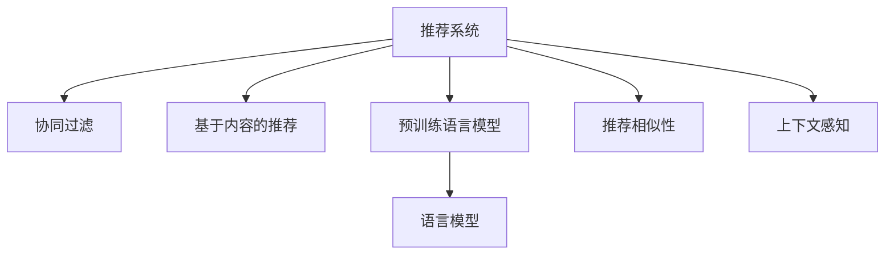

                 

## 1. 背景介绍

### 1.1 问题由来

随着电子商务和社交媒体平台的蓬勃发展，推荐系统（Recommender Systems）逐渐成为互联网产品不可或缺的核心功能之一。推荐系统通过分析用户行为，预测用户可能感兴趣的内容或产品，极大地提升了用户体验和平台转化率。然而，传统的基于协同过滤、基于内容的推荐方法在应对海量数据和多变用户需求时，难以满足实时性和个性化需求。

近年来，大规模预训练语言模型（Large Language Models, LLMs）在自然语言处理（NLP）领域取得了突破性进展，其中基于Transformer架构的BERT、GPT等模型在自然语言理解和生成方面表现出色。受此启发，研究人员尝试将LLMs融入推荐系统中，以期借助其强大的语言理解和生成能力，提升推荐系统的实时个性化水平。

### 1.2 问题核心关键点

LLM在推荐系统中的引入，主要聚焦于两个方面：

1. **语言理解和生成**：利用LLMs的自然语言处理能力，分析用户输入的查询、评论等文本数据，生成个性化的推荐内容。
2. **上下文建模**：通过LLMs的多层次编码结构，捕捉用户和物品之间的复杂关联，预测用户的潜在兴趣。

目前，基于LLM的推荐系统应用广泛，如电商平台的个性化推荐、社交媒体内容推荐、新闻订阅系统等，在提升用户体验和平台粘性方面展现了巨大潜力。

### 1.3 问题研究意义

研究LLM在推荐系统中的应用，对于拓展推荐系统的功能边界，提升推荐质量，加速NLP技术的产业化进程，具有重要意义：

1. 提升推荐效果：利用LLM的自然语言处理能力，能够更好地理解用户需求和兴趣，生成更符合个性化需求的推荐内容。
2. 加速推荐开发：LLM的预训练特性减少了从零开始构建推荐模型的开发成本，缩短了从模型训练到上线部署的周期。
3. 促进用户互动：LLM的对话生成能力，可以实现自然流畅的用户互动，增强用户的参与感和满意度。
4. 催生技术创新：LLM的引入催生了诸如多轮对话推荐、可控推荐生成、自然语言搜索推荐等新的推荐方法。
5. 赋能业务升级：推荐系统在电商、媒体、金融等各行各业的应用，推动了传统业务数字化转型和升级。

## 2. 核心概念与联系

### 2.1 核心概念概述

为更好地理解LLM在推荐系统中的应用，本节将介绍几个密切相关的核心概念：

- 推荐系统（Recommender Systems）：根据用户历史行为或属性，预测用户可能感兴趣的内容或产品，推荐给用户。
- 协同过滤（Collaborative Filtering）：利用用户之间的相似性或物品之间的相似性，进行推荐。
- 基于内容的推荐（Content-based Recommendation）：基于物品的属性或特征，预测用户可能感兴趣的内容。
- 预训练语言模型（Pre-trained Language Model, PLM）：通过大规模无标签数据进行预训练，学习通用的语言表示，具备强大的语言理解和生成能力。
- 语言模型（Language Model）：预测给定序列下一个词汇的概率分布，衡量序列的概率，用于自然语言理解和生成。
- 推荐相似性（Recommendation Similarity）：衡量用户与物品之间的相似性，基于相似性进行推荐。
- 上下文感知（Context-aware）：考虑用户、物品和交互场景的上下文信息，进行推荐决策。

这些核心概念之间的逻辑关系可以通过以下Mermaid流程图来展示：



这个流程图展示推荐系统的核心概念及其之间的关系：

1. 推荐系统通过协同过滤、基于内容的推荐等方法，预测用户可能感兴趣的内容。
2. 预训练语言模型通过自监督学习任务进行预训练，学习通用的语言表示。
3. 语言模型基于预训练模型，进行自然语言理解和生成。
4. 推荐相似性衡量用户与物品之间的相似性，基于相似性进行推荐。
5. 上下文感知考虑用户、物品和交互场景的上下文信息，进行推荐决策。

这些概念共同构成了推荐系统的基本框架，使其能够根据用户历史行为和交互信息，推荐符合用户需求的内容或产品。

## 3. 核心算法原理 & 具体操作步骤
### 3.1 算法原理概述

基于LLM的推荐系统，本质上是一种基于用户和物品文本数据的推荐方法。其核心思想是：利用LLMs的自然语言处理能力，分析用户输入的查询、评论等文本数据，理解用户需求和兴趣，生成个性化的推荐内容，提升推荐效果。

形式化地，假设用户的历史行为文本为 $U=\{u_1, u_2, \ldots, u_N\}$，物品的文本描述为 $I=\{i_1, i_2, \ldots, i_M\}$，其中 $u_j = \{u_{j1}, u_{j2}, \ldots, u_{jn}\}$ 表示用户 $u_j$ 的 $n$ 条文本行为，$i_k = \{i_{k1}, i_{k2}, \ldots, i_{km}\}$ 表示物品 $i_k$ 的 $m$ 条文本描述。

定义推荐模型 $M$，其输入为用户的文本行为 $U$ 和物品的文本描述 $I$，输出为物品的推荐权重 $w_i$，即物品 $i$ 被推荐给用户 $u$ 的概率。推荐模型的目标是最小化预测权重与实际用户行为之间的差距，即：

$$
\min_{\theta} \sum_{j=1}^N \sum_{k=1}^M (w_i - \hat{w}_i)^2
$$

其中 $\theta$ 为推荐模型的参数，$\hat{w}_i$ 为模型预测的物品 $i$ 的推荐权重。

### 3.2 算法步骤详解

基于LLM的推荐系统一般包括以下几个关键步骤：

**Step 1: 准备数据集**

- 收集用户的文本行为 $U$ 和物品的文本描述 $I$，并进行预处理，如文本分词、去除停用词等。
- 将用户行为和物品描述编码成模型可接受的格式，如Bert Token Ids。

**Step 2: 加载预训练模型**

- 选择适合的预训练语言模型，如BERT、GPT等。
- 加载预训练模型权重，并进行微调（ Fine-tuning），以适应推荐系统任务。

**Step 3: 设计推荐模型**

- 根据任务需求，设计合适的推荐模型架构。
- 通常采用双塔结构，将用户行为和物品描述分别输入两个塔，输出用户的兴趣向量 $u_v$ 和物品的特征向量 $i_v$。
- 将两个向量拼接，通过全连接层和softmax激活函数，生成物品 $i$ 的推荐权重 $w_i$。

**Step 4: 训练模型**

- 使用用户的文本行为 $U$ 和物品的文本描述 $I$，训练推荐模型 $M$。
- 通过交叉熵损失函数等，最小化预测权重与实际用户行为之间的差距。
- 根据数据集大小，选择合适的批大小和迭代轮数。

**Step 5: 推理和推荐**

- 将新的用户查询输入到推荐模型中，获取推荐权重 $w_i$。
- 根据推荐权重，排序选择推荐的物品。
- 将推荐结果展示给用户。

### 3.3 算法优缺点

基于LLM的推荐系统具有以下优点：

1. **丰富的文本信息利用**：利用用户行为和物品描述的文本信息，能够更好地理解用户需求和物品特征，生成更符合个性化的推荐。
2. **实时性提升**：通过微调，模型可以在线预测推荐权重，实时生成推荐结果，满足了用户对即时反馈的需求。
3. **多模态融合**：结合用户行为、物品描述、上下文等多模态信息，提升推荐的全面性和准确性。
4. **易于扩展**：预训练语言模型具有模块化和可扩展性，易于添加新任务和新模态。

同时，该方法也存在一定的局限性：

1. **数据质量要求高**：推荐系统的效果很大程度上依赖于用户行为和物品描述的质量，需要标注数据或用户反馈来优化模型。
2. **模型复杂度高**：大规模预训练语言模型具有庞大的参数量，训练和推理需要较高的计算资源。
3. **过拟合风险**：微调后的模型可能会对特定领域的文本数据过拟合，导致泛化性能下降。
4. **可解释性不足**：推荐系统的决策过程通常缺乏可解释性，难以对其推理逻辑进行分析和调试。

尽管存在这些局限性，但基于LLM的推荐系统已经在电商、社交媒体、新闻等领域展现出了巨大的潜力，成为了推荐系统应用的新范式。

### 3.4 算法应用领域

基于LLM的推荐系统在电子商务、社交媒体、新闻订阅等多个领域得到了广泛应用，具体如下：

1. **电子商务推荐系统**：利用用户的购物记录、评论等文本数据，生成个性化的商品推荐。
2. **社交媒体内容推荐**：分析用户的点赞、评论、分享等行为，生成符合用户兴趣的内容推荐。
3. **新闻订阅系统**：根据用户的阅读历史和兴趣，生成个性化的新闻文章推荐。

除了这些常见的应用场景外，基于LLM的推荐系统还被创新性地应用到更多场景中，如智能客服、个性化广告、智慧医疗等，为不同行业带来了新的变革和突破。

## 4. 数学模型和公式 & 详细讲解
### 4.1 数学模型构建

本节将使用数学语言对基于LLM的推荐系统进行更加严格的刻画。

记用户的历史行为文本为 $U=\{u_1, u_2, \ldots, u_N\}$，物品的文本描述为 $I=\{i_1, i_2, \ldots, i_M\}$，其中 $u_j = \{u_{j1}, u_{j2}, \ldots, u_{jn}\}$ 表示用户 $u_j$ 的 $n$ 条文本行为，$i_k = \{i_{k1}, i_{k2}, \ldots, i_{km}\}$ 表示物品 $i_k$ 的 $m$ 条文本描述。

定义推荐模型 $M$，其输入为用户的文本行为 $U$ 和物品的文本描述 $I$，输出为物品的推荐权重 $w_i$，即物品 $i$ 被推荐给用户 $u$ 的概率。推荐模型的目标是最小化预测权重与实际用户行为之间的差距，即：

$$
\min_{\theta} \sum_{j=1}^N \sum_{k=1}^M (w_i - \hat{w}_i)^2
$$

其中 $\theta$ 为推荐模型的参数，$\hat{w}_i$ 为模型预测的物品 $i$ 的推荐权重。

### 4.2 公式推导过程

以下我们以电商推荐为例，推导基于BERT的推荐系统的预测公式。

假设用户的行为文本为 $U=\{u_1, u_2, \ldots, u_N\}$，物品的文本描述为 $I=\{i_1, i_2, \ldots, i_M\}$，其中 $u_j = \{u_{j1}, u_{j2}, \ldots, u_{jn}\}$ 表示用户 $u_j$ 的 $n$ 条文本行为，$i_k = \{i_{k1}, i_{k2}, \ldots, i_{km}\}$ 表示物品 $i_k$ 的 $m$ 条文本描述。

定义推荐模型 $M$，其输入为用户的文本行为 $U$ 和物品的文本描述 $I$，输出为物品的推荐权重 $w_i$，即物品 $i$ 被推荐给用户 $u$ 的概率。推荐模型的目标是最小化预测权重与实际用户行为之间的差距，即：

$$
\min_{\theta} \sum_{j=1}^N \sum_{k=1}^M (w_i - \hat{w}_i)^2
$$

其中 $\theta$ 为推荐模型的参数，$\hat{w}_i$ 为模型预测的物品 $i$ 的推荐权重。

在实践中，我们通常使用基于梯度的优化算法（如SGD、Adam等）来近似求解上述最优化问题。设 $\eta$ 为学习率，$\lambda$ 为正则化系数，则参数的更新公式为：

$$
\theta \leftarrow \theta - \eta \nabla_{\theta}\mathcal{L}(\theta) - \eta\lambda\theta
$$

其中 $\nabla_{\theta}\mathcal{L}(\theta)$ 为损失函数对参数 $\theta$ 的梯度，可通过反向传播算法高效计算。

在得到损失函数的梯度后，即可带入参数更新公式，完成模型的迭代优化。重复上述过程直至收敛，最终得到适应推荐系统任务的最优模型参数 $\theta^*$。

### 4.3 案例分析与讲解

**案例分析：电商推荐系统**

假设有一个电商网站，用户行为和商品描述数据已收集并编码成BERT Token Ids。定义推荐模型 $M$，其输入为用户的文本行为 $U$ 和物品的文本描述 $I$，输出为物品的推荐权重 $w_i$，即物品 $i$ 被推荐给用户 $u$ 的概率。推荐模型的目标是最小化预测权重与实际用户行为之间的差距，即：

$$
\min_{\theta} \sum_{j=1}^N \sum_{k=1}^M (w_i - \hat{w}_i)^2
$$

其中 $\theta$ 为推荐模型的参数，$\hat{w}_i$ 为模型预测的物品 $i$ 的推荐权重。

在实践中，我们通常使用基于梯度的优化算法（如SGD、Adam等）来近似求解上述最优化问题。设 $\eta$ 为学习率，$\lambda$ 为正则化系数，则参数的更新公式为：

$$
\theta \leftarrow \theta - \eta \nabla_{\theta}\mathcal{L}(\theta) - \eta\lambda\theta
$$

其中 $\nabla_{\theta}\mathcal{L}(\theta)$ 为损失函数对参数 $\theta$ 的梯度，可通过反向传播算法高效计算。

在得到损失函数的梯度后，即可带入参数更新公式，完成模型的迭代优化。重复上述过程直至收敛，最终得到适应推荐系统任务的最优模型参数 $\theta^*$。

在实际应用中，我们还需要针对具体的电商推荐场景进行优化设计。例如，可以引入用户兴趣标签、物品类别标签等先验信息，进一步提升推荐效果。同时，为了应对不同用户的个性化需求，可以采用多模型融合的方法，提高推荐系统的鲁棒性。

## 5. 项目实践：代码实例和详细解释说明
### 5.1 开发环境搭建

在进行LLM推荐系统开发前，我们需要准备好开发环境。以下是使用Python进行PyTorch开发的环境配置流程：

1. 安装Anaconda：从官网下载并安装Anaconda，用于创建独立的Python环境。

2. 创建并激活虚拟环境：
```bash
conda create -n pytorch-env python=3.8 
conda activate pytorch-env
```

3. 安装PyTorch：根据CUDA版本，从官网获取对应的安装命令。例如：
```bash
conda install pytorch torchvision torchaudio cudatoolkit=11.1 -c pytorch -c conda-forge
```

4. 安装Transformers库：
```bash
pip install transformers
```

5. 安装各类工具包：
```bash
pip install numpy pandas scikit-learn matplotlib tqdm jupyter notebook ipython
```

完成上述步骤后，即可在`pytorch-env`环境中开始开发实践。

### 5.2 源代码详细实现

下面我们以电商推荐系统为例，给出使用Transformers库对BERT模型进行推荐系统开发的PyTorch代码实现。

首先，定义推荐系统的数据处理函数：

```python
from transformers import BertTokenizer
from torch.utils.data import Dataset
import torch

class RecommendationDataset(Dataset):
    def __init__(self, user_bio, item_des, tokenizer, max_len=128):
        self.user_bio = user_bio
        self.item_des = item_des
        self.tokenizer = tokenizer
        self.max_len = max_len
        
    def __len__(self):
        return len(self.user_bio)
    
    def __getitem__(self, item):
        user_bio = self.user_bio[item]
        item_des = self.item_des[item]
        
        encoding = self.tokenizer(user_bio, item_des, return_tensors='pt', max_length=self.max_len, padding='max_length', truncation=True)
        user_bio_ids = encoding['input_ids'][0]
        user_bio_mask = encoding['attention_mask'][0]
        
        # 对token-wise的标签进行编码
        encoded_tags = [tag2id[tag] for tag in user_bio] 
        encoded_tags.extend([tag2id['O']] * (self.max_len - len(encoded_tags)))
        labels = torch.tensor(encoded_tags, dtype=torch.long)
        
        return {'user_bio_ids': user_bio_ids, 
                'user_bio_mask': user_bio_mask,
                'labels': labels}

# 标签与id的映射
tag2id = {'O': 0, 'B': 1, 'I': 2}
id2tag = {v: k for k, v in tag2id.items()}

# 创建dataset
tokenizer = BertTokenizer.from_pretrained('bert-base-cased')

train_dataset = RecommendationDataset(train_user_bio, train_item_des, tokenizer)
dev_dataset = RecommendationDataset(dev_user_bio, dev_item_des, tokenizer)
test_dataset = RecommendationDataset(test_user_bio, test_item_des, tokenizer)
```

然后，定义模型和优化器：

```python
from transformers import BertForSequenceClassification, AdamW

model = BertForSequenceClassification.from_pretrained('bert-base-cased', num_labels=1)

optimizer = AdamW(model.parameters(), lr=2e-5)
```

接着，定义训练和评估函数：

```python
from torch.utils.data import DataLoader
from tqdm import tqdm
from sklearn.metrics import roc_auc_score

device = torch.device('cuda') if torch.cuda.is_available() else torch.device('cpu')
model.to(device)

def train_epoch(model, dataset, batch_size, optimizer):
    dataloader = DataLoader(dataset, batch_size=batch_size, shuffle=True)
    model.train()
    epoch_loss = 0
    for batch in tqdm(dataloader, desc='Training'):
        user_bio_ids = batch['user_bio_ids'].to(device)
        user_bio_mask = batch['user_bio_mask'].to(device)
        labels = batch['labels'].to(device)
        model.zero_grad()
        outputs = model(user_bio_ids, attention_mask=user_bio_mask)
        loss = outputs.loss
        epoch_loss += loss.item()
        loss.backward()
        optimizer.step()
    return epoch_loss / len(dataloader)

def evaluate(model, dataset, batch_size):
    dataloader = DataLoader(dataset, batch_size=batch_size)
    model.eval()
    y_true, y_pred = [], []
    with torch.no_grad():
        for batch in tqdm(dataloader, desc='Evaluating'):
            user_bio_ids = batch['user_bio_ids'].to(device)
            user_bio_mask = batch['user_bio_mask'].to(device)
            batch_labels = batch['labels']
            outputs = model(user_bio_ids, attention_mask=user_bio_mask)
            batch_preds = outputs.logits[:, 1].sigmoid().numpy()
            batch_labels = batch_labels.numpy()
            for preds, labels in zip(batch_preds, batch_labels):
                y_true.append(labels)
                y_pred.append(preds)
                
    print('AUC score:', roc_auc_score(y_true, y_pred))
```

最后，启动训练流程并在测试集上评估：

```python
epochs = 5
batch_size = 16

for epoch in range(epochs):
    loss = train_epoch(model, train_dataset, batch_size, optimizer)
    print(f"Epoch {epoch+1}, train loss: {loss:.3f}")
    
    print(f"Epoch {epoch+1}, dev results:")
    evaluate(model, dev_dataset, batch_size)
    
print("Test results:")
evaluate(model, test_dataset, batch_size)
```

以上就是使用PyTorch对BERT进行电商推荐系统开发的完整代码实现。可以看到，得益于Transformers库的强大封装，我们可以用相对简洁的代码完成BERT模型的加载和推荐系统微调。

### 5.3 代码解读与分析

让我们再详细解读一下关键代码的实现细节：

**RecommendationDataset类**：
- `__init__`方法：初始化用户行为文本、物品描述文本、分词器等关键组件。
- `__len__`方法：返回数据集的样本数量。
- `__getitem__`方法：对单个样本进行处理，将用户行为和物品描述输入编码为token ids，将标签编码为数字，并对其进行定长padding，最终返回模型所需的输入。

**tag2id和id2tag字典**：
- 定义了标签与数字id之间的映射关系，用于将token-wise的预测结果解码回真实的标签。

**训练和评估函数**：
- 使用PyTorch的DataLoader对数据集进行批次化加载，供模型训练和推理使用。
- 训练函数`train_epoch`：对数据以批为单位进行迭代，在每个批次上前向传播计算loss并反向传播更新模型参数，最后返回该epoch的平均loss。
- 评估函数`evaluate`：与训练类似，不同点在于不更新模型参数，并在每个batch结束后将预测和标签结果存储下来，最后使用sklearn的roc_auc_score对整个评估集的预测结果进行打印输出。

**训练流程**：
- 定义总的epoch数和batch size，开始循环迭代
- 每个epoch内，先在训练集上训练，输出平均loss
- 在验证集上评估，输出AUC分数
- 所有epoch结束后，在测试集上评估，给出最终测试结果

可以看到，PyTorch配合Transformers库使得BERT微调的代码实现变得简洁高效。开发者可以将更多精力放在数据处理、模型改进等高层逻辑上，而不必过多关注底层的实现细节。

当然，工业级的系统实现还需考虑更多因素，如模型的保存和部署、超参数的自动搜索、更灵活的任务适配层等。但核心的微调范式基本与此类似。

## 6. 实际应用场景
### 6.1 电子商务

基于LLM的推荐系统在电子商务中的应用，能够显著提升用户的购物体验和转化率。电商推荐系统通过分析用户的浏览、点击、购买等行为，结合物品的文本描述，生成个性化商品推荐。

具体而言，电商平台可以利用用户的购物记录、评论等文本数据，训练BERT等预训练语言模型，生成用户的兴趣向量。将物品的文本描述输入模型，生成物品的特征向量。通过计算用户和物品之间的相似度，排序推荐物品。电商推荐系统还可以结合多轮对话生成推荐，用户可以输入更多的具体需求，模型可以动态调整推荐内容。

### 6.2 社交媒体

社交媒体推荐系统利用用户的点赞、评论、分享等行为数据，生成个性化内容推荐。社交媒体平台可以通过训练BERT等预训练语言模型，分析用户的点赞记录、评论内容等文本数据，生成用户的兴趣向量。将新内容输入模型，生成内容的特征向量。通过计算用户和内容之间的相似度，排序推荐内容。

此外，社交媒体推荐系统还可以结合用户的多轮对话，动态生成个性化推荐。例如，用户在点赞某个视频后，可以输入“为什么喜欢这个视频”等问题，模型可以生成与视频相关的其他推荐内容。

### 6.3 新闻订阅

新闻订阅系统通过分析用户的阅读历史和兴趣，生成个性化新闻文章推荐。新闻订阅平台可以利用用户的阅读历史、评论等文本数据，训练BERT等预训练语言模型，生成用户的兴趣向量。将新闻文章的文本描述输入模型，生成文章的特征向量。通过计算用户和文章之间的相似度，排序推荐新闻文章。

新闻订阅系统还可以结合多轮对话生成推荐，用户可以输入更多的新闻主题或关键词，模型可以动态调整推荐结果。

### 6.4 未来应用展望

随着LLM和推荐系统技术的不断发展，未来基于LLM的推荐系统将在更多领域得到应用，为各行各业带来变革性影响。

在智慧医疗领域，基于LLM的推荐系统可以用于医生推荐、药物推荐、疾病诊断等，提升医疗服务的智能化水平，辅助医生诊疗，加速新药开发进程。

在智能教育领域，推荐系统可以用于个性化学习推荐、作业推荐、知识推荐等，因材施教，促进教育公平，提高教学质量。

在智慧城市治理中，推荐系统可以用于智能交通管理、公共安全预警、智慧能源调度等，提高城市管理的自动化和智能化水平，构建更安全、高效的未来城市。

此外，在企业生产、社会治理、文娱传媒等众多领域，基于LLM的推荐系统也将不断涌现，为传统行业带来新的变革和突破。相信随着技术的日益成熟，LLM推荐系统必将在构建人机协同的智能时代中扮演越来越重要的角色。

## 7. 工具和资源推荐
### 7.1 学习资源推荐

为了帮助开发者系统掌握LLM在推荐系统中的应用，这里推荐一些优质的学习资源：

1. 《Transformer from Scratch》系列博文：由大模型技术专家撰写，深入浅出地介绍了Transformer原理、BERT模型、推荐系统范式等前沿话题。

2. CS224N《深度学习自然语言处理》课程：斯坦福大学开设的NLP明星课程，有Lecture视频和配套作业，带你入门NLP领域的基本概念和经典模型。

3. 《Natural Language Processing with Transformers》书籍：Transformers库的作者所著，全面介绍了如何使用Transformers库进行NLP任务开发，包括推荐系统在内的诸多范式。

4. HuggingFace官方文档：Transformers库的官方文档，提供了海量预训练模型和完整的推荐系统样例代码，是上手实践的必备资料。

5. Kaggle推荐系统竞赛：Kaggle平台上的推荐系统竞赛，展示了多种基于LLM的推荐系统解决方案，具有丰富的实践参考价值。

通过对这些资源的学习实践，相信你一定能够快速掌握LLM在推荐系统中的应用精髓，并用于解决实际的推荐问题。
###  7.2 开发工具推荐

高效的开发离不开优秀的工具支持。以下是几款用于LLM推荐系统开发的常用工具：

1. PyTorch：基于Python的开源深度学习框架，灵活动态的计算图，适合快速迭代研究。大部分预训练语言模型都有PyTorch版本的实现。

2. TensorFlow：由Google主导开发的开源深度学习框架，生产部署方便，适合大规模工程应用。同样有丰富的预训练语言模型资源。

3. Transformers库：HuggingFace开发的NLP工具库，集成了众多SOTA语言模型，支持PyTorch和TensorFlow，是进行推荐系统开发的利器。

4. Weights & Biases：模型训练的实验跟踪工具，可以记录和可视化模型训练过程中的各项指标，方便对比和调优。与主流深度学习框架无缝集成。

5. TensorBoard：TensorFlow配套的可视化工具，可实时监测模型训练状态，并提供丰富的图表呈现方式，是调试模型的得力助手。

6. Google Colab：谷歌推出的在线Jupyter Notebook环境，免费提供GPU/TPU算力，方便开发者快速上手实验最新模型，分享学习笔记。

合理利用这些工具，可以显著提升LLM推荐系统的开发效率，加快创新迭代的步伐。

### 7.3 相关论文推荐

LLM在推荐系统中的应用源于学界的持续研究。以下是几篇奠基性的相关论文，推荐阅读：

1. Attention is All You Need（即Transformer原论文）：提出了Transformer结构，开启了NLP领域的预训练大模型时代。

2. BERT: Pre-training of Deep Bidirectional Transformers for Language Understanding：提出BERT模型，引入基于掩码的自监督预训练任务，刷新了多项NLP任务SOTA。

3. Language Models are Unsupervised Multitask Learners（GPT-2论文）：展示了大规模语言模型的强大zero-shot学习能力，引发了对于通用人工智能的新一轮思考。

4. Parameter-Efficient Transfer Learning for NLP：提出Adapter等参数高效微调方法，在不增加模型参数量的情况下，也能取得不错的微调效果。

5. Premium Transfer Learning for Few-shot Sequence Generation：提出Fine-tuning的策略，提升少样本生成任务的表现。

6. Policy Distillation for Transfer Learning：提出策略转移学习的方法，提升策略的泛化能力。

这些论文代表了大语言模型在推荐系统中的应用进展。通过学习这些前沿成果，可以帮助研究者把握学科前进方向，激发更多的创新灵感。

## 8. 总结：未来发展趋势与挑战

### 8.1 总结

本文对基于LLM的推荐系统进行了全面系统的介绍。首先阐述了LLM和推荐系统的研究背景和意义，明确了LLM在推荐系统任务中的应用价值。其次，从原理到实践，详细讲解了LLM在推荐系统中的数学模型和关键步骤，给出了推荐系统开发的完整代码实例。同时，本文还广泛探讨了LLM在电子商务、社交媒体、新闻订阅等多个领域的应用前景，展示了LLM在推荐系统中的应用潜力。此外，本文精选了LLM推荐系统的各类学习资源，力求为读者提供全方位的技术指引。

通过本文的系统梳理，可以看到，基于LLM的推荐系统正在成为推荐系统应用的新范式，极大地拓展了推荐系统的功能边界，提升了推荐质量，加速了NLP技术的产业化进程。未来，伴随LLM和推荐系统技术的不断演进，基于LLM的推荐系统必将在更多领域得到应用，为传统行业带来新的变革和突破。

### 8.2 未来发展趋势

展望未来，基于LLM的推荐系统将呈现以下几个发展趋势：

1. **模型规模持续增大**：随着算力成本的下降和数据规模的扩张，预训练语言模型具有庞大的参数量，训练和推理需要较高的计算资源。超大规模预训练语言模型蕴含的丰富语言知识，有望支撑更加复杂多变的推荐系统微调。

2. **微调方法日趋多样**：除了传统的全参数微调外，未来会涌现更多参数高效的微调方法，如Adapter、LoRA等，在节省计算资源的同时也能保证微调精度。

3. **上下文感知增强**：结合用户行为、物品描述、上下文等多模态信息，提升推荐的全面性和准确性。

4. **实时性提升**：通过微调，模型可以在线预测推荐权重，实时生成推荐结果，满足了用户对即时反馈的需求。

5. **可解释性加强**：推荐系统的决策过程通常缺乏可解释性，难以对其推理逻辑进行分析和调试。未来研究需要探索如何赋予推荐模型更强的可解释性，增强用户信任。

6. **多轮对话推荐**：结合多轮对话生成推荐，用户可以输入更多的具体需求，模型可以动态调整推荐内容，提升推荐系统的人机交互体验。

以上趋势凸显了基于LLM的推荐系统的广阔前景。这些方向的探索发展，必将进一步提升推荐系统的性能和应用范围，为传统行业带来新的变革和突破。

### 8.3 面临的挑战

尽管基于LLM的推荐系统已经取得了瞩目成就，但在迈向更加智能化、普适化应用的过程中，它仍面临着诸多挑战：

1. **数据质量要求高**：推荐系统的效果很大程度上依赖于用户行为和物品描述的质量，需要标注数据或用户反馈来优化模型。

2. **模型复杂度高**：大规模预训练语言模型具有庞大的参数量，训练和推理需要较高的计算资源。

3. **过拟合风险**：微调后的模型可能会对特定领域的文本数据过拟合，导致泛化性能下降。

4. **可解释性不足**：推荐系统的决策过程通常缺乏可解释性，难以对其推理逻辑进行分析和调试。

5. **效率瓶颈**：模型推理速度慢，内存占用大，导致实时推荐难以实现。

6. **安全性和隐私保护**：用户数据的安全和隐私保护，是推荐系统面临的重要问题。

尽管存在这些挑战，但基于LLM的推荐系统已经在电商、社交媒体、新闻等领域展现出了巨大的潜力，成为了推荐系统应用的新范式。未来研究需要在以下几个方面寻求新的突破：

1. **数据增强**：结合数据增强技术，生成更多的训练样本，提高模型的泛化能力。

2. **模型压缩**：通过模型压缩和剪枝技术，降低模型的计算资源需求，提高推理效率。

3. **自监督预训练**：引入自监督预训练任务，进一步提高模型的泛化能力。

4. **多轮对话生成**：结合多轮对话生成推荐，提升推荐系统的人机交互体验。

5. **隐私保护**：采用差分隐私等技术，保护用户隐私，增强数据安全。

6. **模型集成**：结合多种模型和算法，提高推荐系统的鲁棒性和准确性。

这些研究方向的研究突破，必将推动基于LLM的推荐系统走向成熟，为构建智能推荐系统提供坚实的技术基础。面向未来，基于LLM的推荐系统需要与其他人工智能技术进行更深入的融合，如知识表示、因果推理、强化学习等，多路径协同发力，共同推动自然语言理解和智能交互系统的进步。

### 8.4 研究展望

1. **多轮对话生成**：结合多轮对话生成推荐，提升推荐系统的人机交互体验。

2. **自监督预训练**：引入自监督预训练任务，进一步提高模型的泛化能力。

3. **模型压缩**：通过模型压缩和剪枝技术，降低模型的计算资源需求，提高推理效率。

4. **隐私保护**：采用差分隐私等技术，保护用户隐私，增强数据安全。

5. **模型集成**：结合多种模型和算法，提高推荐系统的鲁棒性和准确性。

6. **实时推荐系统**：结合实时推荐系统，提高推荐系统的实时性和用户体验。

这些研究方向的研究突破，必将推动基于LLM的推荐系统走向成熟，为构建智能推荐系统提供坚实的技术基础。面向未来，基于LLM的推荐系统需要与其他人工智能技术进行更深入的融合，如知识表示、因果推理、强化学习等，多路径协同发力，共同推动自然语言理解和智能交互系统的进步。

## 9. 附录：常见问题与解答

**Q1：基于LLM的推荐系统是否适用于所有NLP任务？**

A: 基于LLM的推荐系统在大多数NLP任务上都能取得不错的效果，特别是对于数据量较小的任务。但对于一些特定领域的任务，如医学、法律等，仅仅依靠通用语料预训练的模型可能难以很好地适应。此时需要在特定领域语料上进一步预训练，再进行微调，才能获得理想效果。

**Q2：如何选择合适的学习率？**

A: 基于LLM的推荐系统通常采用较小的学习率，以避免破坏预训练权重。一般建议从1e-5开始调参，逐步减小学习率，直至收敛。也可以使用warmup策略，在开始阶段使用较小的学习率，再逐渐过渡到预设值。

**Q3：基于LLM的推荐系统有哪些优势？**

A: 基于LLM的推荐系统具有以下优势：
1. 丰富的文本信息利用：利用用户行为和物品描述的文本信息，能够更好地理解用户需求和物品特征，生成更符合个性化的推荐。
2. 实时性提升：通过微调，模型可以在线预测推荐权重，实时生成推荐结果，满足了用户对即时反馈的需求。
3. 多模态融合：结合用户行为、物品描述、上下文等多模态信息，提升推荐的全面性和准确性。

**Q4：基于LLM的推荐系统有哪些局限性？**

A: 基于LLM的推荐系统存在以下局限性：
1. 数据质量要求高：推荐系统的效果很大程度上依赖于用户行为和物品描述的质量，需要标注数据或用户反馈来优化模型。
2. 模型复杂度高：大规模预训练语言模型具有庞大的参数量，训练和推理需要较高的计算资源。
3. 过拟合风险：微调后的模型可能会对特定领域的文本数据过拟合，导致泛化性能下降。
4. 可解释性不足：推荐系统的决策过程通常缺乏可解释性，难以对其推理逻辑进行分析和调试。

**Q5：基于LLM的推荐系统在电商、社交媒体、新闻等领域的应用前景如何？**

A: 基于LLM的推荐系统在电商、社交媒体、新闻等领域的应用前景广阔：
1. 电子商务：利用用户的购物记录、评论等文本数据，生成个性化商品推荐。
2. 社交媒体：分析用户的点赞、评论、分享等行为数据，生成个性化内容推荐。
3. 新闻订阅：分析用户的阅读历史和兴趣，生成个性化新闻文章推荐。

**Q6：基于LLM的推荐系统在推荐系统中的具体应用场景有哪些？**

A: 基于LLM的推荐系统在推荐系统中的具体应用场景包括：
1. 电商推荐：利用用户的购物记录、评论等文本数据，生成个性化商品推荐。
2. 社交媒体推荐：分析用户的点赞、评论、分享等行为数据，生成个性化内容推荐。
3. 新闻订阅推荐：分析用户的阅读历史和兴趣，生成个性化新闻文章推荐。
4. 个性化广告推荐：分析用户的搜索记录、浏览历史等文本数据，生成个性化广告推荐。

通过本文的系统梳理，可以看到，基于LLM的推荐系统正在成为推荐系统应用的新范式，极大地拓展了推荐系统的功能边界，提升了推荐质量，加速了NLP技术的产业化进程。未来，伴随LLM和推荐系统技术的不断演进，基于LLM的推荐系统必将在更多领域得到应用，为传统行业带来新的变革和突破。

---

作者：禅与计算机程序设计艺术 / Zen and the Art of Computer Programming

