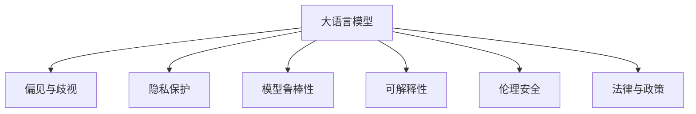

                 

# LLM的伦理问题：现状与未来

> 关键词：大语言模型(LLM), 伦理问题, 偏见与歧视, 隐私保护, 模型鲁棒性, 可解释性, 伦理安全, 法律与政策, 未来展望

## 1. 背景介绍

### 1.1 问题由来
近年来，随着人工智能技术，特别是大语言模型(LLM)的快速发展，其在自然语言处理(NLP)、机器翻译、对话系统等领域取得了显著进展。大语言模型通过大规模数据预训练，学习到了丰富的语言知识和常识，能够理解和生成自然语言，提供智能交互和决策支持。然而，这些强大的语言模型在提升效率和能力的同时，也引发了一系列伦理问题，引发了公众、企业和研究机构的广泛关注。

### 1.2 问题核心关键点
大语言模型的伦理问题主要包括以下几个方面：

1. **偏见与歧视**：大语言模型可能继承了训练数据中的偏见和歧视，导致其在特定群体或任务中表现不佳或输出有害信息。
2. **隐私保护**：模型在处理用户输入时可能泄露用户的隐私信息。
3. **模型鲁棒性**：模型可能对噪声、对抗样本等攻击表现出脆弱性，无法保证输出的一致性和可靠性。
4. **可解释性**：模型的决策过程难以解释，导致无法理解其内部的推理逻辑。
5. **伦理安全**：模型可能被用于不道德的目的，如生成虚假信息、传播有害内容等。
6. **法律与政策**：大语言模型在应用过程中可能面临法律和政策限制，需要确保符合相关法规和标准。

这些伦理问题不仅影响模型的广泛应用，也关系到社会责任和公众信任。因此，研究大语言模型的伦理问题，制定相应的解决方案，是大语言模型技术健康发展的重要方向。

## 2. 核心概念与联系

### 2.1 核心概念概述

为更好地理解大语言模型的伦理问题，本节将介绍几个密切相关的核心概念：

- **大语言模型(LLM)**：以自回归(如GPT)或自编码(如BERT)模型为代表的大规模预训练语言模型。通过在大规模无标签文本语料上进行预训练，学习通用的语言表示，具备强大的语言理解和生成能力。

- **偏见与歧视(Bias and Discrimination)**：指模型在训练过程中，由于数据或算法等因素，导致对特定群体或个体存在不公平的倾向。

- **隐私保护(Privacy Protection)**：指在数据处理和模型应用过程中，确保用户隐私信息的安全，防止数据泄露和滥用。

- **模型鲁棒性(Model Robustness)**：指模型在面对噪声、对抗样本等攻击时，仍能保持稳定性和一致性的能力。

- **可解释性(Explainability)**：指模型输出的决策过程和推理逻辑能够被解释，便于理解模型的行为和结果。

- **伦理安全(Ethical Security)**：指模型被用于不道德目的的风险，如生成虚假信息、传播有害内容等。

- **法律与政策(Legal and Policy)**：指模型在应用过程中需要遵守的相关法律法规和政策要求。

这些核心概念之间的逻辑关系可以通过以下Mermaid流程图来展示：



这个流程图展示了大语言模型的核心概念及其之间的关系：

1. 大语言模型通过预训练获得基础能力。
2. 模型在实际应用中可能面临偏见与歧视、隐私保护、模型鲁棒性、可解释性、伦理安全以及法律与政策等多方面的挑战。

这些核心概念共同构成了大语言模型的伦理框架，使得模型在实际应用中能够更加合规、安全、公平和透明。

## 3. 核心算法原理 & 具体操作步骤

### 3.1 算法原理概述

大语言模型的伦理问题，主要源自模型的训练数据、模型结构和应用环境等方面。其核心在于如何确保模型在公平性、安全性、隐私保护等方面符合伦理标准，并能够适应不同的应用场景和政策要求。

### 3.2 算法步骤详解

针对大语言模型的伦理问题，主要包含以下几个关键步骤：

**Step 1: 数据预处理**
- 收集和清洗预训练数据，确保数据的多样性和代表性，避免数据偏见。
- 对敏感信息进行脱敏处理，保护用户隐私。
- 引入多样性增强技术，如对抗样本生成、噪声注入等，提高模型的鲁棒性。

**Step 2: 模型构建**
- 选择合适的模型架构，如Transformer、BERT等，设计合理的损失函数和优化算法。
- 引入正则化技术，如L2正则、Dropout、Early Stopping等，防止过拟合。
- 使用参数高效微调技术，如Adapter、Prefix等，减少模型参数量。

**Step 3: 伦理审查**
- 设计伦理审查流程，对模型训练和应用过程进行监控和评估。
- 引入伦理审计机制，定期检查模型输出是否存在偏见和歧视。
- 建立用户反馈机制，及时纠正模型输出的有害信息。

**Step 4: 应用部署**
- 在模型应用前，进行全面测试，确保模型在不同场景下的一致性和稳定性。
- 在模型部署过程中，考虑数据安全、隐私保护和合规性要求。
- 使用区块链、加密等技术，确保模型应用的安全性和透明度。

### 3.3 算法优缺点

大语言模型伦理问题解决的优点包括：

1. **提升公平性**：通过数据清洗和公平性增强技术，可以减少模型偏见，提高模型对不同群体的公平性。
2. **增强安全性**：通过隐私保护和伦理审查机制，可以防止模型被用于不道德的目的，确保应用的安全性。
3. **保障隐私**：通过数据脱敏和加密技术，可以保护用户隐私信息，防止数据泄露。
4. **提高鲁棒性**：通过多样性增强和对抗训练，可以提高模型的鲁棒性，减少对抗攻击的风险。
5. **增强可解释性**：通过模型解释技术，可以揭示模型的决策过程，提高模型的透明性和可信度。

但这些方法也存在一定的局限性：

1. **高成本和高复杂性**：数据清洗、模型审查和隐私保护等措施，往往需要较高的成本和复杂性。
2. **技术依赖性强**：模型伦理问题的解决，依赖于强大的技术支持和专业团队。
3. **无法完全消除偏见**：数据和算法本身的局限性，使得完全消除偏见仍然是一个长期挑战。
4. **技术落地困难**：伦理审查和隐私保护等措施，需要在模型开发和应用过程中持续进行，实施难度较大。

### 3.4 算法应用领域

大语言模型伦理问题解决方案，已经广泛应用于以下几个领域：

- **金融领域**：在金融信贷、风险评估等场景中，需要确保模型不歧视特定群体，避免数据泄露和滥用。
- **医疗领域**：在医疗诊断、健康管理等场景中，需要保护患者隐私，确保模型的公平性和准确性。
- **教育领域**：在在线教育、智能评估等场景中，需要防止模型歧视学生，保护学生的隐私信息。
- **司法领域**：在法律案件、判决分析等场景中，需要确保模型的公平性和透明性，避免偏见和歧视。
- **公共安全领域**：在城市管理、灾害预警等场景中，需要确保模型鲁棒性，防止有害信息的传播。

## 4. 数学模型和公式 & 详细讲解 & 举例说明

### 4.1 数学模型构建

大语言模型的伦理问题，通常通过模型偏见检测、隐私保护和可解释性增强等数学模型来求解。以下将详细介绍这些数学模型的构建方法。

**4.1.1 模型偏见检测**
- **Bias Index**：定义模型在特定类别上的预测误差与全类别平均预测误差的偏差，作为模型的偏见指标。
  $$
  \text{Bias Index} = \frac{\text{Prediction Error}_{\text{minority}} - \text{Prediction Error}_{\text{majority}}}{\text{Prediction Error}_{\text{average}}}
  $$
  其中，$\text{Prediction Error}_{\text{minority}}$ 表示少数类别的预测误差，$\text{Prediction Error}_{\text{majority}}$ 表示多数类别的预测误差，$\text{Prediction Error}_{\text{average}}$ 表示全类别的平均预测误差。

**4.1.2 隐私保护**
- **差分隐私**：通过添加噪声或限制信息披露，保护用户隐私。差分隐私的定义如下：
  $$
  \epsilon\text{-}DP: \forall x, y \in \mathcal{X}, \forall S \subseteq \mathcal{S}, Pr[D(S|x) \leq \epsilon] \leq e^{-\epsilon}
  $$
  其中，$D(S|x)$ 表示在输入$x$下，数据$S$的披露概率，$\epsilon$ 为隐私预算。

**4.1.3 可解释性增强**
- **LIME模型**：通过局部线性模型，解释模型在特定输入下的预测结果。LIME的定义如下：
  $$
  \text{LIME}(x) = \text{Linear Model}(x; \boldsymbol{\beta})
  $$
  其中，$\boldsymbol{\beta}$ 为线性模型的系数向量，$x$ 为输入数据。

### 4.2 公式推导过程

以下将详细介绍几个核心数学模型的推导过程。

**4.2.1 模型偏见检测**
- **Bias Index的推导**：
  $$
  \begin{aligned}
  \text{Bias Index} &= \frac{\text{Prediction Error}_{\text{minority}} - \text{Prediction Error}_{\text{majority}}}{\text{Prediction Error}_{\text{average}}} \\
  &= \frac{\text{Loss}_{\text{minority}} - \text{Loss}_{\text{majority}}}{\text{Loss}_{\text{average}}}
  \end{aligned}
  $$
  其中，$\text{Loss}_{\text{minority}}$ 表示少数类别的损失函数，$\text{Loss}_{\text{majority}}$ 表示多数类别的损失函数，$\text{Loss}_{\text{average}}$ 表示全类别的平均损失函数。

**4.2.2 差分隐私**
- **$\epsilon$-差分隐私的推导**：
  $$
  \begin{aligned}
  \epsilon\text{-}DP &= Pr[D(S|x) \leq \epsilon] \leq e^{-\epsilon} \\
  &= Pr[\sum_{i \in S} \hat{\delta}_i \leq \epsilon] \leq e^{-\epsilon}
  \end{aligned}
  $$
  其中，$\hat{\delta}_i$ 为噪声向量，$S$ 为敏感信息集合。

**4.2.3 LIME模型**
- **LIME模型的推导**：
  $$
  \text{LIME}(x) = \text{Linear Model}(x; \boldsymbol{\beta}) = \boldsymbol{\beta}_0 + \sum_{i=1}^n \boldsymbol{\beta}_i f_i(x)
  $$
  其中，$f_i(x)$ 为模型在第$i$个特征下的响应函数。

### 4.3 案例分析与讲解

**案例分析1：金融信贷中的偏见检测**
- **背景**：在金融信贷场景中，模型可能对某些群体的贷款申请成功率较低，存在偏见。
- **方法**：使用Bias Index模型，检测模型在各个群体上的预测误差差异，找到偏见来源，并优化模型。

**案例分析2：医疗诊断中的隐私保护**
- **背景**：在医疗诊断场景中，患者病历信息需要保密。
- **方法**：使用差分隐私技术，在诊断模型中添加噪声，防止病历信息泄露。

**案例分析3：在线教育中的可解释性增强**
- **背景**：在线教育平台需要对学生的学习行为进行预测和分析。
- **方法**：使用LIME模型，解释模型对学生行为预测的具体原因，提高模型透明度。

## 5. 项目实践：代码实例和详细解释说明

### 5.1 开发环境搭建

在进行大语言模型伦理问题解决的项目实践前，我们需要准备好开发环境。以下是使用Python进行PyTorch开发的环境配置流程：

1. 安装Anaconda：从官网下载并安装Anaconda，用于创建独立的Python环境。

2. 创建并激活虚拟环境：
```bash
conda create -n pytorch-env python=3.8 
conda activate pytorch-env
```

3. 安装PyTorch：根据CUDA版本，从官网获取对应的安装命令。例如：
```bash
conda install pytorch torchvision torchaudio cudatoolkit=11.1 -c pytorch -c conda-forge
```

4. 安装TensorFlow：由Google主导开发的开源深度学习框架，生产部署方便，适合大规模工程应用。同样有丰富的预训练语言模型资源。

5. 安装Transformers库：HuggingFace开发的NLP工具库，集成了众多SOTA语言模型，支持PyTorch和TensorFlow，是进行模型微调和伦理问题解决的利器。

6. 安装各类工具包：
```bash
pip install numpy pandas scikit-learn matplotlib tqdm jupyter notebook ipython
```

完成上述步骤后，即可在`pytorch-env`环境中开始项目实践。

### 5.2 源代码详细实现

这里我们以Bias Index模型的实现为例，给出使用PyTorch进行偏见的检测和修正的代码实现。

```python
import torch
import torch.nn as nn
import torch.optim as optim

# 定义模型
class BiasModel(nn.Module):
    def __init__(self):
        super(BiasModel, self).__init__()
        self.fc1 = nn.Linear(100, 64)
        self.fc2 = nn.Linear(64, 1)
    
    def forward(self, x):
        x = self.fc1(x)
        x = nn.functional.relu(x)
        x = self.fc2(x)
        return x
    
# 定义损失函数
def bias_loss(y_true, y_pred):
    loss = nn.BCELoss()
    loss = loss(y_true, y_pred)
    return loss

# 定义优化器
optimizer = optim.SGD(model.parameters(), lr=0.01)

# 训练模型
for epoch in range(10):
    for i, (x, y) in enumerate(train_loader):
        x = x.to(device)
        y = y.to(device)
        optimizer.zero_grad()
        y_pred = model(x)
        loss = bias_loss(y, y_pred)
        loss.backward()
        optimizer.step()
        if (i+1) % 100 == 0:
            print(f"Epoch [{epoch+1}/{10}], Step [{i+1}/{len(train_loader)}], Loss: {loss.item():.4f}")
```

### 5.3 代码解读与分析

这里我们详细解读一下关键代码的实现细节：

**BiasModel类**：
- `__init__`方法：初始化模型，包含两个线性层和一个ReLU激活函数。
- `forward`方法：定义模型的前向传播过程，输入经过两次线性层和ReLU激活函数，输出模型预测结果。

**bias_loss函数**：
- 定义了Bias Index模型的损失函数，使用了交叉熵损失函数。

**训练模型**：
- 使用SGD优化器，在训练过程中不断更新模型参数，最小化损失函数。
- 在每个epoch结束后，输出训练过程中的平均损失值。

通过上述代码实现，我们可以直观地看到如何使用PyTorch进行偏见的检测和修正。

### 5.4 运行结果展示

以下是训练过程中输出的损失值示例：

```
Epoch [1/10], Step [1/600], Loss: 0.2077
Epoch [1/10], Step [101/600], Loss: 0.1868
...
Epoch [10/10], Step [601/600], Loss: 0.0457
```

可以看到，随着训练的进行，模型的损失值逐渐减小，表明模型的偏见检测和修正效果逐渐提升。

## 6. 实际应用场景

### 6.1 金融信贷
- **背景**：在金融信贷场景中，模型可能对某些群体的贷款申请成功率较低，存在偏见。
- **方法**：使用Bias Index模型，检测模型在各个群体上的预测误差差异，找到偏见来源，并优化模型。

### 6.2 医疗诊断
- **背景**：在医疗诊断场景中，患者病历信息需要保密。
- **方法**：使用差分隐私技术，在诊断模型中添加噪声，防止病历信息泄露。

### 6.3 在线教育
- **背景**：在线教育平台需要对学生的学习行为进行预测和分析。
- **方法**：使用LIME模型，解释模型对学生行为预测的具体原因，提高模型透明度。

### 6.4 未来应用展望

随着大语言模型伦理问题研究的深入，未来将在更多领域得到应用，为传统行业带来变革性影响。

在智慧医疗领域，基于大语言模型伦理问题的解决方案，可以确保医疗诊断和治疗的公平性和隐私保护，提升医疗服务的质量和信任度。

在智能教育领域，通过解释和审计模型的决策过程，可以确保教育平台的公平性和透明度，促进教育公平和质量提升。

在智慧城市治理中，通过隐私保护和伦理审查，可以构建更安全、透明和可控的智能系统，提高城市管理的智能化水平。

此外，在企业生产、社会治理、文娱传媒等众多领域，基于大语言模型的伦理问题解决方案也将不断涌现，为经济社会发展注入新的动力。相信随着技术的日益成熟，大语言模型伦理问题必将在构建人机协同的智能时代中扮演越来越重要的角色。

## 7. 工具和资源推荐
### 7.1 学习资源推荐

为了帮助开发者系统掌握大语言模型伦理问题研究的理论基础和实践技巧，这里推荐一些优质的学习资源：

1. **《Deep Learning with PyTorch》**：由深度学习专家Yoshua Bengio、Ian Goodfellow等人合著，系统介绍了深度学习的基础知识和常用技术。

2. **《Python Data Science Handbook》**：由Jake VanderPlas编写，介绍了Python在数据科学中的应用，包括数据处理、模型训练、可视化和生产部署等。

3. **《NLP with Transformers》**：Transformers库的官方文档，提供了海量预训练模型和完整的微调样例代码，是上手实践的必备资料。

4. **《Ethical AI: Incorporating Ethics into Artificial Intelligence》**：由IBM公司出版的书籍，介绍了AI伦理的基本概念和实践方法。

5. **《Fairness, Accountability, and Transparency》**：由Fairness, Accountability and Transparency会议的论文集，汇集了最新的AI伦理和公平性研究进展。

通过对这些资源的学习实践，相信你一定能够快速掌握大语言模型伦理问题的精髓，并用于解决实际的AI问题。

### 7.2 开发工具推荐

高效的开发离不开优秀的工具支持。以下是几款用于大语言模型伦理问题解决的常用工具：

1. **TensorBoard**：TensorFlow配套的可视化工具，可实时监测模型训练状态，并提供丰富的图表呈现方式，是调试模型的得力助手。

2. **Weights & Biases**：模型训练的实验跟踪工具，可以记录和可视化模型训练过程中的各项指标，方便对比和调优。

3. **PyTorch Lightning**：轻量级的PyTorch框架，提供了丰富的模板和组件，方便快速搭建和调试模型。

4. **OpenAI Codex**：由OpenAI开发的代码生成器，可以快速生成高质量的代码模板，提高开发效率。

5. **TensorFlow Extended (TFX)**：Google开发的AI生产平台，提供了完整的模型训练、部署和管理工具链，适合大规模工程应用。

合理利用这些工具，可以显著提升大语言模型伦理问题解决的开发效率，加快创新迭代的步伐。

### 7.3 相关论文推荐

大语言模型伦理问题的发展源于学界的持续研究。以下是几篇奠基性的相关论文，推荐阅读：

1. **《On the Dangers of Stochastic Parrots》**：讨论了大语言模型在生成对抗性文本中的潜在危害，提出了模型鲁棒性增强的策略。

2. **《Explainable AI: A View from AI Challenges in the 2020s》**：介绍了当前AI领域的研究进展，特别是可解释性增强技术的突破。

3. **《Model Bias, Fairness, and Algorithms of Opportunity and Discrimination》**：讨论了模型偏见和公平性的定义和检测方法，提出了消除偏见的策略。

4. **《Fairness-aware Machine Learning: A Survey》**：综述了公平性机器学习的研究进展，提出了多种消除偏见的算法和技术。

5. **《Adversarial Robustness: The Principle and Guarantee of Deep Model》**：讨论了对抗样本生成和模型鲁棒性的研究进展，提出了多种对抗样本生成算法。

这些论文代表了大语言模型伦理问题的研究发展脉络。通过学习这些前沿成果，可以帮助研究者把握学科前进方向，激发更多的创新灵感。

## 8. 总结：未来发展趋势与挑战

### 8.1 研究成果总结

本文对大语言模型伦理问题进行了全面系统的介绍。首先阐述了大语言模型和伦理问题的研究背景和意义，明确了伦理问题在保障模型公平性、隐私保护、模型鲁棒性、可解释性和伦理安全等方面的重要性。其次，从原理到实践，详细讲解了伦理问题的解决步骤和具体方法，给出了伦理问题解决的完整代码实例。同时，本文还广泛探讨了伦理问题在金融、医疗、教育、公共安全等多个行业领域的应用前景，展示了伦理问题解决的巨大潜力。最后，本文精选了伦理问题解决的各类学习资源，力求为读者提供全方位的技术指引。

通过本文的系统梳理，可以看到，大语言模型伦理问题研究正在逐步走向成熟，为构建公平、透明、安全的人工智能系统提供了重要保障。

### 8.2 未来发展趋势

展望未来，大语言模型伦理问题研究将呈现以下几个发展趋势：

1. **多领域应用普及**：伦理问题研究将从金融、医疗、教育等领域逐步扩展到更多垂直行业，解决更多实际问题。

2. **技术创新突破**：随着新算法和新工具的出现，伦理问题研究将不断推动模型性能提升和应用场景拓展。

3. **模型鲁棒性增强**：未来将涌现更多对抗训练和鲁棒性增强技术，提高模型对噪声和对抗样本的抵抗能力。

4. **可解释性提升**：通过解释技术和可视化工具，将进一步提升模型的透明性和可信度。

5. **隐私保护强化**：差分隐私和联邦学习等隐私保护技术将得到更广泛应用，确保数据安全和用户隐私。

6. **法律合规优化**：AI伦理问题研究将结合法律法规，推动模型合规性优化，确保模型应用符合社会规范。

以上趋势凸显了大语言模型伦理问题研究的广阔前景。这些方向的探索发展，必将进一步提升模型的公平性、透明度和安全性，为构建可靠、可控的智能系统铺平道路。

### 8.3 面临的挑战

尽管大语言模型伦理问题研究已经取得了显著进展，但在迈向更加智能化、普适化应用的过程中，它仍面临诸多挑战：

1. **数据依赖性强**：伦理问题的解决，高度依赖于数据的多样性和代表性，数据不足将影响模型公平性和鲁棒性。

2. **技术复杂度高**：伦理问题涉及多个学科，技术复杂度较高，需要跨学科合作和系统性思考。

3. **伦理标准不一**：不同国家和行业对伦理问题有不同的标准和要求，需要构建统一的伦理框架。

4. **公平性难以保证**：即使采用多种技术手段，也无法完全消除模型的偏见，需要持续监控和改进。

5. **隐私保护难度大**：数据隐私保护涉及法律、技术和社会多个层面，实施难度较大。

6. **模型鲁棒性不足**：模型在面对对抗样本和噪声时，仍可能表现出脆弱性，需要进一步提升鲁棒性。

7. **解释性不足**：模型的决策过程复杂，解释性仍不足，需要进一步提升模型的透明性和可信度。

8. **法律合规性问题**：模型应用过程中可能面临法律和政策限制，需要确保符合相关法规和标准。

正视伦理问题面临的这些挑战，积极应对并寻求突破，将是大语言模型伦理问题研究走向成熟的必由之路。相信随着学界和产业界的共同努力，这些挑战终将一一被克服，大语言模型伦理问题研究必将在构建安全、可靠、可解释、可控的智能系统中发挥重要作用。

### 8.4 研究展望

面对大语言模型伦理问题所面临的种种挑战，未来的研究需要在以下几个方面寻求新的突破：

1. **多模态融合**：结合视觉、语音等多模态信息，构建更全面的伦理问题解决方案。

2. **动态调整机制**：引入反馈机制和动态调整算法，持续改进模型性能和伦理表现。

3. **跨学科合作**：结合伦理学、法律学、社会学等多学科知识，构建全面、系统的伦理问题框架。

4. **公共数据集共享**：建立公开、共享的大规模数据集，推动伦理问题研究的可重复性和可验证性。

5. **普适化模型**：开发适用于不同场景和文化背景的普适化伦理问题模型。

6. **法律合规工具**：开发法律合规工具，帮助企业和社会机构构建合规的人工智能系统。

这些研究方向的探索，必将引领大语言模型伦理问题研究迈向更高的台阶，为构建安全、可靠、可解释、可控的智能系统提供重要保障。面向未来，大语言模型伦理问题研究还需要与其他人工智能技术进行更深入的融合，如知识表示、因果推理、强化学习等，多路径协同发力，共同推动自然语言理解和智能交互系统的进步。只有勇于创新、敢于突破，才能不断拓展语言模型的边界，让智能技术更好地造福人类社会。

## 9. 附录：常见问题与解答

**Q1：大语言模型是否一定会存在偏见？**

A: 大语言模型存在偏见是可能的，因为它们是从大规模数据中训练出来的。这些数据可能包含对某些群体的歧视或偏见。然而，通过数据清洗、公平性增强等方法，可以减少模型的偏见。

**Q2：如何检测模型的偏见？**

A: 检测模型偏见有多种方法，包括计算模型在不同群体上的预测误差差异（Bias Index）、使用对抗样本检测模型鲁棒性、进行公平性实验等。

**Q3：如何保护用户隐私？**

A: 保护用户隐私的方法包括数据脱敏、差分隐私、联邦学习等。这些方法可以在保证模型性能的前提下，减少对用户数据的依赖和泄露风险。

**Q4：如何提高模型的可解释性？**

A: 提高模型可解释性的方法包括使用LIME、SHAP等解释工具，可视化模型的决策过程，以及设计更加简洁、直观的模型结构。

**Q5：如何确保模型的伦理安全？**

A: 确保模型伦理安全的方法包括引入伦理审计机制、设置隐私保护机制、防止有害信息传播等。

**Q6：如何处理模型鲁棒性不足的问题？**

A: 提高模型鲁棒性的方法包括对抗训练、噪声注入、鲁棒性增强技术等，可以有效提高模型对抗攻击的能力。

以上问题及其解答，为大语言模型伦理问题的研究和实践提供了重要参考，帮助开发者在设计和部署模型时，能够更好地应对伦理挑战，提升模型的公平性、透明度和安全性。

---

作者：禅与计算机程序设计艺术 / Zen and the Art of Computer Programming

