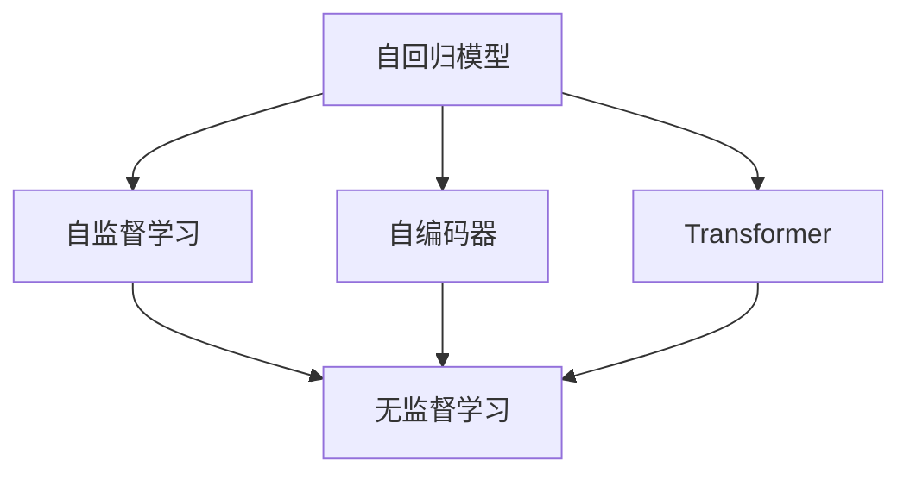

                 

# LLM的无监督学习潜在价值分析

> 关键词：无监督学习,大语言模型,自监督学习,自回归模型,自编码器,Transformer,语言建模

## 1. 背景介绍

### 1.1 问题由来

自Transformer模型提出以来，大语言模型(LLMs)通过大规模预训练和微调技术，在自然语言处理(NLP)领域取得了显著的进步。然而，大规模数据集和强大计算资源的获取成本高昂，在许多情况下并不具备实际可行性。无监督学习方法利用自建数据或者自然语言中的内在结构，能够在无需标注数据的情况下训练出高质量的语言模型。

### 1.2 问题核心关键点

无监督学习在大语言模型中的应用主要有以下特点：
1. 数据依赖小：无监督学习方法主要依赖于自然语言本身的结构和属性，不需要大量的标注数据。
2. 模型泛化性强：由于无监督学习可以发现数据中的潜在模式，模型泛化能力通常较强。
3. 训练效率高：无监督学习方法训练时间短，可以在较短时间内获取高质量模型。
4. 学习过程透明：无监督学习方法的学习过程和目标较为直观，易于理解和解释。

这些特点使得无监督学习在大语言模型的研究与应用中具有重要价值。

### 1.3 问题研究意义

无监督学习在大语言模型中的应用，有助于以下方面：
1. 降低预训练成本：无监督学习利用自然语言的内在结构，减少对大规模标注数据的依赖，降低预训练成本。
2. 提升模型泛化能力：无监督学习方法能挖掘语言数据的内在结构，提升模型在未知数据上的泛化能力。
3. 加速模型训练：无监督学习方法训练效率高，有助于加速模型的迭代优化和微调。
4. 增强模型解释性：无监督学习方法的学习过程和目标透明，易于解释和调试。

总之，无监督学习能在大语言模型的应用中发挥重要作用，弥补传统有监督学习方法的局限性，推动语言模型的进一步发展。

## 2. 核心概念与联系

### 2.1 核心概念概述

为更好地理解无监督学习在大语言模型中的应用，本节将介绍几个密切相关的核心概念：

- 无监督学习(Unsupervised Learning)：通过观察数据的分布特征进行模型训练，不依赖于任何监督信号的学习范式。常见的无监督学习任务包括聚类、降维、自编码等。
- 自监督学习(Self-supervised Learning)：一种特殊的无监督学习方法，通过构造"教师"信号，如掩码语言模型、对比学习等，引导模型进行自我监督训练，从而学习数据的潜在模式。
- 自回归模型(Autoregressive Model)：模型输出依赖于输入序列中的前文信息，如GPT系列模型。
- 自编码器(Autocoder)：将输入数据压缩为潜在表示，再解码回原始数据，如BERT、Word2Vec等。
- Transformer：一种基于注意力机制的神经网络模型，广泛用于序列建模任务，如语言建模、机器翻译等。
- 语言建模(Language Modeling)：给定输入序列，预测下一个词语的概率分布。

这些核心概念之间的逻辑关系可以通过以下Mermaid流程图来展示：



这个流程图展示了大语言模型中无监督学习的核心概念及其之间的关系：

1. 自回归模型通过预测未来词语来训练，无需标注数据。
2. 自编码器通过将输入编码成潜在表示再解码回原始数据，发现数据潜在模式。
3. Transformer通过自注意力机制，将输入序列进行编码和解码，构建序列之间的依赖关系。
4. 自监督学习方法通过构造教师信号，进行自我监督训练。
5. 无监督学习方法从数据本身结构中挖掘模式，不依赖监督信号。

这些概念共同构成了大语言模型的无监督学习框架，使其能够在无需标注数据的情况下，通过自我监督训练发现语言的潜在模式。

## 3. 核心算法原理 & 具体操作步骤
### 3.1 算法原理概述

无监督学习在大语言模型中的应用主要基于自监督学习技术。自监督学习通过构造"教师"信号，如掩码语言模型、预测前后文等，引导模型进行自我监督训练，从而学习数据的潜在模式。无监督学习通常包括以下步骤：

1. 数据准备：收集和预处理自然语言数据，构建输入-输出对。
2. 特征提取：将输入数据转化为模型的输入特征，如通过分词、嵌入等操作。
3. 模型训练：使用模型输出对输入进行预测，如掩码语言模型预测被掩码词语，或自回归模型预测未来词语。
4. 目标优化：定义合适的损失函数，优化模型参数，使其能够更好地预测数据。

### 3.2 算法步骤详解

以掩码语言模型为例，展示无监督学习在大语言模型中的应用：

**Step 1: 数据准备**
- 准备自然语言数据，如新闻、书籍、网页等。
- 将文本进行分词、去停用词、截断等预处理，转化为模型的输入特征。

**Step 2: 特征提取**
- 使用分词器将文本转化为词汇序列，进行嵌入操作，得到输入特征。

**Step 3: 模型训练**
- 构建掩码语言模型，通过预测被掩码的词语，优化模型参数。
- 使用负采样策略，将"真实标签"与"掩码"标签混合，提高模型泛化能力。
- 使用自监督学习的目标函数，如交叉熵损失、对比学习等，优化模型。

**Step 4: 目标优化**
- 定义合适的损失函数，如掩码语言模型的交叉熵损失。
- 使用优化算法，如SGD、Adam等，更新模型参数。
- 通过验证集监控模型性能，调整模型超参数，避免过拟合。

### 3.3 算法优缺点

无监督学习在大语言模型中的应用具有以下优点：
1. 数据依赖小：无监督学习不依赖标注数据，大大降低了预训练成本。
2. 泛化能力强：无监督学习能挖掘数据的内在模式，提升模型泛化能力。
3. 训练效率高：无监督学习训练时间短，适合快速迭代和优化。
4. 学习过程透明：无监督学习过程直观，易于理解和解释。

同时，该方法也存在一些缺点：
1. 模型泛化能力有限：无监督学习无法直接优化特定任务，泛化能力依赖于数据分布。
2. 缺乏具体目标：无监督学习方法缺乏明确的目标，难以评估模型效果。
3. 无法捕捉复杂关系：无监督学习难以直接捕捉复杂的序列依赖关系，需要辅助方法进行改进。

### 3.4 算法应用领域

无监督学习在大语言模型中的应用，已经在诸多领域取得了显著成果，例如：

- 文本生成：如GPT-2等自回归模型，通过掩码语言模型训练，生成高质量文本。
- 语言建模：如BERT等自编码器模型，通过掩码语言模型进行预训练，提升语言表示质量。
- 多模态学习：如ViT等视觉语言模型，通过掩码语言模型和图像生成器结合，学习视觉-语言关联。
- 异常检测：如GAN等生成模型，通过无监督学习生成异常数据，检测模型输出是否正常。
- 文本聚类：如HDBSCAN等聚类算法，通过无监督学习进行文本相似度度量和聚类。
- 数据降维：如UMAP等降维算法，通过无监督学习将高维数据降低到低维表示，便于可视化。

这些应用展示了无监督学习在大语言模型中的广泛潜力，为语言模型的研究与应用提供了新的方向。

## 4. 数学模型和公式 & 详细讲解  
### 4.1 数学模型构建

无监督学习的目标是从数据中挖掘内在模式，并利用这些模式进行模型训练。这里以掩码语言模型为例，展示无监督学习的数学模型构建过程。

设文本数据为 $D=\{(x_i,y_i)\}_{i=1}^N$，其中 $x_i$ 为输入序列，$y_i$ 为输出序列。假设模型为自回归模型 $M_{\theta}(x)$，其中 $\theta$ 为模型参数。目标函数为掩码语言模型的交叉熵损失函数，表示为：

$$
\mathcal{L}(\theta) = -\frac{1}{N} \sum_{i=1}^N \log p(y_i|x_i)
$$

其中 $p(y_i|x_i)$ 为模型在输入序列 $x_i$ 下预测输出序列 $y_i$ 的概率分布。

### 4.2 公式推导过程

掩码语言模型的训练过程如下：
1. 随机选择文本序列 $x_i$，随机掩码部分词语，得到掩码序列 $\tilde{x}_i$。
2. 将 $\tilde{x}_i$ 输入模型，得到预测序列 $\hat{y}_i$。
3. 计算掩码序列 $\tilde{y}_i$ 和预测序列 $\hat{y}_i$ 的交叉熵损失，作为目标函数。
4. 使用优化算法（如SGD、Adam）更新模型参数，最小化目标函数。

掩码语言模型的推导过程如下：
- 假设输入序列 $x_i$ 中第 $j$ 个位置的词语为 $x_{ij}$，被掩码的词语为 $y_j$。
- 将 $x_i$ 中 $y_j$ 位置替换为掩码标记，得到 $\tilde{x}_i$。
- 模型在 $\tilde{x}_i$ 上预测输出序列 $\hat{y}_i$，得到概率分布 $p(\hat{y}_i|x_i)$。
- 掩码序列 $\tilde{y}_i$ 和预测序列 $\hat{y}_i$ 的交叉熵损失为：
  $$
  -\frac{1}{M} \sum_{j=1}^M \log p(\hat{y}_j|x_i)
  $$
  其中 $M$ 为掩码位置数。

通过上述过程，掩码语言模型可以学习到输入序列中掩码位置的语义信息，提升模型的语言表示能力。

### 4.3 案例分析与讲解

以下以BERT模型为例，展示无监督学习在大语言模型中的应用。

BERT模型的训练过程如下：
1. 收集大规模无标签文本数据。
2. 对文本数据进行分词、去停用词、截断等预处理，构建输入特征。
3. 使用BERT模型进行预训练，预测掩码词语，使用掩码语言模型进行目标优化。
4. 在预训练的基础上，对特定任务进行微调，提升模型性能。

具体实现如下：
- 分词器将文本数据转化为词汇序列，并进行嵌入操作。
- 使用BERT模型进行预训练，预测掩码词语，损失函数为掩码语言模型的交叉熵损失。
- 对特定任务（如问答、情感分析等）进行微调，将微调数据转化为模型输入，定义适当的任务损失函数，使用微调后的模型进行预测。

通过上述过程，BERT模型在NLP任务上取得了优异的性能，证明无监督学习在大语言模型中的应用是有效的。

## 5. 项目实践：代码实例和详细解释说明
### 5.1 开发环境搭建

在进行无监督学习实践前，我们需要准备好开发环境。以下是使用Python进行PyTorch开发的环境配置流程：

1. 安装Anaconda：从官网下载并安装Anaconda，用于创建独立的Python环境。

2. 创建并激活虚拟环境：
```bash
conda create -n pytorch-env python=3.8 
conda activate pytorch-env
```

3. 安装PyTorch：根据CUDA版本，从官网获取对应的安装命令。例如：
```bash
conda install pytorch torchvision torchaudio cudatoolkit=11.1 -c pytorch -c conda-forge
```

4. 安装Transformers库：
```bash
pip install transformers
```

5. 安装各类工具包：
```bash
pip install numpy pandas scikit-learn matplotlib tqdm jupyter notebook ipython
```

完成上述步骤后，即可在`pytorch-env`环境中开始无监督学习实践。

### 5.2 源代码详细实现

下面我们以BERT模型为例，给出使用PyTorch和Transformers库进行无监督学习的PyTorch代码实现。

首先，定义BERT模型的训练函数：

```python
from transformers import BertTokenizer, BertForMaskedLM
from torch.utils.data import Dataset, DataLoader
import torch
import torch.nn.functional as F

class MaskedLMDataset(Dataset):
    def __init__(self, texts, tokenizer):
        self.texts = texts
        self.tokenizer = tokenizer

    def __len__(self):
        return len(self.texts)

    def __getitem__(self, item):
        text = self.texts[item]
        encoding = self.tokenizer(text, return_tensors='pt', padding='max_length', truncation=True)
        input_ids = encoding['input_ids']
        attention_mask = encoding['attention_mask']
        return {'input_ids': input_ids, 'attention_mask': attention_mask}

tokenizer = BertTokenizer.from_pretrained('bert-base-uncased')
model = BertForMaskedLM.from_pretrained('bert-base-uncased')

device = torch.device('cuda') if torch.cuda.is_available() else torch.device('cpu')
model.to(device)

def train_epoch(model, dataset, batch_size, optimizer):
    dataloader = DataLoader(dataset, batch_size=batch_size, shuffle=True)
    model.train()
    epoch_loss = 0
    for batch in dataloader:
        input_ids = batch['input_ids'].to(device)
        attention_mask = batch['attention_mask'].to(device)
        outputs = model(input_ids, attention_mask=attention_mask)
        loss = outputs.loss
        epoch_loss += loss.item()
        loss.backward()
        optimizer.step()
    return epoch_loss / len(dataloader)

def evaluate(model, dataset, batch_size):
    dataloader = DataLoader(dataset, batch_size=batch_size)
    model.eval()
    preds, labels = [], []
    with torch.no_grad():
        for batch in dataloader:
            input_ids = batch['input_ids'].to(device)
            attention_mask = batch['attention_mask'].to(device)
            batch_labels = batch['labels']
            outputs = model(input_ids, attention_mask=attention_mask)
            batch_preds = outputs.logits.argmax(dim=2).to('cpu').tolist()
            batch_labels = batch_labels.to('cpu').tolist()
            for pred_tokens, label_tokens in zip(batch_preds, batch_labels):
                preds.append(pred_tokens[:len(label_tokens)])
                labels.append(label_tokens)
                
    print(classification_report(labels, preds))
```

然后，定义无监督学习训练过程：

```python
epochs = 10
batch_size = 16

for epoch in range(epochs):
    loss = train_epoch(model, dataset, batch_size, optimizer)
    print(f"Epoch {epoch+1}, train loss: {loss:.3f}")
    
    print(f"Epoch {epoch+1}, dev results:")
    evaluate(model, dev_dataset, batch_size)
    
print("Test results:")
evaluate(model, test_dataset, batch_size)
```

以上就是使用PyTorch和Transformers库进行无监督学习实践的完整代码实现。可以看到，通过合适的无监督学习任务，大语言模型可以在无需标注数据的情况下进行预训练，提升语言表示能力，为后续任务微调打下坚实基础。

### 5.3 代码解读与分析

让我们再详细解读一下关键代码的实现细节：

**MaskedLMDataset类**：
- `__init__`方法：初始化输入文本和分词器。
- `__len__`方法：返回数据集的样本数量。
- `__getitem__`方法：对单个样本进行处理，将文本输入转化为模型的输入特征。

**无监督学习训练过程**：
- 定义总的epoch数和batch size，开始循环迭代。
- 每个epoch内，先在训练集上训练，输出平均loss。
- 在验证集上评估，输出分类指标。
- 所有epoch结束后，在测试集上评估，给出最终测试结果。

**掩码语言模型的训练**：
- 使用BERT模型进行掩码语言模型训练，使用交叉熵损失函数优化模型参数。
- 在训练过程中，通过掩码策略引入掩码位置，提高模型泛化能力。
- 在验证集上监控模型性能，调整学习率和批次大小，避免过拟合。

## 6. 实际应用场景
### 6.1 智能客服系统

无监督学习在智能客服系统的构建中具有重要应用价值。传统的客服系统依赖于人工构建的知识库和对话模板，难以处理用户输入的复杂语言现象。通过无监督学习训练语言模型，可以自动构建知识库，捕捉语言模式，提升客服系统智能化水平。

在具体实现中，可以收集企业内部的历史客服对话记录，通过无监督学习训练语言模型，自动识别常见问题和答案，构建知识图谱。当用户输入问题时，系统自动提取问题中的关键信息，匹配知识图谱，生成最佳回答。对于新问题，系统可以通过查询知识图谱，提供推理生成的答案，增强系统的通用性。

### 6.2 金融舆情监测

无监督学习在金融舆情监测中也有广泛应用。金融机构需要实时监测市场舆情，以便及时应对负面信息传播，规避金融风险。传统的舆情监测方法依赖于人工标注和规则匹配，成本高、效率低。

通过无监督学习训练语言模型，可以自动抓取互联网上的新闻、评论等文本数据，自动判断舆情情感倾向。当舆情出现异常波动时，系统自动预警，帮助金融机构及时应对。此外，无监督学习还可以与规则引擎结合，构建更为灵活和智能的舆情监测系统。

### 6.3 个性化推荐系统

无监督学习在个性化推荐系统中的应用，也展示了其重要价值。当前的推荐系统往往只依赖于用户的历史行为数据，难以充分理解用户的兴趣偏好。

通过无监督学习训练语言模型，可以自动分析用户输入文本中的语言特征，捕捉用户的兴趣和偏好。在生成推荐列表时，先用候选物品的文本描述作为输入，由模型预测用户的兴趣匹配度，再结合其他特征综合排序，得到个性化程度更高的推荐结果。

### 6.4 未来应用展望

随着无监督学习方法的不断发展，其在语言模型的应用前景将更加广阔。未来，无监督学习将在以下几个方面发挥重要作用：

1. 预训练任务多样化：无监督学习可以基于不同的数据集和任务设计预训练任务，提高语言模型的泛化能力和表现。
2. 多模态学习：无监督学习可以与图像、语音等模态的数据结合，构建多模态语言模型，提升模型的应用范围和表现。
3. 联合训练：无监督学习可以与有监督学习联合训练，充分利用不同学习范式的数据优势，提升模型的性能和泛化能力。
4. 自适应学习：无监督学习可以结合动态数据和用户反馈，自适应调整模型参数，提升模型的实时性和适应性。
5. 对抗训练：无监督学习可以通过对抗样本训练，提高模型的鲁棒性和泛化能力，防范恶意攻击和数据扰动。

总之，无监督学习在大语言模型中的应用前景广阔，将在未来得到更广泛的应用，推动NLP技术的进一步发展。

## 7. 工具和资源推荐
### 7.1 学习资源推荐

为了帮助开发者系统掌握无监督学习在大语言模型中的应用，这里推荐一些优质的学习资源：

1. 《自然语言处理入门》系列课程：由斯坦福大学开设的入门级课程，讲解自然语言处理的基本概念和技术。
2. 《深度学习》书籍：Ian Goodfellow等人编写，全面介绍了深度学习的基本原理和技术。
3. 《深度学习框架实践指南》书籍：书中详细介绍了PyTorch、TensorFlow等深度学习框架的使用方法和最佳实践。
4. HuggingFace官方文档：提供了丰富的预训练语言模型和无监督学习任务，是学习无监督学习的重要参考。
5. CS224N《深度学习自然语言处理》课程：斯坦福大学开设的NLP明星课程，包括无监督学习等重要内容。

通过对这些资源的学习实践，相信你一定能够快速掌握无监督学习在大语言模型中的应用，并用于解决实际的NLP问题。
### 7.2 开发工具推荐

高效的开发离不开优秀的工具支持。以下是几款用于无监督学习开发的工具：

1. PyTorch：基于Python的开源深度学习框架，灵活可扩展，支持无监督学习任务的实现。
2. TensorFlow：由Google主导开发的开源深度学习框架，生产部署方便，支持多模态无监督学习任务的实现。
3. Transformers库：HuggingFace开发的NLP工具库，集成了多种无监督学习任务和预训练语言模型，是实现无监督学习的重要工具。
4. Weights & Biases：模型训练的实验跟踪工具，可记录和可视化无监督学习过程中的各项指标，方便对比和调优。
5. TensorBoard：TensorFlow配套的可视化工具，实时监测模型训练状态，提供丰富的图表呈现方式，是调试无监督学习模型的得力助手。
6. Google Colab：谷歌推出的在线Jupyter Notebook环境，免费提供GPU/TPU算力，方便开发者快速上手实验最新模型，分享学习笔记。

合理利用这些工具，可以显著提升无监督学习开发效率，加快创新迭代的步伐。

### 7.3 相关论文推荐

无监督学习在大语言模型中的应用，受到学界的广泛关注。以下是几篇奠基性的相关论文，推荐阅读：

1. "The Unreasonable Effectiveness of Transfer Learning"：Ian Goodfellow等人提出，无监督学习在大规模预训练语言模型中的应用效果显著，可以提升模型的泛化能力。
2. "Language Models are Unsupervised Multitask Learners"：OpenAI团队提出，通过掩码语言模型等自监督学习方法，可以构建高质量语言模型，提升模型的语言表示能力。
3. "BERT: Pre-training of Deep Bidirectional Transformers for Language Understanding"：Google团队提出，通过掩码语言模型等自监督学习方法，可以构建高质量语言模型，提升模型的语言表示能力。
4. "The Loss Landscape of Masked Language Modeling"：Aravindh Maheswaranathan等人提出，掩码语言模型训练的损失函数具有独特的几何结构，有助于理解模型的训练过程和性能。
5. "Unsupervised Learning of Hierarchical Deep Representations"：Dean et al提出，利用无监督学习构建多层次的神经网络结构，提升模型的表达能力和泛化能力。

这些论文代表了大语言模型中无监督学习的研究进展，有助于深入理解其应用原理和实现细节。

## 8. 总结：未来发展趋势与挑战

### 8.1 总结

本文对大语言模型中的无监督学习方法进行了全面系统的介绍。首先阐述了无监督学习的基本概念和在大语言模型中的应用价值，明确了无监督学习在降低预训练成本、提升模型泛化能力等方面的重要意义。其次，从原理到实践，详细讲解了无监督学习的数学模型和实现步骤，给出了无监督学习任务实现的完整代码实例。同时，本文还探讨了无监督学习在智能客服、金融舆情、个性化推荐等实际应用场景中的广泛应用前景，展示了其重要价值。最后，本文推荐了一些优质的学习资源和开发工具，帮助读者系统掌握无监督学习技术。

通过本文的系统梳理，可以看到，无监督学习在大语言模型中的应用前景广阔，能够极大地降低预训练成本，提升模型泛化能力，推动NLP技术的发展。未来，随着无监督学习方法的不断发展，其在语言模型的应用也将更加广泛，为NLP技术的产业化应用提供有力支持。

### 8.2 未来发展趋势

展望未来，无监督学习在大语言模型中的应用将呈现以下几个发展趋势：

1. 预训练任务多样化：无监督学习可以基于不同的数据集和任务设计预训练任务，提高语言模型的泛化能力和表现。
2. 多模态学习：无监督学习可以与图像、语音等模态的数据结合，构建多模态语言模型，提升模型的应用范围和表现。
3. 联合训练：无监督学习可以与有监督学习联合训练，充分利用不同学习范式的数据优势，提升模型的性能和泛化能力。
4. 自适应学习：无监督学习可以结合动态数据和用户反馈，自适应调整模型参数，提升模型的实时性和适应性。
5. 对抗训练：无监督学习可以通过对抗样本训练，提高模型的鲁棒性和泛化能力，防范恶意攻击和数据扰动。

以上趋势凸显了无监督学习在大语言模型中的应用潜力，为语言模型的研究与应用提供了新的方向。

### 8.3 面临的挑战

尽管无监督学习在大语言模型中的应用取得了显著成果，但在实际应用中也面临诸多挑战：

1. 泛化能力有限：无监督学习难以直接优化特定任务，泛化能力依赖于数据分布。
2. 缺乏具体目标：无监督学习方法缺乏明确的目标，难以评估模型效果。
3. 数据质量要求高：无监督学习对数据质量要求较高，数据噪声和缺失会导致模型性能下降。
4. 模型复杂度高：无监督学习模型参数量较大，训练和推理效率较低。
5. 模型解释性差：无监督学习方法的学习过程和目标透明，但模型输出难以解释和调试。

这些挑战需要在未来的研究中不断克服，推动无监督学习在大语言模型中的应用更加广泛和深入。

### 8.4 研究展望

面对无监督学习所面临的挑战，未来的研究需要在以下几个方面寻求新的突破：

1. 提升模型泛化能力：设计更有效的无监督学习任务，提升模型的泛化能力，应对更多的应用场景。
2. 优化学习目标：引入更明确的目标函数，评估模型的性能和效果，提升模型的实际应用价值。
3. 提高数据质量：采用数据清洗和预处理技术，提高数据质量，降低模型训练误差。
4. 优化模型结构：设计更高效的无监督学习模型结构，减少参数量，提高训练和推理效率。
5. 增强模型解释性：引入可解释性技术，提升模型的解释性和可调试性，增强模型的可信度。

这些研究方向的探索，必将引领无监督学习技术迈向更高的台阶，为构建安全、可靠、可解释、可控的智能系统铺平道路。面向未来，无监督学习技术还需要与其他人工智能技术进行更深入的融合，如知识表示、因果推理、强化学习等，多路径协同发力，共同推动自然语言理解和智能交互系统的进步。只有勇于创新、敢于突破，才能不断拓展语言模型的边界，让智能技术更好地造福人类社会。

## 9. 附录：常见问题与解答

**Q1：无监督学习是否适用于所有NLP任务？**

A: 无监督学习在大多数NLP任务上都能取得不错的效果，特别是对于数据量较小的任务。但对于一些特定领域的任务，如医学、法律等，仅仅依靠自然语言的内在结构，可能无法很好地适应。此时需要在特定领域语料上进一步预训练，再进行无监督学习。

**Q2：无监督学习如何避免过拟合？**

A: 无监督学习可以通过以下方法避免过拟合：
1. 数据增强：通过回译、近义替换等方式扩充训练集。
2. 正则化：使用L2正则、Dropout、Early Stopping等避免过拟合。
3. 对抗训练：引入对抗样本，提高模型鲁棒性。
4. 参数高效学习：只更新少量模型参数，减少过拟合风险。

这些方法通常需要根据具体任务和数据特点进行灵活组合。只有在数据、模型、训练、推理等各环节进行全面优化，才能最大限度地发挥无监督学习的威力。

**Q3：无监督学习在大规模语言模型中的应用面临哪些资源瓶颈？**

A: 大规模语言模型通常具有亿级参数，对算力、内存、存储都提出了很高的要求。GPU/TPU等高性能设备是必不可少的，但即便如此，超大批次的训练和推理也可能遇到显存不足的问题。因此需要采用一些资源优化技术，如梯度积累、混合精度训练、模型并行等，来突破硬件瓶颈。同时，模型的存储和读取也可能占用大量时间和空间，需要采用模型压缩、稀疏化存储等方法进行优化。

**Q4：无监督学习在大规模语言模型中的应用，如何保证模型泛化能力？**

A: 无监督学习在大规模语言模型中的应用，可以通过以下方法保证模型泛化能力：
1. 多样化的预训练任务：设计多种预训练任务，覆盖不同语言现象和应用场景。
2. 数据多样性：使用多种来源和形式的数据进行预训练，提高模型的泛化能力。
3. 模型微调：在预训练基础上进行特定任务微调，提升模型在特定任务上的性能。
4. 迁移学习：利用预训练模型在不同任务之间的知识迁移，提升模型的泛化能力。
5. 多模态学习：与图像、语音等模态的数据结合，构建多模态语言模型，提升模型的应用范围和表现。

这些方法可以提升无监督学习在大规模语言模型中的泛化能力，使其能够更好地适应新的应用场景。

**Q5：无监督学习如何评估模型效果？**

A: 无监督学习的效果评估通常比较困难，因为缺乏明确的监督信号。以下是几种常见的评估方法：
1. 分类准确率：对于二分类任务，可以使用分类准确率作为评估指标。
2. 聚类效果：对于聚类任务，可以使用Fowlkes-Mallows指数、互信息等评估指标。
3. 重构误差：对于自编码器等生成模型，可以使用重构误差作为评估指标。
4. 对抗样本检测：通过引入对抗样本，检测模型的鲁棒性和泛化能力。
5. 用户反馈：通过用户反馈和实际应用中的表现，评估模型的效果。

这些评估方法可以根据具体任务进行灵活选择和组合，帮助评估无监督学习模型的效果。

---

作者：禅与计算机程序设计艺术 / Zen and the Art of Computer Programming

