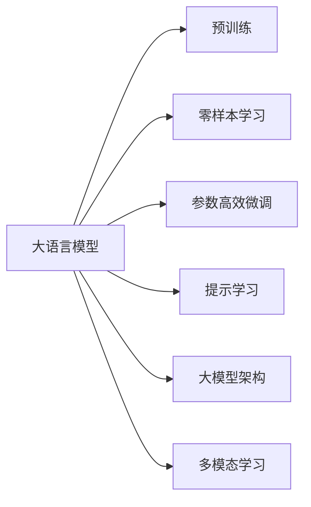

                 

# LLM的无限可能：超越传统指令集的束缚

> 关键词：大语言模型(LLM),零样本学习,参数高效微调(PEFT),提示学习,大模型架构,多模态学习

## 1. 背景介绍

随着深度学习技术的迅猛发展，大规模语言模型(LLMs)成为了人工智能领域的明星技术。这些模型通常基于自回归模型，如GPT系列，或自编码模型，如BERT，在大量的无标签文本数据上进行预训练，学习到了丰富的语言知识和语义表示。LLMs展现出了强大的自然语言理解和生成能力，在许多NLP任务上取得了显著的进展，包括文本分类、问答系统、对话系统、文本摘要等。

然而，LLMs的强大性能并未完全释放。传统指令集对自然语言处理任务的定义局限于有限的语法结构和词汇表，难以充分描述复杂语义和多模态信息。LLMs则能够通过大规模数据学习，具备更强的语义理解和生成能力，能够处理更复杂的指令和信息结构。

本博文将介绍LLM的无限可能，特别是如何利用其超越传统指令集的束缚，解锁新的应用场景和技术潜力。

## 2. 核心概念与联系

### 2.1 核心概念概述

要理解LLMs的无限可能，首先要理解其核心概念和架构。以下是几个关键概念：

- **大语言模型(LLM)**：以自回归模型(如GPT)或自编码模型(如BERT)为代表的大规模预训练语言模型。通过在无标签文本数据上进行预训练，学习到通用和特定的语言知识。

- **零样本学习(ZSL)**：指模型在未经过特定任务训练的情况下，仅凭借任务描述或示例数据，就能执行新任务的能力。

- **参数高效微调(PEFT)**：指在微调过程中，只更新少量模型参数，而固定大部分预训练权重不变，以提高微调效率和效果的技术。

- **提示学习(Prompt Learning)**：通过设计特定的输入模板或指令，引导LLM输出期望结果，在不更新模型参数的情况下实现零样本或少样本学习。

- **大模型架构**：通常包括编码器和解码器，编码器用于输入表示，解码器用于输出生成。典型的架构包括Transformer、Attention等。

- **多模态学习**：指模型能够处理和融合多种模态的数据，如文本、图像、语音等，增强模型的泛化能力和实用性。

这些概念之间的联系通过以下Mermaid流程图展示：



这个流程图展示了LLM的核心概念及其相互联系：

1. LLM通过预训练获得基础能力。
2. 零样本学习和提示学习可以在不更新模型参数的情况下，实现新任务。
3. 参数高效微调可以在小规模数据上微调，提高模型效果。
4. 大模型架构使得LLMs能够处理复杂指令。
5. 多模态学习扩大了LLMs的应用范围。

## 3. 核心算法原理 & 具体操作步骤

### 3.1 算法原理概述

LLMs的无限可能来源于其强大的自监督学习和多模态处理能力。基于这些能力，LLMs能够超越传统指令集，解锁新的应用场景。

**核心算法原理**：

1. **自监督预训练**：利用大规模无标签文本数据，通过自监督学习任务（如掩码语言模型、次序预测等）学习通用语言知识。
   
2. **任务适配层**：在预训练模型基础上，添加任务特定的输出层和损失函数，用于特定任务的微调。

3. **微调训练**：在微调过程中，通过梯度下降等优化算法，更新模型参数，使模型输出符合新任务要求。

4. **零样本学习和提示学习**：通过精心设计的输入模板或指令，引导LLM执行新任务，减少微调所需的标注样本。

### 3.2 算法步骤详解

下面是LLMs在特定任务上的具体操作步骤：

**Step 1: 准备数据集**

- **收集数据集**：选择特定任务的数据集，如问答、对话、文本分类等。确保数据集与预训练数据的分布相似。
- **标注数据**：如果可能，收集少量标注数据。如果不可行，可以使用无标注数据和提示词进行提示学习。

**Step 2: 添加任务适配层**

- **输出层设计**：根据任务类型，选择适当的输出层（如线性层、全连接层、Transformer头等）。
- **损失函数**：选择适当的损失函数，如交叉熵、均方误差、对数似然等，用于衡量模型输出与真实标签之间的差异。

**Step 3: 设置微调超参数**

- **学习率**：选择合适的学习率，通常较小。
- **优化器**：选择适当的优化器（如Adam、SGD等）及其参数。
- **正则化**：应用L2正则、Dropout、Early Stopping等技术，防止过拟合。
- **参数冻结**：确定是否冻结预训练参数。

**Step 4: 执行微调训练**

- **前向传播**：将训练数据输入模型，计算损失函数。
- **反向传播**：根据梯度下降算法更新模型参数。
- **验证集评估**：周期性在验证集上评估模型性能，防止过拟合。
- **迭代更新**：重复上述步骤直至满足预设条件。

**Step 5: 应用提示学习**

- **设计提示词**：根据任务设计提示词模板。
- **输入提示词**：将提示词作为输入，进行零样本或少样本学习。
- **输出结果**：模型根据提示词生成期望输出。

**Step 6: 测试与部署**

- **测试集评估**：在测试集上评估模型性能。
- **模型部署**：将模型集成到实际应用系统中，部署部署。
- **持续学习**：定期更新模型以适应新的数据分布。

### 3.3 算法优缺点

**优点**：

1. **灵活性**：能够处理复杂的指令，适应多变的数据分布。
2. **泛化能力**：通过预训练获得通用知识，适应新任务的泛化能力强。
3. **效率**：部分参数冻结的微调方法提高了效率，减少了计算资源消耗。
4. **可解释性**：部分参数解冻的微调方法保持了模型的可解释性，易于调试和优化。

**缺点**：

1. **数据依赖**：微调和提示学习仍依赖于标注数据，数据获取成本高。
2. **泛化能力有限**：在特定领域数据较少的情况下，微调效果可能不理想。
3. **过拟合风险**：部分参数解冻可能导致过拟合，尤其是在数据集较小的情况下。

### 3.4 算法应用领域

LLMs在多个领域展现出了巨大的潜力，包括但不限于：

- **自然语言处理(NLP)**：文本分类、问答系统、对话系统、文本摘要、情感分析等。
- **计算机视觉(CV)**：图像分类、目标检测、图像生成等。
- **音频处理(AI)**：语音识别、语音生成、音频分类等。
- **多模态学习**：融合文本、图像、语音等多种模态数据，增强模型的泛化能力。
- **推荐系统**：用户行为预测、商品推荐、个性化推荐等。
- **医疗健康**：疾病诊断、病历分析、药物研发等。
- **金融科技**：金融舆情分析、交易策略优化、风险管理等。

## 4. 数学模型和公式 & 详细讲解 & 举例说明

### 4.1 数学模型构建

**预训练模型**：

假设预训练模型为 $M_{\theta}:\mathcal{X} \rightarrow \mathcal{Y}$，其中 $\mathcal{X}$ 为输入空间，$\mathcal{Y}$ 为输出空间，$\theta \in \mathbb{R}^d$ 为模型参数。

**微调任务**：

设微调任务的标注数据集为 $D=\{(x_i,y_i)\}_{i=1}^N$，其中 $x_i \in \mathcal{X}$ 为输入，$y_i \in \mathcal{Y}$ 为标签。

**损失函数**：

定义模型在数据集 $D$ 上的损失函数为 $\mathcal{L}(\theta)$，通常使用交叉熵损失：

$$
\mathcal{L}(\theta) = -\frac{1}{N} \sum_{i=1}^N \ell(M_{\theta}(x_i),y_i)
$$

其中 $\ell$ 为特定任务的损失函数。

### 4.2 公式推导过程

**输入表示**：

预训练模型通常使用自回归模型或自编码模型。假设输入 $x$ 经过预训练模型的编码器，得到隐状态 $h$，然后通过解码器生成输出 $y$。

**微调训练**：

微调过程中，通过梯度下降算法更新模型参数 $\theta$：

$$
\theta \leftarrow \theta - \eta \nabla_{\theta} \mathcal{L}(\theta)
$$

其中 $\eta$ 为学习率，$\nabla_{\theta} \mathcal{L}(\theta)$ 为损失函数对模型参数的梯度。

**零样本学习**：

通过提示学习，模型能够根据输入模板或指令 $p$ 生成输出 $y$：

$$
y = M_{\theta}(x|p)
$$

其中 $x$ 为输入数据，$p$ 为提示模板。

### 4.3 案例分析与讲解

**文本分类**：

假设有一文本分类任务，数据集 $D=\{(x_i,y_i)\}_{i=1}^N$。在预训练模型 $M_{\theta}$ 上添加线性输出层和交叉熵损失，进行微调：

$$
\mathcal{L}(\theta) = -\frac{1}{N} \sum_{i=1}^N \log \frac{e^{M_{\theta}(x_i,y_i)}}{\sum_j e^{M_{\theta}(x_i,j)}}
$$

**对话系统**：

假设有一个基于规则的对话系统，需要生成对话回复。通过提示学习，模型能够根据输入的对话历史和规则模板，生成回复：

$$
y = M_{\theta}(h|p)
$$

其中 $h$ 为对话历史，$p$ 为规则模板。

## 5. 项目实践：代码实例和详细解释说明

### 5.1 开发环境搭建

**安装依赖**：

```bash
pip install torch transformers sklearn pandas
```

**环境配置**：

```python
import torch
import torch.nn as nn
import torch.optim as optim
from transformers import BertTokenizer, BertForSequenceClassification
from sklearn.metrics import accuracy_score, precision_score, recall_score, f1_score
import pandas as pd

device = torch.device('cuda' if torch.cuda.is_available() else 'cpu')
```

### 5.2 源代码详细实现

**数据处理**：

```python
class TextDataset(Dataset):
    def __init__(self, texts, labels):
        self.texts = texts
        self.labels = labels
        
    def __len__(self):
        return len(self.texts)
    
    def __getitem__(self, idx):
        text = self.texts[idx]
        label = self.labels[idx]
        return text, label
```

**模型定义**：

```python
class TextClassificationModel(nn.Module):
    def __init__(self, num_labels):
        super(TextClassificationModel, self).__init__()
        self.bert = BertForSequenceClassification.from_pretrained('bert-base-uncased', num_labels=num_labels)
        self.dropout = nn.Dropout(0.1)
        self.fc = nn.Linear(768, num_labels)
        
    def forward(self, input_ids, attention_mask):
        outputs = self.bert(input_ids, attention_mask=attention_mask)
        pooled_output = outputs.pooler_output
        logits = self.fc(pooled_output)
        return logits
```

**训练与评估**：

```python
def train(model, dataset, epochs, batch_size, optimizer):
    model.train()
    for epoch in range(epochs):
        for batch in dataset:
            texts, labels = batch
            inputs = tokenizer(texts, return_tensors='pt', padding='max_length', truncation=True).to(device)
            outputs = model(**inputs)
            loss = nn.CrossEntropyLoss()(outputs, labels.to(device))
            loss.backward()
            optimizer.step()
            optimizer.zero_grad()
        print(f'Epoch {epoch+1}, Loss: {loss.item()}')
    
def evaluate(model, dataset, batch_size):
    model.eval()
    preds, labels = [], []
    for batch in dataset:
        texts, labels = batch
        inputs = tokenizer(texts, return_tensors='pt', padding='max_length', truncation=True).to(device)
        outputs = model(**inputs)
        batch_preds = outputs.argmax(dim=1).to('cpu').tolist()
        batch_labels = labels.to('cpu').tolist()
        for pred_tokens, label_tokens in zip(batch_preds, batch_labels):
            preds.append(pred_tokens[:len(label_tokens)])
            labels.append(label_tokens)
    print(f'Accuracy: {accuracy_score(labels, preds)}')
    print(f'Precision: {precision_score(labels, preds, average='macro')}')
    print(f'Recall: {recall_score(labels, preds, average='macro')}')
    print(f'F1-score: {f1_score(labels, preds, average='macro')}')
```

**代码解释**：

- **数据集**：定义文本数据集，包含输入和标签。
- **模型定义**：使用Bert模型，添加Dropout和全连接层，进行分类任务。
- **训练函数**：在训练集上进行梯度下降，输出损失。
- **评估函数**：在验证集上评估模型性能，输出分类指标。

### 5.3 代码解读与分析

**模型架构**：

- **编码器**：使用Bert模型作为编码器，输出隐状态 $h$。
- **输出层**：添加线性层进行分类任务，输出logits。
- **Dropout**：防止过拟合，随机丢弃部分神经元。
- **Softmax**：将logits转换为概率分布，用于分类预测。

**训练过程**：

- **批量处理**：将数据集划分为小批量，进行并行计算。
- **前向传播**：将输入数据和标签输入模型，计算损失。
- **反向传播**：根据损失计算梯度，更新模型参数。
- **优化器**：使用Adam优化器，控制学习率。

**评估指标**：

- **准确率**：模型在测试集上的分类准确率。
- **精确率**：模型在不同类别上的精确率。
- **召回率**：模型在不同类别上的召回率。
- **F1-score**：综合精确率和召回率的调和平均数。

## 6. 实际应用场景

### 6.1 智能客服系统

智能客服系统通过LLMs处理用户查询，提供智能答复。预训练模型学习通用语言知识，微调模型针对具体任务，提升系统理解和回复能力。零样本学习可以通过提示词模板，快速适应新场景和新问题。

### 6.2 金融舆情监测

金融舆情监测需要识别网络舆论中的关键信息，预训练模型学习金融领域的语言特征，微调模型能够自动监测舆情变化，及时预警金融风险。

### 6.3 个性化推荐系统

推荐系统需要理解用户行为和兴趣，预训练模型学习用户-物品映射，微调模型能够根据用户行为生成推荐列表。零样本学习可以通过提示词模板，快速获取用户兴趣信息。

### 6.4 未来应用展望

未来，LLMs将在更多领域展现无限可能，包括医疗健康、智能制造、智慧城市等。多模态学习将使得LLMs能够处理更加复杂和丰富的数据，提升系统的泛化能力和实用性。

## 7. 工具和资源推荐

### 7.1 学习资源推荐

**官方文档**：

- **HuggingFace Transformers库**：官方文档提供了详细的预训练模型和微调样例代码，是学习LLMs的重要资源。

**在线课程**：

- **Coursera的深度学习课程**：涵盖深度学习基础、神经网络、NLP等，适合初学者入门。
- **edX的NLP课程**：由斯坦福大学提供，深入讲解NLP任务和模型。

**书籍**：

- **《深度学习》by Ian Goodfellow**：全面介绍深度学习理论和技术，涵盖NLP应用。
- **《自然语言处理综述》by Jurafsky & Martin**：详细讲解NLP领域的最新研究进展和应用。

### 7.2 开发工具推荐

**深度学习框架**：

- **PyTorch**：动态计算图，灵活高效的深度学习框架。
- **TensorFlow**：分布式计算框架，适合大规模模型训练和部署。

**自然语言处理库**：

- **Transformers库**：提供了预训练模型和微调接口，方便NLP任务开发。
- **spaCy库**：提供了自然语言处理工具，如分词、命名实体识别等。

**数据处理工具**：

- **Pandas**：数据处理和分析工具，方便数据预处理和特征工程。
- **NumPy**：科学计算库，支持高效数组运算。

### 7.3 相关论文推荐

**经典论文**：

- **Attention is All You Need**：Transformer架构的提出，开创了NLP的预训练大模型时代。
- **BERT: Pre-training of Deep Bidirectional Transformers for Language Understanding**：BERT模型提出，引入自监督预训练任务，提升了NLP任务效果。
- **GPT-3: Language Models are Unsupervised Multitask Learners**：GPT-3模型提出，展示了大语言模型在零样本学习上的潜力。

**最新研究**：

- **Fine-tune in Few-shot Learning: Practical Demonstrations of Prompt Engineering**：展示了通过提示词模板实现少样本学习的方法。
- **Parameter-Efficient Text Transfer Learning with Adaptive Loss Functions**：提出了参数高效微调方法，减少了微调所需的参数和计算资源。

## 8. 总结：未来发展趋势与挑战

### 8.1 研究成果总结

本文介绍了LLMs的无限可能，特别是如何利用其超越传统指令集的束缚，解锁新的应用场景和技术潜力。基于LLMs的预训练和微调方法，NLP技术在自然语言理解、生成、推荐、对话等方面取得了显著进展。

### 8.2 未来发展趋势

1. **大模型规模不断扩大**：预训练模型的参数规模将不断增加，提供更丰富的语言知识。
2. **多模态学习增强**：LLMs将更多地融合图像、语音、视频等模态信息，提升模型的泛化能力。
3. **参数高效微调**：开发更加参数高效的微调方法，减少计算资源消耗。
4. **持续学习机制**：引入持续学习机制，保持模型性能的更新和提升。
5. **可解释性和鲁棒性**：提升模型的可解释性和鲁棒性，应对复杂多变的实际场景。

### 8.3 面临的挑战

1. **数据依赖**：微调和提示学习仍依赖于标注数据，数据获取成本高。
2. **泛化能力有限**：在特定领域数据较少的情况下，微调效果可能不理想。
3. **过拟合风险**：部分参数解冻可能导致过拟合，尤其是在数据集较小的情况下。
4. **计算资源**：大模型训练和推理消耗大量计算资源，需要优化。
5. **模型可解释性**：复杂模型难以解释其内部工作机制，需要加强模型可解释性研究。

### 8.4 研究展望

1. **无监督和半监督学习**：探索无需标注数据的学习方法，降低对标注数据的依赖。
2. **因果推理和多模态学习**：引入因果推理和多模态学习，增强模型的泛化能力和实用性。
3. **可解释性研究**：开发可解释性强的模型，方便调试和优化。
4. **鲁棒性提升**：提升模型的鲁棒性和泛化能力，应对复杂多变的实际场景。
5. **跨领域迁移能力**：增强模型在不同领域和任务之间的迁移能力，提升模型的通用性和实用性。

## 9. 附录：常见问题与解答

### Q1：LLMs能否处理复杂的自然语言指令？

A：是的，LLMs能够处理复杂的自然语言指令，通过预训练学习到丰富的语言知识和语义表示，能够理解复杂的语法结构和词汇表。提示学习和参数高效微调等技术，进一步增强了LLMs的灵活性和泛化能力。

### Q2：LLMs在微调时为何需要标注数据？

A：微调过程中，需要标注数据来训练模型，使其能够适应特定任务。标注数据提供了任务的监督信号，帮助模型学习任务相关的知识。虽然零样本学习和提示学习可以在一定程度上缓解对标注数据的依赖，但标注数据仍然是微调的重要基础。

### Q3：LLMs在微调时如何避免过拟合？

A：过拟合是微调过程中常见的问题，可以通过以下方法避免：
- **数据增强**：通过回译、近义替换等方式扩充训练集。
- **正则化**：使用L2正则、Dropout、Early Stopping等技术，防止过拟合。
- **参数高效微调**：只更新少量参数，固定大部分预训练权重不变。
- **对抗训练**：引入对抗样本，提高模型鲁棒性。

### Q4：LLMs在微调时如何提高效率？

A：提高微调效率可以通过以下方法：
- **部分参数解冻**：只更新任务相关的参数，固定大部分预训练权重不变。
- **梯度积累**：将多个小批量梯度累加起来进行更新，减少计算量。
- **混合精度训练**：使用低精度格式进行计算，减少内存占用和计算资源消耗。
- **模型压缩**：通过剪枝、量化等方法，减小模型规模和计算量。

### Q5：LLMs在微调时如何提高可解释性？

A：提高LLMs的可解释性可以通过以下方法：
- **模型简化**：简化模型结构，降低复杂度，便于理解和调试。
- **可视化技术**：使用可视化工具，展示模型的推理过程和决策路径。
- **知识图谱**：引入知识图谱等外部知识，增强模型的可解释性和逻辑性。
- **因果推理**：通过因果推理方法，解释模型的决策依据和原因。

通过解决以上问题，可以进一步提升LLMs的性能和应用范围，推动NLP技术在更广泛领域的应用。

---

作者：禅与计算机程序设计艺术 / Zen and the Art of Computer Programming

