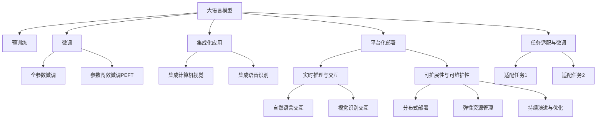

                 

# LLM重塑产业链：AI技术商业化的新模式

> 关键词：

## 1. 背景介绍

### 1.1 问题由来
在人工智能(AI)领域，语言模型（Language Models, LM）尤其是大语言模型（Large Language Models, LLM），已经展现出革命性的能力，在多个NLP任务上超越了以往的深度学习模型，并成为了自然语言处理（NLP）领域的核心技术。然而，尽管大语言模型在学术界广受关注，但在实际商业应用中，其高昂的训练成本、庞大的模型规模和复杂的算法设计，使其面临诸多商业化难题。

大语言模型往往需要数十亿甚至数百亿的参数，这导致训练成本极高，并且需要高性能计算资源（如GPU或TPU）。同时，大语言模型在推理过程中的计算资源消耗也很大，这进一步增加了运营成本。此外，大语言模型的算法设计复杂，涉及深度学习、优化算法、自然语言处理等多个学科，其商业化部署需要专业的技术团队和基础设施支持，这进一步提高了应用门槛。

这些问题使得大语言模型的商业化应用面临巨大的挑战，而传统的基于服务端API的部署模式，难以满足实际商业应用的需求。为了解决这个问题，基于大语言模型的平台化、集成化应用，成为一种新的趋势。本文将介绍大语言模型商业化的新模式，并通过技术手段重塑产业链，使其更好地服务于企业和用户。

### 1.2 问题核心关键点
大语言模型商业化的新模式主要包括以下几个关键点：

- 平台化部署：通过构建大语言模型的平台化部署系统，实现模型的便捷接入和应用。
- 集成化应用：将大语言模型与其他AI技术（如计算机视觉、语音识别、推荐系统等）进行深度集成，形成完整的AI应用生态。
- 模型微调与适配：利用模型微调技术，对大语言模型进行任务适配，提升其在特定业务场景中的表现。
- 实时推理与交互：构建实时推理系统，使得大语言模型能够与用户进行高效互动，满足即时服务的需求。
- 可扩展性与可维护性：设计灵活的架构，支持大规模部署和持续演进，确保系统的稳定性和可靠性。

这些关键点共同构成了一个全面、可行的商业化方案，可以有效地解决大语言模型面临的部署和应用难题，推动其在实际场景中的广泛应用。

### 1.3 问题研究意义
研究大语言模型商业化的新模式，对于推动AI技术的普及和应用，具有重要意义：

1. 降低应用门槛：平台化和集成化部署，可以显著降低大语言模型的应用门槛，使得更多中小企业和开发者能够利用其强大的NLP能力。
2. 提高应用效率：实时推理与微调适配，可以提升大语言模型在特定业务场景下的应用效率，满足更高的业务需求。
3. 促进技术创新：集成多种AI技术，可以推动跨领域AI应用的创新，拓展AI技术的商业应用边界。
4. 增强用户满意度：灵活的部署与交互方式，可以增强用户体验，提升用户满意度。
5. 带动产业发展：大语言模型的平台化应用，可以带动AI技术服务产业链的上下游发展，推动相关产业的升级和创新。

总之，大语言模型商业化的新模式，将为AI技术的商业应用提供新的路径，推动AI技术的普及和应用，提升产业整体竞争力。

## 2. 核心概念与联系

### 2.1 核心概念概述

为了更好地理解大语言模型商业化的新模式，首先需要介绍几个关键概念：

- 大语言模型（Large Language Models, LLM）：以Transformer为基础的大型神经网络模型，通过自监督学习（如语言建模）和监督学习（如任务适配）获得强大的语言理解和生成能力。
- 预训练与微调：预训练指在大规模无标签文本数据上训练大语言模型，微调指在特定任务上有监督地训练模型，以提高其在特定任务上的表现。
- 集成化应用：将大语言模型与其他AI技术进行深度集成，形成完整的AI应用生态，提升系统的整体性能和应用效果。
- 平台化部署：通过构建大语言模型的平台化部署系统，实现模型的便捷接入和应用。
- 实时推理与交互：构建实时推理系统，使得大语言模型能够与用户进行高效互动，满足即时服务的需求。
- 任务适配与微调：利用模型微调技术，对大语言模型进行任务适配，提升其在特定业务场景中的表现。
- 可扩展性与可维护性：设计灵活的架构，支持大规模部署和持续演进，确保系统的稳定性和可靠性。

这些概念之间的联系可以通过以下Mermaid流程图来展示：



这个流程图展示了大语言模型从预训练、微调、集成化应用到平台化部署的全流程，以及其中关键技术环节的相互关系。

## 3. 核心算法原理 & 具体操作步骤
### 3.1 算法原理概述

大语言模型商业化的新模式，本质上是通过构建平台化、集成化的部署系统，实现模型的便捷接入和应用，并通过任务适配和微调技术，提升模型在特定业务场景中的表现。其核心算法原理包括：

- 集成化应用：通过将大语言模型与其他AI技术进行深度集成，形成完整的AI应用生态，提升系统的整体性能和应用效果。
- 平台化部署：通过构建平台化部署系统，实现模型的便捷接入和应用。
- 任务适配与微调：利用模型微调技术，对大语言模型进行任务适配，提升其在特定业务场景中的表现。

这些原理共同构成了大语言模型商业化的技术基础。

### 3.2 算法步骤详解

基于大语言模型商业化的新模式，一般包括以下几个关键步骤：

**Step 1: 选择预训练模型**

首先需要选择适合目标应用场景的预训练模型。当前市面上常见的预训练模型包括GPT-3、BERT、T5等。选择合适的预训练模型是商业化的第一步，需要考虑模型的性能、资源需求和应用场景的匹配度。

**Step 2: 任务适配与微调**

在选择预训练模型后，需要根据具体应用场景，对模型进行任务适配和微调。微调的目标是提升模型在特定任务上的表现，可以通过全参数微调或参数高效微调（PEFT）等方式实现。微调过程需要选择合适的优化算法、学习率、正则化技术等参数，并设定合理的训练轮数。

**Step 3: 集成化应用**

在完成微调后，需要将大语言模型与其他AI技术进行集成，形成完整的AI应用生态。集成化应用可以提升系统的整体性能和应用效果，需要考虑模型的部署方式、接口设计、服务质量等因素。

**Step 4: 平台化部署**

通过构建平台化部署系统，实现模型的便捷接入和应用。平台化部署需要考虑模型的加载、推理、监控、告警等功能，确保系统的稳定性和可靠性。

**Step 5: 实时推理与交互**

构建实时推理系统，使得大语言模型能够与用户进行高效互动，满足即时服务的需求。实时推理系统需要考虑模型的推理速度、响应时间、接口设计等因素。

### 3.3 算法优缺点

基于大语言模型商业化的新模式具有以下优点：

1. 降低应用门槛：平台化和集成化部署，可以显著降低大语言模型的应用门槛，使得更多中小企业和开发者能够利用其强大的NLP能力。
2. 提高应用效率：实时推理与微调适配，可以提升大语言模型在特定业务场景下的应用效率，满足更高的业务需求。
3. 促进技术创新：集成多种AI技术，可以推动跨领域AI应用的创新，拓展AI技术的商业应用边界。

然而，这种模式也存在一些缺点：

1. 高开发成本：平台化和集成化部署需要较高的开发成本和技术门槛，对开发团队的技术能力要求较高。
2. 可扩展性挑战：大规模部署和大规模数据处理需要灵活的架构设计和高效的技术手段。
3. 系统复杂性：集成多种AI技术，需要考虑不同技术的兼容性、协同工作等问题，系统复杂性较高。

尽管存在这些缺点，但通过合理的设计和实施，大语言模型商业化的新模式仍具备广阔的应用前景和显著的优势。

### 3.4 算法应用领域

基于大语言模型商业化的新模式，已经在多个领域得到了广泛应用，例如：

- 智能客服系统：基于大语言模型的平台化部署，可以实现7x24小时不间断的智能客服，提升客户咨询体验。
- 金融舆情监测：通过集成大语言模型和计算机视觉技术，可以实时监测市场舆情，及时应对负面信息传播，规避金融风险。
- 个性化推荐系统：通过集成大语言模型和推荐算法，可以提升推荐系统的个性化和多样化程度，满足用户的个性化需求。
- 医疗问答系统：基于大语言模型的平台化部署和微调，可以实现智能医疗问答，辅助医生诊疗，提升医疗服务质量。

除了上述这些领域外，大语言模型商业化的新模式还在教育、娱乐、智能家居等多个领域得到应用，为各行各业带来了新的发展机遇。

## 4. 数学模型和公式 & 详细讲解  
### 4.1 数学模型构建

在介绍大语言模型商业化的新模式时，需要一些数学模型和公式来描述关键技术环节。

以推荐系统为例，假设用户-物品二元组为 $(x,y)$，其中 $x$ 为物品，$y$ 为用户对物品的评分。目标是在用户评分数据上训练推荐模型，使得预测的评分 $f(x)$ 接近真实评分 $y$。可以定义损失函数为均方误差损失（MSE Loss）：

$$
\mathcal{L}(f) = \frac{1}{N} \sum_{i=1}^N (y_i - f(x_i))^2
$$

其中 $N$ 为样本数量，$y_i$ 为样本 $i$ 的真实评分，$f(x_i)$ 为模型预测的评分。

### 4.2 公式推导过程

在推荐系统中，常见的模型包括矩阵分解模型、协同过滤模型、神经网络模型等。以协同过滤模型为例，假设用户-物品评分矩阵为 $X$，物品特征矩阵为 $Y$，用户特征矩阵为 $Z$，模型的损失函数为：

$$
\mathcal{L}(X,Y,Z) = \frac{1}{N} \sum_{i=1}^N \sum_{j=1}^M (\hat{y}_{ij} - y_{ij})^2
$$

其中 $\hat{y}_{ij}$ 为模型预测的用户 $i$ 对物品 $j$ 的评分，$y_{ij}$ 为真实评分。

在求解最小化损失函数时，可以采用梯度下降算法（如随机梯度下降），迭代更新矩阵 $X$、$Y$、$Z$ 的参数，使得模型预测的评分与真实评分尽可能接近。

### 4.3 案例分析与讲解

以金融舆情监测为例，假设收集了 $N$ 篇新闻文章，每篇文章有 $T$ 个情感标签（如正面、负面、中性），目标是在文章情感标签上训练情感分析模型，使得预测的情感标签 $f_i$ 尽可能接近真实标签 $t_i$。可以定义损失函数为交叉熵损失（Cross-Entropy Loss）：

$$
\mathcal{L}(f) = -\frac{1}{N} \sum_{i=1}^N \sum_{j=1}^T t_{ij} \log f_{ij}
$$

其中 $f_{ij}$ 为模型预测的文章 $i$ 的情感标签 $j$ 的概率，$t_{ij}$ 为真实情感标签 $j$ 的one-hot编码。

在求解最小化损失函数时，可以采用梯度下降算法（如AdamW），迭代更新模型参数 $\theta$，使得模型预测的情感标签与真实标签尽可能接近。

## 5. 项目实践：代码实例和详细解释说明
### 5.1 开发环境搭建

在进行大语言模型商业化实践前，我们需要准备好开发环境。以下是使用Python进行PyTorch开发的环境配置流程：

1. 安装Anaconda：从官网下载并安装Anaconda，用于创建独立的Python环境。

2. 创建并激活虚拟环境：
```bash
conda create -n pytorch-env python=3.8 
conda activate pytorch-env
```

3. 安装PyTorch：根据CUDA版本，从官网获取对应的安装命令。例如：
```bash
conda install pytorch torchvision torchaudio cudatoolkit=11.1 -c pytorch -c conda-forge
```

4. 安装Transformers库：
```bash
pip install transformers
```

5. 安装各类工具包：
```bash
pip install numpy pandas scikit-learn matplotlib tqdm jupyter notebook ipython
```

完成上述步骤后，即可在`pytorch-env`环境中开始商业化实践。

### 5.2 源代码详细实现

下面我们以金融舆情监测为例，给出使用Transformers库对BERT模型进行微调的PyTorch代码实现。

首先，定义情感分析任务的数据处理函数：

```python
from transformers import BertTokenizer
from torch.utils.data import Dataset
import torch

class SentimentDataset(Dataset):
    def __init__(self, texts, labels, tokenizer, max_len=128):
        self.texts = texts
        self.labels = labels
        self.tokenizer = tokenizer
        self.max_len = max_len
        
    def __len__(self):
        return len(self.texts)
    
    def __getitem__(self, item):
        text = self.texts[item]
        label = self.labels[item]
        
        encoding = self.tokenizer(text, return_tensors='pt', max_length=self.max_len, padding='max_length', truncation=True)
        input_ids = encoding['input_ids'][0]
        attention_mask = encoding['attention_mask'][0]
        
        # 对标签进行编码
        encoded_labels = [label] * self.max_len
        labels = torch.tensor(encoded_labels, dtype=torch.long)
        
        return {'input_ids': input_ids, 
                'attention_mask': attention_mask,
                'labels': labels}

# 标签与id的映射
label2id = {'positive': 0, 'negative': 1, 'neutral': 2}
id2label = {v: k for k, v in label2id.items()}

# 创建dataset
tokenizer = BertTokenizer.from_pretrained('bert-base-cased')

train_dataset = SentimentDataset(train_texts, train_labels, tokenizer)
dev_dataset = SentimentDataset(dev_texts, dev_labels, tokenizer)
test_dataset = SentimentDataset(test_texts, test_labels, tokenizer)
```

然后，定义模型和优化器：

```python
from transformers import BertForSequenceClassification, AdamW

model = BertForSequenceClassification.from_pretrained('bert-base-cased', num_labels=len(label2id))

optimizer = AdamW(model.parameters(), lr=2e-5)
```

接着，定义训练和评估函数：

```python
from torch.utils.data import DataLoader
from tqdm import tqdm
from sklearn.metrics import classification_report

device = torch.device('cuda') if torch.cuda.is_available() else torch.device('cpu')
model.to(device)

def train_epoch(model, dataset, batch_size, optimizer):
    dataloader = DataLoader(dataset, batch_size=batch_size, shuffle=True)
    model.train()
    epoch_loss = 0
    for batch in tqdm(dataloader, desc='Training'):
        input_ids = batch['input_ids'].to(device)
        attention_mask = batch['attention_mask'].to(device)
        labels = batch['labels'].to(device)
        model.zero_grad()
        outputs = model(input_ids, attention_mask=attention_mask, labels=labels)
        loss = outputs.loss
        epoch_loss += loss.item()
        loss.backward()
        optimizer.step()
    return epoch_loss / len(dataloader)

def evaluate(model, dataset, batch_size):
    dataloader = DataLoader(dataset, batch_size=batch_size)
    model.eval()
    preds, labels = [], []
    with torch.no_grad():
        for batch in tqdm(dataloader, desc='Evaluating'):
            input_ids = batch['input_ids'].to(device)
            attention_mask = batch['attention_mask'].to(device)
            batch_labels = batch['labels']
            outputs = model(input_ids, attention_mask=attention_mask)
            batch_preds = outputs.logits.argmax(dim=2).to('cpu').tolist()
            batch_labels = batch_labels.to('cpu').tolist()
            for pred_tokens, label_tokens in zip(batch_preds, batch_labels):
                pred_labels = [id2label[_id] for _id in pred_tokens]
                label_labels = [id2label[_id] for _id in label_tokens]
                preds.append(pred_labels[:len(label_labels)])
                labels.append(label_labels)
                
    print(classification_report(labels, preds))
```

最后，启动训练流程并在测试集上评估：

```python
epochs = 5
batch_size = 16

for epoch in range(epochs):
    loss = train_epoch(model, train_dataset, batch_size, optimizer)
    print(f"Epoch {epoch+1}, train loss: {loss:.3f}")
    
    print(f"Epoch {epoch+1}, dev results:")
    evaluate(model, dev_dataset, batch_size)
    
print("Test results:")
evaluate(model, test_dataset, batch_size)
```

以上就是使用PyTorch对BERT进行金融舆情监测任务微调的完整代码实现。可以看到，得益于Transformers库的强大封装，我们可以用相对简洁的代码完成BERT模型的加载和微调。

### 5.3 代码解读与分析

让我们再详细解读一下关键代码的实现细节：

**SentimentDataset类**：
- `__init__`方法：初始化文本、标签、分词器等关键组件。
- `__len__`方法：返回数据集的样本数量。
- `__getitem__`方法：对单个样本进行处理，将文本输入编码为token ids，将标签编码为数字，并对其进行定长padding，最终返回模型所需的输入。

**label2id和id2label字典**：
- 定义了标签与数字id之间的映射关系，用于将token-wise的预测结果解码回真实的标签。

**训练和评估函数**：
- 使用PyTorch的DataLoader对数据集进行批次化加载，供模型训练和推理使用。
- 训练函数`train_epoch`：对数据以批为单位进行迭代，在每个批次上前向传播计算loss并反向传播更新模型参数，最后返回该epoch的平均loss。
- 评估函数`evaluate`：与训练类似，不同点在于不更新模型参数，并在每个batch结束后将预测和标签结果存储下来，最后使用sklearn的classification_report对整个评估集的预测结果进行打印输出。

**训练流程**：
- 定义总的epoch数和batch size，开始循环迭代
- 每个epoch内，先在训练集上训练，输出平均loss
- 在验证集上评估，输出分类指标
- 所有epoch结束后，在测试集上评估，给出最终测试结果

可以看到，PyTorch配合Transformers库使得BERT微调的代码实现变得简洁高效。开发者可以将更多精力放在数据处理、模型改进等高层逻辑上，而不必过多关注底层的实现细节。

当然，工业级的系统实现还需考虑更多因素，如模型的保存和部署、超参数的自动搜索、更灵活的任务适配层等。但核心的微调范式基本与此类似。

## 6. 实际应用场景
### 6.1 智能客服系统

基于大语言模型商业化的智能客服系统，可以7x24小时不间断服务，快速响应客户咨询，用自然流畅的语言解答各类常见问题。在技术实现上，可以收集企业内部的历史客服对话记录，将问题和最佳答复构建成监督数据，在此基础上对预训练对话模型进行微调。微调后的对话模型能够自动理解用户意图，匹配最合适的答案模板进行回复。对于客户提出的新问题，还可以接入检索系统实时搜索相关内容，动态组织生成回答。如此构建的智能客服系统，能大幅提升客户咨询体验和问题解决效率。

### 6.2 金融舆情监测

金融机构需要实时监测市场舆论动向，以便及时应对负面信息传播，规避金融风险。传统的人工监测方式成本高、效率低，难以应对网络时代海量信息爆发的挑战。基于大语言模型商业化的金融舆情监测系统，可以实时抓取网络文本数据，自动监测不同主题下的情感变化趋势，一旦发现负面信息激增等异常情况，系统便会自动预警，帮助金融机构快速应对潜在风险。

### 6.3 个性化推荐系统

当前的推荐系统往往只依赖用户的历史行为数据进行物品推荐，无法深入理解用户的真实兴趣偏好。基于大语言模型商业化的个性化推荐系统，可以更好地挖掘用户行为背后的语义信息，从而提供更精准、多样的推荐内容。在实践中，可以收集用户浏览、点击、评论、分享等行为数据，提取和用户交互的物品标题、描述、标签等文本内容。将文本内容作为模型输入，用户的后续行为（如是否点击、购买等）作为监督信号，在此基础上微调预训练语言模型。微调后的模型能够从文本内容中准确把握用户的兴趣点。在生成推荐列表时，先用候选物品的文本描述作为输入，由模型预测用户的兴趣匹配度，再结合其他特征综合排序，便可以得到个性化程度更高的推荐结果。

### 6.4 未来应用展望

随着大语言模型商业化模式的不断发展，其在更多领域得到应用，为传统行业带来变革性影响。

在智慧医疗领域，基于大语言模型的平台化部署和微调技术，可以实现智能医疗问答，辅助医生诊疗，提升医疗服务质量。在智能教育领域，商业化的推荐系统可以提升教学质量，因材施教，促进教育公平。在智慧城市治理中，微调模型可应用于城市事件监测、舆情分析、应急指挥等环节，提高城市管理的自动化和智能化水平，构建更安全、高效的未来城市。

此外，在企业生产、社会治理、文娱传媒等众多领域，基于大语言模型商业化的AI应用也将不断涌现，为经济社会发展注入新的动力。相信随着技术的日益成熟，大语言模型商业化模式将成为AI技术落地的重要范式，推动AI技术的普及和应用。

## 7. 工具和资源推荐
### 7.1 学习资源推荐

为了帮助开发者系统掌握大语言模型商业化的技术基础和实践技巧，这里推荐一些优质的学习资源：

1. 《Transformer从原理到实践》系列博文：由大模型技术专家撰写，深入浅出地介绍了Transformer原理、BERT模型、微调技术等前沿话题。

2. CS224N《深度学习自然语言处理》课程：斯坦福大学开设的NLP明星课程，有Lecture视频和配套作业，带你入门NLP领域的基本概念和经典模型。

3. 《Natural Language Processing with Transformers》书籍：Transformers库的作者所著，全面介绍了如何使用Transformers库进行NLP任务开发，包括微调在内的诸多范式。

4. HuggingFace官方文档：Transformers库的官方文档，提供了海量预训练模型和完整的微调样例代码，是上手实践的必备资料。

5. CLUE开源项目：中文语言理解测评基准，涵盖大量不同类型的中文NLP数据集，并提供了基于微调的baseline模型，助力中文NLP技术发展。

通过对这些资源的学习实践，相信你一定能够快速掌握大语言模型商业化的精髓，并用于解决实际的NLP问题。
### 7.2 开发工具推荐

高效的开发离不开优秀的工具支持。以下是几款用于大语言模型商业化开发的常用工具：

1. PyTorch：基于Python的开源深度学习框架，灵活动态的计算图，适合快速迭代研究。大部分预训练语言模型都有PyTorch版本的实现。

2. TensorFlow：由Google主导开发的开源深度学习框架，生产部署方便，适合大规模工程应用。同样有丰富的预训练语言模型资源。

3. Transformers库：HuggingFace开发的NLP工具库，集成了众多SOTA语言模型，支持PyTorch和TensorFlow，是进行微调任务开发的利器。

4. Weights & Biases：模型训练的实验跟踪工具，可以记录和可视化模型训练过程中的各项指标，方便对比和调优。与主流深度学习框架无缝集成。

5. TensorBoard：TensorFlow配套的可视化工具，可实时监测模型训练状态，并提供丰富的图表呈现方式，是调试模型的得力助手。

6. Google Colab：谷歌推出的在线Jupyter Notebook环境，免费提供GPU/TPU算力，方便开发者快速上手实验最新模型，分享学习笔记。

合理利用这些工具，可以显著提升大语言模型商业化的开发效率，加快创新迭代的步伐。

### 7.3 相关论文推荐

大语言模型商业化的新模式源于学界的持续研究。以下是几篇奠基性的相关论文，推荐阅读：

1. Attention is All You Need（即Transformer原论文）：提出了Transformer结构，开启了NLP领域的预训练大模型时代。

2. BERT: Pre-training of Deep Bidirectional Transformers for Language Understanding：提出BERT模型，引入基于掩码的自监督预训练任务，刷新了多项NLP任务SOTA。

3. Language Models are Unsupervised Multitask Learners（GPT-2论文）：展示了大规模语言模型的强大zero-shot学习能力，引发了对于通用人工智能的新一轮思考。

4. Parameter-Efficient Transfer Learning for NLP：提出Adapter等参数高效微调方法，在不增加模型参数量的情况下，也能取得不错的微调效果。

5. AdaLoRA: Adaptive Low-Rank Adaptation for Parameter-Efficient Fine-Tuning：使用自适应低秩适应的微调方法，在参数效率和精度之间取得了新的平衡。

这些论文代表了大语言模型商业化的发展脉络。通过学习这些前沿成果，可以帮助研究者把握学科前进方向，激发更多的创新灵感。

## 8. 总结：未来发展趋势与挑战
### 8.1 总结

本文对大语言模型商业化的新模式进行了全面系统的介绍。首先阐述了大语言模型商业化的背景和意义，明确了平台化和集成化部署在降低应用门槛、提高应用效率方面的独特价值。其次，从原理到实践，详细讲解了集成化应用、平台化部署、任务适配与微调等关键技术环节，给出了微调任务开发的完整代码实例。同时，本文还广泛探讨了微调方法在智能客服、金融舆情监测、个性化推荐等多个行业领域的应用前景，展示了微调范式的巨大潜力。此外，本文精选了微调技术的各类学习资源，力求为读者提供全方位的技术指引。

通过本文的系统梳理，可以看到，基于大语言模型的商业化模式正在成为AI技术的商业应用的重要范式，极大地拓展了预训练语言模型的应用边界，推动了AI技术的普及和应用。未来，伴随预训练语言模型和微调方法的持续演进，相信AI技术的商业应用将更加广泛和深入，推动产业发展升级。

### 8.2 未来发展趋势

展望未来，大语言模型商业化的新模式将呈现以下几个发展趋势：

1. 平台化部署将更加灵活：平台化部署将实现更高的灵活性和可扩展性，支持多种部署方式和应用场景。
2. 集成化应用将更加广泛：大语言模型与其他AI技术的深度集成，将推动更多跨领域应用的创新，拓展AI技术的商业应用边界。
3. 任务适配与微调将更加高效：通过参数高效微调（PEFT）等技术手段，在保持模型鲁棒性的同时，提高微调效率，降低开发成本。
4. 实时推理与交互将更加高效：构建实时推理系统，使得大语言模型能够与用户进行高效互动，满足即时服务的需求。
5. 系统复杂性将进一步降低：通过模型压缩、分布式训练等技术手段，降低系统复杂性，提升应用性能。

以上趋势凸显了大语言模型商业化模式的广阔前景。这些方向的探索发展，必将进一步提升AI技术的商业应用水平，推动产业发展升级。

### 8.3 面临的挑战

尽管大语言模型商业化的新模式已经取得了显著进展，但在迈向更加智能化、普适化应用的过程中，仍面临诸多挑战：

1. 标注成本瓶颈：尽管微调降低了标注数据的需求，但对于特定领域的微调，获取高质量标注数据仍是一个难题。
2. 系统复杂性：集成多种AI技术，系统复杂性较高，需要考虑不同技术的兼容性、协同工作等问题。
3. 实时推理与交互：构建实时推理系统，需要考虑模型的推理速度、响应时间、接口设计等因素。
4. 可扩展性与可维护性：大规模部署和大规模数据处理需要灵活的架构设计和高效的技术手段。
5. 系统安全与隐私：用户数据和模型的安全保护是一个重要问题，需要设计完善的访问控制和安全机制。

尽管存在这些挑战，但通过合理的设计和实施，大语言模型商业化的新模式仍具备广阔的应用前景和显著的优势。

### 8.4 研究展望

面对大语言模型商业化所面临的诸多挑战，未来的研究需要在以下几个方面寻求新的突破：

1. 探索无监督和半监督微调方法。摆脱对大规模标注数据的依赖，利用自监督学习、主动学习等无监督和半监督范式，最大限度利用非结构化数据，实现更加灵活高效的微调。
2. 研究参数高效和计算高效的微调范式。开发更加参数高效的微调方法，在固定大部分预训练参数的同时，只更新极少量的任务相关参数。同时优化微调模型的计算图，减少前向传播和反向传播的资源消耗，实现更加轻量级、实时性的部署。
3. 融合因果和对比学习范式。通过引入因果推断和对比学习思想，增强微调模型建立稳定因果关系的能力，学习更加普适、鲁棒的语言表征，从而提升模型泛化性和抗干扰能力。
4. 引入更多先验知识。将符号化的先验知识，如知识图谱、逻辑规则等，与神经网络模型进行巧妙融合，引导微调过程学习更准确、合理的语言模型。同时加强不同模态数据的整合，实现视觉、语音等多模态信息与文本信息的协同建模。
5. 结合因果分析和博弈论工具。将因果分析方法引入微调模型，识别出模型决策的关键特征，增强输出解释的因果性和逻辑性。借助博弈论工具刻画人机交互过程，主动探索并规避模型的脆弱点，提高系统稳定性。
6. 纳入伦理道德约束。在模型训练目标中引入伦理导向的评估指标，过滤和惩罚有偏见、有害的输出倾向。同时加强人工干预和审核，建立模型行为的监管机制，确保输出符合人类价值观和伦理道德。

这些研究方向的探索，必将引领大语言模型商业化模式的不断进步，推动AI技术的普及和应用，提升产业整体竞争力。面向未来，大语言模型商业化模式还需要与其他人工智能技术进行更深入的融合，如知识表示、因果推理、强化学习等，多路径协同发力，共同推动自然语言理解和智能交互系统的进步。只有勇于创新、敢于突破，才能不断拓展语言模型的边界，让智能技术更好地造福人类社会。

## 9. 附录：常见问题与解答

**Q1：大语言模型商业化是否适用于所有NLP任务？**

A: 大语言模型商业化在大多数NLP任务上都能取得不错的效果，特别是对于数据量较小的任务。但对于一些特定领域的任务，如医学、法律等，仅仅依靠通用语料预训练的模型可能难以很好地适应。此时需要在特定领域语料上进一步预训练，再进行微调，才能获得理想效果。此外，对于一些需要时效性、个性化很强的任务，如对话、推荐等，商业化模式也需要针对性的改进优化。

**Q2：微调过程中如何选择合适的学习率？**

A: 微调的学习率一般要比预训练时小1-2个数量级，如果使用过大的学习率，容易破坏预训练权重，导致过拟合。一般建议从1e-5开始调参，逐步减小学习率，直至收敛。也可以使用warmup策略，在开始阶段使用较小的学习率，再逐渐过渡到预设值。需要注意的是，不同的优化器(如AdamW、Adafactor等)以及不同的学习率调度策略，可能需要设置不同的学习率阈值。

**Q3：采用大语言模型商业化时会面临哪些资源瓶颈？**

A: 目前主流的预训练大模型动辄以亿计的参数规模，对算力、内存、存储都提出了很高的要求。GPU/TPU等高性能设备是必不可少的，但即便如此，超大批次的训练和推理也可能遇到显存不足的问题。因此需要采用一些资源优化技术，如梯度积累、混合精度训练、模型并行等，来突破硬件瓶颈。同时，模型的存储和读取也可能占用大量时间和空间，需要采用模型压缩、稀疏化存储等方法进行优化。

**Q4：如何缓解微调过程中的过拟合问题？**

A: 过拟合是微调面临的主要挑战，尤其是在标注数据不足的情况下。常见的缓解策略包括：
1. 数据增强：通过回译、近义替换等方式扩充训练集
2. 正则化：使用L2正则、Dropout、Early Stopping等避免过拟合
3. 对抗训练：引入对抗样本，提高模型鲁棒性
4. 参数高效微调（PEFT）：只调整少量参数(如Adapter、Prefix等)，减小过拟合风险
5. 多模型集成：训练多个微调模型，取平均输出，抑制过拟合

这些策略往往需要根据具体任务和数据特点进行灵活组合。只有在数据、模型、训练、推理等各环节进行全面优化，才能最大限度地发挥大语言模型的商业化潜力。

**Q5：微调模型在落地部署时需要注意哪些问题？**

A: 将微调模型转化为实际应用，还需要考虑以下因素：
1. 模型裁剪：去除不必要的层和参数，减小模型尺寸，加快推理速度
2. 量化加速：将浮点模型转为定点模型，压缩存储空间，提高计算效率
3. 服务化封装：将模型封装为标准化服务接口，便于集成调用
4. 弹性伸缩：根据请求流量动态调整资源配置，平衡服务质量和成本
5. 监控告警：实时采集系统指标，设置异常告警阈值，确保服务稳定性
6. 安全防护：采用访问鉴权、数据脱敏等措施，保障数据和模型安全

大语言模型商业化模式需要在部署和应用过程中不断迭代和优化，才能真正实现高质量的落地应用。通过合理的设计和实施，大语言模型商业化模式必将为AI技术的商业应用提供新的路径，推动AI技术的普及和应用，提升产业整体竞争力。总之，微调需要开发者根据具体任务，不断迭代和优化模型、数据和算法，方能得到理想的效果。

---

作者：禅与计算机程序设计艺术 / Zen and the Art of Computer Programming

