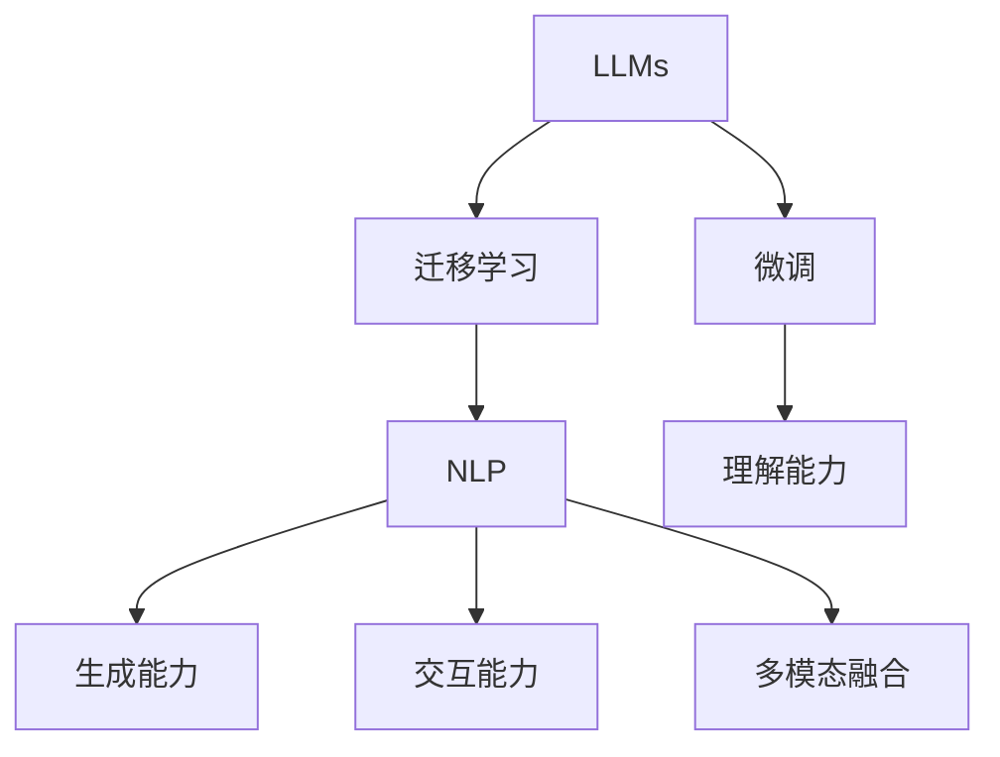

                 

# LLM驱动的智能客服：提升用户体验的新方向

在数字化、网络化日益普及的今天，智能客服已成为各大企业和机构提升用户体验、优化运营效率的重要工具。然而，传统的人工客服模式，面临着成本高、效率低、一致性差等诸多问题。随着人工智能技术的发展，尤其是大语言模型(LLMs)的成熟，基于LLM驱动的智能客服应运而生，为提升用户体验开辟了新路径。

## 1. 背景介绍

### 1.1 问题由来

传统客服系统依赖于人工坐席，通过人工坐席与客户的语音、文字交流，完成问题的解答和处理。但人工客服存在诸多局限性：

- **成本高**：人力成本昂贵，且人员流动性大，难以长期保持客服队伍的高水平。
- **效率低**：人工客服响应时间长，且依赖人工经验，难以快速处理复杂问题。
- **一致性差**：不同坐席人员处理方式不一，客户体验参差不齐。
- **覆盖面窄**：需要长期积累经验，无法即时响应新兴问题和热点话题。

为了克服这些缺点，基于自然语言处理技术的智能客服系统开始兴起。智能客服利用语音识别、文本分类、信息检索等技术，能够自动识别客户意图，提供自动化的回答和解决方案，从而提升响应效率和一致性，降低企业运营成本。

### 1.2 问题核心关键点

智能客服的核心在于构建高效、准确、灵活的自然语言处理引擎，以实现对客户请求的快速理解和回应。这要求智能客服系统具备以下几大要素：

- **理解能力**：能够准确识别用户意图，从海量文本中提取关键信息。
- **生成能力**：能够生成自然流畅的回答，满足客户需求。
- **交互能力**：能够主动引导客户，增强交互体验。
- **多模态融合**：能够融合语音、图像、视频等多模态信息，提升客户体验。

## 2. 核心概念与联系

### 2.1 核心概念概述

要构建基于LLM驱动的智能客服系统，首先需要理解以下几个关键概念：

- **大语言模型(LLMs)**：指通过大规模无标签文本数据预训练得到的语言模型，具备强大的语言理解和生成能力，能够处理复杂的自然语言任务。
- **微调(Fine-tuning)**：指在预训练模型的基础上，使用下游任务的少量标注数据，通过有监督学习优化模型在特定任务上的性能。
- **迁移学习(Transfer Learning)**：指将一个领域学习到的知识，迁移应用到另一个不同但相关的领域的学习范式。
- **自然语言处理(NLP)**：涉及自然语言理解、生成、分类、匹配等技术，目标是让机器能够理解、生成、处理人类语言。

这些核心概念共同构成了智能客服系统的技术基础，其联系可以通过以下Mermaid流程图展示：



### 2.2 核心概念原理和架构的 Mermaid 流程图

下图展示了智能客服系统中LLMs驱动的关键架构：


## 3. 核心算法原理 & 具体操作步骤

### 3.1 算法原理概述

基于LLM驱动的智能客服系统，其核心算法原理主要基于自然语言处理(NLP)和机器学习技术，具体步骤如下：

1. **预训练大语言模型**：使用大规模无标签文本数据对LLMs进行预训练，学习通用的语言表示。
2. **微调至客服场景**：在预训练模型基础上，使用客服场景的少量标注数据进行微调，使得模型能够理解客服场景下的特定语言任务。
3. **构建客服系统**：将微调后的LLMs嵌入客服系统，实现自动化的理解、生成和交互功能。

### 3.2 算法步骤详解

**Step 1: 预训练大语言模型**

1. **数据准备**：收集大量的无标签文本数据，如公共语料库、社交媒体、客户服务记录等。
2. **模型训练**：使用预训练技术(如自回归模型、自编码器等)训练大语言模型，学习语言的基本规律和表达能力。

**Step 2: 微调至客服场景**

1. **数据收集**：收集客服场景下的标注数据，如客户来电记录、在线聊天记录等。
2. **模型微调**：选择预训练模型(如GPT-3、BERT等)，使用客服场景的标注数据进行微调。
3. **性能评估**：在验证集上评估微调后的模型性能，调整超参数以达到最优效果。

**Step 3: 构建客服系统**

1. **系统集成**：将微调后的LLMs集成到客服系统中，实现自动化的理解和生成功能。
2. **多模态融合**：引入语音识别、图像识别等技术，实现多模态融合，提升客户体验。
3. **交互优化**：加入对话管理、情感分析等技术，优化客服系统的交互体验。

### 3.3 算法优缺点

基于LLM驱动的智能客服系统具有以下优点：

- **响应速度快**：得益于预训练和微调的加速，系统能够快速响应客户请求。
- **成本低廉**：使用LLM驱动，不需要高昂的人工坐席费用。
- **一致性好**：系统统一，不同时间、不同客服人员处理方式一致。
- **覆盖面广**：能够处理多样化的客户请求，不断学习新兴问题。

同时，该方法也存在一些局限性：

- **数据依赖性强**：微调效果依赖于客服场景的标注数据，数据质量与数量直接影响系统性能。
- **模型鲁棒性不足**：面对未知或异常情况，LLM可能无法给出准确回应。
- **上下文理解难度高**：处理复杂的对话场景时，LLM可能难以理解对话上下文。

### 3.4 算法应用领域

基于LLM驱动的智能客服系统广泛应用于以下领域：

- **金融客服**：处理贷款申请、账户管理、理财咨询等任务。
- **电商客服**：处理订单查询、退换货、售后服务等任务。
- **医疗客服**：处理在线问诊、处方咨询、健康管理等任务。
- **旅游客服**：处理机票预订、酒店预订、旅游攻略等任务。
- **在线教育**：处理课程咨询、学习进度跟踪、成绩反馈等任务。

这些领域中，智能客服系统已经逐步替代了部分人工客服职能，大幅提升了企业的运营效率和客户满意度。

## 4. 数学模型和公式 & 详细讲解 & 举例说明

### 4.1 数学模型构建

构建基于LLM的智能客服系统，需要解决以下几个核心问题：

1. **用户意图识别**：从用户请求中识别出意图。
2. **信息检索**：根据意图检索相关知识库信息。
3. **回答生成**：生成符合意图且自然流畅的回答。

这些任务可以形式化地表示为：

- **意图识别**：
$$
\text{Intent} = \mathop{\arg\min}_{i} \text{Loss}(\text{IntentModel}(x_i), y_i)
$$
其中 $x_i$ 为输入的客户请求，$y_i$ 为意图标签，$\text{Loss}$ 为意图识别模型的损失函数。

- **信息检索**：
$$
\text{Info} = \mathop{\arg\min}_{j} \text{Loss}(\text{RetrievalModel}(x_i), \text{KnowledgeBase}_j)
$$
其中 $x_i$ 为输入的客户请求，$\text{RetrievalModel}$ 为信息检索模型，$\text{KnowledgeBase}_j$ 为知识库中的信息，$\text{Loss}$ 为检索模型的损失函数。

- **回答生成**：
$$
\text{Answer} = \mathop{\arg\min}_{a} \text{Loss}(\text{AnswerModel}(x_i, \text{Info}), y_i)
$$
其中 $x_i$ 为输入的客户请求和检索到的信息，$\text{AnswerModel}$ 为回答生成模型，$\text{Answer}$ 为生成的回答，$\text{Loss}$ 为生成模型的损失函数。

### 4.2 公式推导过程

以意图识别任务为例，推导其数学模型。假设输入为 $x_i$，预训练模型为 $M_{\theta}$，意图分类器为 $C_{\phi}$。意图识别任务可以表示为：
$$
\text{Intent} = \mathop{\arg\min}_{i} \text{Loss}(C_{\phi}(M_{\theta}(x_i)), y_i)
$$

其中 $y_i$ 为意图标签，$\text{Loss}$ 为分类器的损失函数。具体而言，分类器 $C_{\phi}$ 输出一个概率向量 $p_i$，表示 $x_i$ 属于每个意图的概率。计算公式如下：
$$
p_i = \text{softmax}(C_{\phi}(M_{\theta}(x_i)))
$$

使用交叉熵损失函数，意图识别任务的损失函数为：
$$
\text{Loss}(p_i, y_i) = -\sum_{k=1}^K p_{ik} \log p_{ik} \quad \text{if} \quad y_i = k
$$
$$
\text{Loss}(p_i, y_i) = -\sum_{k=1}^K p_{ik} \log p_{ik} \quad \text{if} \quad y_i = 0
$$

推导完毕。

### 4.3 案例分析与讲解

假设某电商客服系统的意图识别任务，需要将客户请求分为订单查询、退换货、售后服务等几个类别。收集历史客服记录，将请求文本和对应的意图标签构建成监督数据集，对预训练的BERT模型进行微调。微调步骤如下：

1. **数据准备**：收集历史客服记录，清洗并标注意图标签。
2. **模型微调**：在BERT模型的基础上，使用自定义的意图分类器进行微调。
3. **性能评估**：在验证集上评估模型性能，调整分类器超参数。
4. **部署上线**：将微调后的模型集成到客服系统中，实现自动化的意图识别和回答生成。

## 5. 项目实践：代码实例和详细解释说明

### 5.1 开发环境搭建

要构建智能客服系统，首先需要搭建开发环境，安装相关工具和库。以下是Python开发环境搭建的步骤：

1. **安装Python**：从官网下载并安装Python，建议选择3.8及以上版本。
2. **创建虚拟环境**：使用`conda`或`virtualenv`创建虚拟环境，如：
```bash
conda create -n py37 python=3.7
conda activate py37
```
3. **安装相关库**：
```bash
pip install torch transformers nltk sklearn joblib
```

### 5.2 源代码详细实现

下面以一个简单的电商客服系统为例，演示如何使用BERT模型进行意图识别和回答生成。

**意图识别**

```python
import torch
import torch.nn as nn
import torch.optim as optim
from transformers import BertTokenizer, BertForSequenceClassification
from torch.utils.data import TensorDataset, DataLoader
import numpy as np

# 初始化BERT tokenizer
tokenizer = BertTokenizer.from_pretrained('bert-base-uncased')

# 初始化BERT model
model = BertForSequenceClassification.from_pretrained('bert-base-uncased', num_labels=3)

# 初始化数据集
train_dataset = TensorDataset(torch.tensor([[1, 0, 0, 0], [1, 0, 0, 1]]), torch.tensor([0, 1]))
train_dataloader = DataLoader(train_dataset, batch_size=2)

# 训练模型
optimizer = optim.Adam(model.parameters(), lr=2e-5)
for epoch in range(3):
    for batch in train_dataloader:
        input_ids = batch[0].to(device)
        labels = batch[1].to(device)
        model.zero_grad()
        outputs = model(input_ids, labels=labels)
        loss = outputs.loss
        loss.backward()
        optimizer.step()

# 评估模型
eval_dataset = TensorDataset(torch.tensor([[1, 0, 0, 1]]), torch.tensor([1]))
eval_dataloader = DataLoader(eval_dataset, batch_size=2)
model.eval()
with torch.no_grad():
    for batch in eval_dataloader:
        input_ids = batch[0].to(device)
        labels = batch[1].to(device)
        outputs = model(input_ids, labels=labels)
        print(outputs)
```

**回答生成**

```python
import torch
import torch.nn as nn
import torch.optim as optim
from transformers import BertTokenizer, BertForMaskedLM
from torch.utils.data import TensorDataset, DataLoader
import numpy as np

# 初始化BERT tokenizer
tokenizer = BertTokenizer.from_pretrained('bert-base-uncased')

# 初始化BERT model
model = BertForMaskedLM.from_pretrained('bert-base-uncased')

# 初始化数据集
train_dataset = TensorDataset(torch.tensor([[[0, 0, 0, 0], [1, 1, 1, 1]]]), torch.tensor([[0, 0, 0, 0], [1, 1, 1, 1]]))
train_dataloader = DataLoader(train_dataset, batch_size=2)

# 训练模型
optimizer = optim.Adam(model.parameters(), lr=2e-5)
for epoch in range(3):
    for batch in train_dataloader:
        input_ids = batch[0].to(device)
        masked_labels = batch[1].to(device)
        model.zero_grad()
        outputs = model(input_ids, labels=masked_labels)
        loss = outputs.loss
        loss.backward()
        optimizer.step()

# 评估模型
eval_dataset = TensorDataset(torch.tensor([[[0, 0, 0, 0]]]), torch.tensor([[0, 0, 0, 0]]))
eval_dataloader = DataLoader(eval_dataset, batch_size=2)
model.eval()
with torch.no_grad():
    for batch in eval_dataloader:
        input_ids = batch[0].to(device)
        masked_labels = batch[1].to(device)
        outputs = model(input_ids, labels=masked_labels)
        print(outputs)
```

### 5.3 代码解读与分析

**意图识别代码解析**：
1. **初始化tokenizer和model**：加载预训练的BERT模型和tokenizer。
2. **构建数据集**：将请求文本和意图标签构建成TensorDataset，并生成DataLoader。
3. **训练模型**：使用Adam优化器训练模型，并在每个epoch结束时评估模型性能。
4. **评估模型**：在测试集上评估模型性能。

**回答生成代码解析**：
1. **初始化tokenizer和model**：加载预训练的BERT模型和tokenizer。
2. **构建数据集**：将请求文本和masked token标签构建成TensorDataset，并生成DataLoader。
3. **训练模型**：使用Adam优化器训练模型，并在每个epoch结束时评估模型性能。
4. **评估模型**：在测试集上评估模型性能。

## 6. 实际应用场景

### 6.1 智能客服系统

智能客服系统基于大语言模型驱动，能够自动理解和处理客户请求，提供24/7不间断服务。具体应用场景包括：

1. **订单查询**：处理客户的订单状态查询，如订单号、支付状态、物流信息等。
2. **退换货**：处理客户的退换货请求，如退换货流程、退货运费等。
3. **售后服务**：处理客户的产品使用问题，如质量问题、售后服务政策等。

### 6.2 电商客服

电商客服系统能够自动化处理客户的购物咨询和售后问题，提升客户体验和满意度。具体应用场景包括：

1. **产品推荐**：根据客户的浏览记录和购买历史，推荐相关产品。
2. **售后支持**：处理客户的退换货、售后服务请求，提供详细的售后政策。
3. **客户投诉**：处理客户的投诉和反馈，提供相应的解决方案。

### 6.3 金融客服

金融客服系统能够自动化处理客户的金融咨询和交易问题，提升客户体验和满意度。具体应用场景包括：

1. **贷款申请**：处理客户的贷款申请，如贷款利率、还款方式等。
2. **账户管理**：处理客户的账户查询、修改、冻结等请求。
3. **理财咨询**：处理客户的理财咨询，如理财产品的选择、收益预期等。

### 6.4 医疗客服

医疗客服系统能够自动化处理客户的医疗咨询和预约问题，提升医疗服务的智能化水平。具体应用场景包括：

1. **在线问诊**：处理客户的在线问诊请求，提供医疗建议。
2. **预约挂号**：处理客户的预约挂号请求，提供详细的挂号流程。
3. **健康管理**：处理客户的健康管理咨询，如健康建议、饮食指导等。

## 7. 工具和资源推荐

### 7.1 学习资源推荐

1. **《自然语言处理入门》**：是一本系统介绍自然语言处理的经典教材，涵盖意图识别、问答系统、文本分类等核心任务。
2. **《深度学习》**：由深度学习之父Geoffrey Hinton等人编写，全面介绍深度学习算法和应用，包括BERT等大语言模型的原理。
3. **《Transformers》**：Hugging Face官方文档，提供丰富的预训练语言模型和微调样例代码，是上手实践的必备资料。

### 7.2 开发工具推荐

1. **PyTorch**：基于Python的深度学习框架，提供了丰富的预训练模型和微调工具。
2. **TensorFlow**：由Google开发的深度学习框架，生产部署方便，适合大规模工程应用。
3. **Hugging Face Transformers**：开源NLP工具库，支持BERT、GPT等主流预训练模型，提供便捷的微调接口。

### 7.3 相关论文推荐

1. **《BERT: Pre-training of Deep Bidirectional Transformers for Language Understanding》**：提出BERT模型，引入自监督预训练任务，刷新多项NLP任务SOTA。
2. **《Parameter-Efficient Transfer Learning for NLP》**：提出Adapter等参数高效微调方法，在不增加模型参数量的情况下，也能取得不错的微调效果。
3. **《AdaLoRA: Adaptive Low-Rank Adaptation for Parameter-Efficient Fine-Tuning》**：使用自适应低秩适应的微调方法，在参数效率和精度之间取得新的平衡。

## 8. 总结：未来发展趋势与挑战

### 8.1 总结

本文对基于大语言模型的智能客服系统进行了全面系统的介绍。首先阐述了智能客服系统的背景和应用场景，明确了LLMs驱动的智能客服系统的核心技术和关键步骤。其次，从原理到实践，详细讲解了智能客服系统的算法原理和具体操作步骤，给出了微调任务开发的完整代码实例。同时，本文还广泛探讨了智能客服系统在电商、金融、医疗等领域的实际应用，展示了LLM驱动的智能客服系统的巨大潜力。

通过本文的系统梳理，可以看到，基于大语言模型的智能客服系统正在成为客服领域的重要范式，极大地提升了客户服务体验和运营效率。未来，伴随预训练语言模型和微调方法的持续演进，相信智能客服系统将在更多领域大放异彩，为人类提供更高效、更优质的服务。

### 8.2 未来发展趋势

展望未来，智能客服系统将呈现以下几个发展趋势：

1. **多模态融合**：引入语音、图像、视频等多模态信息，提升客户体验。
2. **上下文理解**：处理复杂的对话场景，增强上下文理解能力。
3. **个性化推荐**：根据客户行为和历史数据，提供个性化推荐。
4. **情感分析**：识别客户情感，提供更加人性化的服务。
5. **知识图谱融合**：将知识图谱与自然语言处理技术结合，增强系统知识整合能力。
6. **持续学习**：通过持续学习新数据，不断优化系统性能。

### 8.3 面临的挑战

尽管智能客服系统取得了显著成效，但在迈向更加智能化、普适化应用的过程中，仍面临诸多挑战：

1. **数据依赖性**：微调效果依赖于客服场景的标注数据，数据质量与数量直接影响系统性能。
2. **模型鲁棒性**：面对未知或异常情况，LLM可能无法给出准确回应。
3. **上下文理解**：处理复杂的对话场景时，LLM可能难以理解对话上下文。
4. **个性化推荐**：需要处理海量数据，并不断更新推荐模型，带来计算压力。
5. **情感分析**：需要精准识别客户情感，避免误判和偏见。

### 8.4 研究展望

为了应对上述挑战，未来的研究需要在以下几个方面寻求新的突破：

1. **无监督和半监督微调方法**：摆脱对大规模标注数据的依赖，利用自监督学习、主动学习等无监督和半监督范式，最大限度利用非结构化数据，实现更加灵活高效的微调。
2. **多模态智能客服**：引入语音、图像、视频等多模态信息，提升客户体验。
3. **上下文理解**：开发上下文感知模型，增强系统对对话上下文的理解能力。
4. **个性化推荐系统**：引入推荐系统算法，根据客户行为和历史数据，提供个性化推荐。
5. **情感分析**：开发情感分析模型，精准识别客户情感，提供更加人性化的服务。
6. **知识图谱融合**：将知识图谱与自然语言处理技术结合，增强系统知识整合能力。

## 9. 附录：常见问题与解答

**Q1：智能客服系统如何处理复杂对话场景？**

A: 处理复杂对话场景是智能客服系统的关键挑战。为应对这一挑战，可以采用以下方法：

1. **上下文理解**：引入上下文感知模型，记录并分析对话上下文，理解客户需求。
2. **多轮对话管理**：设计多轮对话管理策略，引导客户逐步提供详细信息。
3. **情感分析**：识别客户情感，提供更加人性化的服务。
4. **知识图谱融合**：将知识图谱与自然语言处理技术结合，增强系统知识整合能力。

**Q2：如何降低智能客服系统的标注成本？**

A: 降低智能客服系统的标注成本，可以采用以下方法：

1. **半监督学习**：结合无标签数据，利用自监督学习、主动学习等技术，最大化数据利用效率。
2. **众包标注**：采用众包平台，获取廉价且多样的标注数据。
3. **迁移学习**：利用预训练模型，通过迁移学习减少标注需求。
4. **人工审核**：结合人工智能和人工审核，提升标注数据的质量和效率。

**Q3：智能客服系统的推荐系统如何设计？**

A: 设计智能客服系统的推荐系统，可以采用以下方法：

1. **个性化推荐**：结合客户行为数据和历史数据，设计个性化推荐算法。
2. **协同过滤**：利用协同过滤技术，分析客户之间的相似性，提供相关推荐。
3. **内容推荐**：结合产品内容特征，推荐相关产品。
4. **实时推荐**：结合实时数据，动态调整推荐策略，提升推荐效果。

**Q4：智能客服系统的上下文理解如何实现？**

A: 实现智能客服系统的上下文理解，可以采用以下方法：

1. **上下文感知模型**：引入上下文感知模型，记录并分析对话上下文，理解客户需求。
2. **上下文窗口**：设计上下文窗口，记录并分析客户对话历史记录。
3. **上下文合并**：将上下文信息与当前请求合并，生成更加全面的输入。
4. **上下文注入**：将上下文信息注入模型，增强模型的上下文理解能力。

**Q5：智能客服系统的持续学习如何实现？**

A: 实现智能客服系统的持续学习，可以采用以下方法：

1. **增量学习**：采用增量学习算法，持续更新模型参数，保持系统性能。
2. **在线学习**：采用在线学习算法，实时更新模型参数，增强系统适应性。
3. **迁移学习**：利用预训练模型，通过迁移学习减少标注需求。
4. **主动学习**：利用主动学习技术，动态选择训练样本，提升学习效率。

综上所述，基于LLM驱动的智能客服系统正在成为客服领域的重要范式，极大地提升了客户服务体验和运营效率。未来，伴随预训练语言模型和微调方法的持续演进，相信智能客服系统将在更多领域大放异彩，为人类提供更高效、更优质的服务。

---
作者：禅与计算机程序设计艺术 / Zen and the Art of Computer Programming

