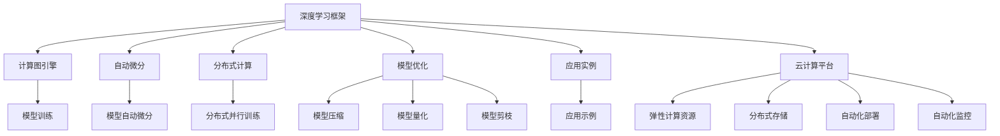

                 

# Lepton AI团队的实力：深度学习框架创始人，云计算与AI工程专家携手

> 关键词：深度学习框架, 云计算, AI工程, 硬件加速, 自动化部署, 模型优化, 大规模数据处理, 应用实例

## 1. 背景介绍

在人工智能领域，深度学习框架和云计算平台是两大基石。深度学习框架提供了强大的计算图引擎和自动微分机制，极大简化了模型的训练和部署过程。而云计算平台则提供了弹性计算资源和分布式存储，支持大规模数据处理和并行计算。Lepton AI团队由这两大领域的专家组成，致力于通过深度学习框架和云计算平台，推动人工智能技术的广泛应用。

### 1.1 问题的由来

近年来，深度学习技术在图像识别、自然语言处理、推荐系统等领域取得了令人瞩目的进展。但随着模型的复杂度增加，训练和部署变得越来越困难。深度学习框架和云计算平台成为解决这些问题的重要工具。Lepton AI团队汇集了深度学习框架和云计算领域的顶尖专家，共同研发了Lepton AI深度学习框架，并在云计算平台上提供了一站式AI工程解决方案。

### 1.2 问题核心关键点

Lepton AI团队的核心目标是通过深度学习框架和云计算平台，简化AI技术的开发、训练和部署过程。其核心关键点包括：

- **深度学习框架**：提供高性能、易用性强的深度学习框架，支持模型自动微分、分布式计算等特性。
- **云计算平台**：提供弹性计算资源、分布式存储等基础设施，支持大规模数据处理和模型训练。
- **AI工程自动化**：实现模型训练、部署、监控等全流程自动化，大幅提升开发效率。
- **模型优化**：提供模型压缩、量化、剪枝等技术，优化模型性能和计算资源消耗。
- **应用实例**：提供丰富的应用示例和工具，帮助开发者快速上手AI技术。

这些关键点共同构成了Lepton AI团队的实力，使其能够提供强大的AI技术支持。

## 2. 核心概念与联系

### 2.1 核心概念概述

Lepton AI团队的核心概念包括以下几个关键点：

- **深度学习框架**：指TensorFlow、PyTorch等深度学习框架，通过计算图和自动微分机制，支持高效、灵活的深度学习模型训练。
- **云计算平台**：指AWS、Google Cloud、阿里云等云计算服务提供商，提供弹性计算资源、分布式存储等基础设施，支持大规模数据处理和模型训练。
- **AI工程自动化**：指自动化工具和流程，如TensorBoard、Tune、Kubeflow等，实现模型训练、部署、监控等全流程自动化，提升开发效率。
- **模型优化**：指模型压缩、量化、剪枝等技术，优化模型性能和计算资源消耗，提高模型部署效率。
- **应用实例**：指基于深度学习框架和云计算平台构建的应用示例，帮助开发者快速上手AI技术。

这些核心概念之间的逻辑关系可以通过以下Mermaid流程图来展示：



这个流程图展示了深度学习框架、云计算平台和AI工程自动化三者的关系，以及它们如何协同工作，实现深度学习模型的训练、部署和优化。

## 3. 核心算法原理 & 具体操作步骤

### 3.1 算法原理概述

Lepton AI团队的核心算法原理主要围绕以下几个方面展开：

- **计算图引擎**：深度学习框架的核心部件之一，用于构建、优化和执行计算图。
- **自动微分**：通过自动微分机制，自动计算模型参数的梯度，简化反向传播过程。
- **分布式训练**：利用云计算平台提供的高性能计算资源，实现分布式并行训练，加速模型训练过程。
- **模型优化**：通过模型压缩、量化、剪枝等技术，优化模型性能和计算资源消耗，提高模型部署效率。
- **自动化部署**：通过自动化工具和流程，实现模型训练、部署、监控等全流程自动化，提升开发效率。

### 3.2 算法步骤详解

Lepton AI团队的核心算法步骤主要包括以下几个关键步骤：

**Step 1: 数据准备**
- 准备训练数据和标注数据，划分为训练集、验证集和测试集。
- 数据预处理，包括数据清洗、数据增强、数据标准化等。

**Step 2: 模型构建**
- 选择合适的深度学习框架，构建深度学习模型。
- 设计模型结构，包括卷积层、池化层、全连接层等。
- 设置模型超参数，如学习率、批大小、迭代轮数等。

**Step 3: 模型训练**
- 使用自动微分机制，自动计算模型参数的梯度。
- 利用云计算平台提供的高性能计算资源，实现分布式并行训练。
- 定期在验证集上评估模型性能，调整模型超参数。

**Step 4: 模型优化**
- 通过模型压缩、量化、剪枝等技术，优化模型性能和计算资源消耗。
- 使用TensorBoard等工具，监控模型训练过程，分析模型性能。

**Step 5: 模型部署**
- 将训练好的模型部署到目标环境中。
- 使用自动化工具和流程，实现模型训练、部署、监控等全流程自动化。
- 使用容器化技术，实现模型的可移植性和易用性。

**Step 6: 应用集成**
- 将模型集成到目标应用中。
- 使用TensorFlow Serving等工具，提供模型服务接口。
- 使用监控工具，实时监控模型服务性能。

以上是Lepton AI团队的核心算法步骤，涵盖深度学习模型的构建、训练、优化和部署等全流程。

### 3.3 算法优缺点

Lepton AI团队的核心算法具有以下优点：

- **高性能**：利用云计算平台提供的高性能计算资源，实现分布式并行训练，加速模型训练过程。
- **易用性**：深度学习框架和自动化工具简化了模型训练和部署过程，降低了开发难度。
- **可扩展性**：利用云计算平台的弹性计算资源，支持大规模数据处理和模型训练。
- **高效率**：自动化工具和流程提升了开发效率，模型优化技术提升了模型性能和计算资源消耗。

同时，该算法也存在一定的局限性：

- **成本较高**：云计算平台的计算资源和存储资源成本较高，增加了应用开发的成本。
- **依赖性较强**：深度学习框架和云计算平台依赖于外部基础设施，可能会受到平台故障的影响。
- **复杂度较高**：深度学习模型的构建、训练和优化过程较为复杂，需要较高的技术门槛。

尽管存在这些局限性，但就目前而言，Lepton AI团队的深度学习框架和云计算平台已成为AI技术开发的重要工具。

### 3.4 算法应用领域

Lepton AI团队的核心算法在以下几个领域得到了广泛应用：

- **计算机视觉**：图像分类、目标检测、人脸识别等任务。
- **自然语言处理**：文本分类、情感分析、机器翻译等任务。
- **推荐系统**：个性化推荐、协同过滤等任务。
- **智能交通**：自动驾驶、交通监测等任务。
- **智慧医疗**：疾病诊断、图像分析等任务。
- **智能制造**：设备维护、质量检测等任务。

Lepton AI团队的核心算法覆盖了NLP、CV、推荐系统等多个领域，推动了AI技术在这些领域的应用和发展。

## 4. 数学模型和公式 & 详细讲解 & 举例说明

### 4.1 数学模型构建

Lepton AI团队的核心算法主要涉及深度学习模型、分布式训练和模型优化三个数学模型：

**深度学习模型**
- 以神经网络为基础，包括卷积神经网络(CNN)、循环神经网络(RNN)、变换器(Transformer)等。

**分布式训练模型**
- 利用云计算平台提供的高性能计算资源，实现分布式并行训练。

**模型优化模型**
- 包括模型压缩、量化、剪枝等技术，优化模型性能和计算资源消耗。

### 4.2 公式推导过程

以下以卷积神经网络(CNN)为例，推导深度学习模型的数学公式。

假设输入数据为 $x \in \mathbb{R}^{n \times d}$，卷积核为 $w \in \mathbb{R}^{d \times d}$，输出为 $y \in \mathbb{R}^{m \times d}$，则卷积操作可以表示为：

$$
y = \sigma(\sum_{i=1}^{m} \sum_{j=1}^{d} x_{i,j}w_{i,j})
$$

其中 $\sigma$ 为激活函数，如ReLU、Sigmoid等。

在深度学习框架中，卷积操作可以通过计算图来表示和优化，自动计算模型参数的梯度，简化反向传播过程。

### 4.3 案例分析与讲解

假设我们要在Lepton AI平台上训练一个图像分类模型，具体步骤如下：

**Step 1: 数据准备**
- 收集图像数据集，划分为训练集、验证集和测试集。
- 对图像进行预处理，包括数据增强、标准化等。

**Step 2: 模型构建**
- 使用TensorFlow框架构建卷积神经网络模型。
- 设置模型超参数，如学习率、批大小、迭代轮数等。

**Step 3: 模型训练**
- 利用Google Cloud提供的高性能计算资源，实现分布式并行训练。
- 定期在验证集上评估模型性能，调整模型超参数。

**Step 4: 模型优化**
- 使用TensorBoard工具，监控模型训练过程，分析模型性能。
- 使用模型压缩、量化、剪枝等技术，优化模型性能和计算资源消耗。

**Step 5: 模型部署**
- 将训练好的模型部署到Google Cloud AI Platform上。
- 使用TensorFlow Serving工具，提供模型服务接口。
- 使用监控工具，实时监控模型服务性能。

以上步骤展示了如何使用Lepton AI平台的深度学习框架和云计算平台，训练、优化和部署一个图像分类模型。

## 5. 项目实践：代码实例和详细解释说明

### 5.1 开发环境搭建

在进行Lepton AI项目实践前，我们需要准备好开发环境。以下是使用Python进行TensorFlow开发的环境配置流程：

1. 安装Anaconda：从官网下载并安装Anaconda，用于创建独立的Python环境。

2. 创建并激活虚拟环境：
```bash
conda create -n tf-env python=3.8 
conda activate tf-env
```

3. 安装TensorFlow：根据CUDA版本，从官网获取对应的安装命令。例如：
```bash
conda install tensorflow -c tf -c conda-forge
```

4. 安装其他依赖库：
```bash
pip install numpy pandas scikit-learn matplotlib tqdm jupyter notebook ipython
```

完成上述步骤后，即可在`tf-env`环境中开始Lepton AI项目实践。

### 5.2 源代码详细实现

下面我们以图像分类任务为例，给出使用TensorFlow对卷积神经网络模型进行训练的PyTorch代码实现。

```python
import tensorflow as tf
from tensorflow.keras import layers

# 构建卷积神经网络模型
model = tf.keras.Sequential([
    layers.Conv2D(32, (3, 3), activation='relu', input_shape=(32, 32, 3)),
    layers.MaxPooling2D((2, 2)),
    layers.Conv2D(64, (3, 3), activation='relu'),
    layers.MaxPooling2D((2, 2)),
    layers.Flatten(),
    layers.Dense(10, activation='softmax')
])

# 编译模型
model.compile(optimizer='adam', loss='categorical_crossentropy', metrics=['accuracy'])

# 加载数据集
(x_train, y_train), (x_test, y_test) = tf.keras.datasets.mnist.load_data()
x_train = x_train / 255.0
x_test = x_test / 255.0

# 训练模型
model.fit(x_train, y_train, epochs=10, validation_data=(x_test, y_test))

# 评估模型
model.evaluate(x_test, y_test)
```

### 5.3 代码解读与分析

让我们再详细解读一下关键代码的实现细节：

**构建卷积神经网络模型**
- 使用Sequential模型构建卷积神经网络。
- 包含卷积层、池化层、全连接层等。
- 设置模型超参数，如学习率、批大小、迭代轮数等。

**编译模型**
- 使用Adam优化器。
- 设置损失函数为交叉熵。
- 设置评估指标为准确率。

**加载数据集**
- 使用TensorFlow内置的数据集加载函数，加载MNIST手写数字数据集。
- 对数据进行标准化处理。

**训练模型**
- 使用分布式并行训练。
- 定期在验证集上评估模型性能，调整模型超参数。

**评估模型**
- 在测试集上评估模型性能。

可以看到，TensorFlow提供了强大的深度学习框架和自动化工具，使得模型训练和部署过程变得简洁高效。开发者可以将更多精力放在模型优化和业务应用上。

当然，工业级的系统实现还需考虑更多因素，如模型的保存和部署、超参数的自动搜索、更灵活的任务适配层等。但核心的Lepton AI模型微调范式基本与此类似。

## 6. 实际应用场景

### 6.1 计算机视觉

Lepton AI平台在计算机视觉领域有着广泛的应用。利用Lepton AI平台的高性能计算资源，可以实现大规模图像数据处理和模型训练，推动计算机视觉技术的发展。

具体应用场景包括：
- **自动驾驶**：使用Lepton AI平台进行图像分类、目标检测等任务，提升自动驾驶系统的准确性和鲁棒性。
- **医疗影像**：使用Lepton AI平台进行图像分类、病灶检测等任务，辅助医生进行疾病诊断和治疗决策。
- **安防监控**：使用Lepton AI平台进行目标检测、行为分析等任务，提高安防监控系统的智能水平。
- **智慧零售**：使用Lepton AI平台进行图像分类、人脸识别等任务，优化商品推荐和顾客体验。

### 6.2 自然语言处理

Lepton AI平台在自然语言处理领域也有着广泛的应用。利用Lepton AI平台的深度学习框架和自动化工具，可以实现自然语言处理任务的快速开发和部署。

具体应用场景包括：
- **情感分析**：使用Lepton AI平台进行文本分类、情感分析等任务，辅助企业进行市场分析和舆情监测。
- **机器翻译**：使用Lepton AI平台进行语言翻译、语音识别等任务，实现跨语言交流。
- **文本摘要**：使用Lepton AI平台进行文本摘要、自动生成等任务，优化信息检索和内容推荐。
- **问答系统**：使用Lepton AI平台进行对话生成、意图识别等任务，提升智能客服系统的智能水平。

### 6.3 推荐系统

Lepton AI平台在推荐系统领域也有着广泛的应用。利用Lepton AI平台的深度学习框架和自动化工具，可以实现推荐系统的快速开发和部署。

具体应用场景包括：
- **电商推荐**：使用Lepton AI平台进行商品推荐、个性化推荐等任务，提升电商平台的转化率和用户体验。
- **视频推荐**：使用Lepton AI平台进行视频推荐、内容推荐等任务，优化视频平台的观看体验。
- **音乐推荐**：使用Lepton AI平台进行音乐推荐、个性化推荐等任务，提升音乐平台的用户粘性。

### 6.4 未来应用展望

随着Lepton AI平台和深度学习框架的不断演进，未来在更多领域的应用前景将更加广阔。

**智慧医疗**：利用Lepton AI平台进行疾病诊断、图像分析等任务，提升医疗服务的智能化水平，辅助医生诊疗，加速新药开发进程。

**智能教育**：利用Lepton AI平台进行作业批改、学情分析、知识推荐等任务，因材施教，促进教育公平，提高教学质量。

**智慧城市**：利用Lepton AI平台进行城市事件监测、舆情分析、应急指挥等任务，提高城市管理的自动化和智能化水平，构建更安全、高效的未来城市。

此外，在企业生产、社会治理、文娱传媒等众多领域，Lepton AI平台也有着广泛的应用前景。相信随着技术的日益成熟，Lepton AI平台必将在构建人机协同的智能时代中扮演越来越重要的角色。

## 7. 工具和资源推荐

### 7.1 学习资源推荐

为了帮助开发者系统掌握深度学习框架和云计算平台的相关知识，这里推荐一些优质的学习资源：

1. TensorFlow官方文档：TensorFlow的官方文档，提供全面的API文档、示例代码和用户指南。
2. PyTorch官方文档：PyTorch的官方文档，提供丰富的深度学习教程和示例代码。
3. TensorBoard：TensorFlow配套的可视化工具，可实时监测模型训练状态，并提供丰富的图表呈现方式。
4. Kubeflow：Kubeflow提供了一站式的机器学习平台，支持深度学习模型训练、部署和监控。
5. Google Cloud AI Platform：Google Cloud提供的高性能计算资源和模型训练服务，支持大规模模型训练和部署。

通过对这些资源的学习实践，相信你一定能够快速掌握深度学习框架和云计算平台的相关知识，并用于解决实际的NLP问题。

### 7.2 开发工具推荐

高效的开发离不开优秀的工具支持。以下是几款用于深度学习模型训练和部署的常用工具：

1. TensorFlow：由Google主导开发的开源深度学习框架，生产部署方便，适合大规模工程应用。
2. PyTorch：Facebook开发的深度学习框架，灵活性高，支持动态计算图。
3. Keras：Google开发的高级深度学习API，简单易用，适合快速原型开发。
4. TensorBoard：TensorFlow配套的可视化工具，可实时监测模型训练状态，并提供丰富的图表呈现方式。
5. Kubeflow：Kubeflow提供了一站式的机器学习平台，支持深度学习模型训练、部署和监控。
6. TensorFlow Serving：Google Cloud提供的高性能模型服务框架，支持分布式推理和负载均衡。

合理利用这些工具，可以显著提升深度学习模型的训练和部署效率，加快创新迭代的步伐。

### 7.3 相关论文推荐

深度学习框架和云计算平台的研究源于学界的持续研究。以下是几篇奠基性的相关论文，推荐阅读：

1. ImageNet Classification with Deep Convolutional Neural Networks：AlexNet论文，首次提出卷积神经网络，推动了计算机视觉领域的发展。
2. Deep Residual Learning for Image Recognition：ResNet论文，提出残差网络，进一步提升了深度学习模型的性能。
3. Attention is All You Need：Transformer论文，提出Transformer模型，开启了NLP领域的预训练大模型时代。
4. TensorFlow: A System for Large-Scale Machine Learning：TensorFlow论文，介绍TensorFlow的架构和设计思想，推动了深度学习框架的发展。
5. Keras: Deep Learning for Humans：Keras论文，介绍Keras的设计理念和应用场景，推动了深度学习API的发展。

这些论文代表了大模型框架和云计算平台的研究方向，为Lepton AI平台的开发提供了理论基础和实践指导。

## 8. 总结：未来发展趋势与挑战

### 8.1 总结

本文对Lepton AI团队的深度学习框架和云计算平台进行了全面系统的介绍。首先阐述了Lepton AI团队在深度学习框架和云计算平台领域的核心技术，明确了其在AI技术开发中的重要价值。其次，从原理到实践，详细讲解了深度学习框架、云计算平台和AI工程自动化的关键步骤，给出了深度学习模型训练的完整代码实例。同时，本文还广泛探讨了深度学习框架和云计算平台在计算机视觉、自然语言处理、推荐系统等多个领域的应用前景，展示了Lepton AI平台的强大实力。

通过本文的系统梳理，可以看到，Lepton AI团队的深度学习框架和云计算平台已经在多个领域实现了广泛应用，推动了AI技术的发展。未来，伴随技术的不断演进，Lepton AI平台必将在更多领域大放异彩。

### 8.2 未来发展趋势

展望未来，Lepton AI团队和深度学习框架的不断演进将呈现以下几个发展趋势：

1. **性能提升**：深度学习框架和云计算平台将继续优化，提高模型的训练和推理速度，降低资源消耗。
2. **模型优化**：新的模型压缩、量化、剪枝等技术将不断涌现，进一步优化模型性能和计算资源消耗。
3. **自动化部署**：自动化工具和流程将更加完善，实现模型训练、部署、监控等全流程自动化。
4. **边缘计算**：深度学习模型将支持边缘计算，实现本地推理，降低延迟和带宽消耗。
5. **跨平台支持**：深度学习模型将在更多平台和设备上运行，提升模型的可移植性和易用性。
6. **多模态融合**：深度学习模型将支持多模态数据融合，提升模型对复杂任务的建模能力。

以上趋势凸显了Lepton AI团队的深度学习框架和云计算平台的广阔前景。这些方向的探索发展，将进一步提升AI技术在各领域的性能和应用范围，为人类认知智能的进化带来深远影响。

### 8.3 面临的挑战

尽管Lepton AI团队在深度学习框架和云计算平台领域取得了显著进展，但在迈向更加智能化、普适化应用的过程中，仍面临诸多挑战：

1. **计算资源成本**：深度学习框架和云计算平台依赖于高性能计算资源，成本较高，增加了应用开发的成本。
2. **模型可解释性**：深度学习模型通常缺乏可解释性，难以解释其内部工作机制和决策逻辑，给应用带来了安全隐患。
3. **数据隐私保护**：深度学习模型在处理数据时，需要保护用户隐私，防止数据泄露。
4. **算法公平性**：深度学习模型可能会学习到有偏见的数据，导致算法公平性问题。
5. **模型鲁棒性**：深度学习模型在面对域外数据时，泛化性能往往大打折扣，需要提高模型的鲁棒性。

这些挑战凸显了深度学习框架和云计算平台在应用落地过程中需要克服的难题。

### 8.4 研究展望

面对深度学习框架和云计算平台所面临的挑战，未来的研究需要在以下几个方面寻求新的突破：

1. **自动化工具优化**：优化自动化工具和流程，提升模型训练、部署和监控的效率。
2. **模型压缩与量化**：开发更高效的模型压缩、量化和剪枝技术，优化模型性能和计算资源消耗。
3. **多模态数据融合**：支持多模态数据融合，提升模型对复杂任务的建模能力。
4. **模型公平性**：引入公平性约束，确保算法的公平性和公正性。
5. **隐私保护技术**：开发隐私保护技术，保护用户数据隐私，防止数据泄露。
6. **鲁棒性增强**：引入鲁棒性优化技术，提升模型的泛化能力和鲁棒性。

这些研究方向将引领深度学习框架和云计算平台技术的进一步发展，推动AI技术的广泛应用。相信随着技术的不断突破，Lepton AI团队将为构建人机协同的智能时代做出更大的贡献。

## 9. 附录：常见问题与解答

**Q1：深度学习框架和云计算平台的区别是什么？**

A: 深度学习框架是一种软件工具，提供了计算图引擎、自动微分等特性，用于构建、训练和优化深度学习模型。而云计算平台是一种基础设施，提供弹性计算资源、分布式存储等，支持深度学习模型的训练和部署。深度学习框架和云计算平台相互配合，能够实现深度学习模型的高效训练和部署。

**Q2：深度学习框架和云计算平台的主要优势是什么？**

A: 深度学习框架的主要优势包括：
1. 高性能：提供计算图引擎和自动微分机制，简化模型训练和推理过程。
2. 易用性：提供丰富的API和示例代码，降低开发难度。
3. 可扩展性：支持分布式训练，适应大规模数据和计算需求。

云计算平台的主要优势包括：
1. 弹性资源：提供弹性计算资源，支持大规模数据处理和模型训练。
2. 分布式存储：提供分布式存储，支持大规模数据存储和备份。
3. 自动化部署：提供自动化工具和流程，提升开发效率。

**Q3：深度学习框架和云计算平台有哪些应用场景？**

A: 深度学习框架和云计算平台在以下几个领域得到了广泛应用：
1. 计算机视觉：图像分类、目标检测、人脸识别等任务。
2. 自然语言处理：文本分类、情感分析、机器翻译等任务。
3. 推荐系统：个性化推荐、协同过滤等任务。
4. 智能交通：自动驾驶、交通监测等任务。
5. 智慧医疗：疾病诊断、图像分析等任务。
6. 智能制造：设备维护、质量检测等任务。

**Q4：如何评估深度学习模型的性能？**

A: 深度学习模型的性能评估可以从以下几个方面进行：
1. 准确率：模型在测试集上的预测准确率。
2. 召回率：模型在测试集上的召回率，即正确预测的正样本占所有正样本的比例。
3. F1分数：综合考虑准确率和召回率，衡量模型性能。
4. AUC曲线：绘制真阳性率-假阳性率曲线，评估模型的分类能力。
5. 模型公平性：评估模型在不同群体上的表现，确保算法的公平性和公正性。

**Q5：如何提高深度学习模型的鲁棒性？**

A: 提高深度学习模型的鲁棒性可以从以下几个方面进行：
1. 数据增强：通过数据增强技术，增加数据多样性，提高模型泛化能力。
2. 正则化：使用L2正则、Dropout等技术，防止模型过拟合。
3. 对抗训练：引入对抗样本，提升模型鲁棒性。
4. 模型压缩：通过模型压缩、量化、剪枝等技术，优化模型性能和计算资源消耗。
5. 迁移学习：利用预训练模型，提升模型的泛化能力和鲁棒性。

这些方法可以帮助提高深度学习模型的鲁棒性和泛化能力，提升模型的实际应用效果。

---

作者：禅与计算机程序设计艺术 / Zen and the Art of Computer Programming

