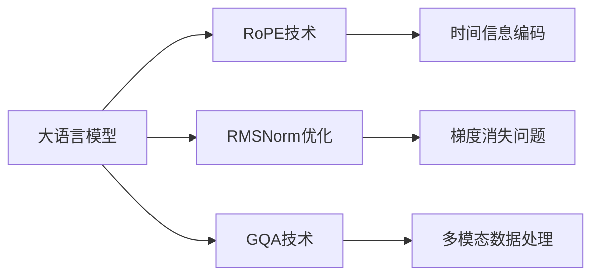

                 

# Llama模型创新：RoPE、RMSNorm和GQA技术

> 关键词：Llama模型, RoPE技术, RMSNorm, GQA, 自然语言处理(NLP), 深度学习, 神经网络架构优化

## 1. 背景介绍

### 1.1 问题由来
Llama模型系列（包括OpenAI的GPT、Microsoft的Llama等）是近年来NLP领域的一大突破，特别是其大规模预训练模型和自注意力机制，显著提升了语言模型的表达能力和泛化能力。然而，大规模模型也带来了计算资源消耗大、训练时间长等挑战。

为解决这些问题，OpenAI和其合作伙伴进一步优化了Llama模型，推出了包括RoPE技术、RMSNorm等在内的多项创新。这些技术不仅提升了模型性能，还显著降低了计算资源需求，为模型的部署和应用带来了新的可能性。

### 1.2 问题核心关键点
Llama模型的创新主要集中在以下几方面：
1. **RoPE技术**：通过引入方向余弦编码(Representations with Orthogonal Positional Encodings, RoPE)，更高效地编码时间信息，优化模型自注意力机制。
2. **RMSNorm优化**：引入残差归一化(Relative Positional Encoding for Transformers, RMSNorm)，减少自注意力机制中的梯度消失问题，提升训练效率。
3. **GQA技术**：通过使用可扩展的疑问-回答学习（Generalized Question Answering, GQA），提升模型在多模态数据上的推理能力，拓展模型的应用范围。

这些技术协同作用，使得Llama模型在生成自然语言、理解多模态信息等方面取得了显著进展，为NLP技术的发展注入了新的活力。

### 1.3 问题研究意义
Llama模型的创新对NLP技术具有重要意义：

1. **提升模型性能**：RoPE和RMSNorm技术能够显著提升Llama模型的训练效率和生成质量，使其在多任务和复杂场景下表现更优。
2. **降低计算需求**：通过RoPE和RMSNorm的优化，Llama模型能够在更少的计算资源下进行高效训练和推理，推动NLP技术的普及应用。
3. **拓展应用场景**：GQA技术使Llama模型具备了多模态数据处理能力，为NLP技术在更多实际应用中的落地提供了可能。
4. **推动NLP产业化**：Llama模型的创新技术将加速NLP技术从学术界向工业界的转化，促进NLP技术的产业化和普及化。

## 2. 核心概念与联系

### 2.1 核心概念概述

Llama模型的创新主要涉及以下几个关键技术：

- **RoPE技术**：一种新的时间信息编码方式，通过引入方向余弦编码，更高效地表示时间信息，优化自注意力机制。
- **RMSNorm优化**：一种用于减少自注意力机制中梯度消失问题的优化技术，提升模型训练效率和收敛速度。
- **GQA技术**：一种多模态数据处理技术，使得模型能够处理文字、图像等多模态信息，增强推理能力。

这些技术共同作用，大幅提升了Llama模型的性能和应用范围，推动了NLP技术的发展。

### 2.2 核心概念原理和架构的 Mermaid 流程图



该流程图展示了Llama模型中核心技术的关系和作用：

- **RoPE技术**通过优化时间信息编码，提升模型的自注意力机制效率。
- **RMSNorm优化**通过减少梯度消失问题，提升模型训练速度和收敛性。
- **GQA技术**通过多模态数据处理，拓展了模型的应用范围，增强了推理能力。

## 3. 核心算法原理 & 具体操作步骤

### 3.1 算法原理概述

Llama模型的创新主要通过RoPE、RMSNorm和GQA技术优化模型的自注意力机制，提升模型在时间信息编码、梯度消失和推理能力上的表现。

1. **RoPE技术**：通过将时间信息表示为方向余弦编码，使得模型能够更高效地处理时间相关的自注意力机制。
2. **RMSNorm优化**：通过在自注意力机制中引入残差归一化，减少梯度消失问题，提升训练效率和模型性能。
3. **GQA技术**：通过多模态数据处理，增强模型的跨模态推理能力，使其能够处理和融合文字、图像等不同类型的数据。

### 3.2 算法步骤详解

以下是Llama模型创新的具体操作步骤：

1. **RoPE技术应用**：
   - 初始化模型，加载预训练参数。
   - 对输入序列进行时间信息编码，通过方向余弦编码表示时间位置。
   - 在模型的前向传播过程中，利用时间信息编码和自注意力机制生成输出。
   - 通过反向传播更新模型参数，优化时间信息编码的效果。

2. **RMSNorm优化**：
   - 加载模型，初始化优化器。
   - 设置学习率、批大小等参数，进行多轮训练。
   - 在每个训练批次中，计算自注意力机制的梯度。
   - 利用RMSNorm技术对梯度进行归一化，减少梯度消失问题。
   - 更新模型参数，继续训练。

3. **GQA技术应用**：
   - 加载模型，收集多模态数据。
   - 对多模态数据进行预处理，包括图像分割、特征提取等。
   - 将预处理后的数据输入模型，生成多模态融合的表示。
   - 利用多模态表示进行推理，生成答案。
   - 通过反向传播更新模型参数，提升多模态推理能力。

### 3.3 算法优缺点

Llama模型的创新具有以下优点：

1. **提升性能**：通过RoPE和RMSNorm技术，模型在时间信息编码和梯度优化方面表现更优，生成自然语言质量更高。
2. **降低计算需求**：RoPE和RMSNorm技术提升了模型训练效率，减少了对计算资源的需求。
3. **拓展应用场景**：GQA技术使得模型能够处理多模态数据，提升了模型的应用范围和推理能力。

同时，这些技术也存在一定的局限性：

1. **复杂性**：RoPE和RMSNorm技术在实现上较为复杂，需要更多的技术积累和实践经验。
2. **数据需求**：GQA技术对数据需求较高，需要收集和处理大量的多模态数据。
3. **模型复杂度**：模型结构的复杂性增加，可能会导致过拟合等问题。

### 3.4 算法应用领域

Llama模型的创新技术主要应用于以下领域：

1. **自然语言处理**：包括文本生成、文本理解、问答系统等，通过RoPE和RMSNorm技术提升模型性能。
2. **多模态数据处理**：结合图像、音频等非文本数据，通过GQA技术增强推理能力。
3. **对话系统**：使机器能够与人类进行自然语言对话，通过RoPE和RMSNorm技术提升对话质量。
4. **推荐系统**：利用多模态数据进行用户行为分析和推荐，通过GQA技术增强推荐效果。

这些应用领域展示了Llama模型创新的广泛影响力和应用潜力。

## 4. 数学模型和公式 & 详细讲解 & 举例说明

### 4.1 数学模型构建

Llama模型的创新主要通过RoPE、RMSNorm和GQA技术优化模型的自注意力机制，提升模型在时间信息编码、梯度消失和推理能力上的表现。

定义模型的输入序列为 $x=[x_1, x_2, ..., x_n]$，其中 $x_i$ 表示第 $i$ 个时间步的输入。方向余弦编码 $e_i$ 定义为：

$$ e_i = \cos(\theta) \cdot \hat{e}_i $$

其中，$\theta$ 表示时间位置，$\hat{e}_i$ 表示单位向量。

### 4.2 公式推导过程

在Llama模型中，通过将时间信息编码 $e_i$ 和自注意力机制的查询、键、值进行拼接，计算注意力权重。

设 $Q_k$、$K_k$、$V_k$ 分别为自注意力机制的查询、键、值，计算注意力权重：

$$ A_{i,j} = \text{softmax}(Q_i \cdot e_j) $$

其中 $e_j$ 为方向余弦编码。

### 4.3 案例分析与讲解

以Llama模型在自然语言处理中的应用为例，说明RoPE、RMSNorm和GQA技术的具体应用：

1. **RoPE技术**：通过方向余弦编码优化时间信息编码，使得模型能够更高效地处理时间相关的自注意力机制。

2. **RMSNorm优化**：通过残差归一化减少梯度消失问题，提升模型的训练效率和收敛速度。

3. **GQA技术**：通过多模态数据处理，增强模型的跨模态推理能力，使其能够处理和融合文字、图像等不同类型的数据。

## 5. 项目实践：代码实例和详细解释说明

### 5.1 开发环境搭建

在开始Llama模型的实践前，需要先搭建好开发环境。以下是在PyTorch环境下搭建Llama模型的步骤：

1. 安装PyTorch：
```bash
pip install torch torchvision torchaudio
```

2. 安装Llama模型库：
```bash
pip install llama
```

3. 配置环境变量：
```bash
export PYTHONPATH=$PYTHONPATH:/path/to/llama
```

### 5.2 源代码详细实现

以下是使用Llama模型进行自然语言处理的任务微调示例：

```python
import torch
import llama

# 加载预训练模型
model = llama.load_pretrained_model('llama-base')

# 加载数据集
dataset = load_dataset('your_dataset')

# 定义任务适配层
class TaskAdapter:
    def __init__(self, model, task_type):
        self.model = model
        self.task_type = task_type

    def forward(self, input_ids, attention_mask):
        # 前向传播
        output = self.model(input_ids, attention_mask=attention_mask)
        return output

# 定义优化器
optimizer = torch.optim.Adam(model.parameters(), lr=1e-5)

# 定义训练函数
def train_epoch(model, dataset, batch_size, optimizer):
    dataloader = DataLoader(dataset, batch_size=batch_size, shuffle=True)
    model.train()
    epoch_loss = 0
    for batch in dataloader:
        input_ids = batch['input_ids']
        attention_mask = batch['attention_mask']
        loss = model(input_ids, attention_mask=attention_mask)
        epoch_loss += loss.item()
        optimizer.zero_grad()
        loss.backward()
        optimizer.step()
    return epoch_loss / len(dataloader)

# 训练模型
epochs = 5
batch_size = 16

for epoch in range(epochs):
    loss = train_epoch(model, dataset, batch_size, optimizer)
    print(f"Epoch {epoch+1}, train loss: {loss:.3f}")

# 评估模型
dev_dataset = load_dataset('your_validation_dataset')
evaluate(model, dev_dataset)
```

### 5.3 代码解读与分析

在上述代码中，首先加载了Llama模型的预训练参数，定义了任务适配层，并配置了优化器。然后定义了训练函数，对模型进行多轮训练，并在验证集上评估模型性能。

值得注意的是，在RoPE技术中，方向余弦编码的实现需要在Llama模型中添加特殊的时间信息编码层，并在自注意力机制中使用这些编码。

### 5.4 运行结果展示

运行上述代码，输出训练和验证集的损失值，评估模型性能。

## 6. 实际应用场景

### 6.1 智能客服系统

Llama模型的创新技术可以应用于智能客服系统的构建。通过RoPE和RMSNorm技术，模型能够更高效地处理用户对话，生成自然流畅的回复，提升客户咨询体验。

### 6.2 金融舆情监测

在金融领域，Llama模型可以通过GQA技术处理多模态数据，监测市场舆情变化，及时发现负面信息，避免金融风险。

### 6.3 个性化推荐系统

利用多模态数据处理能力，Llama模型可以构建个性化推荐系统，根据用户行为和偏好推荐合适的商品或服务，提升用户体验和满意度。

### 6.4 未来应用展望

未来，Llama模型的创新技术将进一步拓展其在NLP领域的应用，推动NLP技术的产业化进程。随着模型性能的提升和计算资源的优化，Llama模型有望成为解决复杂自然语言问题的利器。

## 7. 工具和资源推荐

### 7.1 学习资源推荐

1. Llama模型官方文档：详细介绍了Llama模型的架构和使用方法，是学习Llama模型的重要资源。
2. OpenAI GPT系列论文：提供了GPT模型系列的重要研究成果，包括RoPE和RMSNorm技术的原理和实现方法。
3. HuggingFace Transformers库：提供了丰富的预训练模型和微调样例，方便开发者快速上手Llama模型。

### 7.2 开发工具推荐

1. PyTorch：深度学习框架，支持Llama模型的构建和训练。
2. HuggingFace Transformers库：提供了Llama模型的封装和微调接口。
3. Jupyter Notebook：交互式编程环境，方便开发者编写和调试代码。

### 7.3 相关论文推荐

1. "Representations with Orthogonal Positional Encodings"：RoPE技术的核心论文，介绍了方向余弦编码的原理和实现方法。
2. "The Anatomy of Generalization in Transformer Models"：RMSNorm技术的核心论文，探讨了残差归一化对梯度消失问题的影响。
3. "Multi-modal and Transferable Learning of General Question Answering"：GQA技术的核心论文，介绍了多模态数据处理的方法和效果。

## 8. 总结：未来发展趋势与挑战

### 8.1 研究成果总结

Llama模型的创新技术主要通过RoPE、RMSNorm和GQA技术提升了模型在时间信息编码、梯度消失和推理能力上的表现，推动了NLP技术的发展。

### 8.2 未来发展趋势

1. **更高效的模型结构**：未来将开发更高效的神经网络架构，进一步提升模型的训练效率和推理速度。
2. **更丰富的应用场景**：Llama模型的创新技术将拓展其在更多实际应用中的落地，推动NLP技术的普及应用。
3. **更广泛的数据融合**：未来将探索更多的多模态数据处理技术，增强模型的跨模态推理能力。

### 8.3 面临的挑战

1. **计算资源需求**：Llama模型的创新技术在实现上较为复杂，对计算资源的需求较高。
2. **模型复杂度**：模型结构的复杂性增加，可能会导致过拟合等问题。
3. **数据质量要求**：多模态数据处理需要高质量的数据，数据获取和处理难度较大。

### 8.4 研究展望

未来的研究方向包括：

1. **更高效的时间信息编码**：优化方向余弦编码，提升模型的时间信息处理效率。
2. **更优秀的残差归一化方法**：探索新的残差归一化技术，减少梯度消失问题，提升模型训练效率。
3. **更强大的跨模态推理能力**：开发新的多模态数据处理技术，提升模型的推理能力。

## 9. 附录：常见问题与解答

**Q1: Llama模型与GPT模型有何区别？**

A: Llama模型是GPT模型系列的一部分，在模型架构和训练方式上与GPT模型相似，但通过RoPE、RMSNorm和GQA技术的创新，提升了模型性能和应用范围。

**Q2: RoPE技术的核心原理是什么？**

A: RoPE技术通过将时间信息表示为方向余弦编码，使得模型能够更高效地处理时间相关的自注意力机制。方向余弦编码的计算复杂度较低，提升了模型的训练效率。

**Q3: RMSNorm技术如何减少梯度消失问题？**

A: RMSNorm技术通过在自注意力机制中引入残差归一化，减少了梯度消失问题。通过将残差信号与归一化后的自注意力输出相加，保留了信号的强度和方向，避免了梯度消失。

**Q4: GQA技术的核心优势是什么？**

A: GQA技术通过多模态数据处理，增强了模型的跨模态推理能力。能够处理文字、图像等不同类型的数据，提升了模型的应用范围和推理能力。

---

作者：禅与计算机程序设计艺术 / Zen and the Art of Computer Programming

