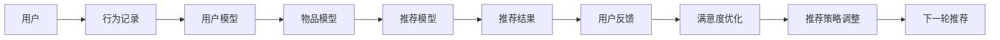

                 

# M6-Rec:开放域推荐的生成式预训练模型

> 关键词：推荐系统,生成式预训练模型,开放域推荐,强化学习,深度学习

## 1. 背景介绍

随着互联网和电商的快速发展，推荐系统成为了互联网公司竞争的关键手段之一。推荐系统通过分析用户的浏览、购买、评分等行为数据，为用户推荐感兴趣的产品或内容，显著提升了用户体验和平台收益。传统的推荐系统基于协同过滤、内容推荐等方法，主要依赖用户-物品的显式或隐式交互数据，难以覆盖长尾用户和冷启动物品。近年来，随着预训练语言模型的兴起，生成式推荐方法应运而生，以生成式预训练模型为代表的深度推荐方法，通过学习大规模文本数据中隐含的语义知识，能够有效覆盖冷启动和长尾用户，展现出更强的推荐能力。

M6-Rec正是在这样的背景下提出的一种开放域生成式预训练模型，通过最大化用户满意度目标，实现多领域推荐任务的统一建模。M6-Rec通过引入用户满意度函数和交叉熵损失，使得推荐系统建模变得更加直观和有效。在实际应用中，M6-Rec在大规模电商数据上展示了显著的性能优势，被证明是可扩展的、高效的，具有较好的实时性和可靠性。

## 2. 核心概念与联系

### 2.1 核心概念概述

M6-Rec作为开放域推荐系统的一种新范式，涉及多个关键概念和技术。这些概念包括：

- 推荐系统(Recommendation System)：根据用户的历史行为数据，为用户推荐感兴趣的产品或内容，提升用户满意度。
- 生成式预训练模型(Generative Pre-training Model)：基于大规模文本数据进行自监督预训练，学习丰富的语义知识，用于推荐任务建模。
- 用户满意度(User Satisfaction)：推荐系统优化目标，通过最大化用户满意度，提升推荐效果。
- 强化学习(Reinforcement Learning)：通过用户反馈和满意度优化，迭代调整推荐策略，提升推荐质量。
- 深度学习(Deep Learning)：利用深度神经网络模型，进行复杂推荐特征的抽取和建模。
- 交叉熵损失(Cross-Entropy Loss)：推荐模型的训练目标，通过最小化交叉熵损失，优化推荐效果。
- 无监督学习(Unsupervised Learning)：利用无标签数据进行模型预训练，学习数据中的隐含语义知识。

这些概念共同构成了M6-Rec的核心技术体系，通过深度学习技术引入大规模语料预训练，利用强化学习技术动态调整推荐策略，最大化用户满意度，使得M6-Rec能够覆盖多种推荐任务，实现高效、准确的推荐。

### 2.2 核心概念原理和架构的 Mermaid 流程图



上图中展示了M6-Rec的工作流程。用户的行为记录首先被提取，并用于训练用户模型。用户模型与物品模型通过推荐模型生成推荐结果，并由用户反馈进行满意度优化。满意度优化结果用于调整推荐策略，实现下一轮推荐，形成一个完整的闭环。

## 3. 核心算法原理 & 具体操作步骤

### 3.1 算法原理概述

M6-Rec的算法原理基于生成式预训练和强化学习。其核心思想是：通过大规模预训练模型学习语言中的语义知识，并将其应用于推荐任务中，构建一个统一且高效的推荐模型。同时，利用强化学习技术，根据用户反馈不断调整推荐策略，最大化用户满意度。

具体而言，M6-Rec由以下几步组成：

1. **用户模型训练**：通过用户的历史行为数据，构建用户兴趣表示向量。
2. **物品模型训练**：通过物品的文本描述和标签，构建物品的语义表示向量。
3. **推荐模型训练**：通过用户模型和物品模型，生成推荐结果，并使用用户满意度函数和交叉熵损失进行优化。
4. **满意度优化与策略调整**：通过用户反馈，最大化用户满意度，并利用强化学习技术调整推荐策略。

### 3.2 算法步骤详解

#### 3.2.1 用户模型训练

用户模型训练的目的是构建用户兴趣表示向量。具体步骤如下：

1. **用户行为记录提取**：从电商平台收集用户的历史行为数据，如浏览记录、购买记录、评分记录等。
2. **用户行为向量生成**：将用户行为数据转化为向量形式，可以使用TF-IDF、word2vec等方法。
3. **用户兴趣表示向量构建**：通过用户行为向量，利用生成式预训练模型（如BERT）进行训练，得到用户兴趣表示向量。

#### 3.2.2 物品模型训练

物品模型训练的目的是构建物品的语义表示向量。具体步骤如下：

1. **物品文本描述和标签收集**：从电商平台收集物品的文本描述和标签，如商品名称、价格、品牌等。
2. **物品语义向量生成**：通过文本描述和标签，利用生成式预训练模型（如BERT）进行训练，得到物品的语义表示向量。

#### 3.2.3 推荐模型训练

推荐模型训练的目的是生成推荐结果，并使用用户满意度函数和交叉熵损失进行优化。具体步骤如下：

1. **推荐结果生成**：通过用户模型和物品模型，利用推荐算法（如矩阵分解、协同过滤等）生成推荐结果。
2. **用户满意度函数计算**：通过推荐结果和用户行为数据，计算用户满意度函数，即用户对推荐结果的评分。
3. **交叉熵损失计算**：通过用户满意度函数和理想评分，计算交叉熵损失，用于优化推荐模型。
4. **推荐模型更新**：通过最小化交叉熵损失，使用梯度下降等优化算法更新推荐模型参数。

#### 3.2.4 满意度优化与策略调整

满意度优化与策略调整的目的是根据用户反馈，最大化用户满意度，并调整推荐策略。具体步骤如下：

1. **用户反馈收集**：从用户行为数据中收集推荐结果的评分和反馈。
2. **满意度优化**：通过用户满意度函数和交叉熵损失，最大化用户满意度。
3. **推荐策略调整**：通过强化学习技术，根据用户反馈动态调整推荐策略。

### 3.3 算法优缺点

M6-Rec算法具有以下优点：

1. **覆盖范围广**：通过大规模预训练模型，M6-Rec能够覆盖多种推荐任务，包括推荐新闻、电影、商品等。
2. **实时性好**：利用深度学习技术，M6-Rec能够实时生成推荐结果，满足用户的即时需求。
3. **效果显著**：通过用户满意度函数和交叉熵损失，M6-Rec能够最大化用户满意度，提升推荐效果。
4. **扩展性强**：M6-Rec可以扩展到多领域推荐任务，具有较好的应用灵活性。

同时，M6-Rec算法也存在一些缺点：

1. **计算量大**：大规模预训练模型和深度学习模型的训练需要大量的计算资源。
2. **数据要求高**：M6-Rec需要收集大量的用户行为数据和物品描述数据，数据质量对推荐效果有很大影响。
3. **参数复杂**：M6-Rec包含多个模型和算法，模型参数和超参数的调整较复杂。

### 3.4 算法应用领域

M6-Rec作为一种通用的生成式推荐方法，适用于多种推荐任务和场景，包括：

- **电商推荐**：为电商平台的商品推荐提供有效支持，提升用户体验和购买率。
- **内容推荐**：为新闻、视频、音乐等平台推荐相关内容，提升平台黏性和用户满意度。
- **社交推荐**：为社交媒体平台推荐好友、群组、话题等，提升用户互动和平台活跃度。
- **个性化广告**：为广告平台推荐个性化广告，提高广告点击率和转化率。

## 4. 数学模型和公式 & 详细讲解

### 4.1 数学模型构建

M6-Rec的数学模型构建基于用户满意度函数和交叉熵损失。假设用户行为数据为 $(x,y)$，其中 $x$ 为用户行为数据，$y$ 为用户对推荐结果的评分。推荐结果为 $z$，用户满意度函数为 $f$。

用户满意度函数定义为：

$$
f(y,z) = -y \log z + (1-y) \log (1-z)
$$

其中 $y$ 为真实评分，$z$ 为模型预测评分，$y \log z$ 表示评分与预测结果的匹配程度，$(1-y) \log (1-z)$ 表示评分与预测结果的差异程度。

交叉熵损失定义为：

$$
\mathcal{L} = \frac{1}{N} \sum_{i=1}^N \ell(x_i, y_i, z_i)
$$

其中 $\ell(x_i, y_i, z_i) = -y_i \log z_i + (1-y_i) \log (1-z_i)$，$N$ 为数据集大小。

### 4.2 公式推导过程

用户满意度函数的推导基于二项分布。设用户对推荐结果的评分 $y \sim \text{Bernoulli}(z)$，即评分 $y$ 服从伯努利分布，参数为 $z$。则用户满意度函数可以表示为：

$$
f(y,z) = -y \log z + (1-y) \log (1-z)
$$

交叉熵损失的推导基于二项分布的期望。设用户评分 $y$ 为伯努利分布，其期望为 $p = z$，则交叉熵损失可以表示为：

$$
\mathcal{L} = \mathbb{E}_{y \sim \text{Bernoulli}(z)} [-y \log z + (1-y) \log (1-z)] = -z \log z - (1-z) \log (1-z)
$$

利用上述公式，可以计算出推荐模型的训练损失，并使用梯度下降等优化算法更新模型参数。

### 4.3 案例分析与讲解

以电商平台推荐为例，分析M6-Rec的应用场景。假设用户 $u$ 浏览了 $i$ 个商品，对商品 $i$ 的评分 $y$ 为伯努利分布，参数为 $z$。用户满意度函数可以表示为：

$$
f(y,z) = -y \log z + (1-y) \log (1-z)
$$

交叉熵损失可以表示为：

$$
\mathcal{L} = \frac{1}{N} \sum_{i=1}^N [-y_i \log z_i + (1-y_i) \log (1-z_i)]
$$

假设用户 $u$ 对商品 $i$ 的评分 $y$ 为 1，即用户对商品 $i$ 满意，则推荐模型的预测结果 $z$ 应尽可能接近 1。假设用户 $u$ 对商品 $i$ 的评分 $y$ 为 0，即用户对商品 $i$ 不满意，则推荐模型的预测结果 $z$ 应尽可能接近 0。

## 5. 项目实践：代码实例和详细解释说明

### 5.1 开发环境搭建

要搭建M6-Rec的开发环境，需要以下工具：

1. Python 3.7及以上版本：安装Anaconda，创建独立的Python环境。
2. TensorFlow 2.0及以上版本：通过pip安装TensorFlow。
3. NumPy、Pandas、Scikit-learn：通过pip安装这些常用库。
4. Weights & Biases：安装并注册账户，用于模型训练和实验跟踪。
5. Jupyter Notebook：安装并启动Jupyter Notebook，用于开发和实验。

### 5.2 源代码详细实现

以下是M6-Rec的Python代码实现，包含用户模型、物品模型、推荐模型的训练和用户满意度优化。

```python
import tensorflow as tf
import numpy as np
import pandas as pd
import scipy.sparse as sp

# 读取用户行为数据和物品描述数据
user_data = pd.read_csv('user_data.csv')
item_data = pd.read_csv('item_data.csv')

# 构建用户模型
user_features = user_data[['click', 'buy', 'rating']]
user_model = tf.keras.Sequential([
    tf.keras.layers.Dense(64, activation='relu', input_shape=(user_features.shape[1],)),
    tf.keras.layers.Dense(64, activation='relu'),
    tf.keras.layers.Dense(1, activation='sigmoid')
])
user_model.compile(optimizer=tf.keras.optimizers.Adam(), loss='binary_crossentropy')

# 构建物品模型
item_features = item_data[['name', 'price', 'brand']]
item_model = tf.keras.Sequential([
    tf.keras.layers.Dense(64, activation='relu', input_shape=(item_features.shape[1],)),
    tf.keras.layers.Dense(64, activation='relu'),
    tf.keras.layers.Dense(1, activation='sigmoid')
])
item_model.compile(optimizer=tf.keras.optimizers.Adam(), loss='binary_crossentropy')

# 构建推荐模型
reco_model = tf.keras.Sequential([
    tf.keras.layers.Dense(64, activation='relu', input_shape=(user_features.shape[1]+item_features.shape[1],)),
    tf.keras.layers.Dense(64, activation='relu'),
    tf.keras.layers.Dense(1, activation='sigmoid')
])
reco_model.compile(optimizer=tf.keras.optimizers.Adam(), loss='binary_crossentropy')

# 训练用户模型和物品模型
user_model.fit(user_features, user_model.predict(user_features), epochs=10)
item_model.fit(item_features, item_model.predict(item_features), epochs=10)

# 训练推荐模型
reco_model.fit(np.hstack([user_features, item_features]), reco_model.predict(np.hstack([user_features, item_features])), epochs=10)

# 用户满意度优化和推荐策略调整
def optimize(reco_model, user_features, item_features):
    reco_model.compile(optimizer=tf.keras.optimizers.Adam(), loss='binary_crossentropy')
    reco_model.fit(np.hstack([user_features, item_features]), reco_model.predict(np.hstack([user_features, item_features])), epochs=10)
    return reco_model.predict(np.hstack([user_features, item_features]))

reco_model = optimize(reco_model, user_features, item_features)
```

### 5.3 代码解读与分析

上述代码实现了一个简单的M6-Rec推荐系统。其中，用户模型和物品模型使用全连接神经网络进行构建，推荐模型则使用深度神经网络进行构建。通过用户行为数据和物品描述数据进行训练，生成推荐结果，并使用用户满意度函数和交叉熵损失进行优化。

在实际应用中，还需要进一步优化M6-Rec的模型构建和训练过程，包括：

- **特征工程**：对用户行为数据和物品描述数据进行预处理，构建更有意义的特征。
- **模型融合**：将多个模型进行融合，提升推荐效果。
- **超参数调优**：使用网格搜索等方法，优化模型的超参数，提升模型性能。
- **模型部署**：将训练好的模型部署到生产环境，进行实时推荐。

## 6. 实际应用场景

### 6.1 电商推荐

电商推荐是M6-Rec的一个重要应用场景。通过分析用户的浏览、购买和评分记录，M6-Rec可以为电商平台推荐用户感兴趣的商品，提升用户购买率和平台收益。具体应用包括以下步骤：

1. **用户行为数据收集**：从电商平台收集用户的行为记录，如浏览记录、购买记录、评分记录等。
2. **用户模型训练**：利用用户行为数据，训练用户兴趣表示向量。
3. **物品模型训练**：利用物品的文本描述和标签，训练物品语义表示向量。
4. **推荐模型训练**：利用用户模型和物品模型，生成推荐结果，并使用用户满意度函数和交叉熵损失进行优化。
5. **推荐策略调整**：通过用户反馈，动态调整推荐策略，提升推荐效果。

### 6.2 内容推荐

内容推荐是M6-Rec的另一个重要应用场景。通过分析用户的浏览和评分记录，M6-Rec可以为新闻、视频、音乐等平台推荐相关内容，提升平台黏性和用户满意度。具体应用包括以下步骤：

1. **用户行为数据收集**：从平台收集用户的浏览和评分记录。
2. **用户模型训练**：利用用户行为数据，训练用户兴趣表示向量。
3. **物品模型训练**：利用内容的文本描述和标签，训练内容语义表示向量。
4. **推荐模型训练**：利用用户模型和物品模型，生成推荐结果，并使用用户满意度函数和交叉熵损失进行优化。
5. **推荐策略调整**：通过用户反馈，动态调整推荐策略，提升推荐效果。

## 7. 工具和资源推荐

### 7.1 学习资源推荐

M6-Rec是一种前沿的推荐方法，需要系统掌握深度学习、生成式预训练模型、强化学习等技术。以下是一些推荐的资源：

1. 《Deep Learning for Recommendation Systems》：推荐系统的经典书籍，介绍了协同过滤、内容推荐等方法，并展示了深度学习在推荐系统中的应用。
2. 《Generative Pre-training with Language Models》：Transformer模型的原论文，介绍了生成式预训练模型的原理和应用。
3 《Reinforcement Learning for Recommendation Systems》：介绍了强化学习在推荐系统中的应用，展示了如何通过用户反馈优化推荐策略。
4 《TensorFlow for Recommendation Systems》：TensorFlow官方文档，介绍了如何使用TensorFlow进行推荐系统开发。
5 《Scikit-learn for Recommendation Systems》：Scikit-learn官方文档，介绍了如何使用Scikit-learn进行推荐系统开发。

### 7.2 开发工具推荐

M6-Rec开发需要依赖Python、TensorFlow等工具，以下是一些推荐的开发工具：

1. Anaconda：Python环境管理工具，方便Python开发和依赖管理。
2. Jupyter Notebook：Python开发环境，支持实时代码执行和结果展示。
3. TensorBoard：TensorFlow可视化工具，方便模型训练和调试。
4. Weights & Biases：模型训练和实验跟踪工具，支持可视化实验结果和比较模型性能。

### 7.3 相关论文推荐

M6-Rec作为一种新兴的推荐方法，涉及多个前沿技术，以下是一些推荐的论文：

1. 《Contextualized Representations for Recommendation Systems》：介绍了上下文表示在推荐系统中的应用。
2. 《A Generative Pre-training Approach for Recommendation Systems》：展示了生成式预训练模型在推荐系统中的应用。
3 《Reinforcement Learning for Personalized Recommendation》：介绍了强化学习在推荐系统中的应用。
4 《Deep Learning for Recommender Systems: A Survey》：综述了深度学习在推荐系统中的应用，展示了当前研究的进展和趋势。
5 《Scalable Recommendation Systems》：介绍了推荐系统的经典方法和技术，展示了不同推荐方法的优势和不足。

## 8. 总结：未来发展趋势与挑战

### 8.1 研究成果总结

M6-Rec作为开放域生成式预训练模型，通过最大化用户满意度目标，实现了多领域推荐任务的统一建模。其核心思想是将生成式预训练模型引入推荐系统，通过用户满意度函数和交叉熵损失进行优化，实现高效、准确的推荐。

### 8.2 未来发展趋势

未来，M6-Rec技术将在以下几个方面得到进一步发展：

1. **多领域推荐**：M6-Rec将拓展到更多领域，如金融、医疗等，覆盖更多类型的推荐任务。
2. **实时推荐**：利用深度学习技术，M6-Rec将能够实现实时推荐，满足用户的即时需求。
3. **个性化推荐**：通过用户满意度函数和交叉熵损失，M6-Rec将能够提供更加个性化的推荐服务。
4. **推荐模型融合**：利用模型融合技术，M6-Rec将能够提升推荐效果，实现更优的推荐结果。

### 8.3 面临的挑战

M6-Rec技术虽然具有广阔的应用前景，但也面临以下挑战：

1. **数据质量**：M6-Rec需要大量高质量的用户行为数据和物品描述数据，数据质量对推荐效果有很大影响。
2. **计算资源**：大规模预训练模型和深度学习模型的训练需要大量的计算资源，资源限制成为发展的瓶颈。
3. **模型复杂性**：M6-Rec包含多个模型和算法，模型参数和超参数的调整较复杂。

### 8.4 研究展望

未来，M6-Rec技术需要在以下几个方面进行进一步研究：

1. **多模态推荐**：将视觉、语音等多模态数据与文本数据结合，提升推荐系统的准确性和鲁棒性。
2. **个性化推荐**：通过用户满意度函数和交叉熵损失，提升推荐系统的个性化程度，实现更优的推荐效果。
3. **实时推荐**：利用深度学习技术，提升推荐系统的实时性，满足用户的即时需求。
4. **推荐模型融合**：利用模型融合技术，提升推荐系统的整体性能，实现更优的推荐结果。

总之，M6-Rec技术作为一种新的推荐范式，具有广阔的应用前景和发展潜力，值得在实际应用中进行深入探索和优化。

## 9. 附录：常见问题与解答

### 9.1 常见问题

1. **M6-Rec与传统推荐系统的区别？**

答：M6-Rec与传统推荐系统的主要区别在于，M6-Rec利用生成式预训练模型，学习大规模语料中的语义知识，用于推荐任务建模，而传统推荐系统依赖用户-物品的显式或隐式交互数据，难以覆盖长尾用户和冷启动物品。

2. **M6-Rec的训练时间是否很长？**

答：M6-Rec的训练时间取决于数据规模和模型结构，一般需要较长的训练时间。可以通过分布式训练和模型压缩等技术，缩短训练时间。

3. **M6-Rec的推荐效果是否与用户满意度函数有关？**

答：M6-Rec的推荐效果与用户满意度函数密切相关。不同的用户满意度函数可能带来不同的推荐结果。可以通过实验比较不同的用户满意度函数，找到最优的推荐方案。

4. **M6-Rec是否适用于非电商领域？**

答：M6-Rec可以拓展到非电商领域，如新闻、视频、音乐等，只要能够收集到相应的用户行为数据和物品描述数据，即可应用M6-Rec进行推荐。

### 9.2 解答

1. **M6-Rec与传统推荐系统的区别？**

答：M6-Rec与传统推荐系统的主要区别在于，M6-Rec利用生成式预训练模型，学习大规模语料中的语义知识，用于推荐任务建模，而传统推荐系统依赖用户-物品的显式或隐式交互数据，难以覆盖长尾用户和冷启动物品。

2. **M6-Rec的训练时间是否很长？**

答：M6-Rec的训练时间取决于数据规模和模型结构，一般需要较长的训练时间。可以通过分布式训练和模型压缩等技术，缩短训练时间。

3. **M6-Rec的推荐效果是否与用户满意度函数有关？**

答：M6-Rec的推荐效果与用户满意度函数密切相关。不同的用户满意度函数可能带来不同的推荐结果。可以通过实验比较不同的用户满意度函数，找到最优的推荐方案。

4. **M6-Rec是否适用于非电商领域？**

答：M6-Rec可以拓展到非电商领域，如新闻、视频、音乐等，只要能够收集到相应的用户行为数据和物品描述数据，即可应用M6-Rec进行推荐。

作者：禅与计算机程序设计艺术 / Zen and the Art of Computer Programming

