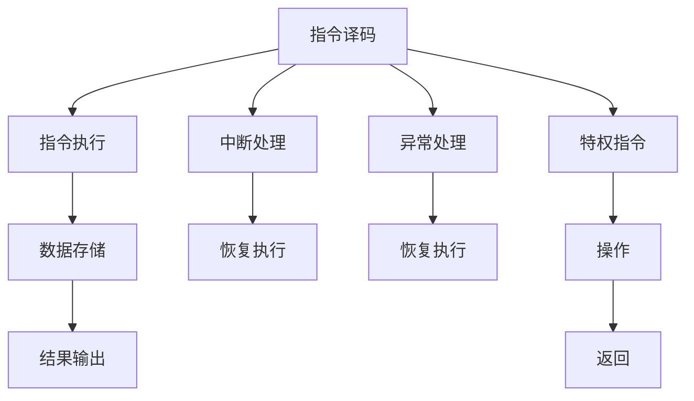

                 

# MIPS架构：嵌入式系统的选择

> 关键词：MIPS架构，嵌入式系统，处理器性能，功耗优化，实时系统，硬件描述语言，应用场景，设计考量

## 1. 背景介绍

### 1.1 问题由来
随着互联网、物联网、人工智能等技术的快速发展，嵌入式系统在各个领域的应用越来越广泛。从智能手机、智能家居、无人驾驶到工业控制、医疗设备、航空航天，嵌入式系统无处不在。然而，嵌入式系统的资源受限、应用场景多样、实时性要求高等特点，对处理器的性能、功耗、灵活性等要求极高。本文将深入探讨MIPS架构在嵌入式系统中的应用，分析其特点、优缺点及其在各类应用场景中的具体选择。

### 1.2 问题核心关键点
嵌入式系统对处理器的需求多样，主要包括：

1. **高性能与低功耗的平衡**：
   - 需要快速处理高负载任务。
   - 需要长时间低功耗运行。

2. **实时性与可靠性**：
   - 系统必须能够快速响应用户操作或事件。
   - 系统需具备高可靠性，确保数据的正确性。

3. **灵活性与可扩展性**：
   - 系统需求可能会随时间变化，处理器需具备灵活性。
   - 处理器需支持多任务并发、多种接口等扩展功能。

4. **成本与生产效率**：
   - 嵌入式系统多应用于资源受限环境，成本控制至关重要。
   - 生产效率直接影响系统的市场竞争力。

针对这些需求，MIPS架构提供了高效、灵活、可扩展的解决方案。

## 2. 核心概念与联系

### 2.1 核心概念概述

MIPS（Microprocessor without Interlocked Piped Stages）是一种RISC（Reduced Instruction Set Computing）处理器架构，以简洁高效的设计著称。与CISC架构相比，MIPS架构采用精简指令集，通过减少指令的复杂度和数量，提高处理器的执行效率。MIPS架构广泛应用于嵌入式系统，其核心特点包括：

- **RISC架构**：使用精简指令集，减少指令周期，提升处理速度。
- **高性能与低功耗**：通过流水线、Cache等技术优化性能与功耗。
- **灵活性与可扩展性**：支持多种操作系统和编程语言，易于升级和扩展。
- **兼容性**：支持多种I/O接口和外设，便于系统集成。

### 2.2 核心概念原理和架构的 Mermaid 流程图(Mermaid 流程节点中不要有括号、逗号等特殊字符)



这个流程图展示了MIPS架构的基本操作流程，从指令译码、执行、存储到输出，以及中断和异常处理等。

## 3. 核心算法原理 & 具体操作步骤

### 3.1 算法原理概述

MIPS架构的核心算法原理主要体现在以下几个方面：

1. **RISC指令集**：
   - 使用精简的指令集，减少指令的复杂度，提升执行效率。
   - 指令集通常包括加减乘除、位操作、逻辑操作、内存读写等基本操作。

2. **流水线技术**：
   - 将指令执行过程分解为多个阶段，并行执行，提高处理器的吞吐量。
   - 流水线通常分为取指、译码、执行、存储、写回等阶段。

3. **Cache与TLB技术**：
   - 使用Cache技术，缓存最近访问的数据和指令，减少访问内存的次数。
   - 使用TLB（Translation Lookaside Buffer），加速虚拟地址到物理地址的映射。

4. **中断与异常处理**：
   - 支持多种中断与异常处理机制，确保系统的实时性与可靠性。
   - 包括硬件中断、软件中断、异常等。

### 3.2 算法步骤详解

MIPS架构的具体操作步骤可以分为以下几个步骤：

1. **初始化**：
   - 配置处理器和外围设备，设置初始状态。
   - 初始化Cache、TLB等内存管理模块。

2. **指令执行**：
   - 从内存读取指令，并进行译码。
   - 根据指令类型，执行相应的操作。
   - 将操作结果存储到内存中。

3. **中断处理**：
   - 监听中断源，判断是否发生中断。
   - 处理中断事件，保护现场。
   - 恢复现场，继续执行原程序。

4. **异常处理**：
   - 检测并处理程序中的异常，如除数为零、非法访问等。
   - 恢复程序状态，继续执行。

### 3.3 算法优缺点

#### 优点：
1. **高性能与低功耗**：
   - 简化的指令集和流水线技术使得处理器执行效率高。
   - 优化后的功耗管理，适用于低功耗应用。

2. **灵活性与可扩展性**：
   - 支持多种操作系统和编程语言。
   - 易于扩展和升级。

3. **稳定性与可靠性**：
   - 成熟稳定的架构，广泛应用于工业和消费电子。

#### 缺点：
1. **复杂度相对较高**：
   - 实现精简指令集的处理器设计相对复杂。

2. **需要额外的硬件支持**：
   - 需要使用额外的硬件支持如Cache、TLB等。

3. **市场份额相对较小**：
   - 相比x86和ARM架构，MIPS架构的市场份额较小。

### 3.4 算法应用领域

MIPS架构主要应用于以下领域：

1. **消费电子**：
   - 应用于智能手机、平板电脑、智能电视等消费电子产品。
   - 高性能、低功耗的特点使其成为理想的选择。

2. **嵌入式系统**：
   - 应用于工业控制、医疗设备、航空航天等嵌入式应用。
   - 灵活性和可扩展性使其能够适应多样化的应用场景。

3. **游戏与娱乐**：
   - 用于游戏机、虚拟现实设备等高性能计算需求。
   - 强大的性能和流畅的体验使其成为游戏开发的首选。

## 4. 数学模型和公式 & 详细讲解 & 举例说明

### 4.1 数学模型构建

MIPS架构的数学模型构建主要围绕以下几个方面：

1. **指令周期**：
   - 每个指令的执行时间。

2. **流水线效率**：
   - 流水线各阶段的执行效率。

3. **Cache命中率**：
   - 缓存中数据的访问效率。

### 4.2 公式推导过程

以一个简单的加法指令为例，MIPS架构的执行过程可以分为以下几个步骤：

1. 取指阶段：
   - 从内存读取指令，并放入寄存器。

2. 译码阶段：
   - 对指令进行译码，确定操作数和目标地址。

3. 执行阶段：
   - 从寄存器读取操作数，并进行加法运算。

4. 存储阶段：
   - 将运算结果存储到内存中。

其执行周期公式为：

$$
\text{周期} = \text{取指周期} + \text{译码周期} + \text{执行周期} + \text{存储周期}
$$

假设取指周期为1个时钟周期，译码周期为0.5个时钟周期，执行周期为1个时钟周期，存储周期为0.5个时钟周期，则总执行周期为：

$$
\text{周期} = 1 + 0.5 + 1 + 0.5 = 3 \text{ 时钟周期}
$$

### 4.3 案例分析与讲解

以嵌入式系统中的视频编码为例，MIPS架构在视频编码中的应用主要体现在以下几个方面：

1. **实时性**：
   - 视频编码需要实时处理大量数据，MIPS架构的高性能和流水线技术使其能够满足实时性要求。

2. **灵活性**：
   - 视频编码算法复杂多样，MIPS架构支持多种编程语言和操作系统，方便实现不同的编码算法。

3. **可扩展性**：
   - 视频编码算法需要不断升级，MIPS架构支持硬件扩展和升级，确保系统能够适应新的编码算法。

## 5. 项目实践：代码实例和详细解释说明

### 5.1 开发环境搭建

MIPS架构的开发环境搭建主要包括以下几个步骤：

1. **安装MIPS汇编器**：
   - 使用MIPSpro或Nx86-Asm等工具进行汇编。

2. **搭建开发环境**：
   - 配置Linux开发环境，如Ubuntu、Debian等。
   - 安装必要的开发工具，如GCC、Make等。

3. **配置硬件模拟器**：
   - 使用MARS（MIPS Assembly Language Reference System）等模拟器进行仿真调试。

### 5.2 源代码详细实现

以一个简单的MIPS汇编代码为例：

```assembly
addi     $t0, $zero, 10       # 将10加到零，结果存入$t0
add     $t1, $t0, $t0         # 将$t0加到自身，结果存入$t1
```

其对应的汇编代码转换为机器码，具体步骤如下：

1. 取指阶段：
   - 读取指令`addi`，并放入寄存器。

2. 译码阶段：
   - 确定操作数为$t0$，值为10，结果存入$t0$。

3. 执行阶段：
   - 将$t0$加10，结果存入$t0$。

4. 存储阶段：
   - 将结果$t0$存储到内存中。

### 5.3 代码解读与分析

上述代码示例展示了MIPS架构的基本操作流程，从取指、译码、执行到存储，体现了MIPS架构的精简指令集和流水线技术。

## 6. 实际应用场景

### 6.1 消费电子

MIPS架构在消费电子领域的应用非常广泛，主要体现在以下几个方面：

1. **智能手机**：
   - 高性能、低功耗的特点使其成为智能手机处理器的首选。
   - 广泛应用于Android系统，支持丰富的应用生态。

2. **平板电脑**：
   - 与智能手机类似，MIPS架构同样适用于平板电脑。
   - 支持高清显示和触摸屏等I/O接口。

3. **智能电视**：
   - 用于视频解码、图像处理等任务。
   - 支持4K分辨率和HDR等高画质标准。

### 6.2 嵌入式系统

MIPS架构在嵌入式系统中的应用主要体现在以下几个方面：

1. **工业控制**：
   - 用于控制设备、传感器等。
   - 支持多种I/O接口和通信协议，如RS232、USB等。

2. **医疗设备**：
   - 用于生命监测、影像分析等。
   - 高可靠性确保数据准确性。

3. **航空航天**：
   - 用于飞行控制系统、导航系统等。
   - 支持实时性高、稳定性强的要求。

### 6.3 游戏与娱乐

MIPS架构在游戏与娱乐领域的应用主要体现在以下几个方面：

1. **游戏机**：
   - 应用于PlayStation、Xbox等游戏机。
   - 支持高性能计算和大规模并行处理。

2. **虚拟现实设备**：
   - 用于虚拟现实场景渲染、数据处理等。
   - 支持流畅的操作体验和图像渲染。

## 7. 工具和资源推荐

### 7.1 学习资源推荐

1. **MIPSpro官方文档**：
   - 提供详细的MIPS架构文档和教程，涵盖指令集、寄存器、流水线等内容。

2. **Nx86-Asm文档**：
   - 提供MIPS汇编语言的详细说明和示例代码。

3. **MIPS Assembly Language Reference System (MARS)**：
   - 提供MIPS汇编语言的交互式模拟器，方便调试和验证。

### 7.2 开发工具推荐

1. **MIPSpro**：
   - 一款专业的MIPS编译器，支持编译和优化。

2. **Nx86-Asm**：
   - 提供强大的汇编语言开发环境，支持代码生成和调试。

3. **GCC和GDB**：
   - 常用的编译器和调试器，支持MIPS架构。

### 7.3 相关论文推荐

1. **MIPS Architecture Design Considerations**：
   - 论文详细介绍了MIPS架构的设计考量和性能优化。

2. **Performance Evaluation of MIPS and RISC-Architecture**：
   - 对比分析了MIPS和RISC架构的性能特点和应用场景。

3. **Software Optimization for MIPS Processors**：
   - 讨论了MIPS架构的软件优化策略和工具。

## 8. 总结：未来发展趋势与挑战

### 8.1 研究成果总结

MIPS架构在嵌入式系统中的应用取得了显著成效，但其市场份额较小，面临挑战：

1. **市场竞争激烈**：
   - 相比x86和ARM架构，MIPS架构的市场份额较小。

2. **技术更新缓慢**：
   - 缺乏持续的技术更新和支持。

3. **应用场景受限**：
   - 主要应用于消费电子和嵌入式系统，应用场景相对单一。

### 8.2 未来发展趋势

尽管面临挑战，MIPS架构仍具有广阔的发展前景，主要体现在以下几个方面：

1. **低功耗与高性能**：
   - 随着物联网和智能家居的普及，低功耗和高性能的需求将推动MIPS架构的发展。

2. **实时性与可靠性**：
   - 工业控制、医疗设备等高可靠性需求将推动MIPS架构的应用。

3. **多模态计算**：
   - 支持多种计算模式，如专用计算、通用计算等。

### 8.3 面临的挑战

1. **市场份额不足**：
   - 需要重新定位市场，扩大应用场景。

2. **技术创新不足**：
   - 需要加强研发投入，推动技术创新。

3. **生态系统不完善**：
   - 需要完善开发者工具和应用生态，吸引更多开发者和企业。

### 8.4 研究展望

MIPS架构的未来发展需要从以下几个方面进行突破：

1. **扩展应用场景**：
   - 拓展到更多的应用场景，如智能家居、工业控制等。

2. **提高性能与能效比**：
   - 通过技术创新，提升处理性能和能效比。

3. **构建生态系统**：
   - 吸引更多开发者和企业，完善开发者工具和应用生态。

## 9. 附录：常见问题与解答

**Q1：MIPS架构与x86、ARM架构相比，有哪些优势和劣势？**

A: MIPS架构的优势主要体现在以下几个方面：

1. **高性能与低功耗**：
   - 精简指令集和流水线技术使得处理速度较快。
   - 优化后的功耗管理，适用于低功耗应用。

2. **灵活性与可扩展性**：
   - 支持多种操作系统和编程语言。
   - 易于扩展和升级。

3. **稳定性与可靠性**：
   - 成熟稳定的架构，广泛应用于工业和消费电子。

劣势主要在于市场份额相对较小，技术更新缓慢，生态系统不完善。

**Q2：MIPS架构的性能如何与x86、ARM架构比较？**

A: MIPS架构与x86、ARM架构相比，性能和能效比有所不同：

1. **性能**：
   - x86架构通常具有更高的性能，适用于高性能计算和大规模数据处理。
   - MIPS架构适用于低功耗、高可靠性的场景，性能表现良好。

2. **能效比**：
   - ARM架构在能效比方面表现突出，适用于移动设备和高能效需求场景。
   - MIPS架构的能效比也较高，但在特定应用场景下可能表现更佳。

**Q3：MIPS架构在嵌入式系统中的应用有哪些？**

A: MIPS架构在嵌入式系统中的应用主要包括以下几个方面：

1. **工业控制**：
   - 用于控制设备、传感器等。
   - 支持多种I/O接口和通信协议。

2. **医疗设备**：
   - 用于生命监测、影像分析等。
   - 高可靠性确保数据准确性。

3. **航空航天**：
   - 用于飞行控制系统、导航系统等。
   - 支持实时性高、稳定性强的要求。

**Q4：MIPS架构如何优化性能与功耗？**

A: MIPS架构可以通过以下方式优化性能与功耗：

1. **流水线技术**：
   - 将指令执行过程分解为多个阶段，并行执行，提高处理器的吞吐量。

2. **Cache与TLB技术**：
   - 使用Cache技术，缓存最近访问的数据和指令，减少访问内存的次数。

3. **多核与多线程**：
   - 支持多核与多线程设计，提高并行处理能力。

4. **硬件加速**：
   - 使用硬件加速器，如GPU、DSP等，提升特定计算任务的处理速度。

5. **能耗管理**：
   - 采用动态电压频率调整（DVFS）等技术，降低功耗。

**Q5：MIPS架构的未来发展方向是什么？**

A: MIPS架构的未来发展方向主要包括以下几个方面：

1. **低功耗与高性能**：
   - 随着物联网和智能家居的普及，低功耗和高性能的需求将推动MIPS架构的发展。

2. **实时性与可靠性**：
   - 工业控制、医疗设备等高可靠性需求将推动MIPS架构的应用。

3. **多模态计算**：
   - 支持多种计算模式，如专用计算、通用计算等。

**Q6：MIPS架构的主要应用场景有哪些？**

A: MIPS架构的主要应用场景包括以下几个方面：

1. **消费电子**：
   - 应用于智能手机、平板电脑、智能电视等。

2. **嵌入式系统**：
   - 应用于工业控制、医疗设备、航空航天等。

3. **游戏与娱乐**：
   - 用于游戏机、虚拟现实设备等。

作者：禅与计算机程序设计艺术 / Zen and the Art of Computer Programming

