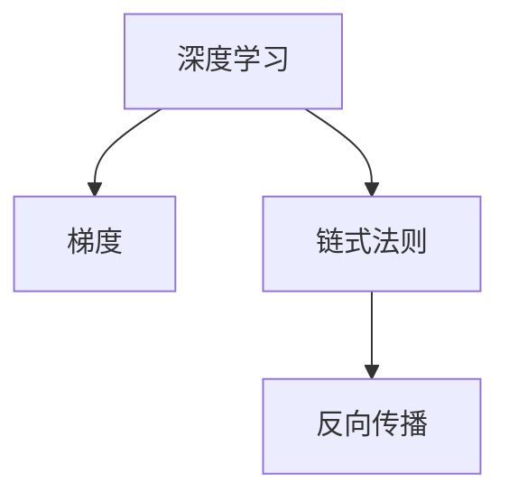

                 

# Micrograd：探索机器学习和反向传播

> 关键词：微积分,机器学习,反向传播,梯度计算,深度学习

## 1. 背景介绍

在当今的科技领域，机器学习和深度学习已经成为推动科学研究和实际应用的重要力量。从图像识别到自然语言处理，从自动驾驶到智能推荐系统，机器学习技术的成功案例比比皆是。然而，这些先进技术的背后，却有一个看似简单但却极其重要的数学概念——反向传播（Backpropagation）。

### 1.1 问题由来

反向传播是深度学习算法中的核心部分，它通过计算损失函数对模型参数的梯度，进而指导参数的更新，使模型不断逼近训练数据集的真实分布。然而，反向传播的实现过程涉及复杂的数学推导和高效的算法实现，这使得许多初学者难以理解。

### 1.2 问题核心关键点

为了帮助读者深入理解反向传播的原理和实现方法，本文将从以下几个方面进行探讨：
- 反向传播的基本原理
- 反向传播的数学推导
- 反向传播的实现细节
- 反向传播在实际中的应用

## 2. 核心概念与联系

### 2.1 核心概念概述

为了更好地理解反向传播，首先需要了解几个相关的核心概念：

- 深度学习：一种通过多层神经网络实现的机器学习方法。
- 梯度：导数在离散空间中的近似值，用于表示函数在某一点的变化率。
- 链式法则：多变量函数求导中的一种法则，用于将复合函数的导数分解为各个函数的导数乘积。
- 反向传播：一种计算深度神经网络中梯度的方法，用于训练深度学习模型。

这些概念之间的关系可以通过以下Mermaid流程图来展示：



这个流程图展示了深度学习和反向传播之间的逻辑关系：

1. 深度学习模型通过多层神经网络进行参数化表示。
2. 梯度用于表示模型参数对损失函数的导数，指导参数更新。
3. 链式法则将复合函数的导数分解为各个函数的导数乘积，为反向传播提供数学基础。
4. 反向传播利用链式法则计算损失函数对每个参数的梯度，更新模型参数。

这些核心概念共同构成了反向传播的基础，使得深度学习模型能够进行高效训练和优化。

## 3. 核心算法原理 & 具体操作步骤
### 3.1 算法原理概述

反向传播的基本原理是通过链式法则，计算损失函数对模型参数的梯度。具体而言，反向传播将损失函数对模型输出层的梯度，逐层向后传递，计算每一层参数对损失函数的贡献，并更新模型参数。

### 3.2 算法步骤详解

以下是反向传播的详细步骤：

1. **前向传播**：将输入数据通过网络模型，计算出模型输出。
2. **计算损失**：将输出与真实标签计算损失函数。
3. **反向传播**：从输出层开始，计算损失函数对每个参数的梯度，并逐层向后传递。
4. **更新参数**：使用梯度下降等优化算法，更新模型参数。
5. **重复迭代**：重复上述步骤，直到模型收敛或达到预设的迭代次数。

### 3.3 算法优缺点

反向传播在深度学习中具有重要的地位，但也存在一些不足之处：

- **优点**：
  - 高效计算梯度：反向传播能够高效计算损失函数对模型参数的梯度，避免了手动求导的繁琐过程。
  - 普遍适用：反向传播适用于各种神经网络结构，包括卷积神经网络、循环神经网络等。
  - 适应性强：反向传播可以处理大规模数据集，适用于复杂的非线性优化问题。

- **缺点**：
  - 计算复杂度高：反向传播的计算复杂度随网络深度呈指数级增长，可能面临计算资源不足的问题。
  - 梯度消失/爆炸：反向传播在计算过程中，梯度可能发生爆炸或消失，导致模型训练困难。
  - 依赖初始参数：反向传播的优化效果依赖于初始参数的选择，不合理的初始化可能导致模型训练失败。

### 3.4 算法应用领域

反向传播广泛应用于各种深度学习模型中，如卷积神经网络（CNN）、循环神经网络（RNN）、变分自编码器（VAE）等。这些模型在图像识别、语音识别、自然语言处理等领域得到了广泛应用，极大地推动了人工智能技术的发展。

## 4. 数学模型和公式 & 详细讲解  
### 4.1 数学模型构建

反向传播的数学模型主要基于链式法则，用于计算损失函数对每个模型参数的梯度。假设模型为一个多层神经网络，包含 $n$ 层，每层包含 $m$ 个神经元。输入为 $x$，输出为 $y$。模型的参数为 $\theta$，包含权重矩阵 $W_i$ 和偏置向量 $b_i$。损失函数为 $L$。

### 4.2 公式推导过程

反向传播的数学推导过程如下：

1. **输出层**：计算损失函数 $L$ 对输出层的梯度 $\dfrac{\partial L}{\partial y}$。
2. **隐层**：从输出层开始，计算损失函数对每一层的梯度，逐层向后传递。

对于第 $l$ 层，设激活函数为 $\sigma$，前向传播的输出为 $a_l$，前一层的输出为 $a_{l-1}$，该层的权重矩阵为 $W_l$，偏置向量为 $b_l$，则有：

$$
a_l = \sigma(W_l a_{l-1} + b_l)
$$

损失函数对第 $l$ 层的梯度 $\dfrac{\partial L}{\partial a_l}$ 可以通过反向传播递推得到：

$$
\dfrac{\partial L}{\partial a_l} = \dfrac{\partial L}{\partial y} \dfrac{\partial y}{\partial a_l} = \dfrac{\partial L}{\partial y} \dfrac{\partial \sigma(W_l a_{l-1} + b_l)}{\partial a_l}
$$

其中 $\dfrac{\partial \sigma}{\partial a_l} = \sigma'(W_l a_{l-1} + b_l)$，$\dfrac{\partial y}{\partial a_l} = \dfrac{\partial W_l a_{l-1} + b_l}{\partial a_l} = W_l \dfrac{\partial a_{l-1}}{\partial a_l} = W_l \sigma'(W_l a_{l-1} + b_l)$。

由此可以递推得到 $\dfrac{\partial L}{\partial a_l}$，再通过反向传播计算 $\dfrac{\partial L}{\partial W_l}$ 和 $\dfrac{\partial L}{\partial b_l}$，并更新模型参数。

### 4.3 案例分析与讲解

以一个简单的线性回归模型为例，展示反向传播的计算过程。设模型参数为 $W$ 和 $b$，输入为 $x$，输出为 $y$，损失函数为 $L$。

前向传播的输出为：

$$
y = Wx + b
$$

损失函数对 $y$ 的梯度为：

$$
\dfrac{\partial L}{\partial y} = -1
$$

根据链式法则，损失函数对 $W$ 和 $b$ 的梯度分别为：

$$
\dfrac{\partial L}{\partial W} = \dfrac{\partial L}{\partial y} \dfrac{\partial y}{\partial W} = -1 \dfrac{\partial Wx + b}{\partial W} = -x
$$

$$
\dfrac{\partial L}{\partial b} = \dfrac{\partial L}{\partial y} \dfrac{\partial y}{\partial b} = -1 \dfrac{\partial Wx + b}{\partial b} = -1
$$

通过反向传播计算出的梯度，即可用于更新模型参数，使模型不断逼近训练数据集的分布。

## 5. 项目实践：代码实例和详细解释说明
### 5.1 开发环境搭建

在进行反向传播的实践前，需要先准备好开发环境。以下是使用Python进行TensorFlow开发的环境配置流程：

1. 安装Anaconda：从官网下载并安装Anaconda，用于创建独立的Python环境。

2. 创建并激活虚拟环境：
```bash
conda create -n tf-env python=3.8 
conda activate tf-env
```

3. 安装TensorFlow：根据CUDA版本，从官网获取对应的安装命令。例如：
```bash
conda install tensorflow -c conda-forge -c tensorflow
```

4. 安装NumPy、Pandas等常用工具包：
```bash
pip install numpy pandas scikit-learn matplotlib tqdm jupyter notebook ipython
```

完成上述步骤后，即可在`tf-env`环境中开始反向传播的实践。

### 5.2 源代码详细实现

这里我们以一个简单的线性回归模型为例，展示反向传播的Python代码实现。

```python
import tensorflow as tf

# 定义模型参数
W = tf.Variable(tf.random.normal([1, 1]), name='weight')
b = tf.Variable(tf.zeros([1]), name='bias')

# 定义输入和输出
x = tf.Variable(tf.zeros([1, 1]), name='input')
y = W * x + b

# 定义损失函数和优化器
loss = tf.reduce_mean(tf.square(y - tf.ones([1])))  # MSE
optimizer = tf.keras.optimizers.Adam(learning_rate=0.1)

# 定义反向传播函数
def backpropagate(loss, params):
    with tf.GradientTape() as tape:
        tape.watch(params)
        loss = loss + 0.001 * tf.reduce_sum(params ** 2)  # 正则化
    grads = tape.gradient(loss, params)
    return grads

# 训练过程
def train_step(inputs, targets):
    with tf.GradientTape() as tape:
        y_pred = W * inputs + b
        loss = tf.reduce_mean(tf.square(y_pred - targets))
    grads = backpropagate(loss, [W, b])
    optimizer.apply_gradients(zip(grads, [W, b]))
    return loss

# 训练模型
def train_model():
    for i in range(100):
        loss = train_step(x, tf.ones([1]))
        print(f'Step {i+1}, loss: {loss.numpy()}')

train_model()
```

### 5.3 代码解读与分析

让我们再详细解读一下关键代码的实现细节：

**反向传播函数**：
- 使用`tf.GradientTape()`记录梯度计算过程。
- 计算损失函数对每个参数的梯度，并返回梯度向量。

**训练过程**：
- 在每一步训练中，计算模型的预测输出和损失函数。
- 使用反向传播函数计算损失函数对每个参数的梯度。
- 使用优化器`Adam`更新模型参数。

**训练模型**：
- 循环进行训练，记录每一步的损失函数值。
- 通过打印输出，展示训练过程和结果。

可以看到，TensorFlow提供了方便的反向传播函数和优化器，使得反向传播的代码实现变得简洁高效。开发者可以将更多精力放在数据处理、模型改进等高层逻辑上，而不必过多关注底层的实现细节。

当然，工业级的系统实现还需考虑更多因素，如模型的保存和部署、超参数的自动搜索、更灵活的任务适配层等。但核心的反向传播范式基本与此类似。

## 6. 实际应用场景
### 6.1 机器学习优化

反向传播是机器学习优化算法的核心，广泛应用于各种机器学习模型中。例如：

- 线性回归：通过反向传播计算梯度，更新模型参数，使模型不断逼近训练数据集的分布。
- 逻辑回归：通过反向传播计算梯度，更新模型参数，使模型在二分类任务中表现优异。
- 神经网络：通过反向传播计算梯度，更新模型参数，使模型在复杂任务中表现出色。

### 6.2 深度学习训练

反向传播是深度学习训练的核心，广泛应用于各种深度学习模型中。例如：

- 卷积神经网络（CNN）：通过反向传播计算梯度，更新模型参数，使模型在图像识别任务中表现出色。
- 循环神经网络（RNN）：通过反向传播计算梯度，更新模型参数，使模型在序列建模任务中表现出色。
- 生成对抗网络（GAN）：通过反向传播计算梯度，更新模型参数，使模型在生成任务中表现出色。

### 6.3 强化学习训练

反向传播是强化学习训练的核心，广泛应用于各种强化学习模型中。例如：

- 策略梯度方法：通过反向传播计算梯度，更新模型参数，使模型在强化学习任务中表现出色。
- 深度Q网络（DQN）：通过反向传播计算梯度，更新模型参数，使模型在强化学习任务中表现出色。

### 6.4 未来应用展望

随着反向传播技术的不断发展，其在机器学习和深度学习中的应用前景将更加广阔。

在未来的发展中，反向传播将在以下几个方面继续发挥重要作用：

- 自动化优化：随着自动化机器学习（AutoML）技术的发展，反向传播将进一步自动化，减少人工干预，提升模型训练效率。
- 多任务学习：反向传播将支持多任务学习，提升模型的泛化能力和应用范围。
- 自适应优化：反向传播将支持自适应优化算法，提升模型在复杂任务中的表现。
- 分布式训练：反向传播将支持分布式训练，提升模型在大规模数据集上的训练速度和效果。

总之，反向传播作为深度学习中不可或缺的一部分，将在未来的机器学习和深度学习领域继续发挥重要作用。

## 7. 工具和资源推荐
### 7.1 学习资源推荐

为了帮助开发者深入理解反向传播的原理和实现方法，这里推荐一些优质的学习资源：

1. 《深度学习》（Ian Goodfellow、Yoshua Bengio和Aaron Courville合著）：深度学习领域的经典教材，详细讲解了反向传播的原理和应用。

2. 《神经网络与深度学习》（Michael Nielsen著）：通俗易懂的深度学习教材，详细讲解了反向传播的数学推导和代码实现。

3. TensorFlow官方文档：TensorFlow的官方文档，提供了详细的反向传播教程和样例代码。

4. PyTorch官方文档：PyTorch的官方文档，提供了详细的反向传播教程和样例代码。

5. Coursera深度学习课程：斯坦福大学开设的深度学习课程，有视频讲座和编程作业，带你入门深度学习的基本概念和经典模型。

通过对这些资源的学习实践，相信你一定能够深入理解反向传播的原理和实现方法，并将其应用于实际开发中。

### 7.2 开发工具推荐

高效的开发离不开优秀的工具支持。以下是几款用于反向传播开发的常用工具：

1. TensorFlow：基于Python的开源深度学习框架，灵活动态的计算图，适合快速迭代研究。

2. PyTorch：基于Python的开源深度学习框架，易于使用，适合快速原型开发。

3. JAX：Google开发的深度学习框架，高性能计算图，适合高性能计算任务。

4. MXNet：由Apache开发的深度学习框架，支持多种编程语言，适合分布式训练。

5. Keras：基于TensorFlow、Theano和CNTK等后端的高级神经网络API，适合快速原型开发。

6. Scikit-learn：基于Python的机器学习库，提供丰富的优化算法和评估指标，适合机器学习任务开发。

合理利用这些工具，可以显著提升反向传播任务的开发效率，加快创新迭代的步伐。

### 7.3 相关论文推荐

反向传播是深度学习中的核心技术，自提出以来经历了多次改进和优化。以下是几篇奠基性的相关论文，推荐阅读：

1. A New Method for Constructing Multilayer Perceptrons（Rumelhart、Hinton和Williams合著）：提出了反向传播算法，为深度学习的发展奠定了基础。

2. Learning representations by back-propagating errors（Rumelhart、Hinton和Williams合著）：详细讲解了反向传播算法的数学推导和实现方法。

3. Backpropagation Applied to Handwritten Zeros and Ones Recognition by a Backprop Multilayer Net（Rumelhart、Hinton和Williams合著）：展示了反向传播在手写数字识别任务中的应用。

4. The Learning Problem in Neural Nets（Hinton著）：详细讲解了反向传播算法的应用和改进。

5. Gradient-Based Learning Applied to Document Recognition（Rumelhart、Hinton和Williams合著）：展示了反向传播在OCR任务中的应用。

这些论文代表了大规模反向传播技术的发展脉络。通过学习这些前沿成果，可以帮助研究者把握学科前进方向，激发更多的创新灵感。

## 8. 总结：未来发展趋势与挑战
### 8.1 总结

本文对反向传播的基本原理、实现方法和应用场景进行了详细讲解。通过本文的系统梳理，可以看到，反向传播作为深度学习中的核心算法，具有重要的地位。

### 8.2 未来发展趋势

展望未来，反向传播技术将在以下几个方面继续发展：

- 自动化优化：反向传播将进一步自动化，减少人工干预，提升模型训练效率。
- 多任务学习：反向传播将支持多任务学习，提升模型的泛化能力和应用范围。
- 自适应优化：反向传播将支持自适应优化算法，提升模型在复杂任务中的表现。
- 分布式训练：反向传播将支持分布式训练，提升模型在大规模数据集上的训练速度和效果。

### 8.3 面临的挑战

尽管反向传播技术已经取得了瞩目成就，但在实际应用中仍面临诸多挑战：

- 计算资源消耗高：反向传播的计算复杂度高，对于大规模数据集和复杂模型，计算资源消耗较大。
- 梯度消失/爆炸：反向传播在计算过程中，梯度可能发生爆炸或消失，导致模型训练困难。
- 依赖初始参数：反向传播的优化效果依赖于初始参数的选择，不合理的初始化可能导致模型训练失败。

### 8.4 研究展望

面对反向传播面临的挑战，未来的研究需要在以下几个方面寻求新的突破：

- 探索更高效的优化算法：开发更加高效的优化算法，如Adam、Adagrad等，以降低计算资源消耗。
- 引入自适应学习率：引入自适应学习率，如Adaptive Moment Estimation（Adam），使模型在训练过程中自动调整学习率。
- 改进梯度计算方法：改进梯度计算方法，如自适应梯度计算、稀疏梯度计算等，提升梯度计算效率。
- 引入分布式训练技术：引入分布式训练技术，如数据并行、模型并行等，提升模型在大规模数据集上的训练速度和效果。

这些研究方向将推动反向传播技术不断进步，为深度学习和机器学习的发展提供更强大的技术支持。

## 9. 附录：常见问题与解答

**Q1：反向传播是否可以应用于非深度学习模型？**

A: 反向传播主要应用于深度学习模型，通过计算复合函数的导数，更新模型参数。对于非深度学习模型，反向传播的计算过程可能过于复杂，影响模型的训练效率。

**Q2：反向传播在训练过程中如何避免梯度消失/爆炸？**

A: 梯度消失/爆炸是反向传播中的常见问题，可以通过以下方法避免：
1. 使用权重初始化技术，如Xavier初始化、He初始化等，减少初始化过程中的梯度波动。
2. 使用梯度裁剪技术，限制梯度的范数，防止梯度爆炸。
3. 使用梯度下降优化算法，如Adagrad、Adadelta等，自适应调整学习率，避免梯度消失。
4. 使用残差连接技术，如ResNet，缓解梯度消失问题。

**Q3：反向传播在实现过程中需要注意哪些细节？**

A: 反向传播的实现需要注意以下细节：
1. 使用梯度累积技术，减少内存消耗和计算次数。
2. 使用混合精度训练，提升计算效率。
3. 使用模型剪枝技术，减少模型大小和计算复杂度。
4. 使用模型量化技术，减少内存占用和计算时间。

**Q4：反向传播在实际应用中需要考虑哪些因素？**

A: 反向传播在实际应用中需要考虑以下因素：
1. 数据集的规模和质量，影响模型的训练效率和性能。
2. 模型的结构复杂度，影响梯度计算的复杂度和训练速度。
3. 优化算法的性能，影响模型的收敛速度和精度。
4. 初始参数的选择，影响模型的训练效果和稳定性。

这些因素的综合考虑，才能使反向传播在实际应用中发挥最佳效果。

---

作者：禅与计算机程序设计艺术 / Zen and the Art of Computer Programming

