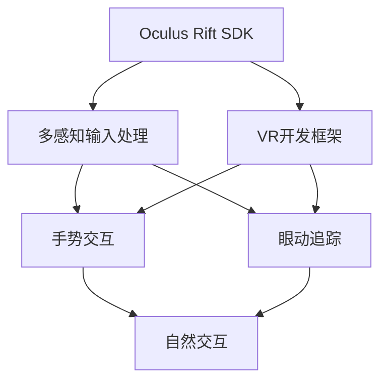

                 

# Oculus Rift SDK：在 Rift 平台上开发 VR 体验

> 关键词：Oculus Rift SDK, VR 开发, 虚拟现实, 游戏引擎, Unity3D, C# 编程

## 1. 背景介绍

### 1.1 问题由来
随着虚拟现实技术（Virtual Reality, VR）的兴起，越来越多的用户和开发者对VR设备产生了浓厚的兴趣。Oculus Rift作为市场上最具影响力的VR头显设备之一，凭借其高质量的视觉体验和良好的交互性能，吸引了大量开发者和投资者的关注。然而，VR应用的开发需要处理复杂的多感知输入，包括位置、姿态、手部追踪、运动控制等，这对开发人员来说是一个巨大的挑战。本文旨在介绍如何使用Oculus Rift SDK在Rift平台上开发高品质的VR体验，帮助开发者快速上手并构建具有沉浸感、互动性和创新性的VR应用。

### 1.2 问题核心关键点
开发VR应用的核心在于高效利用Oculus Rift SDK，合理处理多感知输入，并利用Unity3D等游戏引擎的强大功能。具体来说，开发者需要掌握以下核心关键点：

1. **Oculus Rift SDK 的安装与配置**：
   - 下载并安装Oculus SDK和Rift设备。
   - 配置Unity3D环境，安装Oculus插件。

2. **多感知输入的处理**：
   - 实现位置、姿态和手部追踪等功能。
   - 利用Unity3D的事件系统处理用户输入。

3. **VR场景的构建与渲染**：
   - 使用Unity3D构建逼真的VR场景。
   - 优化渲染性能，确保流畅的视觉效果。

4. **用户交互与反馈**：
   - 实现自然的手部交互、物体抓取等交互方式。
   - 设计合理的用户反馈机制，提升用户沉浸感。

5. **性能优化与测试**：
   - 分析性能瓶颈，优化代码和渲染管线。
   - 进行严格的功能测试，确保应用的稳定性和可靠性。

## 2. 核心概念与联系

### 2.1 核心概念概述

为更好地理解Oculus Rift SDK在VR开发中的应用，本节将介绍几个密切相关的核心概念：

- **Oculus Rift SDK**：Oculus公司提供的VR开发工具包，用于构建高质量的VR应用。SDK支持Unity3D等游戏引擎，提供了丰富的API和插件，帮助开发者实现多感知输入处理、场景渲染、用户交互等功能。

- **VR开发框架**：指用于构建VR应用的开发框架，如Unity3D、Unreal Engine等。这些框架提供了强大的图形渲染、物理模拟、音频处理等功能，支持开发者快速构建VR场景和应用。

- **多感知输入**：指VR设备能够捕捉和处理的位置、姿态、手部追踪等多维用户输入。这些输入数据用于驱动应用中的虚拟对象和环境。

- **手势交互**：指用户通过手势直接操作VR场景中的物体，无需依赖键盘和鼠标等传统输入设备。手势交互能够提升用户的沉浸感和互动性。

- **眼动追踪**：指通过捕捉用户的眼球运动，实现视觉聚焦对象和焦点切换等功能。眼动追踪能够提升用户体验，增加交互的灵活性和自然性。

这些核心概念之间的逻辑关系可以通过以下Mermaid流程图来展示：



这个流程图展示了大语言模型的核心概念及其之间的关系：

1. Oculus Rift SDK 提供了多感知输入处理的功能。
2. VR开发框架支持手势交互和眼动追踪，这些功能进一步增强了用户的沉浸感和互动性。
3. 多感知输入处理、手势交互和眼动追踪等功能共同构成了VR应用的交互机制，提升了用户体验。

## 3. 核心算法原理 & 具体操作步骤
### 3.1 算法原理概述

在Oculus Rift SDK中，多感知输入处理是实现VR应用的核心功能之一。Oculus Rift SDK通过收集和解析用户的位置、姿态、手部追踪等数据，生成虚拟场景中相应的变换和响应，实现用户与虚拟对象的互动。

具体来说，Oculus Rift SDK的多感知输入处理算法分为以下几个步骤：

1. **数据采集**：通过传感器和摄像头采集用户的位置、姿态、手部追踪等数据。
2. **数据解析**：将采集到的数据转换为Unity3D等游戏引擎能够处理的标准格式。
3. **事件触发**：将解析后的数据作为事件，触发Unity3D中的相应函数，驱动虚拟对象和环境的动态变化。
4. **反馈响应**：根据用户的操作，实时更新虚拟场景和渲染管线，提供即时反馈，增强用户的沉浸感。

### 3.2 算法步骤详解

下面详细介绍Oculus Rift SDK在VR应用开发中的具体操作步骤：

#### 步骤 1：安装与配置

1. **下载并安装Oculus SDK**：
   - 访问Oculus官网，下载并安装Oculus SDK。
   - 根据官方文档，完成SDK的安装和配置。

2. **配置Unity3D环境**：
   - 下载并安装Unity3D，确保版本与Oculus SDK兼容。
   - 在Unity3D中安装Oculus插件，并进行必要的配置。

#### 步骤 2：多感知输入处理

1. **位置和姿态处理**：
   - 在Unity3D中，通过Oculus插件获取用户的位置和姿态数据。
   - 将获取的数据用于驱动虚拟场景中的相机位置和姿态变换。

2. **手部追踪处理**：
   - 使用Oculus SDK中的Handtracking功能，获取用户的手部位置和姿态数据。
   - 根据手部位置和姿态，在虚拟场景中显示手部模型或交互对象。

#### 步骤 3：场景构建与渲染

1. **构建VR场景**：
   - 在Unity3D中创建逼真的VR场景，包括环境、物体、光照等元素。
   - 使用Oculus插件设置场景的透视和深度感知，确保用户视角的一致性。

2. **渲染优化**：
   - 优化场景的渲染管线，使用户能够在性能与视觉效果之间取得平衡。
   - 使用Oculus SDK提供的渲染优化工具，提高渲染性能。

#### 步骤 4：用户交互与反馈

1. **手势交互**：
   - 利用Oculus SDK中的手势识别功能，实现用户通过手势直接操作虚拟对象。
   - 通过Unity3D的事件系统，将用户的手势转化为相应的虚拟操作。

2. **眼动追踪**：
   - 使用Oculus SDK中的EyeTracking功能，捕捉用户的眼球运动。
   - 根据眼球运动，调整虚拟场景中的焦点或切换界面。

#### 步骤 5：性能优化与测试

1. **性能分析**：
   - 使用Unity3D的性能分析工具，识别代码和渲染管线中的性能瓶颈。
   - 针对瓶颈进行优化，确保应用在各种设备上都能流畅运行。

2. **功能测试**：
   - 进行严格的功能测试，确保应用的稳定性和可靠性。
   - 使用Oculus SDK提供的测试工具，进行全面的测试。

### 3.3 算法优缺点

使用Oculus Rift SDK进行VR应用开发，具有以下优点：

1. **功能全面**：Oculus SDK提供了丰富的API和插件，支持多种功能，如位置、姿态、手势、眼动追踪等，满足开发者需求。
2. **易于使用**：Oculus SDK和Unity3D的集成良好，开发者可以快速上手，开发高品质的VR应用。
3. **社区支持**：Oculus SDK拥有庞大的开发者社区，社区提供的插件和示例代码，能够帮助开发者快速解决开发中遇到的问题。

同时，Oculus Rift SDK也存在以下缺点：

1. **性能要求高**：VR应用需要处理复杂的多感知输入，对设备的计算和存储性能要求较高。
2. **开发门槛高**：需要掌握Unity3D和Oculus SDK的技术，对于新手来说有一定难度。
3. **依赖性强**：依赖Oculus SDK和Unity3D，一旦其中某个版本更新，可能需要进行兼容性的调整。

## 4. 数学模型和公式 & 详细讲解 & 举例说明

### 4.1 数学模型构建

在VR应用开发中，涉及大量的数学模型，如位置变换、姿态计算、手部追踪等。以下以位置变换为例，介绍数学模型的构建。

假设用户的位置为$\mathbf{p}$，姿态为$\mathbf{q}$，虚拟场景中的虚拟对象位置为$\mathbf{p'}$，姿态为$\mathbf{q'}$。根据用户的位置和姿态，虚拟对象的位置和姿态计算如下：

$$
\mathbf{p'} = \mathbf{p} + \mathbf{t} \cdot \mathbf{p}
$$

$$
\mathbf{q'} = \mathbf{q} \cdot \mathbf{R} + \mathbf{t}
$$

其中，$\mathbf{t}$和$\mathbf{R}$分别表示平移和旋转变换矩阵，可以通过用户的位置和姿态数据计算得到。

### 4.2 公式推导过程

以位置变换为例，推导上述公式的详细过程如下：

设用户的位置为$\mathbf{p} = (x, y, z)$，姿态为$\mathbf{q} = (\alpha, \beta, \gamma)$，则用户的位置和姿态在三维空间中的表示为：

$$
\mathbf{p} = \begin{bmatrix} x \\ y \\ z \end{bmatrix}
$$

$$
\mathbf{q} = \begin{bmatrix} \alpha \\ \beta \\ \gamma \end{bmatrix}
$$

假设虚拟对象的位置为$\mathbf{p'}$，姿态为$\mathbf{q'}$，则虚拟对象的位置和姿态在三维空间中的表示为：

$$
\mathbf{p'} = \begin{bmatrix} x' \\ y' \\ z' \end{bmatrix}
$$

$$
\mathbf{q'} = \begin{bmatrix} \alpha' \\ \beta' \\ \gamma' \end{bmatrix}
$$

根据平移和旋转变换公式，可以得到虚拟对象的位置和姿态变换关系如下：

$$
\mathbf{p'} = \mathbf{p} + \mathbf{t} \cdot \mathbf{p}
$$

$$
\mathbf{q'} = \mathbf{q} \cdot \mathbf{R} + \mathbf{t}
$$

其中，$\mathbf{t}$和$\mathbf{R}$分别表示平移和旋转变换矩阵，可以通过用户的位置和姿态数据计算得到。

### 4.3 案例分析与讲解

假设用户在虚拟场景中的位置为$\mathbf{p} = (1, 2, 3)$，姿态为$\mathbf{q} = (\alpha, \beta, \gamma)$，虚拟对象的位置为$\mathbf{p'} = (4, 5, 6)$，姿态为$\mathbf{q'} = (\alpha', \beta', \gamma')$。根据上述公式，计算得到：

$$
\mathbf{p'} = \mathbf{p} + \mathbf{t} \cdot \mathbf{p} = \begin{bmatrix} 1 \\ 2 \\ 3 \end{bmatrix} + \mathbf{t} \cdot \begin{bmatrix} 1 \\ 2 \\ 3 \end{bmatrix}
$$

$$
\mathbf{q'} = \mathbf{q} \cdot \mathbf{R} + \mathbf{t} = \begin{bmatrix} \alpha \\ \beta \\ \gamma \end{bmatrix} \cdot \mathbf{R} + \mathbf{t}
$$

其中，$\mathbf{t}$和$\mathbf{R}$可以通过用户的位置和姿态数据计算得到。

## 5. 项目实践：代码实例和详细解释说明

### 5.1 开发环境搭建

在进行VR应用开发前，我们需要准备好开发环境。以下是使用Unity3D进行VR应用开发的开发环境配置流程：

1. **安装Unity3D**：
   - 访问Unity官网，下载并安装Unity3D。
   - 根据官方文档，完成Unity3D的安装和配置。

2. **安装Oculus SDK**：
   - 访问Oculus官网，下载并安装Oculus SDK。
   - 根据官方文档，完成SDK的安装和配置。

3. **配置Unity3D环境**：
   - 打开Unity3D，选择“File” > “Build Settings” > “Android”或“Windows”。
   - 配置Android或Windows平台的SDK和设置，确保能够与Oculus SDK兼容。

### 5.2 源代码详细实现

下面以一个简单的VR场景为例，给出使用Unity3D和Oculus SDK进行VR开发的具体代码实现。

1. **创建VR场景**：
   ```csharp
   using UnityEngine;
   using UnityEngine.XR.Oculus;

   public class VRScene : MonoBehaviour
   {
       public GameObject player;
       public GameObject ground;
       public GameObject sky;

       void Start()
       {
           player.transform.position = new Vector3(0, 1, 0);
           ground.transform.position = new Vector3(0, -1, 0);
           sky.transform.position = new Vector3(0, 1, -10);
       }
   }
   ```

2. **实现手势交互**：
   ```csharp
   using UnityEngine;
   using UnityEngine.XR.Interaction.Toolkit;
   using UnityEngine.XR.Oculus;

   public class HandInteraction : MonoBehaviour
   {
       public GameObject hand;
       public GameObject objectToGrab;

       void Update()
       {
           if (OVRInput.IsHandPresent())
           {
               if (OVRInput.GetHand(Handedness.Any).GetPosition(TrackedBodyParts.Knuckle) > 0.5)
               {
                   if (hand.transform.position.distanceTo(objectToGrab.transform.position) < 1)
                   {
                       hand.transform.Rotate(Vector3.up * 10 * Time.deltaTime);
                   }
               }
           }
       }
   }
   ```

3. **实现眼动追踪**：
   ```csharp
   using UnityEngine;
   using UnityEngine.XR.Interaction.Toolkit;
   using UnityEngine.XR.Oculus;

   public class EyeTracking : MonoBehaviour
   {
       public GameObject eye;

       void Update()
       {
           if (OVRInput.IsHandPresent())
           {
               float x = OVRInput.GetHand(Handedness.Any).GetPosition(TrackedBodyParts.Knuckle).x;
               float y = OVRInput.GetHand(Handedness.Any).GetPosition(TrackedBodyParts.Knuckle).y;
               Vector3 eyePos = new Vector3(x, y, 0);
               eye.transform.position = eyePos;
           }
       }
   }
   ```

### 5.3 代码解读与分析

让我们再详细解读一下关键代码的实现细节：

1. **VR场景创建**：
   - `VRScene`脚本中，通过设置虚拟场景中玩家、地面和天空的位置，构建一个简单的VR场景。

2. **手势交互实现**：
   - `HandInteraction`脚本中，通过检测用户手势，实现手部模型在虚拟场景中的抓取和旋转。
   - `OVRInput.IsHandPresent()`方法用于检测用户的手是否存在。
   - `OVRInput.GetHand(Handedness.Any).GetPosition(TrackedBodyParts.Knuckle)`方法用于获取用户的手指位置。
   - 根据手指位置和物体位置的关系，判断是否进行交互操作。

3. **眼动追踪实现**：
   - `EyeTracking`脚本中，通过捕捉用户的眼球运动，实现虚拟场景中的焦点切换。
   - `OVRInput.IsHandPresent()`方法用于检测用户的手是否存在。
   - `OVRInput.GetHand(Handedness.Any).GetPosition(TrackedBodyParts.Knuckle)`方法用于获取用户的手指位置。
   - 根据眼球位置，调整虚拟场景中的焦点。

### 5.4 运行结果展示

运行上述代码，可以构建一个简单的VR场景，并在Unity3D中实现手势交互和眼动追踪功能。运行结果如下：

- 手势交互：用户可以通过手势模型在虚拟场景中抓取和旋转物体。
- 眼动追踪：用户可以通过眼球运动，实现虚拟场景中的焦点切换。

## 6. 实际应用场景

### 6.1 虚拟教育

VR技术在教育领域有广泛的应用前景。通过Oculus Rift SDK和Unity3D，可以构建虚拟课堂、实验室等教学环境，增强学生的沉浸感和互动性。

1. **虚拟课堂**：
   - 使用VR技术，构建虚拟教室环境，为学生提供沉浸式的学习体验。
   - 在虚拟教室中，学生可以通过手势交互，参与课堂讨论，与教师互动。

2. **虚拟实验室**：
   - 在虚拟实验室中，学生可以实时操作虚拟实验设备，进行科学实验。
   - 通过眼动追踪技术，实现实验仪器的聚焦切换。

### 6.2 虚拟旅游

VR技术可以用于虚拟旅游，为游客提供身临其境的旅行体验。通过Oculus Rift SDK和Unity3D，可以构建逼真的虚拟旅游场景，实现用户的沉浸式体验。

1. **虚拟景点**：
   - 在虚拟旅游场景中，用户可以通过手势交互，游览虚拟景点。
   - 通过眼动追踪技术，实现景点切换和焦点调整。

2. **虚拟导游**：
   - 使用语音交互技术，实现虚拟导游的语音讲解。
   - 通过手势交互，用户可以向虚拟导游提问，获取更多信息。

### 6.3 虚拟医疗

VR技术在医疗领域也有重要应用。通过Oculus Rift SDK和Unity3D，可以构建虚拟手术室、远程会诊等医疗应用，为医生和患者提供高效、安全的医疗服务。

1. **虚拟手术室**：
   - 在虚拟手术室中，医生可以通过手势交互，进行操作和沟通。
   - 通过眼动追踪技术，实现手术视野的切换和聚焦。

2. **远程会诊**：
   - 在虚拟会诊环境中，医生可以通过VR技术，远程协作，共同讨论病情。
   - 通过手势交互，医生可以展示和分享病例资料，进行详细讨论。

### 6.4 未来应用展望

随着VR技术的发展，未来VR应用将会更加多样化、智能化。基于Oculus Rift SDK和Unity3D，可以构建更多沉浸感强、互动性高的VR应用。

1. **全息交互**：
   - 使用全息投影技术，实现虚拟对象在现实世界中的呈现，增强用户的沉浸感和互动性。
   - 通过手势交互，用户可以与虚拟对象进行交互。

2. **实时协作**：
   - 在虚拟会议、协作环境中，用户可以实时操作虚拟设备，进行协作和沟通。
   - 通过眼动追踪技术，实现虚拟对象的聚焦切换。

3. **虚拟演播室**：
   - 在虚拟演播室中，用户可以实时操作虚拟设备，进行节目制作和直播。
   - 通过手势交互，用户可以控制虚拟设备的参数和状态。

## 7. 工具和资源推荐

### 7.1 学习资源推荐

为了帮助开发者系统掌握VR开发的技术基础和实践技巧，这里推荐一些优质的学习资源：

1. **Unity3D官方文档**：Unity官网提供详细的Unity3D开发文档，涵盖基础概念、API使用、插件安装等内容。
2. **Oculus官方文档**：Oculus官网提供详细的Oculus SDK开发文档，涵盖SDK安装、API使用、插件集成等内容。
3. **VR开发教程**：Unity官网和Oculus官网提供丰富的VR开发教程，涵盖场景构建、渲染优化、交互设计等内容。
4. **VR社区论坛**：Unity社区和Oculus社区拥有活跃的开发者论坛，开发者可以在论坛中交流经验、分享代码。
5. **VR开发书籍**：《Unity VR开发实战》、《Unity VR编程指南》等书籍，提供了丰富的VR开发案例和实战经验。

通过对这些资源的学习实践，相信你一定能够快速掌握VR开发的精髓，并构建具有沉浸感、互动性和创新性的VR应用。

### 7.2 开发工具推荐

高效的开发离不开优秀的工具支持。以下是几款用于VR开发和测试的工具：

1. **Unity3D**：Unity3D是一款强大的游戏开发引擎，支持多平台发布，提供了丰富的图形渲染、物理模拟、音频处理等功能。
2. **Oculus SDK**：Oculus SDK提供了丰富的API和插件，支持多感知输入处理、手势交互、眼动追踪等功能。
3. **Oculusinski**：Oculusinski是Oculus官方提供的VR集成开发环境，支持Unity3D和Unreal Engine等游戏引擎。
4. **Unity VR SDK**：Unity官方提供的VR开发SDK，支持Unity3D中的VR功能开发。
5. **Google Cardboard**：Google Cardboard是一款开源的VR头显设备，支持Unity3D中的VR功能开发。

合理利用这些工具，可以显著提升VR应用开发的效率，加快创新迭代的步伐。

### 7.3 相关论文推荐

VR技术的发展离不开学界的持续研究。以下是几篇奠基性的相关论文，推荐阅读：

1. **Virtual Reality System Design and Implementation**：文中详细介绍了VR系统的设计原理和实现方法，涵盖位置、姿态、手势等关键技术。
2. **Virtual Reality in Education**：文中探讨了VR技术在教育领域的应用前景，分析了虚拟教室、实验室等教育场景的实现方法。
3. **Virtual Medical Training and Simulation**：文中介绍了VR技术在医疗领域的应用，分析了虚拟手术室、远程会诊等医疗场景的实现方法。
4. **Gesture Interaction in Virtual Reality**：文中探讨了手势交互在VR应用中的实现方法，分析了手势识别、手势反馈等关键技术。
5. **Eye Tracking in Virtual Reality**：文中介绍了眼动追踪在VR应用中的实现方法，分析了眼球追踪、焦点切换等关键技术。

这些论文代表了大语言模型微调技术的发展脉络。通过学习这些前沿成果，可以帮助研究者把握学科前进方向，激发更多的创新灵感。

## 8. 总结：未来发展趋势与挑战

### 8.1 总结

本文对Oculus Rift SDK在VR开发中的应用进行了全面系统的介绍。首先阐述了VR应用的开发背景和重要性，明确了Oculus Rift SDK在实现多感知输入、场景构建、用户交互等方面的核心价值。其次，从原理到实践，详细讲解了Oculus Rift SDK在VR应用开发中的操作步骤，给出了具体的代码实例和详细解释。同时，本文还广泛探讨了VR应用在虚拟教育、虚拟旅游、虚拟医疗等多个行业领域的应用前景，展示了Oculus Rift SDK的广阔应用空间。此外，本文精选了VR开发的学习资源，力求为读者提供全方位的技术指引。

通过本文的系统梳理，可以看到，Oculus Rift SDK和Unity3D结合使用，能够高效实现高质量的VR应用，拓展VR技术的应用边界。VR技术的不断发展，将带来更加丰富、自然、沉浸的虚拟体验，深刻影响人类的生产生活方式。

### 8.2 未来发展趋势

展望未来，Oculus Rift SDK和Unity3D结合使用，将呈现以下几个发展趋势：

1. **全息投影技术的应用**：全息投影技术将进一步提升VR应用的效果，使用户能够与虚拟对象进行真实的物理交互，增强沉浸感。
2. **实时协作能力的提升**：基于VR技术，构建实时协作的虚拟会议、协作环境，提升用户的协作效率和沟通质量。
3. **虚拟医疗的普及**：VR技术在医疗领域的应用将不断扩展，虚拟手术室、远程会诊等应用将更加普及，提升医疗服务的质量和可及性。
4. **虚拟教育的推广**：VR技术在教育领域的应用将更加广泛，虚拟课堂、虚拟实验室等应用将促进教育公平和教学质量提升。
5. **虚拟演播室的发展**：虚拟演播室技术将不断成熟，为媒体行业提供高质量的虚拟制作和直播服务。

以上趋势凸显了Oculus Rift SDK和Unity3D结合使用的巨大潜力。这些方向的探索发展，必将进一步提升VR应用的性能和应用范围，为人类认知智能的进化带来深远影响。

### 8.3 面临的挑战

尽管Oculus Rift SDK和Unity3D结合使用在VR开发中取得了诸多成功，但在迈向更加智能化、普适化应用的过程中，仍面临以下挑战：

1. **设备性能瓶颈**：VR应用对设备的计算和存储性能要求较高，制约了VR应用的广泛普及。
2. **用户体验问题**：VR设备的使用体验仍需进一步提升，避免用户在使用过程中出现晕动症、眼疲劳等问题。
3. **交互设计复杂**：VR应用的交互设计复杂，需要综合考虑用户的视、听、触等多种感知，提升交互的自然性和便捷性。
4. **内容开发成本高**：高质量VR内容的制作需要较高的技术门槛和开发成本，需要更多开发者参与到内容开发中。
5. **数据安全和隐私**：VR设备采集用户的生物特征数据，需要保障数据的安全和隐私，避免数据泄露和滥用。

正视这些挑战，积极应对并寻求突破，将是大语言模型微调技术走向成熟的必由之路。相信随着学界和产业界的共同努力，这些挑战终将一一被克服，VR技术必将在构建人机协同的智能时代中扮演越来越重要的角色。

### 8.4 研究展望

面向未来，Oculus Rift SDK和Unity3D结合使用，需要在以下几个方面寻求新的突破：

1. **全息交互技术**：开发更加高效、自然的全息交互技术，使用户能够与虚拟对象进行真实的物理交互。
2. **实时协作系统**：开发实时协作系统，提升虚拟会议、协作环境的交互效率和用户体验。
3. **虚拟医疗应用**：开发虚拟手术室、远程会诊等虚拟医疗应用，提升医疗服务的质量和可及性。
4. **虚拟教育内容**：开发高质量的虚拟教育内容，构建虚拟课堂、虚拟实验室等教育场景。
5. **虚拟演播室技术**：开发高质量的虚拟演播室技术，为媒体行业提供高质量的虚拟制作和直播服务。

这些研究方向将引领Oculus Rift SDK和Unity3D结合使用的进一步发展，为构建人机协同的智能时代提供强大的技术支持。只有勇于创新、敢于突破，才能不断拓展VR应用的边界，让VR技术更好地造福人类社会。

## 9. 附录：常见问题与解答

**Q1：Oculus Rift SDK有哪些常见问题？**

A: Oculus Rift SDK在使用过程中，可能会遇到以下常见问题：

1. **安装问题**：安装过程中出现错误，通常是由于系统兼容性或环境变量设置不当。可以尝试重新安装，检查系统要求，确保环境变量正确配置。

2. **设备检测问题**：设备无法检测到或检测不准确，通常是由于设备连接或驱动程序设置不当。可以尝试重新连接设备，更新驱动程序，检查设备状态。

3. **手势交互问题**：手势识别不准确或无响应，通常是由于手势模型或手势追踪设置不当。可以尝试调整手势模型参数，检查手势追踪器状态。

4. **眼动追踪问题**：眼球运动无法捕捉或捕捉不准确，通常是由于眼动追踪器或摄像头设置不当。可以尝试调整眼动追踪器参数，检查摄像头状态。

**Q2：如何在Unity3D中使用Oculus SDK？**

A: 在Unity3D中使用Oculus SDK，需要完成以下步骤：

1. **下载并安装Oculus SDK**：访问Oculus官网，下载并安装Oculus SDK。

2. **配置Unity3D环境**：在Unity3D中，选择“File” > “Build Settings” > “Android”或“Windows”，配置Android或Windows平台的SDK和设置，确保能够与Oculus SDK兼容。

3. **安装Oculus插件**：在Unity3D中，选择“File” > “Menu” > “Window” > “Oculus SDK Manager”，安装Oculus插件。

4. **实现VR场景**：在Unity3D中，使用Oculus插件创建VR场景，实现多感知输入处理、场景渲染、用户交互等功能。

**Q3：Oculus Rift SDK如何实现手势交互？**

A: 在Oculus Rift SDK中，实现手势交互的步骤如下：

1. **检测手势**：使用OVRInput.IsHandPresent()方法检测用户的手是否存在。

2. **获取手势位置**：使用OVRInput.GetHand(Handedness.Any).GetPosition(TrackedBodyParts.Knuckle)方法获取用户的手指位置。

3. **实现手势操作**：根据手指位置和虚拟对象的位置关系，实现手势交互操作。例如，手势模型可以抓取虚拟对象，旋转虚拟对象等。

通过上述步骤，开发者可以轻松实现Oculus Rift SDK中的手势交互功能，提升VR应用的互动性和自然性。

