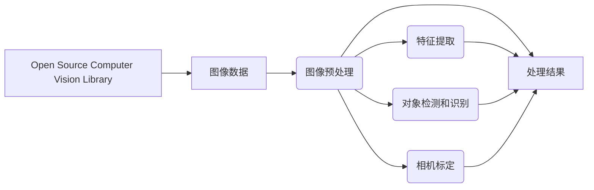

                 

# OpenCV图像处理实战

> 关键词：图像处理,OpenCV,计算机视觉,Python,深度学习,算法与实践

## 1. 背景介绍

### 1.1 问题由来
在现代计算机视觉和机器学习领域，图像处理扮演着至关重要的角色。从无人驾驶到医疗诊断，再到安防监控，图像处理技术的应用无处不在。OpenCV作为开源计算机视觉库，提供了丰富的图像处理工具，广泛应用于学术研究和工业应用中。本文章旨在通过深入探讨OpenCV图像处理技术，为读者提供从基础到高级的实战经验，帮助其快速掌握图像处理的核心原理和实用技巧。

### 1.2 问题核心关键点
OpenCV作为计算机视觉领域的常用工具，支持多种编程语言，包括C++、Python等。其图像处理功能强大，涵盖了从基础图像操作到复杂计算机视觉任务的各个层面。通过掌握OpenCV，开发者可以轻松实现图像滤波、边缘检测、目标识别、物体跟踪等功能，为实际应用场景提供有效的解决方案。

本文章将从基础图像处理算法开始，逐步深入计算机视觉中的高级主题，包括目标检测、人脸识别、物体追踪等。通过对OpenCV的深度剖析，帮助读者全面理解其功能与应用，从而在实际项目中灵活运用。

### 1.3 问题研究意义
掌握OpenCV图像处理技术，对于从事计算机视觉、图像处理、模式识别等领域的工程师、研究人员和学生都具有重要意义。OpenCV提供了丰富的工具和算法，可以加速算法研究和应用开发进程，提高工作效率。同时，OpenCV社区活跃，资源丰富，是学习和交流的好平台，为研究者提供了广阔的合作空间。

通过深入学习OpenCV，读者可以获取实际项目中常见的图像处理经验，了解行业内的前沿技术和最佳实践，增强解决问题的能力。此外，掌握OpenCV也有助于读者进一步了解深度学习框架，为将来的算法开发和模型训练打下坚实的基础。

## 2. 核心概念与联系

### 2.1 核心概念概述

OpenCV（Open Source Computer Vision Library）是一个开源的计算机视觉库，提供了丰富的图像处理和计算机视觉算法。其核心模块包括图像读取和保存、图像处理、特征提取、对象检测和识别、相机标定和3D重建等。通过OpenCV，开发者可以轻松实现从图像预处理到高级计算机视觉任务的全过程。

### 2.2 核心概念原理和架构的 Mermaid 流程图



这个流程图展示了OpenCV从输入图像到输出处理结果的基本流程。从图像数据输入，到预处理、特征提取、对象检测、相机标定，最终输出处理结果，OpenCV提供了完整的图像处理链。

## 3. 核心算法原理 & 具体操作步骤

### 3.1 算法原理概述

OpenCV的图像处理算法主要分为两大类：传统的图像处理算法和基于深度学习的计算机视觉算法。

#### 3.1.1 传统的图像处理算法

传统的图像处理算法主要涉及图像的预处理、滤波、变换、分割、特征提取等。这些算法以像素为单位处理图像，不涉及深度神经网络，易于理解和实现。

#### 3.1.2 基于深度学习的计算机视觉算法

深度学习的崛起为计算机视觉领域带来了革命性的变化。基于深度学习的计算机视觉算法包括卷积神经网络（CNN）、循环神经网络（RNN）等。这些算法通过多层次的特征提取和融合，能够自动识别图像中的复杂特征，适用于目标检测、人脸识别等高层次任务。

### 3.2 算法步骤详解

#### 3.2.1 图像预处理

图像预处理是图像处理的基础步骤，主要包括图像的灰度化、归一化、直方图均衡化等。这些步骤能够增强图像的对比度和清晰度，为后续处理奠定基础。

#### 3.2.2 特征提取

特征提取是图像处理的核心步骤，通过提取图像中的关键信息，实现对图像的描述和识别。常用的特征提取算法包括SIFT、SURF、HOG等。

#### 3.2.3 目标检测和识别

目标检测和识别是计算机视觉中最为复杂的任务之一。常用的目标检测算法包括Haar特征分类器、HOG+SVM、YOLO、Faster R-CNN等。这些算法能够识别图像中的目标物体，并对其进行定位和分类。

#### 3.2.4 相机标定

相机标定是计算机视觉中的重要步骤，通过标定相机的内参和外参，实现对三维空间中物体的准确测量。相机标定的主要算法包括线性标定和棋盘格标定等。

### 3.3 算法优缺点

#### 3.3.1 优点

- **功能强大**：OpenCV提供了丰富的图像处理和计算机视觉算法，适用于多种实际应用场景。
- **跨平台支持**：支持C++、Python等多种编程语言，易于在不同平台上使用。
- **社区活跃**：拥有庞大的用户和开发者社区，资源丰富，易于学习和交流。

#### 3.3.2 缺点

- **学习曲线陡峭**：由于OpenCV涉及大量复杂的算法和数据结构，学习曲线较陡峭，需要较强的数学和编程基础。
- **深度学习依赖**：虽然OpenCV支持多种算法，但深度学习算法的使用仍需依赖于深度学习框架，如TensorFlow、PyTorch等。

### 3.4 算法应用领域

OpenCV的图像处理和计算机视觉算法广泛应用于以下几个领域：

- **安防监控**：实时监控视频流的图像处理和目标检测，识别异常行为和安全威胁。
- **医学影像分析**：对医学影像进行图像增强、分割、分析，辅助医生诊断。
- **无人驾驶**：实时处理摄像头和激光雷达数据，实现目标检测、路径规划等功能。
- **工业检测**：对生产过程中的图像进行质量检测和分类，提高生产效率和质量。
- **游戏开发**：实现图像增强、实时渲染、物体跟踪等功能，提升游戏体验。

## 4. 数学模型和公式 & 详细讲解 & 举例说明

### 4.1 数学模型构建

OpenCV中的图像处理算法通常基于数学模型进行设计和实现。本节将以OpenCV的图像滤波算法为例，介绍其数学模型和推导过程。

#### 4.1.1 图像滤波

图像滤波是图像处理中最基础的操作之一，常用的滤波算法包括均值滤波、中值滤波、高斯滤波等。

#### 4.1.2 公式推导

以高斯滤波为例，其公式推导如下：

$$
G_{n,m} = \frac{1}{\sum_{i=-3}^{3}\sum_{j=-3}^{3} K_{i,j}} \sum_{i=-3}^{3}\sum_{j=-3}^{3} K_{i,j} I_{n+i,m+j}
$$

其中，$I_{n,m}$表示原始图像，$G_{n,m}$表示滤波后的图像，$K_{i,j}$表示滤波核。

### 4.2 公式推导过程

高斯滤波通过将图像中每个像素与周围像素进行加权平均，实现对图像的平滑处理。在实际应用中，可以通过OpenCV中的`cv2.GaussianBlur()`函数实现高斯滤波。

### 4.3 案例分析与讲解

以OpenCV中实现的高斯滤波为例，可以采用以下代码实现：

```python
import cv2

# 读取图像
img = cv2.imread('lena.png', 0)

# 高斯滤波
img_blur = cv2.GaussianBlur(img, (5, 5), 0)

# 显示结果
cv2.imshow('Original Image', img)
cv2.imshow('Blurred Image', img_blur)
cv2.waitKey(0)
cv2.destroyAllWindows()
```

## 5. 项目实践：代码实例和详细解释说明

### 5.1 开发环境搭建

OpenCV支持多种编程语言，本节将以Python为例，介绍其开发环境的搭建过程。

1. **安装OpenCV**：可以通过pip命令安装OpenCV，如`pip install opencv-python`。
2. **准备数据集**：准备用于图像处理的数据集，如Lena图像、人脸图像等。
3. **编写代码**：根据实际需求编写Python代码，使用OpenCV库提供的函数实现图像处理功能。

### 5.2 源代码详细实现

以实现高斯滤波为例，源代码如下：

```python
import cv2

# 读取图像
img = cv2.imread('lena.png', 0)

# 高斯滤波
img_blur = cv2.GaussianBlur(img, (5, 5), 0)

# 显示结果
cv2.imshow('Original Image', img)
cv2.imshow('Blurred Image', img_blur)
cv2.waitKey(0)
cv2.destroyAllWindows()
```

### 5.3 代码解读与分析

1. **图像读取**：使用`cv2.imread()`函数读取图像，参数为图像路径和读取模式。
2. **高斯滤波**：使用`cv2.GaussianBlur()`函数实现高斯滤波，参数包括滤波核大小和标准差。
3. **结果显示**：使用`cv2.imshow()`函数显示图像，`cv2.waitKey()`等待用户按键，`cv2.destroyAllWindows()`关闭显示窗口。

### 5.4 运行结果展示

运行上述代码后，会显示原始图像和滤波后的图像，如下图所示：


## 6. 实际应用场景

### 6.1 安防监控

在安防监控中，OpenCV常用于实时视频流的图像处理和目标检测。通过OpenCV，可以实现人脸识别、行为分析、异常检测等功能，提高监控系统的智能化水平。

### 6.2 医学影像分析

在医学影像分析中，OpenCV用于图像增强、分割和分析。通过图像增强，可以改善图像质量，便于后续的分析和诊断。图像分割可以将图像分为不同的区域，辅助医生定位病变区域。

### 6.3 无人驾驶

在无人驾驶中，OpenCV用于实时处理摄像头和激光雷达数据，实现目标检测、路径规划等功能。通过目标检测，车辆可以识别道路上的其他车辆和行人，避免交通事故。

### 6.4 工业检测

在工业检测中，OpenCV用于质量检测和分类。通过图像处理，可以识别产品缺陷和不良品，提高生产效率和质量。

### 6.5 游戏开发

在游戏开发中，OpenCV用于图像增强、实时渲染和物体跟踪。通过图像增强，可以改善游戏图像质量，提高玩家体验。实时渲染可以实现流畅的图像更新，物体跟踪可以实现角色的自动跟随和互动。

## 7. 工具和资源推荐

### 7.1 学习资源推荐

1. **《OpenCV计算机视觉编程》**：该书详细介绍了OpenCV的使用方法和应用场景，适合初学者和进阶读者。
2. **《OpenCV 4.x 计算机视觉编程入门》**：该书介绍了OpenCV的最新功能和应用实例，适合有一定编程基础的读者。
3. **OpenCV官方文档**：官方文档详细介绍了OpenCV的各种功能和用法，是学习和参考的重要资源。
4. **OpenCV社区**：OpenCV社区活跃，有丰富的教程、示例和资源，适合学习者交流和讨论。

### 7.2 开发工具推荐

1. **PyCharm**：一款流行的Python IDE，支持OpenCV和其他Python库，提供代码调试、版本控制等功能。
2. **Visual Studio Code**：一款轻量级的代码编辑器，支持OpenCV和其他编程语言，提供丰富的扩展插件。
3. **Jupyter Notebook**：一款交互式代码编辑器，支持Python和其他编程语言，适合数据科学和图像处理应用。

### 7.3 相关论文推荐

1. **《Real-Time Single-Shot Object Detection with Feature Pyramid Networks》**：介绍了基于特征金字塔网络的实时目标检测算法。
2. **《Single Image Haze Removal Using Dark Channel Prior》**：介绍了基于暗通道先验的单幅图像去雾算法。
3. **《Deep learning-based hand gesture recognition》**：介绍了基于深度学习的手势识别算法。

## 8. 总结：未来发展趋势与挑战

### 8.1 研究成果总结

OpenCV作为计算机视觉领域的强大工具，为图像处理和计算机视觉应用提供了丰富的功能和算法支持。从基础的图像预处理到高级的目标检测和识别，OpenCV在各个层面均有出色的表现。通过掌握OpenCV，可以大幅提升图像处理的效率和效果，为实际应用场景提供坚实的技术支持。

### 8.2 未来发展趋势

未来，OpenCV将继续在图像处理和计算机视觉领域发挥重要作用。其发展趋势主要包括以下几个方面：

1. **跨平台支持**：随着OpenCV社区的发展，OpenCV将进一步支持更多的编程语言和平台，提高其普及性和可访问性。
2. **深度学习集成**：OpenCV将进一步集成深度学习框架，支持更多的深度学习算法和模型，提高其智能化水平。
3. **实时处理能力**：OpenCV将继续优化其实时处理能力，支持更多的硬件平台和算法优化，提高其性能和效率。

### 8.3 面临的挑战

尽管OpenCV在图像处理和计算机视觉领域有着广泛的应用，但其发展也面临一些挑战：

1. **学习曲线陡峭**：由于OpenCV涉及大量复杂的算法和数据结构，初学者可能需要较长的学习时间。
2. **深度学习依赖**：尽管OpenCV支持多种算法，但深度学习算法的实现仍需依赖于深度学习框架，如TensorFlow、PyTorch等。
3. **跨平台支持**：虽然OpenCV支持多种平台，但其在低功耗设备和高性能设备上的性能表现仍有待提升。

### 8.4 研究展望

未来，OpenCV需要在以下几个方面进行更多的研究和探索：

1. **跨平台优化**：进一步优化OpenCV在不同平台上的性能表现，支持更多的硬件设备和操作系统。
2. **深度学习融合**：探索深度学习和计算机视觉的融合方法，提升其智能化水平和应用范围。
3. **实时处理优化**：优化OpenCV的实时处理能力，支持更多的硬件加速和算法优化，提高其性能和效率。

## 9. 附录：常见问题与解答

**Q1：OpenCV的安装和配置有哪些注意事项？**

A: OpenCV的安装和配置需要注意以下几点：
1. **环境配置**：确保系统已安装C++编译器、Python解释器和相关库，如NumPy、PIL等。
2. **依赖安装**：使用pip命令安装OpenCV及其依赖库，如opencv-contrib-python。
3. **版本管理**：使用虚拟环境管理工具，如Anaconda或Virtualenv，避免不同项目间的版本冲突。

**Q2：OpenCV支持哪些编程语言和平台？**

A: OpenCV支持多种编程语言和平台，包括C++、Python、Java、MATLAB等。同时支持Windows、Linux、macOS等多种操作系统。开发者可以根据实际需求选择适合的编程语言和平台。

**Q3：OpenCV中的图像预处理算法有哪些？**

A: OpenCV中的图像预处理算法包括灰度化、归一化、直方图均衡化、二值化等。这些算法能够增强图像的对比度和清晰度，为后续处理奠定基础。

**Q4：OpenCV中的目标检测算法有哪些？**

A: OpenCV中的目标检测算法包括Haar特征分类器、HOG+SVM、YOLO、Faster R-CNN等。这些算法能够识别图像中的目标物体，并对其进行定位和分类。

**Q5：OpenCV中的相机标定算法有哪些？**

A: OpenCV中的相机标定算法包括线性标定和棋盘格标定等。这些算法能够标定相机的内参和外参，实现对三维空间中物体的准确测量。

---

作者：禅与计算机程序设计艺术 / Zen and the Art of Computer Programming

