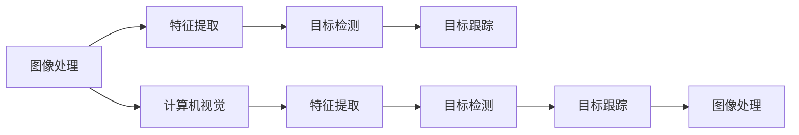

                 

# OpenCV计算机视觉库：图像处理技术

> 关键词：OpenCV, 图像处理, 计算机视觉, 特征提取, 机器学习, 深度学习, 卷积神经网络, 实时处理, 应用场景

## 1. 背景介绍

### 1.1 问题由来
计算机视觉（Computer Vision）是一门利用计算机技术模拟人类视觉系统，使计算机能够“看”和“理解”世界图像的学科。图像处理（Image Processing）则是计算机视觉中的一个重要组成部分，专注于对图像进行数字化、分析和处理，以提取有用的信息。

近年来，随着深度学习和大数据技术的飞速发展，图像处理领域也迎来了新的变革。传统的图像处理方法逐渐被基于深度学习的端到端模型所取代，这使得图像处理技术能够处理更加复杂和多样化的视觉任务。然而，尽管深度学习技术在图像处理领域取得了显著进展，但仍然存在一些问题和挑战，例如计算资源消耗大、模型复杂度高、实时处理能力差等。

为了解决这些问题，OpenCV应运而生。OpenCV是一个开源计算机视觉库，由英特尔公司发起并维护。它是一个跨平台的库，支持C++、Python等多种编程语言，能够快速、高效地处理图像和视频数据。OpenCV提供了丰富的算法和工具，能够实现从基本的图像处理到复杂的计算机视觉任务的全面支持。

### 1.2 问题核心关键点
OpenCV的核心优势在于其开源特性和广泛的算法支持。它不仅仅是一个库，更是一个强大的工具集，能够满足不同层次的图像处理和计算机视觉需求。OpenCV提供了从基础的图像处理到复杂的深度学习算法的全面支持，并且能够与主流的机器学习和深度学习框架（如TensorFlow、PyTorch等）无缝集成。

OpenCV的优势在于以下几个方面：
- 开源免费：任何人都可以自由使用、修改和分发OpenCV，极大地降低了开发成本。
- 跨平台支持：支持Windows、Linux、macOS等多个操作系统，方便开发者在不同平台上进行开发和部署。
- 丰富的算法支持：包含了图像处理、特征提取、物体检测、目标跟踪等众多算法和工具。
- 高度优化的性能：通过多种优化技术（如多线程、SIMD指令集等），OpenCV能够高效处理大规模图像数据。
- 社区活跃：拥有一个庞大的开发者社区，能够及时获取最新的技术和算法支持。

## 2. 核心概念与联系

### 2.1 核心概念概述

为了更好地理解OpenCV的功能和应用，首先需要了解一些核心概念：

- **图像处理（Image Processing）**：对数字图像进行各种数学和算法操作，以提取有用的信息或改善图像质量。
- **计算机视觉（Computer Vision）**：使用计算机技术模拟人类视觉系统，使计算机能够“看”和“理解”世界图像。
- **特征提取（Feature Extraction）**：从图像中提取具有代表性的特征，用于物体识别、分类、匹配等任务。
- **目标检测（Object Detection）**：在图像中定位和识别特定对象。
- **目标跟踪（Object Tracking）**：在视频序列中追踪移动对象的位置和运动。

这些概念之间存在紧密的联系。图像处理是计算机视觉的基础，特征提取和目标检测是计算机视觉中的关键技术，而目标跟踪则是计算机视觉中的一个高级任务。

### 2.2 核心概念原理和架构的 Mermaid 流程图



这个流程图展示了OpenCV中各个核心概念之间的关系。

## 3. 核心算法原理 & 具体操作步骤

### 3.1 算法原理概述

OpenCV提供了大量的算法和工具，能够实现从基础的图像处理到复杂的计算机视觉任务。这些算法和工具可以分为两类：

- **基础算法**：如图像读取、显示、保存、缩放、旋转等。
- **高级算法**：如特征提取、目标检测、目标跟踪等。

这些算法和工具的实现原理各不相同，但它们都可以通过OpenCV提供的API进行调用。

### 3.2 算法步骤详解

以下以特征提取算法为例，介绍如何在OpenCV中进行算法调用和实现：

#### 3.2.1 步骤1：数据准备
首先需要准备一个包含图像的数据集。这个数据集可以是一个文件夹，里面包含多个图像文件，也可以是一个数组，包含多个图像数组。

#### 3.2.2 步骤2：特征提取
在OpenCV中，可以使用多种算法进行特征提取。例如，可以使用SIFT（尺度不变特征变换）算法提取图像中的关键点和描述符。

#### 3.2.3 步骤3：特征匹配
在提取了特征后，需要对特征进行匹配。匹配算法可以根据关键点的位置和描述符进行匹配。

#### 3.2.4 步骤4：结果处理
最终，可以输出匹配结果，如关键点的匹配位置和描述符的距离等。

### 3.3 算法优缺点

OpenCV的优点在于其开源特性和广泛的算法支持。它不仅包含了大量的基础算法，还提供了丰富的高级算法和工具，能够满足不同层次的图像处理和计算机视觉需求。

然而，OpenCV也存在一些缺点：
- 复杂度高：OpenCV提供了大量的算法和工具，但同时也带来了复杂的实现和调用。
- 实时处理能力不足：OpenCV在某些复杂的计算机视觉任务中，可能无法实现实时处理。
- 数据处理能力有限：OpenCV在处理大规模图像数据时，可能存在性能瓶颈。

### 3.4 算法应用领域

OpenCV广泛应用于图像处理、计算机视觉、机器人视觉、医疗影像分析等领域。以下是一些具体的应用场景：

- **自动驾驶**：OpenCV可以用于图像处理、目标检测和跟踪，帮助自动驾驶系统识别道路、车辆和行人。
- **视频监控**：OpenCV可以用于视频处理、目标检测和跟踪，实现实时监控和告警。
- **医学影像分析**：OpenCV可以用于图像处理、特征提取和分析，帮助医生诊断疾病。
- **增强现实**：OpenCV可以用于图像处理和增强现实，实现虚拟物体和现实世界的融合。

## 4. 数学模型和公式 & 详细讲解 & 举例说明

### 4.1 数学模型构建

OpenCV中的算法和工具大多基于数学模型和公式。以下以SIFT算法为例，介绍其数学模型和公式的构建过程。

SIFT（尺度不变特征变换）算法是一种用于特征提取的算法。它的核心思想是在不同尺度和旋转下，保持特征的不变性。

#### 4.1.1 特征点检测
SIFT算法首先通过高斯差分函数（DoG）检测出图像中的关键点。高斯差分函数是一种在尺度空间中检测出极值点的算法。

高斯差分函数的基本原理是：对于任意一个尺度$\sigma$，在尺度空间中计算高斯函数$G(\sigma, x)$，然后计算其差分$I(\sigma, x)$，得到差分图像$I_{\sigma}(x)$。如果$I_{\sigma}(x)$在该尺度下为极值点，则该点为特征点。

数学公式为：
$$
I_{\sigma}(x) = G(\sigma, x) * I(x)
$$

#### 4.1.2 特征点方向确定
为了保持特征点在旋转和缩放下的不变性，需要对特征点进行方向确定。SIFT算法使用DoH（方向直方图）方法进行方向确定。

方向直方图的基本原理是：对于每个特征点，计算其周围的图像块，然后使用HOG（方向梯度直方图）方法计算该图像块的方向直方图。最终得到该特征点的方向直方图，将其作为特征点方向的表示。

#### 4.1.3 特征点描述
在确定了特征点的位置和方向后，需要对特征点进行描述。SIFT算法使用DoS（方向尺度空间）方法进行特征点描述。

方向尺度空间的基本原理是：对于每个特征点，在多个尺度下计算其方向梯度直方图，然后将其组合起来形成一个描述符。

### 4.2 公式推导过程

以下是SIFT算法的公式推导过程：

#### 4.2.1 高斯差分函数推导
$$
I_{\sigma}(x) = G(\sigma, x) * I(x)
$$

其中，$G(\sigma, x)$为高斯函数，$I(x)$为原始图像，$*$表示卷积操作。

#### 4.2.2 方向直方图推导
$$
h(x) = \sum_i |I_{\sigma_i}(x) - I_{\sigma_j}(x)|^2
$$

其中，$I_{\sigma_i}$和$I_{\sigma_j}$表示在尺度$\sigma_i$和$\sigma_j$下的高斯差分函数，$h(x)$表示方向直方图。

#### 4.2.3 方向尺度空间推导
$$
d(x) = \sum_{i=1}^{k} h_i(x) * f_{i-1}(x)
$$

其中，$h_i(x)$表示在第$i$个尺度下的方向直方图，$f_{i-1}(x)$表示在第$i-1$个尺度下的DoH函数，$k$表示总的尺度数。

### 4.3 案例分析与讲解

在实际应用中，SIFT算法已经被广泛用于计算机视觉领域。以下是一个具体的案例：

假设需要检测一组图像中的关键点，并计算这些关键点的位置和方向。首先，使用DoG算法检测出所有关键点，然后对每个关键点计算DoH函数，得到其方向直方图。接着，使用DoS算法计算每个关键点的描述符，将其存储下来。最后，可以使用这些关键点描述符进行特征匹配和物体识别。

## 5. 项目实践：代码实例和详细解释说明

### 5.1 开发环境搭建

为了进行图像处理和计算机视觉开发，需要搭建开发环境。以下是Python开发环境的搭建流程：

1. 安装Python：从官网下载并安装Python 3.x版本。
2. 安装OpenCV：使用pip安装OpenCV库。
3. 配置开发环境：安装必要的开发工具，如IDE、调试器等。
4. 配置库路径：将OpenCV库的路径添加到系统环境变量中。

### 5.2 源代码详细实现

以下是使用OpenCV进行SIFT特征提取的Python代码实现：

```python
import cv2
import numpy as np

# 读取图像
img = cv2.imread('image.jpg', 0)

# 创建DoG对象
doG = cv2.SIFT_create()

# 检测特征点
keypoints = doG.detect(img)

# 计算描述符
descriptors = doG.compute(img, keypoints)

# 可视化关键点
img_keypoints = cv2.drawKeypoints(img, keypoints, None)

# 显示图像
cv2.imshow('Image', img_keypoints)
cv2.waitKey(0)
cv2.destroyAllWindows()
```

### 5.3 代码解读与分析

以上代码实现了使用OpenCV进行SIFT特征提取的过程。以下是每个步骤的详细解读：

#### 5.3.1 图像读取
使用cv2.imread函数读取图像。

#### 5.3.2 创建DoG对象
使用cv2.SIFT_create函数创建DoG对象，用于检测特征点。

#### 5.3.3 检测特征点
使用DoG对象的detect方法检测图像中的特征点，返回特征点的列表。

#### 5.3.4 计算描述符
使用DoG对象的compute方法计算特征点的描述符，返回描述符的列表。

#### 5.3.5 可视化关键点
使用cv2.drawKeypoints函数可视化特征点的位置。

#### 5.3.6 显示图像
使用cv2.imshow函数显示图像。

### 5.4 运行结果展示

运行以上代码后，可以显示带有特征点位置的图像。


## 6. 实际应用场景

### 6.1 自动驾驶
在自动驾驶领域，OpenCV可以用于图像处理、目标检测和跟踪，帮助自动驾驶系统识别道路、车辆和行人。例如，可以使用OpenCV进行道路边缘检测、车道线识别、行人检测等任务。

### 6.2 视频监控
在视频监控领域，OpenCV可以用于视频处理、目标检测和跟踪，实现实时监控和告警。例如，可以使用OpenCV进行人脸识别、行为识别、异常检测等任务。

### 6.3 医学影像分析
在医学影像分析领域，OpenCV可以用于图像处理、特征提取和分析，帮助医生诊断疾病。例如，可以使用OpenCV进行肿瘤检测、细胞计数、病灶分割等任务。

### 6.4 增强现实
在增强现实领域，OpenCV可以用于图像处理和增强现实，实现虚拟物体和现实世界的融合。例如，可以使用OpenCV进行虚拟试衣、虚拟物体跟踪等任务。

## 7. 工具和资源推荐

### 7.1 学习资源推荐

为了深入学习OpenCV，以下是一些推荐的学习资源：

1. OpenCV官方文档：OpenCV提供了详细的官方文档，包含各种算法的实现和调用方法。
2. 《OpenCV计算机视觉编程》书籍：这本书由OpenCV的开发者之一编写，详细介绍了OpenCV的各个功能模块。
3. OpenCV实战教程：一个由OpenCV开发者提供的实战教程，适合初学者入门。
4. OpenCV-Python官方教程：OpenCV开发者提供的Python编程教程，涵盖从基础到高级的各种功能。

### 7.2 开发工具推荐

以下是一些推荐的开发工具：

1. PyCharm：一个强大的Python IDE，支持OpenCV开发。
2. Visual Studio：一个跨平台的IDE，支持C++开发。
3. Xcode：一个macOS平台上的IDE，支持C++开发。
4. Eclipse：一个跨平台的IDE，支持C++开发。

### 7.3 相关论文推荐

以下是一些OpenCV相关的经典论文：

1. SIFT算法：《尺度不变特征变换》，由David Lowe等人提出。
2. SURF算法：《加速尺度不变特征变换》，由Herbert Bay等人提出。
3. HOG算法：《方向梯度直方图》，由Naofumi Umeda等人提出。

## 8. 总结：未来发展趋势与挑战

### 8.1 研究成果总结

OpenCV作为一款开源计算机视觉库，已经在图像处理、计算机视觉、机器人视觉等领域得到了广泛应用。其丰富的算法支持、高效的性能和开源特性使其成为计算机视觉领域的重要工具。

### 8.2 未来发展趋势

未来，OpenCV将朝着以下几个方向发展：

1. 实时处理能力提升：OpenCV将进一步优化算法和数据结构，提升实时处理能力。
2. 多模态数据处理：OpenCV将支持更多的模态数据处理，如图像、视频、深度数据等。
3. 深度学习支持：OpenCV将支持更多的深度学习算法和工具，如卷积神经网络等。
4. 跨平台优化：OpenCV将支持更多的操作系统和平台，方便开发者在不同平台上进行开发和部署。
5. 社区活跃度提升：OpenCV将进一步活跃社区，提供更多的算法和工具支持。

### 8.3 面临的挑战

尽管OpenCV已经取得了显著进展，但在未来发展中仍面临以下挑战：

1. 计算资源消耗：OpenCV在处理大规模数据时，可能存在计算资源消耗大的问题。
2. 实时处理性能：OpenCV在某些复杂的计算机视觉任务中，可能无法实现实时处理。
3. 算法复杂度：OpenCV中的算法和工具可能存在复杂度高的问题，需要进一步优化。
4. 多模态数据处理：OpenCV在处理多模态数据时，可能存在性能瓶颈。
5. 社区活跃度：OpenCV需要进一步活跃社区，提供更多的算法和工具支持。

### 8.4 研究展望

未来，OpenCV将进一步提升其性能和功能，以应对未来发展的挑战。以下是一些具体的展望：

1. 优化算法和数据结构：进一步优化OpenCV中的算法和数据结构，提升实时处理能力和性能。
2. 支持更多的模态数据：支持更多的模态数据处理，如图像、视频、深度数据等。
3. 深度学习支持：支持更多的深度学习算法和工具，如卷积神经网络等。
4. 社区活跃度提升：进一步活跃OpenCV社区，提供更多的算法和工具支持。

## 9. 附录：常见问题与解答

### 9.1 Q1: OpenCV支持哪些编程语言？

A: OpenCV支持多种编程语言，包括C++、Python、Java、MATLAB等。其中，Python是最常用的编程语言之一。

### 9.2 Q2: 如何使用OpenCV进行图像处理？

A: 使用OpenCV进行图像处理，需要先读取图像，然后使用各种算法进行图像处理。例如，可以使用cv2.imread函数读取图像，使用cv2.cvtColor函数将图像转换为不同的颜色空间，使用cv2.resize函数进行图像缩放，使用cv2.blur函数进行图像模糊等。

### 9.3 Q3: OpenCV中的图像数据类型有哪些？

A: OpenCV中的图像数据类型包括单通道、多通道、灰度、深度等。常用的图像数据类型包括cv2.CV_8UC1、cv2.CV_8UC3、cv2.CV_32FC1等。

### 9.4 Q4: OpenCV中的特征提取算法有哪些？

A: OpenCV中的特征提取算法包括SIFT、SURF、ORB等。这些算法可以用于物体检测、特征匹配、图像拼接等任务。

### 9.5 Q5: OpenCV中的目标检测算法有哪些？

A: OpenCV中的目标检测算法包括Haar Cascade、HOG+SVM等。这些算法可以用于人脸检测、行人检测、车辆检测等任务。

### 9.6 Q6: OpenCV中的目标跟踪算法有哪些？

A: OpenCV中的目标跟踪算法包括CamShift、KCF、TLD等。这些算法可以用于行人跟踪、车辆跟踪等任务。

### 9.7 Q7: OpenCV中的实时处理能力如何？

A: OpenCV中的实时处理能力取决于算法的复杂度和硬件的性能。在一些简单的图像处理任务中，OpenCV可以实现实时处理。但对于一些复杂的计算机视觉任务，OpenCV可能需要一些优化才能实现实时处理。

### 9.8 Q8: OpenCV中的数据处理能力如何？

A: OpenCV中的数据处理能力取决于硬件的性能和算法的复杂度。在一些简单的图像处理任务中，OpenCV可以实现高效的数据处理。但对于一些复杂的计算机视觉任务，OpenCV可能需要一些优化才能实现高效的数据处理。

### 9.9 Q9: OpenCV中的社区活跃度如何？

A: OpenCV拥有一个庞大的开发者社区，社区活跃度较高。开发者可以随时获取最新的算法和工具支持，解决开发过程中遇到的问题。

### 9.10 Q10: OpenCV中的学习资源有哪些？

A: OpenCV的学习资源包括官方文档、书籍、教程、博客等。开发者可以通过这些资源，学习OpenCV的使用方法和算法原理。

作者：禅与计算机程序设计艺术 / Zen and the Art of Computer Programming

