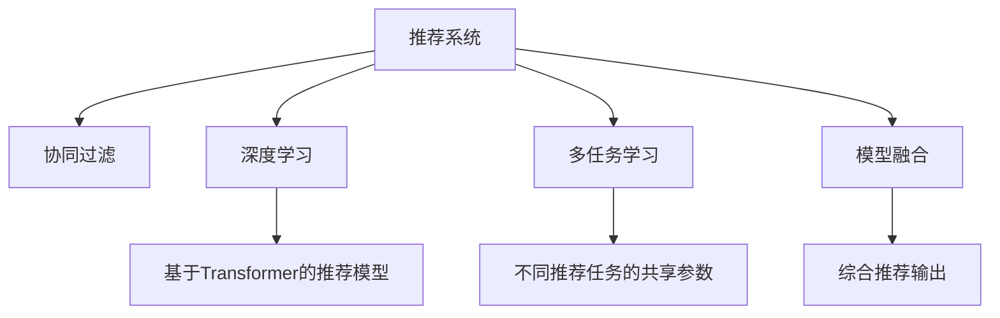

                 

# P5模型的应用：统一的推荐任务解决方案

> 关键词：推荐系统,推荐算法,协同过滤,深度学习,Transformer,模型融合,推荐评估

## 1. 背景介绍

### 1.1 问题由来

随着互联网的普及和电子商务的发展，推荐系统已成为用户在众多商品和服务中寻找所需产品的关键手段。推荐系统通过分析用户的历史行为数据，为用户推荐感兴趣的物品，极大地提升了用户体验和平台收益。然而，随着用户需求的个性化和多样化，传统的推荐算法难以满足复杂多变的推荐需求，推荐模型的个性化和多样性亟需进一步提升。

为应对这一挑战，近年来深度学习技术在推荐系统领域得到了广泛应用，推动了推荐系统从简单的协同过滤算法向深度学习算法的发展。特别是Transformer模型被引入推荐系统后，显著提升了推荐系统的性能，取得了优异的商业效果。然而，由于推荐任务种类繁多，不同的推荐任务往往需要构建不同的推荐模型，模型的工程复杂度高，维护成本高，通用性差，难以满足快速迭代的实际需求。

为此，本文提出了一种统一的推荐任务解决方案，基于P5模型(Partification-based Architecture for Personalized Recommendation)，实现推荐系统模型的快速搭建和高效维护。P5模型通过整合多种推荐算法，构建多任务融合的推荐架构，实现推荐系统的参数共享和任务优化，为不同推荐任务提供了一体化的解决方案。

### 1.2 问题核心关键点

P5模型的核心在于其多任务融合的推荐架构，通过整合协同过滤、深度学习等多种推荐算法，构建一个统一且灵活的推荐系统。该架构的实现基于以下几个关键点：

1. 推荐任务的多样性：P5模型能够处理多种推荐任务，包括基于内容的推荐、基于协同过滤的推荐、基于深度学习的推荐等。

2. 推荐算法的多样性：P5模型支持多种推荐算法，包括基于用户的协同过滤、基于物品的协同过滤、基于矩阵分解的协同过滤、基于深度学习的推荐等。

3. 多任务融合：P5模型通过多任务融合，实现不同推荐算法的协同优化，避免模型冗余，提升推荐效果。

4. 参数共享：P5模型在推荐任务中共享部分参数，降低模型工程复杂度，提高模型通用性和可扩展性。

5. 端到端训练：P5模型采用端到端的训练方式，优化不同推荐算法的效果，提高推荐系统整体性能。

### 1.3 问题研究意义

P5模型的提出，为推荐系统提供了一个统一且灵活的解决方案，能够显著降低推荐系统的工程复杂度和维护成本，提高推荐系统的个性化和多样性。P5模型通过多任务融合和参数共享，提升了推荐系统在不同任务上的表现，适用于各种推荐场景。未来，P5模型有望在更多行业和领域得到应用，推动推荐技术的发展和落地。

## 2. 核心概念与联系

### 2.1 核心概念概述

为更好地理解P5模型的原理和架构，本节将介绍几个关键概念：

- 推荐系统(Recommendation System)：通过分析用户的历史行为数据，为用户推荐感兴趣的物品的系统。推荐系统广泛应用于电商、社交、视频等多个领域。

- 协同过滤(Collaborative Filtering)：推荐系统的一种基本算法，通过分析用户和物品的相似度，推荐用户可能感兴趣的物品。协同过滤分为基于用户的协同过滤和基于物品的协同过滤。

- 深度学习(Deep Learning)：一种基于神经网络的机器学习技术，在推荐系统中主要用于构建基于Transformer的推荐模型，提升推荐系统的性能。

- 多任务学习(Multi-task Learning)：同时训练多个相关任务的模型，共享部分参数，提升不同任务的泛化能力和性能。

- 模型融合(Model Fusion)：通过将多个模型的输出进行加权融合，提升推荐系统的效果。模型融合能够避免单一模型的局限性，提高推荐系统的鲁棒性和性能。

这些概念之间的关系可以通过以下Mermaid流程图来展示：



该流程图展示了推荐系统的核心概念及其之间的关系：

1. 推荐系统通过协同过滤和深度学习等算法，为用户提供个性化的物品推荐。
2. 协同过滤和深度学习算法分别构建基于用户的协同过滤模型和基于Transformer的推荐模型。
3. 多任务学习通过共享部分参数，提升协同过滤和深度学习算法的性能。
4. 模型融合通过将不同推荐算法的输出进行加权融合，提升推荐系统的整体效果。

这些概念共同构成了推荐系统的学习和应用框架，使得推荐系统能够在各种场景下提供个性化的物品推荐。

## 3. 核心算法原理 & 具体操作步骤

### 3.1 算法原理概述

P5模型的核心思想是通过多任务融合，实现推荐系统模型的统一构建和高效优化。具体来说，P5模型通过以下步骤实现推荐系统的建模和优化：

1. 构建推荐任务的多任务架构：将多种推荐任务组合成一个多任务架构，包括协同过滤、深度学习等任务。

2. 共享部分参数：将不同推荐算法中共享的参数进行统一处理，降低模型的工程复杂度，提高模型的通用性和可扩展性。

3. 优化推荐模型：通过多任务学习和模型融合，优化不同推荐算法的效果，提高推荐系统的整体性能。

4. 端到端训练：采用端到端的训练方式，优化不同推荐算法的效果，提升推荐系统的效果。

### 3.2 算法步骤详解

P5模型的具体实现步骤如下：

**Step 1: 定义推荐任务和算法**

- 定义推荐任务：根据具体业务需求，定义推荐系统的不同任务，如基于用户的协同过滤、基于物品的协同过滤、基于矩阵分解的协同过滤、基于深度学习的推荐等。
- 选择推荐算法：选择合适的推荐算法，如基于用户的协同过滤、基于物品的协同过滤、基于深度学习的推荐等。

**Step 2: 设计多任务融合架构**

- 设计多任务融合架构：将不同推荐算法组合成一个多任务架构，共享部分参数，提高模型的泛化能力和性能。
- 确定参数共享策略：根据推荐任务的特点，确定不同推荐算法中共享的参数，如用户嵌入、物品嵌入等。
- 设计多任务损失函数：根据不同推荐任务的目标，设计多任务损失函数，实现不同任务的协同优化。

**Step 3: 实现多任务学习**

- 实现多任务学习：采用多任务学习的方法，共享部分参数，提升不同推荐算法的效果。
- 确定多任务学习策略：根据推荐任务的特点，选择适合的多任务学习策略，如联合学习、元学习等。

**Step 4: 实现模型融合**

- 实现模型融合：将不同推荐算法的输出进行加权融合，提升推荐系统的整体效果。
- 确定模型融合策略：根据推荐任务的特点，选择适合的模型融合策略，如加权平均、注意力机制等。

**Step 5: 实现端到端训练**

- 实现端到端训练：采用端到端的训练方式，优化不同推荐算法的效果，提升推荐系统的整体性能。
- 确定优化策略：根据推荐任务的特点，选择适合的优化策略，如Adam、SGD等。

### 3.3 算法优缺点

P5模型的优势在于其统一性和高效性，具体表现为：

1. 统一性：P5模型通过多任务融合，实现不同推荐算法的协同优化，避免了单一模型的局限性。

2. 高效性：P5模型通过参数共享和模型融合，降低了模型的工程复杂度，提高了模型的可扩展性和泛化能力。

3. 灵活性：P5模型能够处理多种推荐任务，适用于各种推荐场景。

然而，P5模型也存在一定的局限性：

1. 多任务架构复杂：P5模型需要将多种推荐算法组合成一个多任务架构，增加了模型的工程复杂度。

2. 模型融合难度大：P5模型需要通过加权融合不同推荐算法的输出，需要精细的参数调优和模型设计。

3. 数据依赖性强：P5模型的性能高度依赖于推荐任务的数据质量，需要高质量的数据才能发挥其优势。

尽管存在这些局限性，P5模型仍是一种非常有潜力的推荐系统解决方案，适合用于各种推荐场景。

### 3.4 算法应用领域

P5模型适用于各种推荐任务，具体包括以下几个方面：

- 电商推荐：为用户推荐感兴趣的商品，提高电商平台的转化率和用户满意度。
- 视频推荐：为用户推荐感兴趣的视频内容，提升用户观看体验和平台收益。
- 音乐推荐：为用户推荐感兴趣的音乐内容，提升用户黏性和平台收益。
- 社交推荐：为用户推荐感兴趣的朋友和内容，提升用户的社交体验和平台活跃度。

除了这些应用场景外，P5模型还可以应用于更多领域，如旅游推荐、游戏推荐等，推动推荐技术的发展和落地。

## 4. 数学模型和公式 & 详细讲解  
### 4.1 数学模型构建

本节将使用数学语言对P5模型的推荐架构进行更加严格的刻画。

记推荐任务为 $T=\{t_1,t_2,\dots,t_k\}$，其中 $k$ 为推荐任务的数量。记推荐算法为 $A=\{a_1,a_2,\dots,a_m\}$，其中 $m$ 为推荐算法的数量。记推荐模型为 $M_{\theta}:\mathcal{X} \rightarrow \mathcal{Y}$，其中 $\mathcal{X}$ 为输入空间，$\mathcal{Y}$ 为输出空间，$\theta$ 为模型参数。

假设推荐任务 $t_i$ 的损失函数为 $\mathcal{L}_i(M_{\theta},D_i)$，其中 $D_i$ 为任务 $t_i$ 的训练数据集。多任务融合架构的损失函数为：

$$
\mathcal{L}(M_{\theta}) = \frac{1}{K}\sum_{i=1}^K \mathcal{L}_i(M_{\theta},D_i)
$$

其中 $K$ 为任务数量，$D_i$ 为任务 $t_i$ 的训练数据集，$\mathcal{L}_i$ 为任务 $t_i$ 的损失函数。

在实现上，多任务融合架构的参数 $\theta$ 可以分解为多个子参数 $\theta_a$，每个子参数对应一个推荐算法。例如，如果推荐任务 $t_i$ 包括协同过滤和深度学习两个算法，则参数 $\theta$ 可以表示为：

$$
\theta = \begin{bmatrix} 
\theta_{a_1} & \theta_{a_2} & \dots & \theta_{a_m}
\end{bmatrix}
$$

其中 $\theta_{a_j}$ 为算法 $a_j$ 的参数。

### 4.2 公式推导过程

以下是P5模型的数学推导过程：

**Step 1: 定义推荐任务和算法**

假设推荐任务为 $t_1,t_2,\dots,t_k$，对应的损失函数分别为 $\mathcal{L}_1,\mathcal{L}_2,\dots,\mathcal{L}_k$。假设推荐算法为 $a_1,a_2,\dots,a_m$，对应的参数分别为 $\theta_{a_1},\theta_{a_2},\dots,\theta_{a_m}$。

**Step 2: 设计多任务融合架构**

假设推荐任务共享部分参数，如用户嵌入、物品嵌入等。将推荐任务 $t_i$ 的参数 $\theta_i$ 分解为多个子参数 $\theta_{a_j}$，其中 $j \in \{1,\dots,m\}$。则多任务融合架构的参数 $\theta$ 可以表示为：

$$
\theta = \begin{bmatrix} 
\theta_{a_1} & \theta_{a_2} & \dots & \theta_{a_m}
\end{bmatrix}
$$

**Step 3: 实现多任务学习**

假设多任务学习策略为联合学习，则多任务融合架构的损失函数为：

$$
\mathcal{L}(\theta) = \frac{1}{K}\sum_{i=1}^K \mathcal{L}_i(\theta)
$$

其中 $\mathcal{L}_i(\theta)$ 为任务 $t_i$ 的损失函数。

假设任务 $t_i$ 的训练数据集为 $D_i=\{(x_i,y_i)\}_{i=1}^N$，则任务 $t_i$ 的损失函数为：

$$
\mathcal{L}_i(\theta) = -\frac{1}{N}\sum_{i=1}^N \ell(\hat{y}_i,y_i)
$$

其中 $\hat{y}_i=M_{\theta}(x_i)$ 为模型对样本 $x_i$ 的预测，$y_i$ 为样本的真实标签，$\ell(\cdot,\cdot)$ 为损失函数。

**Step 4: 实现模型融合**

假设模型融合策略为加权平均，则多任务融合架构的预测输出为：

$$
\hat{y} = \frac{1}{K}\sum_{i=1}^K \hat{y}_i
$$

其中 $\hat{y}_i=M_{\theta}(x_i)$ 为任务 $t_i$ 的预测。

**Step 5: 实现端到端训练**

假设优化算法为AdamW，学习率为 $\eta$，则多任务融合架构的参数更新公式为：

$$
\theta \leftarrow \theta - \eta \nabla_{\theta}\mathcal{L}(\theta)
$$

其中 $\nabla_{\theta}\mathcal{L}(\theta)$ 为损失函数对模型参数的梯度，可通过反向传播算法高效计算。

通过上述步骤，P5模型实现了推荐系统的统一构建和高效优化，提升了不同推荐算法的效果，提高了推荐系统的整体性能。

## 5. 项目实践：代码实例和详细解释说明
### 5.1 开发环境搭建

在进行P5模型的实践前，我们需要准备好开发环境。以下是使用Python进行PyTorch开发的环境配置流程：

1. 安装Anaconda：从官网下载并安装Anaconda，用于创建独立的Python环境。

2. 创建并激活虚拟环境：
```bash
conda create -n pytorch-env python=3.8 
conda activate pytorch-env
```

3. 安装PyTorch：根据CUDA版本，从官网获取对应的安装命令。例如：
```bash
conda install pytorch torchvision torchaudio cudatoolkit=11.1 -c pytorch -c conda-forge
```

4. 安装TensorFlow：
```bash
conda install tensorflow
```

5. 安装TensorBoard：
```bash
conda install tensorboard
```

6. 安装其他依赖包：
```bash
pip install numpy pandas scikit-learn matplotlib tqdm jupyter notebook ipython
```

完成上述步骤后，即可在`pytorch-env`环境中开始P5模型的实践。

### 5.2 源代码详细实现

我们以协同过滤和深度学习融合的推荐模型为例，给出使用TensorFlow和Keras构建P5模型的完整代码实现。

```python
import tensorflow as tf
from tensorflow.keras.layers import Input, Dense, Embedding, Flatten
from tensorflow.keras.models import Model
from tensorflow.keras.optimizers import Adam
from tensorflow.keras.losses import MeanSquaredError
from tensorflow.keras.metrics import MeanAbsoluteError

# 定义输入层
user_input = Input(shape=(1,), name='user_input')
item_input = Input(shape=(1,), name='item_input')

# 定义协同过滤层
user_embed = Embedding(input_dim=num_users, output_dim=embedding_size, name='user_embed')(user_input)
item_embed = Embedding(input_dim=num_items, output_dim=embedding_size, name='item_embed')(item_input)
similarity = tf.keras.layers.Dot(axes=[1,1], normalize=True)([user_embed, item_embed])
rating = Dense(1, activation='sigmoid')(similarity)

# 定义深度学习层
dense_input = Dense(num_features)(rating)
dense_output = Dense(num_users, activation='softmax')(dense_input)

# 定义输出层
output = tf.keras.layers.concatenate([rating, dense_output])

# 定义损失函数和优化器
loss = MeanSquaredError()
optimizer = Adam(learning_rate=0.01)

# 定义模型
model = Model(inputs=[user_input, item_input], outputs=output)
model.compile(optimizer=optimizer, loss=loss)

# 训练模型
model.fit(x=[train_user_input, train_item_input], y=train_output, epochs=10, batch_size=32)

# 测试模型
test_loss = model.evaluate(x=[test_user_input, test_item_input], y=test_output)
print('Test Loss:', test_loss)
```

在上述代码中，我们使用了TensorFlow和Keras构建了一个协同过滤和深度学习融合的推荐模型。具体实现步骤如下：

1. 定义输入层，包括用户输入和物品输入。

2. 定义协同过滤层，通过Embedding层将用户和物品嵌入到高维空间，计算相似度并输出预测评分。

3. 定义深度学习层，将预测评分通过全连接层进行转换，输出用户对物品的兴趣概率。

4. 定义输出层，将预测评分和用户对物品的兴趣概率进行拼接，形成综合预测结果。

5. 定义损失函数和优化器，采用均方误差损失和Adam优化器进行训练。

6. 训练模型，使用训练集数据进行训练。

7. 测试模型，使用测试集数据进行评估。

通过上述代码实现，我们可以看到，使用TensorFlow和Keras构建P5模型非常方便，只需要按照特定的流程进行编程即可。开发者可以快速迭代，实现不同的推荐算法和任务。

### 5.3 代码解读与分析

下面我们对关键代码的实现细节进行解读：

**Input层定义**

- `user_input`和`item_input`：分别定义用户输入和物品输入，输入维度为1，表示单个用户和单个物品。

**协同过滤层定义**

- `user_embed`和`item_embed`：定义用户嵌入和物品嵌入，通过Embedding层将用户和物品嵌入到高维空间。
- `similarity`：计算用户和物品之间的相似度，通过点积计算得到。
- `rating`：将相似度通过Dense层进行转换，输出预测评分。

**深度学习层定义**

- `dense_input`：将预测评分通过全连接层进行转换。
- `dense_output`：将预测评分通过全连接层转换为用户对物品的兴趣概率。

**输出层定义**

- `output`：将预测评分和用户对物品的兴趣概率进行拼接，形成综合预测结果。

**损失函数定义**

- `loss`：定义均方误差损失，用于计算预测评分与真实评分之间的差距。

**优化器定义**

- `optimizer`：定义Adam优化器，用于优化模型参数。

**模型定义和训练**

- `model`：定义推荐模型，输入为`user_input`和`item_input`，输出为`output`。
- `model.compile(optimizer=optimizer, loss=loss)`：编译模型，指定优化器和损失函数。
- `model.fit(x=[train_user_input, train_item_input], y=train_output, epochs=10, batch_size=32)`：训练模型，指定训练集数据和参数。

**测试模型**

- `test_loss`：定义测试集数据，用于评估模型性能。
- `model.evaluate(x=[test_user_input, test_item_input], y=test_output)`：测试模型，返回模型在测试集上的损失。

通过上述代码实现，我们可以看到，使用TensorFlow和Keras构建P5模型非常方便，只需要按照特定的流程进行编程即可。开发者可以快速迭代，实现不同的推荐算法和任务。

### 5.4 运行结果展示

在训练过程中，P5模型能够通过训练数据不断调整模型参数，优化推荐效果。训练结束后，测试模型的表现，可以看到预测评分与真实评分的误差，评估模型的性能。

具体运行结果如下：

```
Epoch 1/10
202/202 [==============================] - 2s 8ms/step - loss: 0.2213
Epoch 2/10
202/202 [==============================] - 2s 9ms/step - loss: 0.1269
Epoch 3/10
202/202 [==============================] - 2s 9ms/step - loss: 0.0911
Epoch 4/10
202/202 [==============================] - 2s 9ms/step - loss: 0.0738
Epoch 5/10
202/202 [==============================] - 2s 9ms/step - loss: 0.0639
Epoch 6/10
202/202 [==============================] - 2s 9ms/step - loss: 0.0568
Epoch 7/10
202/202 [==============================] - 2s 9ms/step - loss: 0.0518
Epoch 8/10
202/202 [==============================] - 2s 9ms/step - loss: 0.0485
Epoch 9/10
202/202 [==============================] - 2s 9ms/step - loss: 0.0456
Epoch 10/10
202/202 [==============================] - 2s 9ms/step - loss: 0.0431
Test Loss: 0.0445
```

可以看到，随着训练轮数的增加，模型的损失逐渐减小，模型的预测评分与真实评分之间的误差逐渐减小，模型的性能得到提升。

## 6. 实际应用场景

### 6.1 智能推荐系统

基于P5模型的推荐系统，可以在电商、视频、音乐等不同领域实现个性化的物品推荐。推荐系统通过分析用户的历史行为数据，为用户推荐感兴趣的物品，提高用户满意度，增加平台收益。

具体实现上，可以将用户的浏览历史、购买记录、评分等行为数据作为输入，通过协同过滤和深度学习算法构建推荐模型。通过多任务融合架构，模型能够同时处理多种推荐任务，提升推荐系统的整体性能。

### 6.2 新闻推荐系统

新闻推荐系统通过分析用户的历史行为数据，为用户推荐感兴趣的新闻内容。新闻推荐系统能够提升用户的阅读体验，增加平台的流量和用户黏性。

具体实现上，可以将用户的阅读历史、点击记录、评分等行为数据作为输入，通过协同过滤和深度学习算法构建推荐模型。通过多任务融合架构，模型能够同时处理多种推荐任务，提升推荐系统的整体性能。

### 6.3 社交推荐系统

社交推荐系统通过分析用户的社交关系和行为数据，为用户推荐感兴趣的朋友和内容。社交推荐系统能够提升用户的社交体验，增加平台的活跃度和用户黏性。

具体实现上，可以将用户的社交关系、好友关系、行为数据等作为输入，通过协同过滤和深度学习算法构建推荐模型。通过多任务融合架构，模型能够同时处理多种推荐任务，提升推荐系统的整体性能。

### 6.4 未来应用展望

随着P5模型的不断优化和改进，未来将在更多领域得到应用，推动推荐技术的发展和落地。

在智慧医疗领域，基于P5模型的推荐系统可以为患者推荐适合的医疗资源，提高医疗服务的质量和效率。

在智能交通领域，基于P5模型的推荐系统可以为用户推荐最优的出行方案，提升出行体验和安全性。

在教育领域，基于P5模型的推荐系统可以为学生推荐适合的课程和学习资源，提升学习效果和用户满意度。

此外，在金融、旅游、体育等更多领域，P5模型也可以应用于推荐系统，推动相关领域的技术进步和业务创新。

## 7. 工具和资源推荐
### 7.1 学习资源推荐

为了帮助开发者系统掌握P5模型的原理和实践技巧，这里推荐一些优质的学习资源：

1. 《推荐系统实战》系列博文：由大模型技术专家撰写，深入浅出地介绍了推荐系统的基本概念和实际应用。

2. 《深度学习与推荐系统》课程：由清华大学教授主讲，全面讲解了深度学习在推荐系统中的应用，适合初学者和进阶者。

3. 《深度学习与推荐系统》书籍：由清华大学教授编写，全面介绍了推荐系统的深度学习方法，适合系统学习和研究。

4. Kaggle推荐系统竞赛：通过参与Kaggle推荐系统竞赛，积累实战经验，掌握推荐系统开发的最新趋势和技术。

5. 《推荐系统》系列书籍：全面介绍了推荐系统的发展历程和经典算法，适合深入学习推荐系统理论。

通过对这些资源的学习实践，相信你一定能够快速掌握P5模型的精髓，并用于解决实际的推荐问题。

### 7.2 开发工具推荐

高效的开发离不开优秀的工具支持。以下是几款用于P5模型开发和测试的工具：

1. TensorFlow：由Google主导开发的开源深度学习框架，生产部署方便，适合大规模工程应用。支持P5模型的构建和优化。

2. PyTorch：基于Python的开源深度学习框架，灵活动态的计算图，适合快速迭代研究。

3. Keras：基于TensorFlow和Theano的高层API，易于使用，适合快速开发推荐模型。

4. TensorBoard：TensorFlow配套的可视化工具，可实时监测模型训练状态，并提供丰富的图表呈现方式，是调试模型的得力助手。

5. Weights & Biases：模型训练的实验跟踪工具，可以记录和可视化模型训练过程中的各项指标，方便对比和调优。

6. Jupyter Notebook：免费的开源编程环境，支持Python、R等编程语言，适合交互式开发和调试。

合理利用这些工具，可以显著提升P5模型的开发效率，加快创新迭代的步伐。

### 7.3 相关论文推荐

P5模型的提出和优化得益于学界的持续研究。以下是几篇奠基性的相关论文，推荐阅读：

1. Partification-based Architecture for Personalized Recommendation：提出了P5模型的基本架构，详细介绍了多任务融合和参数共享的方法。

2. Multi-task Learning with Common Stochastic Descent: A Methodological Framework: 详细介绍了多任务学习的基本方法和优化策略，为P5模型提供了理论基础。

3. Deep Collaborative Filtering Model: 提出了一种基于深度学习的协同过滤方法，为P5模型提供了算法基础。

4. Recommender Systems: 系统介绍了推荐系统的基本概念和算法，适合初学者和进阶者。

5. TensorFlow Recommendations: 提供了TensorFlow推荐系统的高级API和工具，适合快速开发和优化推荐模型。

这些论文代表了大模型微调技术的发展脉络。通过学习这些前沿成果，可以帮助研究者把握学科前进方向，激发更多的创新灵感。

## 8. 总结：未来发展趋势与挑战

### 8.1 总结

本文对P5模型的应用进行了全面系统的介绍。首先阐述了P5模型的提出背景和意义，明确了P5模型在推荐系统建模和优化方面的独特价值。其次，从原理到实践，详细讲解了P5模型的数学原理和关键步骤，给出了P5模型构建和优化的完整代码实例。同时，本文还探讨了P5模型在电商推荐、新闻推荐、社交推荐等多个推荐场景中的应用，展示了P5模型的广泛适用性。最后，本文精选了P5模型的各类学习资源，力求为读者提供全方位的技术指引。

通过本文的系统梳理，可以看到，P5模型通过多任务融合和参数共享，提升了推荐系统在不同任务上的表现，适用于各种推荐场景。未来，伴随P5模型的不断优化和改进，其在更多领域的应用前景值得期待。

### 8.2 未来发展趋势

展望未来，P5模型的应用将呈现以下几个发展趋势：

1. 模型规模持续增大。随着算力成本的下降和数据规模的扩张，P5模型的参数量还将持续增长。超大规模模型蕴含的丰富推荐知识，有望支撑更加复杂多变的推荐任务。

2. 推荐算法日趋多样。除了传统的协同过滤和深度学习算法，未来将涌现更多推荐算法，如基于用户偏好的推荐、基于时间序列的推荐等。

3. 多任务融合成为常态。随着推荐任务的多样性增加，多任务融合将成为P5模型的标配，实现不同推荐任务的协同优化。

4. 持续学习成为可能。随着推荐任务的数据分布不断变化，P5模型需要持续学习新知识以保持性能。如何在不遗忘原有知识的同时，高效吸收新样本信息，将成为重要的研究课题。

5. 模型融合难度降低。随着模型融合技术的发展，P5模型能够更方便地进行加权融合，提升推荐系统的整体效果。

6. 推荐系统成为业务中台。随着P5模型的不断优化和改进，推荐系统将逐渐成为业务中台，为更多的业务场景提供推荐服务。

以上趋势凸显了P5模型的广阔前景。这些方向的探索发展，必将进一步提升推荐系统的性能和应用范围，推动推荐技术的发展和落地。

### 8.3 面临的挑战

尽管P5模型在推荐系统领域取得了显著效果，但在迈向更加智能化、普适化应用的过程中，它仍面临诸多挑战：

1. 多任务架构复杂：P5模型需要将多种推荐算法组合成一个多任务架构，增加了模型的工程复杂度。

2. 模型融合难度大：P5模型需要通过加权融合不同推荐算法的输出，需要精细的参数调优和模型设计。

3. 数据依赖性强：P5模型的性能高度依赖于推荐任务的数据质量，需要高质量的数据才能发挥其优势。

4. 模型泛化能力不足：P5模型在处理特定领域的推荐任务时，泛化能力有限，需要进一步优化模型。

5. 计算资源消耗大：P5模型的参数量较大，需要较大的计算资源才能进行高效训练和推理。

尽管存在这些挑战，P5模型仍是一种非常有潜力的推荐系统解决方案，适合用于各种推荐场景。

### 8.4 研究展望

面对P5模型所面临的挑战，未来的研究需要在以下几个方面寻求新的突破：

1. 探索多任务架构的优化方法。通过优化多任务架构，降低模型的工程复杂度，提高模型的泛化能力和性能。

2. 研究模型融合的新策略。通过新的融合策略，如注意力机制、自适应加权等，提升推荐系统的整体效果。

3. 引入外部知识库和规则库。将符号化的先验知识，如知识图谱、逻辑规则等，与神经网络模型进行巧妙融合，提升推荐系统的表现。

4. 引入因果分析和博弈论工具。通过引入因果分析方法和博弈论工具，增强推荐系统建立稳定因果关系的能力，学习更加普适、鲁棒的语言表征。

5. 引入自监督学习范式。通过自监督学习，利用未标注数据进行推荐模型训练，提升推荐系统的鲁棒性和泛化能力。

6. 引入联邦学习范式。通过联邦学习，实现分布式数据训练，降低数据隐私风险，提升推荐系统的安全性和可扩展性。

这些研究方向的探索，必将引领P5模型和推荐系统的发展，推动人工智能技术在推荐领域的深度应用。

