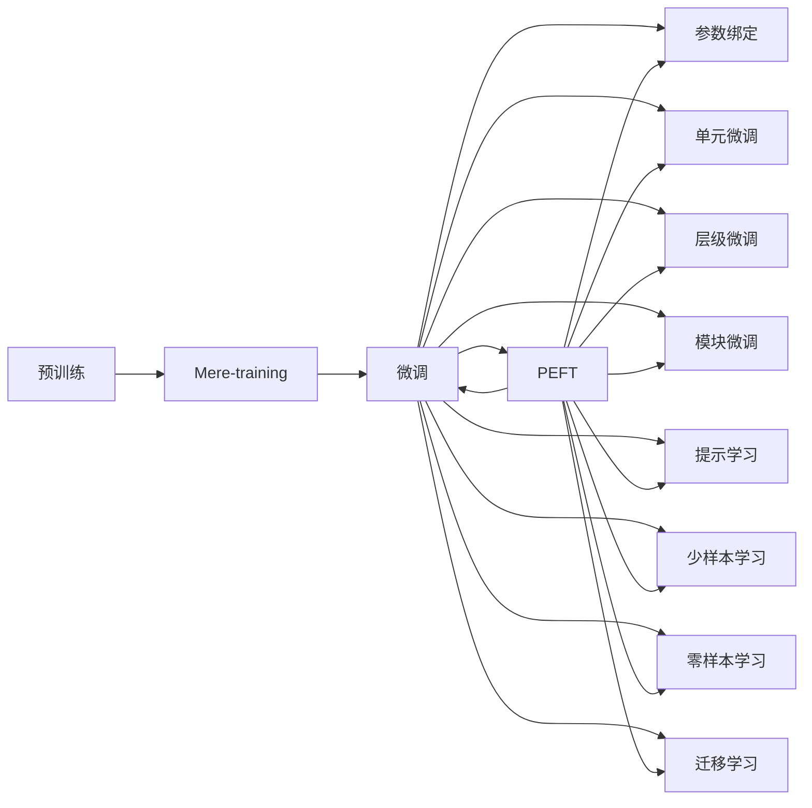

                 

# PEFT技术：高效微调大型语言模型

> 关键词：参数高效微调(PEFT), 大型语言模型, 微调(Fine-tuning), 迁移学习, 预训练, Transformer, 自然语言处理(NLP)

## 1. 背景介绍

在深度学习的浪潮中，大型语言模型（Large Language Models, LLMs）如BERT、GPT-3等，因其强大的语言理解和生成能力，已广泛应用于自然语言处理（Natural Language Processing, NLP）领域，包括文本分类、问答系统、机器翻译、对话系统等。然而，这些预训练语言模型参数量巨大，计算资源需求高，限制了其在某些特定领域的应用。参数高效微调(Parameter-Efficient Fine-Tuning, PEFT)技术应运而生，通过只更新模型中与特定任务相关的少量参数，在不增加模型整体参数量的情况下，提高模型的微调效率和性能，进一步拓展了预训练语言模型在各种场景下的应用能力。

### 1.1 问题由来

大型语言模型（LLMs）通常通过在庞大的无标签文本数据上进行自监督预训练，学习到通用的语言表示。尽管这些模型在通用领域表现优异，但在特定领域的应用往往难以满足实际需求。原因在于：
- 预训练模型一般包含数亿个参数，训练和推理成本高昂。
- 预训练过程中学习到的通用语言知识与特定领域任务可能存在较大差异，难以直接应用于下游任务。
- 下游任务的标注数据往往稀缺且昂贵，无法支撑全参数微调。

为了解决上述问题，PEFT技术应运而生。PEFT通过仅更新少量任务相关的参数，极大降低了微调过程中的计算资源消耗，同时保留了预训练模型的广泛语言知识，使模型能够更好地适应特定任务。

### 1.2 问题核心关键点

PEFT的核心思想是利用预训练语言模型的高质量语言表示，通过微调顶层或特定层来适应下游任务，避免过拟合，同时减少微调对标注数据和计算资源的依赖。PEFT方法主要包括以下几种形式：
- **层级微调**：只微调模型顶层，如分类器或解码器，避免更新底层参数，保留预训练的知识。
- **单元微调**：只微调模型中的特定神经网络单元，如注意力机制、线性层等，保留大多数预训练参数。
- **模块微调**：只微调模型中的特定模块，如自编码器、自回归解码器等，灵活调整模型结构。
- **参数绑定**：通过绑定或解冻特定层的参数，灵活选择微调或固定参数，控制微调程度。

这些微调方法结合使用，可以进一步提升模型在特定任务上的性能，同时保持预训练模型的广泛知识。

### 1.3 问题研究意义

PEFT技术在提高模型微调效率的同时，降低了微调对标注数据和计算资源的依赖，具有重要研究价值：
- 降低应用开发成本。PEFT技术显著减少了从头开发所需的成本，特别是在标注数据稀缺的领域。
- 提升模型效果。PEFT技术可以更灵活地调整模型参数，提高模型在特定任务上的表现。
- 加速开发进度。利用PEFT技术，开发者可以快速适应新任务，缩短开发周期。
- 带来技术创新。PEFT技术促进了对预训练-微调的深入研究，催生了新的研究方向。
- 赋能产业升级。PEFT技术使得NLP技术更容易被各行各业所采用，推动了数字化转型升级。

## 2. 核心概念与联系

### 2.1 核心概念概述

PEFT技术基于监督学习的大语言模型微调方法，其核心思想是仅在模型顶层或特定层进行微调，保留大多数预训练参数，以提高微调效率和性能。

- **大语言模型（LLMs）**：通过自监督预训练学习通用语言知识的模型，参数量通常以亿计。
- **预训练（Pre-training）**：在无标签数据上进行的自监督学习过程，学习通用语言表示。
- **微调（Fine-tuning）**：通过监督学习优化模型在特定任务上的性能。
- **迁移学习（Transfer Learning）**：将预训练模型的知识迁移到下游任务。
- **参数高效微调（PEFT）**：只更新少量任务相关参数，保留预训练参数。
- **提示学习（Prompt Learning）**：通过精心设计的提示模板，引导模型进行特定任务推理。
- **少样本学习（Few-shot Learning）**：仅在少量标注样本上进行微调，无需更新模型参数。
- **零样本学习（Zero-shot Learning）**：在未见过的任务描述下，模型能够执行新任务。

这些概念通过PEFT技术的结合应用，使得大型语言模型能够在特定任务上表现出卓越的性能。

### 2.2 核心概念联系

大语言模型微调是一个从预训练到微调的过程，通过迁移学习实现任务的适配。PEFT技术在此基础上，进一步优化了微调过程，使其更加高效和灵活。

以下是一个简单的Mermaid流程图，展示了大语言模型预训练、微调及PEFT技术的应用：



该图展示了从预训练到微调，再到PEFT技术的全过程。每个节点表示一个关键步骤，箭头表示数据流或流程。PEFT技术通过绑定、解冻特定层或单元，实现任务适配，同时保留预训练模型的广泛知识。

## 3. 核心算法原理 & 具体操作步骤

### 3.1 算法原理概述

PEFT技术是一种参数高效微调方法，其核心在于保留预训练模型的通用语言知识，仅更新与特定任务相关的少量参数，以提高微调效率和性能。PEFT技术主要包括以下几种形式：

- **层级微调**：只微调模型顶层，如分类器或解码器，保留预训练的知识。
- **单元微调**：只微调模型中的特定神经网络单元，如注意力机制、线性层等，保留大多数预训练参数。
- **模块微调**：只微调模型中的特定模块，如自编码器、自回归解码器等，灵活调整模型结构。
- **参数绑定**：通过绑定或解冻特定层的参数，灵活选择微调或固定参数，控制微调程度。

### 3.2 算法步骤详解

PEFT技术的应用步骤主要包括：

**Step 1: 准备预训练模型和数据集**
- 选择合适的预训练语言模型，如BERT、GPT-3等。
- 准备下游任务的数据集，划分为训练集、验证集和测试集。

**Step 2: 设计任务适配层**
- 根据任务类型，设计合适的输出层和损失函数。
- 对于分类任务，通常添加线性分类器和交叉熵损失函数。
- 对于生成任务，通常使用语言模型的解码器输出概率分布，并以负对数似然为损失函数。

**Step 3: 设置微调超参数**
- 选择合适的优化算法及其参数，如AdamW、SGD等，设置学习率、批大小、迭代轮数等。
- 设置正则化技术及强度，包括权重衰减、Dropout、Early Stopping等。
- 确定解冻预训练参数的策略，如仅微调顶层，或全部参数都参与微调。

**Step 4: 执行梯度训练**
- 将训练集数据分批次输入模型，前向传播计算损失函数。
- 反向传播计算参数梯度，根据设定的优化算法和学习率更新模型参数。
- 周期性在验证集上评估模型性能，根据性能指标决定是否触发Early Stopping。
- 重复上述步骤直到满足预设的迭代轮数或Early Stopping条件。

**Step 5: 测试和部署**
- 在测试集上评估微调后模型，对比微调前后的精度提升。
- 使用微调后的模型对新样本进行推理预测，集成到实际的应用系统中。

### 3.3 算法优缺点

PEFT技术的主要优点包括：
1. **降低计算资源消耗**：仅更新少量任务相关参数，保留预训练参数，显著降低计算资源需求。
2. **提高微调效率**：通过灵活的微调策略，提升模型在特定任务上的性能，缩短开发周期。
3. **避免过拟合**：保留预训练模型的广泛知识，减少对标注数据的需求，避免过拟合。
4. **应用广泛**：适用于各类NLP任务，如文本分类、问答系统、机器翻译等。

PEFT技术的局限性主要包括：
1. **可能影响泛化性能**：仅更新少量参数可能导致模型在特定任务上表现优异，但在其他任务上泛化性能较差。
2. **微调策略选择复杂**：需要根据具体任务选择合适的微调策略，参数绑定、解冻策略复杂。
3. **模型维护困难**：保留大量预训练参数，微调后的模型结构复杂，维护困难。

### 3.4 算法应用领域

PEFT技术广泛应用于NLP领域，具体应用场景包括：

- **问答系统**：在问答数据集上进行微调，优化模型对问题的理解能力和答案生成。
- **文本分类**：在分类数据集上进行微调，提升模型对文本的分类准确率。
- **机器翻译**：在翻译数据集上进行微调，提升模型翻译质量和速度。
- **对话系统**：在对话数据集上进行微调，优化模型对对话语境的理解和回复生成。
- **信息检索**：在检索数据集上进行微调，优化模型对查询的匹配和排序能力。
- **命名实体识别**：在命名实体标注数据集上进行微调，提升模型对实体边界的识别能力。

## 4. 数学模型和公式 & 详细讲解  
### 4.1 数学模型构建

PEFT技术的数学模型构建基于监督学习框架，假设预训练模型为 $M_{\theta}$，其中 $\theta$ 为预训练得到的模型参数。下游任务为 $T$，训练集为 $D=\{(x_i,y_i)\}_{i=1}^N$，其中 $x_i$ 为输入样本，$y_i$ 为标签。PEFT技术通过保留预训练模型中与任务无关的参数，仅更新与任务相关的参数 $\hat{\theta}$，实现高效的微调。

定义模型在数据样本 $(x,y)$ 上的损失函数为 $\ell(M_{\hat{\theta}}(x),y)$，则在数据集 $D$ 上的经验风险为：

$$
\mathcal{L}(\hat{\theta}) = \frac{1}{N} \sum_{i=1}^N \ell(M_{\hat{\theta}}(x_i),y_i)
$$

PEFT技术的优化目标是最小化经验风险，即找到最优参数：

$$
\hat{\theta}=\mathop{\arg\min}_{\theta} \mathcal{L}(\hat{\theta})
$$

在实践中，我们通常使用基于梯度的优化算法（如SGD、Adam等）来近似求解上述最优化问题。设 $\eta$ 为学习率，$\lambda$ 为正则化系数，则参数的更新公式为：

$$
\theta \leftarrow \theta - \eta \nabla_{\theta}\mathcal{L}(\hat{\theta}) - \eta\lambda\theta
$$

其中 $\nabla_{\theta}\mathcal{L}(\hat{\theta})$ 为损失函数对参数 $\hat{\theta}$ 的梯度，可通过反向传播算法高效计算。

### 4.2 公式推导过程

以下我们以二分类任务为例，推导PEFT技术的交叉熵损失函数及其梯度的计算公式。

假设模型 $M_{\theta}$ 在输入 $x$ 上的输出为 $\hat{y}=M_{\hat{\theta}}(x) \in [0,1]$，表示样本属于正类的概率。真实标签 $y \in \{0,1\}$。则二分类交叉熵损失函数定义为：

$$
\ell(M_{\hat{\theta}}(x),y) = -[y\log \hat{y} + (1-y)\log (1-\hat{y})]
$$

将其代入经验风险公式，得：

$$
\mathcal{L}(\hat{\theta}) = -\frac{1}{N}\sum_{i=1}^N [y_i\log M_{\hat{\theta}}(x_i)+(1-y_i)\log(1-M_{\hat{\theta}}(x_i))]
$$

根据链式法则，损失函数对参数 $\hat{\theta}$ 的梯度为：

$$
\frac{\partial \mathcal{L}(\hat{\theta})}{\partial \hat{\theta}} = -\frac{1}{N}\sum_{i=1}^N (\frac{y_i}{M_{\hat{\theta}}(x_i)}-\frac{1-y_i}{1-M_{\hat{\theta}}(x_i)}) \frac{\partial M_{\hat{\theta}}(x_i)}{\partial \hat{\theta}}
$$

其中 $\frac{\partial M_{\hat{\theta}}(x_i)}{\partial \hat{\theta}}$ 可进一步递归展开，利用自动微分技术完成计算。

### 4.3 案例分析与讲解

以BERT模型为例，假设有两个神经网络单元 $h_1$ 和 $h_2$，其中 $h_1$ 参与微调，$h_2$ 保留预训练参数。设 $h_1$ 在训练集上的损失函数为 $\ell_1$，$h_2$ 的损失函数为 $\ell_2$，则整体模型的损失函数为 $\ell = \alpha \ell_1 + (1-\alpha)\ell_2$，其中 $\alpha$ 为微调程度。

定义优化算法为 SGD，学习率为 $\eta$，微调过程中，$h_1$ 的参数更新为：

$$
h_1 \leftarrow h_1 - \eta (\frac{\partial \ell_1}{\partial h_1}) - \eta\lambda h_1
$$

而 $h_2$ 的参数保持不变，即：

$$
h_2 \leftarrow h_2
$$

通过调整微调程度 $\alpha$，可以选择不同的微调策略，如完全微调、只微调 $h_1$ 或 $h_2$。

## 5. 项目实践：代码实例和详细解释说明
### 5.1 开发环境搭建

在进行PEFT实践前，我们需要准备好开发环境。以下是使用Python进行PyTorch开发的环境配置流程：

1. 安装Anaconda：从官网下载并安装Anaconda，用于创建独立的Python环境。

2. 创建并激活虚拟环境：
```bash
conda create -n pytorch-env python=3.8 
conda activate pytorch-env
```

3. 安装PyTorch：根据CUDA版本，从官网获取对应的安装命令。例如：
```bash
conda install pytorch torchvision torchaudio cudatoolkit=11.1 -c pytorch -c conda-forge
```

4. 安装Transformers库：
```bash
pip install transformers
```

5. 安装各类工具包：
```bash
pip install numpy pandas scikit-learn matplotlib tqdm jupyter notebook ipython
```

完成上述步骤后，即可在`pytorch-env`环境中开始PEFT实践。

### 5.2 源代码详细实现

这里我们以BERT模型进行二分类任务微调为例，给出使用Transformers库的PyTorch代码实现。

首先，定义二分类任务的数据处理函数：

```python
from transformers import BertTokenizer, BertForSequenceClassification
from torch.utils.data import Dataset
import torch

class TwoClassDataset(Dataset):
    def __init__(self, texts, labels, tokenizer, max_len=128):
        self.texts = texts
        self.labels = labels
        self.tokenizer = tokenizer
        self.max_len = max_len
        
    def __len__(self):
        return len(self.texts)
    
    def __getitem__(self, item):
        text = self.texts[item]
        label = self.labels[item]
        
        encoding = self.tokenizer(text, return_tensors='pt', max_length=self.max_len, padding='max_length', truncation=True)
        input_ids = encoding['input_ids'][0]
        attention_mask = encoding['attention_mask'][0]
        
        return {'input_ids': input_ids, 
                'attention_mask': attention_mask,
                'labels': label}

# 标签与id的映射
label2id = {'0': 0, '1': 1}
id2label = {v: k for k, v in label2id.items()}

# 创建dataset
tokenizer = BertTokenizer.from_pretrained('bert-base-cased')

train_dataset = TwoClassDataset(train_texts, train_labels, tokenizer)
dev_dataset = TwoClassDataset(dev_texts, dev_labels, tokenizer)
test_dataset = TwoClassDataset(test_texts, test_labels, tokenizer)
```

然后，定义模型和优化器：

```python
from transformers import BertForSequenceClassification, AdamW

model = BertForSequenceClassification.from_pretrained('bert-base-cased', num_labels=2)

optimizer = AdamW(model.parameters(), lr=2e-5)
```

接着，定义训练和评估函数：

```python
from torch.utils.data import DataLoader
from tqdm import tqdm
from sklearn.metrics import accuracy_score

device = torch.device('cuda') if torch.cuda.is_available() else torch.device('cpu')
model.to(device)

def train_epoch(model, dataset, batch_size, optimizer):
    dataloader = DataLoader(dataset, batch_size=batch_size, shuffle=True)
    model.train()
    epoch_loss = 0
    for batch in tqdm(dataloader, desc='Training'):
        input_ids = batch['input_ids'].to(device)
        attention_mask = batch['attention_mask'].to(device)
        labels = batch['labels'].to(device)
        model.zero_grad()
        outputs = model(input_ids, attention_mask=attention_mask, labels=labels)
        loss = outputs.loss
        epoch_loss += loss.item()
        loss.backward()
        optimizer.step()
    return epoch_loss / len(dataloader)

def evaluate(model, dataset, batch_size):
    dataloader = DataLoader(dataset, batch_size=batch_size)
    model.eval()
    preds, labels = [], []
    with torch.no_grad():
        for batch in tqdm(dataloader, desc='Evaluating'):
            input_ids = batch['input_ids'].to(device)
            attention_mask = batch['attention_mask'].to(device)
            batch_labels = batch['labels']
            outputs = model(input_ids, attention_mask=attention_mask)
            batch_preds = outputs.logits.argmax(dim=1).to('cpu').tolist()
            batch_labels = batch_labels.to('cpu').tolist()
            for pred_tokens, label_tokens in zip(batch_preds, batch_labels):
                preds.append(pred_tokens)
                labels.append(label_tokens)
                
    print(accuracy_score(labels, preds))
```

最后，启动训练流程并在测试集上评估：

```python
epochs = 5
batch_size = 16

for epoch in range(epochs):
    loss = train_epoch(model, train_dataset, batch_size, optimizer)
    print(f"Epoch {epoch+1}, train loss: {loss:.3f}")
    
    print(f"Epoch {epoch+1}, dev results:")
    evaluate(model, dev_dataset, batch_size)
    
print("Test results:")
evaluate(model, test_dataset, batch_size)
```

以上就是使用PyTorch对BERT进行二分类任务微调的完整代码实现。可以看到，得益于Transformers库的强大封装，我们可以用相对简洁的代码完成BERT模型的加载和微调。

### 5.3 代码解读与分析

让我们再详细解读一下关键代码的实现细节：

**TwoClassDataset类**：
- `__init__`方法：初始化文本、标签、分词器等关键组件。
- `__len__`方法：返回数据集的样本数量。
- `__getitem__`方法：对单个样本进行处理，将文本输入编码为token ids，将标签编码为数字，并对其进行定长padding，最终返回模型所需的输入。

**label2id和id2label字典**：
- 定义了标签与数字id之间的映射关系，用于将预测结果解码回真实的标签。

**训练和评估函数**：
- 使用PyTorch的DataLoader对数据集进行批次化加载，供模型训练和推理使用。
- 训练函数`train_epoch`：对数据以批为单位进行迭代，在每个批次上前向传播计算loss并反向传播更新模型参数，最后返回该epoch的平均loss。
- 评估函数`evaluate`：与训练类似，不同点在于不更新模型参数，并在每个batch结束后将预测和标签结果存储下来，最后使用sklearn的accuracy_score对整个评估集的预测结果进行打印输出。

**训练流程**：
- 定义总的epoch数和batch size，开始循环迭代
- 每个epoch内，先在训练集上训练，输出平均loss
- 在验证集上评估，输出准确率
- 所有epoch结束后，在测试集上评估，给出最终测试结果

可以看到，PyTorch配合Transformers库使得BERT微调的代码实现变得简洁高效。开发者可以将更多精力放在数据处理、模型改进等高层逻辑上，而不必过多关注底层的实现细节。

当然，工业级的系统实现还需考虑更多因素，如模型的保存和部署、超参数的自动搜索、更灵活的任务适配层等。但核心的PEFT范式基本与此类似。

## 6. 实际应用场景
### 6.1 智能客服系统

基于PEFT技术的对话技术，可以广泛应用于智能客服系统的构建。传统客服往往需要配备大量人力，高峰期响应缓慢，且一致性和专业性难以保证。而使用PEFT微调后的对话模型，可以7x24小时不间断服务，快速响应客户咨询，用自然流畅的语言解答各类常见问题。

在技术实现上，可以收集企业内部的历史客服对话记录，将问题和最佳答复构建成监督数据，在此基础上对预训练对话模型进行微调。PEFT微调后的对话模型能够自动理解用户意图，匹配最合适的答案模板进行回复。对于客户提出的新问题，还可以接入检索系统实时搜索相关内容，动态组织生成回答。如此构建的智能客服系统，能大幅提升客户咨询体验和问题解决效率。

### 6.2 金融舆情监测

金融机构需要实时监测市场舆论动向，以便及时应对负面信息传播，规避金融风险。传统的人工监测方式成本高、效率低，难以应对网络时代海量信息爆发的挑战。基于PEFT技术的文本分类和情感分析技术，为金融舆情监测提供了新的解决方案。

具体而言，可以收集金融领域相关的新闻、报道、评论等文本数据，并对其进行主题标注和情感标注。在此基础上对预训练语言模型进行微调，使其能够自动判断文本属于何种主题，情感倾向是正面、中性还是负面。将PEFT微调后的模型应用到实时抓取的网络文本数据，就能够自动监测不同主题下的情感变化趋势，一旦发现负面信息激增等异常情况，系统便会自动预警，帮助金融机构快速应对潜在风险。

### 6.3 个性化推荐系统

当前的推荐系统往往只依赖用户的历史行为数据进行物品推荐，无法深入理解用户的真实兴趣偏好。基于PEFT技术的个性化推荐系统可以更好地挖掘用户行为背后的语义信息，从而提供更精准、多样的推荐内容。

在实践中，可以收集用户浏览、点击、评论、分享等行为数据，提取和用户交互的物品标题、描述、标签等文本内容。将文本内容作为模型输入，用户的后续行为（如是否点击、购买等）作为监督信号，在此基础上微调预训练语言模型。PEFT微调后的模型能够从文本内容中准确把握用户的兴趣点。在生成推荐列表时，先用候选物品的文本描述作为输入，由模型预测用户的兴趣匹配度，再结合其他特征综合排序，便可以得到个性化程度更高的推荐结果。

### 6.4 未来应用展望

随着PEFT技术的不断发展，其在更多领域的应用前景将进一步拓展。

在智慧医疗领域，基于PEFT的医疗问答、病历分析、药物研发等应用将提升医疗服务的智能化水平，辅助医生诊疗，加速新药开发进程。

在智能教育领域，PEFT技术可应用于作业批改、学情分析、知识推荐等方面，因材施教，促进教育公平，提高教学质量。

在智慧城市治理中，PEFT模型可应用于城市事件监测、舆情分析、应急指挥等环节，提高城市管理的自动化和智能化水平，构建更安全、高效的未来城市。

此外，在企业生产、社会治理、文娱传媒等众多领域，基于PEFT技术的AI应用也将不断涌现，为经济社会发展注入新的动力。相信随着技术的日益成熟，PEFT方法将成为AI落地应用的重要范式，推动AI技术向更广阔的领域加速渗透。

## 7. 工具和资源推荐
### 7.1 学习资源推荐

为了帮助开发者系统掌握PEFT理论基础和实践技巧，这里推荐一些优质的学习资源：

1. 《Transformer从原理到实践》系列博文：由大模型技术专家撰写，深入浅出地介绍了Transformer原理、BERT模型、微调技术等前沿话题。

2. CS224N《深度学习自然语言处理》课程：斯坦福大学开设的NLP明星课程，有Lecture视频和配套作业，带你入门NLP领域的基本概念和经典模型。

3. 《Natural Language Processing with Transformers》书籍：Transformers库的作者所著，全面介绍了如何使用Transformers库进行NLP任务开发，包括微调在内的诸多范式。

4. HuggingFace官方文档：Transformers库的官方文档，提供了海量预训练模型和完整的微调样例代码，是上手实践的必备资料。

5. CLUE开源项目：中文语言理解测评基准，涵盖大量不同类型的中文NLP数据集，并提供了基于PEFT的baseline模型，助力中文NLP技术发展。

通过对这些资源的学习实践，相信你一定能够快速掌握PEFT技术的精髓，并用于解决实际的NLP问题。
###  7.2 开发工具推荐

高效的开发离不开优秀的工具支持。以下是几款用于PEFT开发的常用工具：

1. PyTorch：基于Python的开源深度学习框架，灵活动态的计算图，适合快速迭代研究。大部分预训练语言模型都有PyTorch版本的实现。

2. TensorFlow：由Google主导开发的开源深度学习框架，生产部署方便，适合大规模工程应用。同样有丰富的预训练语言模型资源。

3. Transformers库：HuggingFace开发的NLP工具库，集成了众多SOTA语言模型，支持PyTorch和TensorFlow，是进行PEFT任务开发的利器。

4. Weights & Biases：模型训练的实验跟踪工具，可以记录和可视化模型训练过程中的各项指标，方便对比和调优。与主流深度学习框架无缝集成。

5. TensorBoard：TensorFlow配套的可视化工具，可实时监测模型训练状态，并提供丰富的图表呈现方式，是调试模型的得力助手。

6. Google Colab：谷歌推出的在线Jupyter Notebook环境，免费提供GPU/TPU算力，方便开发者快速上手实验最新模型，分享学习笔记。

合理利用这些工具，可以显著提升PEFT微调任务的开发效率，加快创新迭代的步伐。

### 7.3 相关论文推荐

PEFT技术的发展源于学界的持续研究。以下是几篇奠基性的相关论文，推荐阅读：

1. Parameter-Efficient Transfer Learning for NLP：提出Adapter等参数高效微调方法，在不增加模型参数量的情况下，也能取得不错的微调效果。

2. Dual Adapter: Adaptive Layer-wise Regularization for Parameter-Efficient Fine-Tuning: 结合Dual Adapter技术，实现更加高效的微调，同时保留预训练模型的广泛知识。

3. LoRA: Low-Rank Adaptation of Pre-trained Language Models: 提出LoRA方法，通过低秩分解实现参数高效的微调，适用于大规模预训练语言模型。

4. Fine-tuning BERT in Domain-Specific Tasks with Mostly Zero-shot or Few-shot Learning: 研究如何利用零样本或少样本学习，在几乎没有标注数据的情况下进行微调。

5. Prompt-Powered Few-shot Learning of Language Models: 引入提示技术，在不更新模型参数的情况下，利用提示模板进行微调，适用于少样本学习场景。

6. Reformer: The Efficient Transformer: 提出Reformer模型，通过特殊的注意力机制实现参数高效，适用于大规模语言模型的微调。

这些论文代表了大模型微调技术的发展脉络。通过学习这些前沿成果，可以帮助研究者把握学科前进方向，激发更多的创新灵感。

## 8. 总结：未来发展趋势与挑战

### 8.1 总结

本文对基于监督学习的大语言模型微调方法中的参数高效微调（PEFT）技术进行了全面系统的介绍。首先阐述了PEFT技术的背景和重要性，明确了其微调效率高、资源消耗低的特点。其次，从原理到实践，详细讲解了PEFT技术的数学原理和关键步骤，给出了PEFT任务开发的完整代码实例。同时，本文还广泛探讨了PEFT方法在智能客服、金融舆情、个性化推荐等多个行业领域的应用前景，展示了PEFT范式的巨大潜力。此外，本文精选了PEFT技术的各类学习资源，力求为读者提供全方位的技术指引。

通过本文的系统梳理，可以看到，PEFT技术在提高模型微调效率的同时，降低了微调对标注数据和计算资源的依赖，具有重要的研究价值。PEFT技术结合大语言模型的优势，显著提升了模型在特定任务上的性能，加速了NLP技术的应用进程。未来，随着PEFT技术的不断演进，其在更多领域的应用前景将进一步拓展，为AI技术的产业化提供更坚实的基础。

### 8.2 未来发展趋势

展望未来，PEFT技术将呈现以下几个发展趋势：

1. **微调策略多样化**：除了传统的层级微调，未来的PEFT技术将结合更多高效的微调策略，如Dual Adapter、LoRA等，实现更灵活的微调。

2. **模型结构和参数更灵活**：未来的PEFT技术将进一步优化模型结构，通过参数绑定、解冻策略等手段，实现更高效的微调。

3. **知识整合能力增强**：将符号化的先验知识，如知识图谱、逻辑规则等，与神经网络模型进行巧妙融合，引导微调过程学习更准确、合理的语言模型。

4. **多模态微调崛起**：未来的PEFT技术将拓展到图像、视频、语音等多模态数据的微调，实现视觉、语音、文本信息的一体化建模。

5. **持续学习成为常态**：随着数据分布的不断变化，PEFT模型也需要持续学习新知识以保持性能。如何在不遗忘原有知识的同时，高效吸收新样本信息，将是重要的研究课题。

6. **多任务微调技术发展**：未来的PEFT技术将研究多任务微调技术，通过联合训练多个任务，实现任务间的知识共享和迁移。

7. **跨领域微调技术发展**：未来的PEFT技术将探索跨领域微调方法，提升模型在不同领域的泛化性能和迁移能力。

8. **更强的可解释性和可控性**：未来的PEFT技术将进一步研究模型的可解释性和可控性，确保模型输出符合人类价值观和伦理道德。

以上趋势凸显了PEFT技术的广阔前景。这些方向的探索发展，必将进一步提升PEFT技术的微调效率和性能，推动NLP技术的广泛应用。

### 8.3 面临的挑战

尽管PEFT技术已经取得了显著进展，但在迈向更加智能化、普适化应用的过程中，仍面临诸多挑战：

1. **模型鲁棒性不足**：当前PEFT模型面对域外数据时，泛化性能往往大打折扣。对于测试样本的微小扰动，PEFT模型的预测也容易发生波动。如何提高PEFT模型的鲁棒性，避免灾难性遗忘，还需要更多理论和实践的积累。

2. **可解释性不足**：PEFT模型通常难以解释其内部工作机制和决策逻辑，对于医疗、金融等高风险应用，算法的可解释性和可审计性尤为重要。如何赋予PEFT模型更强的可解释性，将是亟待攻克的难题。

3. **资源优化有待提高**：大规模语言模型的计算资源需求高，推理速度慢，内存占用大。如何在保持性能的同时，优化资源消耗，提升推理速度，是PEFT技术面临的重要挑战。

4. **知识整合能力不足**：现有的PEFT模型往往局限于任务内数据，难以灵活吸收和运用更广泛的先验知识。如何让PEFT过程更好地与外部知识库、规则库等专家知识结合，形成更加全面、准确的信息整合能力，还有很大的想象空间。

5. **公平性问题**：PEFT模型在特定领域的微调过程中，可能引入偏见，导致输出不公。如何设计公平性的约束和评估指标，确保模型输出的公正性，将是重要的研究方向。

6. **安全性和隐私保护**：PEFT模型在实际应用中，可能涉及敏感信息，如医疗记录、金融数据等。如何确保模型训练和推理过程中的数据安全，防止信息泄露，是PEFT技术需要解决的关键问题。

7. **模型的可维护性和可扩展性**：PEFT模型结构复杂，维护困难。如何在保持灵活性的同时，提高模型的可维护性和可扩展性，是PEFT技术未来的重要课题。

8. **知识迁移能力不足**：PEFT模型在不同领域之间的迁移能力有限，无法灵活应对新的应用场景。如何提升模型的跨领域迁移能力，实现知识共享，是PEFT技术需要解决的重要问题。

这些挑战虽然严峻，但也是PEFT技术进一步发展和完善的动力。未来，通过跨学科的合作和不断的技术创新，相信PEFT技术将克服这些挑战，成为AI技术应用的重要支撑。

### 8.4 研究展望

面对PEFT技术面临的挑战，未来的研究需要在以下几个方面寻求新的突破：

1. **多任务联合微调技术**：研究多任务联合微调方法，通过联合训练多个任务，实现任务间的知识共享和迁移。

2. **跨领域微调技术**：探索跨领域微调方法，提升模型在不同领域的泛化性能和迁移能力。

3. **参数高效微调方法**：开发更加参数高效的微调方法，如Fine-tune Algorithms, Prompt Tuning等，在固定大部分预训练参数的同时，只更新极少量的任务相关参数。

4. **知识整合与跨模态融合**：结合符号化的先验知识，如知识图谱、逻辑规则等，与神经网络模型进行巧妙融合，引导PEFT过程学习更准确、合理的语言模型。同时加强不同模态数据的整合，实现视觉、语音等多模态信息与文本信息的协同建模。

5. **因果推断与因果学习**：引入因果推断和因果学习思想，增强PEFT模型建立稳定因果关系的能力，学习更加普适、鲁棒的语言表征，从而提升模型泛化性和抗干扰能力。

6. **可解释性与可控性**：通过因果分析方法，识别出模型决策的关键特征，增强输出解释的因果性和逻辑性。借助博弈论工具，主动探索并规避模型的脆弱点，提高系统稳定性。

7. **公平性约束与评估**：设计公平性的约束和评估指标，确保模型输出的公正性，避免引入偏见。

8. **数据安全与隐私保护**：研究数据安全与隐私保护的最新技术，确保模型训练和推理过程中的数据安全，防止信息泄露。

这些研究方向的研究突破，必将推动PEFT技术的进一步成熟和应用，使大语言模型在更多领域展现出强大的智能能力。

## 9. 附录：常见问题与解答

**Q1：PEFT技术与传统的全参数微调有何不同？**

A: PEFT技术通过保留预训练模型的广泛知识，仅更新与特定任务相关的少量参数，以提高微调效率和性能。相比传统的全参数微调，PEFT技术显著降低了计算资源需求，避免了对大量标注数据的依赖，同时保留了预训练模型的语言理解能力。

**Q2：PEFT技术在实际应用中如何选择微调策略？**

A: PEFT技术可以通过参数绑定、解冻策略等手段，灵活选择微调或固定参数，控制微调程度。对于大规模预训练语言模型，通常采用层级微调或单元微调，保留大部分预训练参数，仅更新任务相关的少量参数。对于小规模预训练模型，如BERT-base，可以考虑全参数微调。

**Q3：PEFT技术在微调过程中如何避免过拟合？**

A: PEFT技术通过保留预训练模型的广泛知识，减少了对标注数据的需求，同时应用正则化技术、数据增强等手段，避免了过拟合。例如，使用L2正则、Dropout、Early Stopping等正则化技术，以及数据增强、对抗训练等方法。

**Q4：PEFT技术在实际应用中如何提高模型的鲁棒性？**

A: PEFT技术可以通过对抗训练、数据增强等手段，提高模型的鲁棒性。对抗训练通过引入对抗样本，增强模型对噪声和扰动的鲁棒性；数据增强通过扩充训练集，提高模型的泛化能力。

**Q5：PEFT技术在实际应用中如何优化资源消耗？**

A: PEFT技术可以通过参数绑定、解冻策略等手段，灵活调整模型结构，减少计算资源消耗。例如，对于大规模预训练语言模型，可以采用LoRA、Dual Adapter等方法，减少前向传播和反向传播的资源消耗。同时，合理选择微调策略，优化模型结构，提升推理速度。

这些回答帮助理解PEFT技术的核心思想和实际应用，展示了其在特定任务上的优势和应用前景。相信通过深入学习和实践，PEFT技术将为更多NLP应用提供高效、灵活的解决方案。

---

作者：禅与计算机程序设计艺术 / Zen and the Art of Computer Programming

