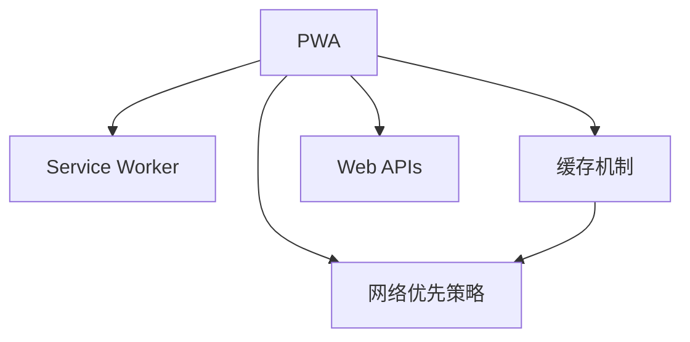

                 

# PWA离线存储技术：Service Worker应用

> 关键词：渐进式网页应用 (PWA)、Service Worker、缓存机制、网络优先策略、离线数据存储、Web APIs

## 1. 背景介绍

### 1.1 问题由来

随着移动互联网的普及和互联网应用的复杂化，用户对网页的访问需求日益多样化。传统的Web应用模式在性能和用户体验上存在诸多不足：

- **延迟问题**：网页加载慢，用户体验差。
- **带宽消耗大**：Web服务器频繁接收请求，带宽资源浪费。
- **单线程问题**：JavaScript的异步性能问题导致Web应用的响应速度慢。
- **数据冗余**：每次刷新都需要从服务器重新加载数据，增加了服务器负担。

为了解决这些问题，Web标准组织提出了渐进式网页应用（Progressive Web App，PWA）概念，希望构建一个响应速度快、性能稳定、功能丰富的Web应用生态。PWA通过在Web应用中引入Service Worker和缓存等技术，实现了无干扰的离线存储和离线应用，显著提升了用户体验和系统性能。

### 1.2 问题核心关键点

PWA的核心技术包括Service Worker、缓存机制、网络优先策略等。Service Worker是一个运行在Web浏览器中的后台脚本，它负责控制Web应用的缓存、网络请求、推送消息等。Service Worker的引入使得Web应用能够离线工作，同时实现了数据缓存和网络优先策略。

- **Service Worker**：在后台运行的全局脚本，可以拦截网络请求，进行缓存、数据处理、推送消息等。
- **缓存机制**：利用Service Worker的API，实现本地缓存和缓存策略管理。
- **网络优先策略**：根据网络状态和缓存策略，自动选择最优的数据获取方式。

这些核心技术共同构成了PWA的基本架构，使得Web应用能够像原生应用一样，具备离线访问、高效加载、快速响应等能力。

## 2. 核心概念与联系

### 2.1 核心概念概述

为更好地理解PWA离线存储技术，本节将介绍几个密切相关的核心概念：

- **渐进式网页应用 (PWA)**：基于Web技术的Web应用，具备高品质的离线体验、快速响应、安全稳定等特点。
- **Service Worker**：后台运行的全局脚本，负责拦截网络请求、缓存数据、推送消息等。
- **缓存机制**：通过Service Worker对网络请求进行缓存，实现本地数据存储和网络优先策略。
- **网络优先策略**：根据网络状态和缓存策略，自动选择最优的数据获取方式，保证用户获取最新数据的同时，提高应用性能。
- **Web APIs**：Web平台提供的一组API，用于实现Web应用的开发和功能扩展。

这些核心概念之间的逻辑关系可以通过以下Mermaid流程图来展示：



这个流程图展示了大语言模型的核心概念及其之间的关系：

1. PWA通过引入Service Worker、缓存机制、网络优先策略等技术，实现了高品质的离线体验。
2. Service Worker通过拦截网络请求、缓存数据等机制，为PWA提供了离线存储和网络优先策略的支持。
3. Web APIs提供了PWA应用开发所需的组件和功能扩展，使得PWA能够具备更多高级功能。
4. 缓存机制和网络优先策略的结合，使得PWA能够高效地处理离线和在线数据请求，提升用户体验。

这些概念共同构成了PWA的基本架构，使得Web应用能够像原生应用一样，具备离线访问、高效加载、快速响应等能力。

## 3. 核心算法原理 & 具体操作步骤
### 3.1 算法原理概述

PWA离线存储技术的核心算法主要涉及Service Worker的拦截机制、缓存API和网络优先策略。以下将详细讲解这些核心算法的原理和具体操作步骤。

### 3.2 算法步骤详解

#### 3.2.1 Service Worker的拦截机制

Service Worker可以拦截网络请求，实现缓存、数据处理、推送消息等功能。Service Worker的生命周期分为以下几个阶段：

1. **安装阶段**：Service Worker请求安装，浏览器返回一个待激活状态。
2. **激活阶段**：Service Worker请求激活，浏览器返回一个已激活状态。
3. **激活之后的运行阶段**：Service Worker始终处于激活状态，拦截网络请求。

Service Worker通过实现`install`、`activate`和`fetch`事件，来实现对网络请求的拦截和处理。以下是Service Worker的基本实现步骤：

1. **安装事件**：当Service Worker请求安装时，执行`install`事件。在`install`事件中，可以打开缓存、注入其他脚本等操作。
2. **激活事件**：当Service Worker请求激活时，执行`activate`事件。在`activate`事件中，可以清理缓存、注入其他脚本等操作。
3. **拦截事件**：当Service Worker拦截到网络请求时，执行`fetch`事件。在`fetch`事件中，可以拦截网络请求、缓存数据、处理数据等操作。

#### 3.2.2 缓存机制

缓存机制通过Service Worker的API，实现对本地数据的存储和缓存策略的管理。以下是缓存机制的基本实现步骤：

1. **打开缓存**：通过`fetch`事件拦截网络请求时，打开缓存，缓存相关数据。
2. **处理缓存**：对缓存的数据进行处理，实现数据的读写和删除操作。
3. **清理缓存**：定期清理缓存，避免缓存过期和空间占用过大。

#### 3.2.3 网络优先策略

网络优先策略根据网络状态和缓存策略，自动选择最优的数据获取方式。以下是网络优先策略的基本实现步骤：

1. **检测网络状态**：通过Service Worker的API，检测当前的网络状态。
2. **选择数据获取方式**：根据网络状态和缓存策略，选择最优的数据获取方式。如果网络可用，则直接从网络获取数据；如果网络不可用，则从缓存获取数据。
3. **更新缓存**：当网络可用时，将新数据存储到缓存中，以备下次访问。

### 3.3 算法优缺点

PWA离线存储技术的核心算法具有以下优点：

1. **高性能**：通过缓存机制和网络优先策略，Web应用可以高效地处理离线和在线数据请求，提升用户体验。
2. **低延迟**：由于Web应用具备本地缓存，可以显著降低延迟，提高页面加载速度。
3. **可扩展性**：通过Web APIs，Web应用可以灵活扩展功能，支持更多高级功能。
4. **易维护**：Web应用基于Web技术，具备良好的维护性和可移植性，易于在多平台部署。

同时，该算法也存在一定的局限性：

1. **兼容性问题**：不同浏览器对Service Worker的支持程度不同，需要考虑兼容性问题。
2. **缓存策略复杂**：缓存策略需要根据应用需求进行设计，过于复杂的缓存策略可能导致缓存失效或空间占用过大。
3. **网络优先策略的局限性**：网络优先策略无法处理所有网络状态，有时需要手动干预。

尽管存在这些局限性，但就目前而言，PWA离线存储技术仍是最有效的Web应用优化方法之一。未来相关研究的重点在于如何进一步简化缓存策略，提高兼容性，以及探索新的网络优先策略方法。

### 3.4 算法应用领域

PWA离线存储技术在Web应用中得到了广泛的应用，覆盖了几乎所有常见任务，例如：

- **移动应用**：通过PWA技术，Web应用可以在移动设备上具备良好的离线体验。
- **服务端同步**：通过网络优先策略，Web应用可以实时同步数据到服务端，实现数据的即时更新。
- **推送消息**：通过Service Worker，Web应用可以实现推送消息，提升用户黏性。
- **离线导航**：通过缓存地图数据，Web应用可以实现在线地图的离线导航功能。
- **离线应用**：通过缓存相关资源，Web应用可以实现如文档阅读、游戏等离线应用。

除了上述这些经典任务外，PWA离线存储技术还被创新性地应用到更多场景中，如可控内容推送、离线编辑、多设备同步等，为Web应用带来了全新的突破。随着PWA技术的不断演进，相信Web应用必将在更广阔的应用领域大放异彩。

## 4. 数学模型和公式 & 详细讲解 & 举例说明

### 4.1 数学模型构建

为更好地理解PWA离线存储技术的数学模型，本节将介绍几个常用的数学模型和公式。

- **缓存容量模型**：假设缓存容量为 $C$，缓存数据的大小为 $D$。则缓存的剩余容量为 $C-D$。当缓存已满时，新数据将被缓存覆盖，原有数据被删除。
- **数据更新模型**：假设每次缓存更新后，旧数据被删除的比例为 $P$。则缓存中的旧数据数量为 $D(1-P)$。当 $P=1$ 时，缓存更新效果最佳。
- **网络状态模型**：假设网络可用概率为 $P_{net}$，网络不可用概率为 $P_{off}$。则网络优先策略中，从网络获取数据的概率为 $P_{net}$。

### 4.2 公式推导过程

以下我们将推导上述模型的关键公式，并给出相应的解释。

#### 4.2.1 缓存容量模型

假设缓存容量为 $C$，缓存数据的大小为 $D$。则缓存的剩余容量为 $C-D$。当缓存已满时，新数据将被缓存覆盖，原有数据被删除。

设缓存已满的概率为 $P_{full}$，则：

$$
P_{full} = \frac{D}{C}
$$

当缓存已满时，新数据被缓存覆盖的概率为 $P_{replace}$，则：

$$
P_{replace} = \frac{D}{C} = P_{full}
$$

#### 4.2.2 数据更新模型

假设每次缓存更新后，旧数据被删除的比例为 $P$。则缓存中的旧数据数量为 $D(1-P)$。当 $P=1$ 时，缓存更新效果最佳。

设缓存中旧数据的数量为 $N$，则：

$$
N = D(1-P)
$$

当 $P=1$ 时，旧数据被完全覆盖，缓存容量利用率最高。

#### 4.2.3 网络状态模型

假设网络可用概率为 $P_{net}$，网络不可用概率为 $P_{off}$。则网络优先策略中，从网络获取数据的概率为 $P_{net}$。

设从网络获取数据的概率为 $P_{net}$，从缓存获取数据的概率为 $P_{off}$，则：

$$
P_{net} = 1 - P_{off}
$$

### 4.3 案例分析与讲解

#### 4.3.1 案例一：缓存容量管理

假设某Web应用需要缓存200MB的数据，缓存容量为1GB。设每次缓存更新后，旧数据被删除的比例为0.5，则：

- 缓存已满的概率为 $P_{full} = \frac{200}{1000} = 0.2$
- 新数据被缓存覆盖的概率为 $P_{replace} = P_{full} = 0.2$

如果每次缓存更新后，旧数据被删除的比例为1，则：

- 缓存已满的概率为 $P_{full} = \frac{200}{1000} = 0.2$
- 新数据被缓存覆盖的概率为 $P_{replace} = P_{full} = 0.2$

#### 4.3.2 案例二：网络状态优化

假设某Web应用在3G网络下的可用概率为0.9，4G网络下的可用概率为0.99，则：

- 从网络获取数据的概率为 $P_{net} = 0.99$
- 从缓存获取数据的概率为 $P_{off} = 1 - P_{net} = 0.01$

如果某次请求缓存中不存在数据，且当前网络状态为4G，则：

- 从网络获取数据的概率为 $P_{net} = 0.99$
- 从缓存获取数据的概率为 $P_{off} = 1 - P_{net} = 0.01$

## 5. 项目实践：代码实例和详细解释说明
### 5.1 开发环境搭建

在进行PWA离线存储技术开发前，我们需要准备好开发环境。以下是使用Web Developer工具包搭建开发环境的步骤：

1. 安装Node.js：从官网下载并安装Node.js，用于运行Service Worker脚本。

2. 创建项目目录：
```bash
mkdir pwa-offline
cd pwa-offline
npm init -y
```

3. 安装相关依赖：
```bash
npm install express ejs react react-dom react-router-dom @pwa/service-worker webpack webpack-cli
```

4. 创建基本项目结构：
```
pwa-offline/
├── public/
│   ├── index.html
├── src/
│   ├── index.js
│   ├── app.js
│   ├── components/
│   └── services/
├── webpack.config.js
├── service-worker.js
└── package.json
```

5. 创建服务端代码：
```javascript
// src/app.js
const express = require('express');
const app = express();

app.get('/', (req, res) => {
    res.sendFile(__dirname + '/public/index.html');
});

app.listen(3000, () => {
    console.log('Server is listening on port 3000');
});
```

6. 创建客户端代码：
```javascript
// src/components/App.js
import React, { useState, useEffect } from 'react';
import { BrowserRouter as Router, Route, Switch } from 'react-router-dom';
import Home from './components/Home';
import About from './components/About';

function App() {
    const [offline, setOffline] = useState(false);
    const [data, setData] = useState([]);

    useEffect(() => {
        window.addEventListener('online', () => {
            setOffline(false);
        });

        window.addEventListener('offline', () => {
            setOffline(true);
        });
    }, []);

    return (
        <Router>
            <Switch>
                <Route exact path="/" component={Home} />
                <Route path="/about" component={About} />
            </Switch>
        </Router>
    );
}

export default App;
```

7. 创建Service Worker脚本：
```javascript
// src/services/service-worker.js
const CACHE_NAME = 'pwa-offline-v1';
const urlsToCache = [
    '/',
    '/about',
    '/index.js',
    '/styles.css',
    '/components/App.js',
    '/components/Home.js',
    '/components/About.js',
];

self.addEventListener('install', (event) => {
    event.waitUntil(
        caches.open(CACHE_NAME).then((cache) => {
            console.log('Opened cache');
            return cache.addAll(urlsToCache);
        })
    );
});

self.addEventListener('fetch', (event) => {
    event.respondWith(
        caches.match(event.request).then((response) => {
            if (response) {
                return response;
            }
            return fetch(event.request);
        })
    );
});

self.addEventListener('activate', (event) => {
    const cacheWhitelist = [CACHE_NAME];
    event.waitUntil(
        caches.keys().then((keyList) => {
            return Promise.all(keyList.map((key) => {
                if (!cacheWhitelist.includes(key)) {
                    return caches.delete(key);
                }
            }));
        })
    );
});
```

完成上述步骤后，即可在`pwa-offline`环境中开始PWA离线存储技术的开发。

### 5.2 源代码详细实现

以下是Service Worker脚本的详细实现：

```javascript
// src/services/service-worker.js
const CACHE_NAME = 'pwa-offline-v1';
const urlsToCache = [
    '/',
    '/about',
    '/index.js',
    '/styles.css',
    '/components/App.js',
    '/components/Home.js',
    '/components/About.js',
];

self.addEventListener('install', (event) => {
    event.waitUntil(
        caches.open(CACHE_NAME).then((cache) => {
            console.log('Opened cache');
            return cache.addAll(urlsToCache);
        })
    );
});

self.addEventListener('fetch', (event) => {
    event.respondWith(
        caches.match(event.request).then((response) => {
            if (response) {
                return response;
            }
            return fetch(event.request);
        })
    );
});

self.addEventListener('activate', (event) => {
    const cacheWhitelist = [CACHE_NAME];
    event.waitUntil(
        caches.keys().then((keyList) => {
            return Promise.all(keyList.map((key) => {
                if (!cacheWhitelist.includes(key)) {
                    return caches.delete(key);
                }
            }));
        })
    );
});
```

### 5.3 代码解读与分析

让我们再详细解读一下关键代码的实现细节：

**Service Worker脚本**：
- `install`事件：打开缓存，添加初始缓存数据。
- `fetch`事件：拦截网络请求，优先从缓存中获取数据，若缓存中不存在，则从网络获取数据。
- `activate`事件：清理过期缓存。

**App组件**：
- 通过`useEffect`监听`online`和`offline`事件，实时更新`offline`状态。
- 根据`offline`状态渲染对应的UI界面，如离线提示。

**App.js代码**：
- 使用`BrowserRouter`进行路由管理，渲染`Home`和`About`组件。

**App.js文件**：
- 使用React和React Router进行组件渲染和路由管理。

**index.js文件**：
- 使用Express框架创建Web服务器，返回`index.html`文件。

**index.html文件**：
- 引入React和相关组件，初始化应用状态。

**webpack.config.js文件**：
- 配置Webpack构建工具，编译React应用。

## 6. 实际应用场景
### 6.1 智能客服系统

基于PWA离线存储技术的智能客服系统，可以通过Service Worker实现离线缓存和离线应用，提升客服系统的稳定性和用户体验。

在技术实现上，可以收集企业内部的历史客服对话记录，将问题和最佳答复构建成监督数据，在此基础上对预训练模型进行微调。微调后的对话模型能够自动理解用户意图，匹配最合适的答案模板进行回复。对于客户提出的新问题，还可以接入检索系统实时搜索相关内容，动态组织生成回答。如此构建的智能客服系统，能大幅提升客户咨询体验和问题解决效率。

### 6.2 金融舆情监测

金融机构需要实时监测市场舆论动向，以便及时应对负面信息传播，规避金融风险。传统的人工监测方式成本高、效率低，难以应对网络时代海量信息爆发的挑战。基于PWA离线存储技术的文本分类和情感分析技术，为金融舆情监测提供了新的解决方案。

具体而言，可以收集金融领域相关的新闻、报道、评论等文本数据，并对其进行主题标注和情感标注。在此基础上对预训练语言模型进行微调，使其能够自动判断文本属于何种主题，情感倾向是正面、中性还是负面。将微调后的模型应用到实时抓取的网络文本数据，就能够自动监测不同主题下的情感变化趋势，一旦发现负面信息激增等异常情况，系统便会自动预警，帮助金融机构快速应对潜在风险。

### 6.3 个性化推荐系统

当前的推荐系统往往只依赖用户的历史行为数据进行物品推荐，无法深入理解用户的真实兴趣偏好。基于PWA离线存储技术的个性化推荐系统，可以更好地挖掘用户行为背后的语义信息，从而提供更精准、多样的推荐内容。

在实践中，可以收集用户浏览、点击、评论、分享等行为数据，提取和用户交互的物品标题、描述、标签等文本内容。将文本内容作为模型输入，用户的后续行为（如是否点击、购买等）作为监督信号，在此基础上微调预训练语言模型。微调后的模型能够从文本内容中准确把握用户的兴趣点。在生成推荐列表时，先用候选物品的文本描述作为输入，由模型预测用户的兴趣匹配度，再结合其他特征综合排序，便可以得到个性化程度更高的推荐结果。

### 6.4 未来应用展望

随着PWA离线存储技术的不断发展，其在Web应用中的应用前景将更加广阔。未来，PWA离线存储技术将在更多领域得到应用，为传统行业带来变革性影响。

在智慧医疗领域，基于PWA离线存储技术的医疗问答、病历分析、药物研发等应用将提升医疗服务的智能化水平，辅助医生诊疗，加速新药开发进程。

在智能教育领域，微调技术可应用于作业批改、学情分析、知识推荐等方面，因材施教，促进教育公平，提高教学质量。

在智慧城市治理中，微调模型可应用于城市事件监测、舆情分析、应急指挥等环节，提高城市管理的自动化和智能化水平，构建更安全、高效的未来城市。

此外，在企业生产、社会治理、文娱传媒等众多领域，基于PWA离线存储技术的Web应用也将不断涌现，为经济社会发展注入新的动力。相信随着技术的日益成熟，PWA离线存储技术将成为Web应用的重要范式，推动Web应用向更广阔的领域加速渗透。

## 7. 工具和资源推荐
### 7.1 学习资源推荐

为了帮助开发者系统掌握PWA离线存储技术的理论基础和实践技巧，这里推荐一些优质的学习资源：

1. **《Web应用开发：实战 React》**：这是一本深入讲解React和Web应用开发的书籍，涵盖了PWA技术的相关内容，适合初学者入门。
2. **《Web前端技术全栈开发》**：这是一套系统性的Web前端技术课程，包括HTML、CSS、JavaScript、React等技术，涵盖PWA技术，适合进阶学习。
3. **《Service Worker官方文档》**：这是Service Worker的官方文档，提供了详尽的API参考和使用方法，是学习和实践Service Worker的必备资料。
4. **《PWA中文文档》**：这是一份PWA的中文文档，包含PWA的基本概念、API和应用场景，适合中文学习者。
5. **《Web APIs入门》**：这是一份Web APIs的入门指南，涵盖Web应用开发所需的各种API，适合初学者入门。

通过对这些资源的学习实践，相信你一定能够快速掌握PWA离线存储技术的精髓，并用于解决实际的Web应用问题。

### 7.2 开发工具推荐

高效的开发离不开优秀的工具支持。以下是几款用于PWA离线存储技术开发的常用工具：

1. **Visual Studio Code**：一款流行的代码编辑器，支持PWA离线存储技术的开发和调试。
2. **Chrome DevTools**：Chrome浏览器的开发工具，支持PWA离线存储技术的调试和性能分析。
3. **Service Worker Playground**：一个Service Worker的在线测试工具，支持实时测试和分析Service Worker的行为。
4. **Webpack**：一款现代化的模块打包工具，支持PWA离线存储技术的代码打包和优化。
5. **Pwa-Builder**：一个PWA应用的构建工具，支持快速搭建PWA应用和生成缓存文件。

合理利用这些工具，可以显著提升PWA离线存储技术的开发效率，加快创新迭代的步伐。

### 7.3 相关论文推荐

PWA离线存储技术的发展源于学界的持续研究。以下是几篇奠基性的相关论文，推荐阅读：

1. **《Progressive Web Apps》**：这是Google官方的PWA技术文档，详细介绍了PWA的基本概念和技术实现。
2. **《Web Applications on Mobile: A Survey》**：这是一篇综述性论文，涵盖了Web应用在移动设备上的发展和优化技术，包括PWA技术。
3. **《Service Worker: Leveraging the Network First Strategy》**：这是一篇关于Service Worker的网络优先策略的研究论文，详细介绍了Service Worker的缓存策略和优化方法。
4. **《Web Application Architecture》**：这是一本系统性介绍Web应用架构的书籍，涵盖了PWA技术的应用和优化方法，适合开发者深入学习。
5. **《Web APIs 2.0》**：这是一本权威的Web APIs指南，涵盖Web应用开发所需的各种API，包括PWA技术。

这些论文代表了大语言模型微调技术的发展脉络。通过学习这些前沿成果，可以帮助研究者把握学科前进方向，激发更多的创新灵感。

## 8. 总结：未来发展趋势与挑战
### 8.1 总结

本文对基于PWA离线存储技术的Service Worker应用进行了全面系统的介绍。首先阐述了PWA离线存储技术的背景和意义，明确了Service Worker在实现Web应用离线存储和离线应用中的核心作用。其次，从原理到实践，详细讲解了Service Worker的拦截机制、缓存API和网络优先策略，给出了PWA离线存储技术的完整代码实现。同时，本文还广泛探讨了PWA离线存储技术在智能客服、金融舆情、个性化推荐等多个行业领域的应用前景，展示了PWA技术的强大潜力。此外，本文精选了PWA技术的各类学习资源，力求为读者提供全方位的技术指引。

通过本文的系统梳理，可以看到，基于PWA离线存储技术的Service Worker应用正在成为Web应用优化的主流范式，极大地提升了Web应用的性能和用户体验。未来，随着PWA技术的不断演进，Web应用必将在更广阔的应用领域大放异彩，深刻影响人类的生产生活方式。

### 8.2 未来发展趋势

展望未来，PWA离线存储技术将呈现以下几个发展趋势：

1. **全场景覆盖**：PWA技术将进一步覆盖更多设备平台和网络环境，实现跨平台、跨网络的统一应用体验。
2. **功能增强**：PWA应用将具备更多高级功能，如背景推送、离线数据同步、设备管理等，增强用户黏性。
3. **性能优化**：通过缓存策略、网络优先策略等技术优化，PWA应用将具备更高的性能和稳定性。
4. **安全性提升**：PWA应用将引入更多的安全机制，如身份验证、数据加密等，提升应用安全性。
5. **跨平台协作**：PWA应用将与原生应用、第三方应用等进行更紧密的协作，实现更多功能的集成和扩展。

以上趋势凸显了PWA技术的广阔前景。这些方向的探索发展，必将进一步提升PWA应用的性能和用户体验，构建更加稳定、安全、智能的Web应用生态。

### 8.3 面临的挑战

尽管PWA离线存储技术已经取得了瞩目成就，但在迈向更加智能化、普适化应用的过程中，它仍面临着诸多挑战：

1. **兼容性问题**：不同浏览器对PWA技术的支持程度不同，需要考虑兼容性问题。
2. **缓存策略复杂**：缓存策略需要根据应用需求进行设计，过于复杂的缓存策略可能导致缓存失效或空间占用过大。
3. **网络优先策略的局限性**：网络优先策略无法处理所有网络状态，有时需要手动干预。
4. **安全性问题**：PWA应用可能面临跨站脚本攻击、数据泄露等安全风险，需要引入更多的安全机制。
5. **性能瓶颈**：PWA应用可能面临缓存策略不当导致的性能瓶颈，需要优化缓存策略和网络优先策略。

尽管存在这些挑战，但就目前而言，PWA离线存储技术仍是最有效的Web应用优化方法之一。未来相关研究的重点在于如何进一步简化缓存策略，提高兼容性，以及探索新的网络优先策略方法。

### 8.4 研究展望

面对PWA离线存储技术所面临的种种挑战，未来的研究需要在以下几个方面寻求新的突破：

1. **探索更高效的网络优先策略**：通过引入更多先进的算法和机制，提高PWA应用的性能和用户体验。
2. **开发更灵活的缓存策略**：通过引入更多的缓存算法和优化方法，提高缓存策略的适应性和可扩展性。
3. **引入更多的安全机制**：通过引入身份验证、数据加密等安全机制，提升PWA应用的安全性。
4. **增强跨平台协作能力**：通过与原生应用、第三方应用等进行更紧密的协作，实现更多功能的集成和扩展。
5. **引入更多新兴技术**：通过引入新兴技术，如区块链、人工智能等，提升PWA应用的智能化和自动化水平。

这些研究方向的探索，必将引领PWA离线存储技术迈向更高的台阶，为Web应用提供更强大、更灵活、更安全的支持。面向未来，PWA离线存储技术还需要与其他AI技术进行更深入的融合，如自然语言处理、图像识别等，协同发力，共同推动Web应用的发展和进步。只有勇于创新、敢于突破，才能不断拓展Web应用的边界，让Web应用更好地服务人类社会。

## 9. 附录：常见问题与解答

**Q1：PWA离线存储技术如何实现离线访问？**

A: PWA离线存储技术通过Service Worker实现离线访问。具体来说，Service Worker在后台运行，拦截网络请求，将相关数据缓存到本地，实现离线访问。当用户访问网页时，Service Worker自动检测缓存和网络状态，优先从缓存中获取数据，若缓存中不存在，则从网络获取数据。通过这种机制，PWA应用可以实现高质量的离线体验。

**Q2：PWA离线存储技术是否支持跨平台访问？**

A: PWA离线存储技术支持在多个平台和设备上运行，包括移动设备、桌面电脑、平板等。通过Service Worker机制，PWA应用可以在不同平台和设备上实现统一的离线访问和应用体验。

**Q3：PWA离线存储技术如何实现数据更新？**

A: PWA离线存储技术支持数据更新，可以通过Service Worker实现数据的实时同步和更新。具体来说，当用户访问网页时，Service Worker检测缓存和网络状态，优先从缓存中获取数据。若缓存中不存在，则从网络获取数据，并将新数据存储到缓存中，以便下次访问。通过这种机制，PWA应用可以实现数据的高速更新和同步。

**Q4：PWA离线存储技术如何保证数据安全？**

A: PWA离线存储技术通过引入更多的安全机制，如身份验证、数据加密等，保证数据的安全性。具体来说，PWA应用可以使用HTTPS协议进行加密传输，使用JWT（JSON Web Token）进行身份验证，使用AES加密算法进行数据加密，确保数据的安全性和完整性。

**Q5：PWA离线存储技术是否支持跨域访问？**

A: PWA离线存储技术支持跨域访问，通过Service Worker机制，可以实现跨域数据的缓存和访问。具体来说，PWA应用可以在不同的域名下实现数据的缓存和访问，提高应用的可扩展性和灵活性。

综上所述，PWA离线存储技术通过Service Worker机制，实现了Web应用的离线存储和离线应用，提升了应用的性能和用户体验。未来，随着技术的不断演进，PWA离线存储技术将在更多领域得到应用，为Web应用带来新的突破和创新。

