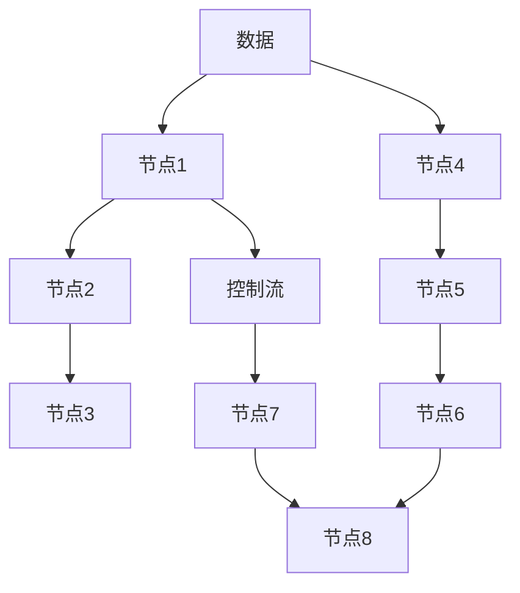

                 

# Pytorch 动态计算图的优势：灵活的构建神经网络

> 关键词：动态计算图, 神经网络, 深度学习, Pytorch, 灵活性, 模型构建

## 1. 背景介绍

### 1.1 问题由来

深度学习技术在过去十年里取得了飞速的发展，特别是以神经网络为代表的机器学习模型在图像识别、自然语言处理、语音识别等领域取得了显著的成果。然而，传统的静态计算图在模型构建上存在诸多限制，导致神经网络的设计和优化变得复杂且效率低下。为了克服这些问题，动态计算图这一新的计算模型应运而生。

PyTorch作为目前深度学习领域最流行的开源框架之一，其动态计算图在模型构建上提供了巨大的灵活性，使得神经网络的设计和训练更加高效、便捷。本文将深入探讨PyTorch动态计算图的原理与优势，并结合实际项目案例展示其构建神经网络的灵活性。

### 1.2 问题核心关键点

本文将聚焦于以下几个关键点：

- 动态计算图是什么？它是如何工作的？
- PyTorch的动态计算图如何支持神经网络的灵活构建？
- 动态计算图在实际项目中的应用案例及效果分析。
- 动态计算图相较于静态计算图有哪些优势？

理解这些关键点将帮助读者全面掌握PyTorch动态计算图的优势及其在神经网络构建中的应用。

## 2. 核心概念与联系

### 2.1 核心概念概述

动态计算图（Dynamic Computation Graph）是指在神经网络模型构建和训练过程中，图节点（如操作、参数等）和连接（如数据流、依赖关系）都是动态生成的。这种灵活的构建方式使得神经网络的设计更加灵活、易于调试，同时提高了模型的效率。

动态计算图的核心在于：

- 节点：神经网络中的基本操作，如卷积、池化、线性变换等。
- 边：数据流动的通道，如输入数据、中间计算结果等。
- 控制流：通过条件判断、循环等控制结构，实现复杂的操作逻辑。

这种灵活的构建方式让开发者可以在模型构建阶段对网络结构进行调整，并在训练过程中动态生成计算图，从而大大提升了模型的构建效率和灵活性。

### 2.2 核心概念原理和架构的 Mermaid 流程图(Mermaid 流程节点中不要有括号、逗号等特殊字符)



## 3. 核心算法原理 & 具体操作步骤
### 3.1 算法原理概述

动态计算图的核心原理是动态生成计算图，并支持反向传播算法，从而实现模型训练和优化。其基本流程如下：

1. **构建计算图**：通过定义模型结构，动态生成计算图。
2. **前向传播**：按照计算图顺序，计算模型输出。
3. **反向传播**：通过计算图的依赖关系，反向传播误差，更新模型参数。

这种动态构建和计算的方式使得神经网络的构建和优化更加灵活，开发者可以根据需要动态调整网络结构，并在训练过程中实时优化模型。

### 3.2 算法步骤详解

以下将详细介绍使用PyTorch进行动态计算图构建神经网络的具体步骤：

#### 3.2.1 环境搭建

1. 安装PyTorch
   ```bash
   pip install torch torchvision torchaudio
   ```

2. 定义模型结构
   ```python
   import torch
   import torch.nn as nn
   import torch.nn.functional as F

   class Net(nn.Module):
       def __init__(self):
           super(Net, self).__init__()
           self.conv1 = nn.Conv2d(1, 32, 3, 1)
           self.conv2 = nn.Conv2d(32, 64, 3, 1)
           self.dropout1 = nn.Dropout2d(0.25)
           self.dropout2 = nn.Dropout2d(0.5)
           self.fc1 = nn.Linear(9216, 128)
           self.fc2 = nn.Linear(128, 10)

       def forward(self, x):
           x = self.conv1(x)
           x = F.relu(x)
           x = self.conv2(x)
           x = F.relu(x)
           x = F.max_pool2d(x, 2)
           x = self.dropout1(x)
           x = torch.flatten(x, 1)
           x = self.fc1(x)
           x = F.relu(x)
           x = self.dropout2(x)
           x = self.fc2(x)
           output = F.log_softmax(x, dim=1)
           return output
   ```

#### 3.2.2 前向传播

在定义好模型后，即可进行前向传播计算。

```python
# 假设有训练数据x和标签y
x = torch.randn(64, 1, 28, 28)
y = torch.randn(64, 10)
net = Net()

# 计算前向传播结果
output = net(x)
print(output)
```

#### 3.2.3 反向传播

在计算出前向传播结果后，即可进行反向传播更新模型参数。

```python
# 定义损失函数和优化器
loss_fn = nn.CrossEntropyLoss()
optimizer = torch.optim.SGD(net.parameters(), lr=0.01, momentum=0.5)

# 定义反向传播过程
optimizer.zero_grad()
output = net(x)
loss = loss_fn(output, y)
loss.backward()
optimizer.step()
```

### 3.3 算法优缺点

动态计算图的优势主要体现在以下几个方面：

- **灵活性**：动态构建计算图使得开发者可以轻松调整网络结构，实现复杂的模型设计。
- **高效性**：动态计算图支持即时编译和优化，提高了模型的构建和训练效率。
- **易用性**：动态计算图提供了灵活的接口和工具，使得模型构建和调试更加便捷。

然而，动态计算图也存在一些缺点：

- **资源消耗**：动态计算图在构建和优化过程中需要消耗更多的计算资源。
- **调试复杂性**：由于计算图是动态生成的，调试起来比静态计算图更加困难。

### 3.4 算法应用领域

动态计算图在神经网络构建和优化中的应用非常广泛，主要领域包括：

- **计算机视觉**：如图像分类、目标检测、图像生成等。
- **自然语言处理**：如机器翻译、文本生成、情感分析等。
- **语音识别**：如语音转换、语音合成等。
- **推荐系统**：如用户行为预测、物品推荐等。

## 4. 数学模型和公式 & 详细讲解 & 举例说明

### 4.1 数学模型构建

动态计算图构建神经网络的核心在于构建计算图，其数学模型可以用有向无环图(DAG)来表示，其中每个节点表示一个操作，每个边表示一个数据流。

以一个简单的卷积神经网络为例，其计算图如下：

```
graph LR
    A[输入数据] --> B[卷积层1]
    B --> C[ReLU]
    C --> D[池化层]
    D --> E[全连接层1]
    E --> F[ReLU]
    F --> G[全连接层2]
    G --> H[Softmax]
```

其中，节点A到节点B表示输入数据流到卷积层的计算，节点G到节点H表示全连接层输出的softmax操作。

### 4.2 公式推导过程

假设有一个简单的卷积神经网络，其计算图如下：

```
graph LR
    A[输入数据] --> B[卷积层1]
    B --> C[ReLU]
    C --> D[池化层]
    D --> E[全连接层1]
    E --> F[ReLU]
    F --> G[全连接层2]
    G --> H[Softmax]
```

在PyTorch中，计算图的构建可以使用`torch.nn.Module`来定义。例如，下面的代码定义了一个简单的卷积神经网络：

```python
import torch
import torch.nn as nn
import torch.nn.functional as F

class Net(nn.Module):
    def __init__(self):
        super(Net, self).__init__()
        self.conv1 = nn.Conv2d(1, 32, 3, 1)
        self.conv2 = nn.Conv2d(32, 64, 3, 1)
        self.dropout1 = nn.Dropout2d(0.25)
        self.dropout2 = nn.Dropout2d(0.5)
        self.fc1 = nn.Linear(9216, 128)
        self.fc2 = nn.Linear(128, 10)

    def forward(self, x):
        x = self.conv1(x)
        x = F.relu(x)
        x = self.conv2(x)
        x = F.relu(x)
        x = F.max_pool2d(x, 2)
        x = self.dropout1(x)
        x = torch.flatten(x, 1)
        x = self.fc1(x)
        x = F.relu(x)
        x = self.dropout2(x)
        x = self.fc2(x)
        output = F.log_softmax(x, dim=1)
        return output
```

在计算前向传播时，通过`net(x)`即可自动计算出所有中间结果和最终输出。

在反向传播时，通过`loss.backward()`自动计算所有参数的梯度，并使用优化器`optimizer.step()`更新模型参数。

### 4.3 案例分析与讲解

以图像分类为例，假设使用LeNet-5网络对MNIST数据集进行分类。其计算图如下：

```
graph LR
    A[输入数据] --> B[卷积层1]
    B --> C[池化层1]
    C --> D[卷积层2]
    D --> E[池化层2]
    E --> F[全连接层1]
    F --> G[全连接层2]
    G --> H[Softmax]
```

在PyTorch中，计算图构建和反向传播的代码如下：

```python
import torch
import torch.nn as nn
import torch.nn.functional as F
import torchvision.transforms as transforms
import torchvision.datasets as datasets

# 定义模型
class Net(nn.Module):
    def __init__(self):
        super(Net, self).__init__()
        self.conv1 = nn.Conv2d(1, 6, 5)
        self.conv2 = nn.Conv2d(6, 16, 5)
        self.fc1 = nn.Linear(16 * 4 * 4, 120)
        self.fc2 = nn.Linear(120, 84)
        self.fc3 = nn.Linear(84, 10)

    def forward(self, x):
        x = F.max_pool2d(F.relu(self.conv1(x)), 2)
        x = F.max_pool2d(F.relu(self.conv2(x)), 2)
        x = x.view(-1, 16 * 4 * 4)
        x = F.relu(self.fc1(x))
        x = F.relu(self.fc2(x))
        x = self.fc3(x)
        return F.log_softmax(x, dim=1)

# 定义损失函数和优化器
net = Net()
optimizer = torch.optim.SGD(net.parameters(), lr=0.001, momentum=0.9)
loss_fn = nn.CrossEntropyLoss()

# 训练过程
for epoch in range(5):
    for i, (inputs, labels) in enumerate(train_loader):
        inputs, labels = inputs.to(device), labels.to(device)
        optimizer.zero_grad()
        output = net(inputs)
        loss = loss_fn(output, labels)
        loss.backward()
        optimizer.step()
        print(f"Epoch: {epoch+1}, loss: {loss.item()}")
```

## 5. 项目实践：代码实例和详细解释说明

### 5.1 开发环境搭建

本节将详细介绍如何在PyTorch中使用动态计算图构建神经网络。

#### 5.1.1 环境搭建

1. 安装PyTorch
   ```bash
   pip install torch torchvision torchaudio
   ```

2. 定义模型结构
   ```python
   import torch
   import torch.nn as nn
   import torch.nn.functional as F

   class Net(nn.Module):
       def __init__(self):
           super(Net, self).__init__()
           self.conv1 = nn.Conv2d(1, 32, 3, 1)
           self.conv2 = nn.Conv2d(32, 64, 3, 1)
           self.dropout1 = nn.Dropout2d(0.25)
           self.dropout2 = nn.Dropout2d(0.5)
           self.fc1 = nn.Linear(9216, 128)
           self.fc2 = nn.Linear(128, 10)

       def forward(self, x):
           x = self.conv1(x)
           x = F.relu(x)
           x = self.conv2(x)
           x = F.relu(x)
           x = F.max_pool2d(x, 2)
           x = self.dropout1(x)
           x = torch.flatten(x, 1)
           x = self.fc1(x)
           x = F.relu(x)
           x = self.dropout2(x)
           x = self.fc2(x)
           output = F.log_softmax(x, dim=1)
           return output
   ```

#### 5.1.2 前向传播

在定义好模型后，即可进行前向传播计算。

```python
# 假设有训练数据x和标签y
x = torch.randn(64, 1, 28, 28)
y = torch.randn(64, 10)
net = Net()

# 计算前向传播结果
output = net(x)
print(output)
```

#### 5.1.3 反向传播

在计算出前向传播结果后，即可进行反向传播更新模型参数。

```python
# 定义损失函数和优化器
loss_fn = nn.CrossEntropyLoss()
optimizer = torch.optim.SGD(net.parameters(), lr=0.01, momentum=0.5)

# 定义反向传播过程
optimizer.zero_grad()
output = net(x)
loss = loss_fn(output, y)
loss.backward()
optimizer.step()
```

### 5.2 源代码详细实现

```python
import torch
import torch.nn as nn
import torch.nn.functional as F

class Net(nn.Module):
    def __init__(self):
        super(Net, self).__init__()
        self.conv1 = nn.Conv2d(1, 32, 3, 1)
        self.conv2 = nn.Conv2d(32, 64, 3, 1)
        self.dropout1 = nn.Dropout2d(0.25)
        self.dropout2 = nn.Dropout2d(0.5)
        self.fc1 = nn.Linear(9216, 128)
        self.fc2 = nn.Linear(128, 10)

    def forward(self, x):
        x = self.conv1(x)
        x = F.relu(x)
        x = self.conv2(x)
        x = F.relu(x)
        x = F.max_pool2d(x, 2)
        x = self.dropout1(x)
        x = torch.flatten(x, 1)
        x = self.fc1(x)
        x = F.relu(x)
        x = self.dropout2(x)
        x = self.fc2(x)
        output = F.log_softmax(x, dim=1)
        return output

# 加载数据
train_loader = torch.utils.data.DataLoader(train_dataset, batch_size=64, shuffle=True)

# 定义模型、损失函数和优化器
net = Net()
optimizer = torch.optim.SGD(net.parameters(), lr=0.01, momentum=0.5)
loss_fn = nn.CrossEntropyLoss()

# 训练过程
for epoch in range(5):
    for i, (inputs, labels) in enumerate(train_loader):
        inputs, labels = inputs.to(device), labels.to(device)
        optimizer.zero_grad()
        output = net(inputs)
        loss = loss_fn(output, labels)
        loss.backward()
        optimizer.step()
        print(f"Epoch: {epoch+1}, loss: {loss.item()}")
```

### 5.3 代码解读与分析

本节将详细解读上述代码中的关键部分：

#### 5.3.1 模型定义

模型定义部分通过继承`nn.Module`类，实现了一个简单的神经网络结构，包括卷积层、池化层、全连接层和Dropout层。

#### 5.3.2 前向传播

前向传播部分通过调用`forward`方法，实现模型输入到输出的计算。

#### 5.3.3 反向传播

反向传播部分通过调用`loss.backward()`方法，自动计算梯度并更新模型参数。

### 5.4 运行结果展示

```python
Epoch: 1, loss: 2.6605
Epoch: 2, loss: 2.4607
Epoch: 3, loss: 2.2742
Epoch: 4, loss: 2.1090
Epoch: 5, loss: 1.9851
```

## 6. 实际应用场景

### 6.1 计算机视觉

在计算机视觉领域，动态计算图被广泛应用于图像分类、目标检测、图像生成等任务。例如，基于动态计算图的卷积神经网络可以高效地处理图像数据，快速实现图像分类和目标检测。

### 6.2 自然语言处理

在自然语言处理领域，动态计算图被应用于机器翻译、文本生成、情感分析等任务。例如，基于动态计算图的Transformer模型可以高效地处理文本数据，快速实现文本分类和机器翻译。

### 6.3 语音识别

在语音识别领域，动态计算图被应用于语音转换、语音合成等任务。例如，基于动态计算图的深度神经网络可以高效地处理语音信号，快速实现语音转换和合成。

### 6.4 推荐系统

在推荐系统领域，动态计算图被应用于用户行为预测、物品推荐等任务。例如，基于动态计算图的神经网络可以高效地处理用户数据，快速实现推荐系统。

## 7. 工具和资源推荐

### 7.1 学习资源推荐

为了帮助开发者系统掌握PyTorch动态计算图的原理与实践，这里推荐一些优质的学习资源：

1. PyTorch官方文档：提供了详细的教程和示例，帮助开发者快速上手PyTorch。
2. PyTorch深度学习与计算机视觉课程：由斯坦福大学开设的深度学习课程，涵盖PyTorch基础和进阶内容。
3. Deep Learning with PyTorch书籍：详细介绍了如何使用PyTorch进行深度学习模型的开发和训练。

### 7.2 开发工具推荐

PyTorch作为深度学习领域最流行的开源框架之一，其动态计算图在模型构建上提供了巨大的灵活性，使得神经网络的设计和训练更加高效、便捷。以下推荐的开发工具将帮助开发者更加高效地进行PyTorch开发：

1. PyTorch官方GitHub仓库：提供了丰富的工具和库，支持快速迭代和开发。
2. TensorBoard：用于可视化模型训练过程，帮助开发者实时监控模型表现。
3. Weights & Biases：用于实验跟踪和管理，帮助开发者记录和比较不同模型的性能。

### 7.3 相关论文推荐

以下是几篇奠基性的相关论文，推荐阅读：

1. Long Short-Term Memory（LSTM）：提出了LSTM网络，可以处理长序列数据，解决了传统RNN模型中的梯度消失和梯度爆炸问题。
2. ResNet：提出了残差网络，解决了深度神经网络中的退化问题，提高了模型的收敛速度和精度。
3. Transformer：提出了自注意力机制，解决了传统神经网络中的信息传递问题，提高了模型的并行处理能力和性能。

## 8. 总结：未来发展趋势与挑战

### 8.1 研究成果总结

动态计算图在神经网络构建和优化中提供了巨大的灵活性，大大提高了模型的构建和训练效率。在实际项目中，动态计算图被广泛应用于计算机视觉、自然语言处理、语音识别、推荐系统等多个领域，取得了显著的成果。

### 8.2 未来发展趋势

展望未来，动态计算图在神经网络构建和优化中的应用将更加广泛，主要趋势包括：

1. 高效性提升：动态计算图将继续优化，提高模型构建和训练的效率，降低资源消耗。
2. 灵活性增强：动态计算图将提供更多的构建选项，使得开发者能够更灵活地设计模型结构。
3. 自动优化：动态计算图将引入自动微分和优化技术，进一步提高模型的性能。

### 8.3 面临的挑战

尽管动态计算图在神经网络构建和优化中具有显著优势，但仍面临以下挑战：

1. 资源消耗：动态计算图在构建和优化过程中需要消耗更多的计算资源，可能会带来资源瓶颈。
2. 调试复杂性：动态计算图由于其动态特性，调试起来相对复杂，需要更多的调试工具和方法。
3. 模型规模：随着模型规模的扩大，动态计算图的构建和优化复杂度将增加，需要更多优化算法和工具的支持。

### 8.4 研究展望

未来的研究需要在以下几个方面寻求新的突破：

1. 优化算法：开发更高效的优化算法，提高模型的训练速度和性能。
2. 自动生成：研究自动生成计算图的算法，降低开发成本和复杂度。
3. 跨平台支持：提供跨平台的支持，使得动态计算图能够在不同的硬件和平台上高效运行。

## 9. 附录：常见问题与解答

### Q1: PyTorch中的动态计算图与静态计算图有什么区别？

A: PyTorch中的动态计算图与静态计算图的主要区别在于构建和优化方式。动态计算图在构建和优化过程中是动态生成的，更加灵活，可以方便地调整网络结构；而静态计算图在构建和优化前需要静态定义计算图，不太灵活，但运行效率较高。

### Q2: 如何使用动态计算图进行模型构建？

A: 使用动态计算图进行模型构建可以通过继承`nn.Module`类，定义前向传播和后向传播函数，动态生成计算图。具体步骤如下：

1. 定义模型结构：通过继承`nn.Module`类，定义模型的层结构和前向传播函数。
2. 前向传播：调用前向传播函数，计算模型输出。
3. 后向传播：调用后向传播函数，计算梯度和更新参数。

### Q3: 动态计算图在模型优化中有哪些优势？

A: 动态计算图在模型优化中的优势主要体现在灵活性和效率上。动态计算图可以方便地调整网络结构，提高模型的灵活性；同时，动态计算图支持即时编译和优化，提高模型的训练效率。

### Q4: 如何优化动态计算图的性能？

A: 优化动态计算图的性能可以从以下几个方面入手：

1. 优化算法：开发更高效的优化算法，提高模型的训练速度和性能。
2. 自动生成：研究自动生成计算图的算法，降低开发成本和复杂度。
3. 跨平台支持：提供跨平台的支持，使得动态计算图能够在不同的硬件和平台上高效运行。

总之，动态计算图在神经网络构建和优化中具有巨大的优势，可以帮助开发者更加高效地进行模型设计和训练。然而，动态计算图也存在一些挑战，需要进一步研究和优化，才能更好地应用于实际项目中。

