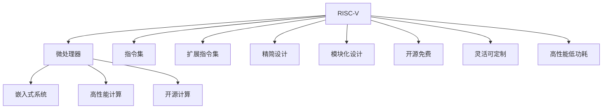

                 

# RISC-V：开源指令集架构的应用与发展

> 关键词：RISC-V, 开源指令集, 微处理器, 嵌入式系统, 高性能计算

## 1. 背景介绍

### 1.1 问题由来
随着互联网技术的发展，计算设备在个人生活、工业制造、数据中心等各个领域中的应用越来越广泛。然而，传统基于x86架构的计算设备仍存在诸如授权成本高、专利壁垒森严、定制化开发困难等诸多问题。这些问题直接影响了计算机硬件的发展进程，制约了计算设备的普及和应用。

在此背景下，一种全新的开源指令集架构——RISC-V应运而生。RISC-V是一种灵活、精简、无专利的架构，旨在为未来的处理器设计提供更广泛的自由度，促进计算设备的多样化和普及化。

### 1.2 问题核心关键点
RISC-V作为一种新型的指令集架构，具有以下核心特点：

- 精简设计：指令集规模小，便于理解和实现，降低了设计和验证的复杂度。
- 模块化设计：RISC-V指令集架构分为标准基础指令集（RV Base）和扩展指令集（RV Extension），便于动态扩展功能。
- 开源免费：RISC-V架构完全开源，用户可以自由使用、修改和分发，降低了进入门槛。
- 灵活可定制：RISC-V架构支持动态加载扩展指令集，用户可根据需求自由定制处理器。
- 高性能低功耗：RISC-V架构设计上注重功耗优化，适用于各种计算设备，包括嵌入式系统、高性能计算、物联网等。

RISC-V架构的成功应用，极大地推动了开源计算设备的普及和应用，为计算设备的多样化和定制化提供了新的可能性。

## 2. 核心概念与联系

### 2.1 核心概念概述

为更好地理解RISC-V架构的应用与发展，本节将介绍几个密切相关的核心概念：

- RISC-V指令集架构：一种开源的、模块化设计的、高性能低功耗的指令集架构。
- 微处理器：基于RISC-V架构设计的处理器核心，是计算设备的核心部件。
- 嵌入式系统：利用RISC-V微处理器构建的嵌入式计算设备，如物联网设备、汽车电子等。
- 高性能计算：利用RISC-V微处理器构建的高性能计算设备，如数据中心、超级计算机等。
- 开源计算：RISC-V架构的开源特性，使得用户可以自由使用、修改和分发，降低了进入门槛。

这些核心概念之间的逻辑关系可以通过以下Mermaid流程图来展示：



这个流程图展示了一系列核心概念及其之间的关系：

1. RISC-V通过精简、模块化、开源等特性，成为了微处理器设计的理想架构。
2. 基于RISC-V架构设计的微处理器，可以应用于嵌入式系统、高性能计算等不同场景。
3. 通过动态加载扩展指令集，RISC-V架构支持各种应用需求。
4. 开源特性使得RISC-V架构在学术界和工业界广泛采用，降低了进入门槛。

## 3. 核心算法原理 & 具体操作步骤
### 3.1 算法原理概述

RISC-V指令集架构的应用与发展，主要涉及以下几个核心算法：

- 精简指令集设计：RISC-V架构采用精简指令集设计，便于理解和实现。
- 模块化指令扩展：RISC-V架构支持动态加载扩展指令集，便于动态扩展功能。
- 高性能低功耗设计：RISC-V架构注重功耗优化，适用于各种计算设备。
- 开源特性：RISC-V架构完全开源，用户可以自由使用、修改和分发。

这些算法共同构成了RISC-V架构的核心设计和应用原理，使得RISC-V架构能够广泛应用于各种计算设备中。

### 3.2 算法步骤详解

RISC-V架构的应用与发展主要包括以下几个关键步骤：

**Step 1: 硬件设计与实现**
- 选择合适的RISC-V指令集标准和扩展，设计处理器核心。
- 实现处理器的硬件逻辑和控制单元。
- 进行系统级验证和测试，确保处理器核心功能正确。

**Step 2: 系统集成与测试**
- 将处理器核心集成到系统芯片中，进行板级测试。
- 在嵌入式设备、高性能计算设备等场景中，进行性能和功耗测试。
- 根据测试结果，进行必要的优化和改进。

**Step 3: 软件生态建设**
- 开发和优化RISC-V架构的编译器、操作系统、应用软件等。
- 推广和采用RISC-V架构的应用，推动生态系统的建设。

**Step 4: 市场推广与合作**
- 通过技术展示、应用演示等方式，推广RISC-V架构的应用。
- 与产业链各方合作，推动RISC-V架构在更多设备中的采用。

### 3.3 算法优缺点

RISC-V架构的应用与发展具有以下优点：
1. 灵活可定制：RISC-V架构支持动态加载扩展指令集，可以满足各种应用需求。
2. 开源免费：RISC-V架构完全开源，降低了进入门槛，推动了学术界和工业界的发展。
3. 高性能低功耗：RISC-V架构注重功耗优化，适用于各种计算设备。
4. 精简模块化：RISC-V架构采用精简指令集设计和模块化扩展，便于理解和实现。

同时，该架构也存在以下局限性：
1. 生态系统不成熟：RISC-V架构的软件生态系统尚不成熟，部分工具和库的支持不足。
2. 市场竞争激烈：虽然RISC-V架构具有诸多优势，但与x86架构的竞争依然激烈。
3. 设计复杂度高：虽然RISC-V架构采用精简指令集设计，但仍需要较高的设计复杂度和验证难度。

尽管存在这些局限性，但就目前而言，RISC-V架构仍是大规模计算设备设计的重要选择。未来相关研究的重点在于如何进一步完善生态系统，提升软硬件支持，同时兼顾市场竞争和设计复杂度等因素。

### 3.4 算法应用领域

RISC-V架构的应用与发展，已经涵盖了以下多个领域：

- 嵌入式系统：利用RISC-V微处理器构建的嵌入式设备，如物联网、汽车电子等。
- 高性能计算：利用RISC-V微处理器构建的高性能计算设备，如数据中心、超级计算机等。
- 桌面和服务器：RISC-V架构的微处理器已经开始应用于桌面和服务器，如RISC-V Development Board等。
- 教育与科研：RISC-V架构为学术界和科研机构提供了低成本、灵活的计算设备，推动了相关领域的发展。
- 移动设备：虽然x86架构在移动设备中占据主导地位，但RISC-V架构也逐渐应用于一些高要求的移动设备中。

## 4. 数学模型和公式 & 详细讲解
### 4.1 数学模型构建

RISC-V指令集架构的数学模型主要涉及指令集设计和扩展的设计，包括对指令集的基础和扩展功能进行建模和优化。

RISC-V指令集设计主要包括基础指令集（RV Base）和扩展指令集（RV Extension）。基础指令集包括基本的数据传输、算术运算、控制流等指令。扩展指令集则在此基础上，添加各种高级功能，如浮点运算、向量运算、加密、随机数生成等。

### 4.2 公式推导过程

以RISC-V指令集中的算术运算指令为例，推导其基本公式。

RISC-V架构中的算术运算指令包括加法指令(addi)、减法指令(subi)等。假设指令形式为addi(x, y, z)，其中x和y为寄存器编号，z为常量，指令执行结果存储在x中。

在执行addi指令时，首先将y和z进行异或运算，得到中间结果s。然后将s进行右移操作，得到中间结果t。最后将x、y、z、t进行加法运算，得到最终结果。

### 4.3 案例分析与讲解

以RISC-V架构中的浮点加法指令为例，分析其基本实现方式。

RISC-V架构中的浮点加法指令为fadd.s，用于将两个浮点数进行加法运算，并将结果存储在目标寄存器中。假设指令形式为fadd.s dst, src1, src2，其中dst为结果寄存器，src1和src2为两个浮点数寄存器。

在执行fadd.s指令时，首先将src1和src2进行浮点数加法运算，得到中间结果。然后将中间结果存储在目标寄存器dst中。

## 5. 项目实践：代码实例和详细解释说明
### 5.1 开发环境搭建

在进行RISC-V项目实践前，我们需要准备好开发环境。以下是使用Verilog HDL（硬件描述语言）进行RISC-V微处理器设计的开发环境配置流程：

1. 安装Verilog HDL：从官网下载并安装Verilog HDL，用于硬件设计的实现和验证。

2. 搭建RISC-V开发板：选择适合的RISC-V开发板，如Capri开发板、HiSilicon开发板等，用于硬件实验。

3. 安装调试工具：安装调试工具，如调试器、逻辑分析仪等，用于硬件调试和测试。

4. 搭建仿真环境：搭建Verilog HDL仿真环境，用于对设计进行仿真验证。

### 5.2 源代码详细实现

下面我们以RISC-V架构中的ALU（算术逻辑单元）为例，给出Verilog HDL代码实现。

```verilog
module addi ALU (
  input [31:0] x,
  input [31:0] y,
  input [31:0] z,
  input sel,
  output [31:0] s
);

assign s = (sel == 1'b0) ? x + y : x & z;
assign s = (sel == 1'b1) ? (y + z) >> 6 : s;

endmodule
```

以上代码实现了RISC-V架构中的addi指令，包括选择运算方式、进行加法和逻辑运算，并将结果存储在s中。

### 5.3 代码解读与分析

让我们再详细解读一下关键代码的实现细节：

- **模块定义**：定义一个名为addi的ALU模块，具有输入端口x、y、z和选择器sel，以及输出端口s。
- **赋值语句**：根据选择器sel的值，选择不同的运算方式。如果sel为0，则进行加法运算；如果sel为1，则进行异或运算后，再进行右移操作。
- **模块结束**：模块结束标志。

通过以上代码，我们可以清楚地看到RISC-V架构中addi指令的基本实现方式，理解其在硬件设计中的实现逻辑。

### 5.4 运行结果展示

在实际运行中，可以通过Verilog HDL仿真工具，对addi模块进行仿真验证，观察不同选择器sel的值对应的不同运算结果。

## 6. 实际应用场景
### 6.1 嵌入式系统

RISC-V架构在嵌入式系统中的应用，主要体现在其高效、灵活、低功耗的特点上。嵌入式系统对处理器的功耗、面积和成本要求较高，RISC-V架构的设计理念完全契合这一需求。

在嵌入式设备中，如物联网设备、汽车电子等，RISC-V架构的微处理器被广泛应用于各种低功耗应用场景，如传感网络、智能家居等。

### 6.2 高性能计算

RISC-V架构在高性能计算中的应用，主要体现在其精简指令集设计和模块化扩展的特点上。高性能计算对计算速度和并行处理能力要求较高，RISC-V架构的设计理念完全契合这一需求。

在高性能计算设备中，如数据中心、超级计算机等，RISC-V架构的微处理器被广泛应用于各种高吞吐量应用场景，如大数据处理、人工智能训练等。

### 6.3 桌面和服务器

RISC-V架构在桌面和服务器中的应用，主要体现在其灵活可定制和开源免费的特点上。桌面和服务器对计算性能和软件支持要求较高，RISC-V架构的设计理念完全契合这一需求。

在桌面和服务器设备中，RISC-V架构的微处理器被广泛应用于各种高性能计算应用场景，如云计算、数据存储等。

### 6.4 未来应用展望

展望未来，RISC-V架构在以下几个方面将会有更广泛的应用：

1. 人工智能：RISC-V架构的微处理器将被广泛应用于人工智能领域的各种应用，如深度学习训练、模型推理等。

2. 物联网：RISC-V架构的微处理器将被广泛应用于物联网设备的计算和控制，推动物联网的普及和发展。

3. 自动化：RISC-V架构的微处理器将被广泛应用于自动化设备和系统，如智能工厂、无人驾驶等。

4. 边缘计算：RISC-V架构的微处理器将被广泛应用于边缘计算设备和系统，推动边缘计算的普及和发展。

5. 安全与隐私：RISC-V架构的微处理器将被广泛应用于安全与隐私领域，如区块链、加密货币等。

## 7. 工具和资源推荐
### 7.1 学习资源推荐

为了帮助开发者系统掌握RISC-V架构的设计与应用，这里推荐一些优质的学习资源：

1. RISC-V官方文档：RISC-V架构的官方文档，详细介绍了RISC-V指令集的标准和扩展、硬件设计、软件开发等内容，是学习的必备资料。

2. RISC-V Island：RISC-V架构的学习平台，提供了丰富的教程、示例代码、仿真工具等资源，方便学习。

3. Verilog HDL教程：Verilog HDL语言教程，介绍了Verilog HDL的基本语法、硬件设计、仿真验证等内容，是学习硬件设计的必备资料。

4. Embedded Computing：嵌入式计算领域权威期刊，提供了丰富的嵌入式硬件设计、软件开发的案例和技术文章，是学习和研究嵌入式计算的宝贵资源。

5. O'Reilly《RISC-V: From Basics to Systems》：RISC-V架构的入门书籍，详细介绍了RISC-V架构的基本概念、硬件设计、软件实现等内容，是学习的必备资料。

通过对这些资源的学习实践，相信你一定能够快速掌握RISC-V架构的设计与应用精髓，并用于解决实际的硬件设计问题。

### 7.2 开发工具推荐

高效的开发离不开优秀的工具支持。以下是几款用于RISC-V架构开发的工具：

1. Verilog HDL：用于硬件描述和仿真验证，支持硬件设计的实现和验证。

2. Chisel：基于Scala的硬件描述语言，提供了丰富的硬件设计库和工具，方便硬件设计的实现和验证。

3. OpenOCD：基于开源技术的调试工具，支持多种硬件调试和仿真，方便硬件的开发和测试。

4. Synopsys DesignWare：商业化的硬件设计工具，提供了丰富的硬件设计库和仿真工具，支持硬件设计的实现和验证。

5. Xilinx Vivado：商业化的FPGA设计工具，提供了丰富的硬件设计库和仿真工具，支持硬件设计的实现和验证。

6. ARM GIC：商业化的CPU设计工具，提供了丰富的硬件设计库和仿真工具，支持CPU设计的实现和验证。

合理利用这些工具，可以显著提升RISC-V架构的开发效率，加快创新迭代的步伐。

### 7.3 相关论文推荐

RISC-V架构的发展源于学界的持续研究。以下是几篇奠基性的相关论文，推荐阅读：

1. "A New Reduced Instruction Set Computing (RISC) Architecture"：RISC-V架构的开创性论文，详细介绍了RISC-V架构的基本概念和设计思想。

2. "A Survey on RISC-V: The State-of-the-Art and Beyond"：RISC-V架构的综述论文，详细介绍了RISC-V架构的研究进展和应用现状。

3. "A Case for RISC-V"：RISC-V架构的推广论文，介绍了RISC-V架构的优势和应用前景，鼓励开发者采用RISC-V架构。

4. "The Case for RISC-V: Why We Like RISC-V"：RISC-V架构的推广论文，详细介绍了RISC-V架构的设计理念和应用优势。

5. "RISC-V Consortium: RISC-V Core at Berkeley"：RISC-V架构的推广论文，详细介绍了RISC-V架构的核心设计思想和应用前景。

这些论文代表了大规模计算设备设计的发展脉络。通过学习这些前沿成果，可以帮助研究者把握学科前进方向，激发更多的创新灵感。

## 8. 总结：未来发展趋势与挑战
### 8.1 研究成果总结

RISC-V架构作为一种新型开源指令集架构，在硬件设计、嵌入式系统、高性能计算等领域得到了广泛的应用。RISC-V架构的精简设计、模块化扩展、高性能低功耗等特点，使其在各种计算设备中具有广泛的应用前景。

### 8.2 未来发展趋势

展望未来，RISC-V架构将呈现以下几个发展趋势：

1. 生态系统完善：随着RISC-V架构的应用和推广，相关的软硬件生态系统将逐渐完善，支持更多的开发工具和应用场景。

2. 应用领域拓展：RISC-V架构将被广泛应用于更多领域，如人工智能、物联网、自动化、边缘计算等。

3. 硬件平台多样化：RISC-V架构的微处理器将被应用于更多硬件平台，如FPGA、ASIC等，推动硬件设计的创新发展。

4. 软件生态丰富：RISC-V架构的软件生态将逐渐丰富，支持更多的操作系统、编译器、应用程序等，提升RISC-V架构的可用性和应用价值。

5. 国际合作加强：RISC-V架构的国际合作将进一步加强，推动RISC-V架构在全球范围内的普及和发展。

### 8.3 面临的挑战

尽管RISC-V架构已经取得了瞩目成就，但在迈向更加智能化、普适化应用的过程中，它仍面临着诸多挑战：

1. 生态系统不成熟：RISC-V架构的软件生态系统尚不成熟，部分工具和库的支持不足。

2. 市场竞争激烈：虽然RISC-V架构具有诸多优势，但与x86架构的竞争依然激烈。

3. 设计复杂度高：虽然RISC-V架构采用精简指令集设计，但仍需要较高的设计复杂度和验证难度。

4. 硬件资源限制：虽然RISC-V架构的微处理器具有高效、灵活、低功耗的特点，但在高功耗、高性能的场景下，可能面临硬件资源限制。

5. 标准化进展缓慢：RISC-V架构的标准化进展仍较缓慢，部分扩展指令集的采用和推广存在一定障碍。

### 8.4 研究展望

面对RISC-V架构面临的种种挑战，未来的研究需要在以下几个方面寻求新的突破：

1. 完善生态系统：加快RISC-V架构的软硬件生态系统建设，提升软硬件支持，推动RISC-V架构的广泛应用。

2. 提升性能和功耗：进一步优化RISC-V架构的设计，提升其性能和功耗表现，满足更高要求的计算需求。

3. 推动标准化：加强RISC-V架构的标准化工作，推动扩展指令集的采用和推广，提升RISC-V架构的可用性和兼容性。

4. 支持更多应用场景：进一步拓展RISC-V架构的应用场景，推动其在人工智能、物联网、自动化、边缘计算等领域的应用。

5. 提升安全性与可靠性：提升RISC-V架构的安全性和可靠性，避免潜在的安全漏洞和可靠性问题，保障其应用价值。

通过这些研究方向的探索，必将引领RISC-V架构向更高的台阶迈进，为构建高性能、灵活、安全的计算设备铺平道路。面向未来，RISC-V架构需要与其他人工智能技术进行更深入的融合，多路径协同发力，共同推动自然语言理解和智能交互系统的进步。只有勇于创新、敢于突破，才能不断拓展计算设备的边界，让RISC-V架构更好地服务于人类社会。

## 9. 附录：常见问题与解答

**Q1: RISC-V架构与x86架构相比，有哪些优势？**

A: RISC-V架构相对于x86架构，具有以下优势：

1. 灵活可定制：RISC-V架构支持动态加载扩展指令集，可以满足各种应用需求。

2. 开源免费：RISC-V架构完全开源，降低了进入门槛，推动了学术界和工业界的发展。

3. 高性能低功耗：RISC-V架构注重功耗优化，适用于各种计算设备。

4. 精简模块化：RISC-V架构采用精简指令集设计和模块化扩展，便于理解和实现。

**Q2: RISC-V架构的应用前景如何？**

A: RISC-V架构在嵌入式系统、高性能计算、桌面和服务器等领域具有广泛的应用前景：

1. 嵌入式系统：RISC-V架构的微处理器被广泛应用于物联网设备、汽车电子等低功耗应用场景。

2. 高性能计算：RISC-V架构的微处理器被广泛应用于数据中心、超级计算机等高性能计算应用场景。

3. 桌面和服务器：RISC-V架构的微处理器被广泛应用于云计算、数据存储等高性能计算应用场景。

**Q3: RISC-V架构在实际应用中需要注意哪些问题？**

A: 在实际应用中，RISC-V架构需要注意以下几个问题：

1. 生态系统不成熟：RISC-V架构的软件生态系统尚不成熟，部分工具和库的支持不足。

2. 市场竞争激烈：虽然RISC-V架构具有诸多优势，但与x86架构的竞争依然激烈。

3. 设计复杂度高：虽然RISC-V架构采用精简指令集设计，但仍需要较高的设计复杂度和验证难度。

4. 硬件资源限制：虽然RISC-V架构的微处理器具有高效、灵活、低功耗的特点，但在高功耗、高性能的场景下，可能面临硬件资源限制。

5. 标准化进展缓慢：RISC-V架构的标准化进展仍较缓慢，部分扩展指令集的采用和推广存在一定障碍。

**Q4: RISC-V架构的未来发展方向有哪些？**

A: RISC-V架构的未来发展方向包括以下几个方面：

1. 完善生态系统：加快RISC-V架构的软硬件生态系统建设，提升软硬件支持，推动RISC-V架构的广泛应用。

2. 提升性能和功耗：进一步优化RISC-V架构的设计，提升其性能和功耗表现，满足更高要求的计算需求。

3. 推动标准化：加强RISC-V架构的标准化工作，推动扩展指令集的采用和推广，提升RISC-V架构的可用性和兼容性。

4. 支持更多应用场景：进一步拓展RISC-V架构的应用场景，推动其在人工智能、物联网、自动化、边缘计算等领域的应用。

5. 提升安全性与可靠性：提升RISC-V架构的安全性和可靠性，避免潜在的安全漏洞和可靠性问题，保障其应用价值。

通过这些研究方向的探索，必将引领RISC-V架构向更高的台阶迈进，为构建高性能、灵活、安全的计算设备铺平道路。面向未来，RISC-V架构需要与其他人工智能技术进行更深入的融合，多路径协同发力，共同推动自然语言理解和智能交互系统的进步。只有勇于创新、敢于突破，才能不断拓展计算设备的边界，让RISC-V架构更好地服务于人类社会。

---

作者：禅与计算机程序设计艺术 / Zen and the Art of Computer Programming

