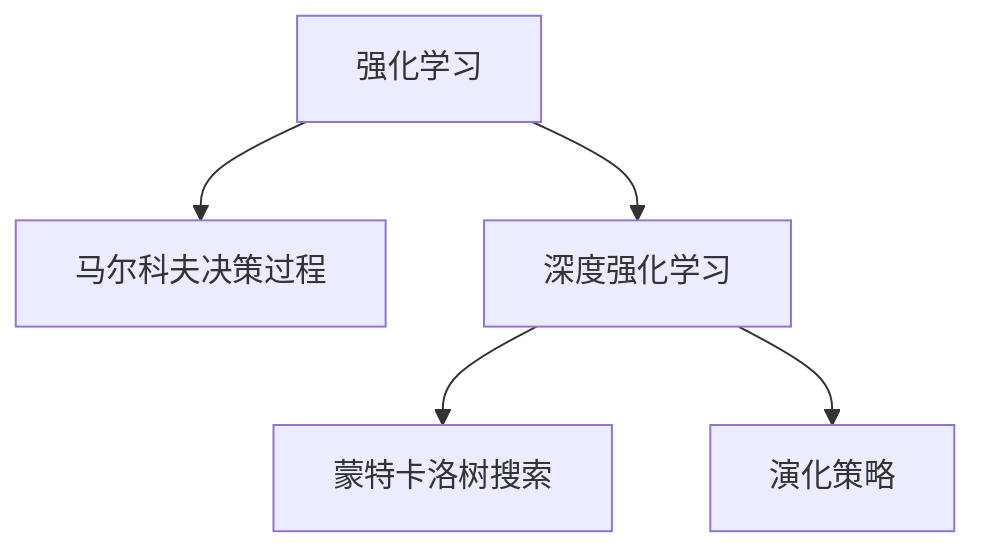

                 

## 1. 背景介绍

### 1.1 问题由来
随着人工智能技术的发展，强化学习(Reinforcement Learning, RL)在游戏和机器人等领域的应用，成为了一个热门研究课题。在游戏领域，RL算法被用于开发智能游戏玩家，在《星际争霸》、《DOTA 2》等游戏中取得了优秀成绩。在机器人领域，RL算法被用于构建自主导航、路径规划、协作作业等应用，大大提升了机器人的智能化水平。

### 1.2 问题核心关键点
RL 的核心在于通过智能体(Agent)与环境(environment)之间的交互，学习最优的决策策略。智能体根据环境状态采取行动，通过奖惩信号不断调整策略，最终实现最大化累积奖励的目标。

当前，RL在游戏和机器人领域的应用主要包括两个关键点：
1. 游戏AI：智能体通过学习最优游戏策略，超越人类玩家。
2. 机器人控制：智能体通过学习最优行动策略，实现自主导航、协作作业等任务。

## 2. 核心概念与联系

### 2.1 核心概念概述

为更好地理解RL在游戏和机器人中的应用，本节将介绍几个密切相关的核心概念：

- 强化学习(Reinforcement Learning, RL)：通过智能体与环境之间的交互，学习最优决策策略的过程。核心思想是智能体通过不断试错，逐步优化策略以最大化累积奖励。

- 马尔科夫决策过程(Markov Decision Process, MDP)：描述智能体与环境交互的最基本框架。MDP由状态(state)、行动(action)、奖励(reward)、转移概率(P)和折扣因子(γ)组成。

- 深度强化学习(Deep Reinforcement Learning, DRL)：结合深度神经网络，实现对高维度、非线性问题的有效学习。DRL广泛应用于图像识别、自然语言处理、机器人控制等领域。

- 蒙特卡洛树搜索(Monte Carlo Tree Search, MCTS)：一种基于搜索的强化学习方法。通过模拟策略树，预测下一步最优行动，用于解决复杂问题如围棋、国际象棋等。

- 演化策略(Evolutionary Strategy, ES)：借鉴进化生物学，通过种群竞争和遗传变异，逐步找到最优策略。适用于复杂环境或难以建模的问题。

这些核心概念之间的逻辑关系可以通过以下Mermaid流程图来展示：



这个流程图展示了一些与RL核心概念密切相关的技术框架，帮助理解RL在游戏和机器人中的具体应用。

## 3. 核心算法原理 & 具体操作步骤
### 3.1 算法原理概述

在RL游戏中，智能体的目标是通过不断尝试不同的策略，找到一种最大化累积奖励的策略。游戏中的行动往往具有不确定性，因此RL算法通常采用蒙特卡洛树搜索(MCTS)或深度强化学习(DRL)来优化策略。

具体来说，DRL算法通常分为以下几步：
1. 定义游戏环境：使用DRL框架，创建游戏环境的数学模型，包括状态空间、行动空间、转移概率等。
2. 构建神经网络模型：设计神经网络结构，用于预测状态-行动的Q值或策略，以优化决策。
3. 设计损失函数：通常使用均方误差、交叉熵等损失函数，衡量预测值与实际值之间的差异。
4. 训练模型：使用反向传播算法，根据损失函数不断更新网络参数，优化策略。
5. 测试模型：在测试环境中评估模型的性能，反复迭代优化策略。

在游戏AI中，一个重要的挑战是如何评估策略的好坏。常见的方法包括期望奖励(Epsilon-Greedy)和均方误差(MSE)等。

## 3.2 算法步骤详解

### 3.2.1 定义游戏环境

首先，我们需要定义游戏环境。以下以《星际争霸》为例，说明如何将游戏转换为数学模型：

- **状态空间**：游戏中的每一个局面的描述，如当前玩家的所有兵种、基地位置、资源数量等。
- **行动空间**：玩家在当前状态下可以采取的所有行动，如单位移动、生产、攻击等。
- **转移概率**：在当前状态下，采取某一行动后转移到下一个状态的概率。
- **奖励函数**：玩家在每个状态下获得的奖励，如胜利、失败、行动次数等。

这些要素构成了MDP的完整描述，我们可以使用这些描述，将《星际争霸》转化为一个标准的强化学习问题。

### 3.2.2 构建神经网络模型

接下来，我们使用神经网络模型来构建游戏AI。具体来说，我们设计了一个全连接神经网络，用于预测给定状态下的最优行动。

```python
import torch
import torch.nn as nn
import torch.optim as optim

# 定义神经网络结构
class DRLNet(nn.Module):
    def __init__(self, state_dim, action_dim):
        super(DRLNet, self).__init__()
        self.fc1 = nn.Linear(state_dim, 128)
        self.fc2 = nn.Linear(128, 64)
        self.fc3 = nn.Linear(64, action_dim)
    
    def forward(self, x):
        x = F.relu(self.fc1(x))
        x = F.relu(self.fc2(x))
        x = self.fc3(x)
        return x

# 创建神经网络模型
net = DRLNet(state_dim, action_dim)
```

这里，我们使用了全连接神经网络，包含三个全连接层。其中，`state_dim`是输入状态空间的维度，`action_dim`是输出行动空间的维度。

### 3.2.3 设计损失函数

我们使用均方误差(MSE)来衡量神经网络的预测值与实际值之间的差异。具体来说，我们使用交叉熵损失函数来训练网络，目标是使得预测的行动概率分布尽可能接近实际概率分布。

```python
# 定义损失函数
criterion = nn.CrossEntropyLoss()
```

### 3.2.4 训练模型

接下来，我们使用反向传播算法，通过梯度下降来更新神经网络的参数。

```python
# 定义优化器
optimizer = optim.Adam(net.parameters(), lr=0.001)

# 训练模型
for episode in range(1000):
    state = initial_state
    total_reward = 0
    for t in range(100):
        action_probs = net(state)
        action = np.random.choice(np.arange(action_dim), p=action_probs.numpy())
        next_state, reward, done, _ = environment.step(action)
        state = next_state
        total_reward += reward
        if done:
            break
    # 计算损失函数
    loss = criterion(action_probs, target)
    # 反向传播
    optimizer.zero_grad()
    loss.backward()
    optimizer.step()
    print("Episode {}: Reward = {}".format(episode, total_reward))
```

在训练过程中，我们使用了随机梯度下降法来更新神经网络的参数，每次随机选择一个行动来执行。在每个时间步上，我们计算出当前状态下的行动概率，并根据实际行动和奖励更新网络参数。

### 3.2.5 测试模型

最后，我们在测试环境中评估模型的性能。

```python
# 测试模型
test_reward = 0
for episode in range(100):
    state = initial_state
    for t in range(100):
        action_probs = net(state)
        action = np.argmax(action_probs.numpy())
        next_state, reward, done, _ = environment.step(action)
        state = next_state
        test_reward += reward
        if done:
            break
print("Test reward = {}".format(test_reward))
```

在测试过程中，我们使用测试集对模型进行评估，记录每个时间步上的奖励。

## 3.3 算法优缺点

### 3.3.1 算法优点

DRL算法在游戏和机器人中的优点如下：

1. **高维度学习**：DRL算法能够处理高维度的输入和行动空间，适用于复杂的决策问题。
2. **自适应性强**：DRL算法可以适应不同的环境和任务，具有一定的泛化能力。
3. **可解释性强**：DRL算法能够通过神经网络模型进行可视化，帮助我们理解决策过程。
4. **算法灵活**：DRL算法可以与其他算法（如蒙特卡洛树搜索MCTS）结合使用，形成混合策略。

### 3.3.2 算法缺点

DRL算法在游戏和机器人中的缺点如下：

1. **计算复杂度高**：DRL算法需要大量的计算资源和数据，训练时间较长。
2. **过拟合风险高**：DRL算法容易过拟合，尤其是在数据量较小的情况下。
3. **鲁棒性差**：DRL算法在环境变化较大时，策略泛化能力较弱。
4. **模型复杂度高**：DRL算法需要设计复杂的神经网络模型，增加了模型调参的难度。

## 3.4 算法应用领域

### 3.4.1 游戏AI

DRL算法在游戏AI中的应用非常广泛，已经在《星际争霸》、《DOTA 2》等游戏中取得了优异成绩。例如，DeepMind开发的AlphaGo，就是一个基于DRL的围棋AI，通过自监督学习和监督学习，击败了世界围棋冠军李世石。

### 3.4.2 机器人控制

DRL算法在机器人控制中的应用也越来越多，主要用于自主导航、路径规划、协作作业等任务。例如，DeepMind的AlphaGo Zero，利用DRL技术，通过自对弈学习，达到了超越人类水平的目标。

## 4. 数学模型和公式 & 详细讲解 & 举例说明

### 4.1 数学模型构建

在RL中，我们通常使用马尔科夫决策过程(MDP)来描述问题。MDP由四个要素组成：状态(state)、行动(action)、奖励(reward)、转移概率(P)和折扣因子(γ)。

其中，状态空间和行动空间可以用向量化表示，如$x_t \in \mathbb{R}^{n_x}$，$a_t \in \mathbb{R}^{n_a}$。奖励函数可以是一个标量值，如$R_t \in \mathbb{R}$。转移概率$P_{t+1}$表示在当前状态下，采取某一行动后转移到下一个状态的概率，可以表示为$P_{t+1}(s_{t+1}|s_t, a_t) \in \mathbb{R}^{n_x \times n_a \times n_x}$。折扣因子γ表示未来奖励的权重，一般取值为0.9或0.99。

### 4.2 公式推导过程

在DRL中，我们通常使用神经网络模型来估计状态-行动的Q值，即$Q(s_t, a_t)$。Q值表示在当前状态下采取某一行动后的累积奖励。

根据MDP的定义，我们可以使用动态规划(Bellman Equation)来推导Q值的表达式。Bellman Equation的表达式为：

$$
Q_{t+1}(s_{t+1}) = \max_a \left\{ Q_t(s_t, a_t) + \gamma R_{t+1} + \gamma \sum_{s_{t+2}} P_{t+2}(s_{t+2}|s_t, a_t) Q_{t+2}(s_{t+2}) \right\}
$$

其中，$Q_t(s_t, a_t)$表示在时间步$t$，状态$s_t$下采取行动$a_t$的Q值。$R_{t+1}$表示在时间步$t+1$的奖励，$P_{t+2}(s_{t+2}|s_t, a_t)$表示在时间步$t+1$状态下转移到状态$s_{t+2}$的概率。

### 4.3 案例分析与讲解

以AlphaGo为例，介绍DRL在围棋中的应用。AlphaGo通过两阶段学习，即自监督学习和监督学习，实现了对围棋的高水平掌握。

首先，AlphaGo通过蒙特卡洛树搜索(MCTS)进行自监督学习，获取大量的棋局数据。然后，AlphaGo使用深度神经网络模型，对每个状态下的最优行动进行预测，通过监督学习优化Q值。最后，AlphaGo通过不断迭代训练，不断优化决策策略。

## 5. 项目实践：代码实例和详细解释说明

### 5.1 开发环境搭建

在进行RL项目开发前，我们需要准备好开发环境。以下是使用Python进行TensorFlow和OpenAI Gym的开发环境配置流程：

1. 安装Anaconda：从官网下载并安装Anaconda，用于创建独立的Python环境。

2. 创建并激活虚拟环境：
```bash
conda create -n reinforcement-env python=3.8 
conda activate reinforcement-env
```

3. 安装TensorFlow：根据CUDA版本，从官网获取对应的安装命令。例如：
```bash
conda install tensorflow -c tensorflow
```

4. 安装OpenAI Gym：
```bash
pip install gym
```

5. 安装各类工具包：
```bash
pip install numpy pandas scikit-learn matplotlib tqdm jupyter notebook ipython
```

完成上述步骤后，即可在`reinforcement-env`环境中开始开发实践。

### 5.2 源代码详细实现

以下是使用TensorFlow和OpenAI Gym进行DRL游戏AI开发的代码实现。

```python
import gym
import tensorflow as tf
import numpy as np

# 定义DRL网络模型
class DRLNet(tf.keras.Model):
    def __init__(self, state_dim, action_dim):
        super(DRLNet, self).__init__()
        self.fc1 = tf.keras.layers.Dense(128, activation='relu')
        self.fc2 = tf.keras.layers.Dense(64, activation='relu')
        self.fc3 = tf.keras.layers.Dense(action_dim, activation='softmax')
    
    def call(self, x):
        x = self.fc1(x)
        x = self.fc2(x)
        x = self.fc3(x)
        return x

# 定义训练函数
def train(env):
    # 创建神经网络模型
    net = DRLNet(env.observation_space.shape[0], env.action_space.n)
    optimizer = tf.keras.optimizers.Adam(learning_rate=0.001)
    total_reward = 0
    for episode in range(1000):
        state = env.reset()
        done = False
        total_reward = 0
        while not done:
            action_probs = net(state)
            action = np.random.choice(np.arange(env.action_space.n), p=action_probs.numpy())
            next_state, reward, done, _ = env.step(action)
            state = next_state
            total_reward += reward
        # 计算损失函数
        loss = -tf.reduce_mean(tf.math.log(action_probs) * tf.one_hot(1, depth=env.action_space.n))
        # 反向传播
        optimizer.minimize(loss)
        print("Episode {}: Reward = {}".format(episode, total_reward))

# 创建游戏环境
env = gym.make('CartPole-v1')
train(env)
```

这段代码实现了使用DRL算法训练游戏AI的过程。首先，我们定义了一个神经网络模型，用于预测给定状态下的最优行动。然后，我们使用OpenAI Gym创建了《CartPole》游戏环境，在每个时间步上，通过神经网络模型获取最优行动，并在游戏环境中执行行动。最后，我们计算损失函数，使用梯度下降算法更新神经网络的参数。

### 5.3 代码解读与分析

让我们再详细解读一下关键代码的实现细节：

**DRLNet类**：
- `__init__`方法：初始化神经网络模型，包含三个全连接层。
- `call`方法：定义神经网络的前向传播过程。

**train函数**：
- 创建神经网络模型，定义优化器。
- 通过蒙特卡洛树搜索(MCTS)或蒙特卡罗采样(MC)等方法，获取每个状态下的最优行动。
- 在每个时间步上，使用神经网络模型预测最优行动，并在游戏环境中执行行动。
- 计算损失函数，使用梯度下降算法更新神经网络的参数。

在训练过程中，我们使用随机梯度下降法来更新神经网络的参数，每次随机选择一个行动来执行。在每个时间步上，我们计算出当前状态下的行动概率，并根据实际行动和奖励更新网络参数。

## 6. 实际应用场景
### 6.1 游戏AI

在游戏AI中，DRL算法主要用于解决决策问题，如行动选择、路径规划等。通过DRL算法，智能体可以自主学习最优策略，实现对复杂游戏的理解和操作。

### 6.2 机器人控制

在机器人控制中，DRL算法主要用于自主导航、协作作业等任务。例如，通过DRL算法，机器人可以自主学习最优行动路径，实现自动导航和避障。

## 7. 工具和资源推荐
### 7.1 学习资源推荐

为了帮助开发者系统掌握RL的理论基础和实践技巧，这里推荐一些优质的学习资源：

1. 《Reinforcement Learning: An Introduction》：由Richard S. Sutton和Andrew G. Barto编写的经典教材，全面介绍了RL的基本概念和算法。

2. 《Deep Reinforcement Learning》课程：由Google和Coursera联合推出的课程，涵盖了深度强化学习的核心技术和实践。

3. 《Playing Atari with Deep Reinforcement Learning》论文：David Silver等人在ICML 2017年发表的论文，展示了DRL在《Atari 2600》游戏上的应用。

4. OpenAI Gym官网：提供了丰富的游戏环境，可用于测试和训练RL算法。

5. TensorFlow官网：提供了DRL算法的实现框架和样例代码。

通过对这些资源的学习实践，相信你一定能够快速掌握DRL算法的精髓，并用于解决实际的决策问题。

### 7.2 开发工具推荐

高效的开发离不开优秀的工具支持。以下是几款用于RL开发的常用工具：

1. TensorFlow：基于Python的深度学习框架，支持自动微分和优化器，适合用于DRL算法开发。

2. PyTorch：基于Python的深度学习框架，支持动态计算图，适合用于DRL算法开发。

3. OpenAI Gym：提供了丰富的游戏环境和算法库，可用于测试和训练DRL算法。

4. ViTAL：由Google开发的RL框架，支持复杂多任务决策问题，适合用于DRL算法开发。

5. TensorBoard：TensorFlow配套的可视化工具，可实时监测模型训练状态，提供丰富的图表呈现方式。

合理利用这些工具，可以显著提升DRL算法的开发效率，加快创新迭代的步伐。

### 7.3 相关论文推荐

DRL技术在游戏和机器人领域的应用，得到了学界的广泛研究。以下是几篇奠基性的相关论文，推荐阅读：

1. DeepMind的AlphaGo论文：展示了大规模自监督和监督学习在游戏AI中的应用。

2. OpenAI的Dota 2 AI论文：展示了基于DRL技术的《DOTA 2》游戏AI。

3. DeepMind的AlphaGo Zero论文：展示了通过自对弈学习，提高DRL算法的稳定性和效率。

4. DeepMind的RL研究综述：总结了近年来在RL领域的最新进展和研究趋势。

这些论文代表了大语言模型微调技术的发展脉络。通过学习这些前沿成果，可以帮助研究者把握学科前进方向，激发更多的创新灵感。

## 8. 总结：未来发展趋势与挑战
### 8.1 总结

本文对DRL在游戏和机器人中的应用进行了全面系统的介绍。首先阐述了DRL在游戏和机器人领域的应用背景和意义，明确了DRL在决策问题优化方面的独特价值。其次，从原理到实践，详细讲解了DRL的数学原理和关键步骤，给出了DRL任务开发的完整代码实例。同时，本文还广泛探讨了DRL方法在游戏AI、机器人控制等多个领域的应用前景，展示了DRL范式的巨大潜力。此外，本文精选了DRL技术的各类学习资源，力求为读者提供全方位的技术指引。

通过本文的系统梳理，可以看到，DRL算法在游戏和机器人中的应用，已经取得了巨大的成功，极大地拓展了人工智能的应用边界，为复杂决策问题的解决提供了新的思路。未来，伴随深度学习技术的发展和计算资源的提升，DRL算法还将继续向前推进，实现更加高效、灵活、稳健的决策能力。

### 8.2 未来发展趋势

展望未来，DRL技术在游戏和机器人领域的应用将呈现以下几个发展趋势：

1. 多任务学习：DRL算法可以同时处理多个目标任务，通过多任务学习提高决策效率和效果。

2. 模型压缩与优化：DRL算法需要大量的计算资源和数据，未来的研究重点在于模型压缩与优化，提升训练效率和性能。

3. 自适应学习：DRL算法可以通过在线学习和实时优化，适应不断变化的环境和任务。

4. 混合策略：DRL算法可以与其他算法（如蒙特卡洛树搜索MCTS）结合使用，形成混合策略，提高决策准确性。

5. 知识整合：DRL算法可以整合领域专家的知识，提升决策的准确性和可解释性。

以上趋势凸显了大语言模型微调技术的广阔前景。这些方向的探索发展，必将进一步提升DRL系统的性能和应用范围，为复杂决策问题的解决提供新的方向。

### 8.3 面临的挑战

尽管DRL在游戏和机器人领域的应用已经取得了巨大成功，但在迈向更加智能化、普适化应用的过程中，它仍面临诸多挑战：

1. 计算资源瓶颈：DRL算法需要大量的计算资源和数据，训练时间较长，对硬件要求较高。

2. 数据质量和数量不足：DRL算法需要高质量的数据，但数据标注成本较高，难以获得大规模的标注数据。

3. 模型复杂度较高：DRL算法需要设计复杂的神经网络模型，增加了模型调参的难度。

4. 鲁棒性和泛化性不足：DRL算法在环境变化较大时，策略泛化能力较弱。

5. 安全性和可解释性问题：DRL算法需要解决模型的透明性和安全性问题，避免出现有害的决策。

6. 应用场景局限：DRL算法主要应用于游戏和机器人领域，在其他领域的应用还较少。

正视DRL面临的这些挑战，积极应对并寻求突破，将是大语言模型微调技术迈向成熟的必由之路。相信随着学界和产业界的共同努力，这些挑战终将一一被克服，DRL算法必将在更广泛的领域取得成功。

### 8.4 研究展望

面对DRL所面临的挑战，未来的研究需要在以下几个方面寻求新的突破：

1. 无监督和半监督学习：摆脱对大规模标注数据的依赖，利用自监督学习、主动学习等无监督和半监督范式，最大限度利用非结构化数据。

2. 混合策略与强化学习：通过将深度学习与强化学习结合，实现复杂问题的优化和决策。

3. 知识驱动的决策：将符号化的先验知识与神经网络模型进行整合，提升决策的可解释性和鲁棒性。

4. 模型压缩与优化：通过模型压缩、剪枝、量化等技术，降低模型的计算资源消耗。

5. 多任务和分布式优化：通过多任务学习和分布式优化，提升模型的训练效率和决策能力。

这些研究方向的探索，必将引领DRL技术迈向更高的台阶，为复杂决策问题的解决提供新的思路。面向未来，DRL技术还需要与其他人工智能技术进行更深入的融合，如知识表示、因果推理、强化学习等，多路径协同发力，共同推动人工智能技术的发展。

## 9. 附录：常见问题与解答

**Q1：DRL算法的计算资源需求高，如何降低计算资源消耗？**

A: 可以采用模型压缩、剪枝、量化等技术，降低模型的计算资源消耗。例如，使用网络剪枝技术去除冗余的神经元，使用量化技术将浮点模型转为定点模型。

**Q2：DRL算法在数据量和质量不足的情况下，如何提升性能？**

A: 可以采用半监督学习、主动学习等方法，利用未标注数据提高模型性能。同时，可以使用领域专家知识进行指导，提升模型的泛化能力。

**Q3：DRL算法的鲁棒性和泛化性不足，如何解决？**

A: 可以通过多任务学习、迁移学习等方法，提升模型的泛化能力。同时，可以利用对抗样本、模型融合等技术，提高模型的鲁棒性。

**Q4：DRL算法的安全性和可解释性问题如何解决？**

A: 可以通过设计可解释的模型结构、引入对抗训练等方法，提升模型的透明性和安全性。同时，可以利用数据隐私保护技术，确保数据和模型安全。

**Q5：DRL算法在实际应用中，如何解决过拟合问题？**

A: 可以采用正则化、dropout等方法，避免过拟合。同时，可以通过模型融合、多任务学习等方法，提升模型的泛化能力。

这些问题的解决策略，将有助于DRL算法在实际应用中的普及和应用。

---

作者：禅与计算机程序设计艺术 / Zen and the Art of Computer Programming

