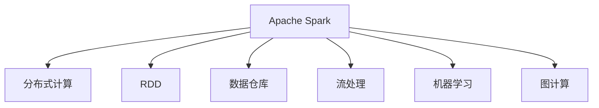

                 

# Spark 数据处理：大数据分析

> 关键词：Spark, 大数据, 分布式计算, 数据仓库, 机器学习, 流处理, 实时分析

## 1. 背景介绍

### 1.1 问题由来

随着互联网和物联网的迅速发展，数据量呈指数级增长，海量数据的存储和分析需求愈发迫切。大数据时代下，传统的集中式存储和处理方式难以满足实时性和扩展性的要求。为了应对数据量的爆炸性增长，大数据技术应运而生，旨在实现数据的高效存储和实时处理。其中，Apache Spark 以其高性能、易用性和丰富的生态系统，成为了大数据处理领域的主流工具之一。

### 1.2 问题核心关键点

Spark 是一个基于内存计算的开源分布式计算框架，支持大数据处理中的批处理、流处理、机器学习和图计算等多种数据处理任务。Spark 的核心思想是将计算任务划分为多个小的数据处理阶段，通过分布式并行计算加速处理速度，同时支持数据流式处理和实时计算。Spark 提供了强大的 SQL、MLlib、GraphX、Streaming 等组件，支持多种数据源和输出格式，极大地简化了大数据处理流程。

## 2. 核心概念与联系

### 2.1 核心概念概述

为更好地理解 Spark 在大数据分析中的应用，本节将介绍几个密切相关的核心概念：

- **Apache Spark**：Apache Spark 是一个开源的分布式计算框架，支持 SQL、流处理、机器学习和图计算等多种数据处理任务。Spark 的核心是 RDD（弹性分布式数据集），支持高效的数据处理和分析。

- **分布式计算**：分布式计算是将计算任务划分为多个小的子任务，并在多台计算节点上并行执行，以提高计算速度和处理能力。Spark 通过分布式计算，实现了数据处理的高效化和可扩展性。

- **RDD**：弹性分布式数据集（Resilient Distributed Dataset）是 Spark 中核心的数据抽象，支持数据的弹性存储和分布式计算。RDD 可以保存在内存中，也可以保存到磁盘上，并通过自动数据重分布，保证数据处理的可靠性和高效性。

- **数据仓库**：数据仓库是集中存储和管理企业级数据的解决方案，支持数据的存储、查询和管理。Spark 的 SQL 组件支持建立和查询数据仓库，实现数据的快速处理和分析。

- **流处理**：流处理是指实时处理和分析数据流，支持数据的实时查询和分析。Spark Streaming 组件提供流式处理能力，支持从 Hadoop、Kafka 等数据源实时读取数据，并进行流式计算。

- **机器学习**：机器学习是利用算法和模型进行数据预测和分类的技术，Spark MLlib 组件提供了丰富的机器学习算法和模型，支持数据的模型训练和预测。

- **图计算**：图计算是指对图数据进行分析和计算的技术，Spark GraphX 组件提供了图计算的 API，支持图的构建、查询和分析。

这些核心概念之间的逻辑关系可以通过以下 Mermaid 流程图来展示：



这个流程图展示了大数据处理的各个组件及其之间的联系：

1. Apache Spark 通过分布式计算实现数据的并行处理和优化。
2. RDD 作为 Spark 中的核心数据抽象，支持高效的数据存储和计算。
3. 数据仓库和 SQL 组件支持数据的存储和查询，实现数据的集中管理和分析。
4. 流处理组件提供实时数据流处理能力，支持数据的实时分析和查询。
5. 机器学习组件提供丰富的算法和模型，支持数据的预测和分类。
6. 图计算组件提供图数据处理和分析能力，支持复杂的图计算任务。

这些组件共同构成了 Spark 的核心技术栈，为大数据处理提供了全面的解决方案。

## 3. 核心算法原理 & 具体操作步骤

### 3.1 算法原理概述

Spark 的核心算法原理是分布式计算和弹性存储，通过将计算任务划分为多个小的子任务，并利用分布式计算框架并行处理数据，实现高效的数据处理和分析。Spark 的计算过程分为两个阶段：

1. **计算阶段**：将数据划分为多个小的数据集，并在分布式计算框架上并行计算，生成中间结果。
2. **存储阶段**：将中间结果保存在分布式文件系统中，并进行数据合并和聚合，最终生成最终结果。

在计算过程中，Spark 通过自动内存优化和数据分区策略，最大限度地利用计算资源，提高数据处理效率。Spark 还支持多种数据源和输出格式，包括 Hadoop 文件系统、Amazon S3、Hive、Parquet 等，方便数据的读取和存储。

### 3.2 算法步骤详解

Spark 数据处理的具体操作步骤可以分为以下几个步骤：

1. **数据源准备**：选择合适的数据源，如 Hadoop 文件系统、Amazon S3、Hive 等，并读取数据。

2. **数据转换**：对数据进行清洗、转换和聚合，生成中间结果。Spark 提供了丰富的数据转换操作，如 Filter、Map、Reduce、Join 等。

3. **数据存储**：将中间结果保存到分布式文件系统中，并进行数据合并和聚合。Spark 支持多种数据存储格式，如 Parquet、JSON、ORC 等。

4. **查询和分析**：对数据进行查询和分析，获取统计结果和可视化数据。Spark SQL 组件提供 SQL 查询接口，支持复杂的查询和聚合操作。

5. **机器学习**：对数据进行机器学习模型的训练和预测。Spark MLlib 组件提供了丰富的机器学习算法和模型，支持数据的模型训练和预测。

6. **图计算**：对图数据进行分析和计算。Spark GraphX 组件提供图计算的 API，支持图的构建、查询和分析。

### 3.3 算法优缺点

Spark 在大数据分析中具有以下优点：

1. **高性能**：Spark 基于内存计算，支持高效的分布式计算和数据处理。Spark 通过自动内存优化和数据分区策略，最大限度地利用计算资源，提高数据处理效率。

2. **易用性**：Spark 提供了丰富的 API 和组件，支持多种数据源和输出格式，极大简化了数据处理流程。Spark 支持 SQL、流处理、机器学习和图计算等多种数据处理任务，易于上手。

3. **可扩展性**：Spark 支持分布式计算，支持水平扩展和负载均衡，能够处理大规模数据集和复杂的计算任务。

4. **生态系统丰富**：Spark 有强大的生态系统支持，包括 PySpark、GraphX、MLlib 等组件，提供丰富的数据处理和分析功能。

5. **社区活跃**：Spark 社区活跃，更新频繁，支持新特性和功能的开发和改进。

同时，Spark 也存在一些缺点：

1. **内存占用高**：Spark 需要大量的内存进行数据处理，对于大规模数据集和复杂的计算任务，内存占用较高。

2. **资源管理复杂**：Spark 的资源管理需要手动调整，对于复杂的计算任务和集群规模，资源管理比较复杂。

3. **数据延迟**：Spark 的延迟较高，对于实时数据处理和流处理任务，可能存在数据延迟的问题。

4. **故障恢复**：Spark 的故障恢复机制相对简单，对于大规模集群和复杂的计算任务，故障恢复可能影响计算效率。

5. **学习曲线陡峭**：Spark 的学习曲线较为陡峭，对于初学者和新手，需要较长时间的学习和实践才能掌握。

### 3.4 算法应用领域

Spark 在大数据分析中的应用非常广泛，主要包括以下几个领域：

1. **数据仓库**：Spark SQL 和 Hive 组件支持数据的存储和查询，实现数据的集中管理和分析。Spark 的数据仓库功能可以支持大规模数据的存储和查询，提高数据处理效率。

2. **流处理**：Spark Streaming 组件提供流式处理能力，支持从 Hadoop、Kafka 等数据源实时读取数据，并进行流式计算。Spark 的流处理功能可以支持实时数据的处理和分析，提高实时数据的处理能力。

3. **机器学习**：Spark MLlib 组件提供丰富的机器学习算法和模型，支持数据的模型训练和预测。Spark 的机器学习功能可以支持大规模数据的模型训练和预测，提高数据处理和分析的效率。

4. **图计算**：Spark GraphX 组件提供图计算的 API，支持图的构建、查询和分析。Spark 的图计算功能可以支持大规模图数据的处理和分析，提高数据处理和分析的效率。

5. **大数据处理**：Spark 支持多种数据源和输出格式，包括 Hadoop 文件系统、Amazon S3、Hive、Parquet 等，方便数据的读取和存储。Spark 的大数据处理功能可以支持大规模数据的存储和处理，提高数据处理效率。

除了上述这些经典应用外，Spark 还可以应用于日志分析、智能推荐、广告推荐、社交网络分析、金融数据分析等场景，为大数据处理提供了强大的技术支持。

## 4. 数学模型和公式 & 详细讲解 & 举例说明

### 4.1 数学模型构建

Spark 中的数据处理主要依赖于 RDD，RDD 是 Spark 中核心的数据抽象，支持数据的弹性存储和分布式计算。RDD 可以保存在内存中，也可以保存到磁盘上，并通过自动数据重分布，保证数据处理的可靠性和高效性。

RDD 的核心数学模型是分布式集合，每个节点上保存一份数据集，数据集的大小可以动态调整，支持数据的并行处理和优化。RDD 的数据模型可以用以下公式表示：

$$ RDD = \{ (key, value) \} $$

其中，$key$ 表示数据的键，$value$ 表示数据值。

### 4.2 公式推导过程

在 Spark 中，RDD 的并行计算过程可以用以下公式表示：

$$ RDD_{new} = RDD_{old}.\text{map}(f) $$

其中，$f$ 表示数据转换函数，$RDD_{new}$ 表示转换后的数据集。

在分布式计算过程中，Spark 的自动内存优化和数据分区策略非常重要，以下是 Spark 中的数据分区和内存优化公式：

$$ \text{partition\_count} = \text{num\_partitions} $$

其中，$\text{partition\_count}$ 表示数据分区的数量，$\text{num\_partitions}$ 表示分区的数量。

$$ \text{spark.conf.set("spark.sql.shuffle.partitions", "10") $$

其中，$\text{spark.sql.shuffle.partitions}$ 表示数据分区的数量。

### 4.3 案例分析与讲解

以 Spark SQL 为例，展示 Spark 在数据仓库中的应用。Spark SQL 支持 SQL 查询和聚合操作，可以读取和处理大规模数据集，实现数据的集中管理和分析。

Spark SQL 的基本查询操作可以用以下 SQL 语句表示：

```sql
SELECT column1, column2, SUM(column3)
FROM table1
WHERE column1 = 'value1'
GROUP BY column1, column2
ORDER BY column1
```

其中，$\text{column1}$、$\text{column2}$、$\text{column3}$ 表示数据列，$\text{table1}$ 表示数据表，$\text{value1}$ 表示查询条件。

Spark SQL 支持复杂的查询和聚合操作，可以处理大规模数据集，实现数据的集中管理和分析。Spark SQL 的数据处理过程可以用以下公式表示：

$$ \text{result} = \text{table1}.\text{filter}(column1 = 'value1').\text{groupBy}(column1, column2).\text{sum}(column3).\text{sortBy}(column1) $$

其中，$\text{table1}$ 表示数据表，$\text{filter}$、$\text{groupBy}$、$\text{sum}$、$\text{sortBy}$ 表示数据转换操作。

## 5. 项目实践：代码实例和详细解释说明

### 5.1 开发环境搭建

在进行 Spark 数据处理实践前，我们需要准备好开发环境。以下是使用 PySpark 进行 Spark 数据处理的开发环境配置流程：

1. 安装 Apache Spark：从官网下载并安装 Spark，选择适合的操作系统和版本的 Spark。

2. 安装 PySpark：使用 pip 命令安装 PySpark，连接本地或远程的 Spark 集群。

```bash
pip install pyspark
```

3. 配置 PySpark：设置 PySpark 的集群参数，如集群地址、端口、节点数量等。

```python
spark = SparkSession.builder.master("spark://master:7077").appName("myapp").getOrCreate()
```

4. 安装其他依赖：安装常用的第三方库，如 NumPy、Pandas、Matplotlib 等。

```bash
pip install numpy pandas matplotlib
```

完成上述步骤后，即可在 PySpark 环境中进行数据处理实践。

### 5.2 源代码详细实现

下面以一个简单的数据处理示例，展示如何使用 PySpark 进行数据处理。

```python
from pyspark.sql import SparkSession

# 创建 SparkSession
spark = SparkSession.builder.master("spark://master:7077").appName("myapp").getOrCreate()

# 读取数据
data = spark.read.csv("hdfs://path/to/data.csv", header=True, inferSchema=True)

# 数据转换
data = data.filter(data["column1"] == "value1")

# 聚合操作
data = data.groupBy("column1", "column2").agg({"column3": "sum"})

# 排序操作
data = data.sortBy("column1")

# 显示结果
data.show()
```

### 5.3 代码解读与分析

让我们再详细解读一下关键代码的实现细节：

**SparkSession**：Spark 的高级 API，提供简单易用的数据处理接口。

**read.csv**：读取 CSV 格式的数据文件，并转换为 DataFrame 格式。

**filter**：对 DataFrame 进行筛选操作，只保留符合条件的数据行。

**groupBy**：对 DataFrame 进行分组操作，按照指定的列进行分组。

**agg**：对 DataFrame 进行聚合操作，计算指定列的总和。

**sortBy**：对 DataFrame 进行排序操作，按照指定的列进行排序。

**show**：将 DataFrame 转换为文本格式，并输出到控制台。

通过这些操作，即可实现对大规模数据的处理和分析。

## 6. 实际应用场景

### 6.1 智能推荐系统

Spark 的大数据处理能力可以应用于智能推荐系统的构建，帮助企业提升推荐系统的精度和效率。智能推荐系统通过分析用户的历史行为数据，生成个性化的推荐结果，提升用户体验和业务转化率。

在技术实现上，可以收集用户浏览、点击、评论、分享等行为数据，提取和用户交互的物品标题、描述、标签等文本内容。将文本内容作为模型输入，用户的后续行为（如是否点击、购买等）作为监督信号，在此基础上对预训练语言模型进行微调。微调后的模型能够从文本内容中准确把握用户的兴趣点。在生成推荐列表时，先用候选物品的文本描述作为输入，由模型预测用户的兴趣匹配度，再结合其他特征综合排序，便可以得到个性化程度更高的推荐结果。

### 6.2 金融数据分析

Spark 的大数据处理能力可以应用于金融数据分析，帮助金融机构提升风险控制和业务决策能力。金融行业需要实时监测市场舆论动向，以便及时应对负面信息传播，规避金融风险。通过收集金融领域相关的新闻、报道、评论等文本数据，并对其进行主题标注和情感标注，使用 Spark SQL 进行数据处理和分析，可以实时监测不同主题下的情感变化趋势，一旦发现负面信息激增等异常情况，系统便会自动预警，帮助金融机构快速应对潜在风险。

### 6.3 医疗数据分析

Spark 的大数据处理能力可以应用于医疗数据分析，帮助医疗机构提升诊断和治疗能力。医疗行业需要处理大量的患者数据，通过数据清洗、转换和聚合，可以提取有价值的信息，如疾病类型、治疗效果等。使用 Spark SQL 和 MLlib 进行数据分析和模型训练，可以生成更准确的预测结果，帮助医生进行诊断和治疗决策。

### 6.4 未来应用展望

随着 Spark 和 Hadoop 等大数据技术的发展，Spark 在未来会有更广泛的应用场景，进一步提升大数据处理的效率和精度。

在智慧城市治理中，Spark 可以应用于城市事件监测、舆情分析、应急指挥等环节，提高城市管理的自动化和智能化水平，构建更安全、高效的未来城市。

在智慧医疗领域，Spark 可以应用于患者数据处理、疾病预测、治疗方案推荐等环节，提升医疗服务的智能化水平，辅助医生诊疗，加速新药开发进程。

在智能教育领域，Spark 可以应用于作业批改、学情分析、知识推荐等环节，因材施教，促进教育公平，提高教学质量。

## 7. 工具和资源推荐

### 7.1 学习资源推荐

为了帮助开发者系统掌握 Spark 的数据处理理论基础和实践技巧，这里推荐一些优质的学习资源：

1. **《Apache Spark 快速入门》系列博客**：由 Apache Spark 官方提供的入门指南，详细介绍了 Spark 的核心概念和基本操作。

2. **《Apache Spark 官方文档》**：Spark 的官方文档，提供了完整的 API 和示例代码，是学习 Spark 的重要资源。

3. **《Spark 大数据处理实战》书籍**：深入浅出地介绍了 Spark 的核心技术和数据处理流程，适合实战练习。

4. **《Spark 大数据处理与机器学习》课程**：斯坦福大学开设的课程，涵盖 Spark 的数据处理、机器学习和图计算等内容，是学习 Spark 的重要参考。

5. **《Apache Spark 大数据处理实战》课程**：Coursera 提供的课程，涵盖 Spark 的基本操作、高级功能和应用案例，适合实战练习。

通过对这些资源的学习实践，相信你一定能够快速掌握 Spark 的数据处理精髓，并用于解决实际的业务问题。

### 7.2 开发工具推荐

高效的开发离不开优秀的工具支持。以下是几款用于 Spark 数据处理开发的常用工具：

1. **PySpark**：Python 语言下的 Spark 接口，提供了简单易用的 API 和组件，适合 Python 开发者的使用。

2. **Spark SQL**：Spark 的 SQL 组件，支持 SQL 查询和聚合操作，可以读取和处理大规模数据集，实现数据的集中管理和分析。

3. **Spark Streaming**：Spark 的流处理组件，支持实时数据流处理，可以从 Hadoop、Kafka 等数据源实时读取数据，并进行流式计算。

4. **Spark MLlib**：Spark 的机器学习组件，提供丰富的机器学习算法和模型，支持数据的模型训练和预测。

5. **Spark GraphX**：Spark 的图计算组件，提供图计算的 API，支持图的构建、查询和分析。

合理利用这些工具，可以显著提升 Spark 数据处理的开发效率，加快创新迭代的步伐。

### 7.3 相关论文推荐

Spark 的发展源于学界的持续研究。以下是几篇奠基性的相关论文，推荐阅读：

1. **《Spark: Cluster Computing with Fault Tolerance》**：Spark 的论文，介绍了 Spark 的分布式计算和内存优化技术。

2. **《Spark SQL: Querying Structured Data with SQL》**：Spark SQL 的论文，介绍了 Spark SQL 的 SQL 查询和聚合操作。

3. **《Spark Streaming: Towards Resilient Streaming Processing》**：Spark Streaming 的论文，介绍了 Spark Streaming 的流式处理和实时计算能力。

4. **《Spark MLlib: Machine Learning in Spark》**：Spark MLlib 的论文，介绍了 Spark MLlib 的机器学习算法和模型。

5. **《Spark GraphX: A Library for Distributed Graph Processing》**：Spark GraphX 的论文，介绍了 Spark GraphX 的图计算 API 和功能。

这些论文代表了大数据处理技术的发展脉络，通过学习这些前沿成果，可以帮助研究者把握学科前进方向，激发更多的创新灵感。

## 8. 总结：未来发展趋势与挑战

### 8.1 总结

本文对 Spark 在大数据分析中的应用进行了全面系统的介绍。首先阐述了 Spark 的核心算法原理和操作步骤，详细讲解了 Spark 在大数据处理中的高效性和可扩展性。其次，从原理到实践，详细讲解了 Spark 在大数据处理中的应用流程和核心组件，给出了完整的代码实例和详细解释。同时，本文还广泛探讨了 Spark 在智能推荐、金融数据分析、医疗数据分析等场景中的应用，展示了 Spark 的强大应用能力。最后，本文精选了 Spark 相关的学习资源和工具，力求为读者提供全方位的技术指引。

通过本文的系统梳理，可以看到，Spark 在大数据处理中的卓越表现和广泛应用，展示了分布式计算和内存优化技术的强大威力。Spark 的强大生态系统和丰富功能，使其成为大数据处理领域的主流工具，为数据处理提供了全面的解决方案。未来，伴随大数据技术的不断演进，Spark 必将在更多的应用领域发挥重要作用，推动大数据处理技术的不断创新和发展。

### 8.2 未来发展趋势

展望未来，Spark 大数据处理技术将呈现以下几个发展趋势：

1. **分布式计算性能提升**：随着硬件性能的提升和算法优化，Spark 的分布式计算性能将进一步提升，处理大规模数据集的能力将更强。

2. **内存优化技术改进**：Spark 的内存优化技术将不断改进，支持更多的数据类型和格式，提升数据处理的效率和精度。

3. **大数据处理流程简化**：Spark 的生态系统将不断丰富，提供更多的高层次 API 和组件，简化大数据处理流程，提高开发效率。

4. **流处理能力增强**：Spark Streaming 的流处理能力将进一步增强，支持更复杂的流处理任务，提升实时数据处理能力。

5. **机器学习功能完善**：Spark MLlib 的机器学习功能将不断完善，支持更多的算法和模型，提升数据分析和预测能力。

6. **图计算能力扩展**：Spark GraphX 的图计算能力将进一步扩展，支持更复杂的图计算任务，提升图数据处理能力。

这些趋势凸显了 Spark 在大数据处理领域的强大潜力和广泛应用前景，相信随着技术的不断演进，Spark 将为大数据处理带来更多的创新和突破。

### 8.3 面临的挑战

尽管 Spark 在大数据分析中取得了瞩目成就，但在迈向更加智能化、普适化应用的过程中，它仍面临诸多挑战：

1. **资源管理复杂**：Spark 的资源管理需要手动调整，对于复杂的计算任务和集群规模，资源管理比较复杂。

2. **内存占用高**：Spark 需要大量的内存进行数据处理，对于大规模数据集和复杂的计算任务，内存占用较高。

3. **延迟较高**：Spark 的延迟较高，对于实时数据处理和流处理任务，可能存在数据延迟的问题。

4. **故障恢复机制简单**：Spark 的故障恢复机制相对简单，对于大规模集群和复杂的计算任务，故障恢复可能影响计算效率。

5. **学习曲线陡峭**：Spark 的学习曲线较为陡峭，对于初学者和新手，需要较长时间的学习和实践才能掌握。

这些挑战需要技术社区和开发者共同努力，不断优化和改进，才能使 Spark 更好地服务于大数据处理需求。

### 8.4 研究展望

面对 Spark 大数据处理所面临的挑战，未来的研究需要在以下几个方面寻求新的突破：

1. **自动资源管理**：开发自动化的资源管理机制，自动调整集群资源配置，提升计算效率和稳定性。

2. **分布式计算优化**：优化分布式计算算法和数据分区策略，提升数据处理的效率和精度。

3. **内存优化技术**：改进内存优化技术，支持更多的数据类型和格式，提升数据处理的效率和精度。

4. **流处理性能提升**：提升流处理性能，支持更复杂的流处理任务，提升实时数据处理能力。

5. **机器学习功能扩展**：扩展机器学习功能，支持更多的算法和模型，提升数据分析和预测能力。

6. **图计算能力增强**：增强图计算能力，支持更复杂的图计算任务，提升图数据处理能力。

这些研究方向的探索，必将引领 Spark 大数据处理技术迈向更高的台阶，为大数据处理带来更多的创新和突破。面向未来，Spark 需要与其他大数据技术进行更深入的融合，如 Hadoop、Kafka、Hive 等，多路径协同发力，共同推动大数据处理技术的不断创新和发展。只有勇于创新、敢于突破，才能不断拓展 Spark 的边界，让大数据处理技术更好地服务于社会和经济的发展。

## 9. 附录：常见问题与解答

**Q1：Spark 与 Hadoop 有什么区别？**

A: Spark 与 Hadoop 都是大数据处理框架，但它们的设计理念和技术栈有所不同。Hadoop 是一个分布式计算平台，主要用于批处理和存储大规模数据，而 Spark 是一个基于内存的分布式计算框架，支持批处理、流处理、机器学习和图计算等多种数据处理任务。Spark 的主要优势在于高效的数据处理和内存优化，可以在短时间内处理大规模数据集。

**Q2：如何使用 Spark 进行机器学习？**

A: Spark 提供了丰富的机器学习组件 MLlib，支持多种机器学习算法和模型。使用 Spark MLlib 进行机器学习的主要步骤如下：

1. 数据预处理：使用 Spark SQL 进行数据清洗、转换和聚合，生成中间结果。

2. 模型训练：使用 Spark MLlib 提供的算法和模型进行模型训练，生成预测结果。

3. 模型评估：使用 Spark MLlib 提供的评估指标进行模型评估，选择最优的模型。

4. 模型应用：使用训练好的模型进行预测和分类，提升数据处理和分析能力。

**Q3：Spark 的分布式计算原理是什么？**

A: Spark 的分布式计算原理基于 RDD（弹性分布式数据集），RDD 是 Spark 中核心的数据抽象，支持数据的弹性存储和分布式计算。RDD 可以保存在内存中，也可以保存到磁盘上，并通过自动数据重分布，保证数据处理的可靠性和高效性。Spark 的分布式计算过程包括数据划分、任务调度、数据合并等步骤，通过并行计算和优化算法，提升数据处理的效率和精度。

**Q4：Spark 在流处理中的优势是什么？**

A: Spark Streaming 是 Spark 的流处理组件，支持实时数据流处理，可以从 Hadoop、Kafka 等数据源实时读取数据，并进行流式计算。Spark Streaming 的主要优势在于：

1. 高效的数据处理：Spark Streaming 支持并行处理和优化算法，可以高效处理大规模数据流。

2. 低延迟：Spark Streaming 的延迟较低，支持实时数据流的处理和分析。

3. 丰富的 API：Spark Streaming 提供丰富的 API 和组件，支持多种数据源和输出格式。

4. 支持多种流处理任务：Spark Streaming 支持多种流处理任务，如实时计算、窗口聚合、滑动窗口等。

**Q5：如何使用 Spark 进行数据仓库构建？**

A: Spark SQL 是 Spark 的 SQL 组件，支持 SQL 查询和聚合操作，可以读取和处理大规模数据集，实现数据的集中管理和分析。使用 Spark SQL 进行数据仓库构建的主要步骤如下：

1. 数据准备：收集和整理数据，进行数据清洗和转换。

2. 数据加载：使用 Spark SQL 的 DataFrame API 或 Spark Streaming 的流式处理接口，加载数据到 Spark 集群。

3. 数据存储：将数据保存到分布式文件系统中，如 Hadoop、Amazon S3 等。

4. 数据查询：使用 Spark SQL 的 SQL 查询接口，进行数据查询和分析。

5. 数据可视化：使用 Matplotlib、Bokeh 等工具，对数据进行可视化分析。

通过这些操作，即可实现数据的集中管理和分析，构建高效的数据仓库。

---

作者：禅与计算机程序设计艺术 / Zen and the Art of Computer Programming

