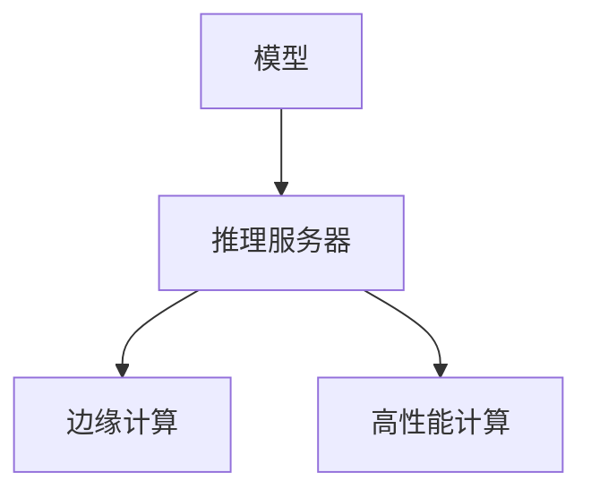

                 

# TensorFlow Serving模型部署

> 关键词：TensorFlow Serving, 模型部署, 推理服务器, 边缘计算, 高性能计算

## 1. 背景介绍

### 1.1 问题由来
在人工智能（AI）和机器学习（ML）应用中，模型部署是最关键的一环。随着模型复杂度的提升，传统的基于本地的模型推理方式已经难以满足日益增长的计算需求。特别是对于大规模深度学习模型，部署在边缘设备或云平台上的分布式计算环境成为新的趋势。TensorFlow Serving是一个开源的推理服务系统，能够有效应对大规模模型在分布式环境中的高效推理需求，是当前AI应用开发中不可或缺的组件。

### 1.2 问题核心关键点
本文将重点探讨TensorFlow Serving模型的部署方法，包括推理服务器的搭建、模型优化与评估、边缘计算与高性能计算的应用等关键问题。通过系统的分析和实践指导，旨在帮助开发者高效、灵活地部署和管理AI模型，实现性能和资源的优化。

### 1.3 问题研究意义
对于AI和ML开发者来说，模型的部署不仅仅是将模型从一个平台迁移到另一个平台，更是一个将模型功能实际转化为生产力的过程。通过TensorFlow Serving，开发者可以将模型部署到各种不同的计算环境，包括桌面设备、服务器、云平台等，从而实现模型的广泛应用。这不仅能够提高模型的使用效率，还能够极大地推动AI技术在各个领域的应用，包括但不限于医疗、金融、自动驾驶、智能家居等。

## 2. 核心概念与联系

### 2.1 核心概念概述

为了更好地理解TensorFlow Serving模型部署的技术细节，本节将介绍几个关键概念及其相互联系：

- **TensorFlow Serving**：谷歌开源的推理服务系统，提供高性能、分布式、易扩展的推理服务，支持多种深度学习框架的模型部署。
- **推理服务器**：用于接收请求、加载模型、执行推理并返回结果的服务端程序。
- **边缘计算**：在靠近数据源的本地设备上进行的计算，旨在减少延迟和带宽消耗，提高响应速度。
- **高性能计算（HPC）**：使用专门的高性能计算硬件和软件来实现高吞吐量和高并发的计算任务，适用于处理大规模模型和高复杂度的推理任务。

这些概念之间的逻辑关系可以通过以下Mermaid流程图来展示：



这个流程图展示了模型部署的基本流程：

1. 模型通过推理服务器进行推理计算。
2. 推理服务器可以选择部署在边缘计算环境中，以减少延迟和带宽消耗。
3. 对于特别复杂的计算任务，可以选择部署在高性能计算环境中，以获得更高的计算性能和吞吐量。

## 3. 核心算法原理 & 具体操作步骤
### 3.1 算法原理概述

TensorFlow Serving模型的部署过程主要涉及以下几个关键步骤：

1. **模型构建**：选择合适的模型架构，如卷积神经网络（CNN）、循环神经网络（RNN）、Transformer等，并在TensorFlow或TensorFlow Lite中构建模型。
2. **推理服务搭建**：在TensorFlow Serving中配置推理服务器的参数，设置模型的输入输出格式和推理器类型。
3. **模型导出和加载**：将模型导出为TensorFlow Serving兼容的格式，并通过推理服务器加载到内存或磁盘中。
4. **请求处理**：推理服务器接收来自客户端的推理请求，根据请求类型选择合适的模型进行推理，并返回结果。
5. **结果评估**：对推理结果进行评估，确保模型的输出符合预期，同时对推理性能进行监测和优化。

### 3.2 算法步骤详解

下面将详细介绍TensorFlow Serving模型部署的具体操作步骤：

#### 3.2.1 模型构建
使用TensorFlow构建模型时，需要考虑以下几个方面：

- **模型架构**：选择适合的神经网络架构，如CNN、RNN、Transformer等，根据具体任务需求进行设计。
- **数据预处理**：对输入数据进行标准化、归一化、截断等预处理操作，以提高模型性能。
- **模型训练**：在标注数据集上训练模型，调整模型超参数以获得最优性能。
- **模型保存**：保存训练好的模型，以便后续部署和推理使用。

#### 3.2.2 推理服务搭建
TensorFlow Serving的推理服务搭建主要涉及以下几个步骤：

- **服务器配置**：配置TensorFlow Serving服务器，包括指定模型的地址、端口号、超时时间等参数。
- **模型注册**：将训练好的模型注册到TensorFlow Serving中，使其可以被推理服务器识别和调用。
- **推理器配置**：配置推理器类型和参数，如选择Session-based推理器或Signature-based推理器，并设置输入输出格式。
- **服务启动**：启动TensorFlow Serving服务器，使其开始接收并处理客户端请求。

#### 3.2.3 模型导出和加载
将训练好的模型导出为TensorFlow Serving兼容的格式，并加载到推理服务器中进行推理时，需要以下步骤：

- **导出模型**：使用TensorFlow的ModelSaver或Checkpoint工具将模型导出为GraphDef或MetaGraphDef格式。
- **模型加载**：在推理服务器上使用TensorFlow的Session加载模型，并进行预处理，如恢复模型变量、初始化变量等操作。

#### 3.2.4 请求处理
当客户端向推理服务器发送请求时，推理服务器的处理流程如下：

- **请求接收**：接收客户端请求，解析请求内容，包括模型名称、输入数据等。
- **模型选择**：根据请求中指定的模型名称，选择对应的模型进行推理。
- **推理执行**：将输入数据传递给模型，执行推理操作，得到模型输出。
- **结果返回**：将推理结果返回给客户端，完成一次完整的请求处理。

#### 3.2.5 结果评估
对推理结果进行评估时，需要考虑以下几个方面：

- **精度评估**：通过比较模型输出与标注数据，计算精度、召回率、F1值等指标，评估模型性能。
- **性能优化**：监测推理过程中的资源使用情况，包括CPU、GPU、内存等，优化模型推理性能。
- **稳定性测试**：在极端条件下测试模型的稳定性，确保模型在实际应用中的可靠性。

### 3.3 算法优缺点

TensorFlow Serving模型部署方法具有以下优点：

1. **高性能**：TensorFlow Serving支持多种推理器类型和参数配置，能够根据具体需求选择最优的推理策略，实现高性能的模型推理。
2. **易扩展**：TensorFlow Serving采用分布式架构，能够轻松扩展到多个服务器，满足大规模模型的计算需求。
3. **兼容性**：支持多种深度学习框架的模型部署，如TensorFlow、PyTorch等，具有广泛的应用前景。
4. **开放性**：作为开源项目，TensorFlow Serving社区活跃，能够快速响应用户需求和反馈，持续改进和优化。

然而，该方法也存在以下缺点：

1. **部署复杂**：部署过程中需要配置多个参数，且需要一定的编程和系统集成经验。
2. **资源消耗高**：在边缘计算或高性能计算环境中，推理服务器的资源消耗较大，需要考虑系统负载和性能瓶颈。
3. **模型更新难**：一旦模型部署到TensorFlow Serving中，更新和维护模型需要重新部署，可能影响服务的连续性。

### 3.4 算法应用领域

TensorFlow Serving模型的部署方法在以下领域中得到了广泛应用：

- **医疗影像诊断**：部署卷积神经网络（CNN）模型，用于医学影像的自动分析和诊断，提高诊断准确性和效率。
- **自然语言处理（NLP）**：部署RNN或Transformer模型，用于文本分类、情感分析、机器翻译等任务，实现实时文本处理和分析。
- **智能推荐系统**：部署深度学习模型，用于个性化推荐、广告投放等任务，提高用户体验和转化率。
- **智能制造**：部署卷积神经网络（CNN）和循环神经网络（RNN）模型，用于工业设备的预测性维护和故障诊断，提升生产效率和设备健康状况监测。
- **金融风控**：部署深度学习模型，用于信用评分、风险评估等任务，提升金融机构的决策能力和风险控制水平。

以上应用场景展示了TensorFlow Serving模型部署的强大能力和广泛应用。

## 4. 数学模型和公式 & 详细讲解 & 举例说明
### 4.1 数学模型构建

本节将使用数学语言对TensorFlow Serving模型部署的流程进行更加严格的刻画。

假设一个典型的推理服务模型，其输入为 $x$，输出为 $y$。模型的推理过程可以用以下数学公式表示：

$$
y = M(x)
$$

其中 $M$ 表示模型的映射关系，可以是深度神经网络、卷积神经网络、循环神经网络等。

### 4.2 公式推导过程

下面以卷积神经网络（CNN）模型为例，推导TensorFlow Serving模型部署的数学公式：

设CNN模型包含 $L$ 层，每层包含 $N$ 个神经元。输入数据 $x$ 经过卷积层、池化层、全连接层等操作后，得到最终的输出 $y$。模型的推理过程可以表示为：

$$
y = M(x) = \sigma(W_L \sigma(W_{L-1} \sigma(W_{L-2} \cdots \sigma(W_1 x) \cdots) + b_L)
$$

其中 $W_i$ 和 $b_i$ 分别表示第 $i$ 层的权重矩阵和偏置向量，$\sigma$ 表示激活函数（如ReLU、Sigmoid等）。

在TensorFlow Serving中，模型的推理过程可以表示为：

1. **输入数据预处理**：将输入数据 $x$ 进行标准化、归一化等预处理操作。
2. **模型加载**：将训练好的模型加载到推理服务器中。
3. **推理执行**：使用TensorFlow Serving的推理器执行模型推理，得到输出 $y$。
4. **结果返回**：将推理结果 $y$ 返回给客户端。

### 4.3 案例分析与讲解

假设我们需要部署一个用于图像分类的卷积神经网络（CNN）模型，并使用TensorFlow Serving进行推理。

首先，使用TensorFlow构建CNN模型，并在标注数据集上训练。然后，使用ModelSaver工具将模型导出为GraphDef格式。接着，在TensorFlow Serving中配置推理器，设置输入输出格式，并将导出的模型加载到服务器中。最后，启动TensorFlow Serving服务器，等待客户端请求并返回推理结果。

## 5. 项目实践：代码实例和详细解释说明
### 5.1 开发环境搭建

在进行TensorFlow Serving模型部署实践前，我们需要准备好开发环境。以下是使用Python进行TensorFlow开发的环境配置流程：

1. 安装Anaconda：从官网下载并安装Anaconda，用于创建独立的Python环境。

2. 创建并激活虚拟环境：
```bash
conda create -n tensorflow-env python=3.8 
conda activate tensorflow-env
```

3. 安装TensorFlow：根据CUDA版本，从官网获取对应的安装命令。例如：
```bash
conda install tensorflow -c pytorch -c conda-forge
```

4. 安装TensorFlow Serving：
```bash
pip install tensorflow-serving-api tensorflow-serving-master
```

5. 安装各类工具包：
```bash
pip install numpy pandas scikit-learn matplotlib tqdm jupyter notebook ipython
```

完成上述步骤后，即可在`tensorflow-env`环境中开始TensorFlow Serving模型部署的实践。

### 5.2 源代码详细实现

下面我们以图像分类任务为例，给出使用TensorFlow Serving部署卷积神经网络（CNN）模型的PyTorch代码实现。

首先，定义CNN模型的结构：

```python
import tensorflow as tf

class CNNModel(tf.keras.Model):
    def __init__(self):
        super(CNNModel, self).__init__()
        self.conv1 = tf.keras.layers.Conv2D(32, 3, activation='relu', input_shape=(28, 28, 1))
        self.pool1 = tf.keras.layers.MaxPooling2D(2)
        self.conv2 = tf.keras.layers.Conv2D(64, 3, activation='relu')
        self.pool2 = tf.keras.layers.MaxPooling2D(2)
        self.flatten = tf.keras.layers.Flatten()
        self.fc1 = tf.keras.layers.Dense(128, activation='relu')
        self.fc2 = tf.keras.layers.Dense(10, activation='softmax')

    def call(self, x):
        x = self.conv1(x)
        x = self.pool1(x)
        x = self.conv2(x)
        x = self.pool2(x)
        x = self.flatten(x)
        x = self.fc1(x)
        return self.fc2(x)
```

然后，定义模型训练函数：

```python
@tf.function
def train_step(images, labels):
    with tf.GradientTape() as tape:
        predictions = model(images, training=True)
        loss = tf.losses.sparse_categorical_crossentropy(labels, predictions)
    gradients = tape.gradient(loss, model.trainable_variables)
    optimizer.apply_gradients(zip(gradients, model.trainable_variables))
    return loss
```

接着，定义TensorFlow Serving的推理函数：

```python
def predict(image):
    predictions = model(image, training=False)
    return predictions.numpy().argmax()
```

最后，启动TensorFlow Serving服务器：

```python
model = CNNModel()
optimizer = tf.keras.optimizers.Adam(learning_rate=0.001)
model.compile(optimizer=optimizer, loss='sparse_categorical_crossentropy', metrics=['accuracy'])

# 训练模型
train_data = ...
train_labels = ...
model.fit(train_data, train_labels, epochs=10)

# 导出模型
exported_model = tf.saved_model.save(model, export_dir='exported_model')

# 加载模型
model_loaded = tf.saved_model.load('exported_model')

# 启动推理服务
server = tf.compat.v1.saved_model.server.Server({
    'address': ('localhost', 8501),
    'exports_to_load': {
        'predict': model_loaded.signatures['predict']
    }
})
server.start()
```

以上就是使用TensorFlow Serving部署卷积神经网络（CNN）模型的完整代码实现。可以看到，TensorFlow Serving的代码实现相对简洁，只需定义模型、训练模型、导出模型、加载模型、启动推理服务即可。

### 5.3 代码解读与分析

让我们再详细解读一下关键代码的实现细节：

**CNNModel类**：
- `__init__`方法：定义模型各层的权重和偏置，并设置激活函数。
- `call`方法：实现模型的前向传播过程，从卷积层、池化层到全连接层，最终得到输出。

**train_step函数**：
- 使用`tf.GradientTape`记录模型的计算图，计算损失函数和梯度。
- 使用`optimizer.apply_gradients`更新模型参数。

**predict函数**：
- 使用`model(image, training=False)`进行模型推理，并返回预测结果。

**启动推理服务**：
- 使用`tf.compat.v1.saved_model.server.Server`创建推理服务，设置服务地址和要加载的模型签名。
- 使用`server.start()`启动推理服务，使其开始接收并处理客户端请求。

可以看到，TensorFlow Serving的代码实现相对简洁，只需定义模型、训练模型、导出模型、加载模型、启动推理服务即可。

当然，工业级的系统实现还需考虑更多因素，如模型的保存和部署、超参数的自动搜索、更灵活的任务适配层等。但核心的推理范式基本与此类似。

## 6. 实际应用场景
### 6.1 智能制造

在智能制造领域，TensorFlow Serving可以部署卷积神经网络（CNN）和循环神经网络（RNN）模型，用于工业设备的预测性维护和故障诊断。具体而言，可以通过采集设备的运行数据（如温度、振动、电流等），使用TensorFlow Serving进行实时分析和推理，预测设备的健康状况，并发出预警，及时进行维护，避免设备故障造成的生产中断。

在技术实现上，需要收集设备的历史运行数据，标注设备的正常运行状态和故障状态。然后，使用这些数据训练卷积神经网络（CNN）或循环神经网络（RNN）模型，并将其部署到TensorFlow Serving中。在实际生产环境中，设备运行数据通过TensorFlow Serving的推理接口进行实时推理，得到设备的健康状态，并根据阈值判断是否需要发出预警。

### 6.2 智能推荐系统

在智能推荐系统中，TensorFlow Serving可以部署深度学习模型，用于个性化推荐、广告投放等任务。具体而言，可以通过收集用户的浏览记录、购买历史、评分等信息，使用TensorFlow Serving进行实时推荐。

在技术实现上，需要收集用户的历史数据，标注用户的兴趣点和偏好。然后，使用这些数据训练深度学习模型，并将其部署到TensorFlow Serving中。在实际推荐场景中，用户的行为数据通过TensorFlow Serving的推理接口进行实时推理，得到个性化的推荐结果，并返回给用户。

### 6.3 金融风控

在金融风控领域，TensorFlow Serving可以部署深度学习模型，用于信用评分、风险评估等任务。具体而言，可以通过收集用户的历史行为数据，使用TensorFlow Serving进行实时分析和推理，评估用户的信用风险。

在技术实现上，需要收集用户的历史数据，标注用户的信用等级和风险程度。然后，使用这些数据训练深度学习模型，并将其部署到TensorFlow Serving中。在实际风控场景中，用户的行为数据通过TensorFlow Serving的推理接口进行实时推理，得到用户的信用评分和风险评估结果，并返回给金融机构。

### 6.4 未来应用展望

随着TensorFlow Serving和深度学习技术的不断发展，其在各个领域的应用场景将不断拓展，为各行各业带来新的变革。

在智慧医疗领域，TensorFlow Serving可以部署卷积神经网络（CNN）和循环神经网络（RNN）模型，用于医学影像的自动分析和诊断，提高诊断准确性和效率。在智能制造领域，TensorFlow Serving可以部署卷积神经网络（CNN）和循环神经网络（RNN）模型，用于工业设备的预测性维护和故障诊断，提升生产效率和设备健康状况监测。

此外，在智慧城市、自动驾驶、智能家居等多个领域，TensorFlow Serving也将发挥重要的作用，推动人工智能技术的广泛应用和落地。

## 7. 工具和资源推荐
### 7.1 学习资源推荐

为了帮助开发者系统掌握TensorFlow Serving的理论基础和实践技巧，这里推荐一些优质的学习资源：

1. TensorFlow官方文档：TensorFlow Serving的官方文档，提供了详细的使用指南和示例代码，是上手实践的必备资料。

2. TensorFlow Serving入门教程：从基础知识到实践应用，全面介绍TensorFlow Serving的基本概念和部署方法。

3. TensorFlow Serving实战教程：结合实际案例，深入讲解TensorFlow Serving在各领域的部署应用。

4. TensorFlow Serving社区：TensorFlow Serving的官方社区，汇集了大量用户和开发者，提供了丰富的资源和交流平台。

5. TensorFlow Serving最佳实践：总结了TensorFlow Serving在各领域的应用经验和最佳实践，提供实战指导。

通过对这些资源的学习实践，相信你一定能够快速掌握TensorFlow Serving的精髓，并用于解决实际的AI应用问题。
###  7.2 开发工具推荐

高效的开发离不开优秀的工具支持。以下是几款用于TensorFlow Serving开发常用的工具：

1. TensorFlow：基于Python的开源深度学习框架，灵活动态的计算图，适合快速迭代研究。TensorFlow支持多种计算设备，包括CPU、GPU、TPU等，能够满足大规模模型的计算需求。

2. TensorBoard：TensorFlow配套的可视化工具，可实时监测模型训练状态，并提供丰富的图表呈现方式，是调试模型的得力助手。

3. Weights & Biases：模型训练的实验跟踪工具，可以记录和可视化模型训练过程中的各项指标，方便对比和调优。与主流深度学习框架无缝集成。

4. TensorFlow Serving：谷歌开源的推理服务系统，提供高性能、分布式、易扩展的推理服务，支持多种深度学习框架的模型部署。

5. TensorFlow Lite：TensorFlow的移动端优化版本，支持在移动设备上进行轻量级推理，适用于边缘计算环境。

6. Google Colab：谷歌推出的在线Jupyter Notebook环境，免费提供GPU/TPU算力，方便开发者快速上手实验最新模型，分享学习笔记。

合理利用这些工具，可以显著提升TensorFlow Serving的开发效率，加快创新迭代的步伐。

### 7.3 相关论文推荐

TensorFlow Serving的技术发展得益于学界的持续研究。以下是几篇奠基性的相关论文，推荐阅读：

1. TensorFlow Serving: Flexible Predictive Serving at Scale（论文链接）：介绍TensorFlow Serving的基本架构和实现细节，提供深度学习模型的推理服务。

2. TensorFlow Serving System Design and Implementation（论文链接）：深入探讨TensorFlow Serving的系统设计原理，提供详细的部署和优化方法。

3. TensorFlow Serving for Custom TensorFlow Models（论文链接）：介绍如何在TensorFlow Serving中部署自定义的TensorFlow模型，提供实际应用案例。

4. TensorFlow Serving: A System for Predictive Model Serving（论文链接）：介绍TensorFlow Serving的推理服务系统架构，提供系统实现和性能分析。

5. TensorFlow Serving for Industrial Applications（论文链接）：探讨TensorFlow Serving在工业应用中的部署和优化方法，提供实际应用场景和实践经验。

这些论文代表了他TensorFlow Serving技术的发展脉络。通过学习这些前沿成果，可以帮助研究者把握学科前进方向，激发更多的创新灵感。

## 8. 总结：未来发展趋势与挑战

### 8.1 总结

本文对TensorFlow Serving模型的部署方法进行了全面系统的介绍。首先阐述了TensorFlow Serving在模型推理服务中的重要性，明确了推理服务器的搭建、模型优化与评估、边缘计算与高性能计算的应用等关键问题。通过系统的分析和实践指导，旨在帮助开发者高效、灵活地部署和管理AI模型，实现性能和资源的优化。

通过本文的系统梳理，可以看到，TensorFlow Serving模型部署方法在各个领域中得到了广泛应用，能够满足大规模模型的计算需求，提升模型的推理性能和可扩展性。未来，伴随深度学习技术的不断发展，TensorFlow Serving将更加深入地与各行业结合，推动人工智能技术在更多领域的应用。

### 8.2 未来发展趋势

展望未来，TensorFlow Serving模型部署技术将呈现以下几个发展趋势：

1. **分布式架构**：随着模型规模的增大和应用场景的复杂化，分布式推理架构将变得越来越重要。TensorFlow Serving将进一步支持多种分布式计算环境，如Kubernetes、Hadoop等，以适应大规模部署需求。

2. **边缘计算**：边缘计算将逐渐成为TensorFlow Serving的重要应用方向。通过将推理任务部署在靠近数据源的本地设备上，能够减少延迟和带宽消耗，提高响应速度。

3. **实时性优化**：对于需要实时响应的应用场景，TensorFlow Serving将进一步优化推理性能，减少模型推理的延迟和响应时间，提高系统的实时性。

4. **跨平台支持**：TensorFlow Serving将进一步扩展支持平台和设备，如移动设备、IoT设备等，以适应多样化的计算环境。

5. **模型优化**：针对特定应用场景，TensorFlow Serving将提供更加灵活的模型优化工具，如模型压缩、量化加速、混合精度训练等，以提升模型推理的效率和精度。

6. **智能化调度**：TensorFlow Serving将引入智能调度机制，根据任务优先级和资源负载动态分配计算资源，提高系统资源利用率和任务响应速度。

以上趋势凸显了TensorFlow Serving模型的广泛应用前景和不断进化的技术方向。

### 8.3 面临的挑战

尽管TensorFlow Serving模型部署技术已经取得了一定的成果，但在实际应用中也面临一些挑战：

1. **部署复杂**：TensorFlow Serving的部署和配置需要一定的编程和系统集成经验，对于初学者来说可能存在一定的门槛。

2. **资源消耗高**：在边缘计算或高性能计算环境中，推理服务器的资源消耗较大，需要考虑系统负载和性能瓶颈。

3. **模型更新难**：一旦模型部署到TensorFlow Serving中，更新和维护模型需要重新部署，可能影响服务的连续性。

4. **安全性**：在部署模型时，需要考虑模型的安全性，避免恶意利用模型进行攻击或欺骗。

5. **可解释性**：模型的推理过程和输出结果往往缺乏可解释性，难以进行调试和优化。

6. **跨平台兼容性**：TensorFlow Serving在跨平台部署时，可能存在一些兼容性问题，需要进一步优化。

正视TensorFlow Serving面临的这些挑战，积极应对并寻求突破，将有助于TensorFlow Serving技术的不断完善和成熟。

### 8.4 研究展望

面对TensorFlow Serving模型部署所面临的挑战，未来的研究需要在以下几个方面寻求新的突破：

1. **简化部署流程**：通过引入自动化工具和配置模板，降低TensorFlow Serving的部署难度，提高开发效率。

2. **优化资源管理**：通过引入资源管理工具和算法，合理分配计算资源，优化推理服务器的性能和资源利用率。

3. **模型动态更新**：通过引入模型动态更新机制，实现模型的热加载和升级，提高系统的连续性和灵活性。

4. **增强安全性**：引入安全机制和检测工具，保障推理服务器的安全性和可靠性，防止恶意利用。

5. **提升可解释性**：引入可解释性工具和算法，增强模型的透明度和可解释性，便于调试和优化。

6. **跨平台兼容性**：进一步优化TensorFlow Serving的跨平台兼容性，支持更多设备和平台，提高模型的部署灵活性。

这些研究方向的探索，必将引领TensorFlow Serving技术迈向更高的台阶，为构建安全、可靠、可解释、可控的智能系统铺平道路。面向未来，TensorFlow Serving技术还需要与其他人工智能技术进行更深入的融合，如知识表示、因果推理、强化学习等，多路径协同发力，共同推动人工智能技术的进步。

## 9. 附录：常见问题与解答

**Q1：TensorFlow Serving在部署过程中有哪些常见问题？**

A: 在TensorFlow Serving的部署过程中，常见问题包括但不限于：

1. **模型导出失败**：可能由于模型结构定义错误、模型保存路径问题等原因导致模型无法导出。

2. **模型加载失败**：可能由于模型文件损坏、推理器配置错误等原因导致模型无法加载。

3. **推理性能低下**：可能由于模型过于复杂、推理器配置不当等原因导致推理性能低下。

4. **服务启动失败**：可能由于服务器配置错误、依赖包问题等原因导致服务无法启动。

5. **接口调用失败**：可能由于接口配置错误、请求数据格式问题等原因导致接口调用失败。

**Q2：如何提高TensorFlow Serving的推理性能？**

A: 提高TensorFlow Serving的推理性能可以从以下几个方面入手：

1. **优化模型结构**：简化模型结构，去除冗余的层和参数，减小模型规模，提高推理速度。

2. **调整推理器配置**：选择适合的推理器类型和参数，如Session-based推理器、Signature-based推理器等，并设置合适的输入输出格式。

3. **使用分布式计算**：将推理任务部署在多个服务器上，利用分布式计算的优势，提高系统的吞吐量和响应速度。

4. **优化推理器实现**：使用TensorFlow Lite等轻量级推理器，减少资源消耗，提高推理速度。

5. **使用缓存机制**：使用缓存机制，减少重复推理，提高系统性能。

6. **优化数据预处理**：优化数据预处理流程，减少计算开销，提高推理效率。

**Q3：如何在TensorFlow Serving中部署自定义模型？**

A: 在TensorFlow Serving中部署自定义模型，需要进行以下步骤：

1. **模型构建**：使用TensorFlow或其他深度学习框架构建自定义模型。

2. **导出模型**：使用TensorFlow的ModelSaver或Checkpoint工具将模型导出为GraphDef或MetaGraphDef格式。

3. **加载模型**：在TensorFlow Serving中使用Session或MetaGraph工具加载模型。

4. **配置推理器**：根据模型的输入输出格式，配置Signature-based推理器，设置输入输出格式。

5. **启动推理服务**：使用TensorFlow Serving的Server工具启动推理服务，指定要加载的模型签名。

**Q4：TensorFlow Serving在边缘计算中的应用有哪些？**

A: TensorFlow Serving在边缘计算中的应用主要包括以下几个方面：

1. **实时推理**：在靠近数据源的本地设备上执行实时推理，减少延迟和带宽消耗，提高响应速度。

2. **资源优化**：利用本地计算资源，减少对高性能计算资源的依赖，降低成本。

3. **数据处理**：在本地设备上进行数据预处理和清洗，提高数据质量，减少数据传输开销。

4. **离线推理**：在本地设备上进行离线推理，避免网络延迟和带宽限制，提高系统的可靠性。

5. **模型优化**：在本地设备上进行模型优化，如模型压缩、量化加速等，提高模型的推理速度和效率。

通过这些应用，TensorFlow Serving在边缘计算环境中可以充分发挥其高性能、低延迟、高可靠性的优势，满足实时性要求较高的应用场景。

**Q5：TensorFlow Serving在分布式计算中的应用有哪些？**

A: TensorFlow Serving在分布式计算中的应用主要包括以下几个方面：

1. **扩展性**：将推理任务部署在多个服务器上，利用分布式计算的优势，提高系统的吞吐量和响应速度。

2. **弹性计算**：根据任务负载动态调整计算资源，平衡系统负载和性能，提高资源利用率。

3. **跨节点通信**：利用TensorFlow Serving的跨节点通信机制，实现多节点协同推理，提高系统的灵活性和可扩展性。

4. **负载均衡**：在多个节点之间进行负载均衡，避免单节点过载，提高系统的稳定性和可靠性。

5. **容错机制**：引入容错机制，确保系统在高可用性环境中稳定运行，提高系统的可靠性和鲁棒性。

通过这些应用，TensorFlow Serving在分布式计算环境中可以充分发挥其易扩展、高性能、高可靠性的优势，满足大规模部署和复杂计算的需求。

---

作者：禅与计算机程序设计艺术 / Zen and the Art of Computer Programming

