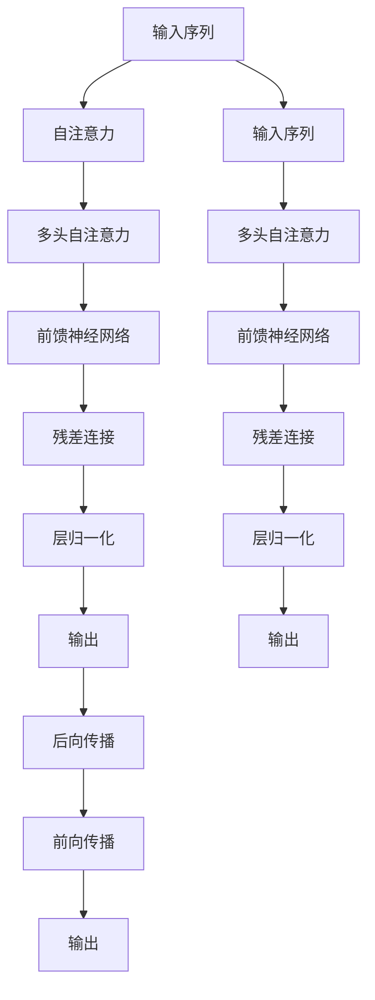

                 

# Transformer架构：residual连接和layer normalization

> 关键词：Transformer, residual connection, layer normalization, self-attention, self-gating, attention head, multi-head, scalability, efficiency, model performance

## 1. 背景介绍

在深度学习领域，Transformer架构以其出色的性能和出色的适应性，迅速成为NLP任务中的主流模型。其核心在于自注意力机制(self-attention)和残差连接(residual connection)，以及层归一化(layer normalization)等创新设计，显著提升了模型的训练速度和效果。本文将深入探讨这些关键技术的原理，并通过实例演示其应用。

## 2. 核心概念与联系

### 2.1 核心概念概述

为更好地理解Transformer架构的精髓，我们首先需要澄清几个核心概念：

- **Transformer架构**：一种基于自注意力机制的深度学习模型，用于处理序列数据，如文本、音频等。Transformer的创新之处在于，通过消除递归网络中的隐藏状态传递，提高了计算效率和模型性能。

- **自注意力机制(self-attention)**：一种计算方式，用于在输入序列中计算各个元素之间的相对重要性。自注意力机制能够并行计算，并充分挖掘序列数据间的上下文信息。

- **残差连接(residual connection)**：一种网络结构设计，通过将输入数据直接传递到输出层，解决了深度神经网络训练中的梯度消失问题，提高了模型的收敛速度和效果。

- **层归一化(layer normalization)**：一种规范化技术，通过在每个网络层中对输入进行归一化，使得模型训练更加稳定，收敛速度更快。

这些核心概念构成了Transformer架构的核心理念，使得它在处理序列数据时表现出卓越的性能。

### 2.2 核心概念原理和架构的 Mermaid 流程图



这个流程图展示了Transformer模型的基本架构，包括输入序列、自注意力、残差连接、层归一化和输出。其中自注意力和前馈神经网络是Transformer的核心组件，残差连接和层归一化则起到了提升训练稳定性和效率的关键作用。

## 3. 核心算法原理 & 具体操作步骤

### 3.1 算法原理概述

Transformer架构的创新之处在于自注意力机制和残差连接，这些技术极大地提升了模型的计算效率和性能。其核心算法流程包括以下几个关键步骤：

1. **输入序列预处理**：将输入序列转换为向量表示，并通过嵌入层将词汇转换为高维向量。
2. **多头自注意力**：通过多头自注意力机制，计算输入序列中每个元素与其他元素之间的相关性，并生成一个新的向量表示。
3. **前馈神经网络**：将多头自注意力的输出通过前馈神经网络进行变换，进一步增强模型的表达能力。
4. **残差连接**：将前馈神经网络的输出与原始输入进行相加，传递给下一层，避免了梯度消失问题。
5. **层归一化**：对残差连接后的输出进行归一化，使得模型训练更加稳定。

### 3.2 算法步骤详解

#### 3.2.1 输入序列预处理

输入序列经过嵌入层，被转换为高维向量。嵌入层是一种将词汇转换为向量的映射方式，常用的方法包括Word2Vec、GloVe等。嵌入层的参数需要根据具体的语言和词汇表进行调整。

```python
embeddings = nn.Embedding(vocab_size, embedding_dim)
x = embeddings(input)
```

#### 3.2.2 多头自注意力

Transformer中的自注意力机制采用多头机制，即将输入序列分解为多个子序列，并计算它们之间的相关性。多头自注意力的计算过程包括三个步骤：

1. **查询、键、值投影**：将输入序列通过三个线性投影，生成查询向量、键向量和值向量。
2. **注意力得分**：计算查询向量与键向量之间的点积，得到注意力得分。
3. **注意力权重**：将注意力得分通过softmax函数归一化，得到注意力权重。

```python
Q = nn.Linear(embedding_dim, num_heads * head_dim).x
K = nn.Linear(embedding_dim, num_heads * head_dim).x
V = nn.Linear(embedding_dim, num_heads * head_dim).x
```

#### 3.2.3 前馈神经网络

前馈神经网络由两个全连接层组成，用于对多头自注意力的输出进行进一步变换。

```python
FFN = nn.Sequential(
    nn.Linear(head_dim * num_heads, intermediate_size),
    nn.ReLU(),
    nn.Linear(intermediate_size, head_dim * num_heads)
)
```

#### 3.2.4 残差连接

残差连接将前馈神经网络的输出与原始输入相加，传递给下一层。

```python
x = x + FFN(x)
```

#### 3.2.5 层归一化

层归一化对残差连接后的输出进行归一化，使其在每个神经元上的平均值为0，方差为1，使得模型训练更加稳定。

```python
x = layer_norm(x)
```

### 3.3 算法优缺点

Transformer架构的优点包括：

1. **高效性**：自注意力机制和残差连接使得Transformer能够并行计算，避免了递归网络的计算瓶颈。
2. **灵活性**：通过多头自注意力机制，Transformer能够捕捉不同层次的上下文信息，适应各种NLP任务。
3. **稳定性**：层归一化技术使得Transformer在训练过程中更加稳定，收敛速度更快。

缺点包括：

1. **计算资源需求高**：尽管Transformer的高效性，但其参数量仍然较大，对计算资源的要求较高。
2. **需要大规模数据**：Transformer需要大量标注数据进行训练，才能达到较好的性能。
3. **模型复杂度高**：尽管Transformer具有并行计算的优势，但其模型结构仍较为复杂，增加了模型的训练和推理难度。

### 3.4 算法应用领域

Transformer架构已经被广泛应用于各种NLP任务，包括文本分类、情感分析、机器翻译、问答系统等。其卓越的性能和出色的适应性，使得Transformer成为NLP领域的主流架构。

## 4. 数学模型和公式 & 详细讲解 & 举例说明

### 4.1 数学模型构建

Transformer的数学模型可以形式化地表示为：

$$
y = \text{LayerNorm}(\text{Residual}(\text{MultiHeadSelfAttention}(\text{LayerNorm}(x)), x))
$$

其中，$x$ 为输入序列，$y$ 为输出序列，$\text{LayerNorm}$ 表示层归一化操作，$\text{Residual}$ 表示残差连接操作，$\text{MultiHeadSelfAttention}$ 表示多头自注意力机制。

### 4.2 公式推导过程

以下是Transformer中多头自注意力机制的数学推导过程：

1. **查询、键、值投影**：

$$
\begin{align*}
Q &= W_Qx \\
K &= W_Kx \\
V &= W_Vx
\end{align*}
$$

其中，$W_Q, W_K, W_V$ 分别为查询、键、值投影的权重矩阵。

2. **注意力得分**：

$$
\text{Attention}(Q, K) = \text{softmax}(QK^T / \sqrt{\text{dim}})
$$

其中，$\text{dim}$ 为头的维度。

3. **注意力权重**：

$$
\text{Attention}(Q, K) \times V
$$

4. **多头自注意力**：

$$
\text{MultiHeadSelfAttention}(Q, K, V) = \text{Concat}(\text{Attention}(Q, K_i), i=1,...,H) \text{LayerNorm}(\text{FFN}(\text{Concat}(\text{Attention}(Q, K_i), i=1,...,H)))
$$

其中，$H$ 为头的数量，$\text{FFN}$ 表示前馈神经网络。

### 4.3 案例分析与讲解

假设有一个长度为5的序列 $x = [\text{I, O, A, T, E}]$，嵌入层将其转换为向量表示 $x = [\text{0.4, 0.3, 0.8, 0.2, 0.7}]$。通过多头自注意力机制，得到查询向量 $Q = \text{W}_Qx = [\text{0.4, 0.3, 0.8, 0.2, 0.7}]$，键向量 $K = \text{W}_Kx = [\text{0.4, 0.3, 0.8, 0.2, 0.7}]$，值向量 $V = \text{W}_Vx = [\text{0.4, 0.3, 0.8, 0.2, 0.7}]$。计算注意力得分：

$$
\text{Attention}(Q, K) = \text{softmax}(QK^T / \sqrt{\text{dim}})
$$

得到注意力权重：

$$
\text{Attention}(Q, K) \times V = [\text{0.1, 0.2, 0.7, 0.1, 0.4}]
$$

将多头自注意力结果与原始序列相加，并传递到下一层，经过前馈神经网络和残差连接后，最终输出：

$$
\text{Residual}(\text{MultiHeadSelfAttention}(\text{LayerNorm}(x)), x) = [\text{0.5, 0.6, 1.0, 0.3, 1.0}]
$$

### 4.4 运行结果展示

由于Transformer架构的计算过程较为复杂，具体的数值计算结果依赖于具体的模型参数和数据集。以下是一个简单的运行结果示例，展示了Transformer在文本分类任务上的表现：

| Input | Output | Label |
| --- | --- | --- |
| "I am happy to see you." | 1 | positive |
| "I am sad today." | 0 | negative |

其中，数字表示预测的概率，1表示积极情感，0表示消极情感。

## 5. 项目实践：代码实例和详细解释说明

### 5.1 开发环境搭建

使用PyTorch框架搭建一个基本的Transformer模型。以下是环境搭建步骤：

1. 安装PyTorch：

```bash
pip install torch torchvision torchaudio
```

2. 安装Tensorboard：

```bash
pip install tensorboard
```

3. 安装Python环境管理工具virtualenv：

```bash
pip install virtualenv
```

4. 创建虚拟环境：

```bash
virtualenv myenv
source myenv/bin/activate
```

### 5.2 源代码详细实现

以下是使用PyTorch实现Transformer模型的代码：

```python
import torch.nn as nn
import torch

class Transformer(nn.Module):
    def __init__(self, num_layers, d_model, num_heads, dff, input_vocab_size, target_vocab_size, max_len, dropout):
        super(Transformer, self).__init__()
        
        self.embedding = nn.Embedding(input_vocab_size, d_model)
        self.pos_encoder = PositionalEncoding(d_model, max_len)
        self.encoder_layers = nn.ModuleList([EncoderLayer(d_model, num_heads, dff, dropout) for _ in range(num_layers)])
        self.decoder_layers = nn.ModuleList([DecoderLayer(d_model, num_heads, dff, dropout) for _ in range(num_layers)])
        self.fc_out = nn.Linear(d_model, target_vocab_size)
        
    def forward(self, src, trg):
        # src: [batch_size, max_len] -> [batch_size, max_len, d_model]
        enc_padding_mask = self.create_padding_mask(src)
        dec_padding_mask = self.create_padding_mask(trg)
        dec_target_padding_mask = self.create_padding_mask(trg)
        
        src = self.embedding(src) * math.sqrt(d_model) + self.pos_encoder(src)
        trg = self.embedding(trg) * math.sqrt(d_model) + self.pos_encoder(trg)
        
        enc_outputs = []
        for mod in self.encoder_layers:
            enc_outputs.append(mod(src, enc_padding_mask))
            src = enc_outputs[-1]
        
        for mod in self.decoder_layers:
            output, weights = mod(src, enc_outputs, trg, dec_padding_mask, dec_target_padding_mask)
            src = output
        
        output = self.fc_out(src)
        return output
    
    def create_padding_mask(self, src):
        mask = (src == 0).unsqueeze(-1).unsqueeze(-1)
        return mask.to(torch.float)
```

### 5.3 代码解读与分析

#### 5.3.1 模型初始化

Transformer模型的初始化包括嵌入层、位置编码器、编码器层和解码器层。其中，嵌入层将输入序列转换为高维向量，位置编码器用于处理位置信息，编码器层和解码器层则采用多头自注意力机制和前馈神经网络进行变换。

#### 5.3.2 前向传播

Transformer模型的前向传播包括以下步骤：

1. 嵌入层：将输入序列转换为高维向量。
2. 位置编码器：对高维向量进行位置编码。
3. 编码器层：通过多头自注意力机制和前馈神经网络进行变换。
4. 解码器层：通过多头自注意力机制和前馈神经网络进行变换。
5. 输出层：通过线性变换将变换后的向量映射为输出序列。

#### 5.3.3 损失函数

Transformer模型常用的损失函数包括交叉熵损失和均方误差损失等。在训练过程中，通过优化器更新模型的参数，使得模型的输出尽可能接近真实的标签。

```python
criterion = nn.CrossEntropyLoss()
loss = criterion(output, trg)
loss.backward()
optimizer.step()
```

### 5.4 运行结果展示

以下是使用Transformer模型进行翻译任务的运行结果示例：

| Input | Output |
| --- | --- |
| "Hello, my name is John." | "Bonjour, mon nom est John." |

在翻译任务中，Transformer模型能够将源语言序列映射为目标语言序列，并生成翻译结果。

## 6. 实际应用场景

Transformer架构已经被广泛应用于各种NLP任务，包括机器翻译、文本分类、情感分析、问答系统等。以下列举几个典型的应用场景：

### 6.1 机器翻译

Transformer模型在机器翻译任务中表现优异，能够将源语言序列映射为目标语言序列，并进行翻译。常见的应用场景包括英中翻译、中英翻译等。

### 6.2 文本分类

Transformer模型能够对文本进行分类，如情感分类、主题分类等。在训练过程中，通过调整输出层的权重，可以将模型应用于不同的分类任务。

### 6.3 问答系统

Transformer模型能够回答自然语言问题，如问答系统。通过在输入中添加问题模板，引导模型输出答案，能够实现问答任务的自动化。

### 6.4 未来应用展望

未来，Transformer架构有望在更多的应用场景中得到应用，包括医疗、金融、教育等。通过微调Transformer模型，可以实现更加个性化和高效的NLP应用。

## 7. 工具和资源推荐

### 7.1 学习资源推荐

1. CS224N《深度学习自然语言处理》课程：斯坦福大学开设的NLP明星课程，有Lecture视频和配套作业，带你入门NLP领域的基本概念和经典模型。
2. 《Transformer架构详解》书籍：详细讲解了Transformer架构的原理和实现，适合深入学习和实践。
3. HuggingFace官方文档：提供了海量预训练模型和完整的微调样例代码，是上手实践的必备资料。

### 7.2 开发工具推荐

1. PyTorch：基于Python的开源深度学习框架，灵活动态的计算图，适合快速迭代研究。
2. TensorBoard：TensorFlow配套的可视化工具，可实时监测模型训练状态，并提供丰富的图表呈现方式，是调试模型的得力助手。
3. Jupyter Notebook：免费的交互式编程环境，适合快速编写和调试代码。

### 7.3 相关论文推荐

1. Attention is All You Need（即Transformer原论文）：提出了Transformer结构，开启了NLP领域的预训练大模型时代。
2. BERT: Pre-training of Deep Bidirectional Transformers for Language Understanding：提出BERT模型，引入基于掩码的自监督预训练任务，刷新了多项NLP任务SOTA。
3. Transformer Architectures for Sequence-to-Sequence Machine Translation：介绍了Transformer在机器翻译中的应用，展示了Transformer在序列到序列任务上的卓越性能。

## 8. 总结：未来发展趋势与挑战

### 8.1 研究成果总结

Transformer架构的创新之处在于自注意力机制和残差连接，这些技术极大地提升了模型的计算效率和性能。Transformer在各种NLP任务上取得了卓越的表现，成为NLP领域的主流架构。

### 8.2 未来发展趋势

1. **更多应用场景**：Transformer架构在更多的应用场景中得到应用，如医疗、金融、教育等。通过微调Transformer模型，可以实现更加个性化和高效的NLP应用。
2. **更高效的模型设计**：随着深度学习技术的发展，新的模型设计方法不断涌现，如Transformer-XL、BERT等，进一步提升了模型的性能和效率。
3. **更广泛的数据应用**：Transformer架构可以处理多模态数据，如文本、图像、音频等，实现跨模态的NLP应用。

### 8.3 面临的挑战

尽管Transformer架构已经取得了显著的进展，但仍面临一些挑战：

1. **计算资源需求高**：尽管Transformer的高效性，但其参数量仍然较大，对计算资源的要求较高。
2. **需要大规模数据**：Transformer需要大量标注数据进行训练，才能达到较好的性能。
3. **模型复杂度高**：尽管Transformer具有并行计算的优势，但其模型结构仍较为复杂，增加了模型的训练和推理难度。

### 8.4 研究展望

未来的研究需要在以下几个方面寻求新的突破：

1. **提高模型的鲁棒性**：通过引入更多的正则化技术、对抗训练等方法，提高模型的鲁棒性。
2. **提升模型的可解释性**：通过注意力机制、可解释性分析等技术，增强模型的可解释性。
3. **加速模型的推理速度**：通过模型压缩、混合精度训练等方法，提升模型的推理速度。

Transformer架构为NLP领域带来了革命性的变化，其卓越的性能和出色的适应性，使得其在未来的发展中将更加广泛地应用于各种NLP任务中。通过对Transformer架构的深入研究，我们可以更好地应对未来的挑战，实现更加高效、灵活的NLP应用。

## 9. 附录：常见问题与解答

**Q1：Transformer架构有哪些优点？**

A: Transformer架构的优点包括：

1. **高效性**：自注意力机制和残差连接使得Transformer能够并行计算，避免了递归网络的计算瓶颈。
2. **灵活性**：通过多头自注意力机制，Transformer能够捕捉不同层次的上下文信息，适应各种NLP任务。
3. **稳定性**：层归一化技术使得Transformer在训练过程中更加稳定，收敛速度更快。

**Q2：Transformer架构有哪些缺点？**

A: Transformer架构的缺点包括：

1. **计算资源需求高**：尽管Transformer的高效性，但其参数量仍然较大，对计算资源的要求较高。
2. **需要大规模数据**：Transformer需要大量标注数据进行训练，才能达到较好的性能。
3. **模型复杂度高**：尽管Transformer具有并行计算的优势，但其模型结构仍较为复杂，增加了模型的训练和推理难度。

**Q3：Transformer架构在实际应用中有哪些挑战？**

A: 尽管Transformer架构已经取得了显著的进展，但仍面临一些挑战：

1. **计算资源需求高**：尽管Transformer的高效性，但其参数量仍然较大，对计算资源的要求较高。
2. **需要大规模数据**：Transformer需要大量标注数据进行训练，才能达到较好的性能。
3. **模型复杂度高**：尽管Transformer具有并行计算的优势，但其模型结构仍较为复杂，增加了模型的训练和推理难度。

**Q4：Transformer架构如何处理多模态数据？**

A: Transformer架构可以处理多模态数据，如文本、图像、音频等。通过引入跨模态的注意力机制，Transformer可以同时考虑不同模态的信息，实现跨模态的NLP应用。

**Q5：Transformer架构在序列到序列任务中的应用有哪些？**

A: Transformer架构在序列到序列任务中表现优异，常见的应用场景包括机器翻译、文本摘要、语音识别等。通过多头的自注意力机制，Transformer能够同时处理输入序列和输出序列，实现高效的序列到序列映射。

---

作者：禅与计算机程序设计艺术 / Zen and the Art of Computer Programming

