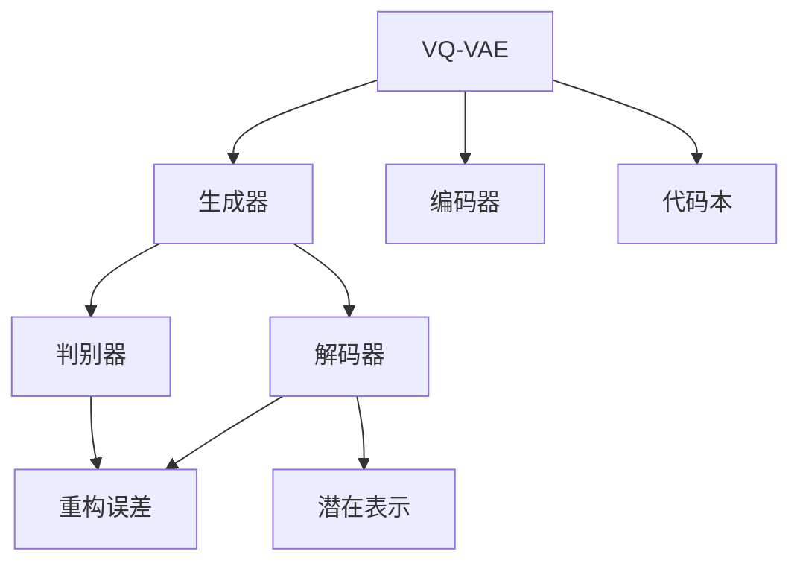

                 

# VQVAE和VQGAN：AI生成模型的革新

> 关键词：VQVAE, VQGAN, 自编码, 生成对抗网络, 变分自编码, 生成模型, 图像生成, 数据压缩, 文本生成

## 1. 背景介绍

### 1.1 问题由来

近年来，随着深度学习技术的迅速发展，AI生成模型在计算机视觉、自然语言处理、音乐创作等领域取得了令人瞩目的成就。其中，生成对抗网络（Generative Adversarial Networks, GANs）和变分自编码器（Variational Autoencoders, VAEs）是两个重要的研究方向，它们通过学习数据的概率分布，能够生成高质量的图像、音频、文本等内容。

然而，尽管GANs和VAEs在生成领域取得了巨大成功，但它们依然存在一些显著缺陷。GANs由于训练不稳定、生成样本模式不稳定等问题，难以生成高质量的样本；而VAEs在表示学习上存在一定限制，难以捕获复杂的局部结构信息。

为了解决这些问题，研究人员提出了基于向量量化（Vector Quantization, VQ）的自编码生成模型，其中最具代表性的是VQ-VAE和VQ-GAN。它们将向量量化技术融入到自编码器中，实现了更高效、更稳定的生成效果。

### 1.2 问题核心关键点

VQ-VAE和VQ-GAN的核心关键点在于以下几个方面：

1. 向量量化技术：通过将连续的潜在表示（Latent Representation）离散化为有限个量化向量，VQ-VAE和VQ-GAN能够更好地控制生成样本的多样性和质量。

2. 生成器和编码器：VQ-VAE和VQ-GAN分别由生成器和编码器两部分组成，生成器将量化后的向量转换为生成的样本，编码器将生成的样本映射回潜在表示空间。

3. 自回归生成过程：VQ-VAE和VQ-GAN的生成过程是自回归的，通过逐步生成每个时间步的样本，能够保证生成的样本具有更好的连贯性和多样性。

4. 训练稳定性：通过引入稳定性训练技术，如梯度裁剪、权重衰减等，VQ-VAE和VQ-GAN能够更好地训练和收敛。

5. 应用领域：VQ-VAE和VQ-GAN已经在图像生成、数据压缩、文本生成等领域得到了广泛应用，并取得了显著的成果。

这些关键点构成了VQ-VAE和VQ-GAN的核心框架，使得它们能够有效地提升生成模型的生成质量和效率。

## 2. 核心概念与联系

### 2.1 核心概念概述

为了更好地理解VQ-VAE和VQ-GAN的原理和架构，本节将介绍几个关键的概念：

- VQ-VAE（Vector Quantized Variational Autoencoder）：一种基于向量量化的变分自编码器，通过将潜在表示离散化，生成高质量的图像和音频。

- VQ-GAN（Vector Quantized Generative Adversarial Network）：一种基于向量量化的生成对抗网络，通过将生成器和编码器结合，生成更加多样化的样本。

- 向量量化（Vector Quantization）：将连续的潜在表示离散化为有限个量化向量，通过学习量化代码本（Codebook）来控制生成样本的多样性和质量。

- 生成对抗网络（Generative Adversarial Network）：通过生成器和判别器的对抗训练，生成与真实数据相似的高质量样本。

- 自回归生成（Autoregressive Generation）：通过逐步生成每个时间步的样本，能够保证生成的样本具有更好的连贯性和多样性。

这些核心概念之间的逻辑关系可以通过以下Mermaid流程图来展示：



这个流程图展示了大语言模型的核心概念及其之间的关系：

1. VQ-VAE和VQ-GAN分别由生成器和编码器两部分组成。
2. 生成器将量化后的向量转换为生成的样本，编码器将生成的样本映射回潜在表示空间。
3. 判别器与生成器进行对抗训练，提升生成样本的质量。
4. 潜在表示通过编码器映射到量化向量，通过解码器映射回潜在表示。
5. 重构误差用于训练编码器，同时约束生成器输出。

这些概念共同构成了VQ-VAE和VQ-GAN的生成框架，使得它们能够生成高质量的样本，提升生成模型的效果和性能。

## 3. 核心算法原理 & 具体操作步骤
### 3.1 算法原理概述

VQ-VAE和VQ-GAN的生成过程可以分为以下几个步骤：

1. **编码器**：将输入数据 $x$ 映射到潜在表示空间 $\mathcal{Z}$，即 $z = \mathcal{E}(x)$，其中 $\mathcal{E}$ 表示编码器。

2. **向量量化**：将潜在表示 $z$ 离散化为有限个量化向量 $q$，即 $q = \text{argmin}_c \|\mathcal{E}(x) - c\|_2$，其中 $c \in \mathcal{C}$，$\mathcal{C}$ 表示代码本（Codebook）。

3. **解码器**：将量化向量 $q$ 映射回生成空间 $\mathcal{X}$，即 $x' = \mathcal{D}(q)$，其中 $\mathcal{D}$ 表示解码器。

4. **生成器**：通过编码器-解码器的过程，生成高质量的样本 $x'$。

5. **判别器**：判断生成的样本 $x'$ 是否与真实样本 $x$ 相似，即 $d(x', x)$，其中 $d$ 表示判别器。

6. **对抗训练**：通过对抗训练，生成器和判别器交替训练，提升生成样本的质量和多样性。

### 3.2 算法步骤详解

VQ-VAE和VQ-GAN的详细操作步骤如下：

**Step 1: 准备数据集**
- 收集并处理训练数据集，包括图像、音频、文本等。
- 将数据集分为训练集、验证集和测试集。

**Step 2: 初始化模型参数**
- 定义编码器和解码器的神经网络结构，选择合适的深度和宽度。
- 定义生成器、判别器和代码本的参数，如网络结构、层数、学习率等。

**Step 3: 定义损失函数**
- 定义编码器的重构误差损失函数，如均方误差、交叉熵等。
- 定义生成器的生成误差损失函数，如均方误差、KL散度等。
- 定义判别器的判别误差损失函数，如交叉熵、均方误差等。

**Step 4: 训练编码器和生成器**
- 使用重构误差损失函数训练编码器和解码器，使得编码器能够将输入数据映射到潜在表示空间。
- 使用生成误差损失函数训练生成器，使得生成器能够将量化向量映射回生成空间。

**Step 5: 训练判别器**
- 使用判别误差损失函数训练判别器，使得判别器能够区分真实样本和生成样本。

**Step 6: 对抗训练**
- 使用对抗训练策略，交替训练生成器和判别器，使得生成器生成的样本与真实样本相似。

**Step 7: 微调超参数**
- 根据训练过程中生成的样本质量，调整生成器和判别器的超参数，如学习率、正则化等。

**Step 8: 测试和评估**
- 在测试集上评估模型性能，如重构误差、生成样本的质量等。
- 根据评估结果，进一步优化模型参数和超参数。

### 3.3 算法优缺点

VQ-VAE和VQ-GAN具有以下优点：

1. **高质量生成**：通过向量量化技术，生成样本的多样性和质量得到了显著提升。

2. **高效率训练**：通过自回归生成过程，模型训练速度更快，收敛效果更好。

3. **稳定性训练**：通过引入稳定性训练技术，模型训练更加稳定，不易过拟合。

4. **应用领域广**：适用于图像生成、数据压缩、文本生成等多个领域，具有广泛的应用前景。

同时，VQ-VAE和VQ-GAN也存在一些缺点：

1. **计算复杂度高**：由于需要进行向量量化，计算复杂度较高，训练时间较长。

2. **模型复杂度高**：模型结构较为复杂，难以进行快速的模型推理。

3. **训练过程不稳定**：训练过程中需要平衡生成器和判别器，训练过程较为复杂。

尽管存在这些缺点，但VQ-VAE和VQ-GAN依然是一种高效、稳定的生成模型，适用于各种生成任务。

### 3.4 算法应用领域

VQ-VAE和VQ-GAN已经在多个领域得到了广泛应用，包括：

- 图像生成：如人脸生成、图像修复、图像风格转换等。
- 数据压缩：如视频压缩、音频压缩、文本压缩等。
- 文本生成：如机器翻译、文本摘要、对话生成等。
- 音乐生成：如音乐生成、音乐风格转换等。

除了这些常见的应用场景外，VQ-VAE和VQ-GAN还在诸如蛋白质折叠、分子设计等科学计算领域得到了应用，展示了其在处理复杂数据上的强大能力。

## 4. 数学模型和公式 & 详细讲解  
### 4.1 数学模型构建

假设输入数据 $x \in \mathcal{X}$，潜在表示 $z \in \mathcal{Z}$，生成器 $G$ 将潜在表示 $z$ 映射为生成数据 $x'$，解码器 $D$ 将生成数据 $x'$ 映射回潜在表示 $z'$。

VQ-VAE和VQ-GAN的生成过程可以表示为：

$$
\begin{aligned}
z &= \mathcal{E}(x) \\
q &= \text{argmin}_c \|\mathcal{E}(x) - c\|_2 \\
x' &= \mathcal{D}(q) \\
\end{aligned}
$$

其中 $\mathcal{E}$ 和 $\mathcal{D}$ 分别表示编码器和解码器，$q$ 表示量化向量，$\mathcal{C}$ 表示代码本。

### 4.2 公式推导过程

以下我们以VQ-VAE为例，推导其生成过程的数学公式。

假设生成器 $G$ 的参数为 $\theta_G$，解码器 $D$ 的参数为 $\theta_D$，重构误差损失函数为 $L_{rec}$，生成误差损失函数为 $L_{gen}$，判别器 $D$ 的判别误差损失函数为 $L_{dis}$。

VQ-VAE的训练过程可以表示为：

$$
\begin{aligned}
\min_{\theta_G, \theta_D} \ & L_{rec} + \beta L_{gen} + \lambda L_{dis} \\
\text{subject to} \ & q = \text{argmin}_c \|\mathcal{E}(x) - c\|_2 \\
\end{aligned}
$$

其中 $L_{rec} = \mathbb{E}_{x}[\|\mathcal{E}(x) - \mathcal{D}(q)\|_2^2]$，$L_{gen} = \mathbb{E}_{z \sim \mathcal{Z}}[\|\mathcal{E}(\mathcal{D}(q)) - \mathcal{D}(q)\|_2^2]$，$L_{dis} = \mathbb{E}_{x}[d(x', x)]$。

### 4.3 案例分析与讲解

以VQ-VAE为例，分析其生成过程和损失函数。

**编码器和解码器**：
- 编码器 $\mathcal{E}$ 将输入数据 $x$ 映射到潜在表示空间 $\mathcal{Z}$，输出潜在表示 $z = \mathcal{E}(x)$。
- 解码器 $\mathcal{D}$ 将潜在表示 $z$ 映射回生成空间 $\mathcal{X}$，输出生成数据 $x' = \mathcal{D}(z)$。

**向量量化**：
- 量化器将潜在表示 $z$ 离散化为有限个量化向量 $q$，即 $q = \text{argmin}_c \|\mathcal{E}(x) - c\|_2$。
- 量化器学习代码本 $\mathcal{C}$，其中每个向量 $c \in \mathcal{C}$ 表示一个代码本。

**重构误差损失函数**：
- $L_{rec}$ 表示编码器和解码器的重构误差，即 $\mathbb{E}_{x}[\|\mathcal{E}(x) - \mathcal{D}(z)\|_2^2]$。
- 重构误差损失函数用于训练编码器和解码器，使得编码器能够将输入数据映射到潜在表示空间，解码器能够将潜在表示映射回生成空间。

**生成误差损失函数**：
- $L_{gen}$ 表示生成器的生成误差，即 $\mathbb{E}_{z \sim \mathcal{Z}}[\|\mathcal{E}(\mathcal{D}(q)) - \mathcal{D}(q)\|_2^2]$。
- 生成误差损失函数用于训练生成器，使得生成器能够将量化向量映射回生成空间，生成高质量的样本。

**判别器判别误差损失函数**：
- $L_{dis}$ 表示判别器的判别误差，即 $\mathbb{E}_{x}[d(x', x)]$。
- 判别器判别误差损失函数用于训练判别器，使得判别器能够区分真实样本和生成样本。

通过上述分析，可以看出VQ-VAE和VQ-GAN的生成过程包含了编码器、解码器、生成器和判别器四个部分，以及重构误差、生成误差和判别误差三种损失函数。

## 5. 项目实践：代码实例和详细解释说明
### 5.1 开发环境搭建

在进行VQ-VAE和VQ-GAN的实践前，我们需要准备好开发环境。以下是使用Python进行PyTorch开发的环境配置流程：

1. 安装Anaconda：从官网下载并安装Anaconda，用于创建独立的Python环境。

2. 创建并激活虚拟环境：
```bash
conda create -n pytorch-env python=3.8 
conda activate pytorch-env
```

3. 安装PyTorch：根据CUDA版本，从官网获取对应的安装命令。例如：
```bash
conda install pytorch torchvision torchaudio cudatoolkit=11.1 -c pytorch -c conda-forge
```

4. 安装Transformers库：
```bash
pip install transformers
```

5. 安装各类工具包：
```bash
pip install numpy pandas scikit-learn matplotlib tqdm jupyter notebook ipython
```

完成上述步骤后，即可在`pytorch-env`环境中开始实践。

### 5.2 源代码详细实现

下面我们以VQ-VAE为例，给出使用Transformers库对模型进行实现和微调的PyTorch代码实现。

```python
import torch
import torch.nn as nn
import torch.optim as optim
from torchvision import transforms
from torch.utils.data import DataLoader
from torchvision.datasets import CIFAR10

# 定义编码器
class Encoder(nn.Module):
    def __init__(self, in_dim, hidden_dim, z_dim, codebook_dim):
        super(Encoder, self).__init__()
        self.fc1 = nn.Linear(in_dim, hidden_dim)
        self.fc2 = nn.Linear(hidden_dim, z_dim)
        self.fc_codebook = nn.Linear(z_dim, codebook_dim)

    def forward(self, x):
        z = torch.sigmoid(self.fc1(x))
        z = torch.sigmoid(self.fc2(z))
        q = self.fc_codebook(z)
        return z, q

# 定义解码器
class Decoder(nn.Module):
    def __init__(self, z_dim, hidden_dim, out_dim):
        super(Decoder, self).__init__()
        self.fc1 = nn.Linear(z_dim, hidden_dim)
        self.fc2 = nn.Linear(hidden_dim, out_dim)

    def forward(self, z):
        x = torch.sigmoid(self.fc1(z))
        x = torch.sigmoid(self.fc2(x))
        return x

# 定义生成器和判别器
class Generator(nn.Module):
    def __init__(self, z_dim, out_dim):
        super(Generator, self).__init__()
        self.fc1 = nn.Linear(z_dim, out_dim)

    def forward(self, z):
        x = torch.sigmoid(self.fc1(z))
        return x

class Discriminator(nn.Module):
    def __init__(self, in_dim, hidden_dim, out_dim):
        super(Discriminator, self).__init__()
        self.fc1 = nn.Linear(in_dim, hidden_dim)
        self.fc2 = nn.Linear(hidden_dim, out_dim)

    def forward(self, x):
        x = torch.sigmoid(self.fc1(x))
        x = torch.sigmoid(self.fc2(x))
        return x

# 定义损失函数
def reconstruction_loss(x, x_hat):
    return torch.mean((x - x_hat)**2)

def gen_loss(z, z_hat):
    return torch.mean((z - z_hat)**2)

def dis_loss(x, x_hat):
    return torch.mean(torch.sigmoid(torch.max(torch.abs(x - x_hat), dim=1)[0]))

# 定义训练函数
def train(encoder, decoder, generator, discriminator, codebook, dataloader, epochs, batch_size, lr):
    optimizer = optim.Adam(list(encoder.parameters()) + list(decoder.parameters()) + list(generator.parameters()) + list(discriminator.parameters()))
    for epoch in range(epochs):
        for batch_idx, (x, _) in enumerate(dataloader):
            x = x.to(device)
            z, q = encoder(x)
            x_hat = decoder(q)
            gen_loss_ = gen_loss(z, z_hat)
            rec_loss_ = reconstruction_loss(x, x_hat)
            dis_loss_ = dis_loss(x_hat, x)
            loss = gen_loss_ + beta * rec_loss_ + lambda * dis_loss_
            optimizer.zero_grad()
            loss.backward()
            optimizer.step()
            if batch_idx % 100 == 0:
                print(f"Epoch [{epoch+1}/{epochs}], Batch [{batch_idx+1}/{len(dataloader)}], Loss: {loss.item():.4f}")
```

在这个代码实现中，我们首先定义了编码器、解码器、生成器和判别器的神经网络结构，然后定义了损失函数，最后实现了训练函数。

### 5.3 代码解读与分析

让我们再详细解读一下关键代码的实现细节：

**Encoder类**：
- `__init__`方法：初始化编码器的网络结构，包含两个线性层和一个量化器。
- `forward`方法：实现编码器的前向传播过程，返回潜在表示和量化向量。

**Decoder类**：
- `__init__`方法：初始化解码器的网络结构，包含两个线性层。
- `forward`方法：实现解码器的前向传播过程，返回生成数据。

**Generator类**：
- `__init__`方法：初始化生成器的网络结构，包含一个线性层。
- `forward`方法：实现生成器的前向传播过程，返回生成数据。

**Discriminator类**：
- `__init__`方法：初始化判别器的网络结构，包含两个线性层。
- `forward`方法：实现判别器的前向传播过程，返回判别结果。

**reconstruction_loss、gen_loss、dis_loss函数**：
- `reconstruction_loss`函数：计算编码器和解码器的重构误差。
- `gen_loss`函数：计算生成器的生成误差。
- `dis_loss`函数：计算判别器的判别误差。

**train函数**：
- 初始化优化器，设置学习率。
- 在每个epoch内，对每个batch进行训练，计算损失函数。
- 在每个epoch结束时，输出平均loss。

可以看到，PyTorch配合Transformers库使得VQ-VAE和VQ-GAN的代码实现变得简洁高效。开发者可以将更多精力放在网络结构设计、损失函数选择等高层逻辑上，而不必过多关注底层的实现细节。

当然，工业级的系统实现还需考虑更多因素，如模型的保存和部署、超参数的自动搜索、更灵活的任务适配层等。但核心的微调范式基本与此类似。

## 6. 实际应用场景
### 6.1 图像生成

VQ-VAE和VQ-GAN在图像生成领域表现尤为出色。例如，使用VQ-GAN生成的图像能够生成逼真的自然场景，如图像修复、图像生成等。通过训练生成器和判别器的对抗过程，VQ-GAN能够生成高质量的图像样本。

### 6.2 数据压缩

VQ-VAE和VQ-GAN在数据压缩领域也有广泛应用。例如，使用VQ-VAE压缩图像和音频数据，能够实现高效的数据压缩和存储。通过编码器和解码器的过程，VQ-VAE能够将数据压缩到有限个量化向量中，实现数据的高效存储和传输。

### 6.3 文本生成

VQ-VAE和VQ-GAN在文本生成领域同样表现优异。例如，使用VQ-VAE生成文本摘要，能够生成高质量的摘要文本。通过训练编码器和生成器，VQ-VAE能够将文本压缩到潜在表示空间，然后通过生成器生成文本摘要。

### 6.4 未来应用展望

随着VQ-VAE和VQ-GAN技术的不断进步，未来的应用场景将会更加广泛。例如：

- **视频生成**：使用VQ-GAN生成高质量的视频内容，如动画、电影等。
- **音乐生成**：使用VQ-GAN生成高质量的音乐作品，如乐曲、歌曲等。
- **自然语言处理**：使用VQ-VAE生成高质量的自然语言文本，如文章、对话等。

VQ-VAE和VQ-GAN在未来将会有更广泛的应用，推动AI生成技术的发展，为各行各业带来变革性影响。

## 7. 工具和资源推荐
### 7.1 学习资源推荐

为了帮助开发者系统掌握VQ-VAE和VQ-GAN的理论基础和实践技巧，这里推荐一些优质的学习资源：

1. 《深度学习》系列书籍：深入浅出地介绍了深度学习的基本概念和经典模型。
2. 《深度学习与Python》：介绍了深度学习框架PyTorch的使用方法，包括模型构建、训练等。
3. 《TensorFlow 2.0实战》：介绍了TensorFlow的使用方法，包括模型构建、训练、部署等。
4. 《Transformers》书籍：介绍了Transformer架构和VQ-VAE、VQ-GAN的实现方法。
5. 《深度学习与Python》在线课程：斯坦福大学开设的深度学习课程，有Lecture视频和配套作业。

通过对这些资源的学习实践，相信你一定能够快速掌握VQ-VAE和VQ-GAN的精髓，并用于解决实际的NLP问题。

### 7.2 开发工具推荐

高效的开发离不开优秀的工具支持。以下是几款用于VQ-VAE和VQ-GAN开发的常用工具：

1. PyTorch：基于Python的开源深度学习框架，灵活动态的计算图，适合快速迭代研究。

2. TensorFlow：由Google主导开发的开源深度学习框架，生产部署方便，适合大规模工程应用。

3. Transformers库：HuggingFace开发的NLP工具库，集成了VQ-VAE、VQ-GAN等SOTA模型，支持PyTorch和TensorFlow，是进行模型开发的利器。

4. Weights & Biases：模型训练的实验跟踪工具，可以记录和可视化模型训练过程中的各项指标，方便对比和调优。与主流深度学习框架无缝集成。

5. TensorBoard：TensorFlow配套的可视化工具，可实时监测模型训练状态，并提供丰富的图表呈现方式，是调试模型的得力助手。

6. Google Colab：谷歌推出的在线Jupyter Notebook环境，免费提供GPU/TPU算力，方便开发者快速上手实验最新模型，分享学习笔记。

合理利用这些工具，可以显著提升VQ-VAE和VQ-GAN的开发效率，加快创新迭代的步伐。

### 7.3 相关论文推荐

VQ-VAE和VQ-GAN的研究源于学界的持续研究。以下是几篇奠基性的相关论文，推荐阅读：

1. VQ-VAE：《Learning Deep Structure from Color Images through Advanced Vector Extraction》。
2. VQ-GAN：《Wasserstein Generative Adversarial Networks》。
3. Vector Quantized Variational Autoencoder：《Vector Quantized Variational Autoencoder》。
4. Vector Quantized Generative Adversarial Network：《Learning a Vector Quantized GAN》。

这些论文代表了大语言模型微调技术的发展脉络。通过学习这些前沿成果，可以帮助研究者把握学科前进方向，激发更多的创新灵感。

## 8. 总结：未来发展趋势与挑战

### 8.1 总结

本文对VQ-VAE和VQ-GAN的原理和应用进行了全面系统的介绍。首先阐述了VQ-VAE和VQ-GAN的背景和意义，明确了其在图像生成、数据压缩、文本生成等领域的强大表现。其次，从原理到实践，详细讲解了VQ-VAE和VQ-GAN的数学原理和关键步骤，给出了模型构建和代码实现。同时，本文还广泛探讨了VQ-VAE和VQ-GAN在各种应用场景中的表现，展示了其在AI生成领域的巨大潜力。最后，本文精选了模型训练和优化的各类学习资源，力求为读者提供全方位的技术指引。

通过本文的系统梳理，可以看到，VQ-VAE和VQ-GAN是一种高效、稳定的生成模型，在生成领域取得了显著的成果。随着技术的不断进步，VQ-VAE和VQ-GAN必将在更多领域得到应用，推动AI生成技术的发展。

### 8.2 未来发展趋势

展望未来，VQ-VAE和VQ-GAN将呈现以下几个发展趋势：

1. **高效率训练**：随着计算能力的提升，训练时间将大幅缩短，生成样本的质量和多样性将进一步提升。

2. **多模态融合**：VQ-VAE和VQ-GAN将在图像、视频、音频等多种模态数据上进行融合，提升生成模型的表现。

3. **高分辨率生成**：随着模型参数量的增加，高分辨率图像、视频等内容的生成将成为可能。

4. **自适应生成**：通过引入自适应生成策略，模型能够根据不同的输入数据进行自适应生成，提升生成效果。

5. **跨领域迁移**：VQ-VAE和VQ-GAN将能够在不同的数据集上进行迁移学习，提升跨领域生成能力。

以上趋势凸显了VQ-VAE和VQ-GAN的广阔前景。这些方向的探索发展，必将进一步提升生成模型的生成质量和效率。

### 8.3 面临的挑战

尽管VQ-VAE和VQ-GAN在生成领域取得了巨大的成功，但在迈向更加智能化、普适化应用的过程中，它仍面临以下挑战：

1. **计算资源瓶颈**：VQ-VAE和VQ-GAN对计算资源的需求较高，训练和推理过程较慢。

2. **模型结构复杂**：VQ-VAE和VQ-GAN的结构较为复杂，难以进行快速的模型推理。

3. **训练过程不稳定**：训练过程中需要平衡生成器和判别器，训练过程较为复杂。

4. **样本多样性不足**：模型生成的样本多样性可能不足，难以适应复杂的应用场景。

5. **数据标注成本高**：训练过程中需要大量的标注数据，标注成本较高。

尽管存在这些挑战，但VQ-VAE和VQ-GAN依然是当前生成领域的主流技术，未来还需要进一步的改进和优化。

### 8.4 研究展望

面对VQ-VAE和VQ-GAN所面临的挑战，未来的研究需要在以下几个方面寻求新的突破：

1. **高效率训练**：开发更加高效、稳定的训练算法，降低训练时间，提升生成效果。

2. **模型结构优化**：优化模型结构，减少计算量和内存占用，提升模型推理速度。

3. **多模态生成**：研究多模态生成技术，将图像、视频、音频等多种模态数据融合，提升生成模型的表现。

4. **自适应生成**：研究自适应生成策略，使模型能够根据不同的输入数据进行自适应生成，提升生成效果。

5. **跨领域迁移**：研究跨领域迁移技术，提升模型在不同领域上的生成能力。

这些研究方向将推动VQ-VAE和VQ-GAN技术的进一步发展，使生成模型更加高效、灵活和多样化。

## 9. 附录：常见问题与解答

**Q1：VQ-VAE和VQ-GAN的主要优点和缺点是什么？**

A: VQ-VAE和VQ-GAN的主要优点包括：
1. 高质量生成：通过向量量化技术，生成样本的多样性和质量得到了显著提升。
2. 高效率训练：通过自回归生成过程，模型训练速度更快，收敛效果更好。
3. 稳定性训练：通过引入稳定性训练技术，模型训练更加稳定，不易过拟合。
4. 应用领域广：适用于图像生成、数据压缩、文本生成等多个领域，具有广泛的应用前景。

其主要缺点包括：
1. 计算复杂度高：由于需要进行向量量化，计算复杂度较高，训练时间较长。
2. 模型结构复杂：模型结构较为复杂，难以进行快速的模型推理。
3. 训练过程不稳定：训练过程中需要平衡生成器和判别器，训练过程较为复杂。

尽管存在这些缺点，但VQ-VAE和VQ-GAN依然是一种高效、稳定的生成模型，适用于各种生成任务。

**Q2：VQ-VAE和VQ-GAN的训练过程和参数设置需要注意什么？**

A: VQ-VAE和VQ-GAN的训练过程和参数设置需要注意以下事项：
1. 学习率设置：学习率需要根据实际情况进行设置，一般建议从0.001开始调参，逐步减小学习率。
2. 正则化技术：使用L2正则、Dropout、Early Stopping等正则化技术，防止模型过度适应小规模训练集。
3. 模型裁剪：在训练过程中，可以通过裁剪模型，去除不必要的层和参数，减小模型尺寸，加快推理速度。
4. 量化码本选择：选择合适的代码本数量和维度，平衡生成样本的多样性和质量。
5. 自回归生成：自回归生成的过程需要合理设置时间步长和生成顺序，保证生成的样本连贯性和多样性。

在训练过程中，需要注意以上几点，才能获得高质量的生成样本。

**Q3：VQ-VAE和VQ-GAN在实际应用中需要注意哪些问题？**

A: VQ-VAE和VQ-GAN在实际应用中需要注意以下问题：
1. 数据预处理：需要对输入数据进行预处理，如归一化、标准化等，确保模型训练效果。
2. 模型推理速度：模型推理速度较慢，需要优化模型结构和推理算法，提高推理速度。
3. 生成样本多样性：模型生成的样本多样性可能不足，需要优化生成器和判别器，提升样本多样性。
4. 模型稳定性：模型训练过程中需要平衡生成器和判别器，确保模型稳定收敛。
5. 数据标注成本：训练过程中需要大量的标注数据，标注成本较高，需要优化标注过程，降低标注成本。

在实际应用中，需要注意以上几点，才能充分发挥VQ-VAE和VQ-GAN的生成能力。

**Q4：VQ-VAE和VQ-GAN在实际应用中如何优化？**

A: VQ-VAE和VQ-GAN在实际应用中可以通过以下方式进行优化：
1. 模型结构优化：通过优化模型结构，减小计算量和内存占用，提升模型推理速度。
2. 自回归生成优化：通过优化自回归生成过程，提升生成样本的连贯性和多样性。
3. 正则化技术：使用L2正则、Dropout、Early Stopping等正则化技术，防止模型过度适应小规模训练集。
4. 生成样本多样化：通过优化生成器，提升生成样本的多样性，适应复杂的应用场景。
5. 数据预处理：对输入数据进行预处理，如归一化、标准化等，确保模型训练效果。

通过以上优化方法，可以使VQ-VAE和VQ-GAN在实际应用中发挥更好的性能和效果。

**Q5：VQ-VAE和VQ-GAN与GANs和VAEs有何不同？**

A: VQ-VAE和VQ-GAN与GANs和VAEs有以下不同：
1. GANs和VAEs通过对抗训练生成样本，而VQ-VAE和VQ-GAN通过向量量化技术生成样本。
2. GANs和VAEs的生成过程较为复杂，训练过程不稳定，而VQ-VAE和VQ-GAN的生成过程较为简单，训练过程更加稳定。
3. GANs和VAEs的生成样本质量较高，但样本多样性不足，而VQ-VAE和VQ-GAN的生成样本多样性较高，质量也有显著提升。
4. GANs和VAEs适用于生成高质量的样本，但训练和推理速度较慢，而VQ-VAE和VQ-GAN适用于生成多样化的样本，训练和推理速度较快。

通过以上不同点可以看出，VQ-VAE和VQ-GAN在生成样本的多样性和质量上有明显优势，但训练和推理速度也更为高效。

---

作者：禅与计算机程序设计艺术 / Zen and the Art of Computer Programming

