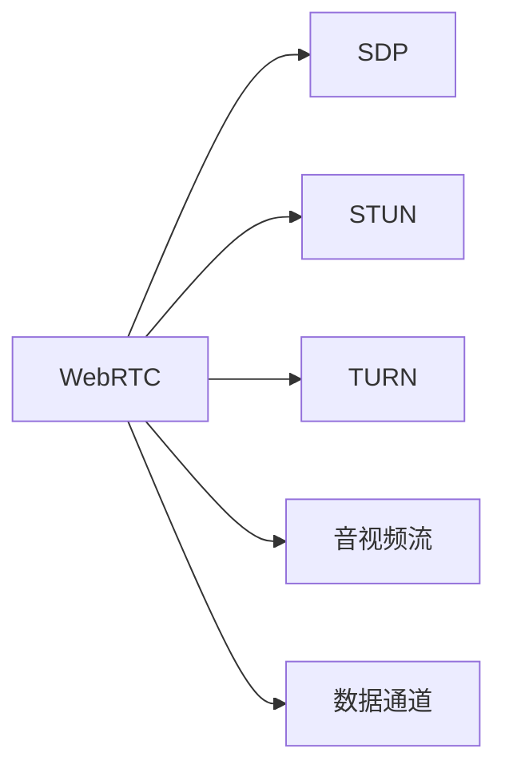

                 

# WebRTC 实时通信协议：在浏览器中实现互动

> 关键词：WebRTC, 实时通信, 浏览器, 互动, SDP, 数据通道, 音视频流

## 1. 背景介绍

### 1.1 问题由来

随着互联网的普及和智能设备的普及，人们的沟通方式已经从传统的邮件、短信等方式，转变为更加实时、互动的沟通方式。即时通信软件、视频会议、在线教育、在线医疗等应用场景，对于实时、稳定的音视频通信需求日益增加。而传统的P2P通信协议如STUN、TURN等，需要额外的网守设备和中间代理，部署复杂，且用户体验不佳。

为了解决这些问题，WebRTC应运而生。WebRTC是一个由谷歌推出的实时通信协议，旨在提供一种在Web浏览器中进行音视频通信的解决方案，实现点对点的音视频传输，无需额外的网守设备和中间代理，简化了部署，提高了用户体验。

### 1.2 问题核心关键点

WebRTC的核心优势在于：

1. 实现音视频传输的零配置、零延迟。
2. 支持端到端的加密传输，保障通信安全。
3. 可以自适应网络状况，降低丢包和延迟。
4. 支持多种编解码器，兼容各种设备和网络环境。
5. 浏览器集成，开发简便，适用于各类Web应用。

这些核心优势，使得WebRTC成为互联网实时通信的首选协议，广泛应用于在线教育、远程医疗、企业协作等场景。

## 2. 核心概念与联系

### 2.1 核心概念概述

WebRTC的核心概念包括以下几个：

- **WebRTC**：即Web Real-Time Communication，一种Web浏览器中的音视频通信协议。
- **STUN/TURN**：是WebRTC协议中用于穿越NAT和防火墙的协议，STUN用于本地网络测试，TURN用于中继传输。
- **SDP**：即Session Description Protocol，用于描述音视频会话的协议，包括传输协议、编解码器、网络参数等信息。
- **数据通道(DataChannels)**：用于传输非音视频数据，如聊天消息、文件传输等。
- **音视频流**：通过WebRTC协议传输的音视频数据流，实现点对点的实时互动。

这些核心概念通过WebRTC协议的层次结构进行有机联系：



## 3. 核心算法原理 & 具体操作步骤
### 3.1 算法原理概述

WebRTC的音视频传输过程主要涉及三个步骤：

1. 收集本地音视频信息，通过STUN/TURN协议穿越NAT和防火墙，建立P2P连接。
2. 通过SDP协议进行会话描述，包括音视频编解码器、传输协议、网络参数等信息。
3. 通过数据通道传输音视频流，实现实时互动。

具体步骤如下：

### 3.2 算法步骤详解

1. **收集本地音视频信息**：
   - 使用浏览器的摄像头、麦克风收集音频和视频数据。
   - 调用浏览器的`getUserMedia`方法获取音频和视频流。
   ```javascript
   navigator.mediaDevices.getUserMedia({
       audio: true,
       video: true
   }).then(function(stream) {
       console.log('Stream: ' + JSON.stringify(stream));
   });
   ```

2. **穿越NAT和防火墙**：
   - 使用STUN协议测试本地网络环境，确定NAT类型。
   - 如果NAT类型是全圆锥型，则可以直接进行P2P通信。
   - 如果NAT类型是受限圆锥型或对称型，则需要使用TURN进行中继传输。
   ```javascript
   const stunServer = 'stun:stun.l.google.com:19302';
   const turnServer = 'turn:turnserver.com:3478';
   
   const stunPeerConnection = new RTCPeerConnection();
   stunPeerConnection.onicecandidate = function(event) {
       if (event.candidate) {
           console.log('ice candidate: ' + event.candidate.candidate);
       }
   };
   
   const offer = await stunPeerConnection.createOffer();
   await stunPeerConnection.setLocalDescription(offer);
   
   const turnPeerConnection = new RTCPeerConnection();
   turnPeerConnection.onicecandidate = function(event) {
       if (event.candidate) {
           console.log('turn candidate: ' + event.candidate.candidate);
       }
   };
   
   const turnOffer = await turnPeerConnection.createOffer();
   await turnPeerConnection.setLocalDescription(turnOffer);
   
   const offerBytes = new Uint8Array(offer.sdp);
   const candidateBytes = new Uint8Array(event.candidate.candidate);
   ```

3. **进行会话描述(SDP)**：
   - 使用SDP协议描述音视频会话信息，包括编解码器、传输协议、网络参数等信息。
   ```javascript
   const sdpOffer = offer.sdp;
   const sdpAnswer = new RTCSessionDescription({ type: 'answer', sdp: sdpOffer });
   ```

4. **传输音视频流**：
   - 创建音视频流传输通道，并设置编解码器和传输协议。
   ```javascript
   const peerConnection = new RTCPeerConnection();
   
   const videoTrack = new MediaStreamTrack(stream, 'video');
   const audioTrack = new MediaStreamTrack(stream, 'audio');
   
   const videoStream = new MediaStream([videoTrack]);
   const audioStream = new MediaStream([audioTrack]);
   
   peerConnection.addTrack(videoTrack, stream);
   peerConnection.addTrack(audioTrack, stream);
   ```

### 3.3 算法优缺点

WebRTC具有以下优点：

1. 实现音视频传输的零配置、零延迟，用户无需配置复杂的网守设备。
2. 支持端到端的加密传输，保障通信安全。
3. 可以自适应网络状况，降低丢包和延迟。
4. 支持多种编解码器，兼容各种设备和网络环境。
5. 浏览器集成，开发简便，适用于各类Web应用。

但同时也存在一些缺点：

1. 依赖浏览器的实现，不同浏览器的WebRTC兼容性较差。
2. 传输协议复杂，配置和调试难度较大。
3. 音视频流的质量受限于浏览器和设备的性能。
4. 需要处理复杂的STUN/TURN协议，对开发者要求较高。

## 4. 数学模型和公式 & 详细讲解
### 4.1 数学模型构建

WebRTC协议主要基于SDP和ICE协议进行音视频会话的描述和穿越NAT/防火墙。

**SDP协议**：用于描述音视频会话的协议，包括会话标识、媒体类型、编解码器、传输协议、网络参数等信息。

**ICE协议**：用于穿越NAT和防火墙的协议，包括STUN和TURN协议。STUN用于本地网络测试，TURN用于中继传输。

**ICE协议中的NAT类型**：
- 全圆锥型(NAT-Portmaping)：任何公网IP地址都可以访问STUN服务器。
- 受限圆锥型(NAT-Restricted Cone)：同一局域网内同一端口的公网IP地址可以访问STUN服务器。
- 对称型(NAT-Symmetric)：同一公网IP地址的两个端口可以访问STUN服务器。

### 4.2 公式推导过程

以下是SDP协议的基本格式和示例：

```
v=0
o=- 1474758092 2 IN IP4 127.0.0.1
s=WebRTC session
t=0 0
a=rtcp:9
a=ice-ufrag:username
a=ice-pwd:password
m=video 9 UDP 1234 RTP/AVP 96
```

其中：

- v：SDP协议版本，默认为0。
- o：会话标识，包括会话时间和创建者信息。
- s：会话标识，用于描述会话内容。
- t：会话时间，格式为`t=<number> <number>`，表示起始时间和持续时间。
- a：附加信息，用于描述附加参数。
- m：媒体描述，包括媒体类型、编解码器、传输协议、端口等信息。

## 5. 项目实践：代码实例和详细解释说明
### 5.1 开发环境搭建

WebRTC开发环境需要依赖浏览器和相关的JavaScript库。以下是基于Chrome浏览器的开发环境搭建过程：

1. 安装Chrome浏览器，确保浏览器版本为60以上。
2. 安装WebRTC开发所需的JavaScript库，如`webrtc.js`、`webrtc-adapter.js`等。
3. 创建一个HTML页面，引入所需的JavaScript库。

```html
<!DOCTYPE html>
<html>
<head>
    <title>WebRTC Example</title>
</head>
<body>
    <script src="webrtc.js"></script>
    <script src="webrtc-adapter.js"></script>
    <script>
        // 初始化WebRTC连接
        var peerConnection = new RTCPeerConnection();
    </script>
</body>
</html>
```

### 5.2 源代码详细实现

以下是WebRTC代码实例，包括音视频收集、穿越NAT和防火墙、会话描述和音视频流传输：

```javascript
// 收集本地音视频信息
navigator.mediaDevices.getUserMedia({
    audio: true,
    video: true
}).then(function(stream) {
    console.log('Stream: ' + JSON.stringify(stream));
    
    // 创建音视频流传输通道
    var videoTrack = new MediaStreamTrack(stream, 'video');
    var audioTrack = new MediaStreamTrack(stream, 'audio');
    var videoStream = new MediaStream([videoTrack]);
    var audioStream = new MediaStream([audioTrack]);
    
    // 创建RTCPeerConnection对象
    var peerConnection = new RTCPeerConnection();
    
    // 添加音视频流到RTCPeerConnection对象
    peerConnection.addTrack(videoTrack, stream);
    peerConnection.addTrack(audioTrack, stream);
    
    // 设置本地描述
    var offer = peerConnection.createOffer();
    return peerConnection.setLocalDescription(offer);
    
}).then(function() {
    console.log('Local offer: ' + peerConnection.localDescription);
    
    // 获取远程描述
    return peerConnection.getRemoteDescription();
    
}).then(function(description) {
    console.log('Remote description: ' + description);
    
    // 设置远程描述
    return peerConnection.setRemoteDescription(description);
    
}).then(function() {
    console.log('Remote description set');
    
    // 获取本地ICE候选项
    return peerConnection.getIceCandidates();
    
}).then(function(candidates) {
    console.log('Ice candidates: ' + candidates);
    
    // 设置本地ICE候选项
    return peerConnection.setIceCandidates(candidates);
    
}).then(function() {
    console.log('Ice candidates set');
    
}).then(function() {
    // 完成音视频流传输
    console.log('WebRTC connection established');
});

```

### 5.3 代码解读与分析

以下是代码中关键步骤的解读和分析：

**getUserMedia方法**：
- 使用`navigator.mediaDevices.getUserMedia`方法获取音频和视频流，指定`audio`和`video`参数。

**RTCPeerConnection对象**：
- 使用`RTCPeerConnection`创建RTCPeerConnection对象，用于管理音视频流。

**createOffer和setLocalDescription**：
- 使用`createOffer`方法创建本地描述，使用`setLocalDescription`方法设置本地描述。

**getRemoteDescription和setRemoteDescription**：
- 使用`getRemoteDescription`方法获取远程描述，使用`setRemoteDescription`方法设置远程描述。

**getIceCandidates和setIceCandidates**：
- 使用`getIceCandidates`方法获取本地ICE候选项，使用`setIceCandidates`方法设置本地ICE候选项。

**ICE协议的穿越**：
- 使用STUN协议进行本地网络测试，确定NAT类型。
- 如果NAT类型是受限圆锥型或对称型，则需要使用TURN进行中继传输。

## 6. 实际应用场景
### 6.1 在线教育

WebRTC在线教育系统能够实现音视频的实时互动，方便老师和学生进行远程教学。在实际应用中，可以集成WebRTC协议，实现课堂实时直播、远程互动、虚拟教室等功能。通过WebRTC协议，老师和学生可以实时互动，进行语音、视频的问答和讨论，大大提高了教学效果和互动性。

### 6.2 企业协作

WebRTC企业协作系统能够实现企业内部的远程会议、远程协作等功能。在实际应用中，可以集成WebRTC协议，实现视频会议、屏幕共享、文件传输等功能。通过WebRTC协议，企业员工可以随时随地进行远程协作，提高工作效率，降低企业运营成本。

### 6.3 医疗咨询

WebRTC医疗咨询系统能够实现医生和患者之间的远程咨询和诊断。在实际应用中，可以集成WebRTC协议，实现音视频通话、屏幕共享、文件传输等功能。通过WebRTC协议，医生和患者可以进行实时音视频互动，大大提高了诊断和治疗的效率和准确性。

### 6.4 未来应用展望

随着WebRTC协议的不断发展，其在互联网实时通信中的应用将更加广泛。未来的WebRTC应用将涵盖更多领域，如远程办公、家庭娱乐、智能家居等。WebRTC协议的跨平台、跨设备兼容性和实时通信优势，将使其成为互联网实时通信的首选协议。

## 7. 工具和资源推荐
### 7.1 学习资源推荐

以下是WebRTC相关的学习资源推荐：

1. [WebRTC官方文档](https://www.w3.org/TR/webrtc/)：详细介绍了WebRTC协议的规范和使用方法。
2. [WebRTC开发教程](https://webrtc.github.io/samples/)：提供了WebRTC开发的各类样例代码和教程。
3. [WebRTC实战教程](https://www.youtube.com/playlist?list=PLUxPwRyX_UiNw1CWpUKtI4mDJG6f-1LXDp)：YouTube上WebRTC实战教程，适合初学者学习。
4. [WebRTC标准解析](https://www.p2p.com.cn/n3/20160813/c1386470.shtml)：详细解析了WebRTC协议的标准和规范。

### 7.2 开发工具推荐

以下是WebRTC开发中常用的工具：

1. Chrome浏览器：支持WebRTC协议的浏览器，方便开发者进行WebRTC开发和测试。
2. Visual Studio Code：支持WebRTC协议的IDE，提供了丰富的WebRTC插件和工具。
3. WebRTC开发框架：如WebRTC.js、WebRTC-Adapter等，提供了WebRTC协议的封装和抽象，方便开发者使用。

### 7.3 相关论文推荐

以下是WebRTC相关的经典论文推荐：

1. [WebRTC: A Web Real-Time Communication API for the Web](https://www.w3.org/TR/webrtc/)：详细介绍了WebRTC协议的规范和使用方法。
2. [The WebRTC API for Real-Time Communication on the Web](https://www.researchgate.net/publication/271899670_The_WebRTC_API_for_Real-Time_Communication_on_the_Web)：详细介绍了WebRTC协议的实现原理和应用场景。
3. [The Webrtc Project: Real-time Peer-to-Peer Communication over WebRTC](https://github.com/whitescreen/whitescreen/issues/17)：详细介绍了WebRTC协议的开发和实现。

## 8. 总结：未来发展趋势与挑战
### 8.1 总结

本文详细介绍了WebRTC协议的核心概念和实现原理，通过代码实例和详细解读，帮助读者理解WebRTC协议的实现过程。通过学习WebRTC协议，可以大大提高音视频通信的实时性和互动性，适用于各类Web应用场景。

### 8.2 未来发展趋势

WebRTC协议将在未来继续发展，将涵盖更多领域，如远程办公、家庭娱乐、智能家居等。未来的WebRTC应用将更加广泛，将涵盖更多的设备、网络和平台。WebRTC协议的跨平台、跨设备兼容性和实时通信优势，将使其成为互联网实时通信的首选协议。

### 8.3 面临的挑战

WebRTC协议在发展过程中也面临一些挑战：

1. 浏览器兼容性问题：不同浏览器的WebRTC实现存在差异，需要进行兼容性处理。
2. 网络环境复杂：WebRTC协议在复杂网络环境中存在稳定性问题，需要进行优化。
3. 音视频质量问题：WebRTC协议的音视频质量受限于浏览器和设备的性能，需要进行优化。
4. 安全性问题：WebRTC协议的音视频传输需要保障通信安全，需要进行安全措施。

### 8.4 研究展望

未来的研究方向包括：

1. 提高WebRTC协议的兼容性和稳定性，优化音视频传输的质量。
2. 优化WebRTC协议的性能，提高音视频的实时性和互动性。
3. 增强WebRTC协议的安全性，保障音视频传输的安全。
4. 探索WebRTC协议的新应用场景，拓展WebRTC的应用领域。

总之，WebRTC协议将在未来继续发挥其优势，成为互联网实时通信的首选协议，拓展应用领域，提升用户体验。

## 9. 附录：常见问题与解答

**Q1：WebRTC协议和STUN/TURN协议有什么区别？**

A: WebRTC协议是一种Web浏览器中的音视频通信协议，包括会话描述、音视频流传输等，而STUN/TURN协议是WebRTC协议中用于穿越NAT和防火墙的协议，STUN用于本地网络测试，TURN用于中继传输。WebRTC协议中使用的STUN/TURN协议，是WebRTC协议的一部分，用于保证音视频流能够正常传输。

**Q2：WebRTC协议和P2P协议有什么区别？**

A: WebRTC协议和P2P协议都是用于点对点通信的协议，但WebRTC协议是专门用于音视频通信的，而P2P协议可以用于各类通信，如文件共享、即时消息等。WebRTC协议提供了更加丰富和优化的音视频传输机制，如音视频编解码器、自适应网络传输等，而P2P协议相对简单，需要开发者自行处理编解码、网络传输等问题。

**Q3：WebRTC协议和SIP协议有什么区别？**

A: WebRTC协议和SIP协议都是用于音视频通信的协议，但WebRTC协议是Web浏览器中的音视频通信协议，而SIP协议是一种基于SIP协议的音视频通信协议。WebRTC协议可以直接在Web浏览器中实现音视频通信，而SIP协议需要通过SIP服务器进行通信，需要配置额外的设备和服务器。WebRTC协议更加轻量级、易于部署，而SIP协议功能更丰富、更灵活，适用于复杂的音视频通信场景。

总之，WebRTC协议是一种Web浏览器中的音视频通信协议，具有零配置、零延迟、实时互动等优势，适用于各类Web应用场景。通过学习WebRTC协议，可以大大提高音视频通信的实时性和互动性，为Web应用的音视频通信提供强有力的支持。

