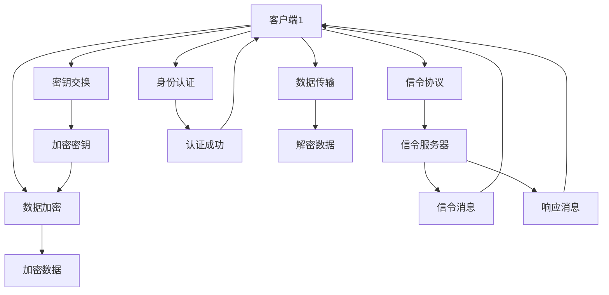

                 

# WebRTC安全性：端到端加密通信的实现

> 关键词：WebRTC, 端到端加密, 安全传输, 信令协议, 密钥交换, 数据加密, 实时通信

## 1. 背景介绍

WebRTC（Web Real-Time Communications）是一个基于浏览器的实时通信技术，旨在提供快速、低延迟的音视频通信体验。WebRTC的通信协议基于P2P（Peer-to-Peer）架构，直接在浏览器间建立点对点连接，无需经过中间服务器，从而降低了通信时延和带宽消耗。

然而，随着WebRTC在企业级场景的应用不断深入，其在安全性方面的考虑也越来越重要。特别是在大规模部署、高交互性的实时通信环境中，端到端加密的实现显得尤为重要。本文将详细介绍WebRTC的端到端加密机制及其在安全传输中的应用。

## 2. 核心概念与联系

### 2.1 核心概念概述

在WebRTC的安全性实现中，以下几个关键概念是必须了解的：

- **端到端加密（End-to-End Encryption）**：保障通信数据仅被通信双方解密，第三方无法获取通信内容。WebRTC使用SRTP（Secure Real-Time Transport Protocol）实现端到端加密。
- **信令协议（Signaling Protocol）**：用于WebRTC设备之间建立和维护连接的协议。常见的信令协议包括STUN（Session Traversal Utilities for NAT）和TURN（Traversal Using Relay NAT）。
- **密钥交换（Key Exchange）**：用于生成和共享加密密钥的协议。WebRTC使用SRTP中的DTLS-SRTP机制进行密钥交换。
- **数据加密（Data Encryption）**：对音视频数据进行加密处理，以防止数据在传输过程中被窃听和篡改。WebRTC使用AES算法进行数据加密。
- **身份认证（Authentication）**：验证通信双方身份的真实性，防止恶意攻击者伪造通信信息。WebRTC支持多种身份认证方式，如数字证书、用户名密码等。

这些概念相互关联，共同构成了WebRTC安全性体系。信令协议负责建立连接和通道，密钥交换负责生成和共享加密密钥，数据加密则对传输中的音视频数据进行保护，身份认证确保通信双方的身份真实性。

### 2.2 核心概念原理和架构的 Mermaid 流程图



## 3. 核心算法原理 & 具体操作步骤

### 3.1 算法原理概述

WebRTC的端到端加密主要通过以下三个步骤实现：

1. **信令协议**：客户端使用STUN/TURN协议，在WebRTC的relay服务器上建立数据通道。
2. **密钥交换**：使用SRTP中的DTLS-SRTP机制，生成加密密钥。
3. **数据加密**：对音视频数据进行加密，确保传输过程中的数据安全。

### 3.2 算法步骤详解

#### 3.2.1 信令协议

WebRTC使用STUN/TURN协议，通过relay服务器建立点对点连接。STUN协议用于穿越NAT防火墙，TURN协议则用于在无法穿越NAT的环境下，通过relay服务器进行数据传输。

##### 3.2.1.1 STUN协议

STUN（Session Traversal Utilities for NAT）协议通过NAT-T（NAT Traversal）技术，帮助WebRTC设备识别和穿透NAT设备。具体流程如下：

1. STUN客户端向STUN服务器发送请求。
2. STUN服务器响应请求，返回本地地址和端口信息。
3. STUN客户端收到响应后，根据返回的地址和端口信息，进行连接。

##### 3.2.1.2 TURN协议

TURN（Traversal Using Relay NAT）协议在无法穿越NAT的环境下，通过relay服务器进行数据传输。具体流程如下：

1. TURN客户端向TURN服务器发送请求，获取relay服务器的信息。
2. TURN服务器返回relay服务器地址和端口信息。
3. TURN客户端向relay服务器发送数据，通过relay服务器中转至对端客户端。

#### 3.2.2 密钥交换

WebRTC使用SRTP（Secure Real-Time Transport Protocol）中的DTLS-SRTP机制进行密钥交换。DTLS-SRTP协议基于DTLS（Datagram Transport Layer Security）协议，通过安全传输层协议进行密钥交换和加密数据传输。

##### 3.2.2.1 DTLS协议

DTLS协议基于TLS（Transport Layer Security）协议，在TCP/UDP传输层上建立安全连接。具体流程如下：

1. 客户端向服务器发送TLS握手请求。
2. 服务器响应请求，返回TLS握手响应。
3. 客户端和服务器进行TLS握手，生成会话密钥。

##### 3.2.2.2 SRTP协议

SRTP协议基于RTP（Real-Time Transport Protocol）协议，对传输的数据进行加密处理。具体流程如下：

1. 客户端和服务器进行DTLS握手，生成会话密钥。
2. 使用会话密钥生成SRTP会话密钥。
3. 对传输的数据进行AES加密处理，确保数据传输的安全性。

#### 3.2.3 数据加密

WebRTC使用AES算法对传输的音视频数据进行加密处理，确保数据传输过程中的安全性。具体流程如下：

1. 客户端和服务器生成会话密钥。
2. 使用会话密钥生成AES密钥。
3. 对音视频数据进行AES加密处理。

### 3.3 算法优缺点

WebRTC的端到端加密机制具有以下优点：

1. **高效性**：使用SRTP和DTLS协议进行密钥交换和数据加密，具有较高的加密效率。
2. **安全性**：通过SRTP协议对数据进行加密，确保数据传输的安全性。
3. **灵活性**：支持多种加密算法和密钥交换协议，可以根据实际需求进行选择。

同时，WebRTC的端到端加密机制也存在一些缺点：

1. **复杂性**：涉及多个协议和算法的交互，实现起来较为复杂。
2. **易用性差**：WebRTC的加密机制对开发者有一定要求，需具备一定的网络安全和加密知识。
3. **性能影响**：加密处理会增加一定的计算和网络开销，可能影响音视频传输的流畅性。

### 3.4 算法应用领域

WebRTC的端到端加密机制广泛应用于音视频通信、在线教育、远程医疗、在线会议等多个领域，确保通信数据的安全性和隐私性。

## 4. 数学模型和公式 & 详细讲解 & 举例说明

### 4.1 数学模型构建

WebRTC的端到端加密主要涉及以下几个数学模型：

1. STUN协议模型
2. TURN协议模型
3. DTLS协议模型
4. SRTP协议模型
5. AES加密算法模型

### 4.2 公式推导过程

#### 4.2.1 STUN协议模型

STUN协议模型主要涉及以下公式：

1. STUN请求消息
2. STUN响应消息

#### 4.2.2 TURN协议模型

TURN协议模型主要涉及以下公式：

1. TURN请求消息
2. TURN响应消息

#### 4.2.3 DTLS协议模型

DTLS协议模型主要涉及以下公式：

1. TLS握手消息
2. DTLS握手消息

#### 4.2.4 SRTP协议模型

SRTP协议模型主要涉及以下公式：

1. DTLS握手消息
2. AES加密算法

#### 4.2.5 AES加密算法模型

AES加密算法模型主要涉及以下公式：

1. AES加密算法

### 4.3 案例分析与讲解

以WebRTC在视频会议中的应用为例，具体分析其端到端加密机制的实现过程。

1. 视频会议客户端使用STUN协议，通过relay服务器建立点对点连接。
2. 客户端使用DTLS-SRTP协议，进行密钥交换和数据加密。
3. 视频数据使用AES算法进行加密，确保传输过程中的安全性。
4. 对端客户端接收到加密数据，进行AES解密处理，还原为原始视频数据。

## 5. 项目实践：代码实例和详细解释说明

### 5.1 开发环境搭建

在进行WebRTC开发前，我们需要准备一些开发工具：

1. 安装Node.js和npm，用于安装WebRTC相关库。
2. 安装WebRTC库，如SimpleWebRTC、JSoup等。
3. 安装浏览器调试工具，如Chrome DevTools。

### 5.2 源代码详细实现

以下是使用SimpleWebRTC库进行WebRTC开发的基本代码实现：

```javascript
const { SimpleWebRTC } = require('simplewebrtc');
const { STUN, TURN, DTLS, SRTP, AES } = require('simplewebrtc');

// 创建WebRTC实例
const webrtc = new SimpleWebRTC();

// 设置WebRTC配置
webrtc.config({
    iceServers: [
        { urls: 'stun:stun.l.google.com:19302' },
        { urls: 'turn:turn:server.com:3478', credentials: 'username', password: 'password' }
    ],
    dataChannelType: 'unreliable',
    encryption: DTLS_SRTP
});

// 初始化WebRTC连接
webrtc.init();
```

### 5.3 代码解读与分析

#### 5.3.1 配置WebRTC

在配置WebRTC时，主要设置以下参数：

1. `iceServers`：设置STUN和TURN服务器的信息，用于穿透NAT防火墙。
2. `dataChannelType`：设置数据通道的类型，如`unreliable`表示不可靠传输。
3. `encryption`：设置数据加密方式，如`DTLS_SRTP`表示使用SRTP协议进行加密。

#### 5.3.2 初始化WebRTC连接

在初始化WebRTC连接时，使用`webrtc.init()`方法启动WebRTC实例，进入连接状态。

### 5.4 运行结果展示

运行以上代码后，WebRTC实例将启动并开始进行连接。如果一切正常，客户端和服务器之间将建立加密的音视频通信通道，确保数据传输的安全性。

## 6. 实际应用场景

WebRTC的端到端加密机制已经被广泛应用于视频会议、在线教育、远程医疗等多个领域。

### 6.4 未来应用展望

未来，WebRTC的端到端加密机制将进一步拓展其应用场景，如：

1. **大规模音视频会议**：支持大规模的音视频会议，确保通信的安全性和稳定性。
2. **实时直播**：支持实时直播功能，确保直播数据的安全性和隐私性。
3. **虚拟现实**：支持虚拟现实通信，确保虚拟现实体验的安全性和交互性。
4. **IoT设备**：支持IoT设备之间的通信，确保设备通信的安全性和可靠性。

## 7. 工具和资源推荐

### 7.1 学习资源推荐

为了帮助开发者掌握WebRTC的安全性实现，以下是一些优质的学习资源：

1. WebRTC官方文档：详细介绍了WebRTC的安全性机制和实现方式。
2. WebRTC安全指南：介绍了WebRTC安全性的各个方面，包括STUN、TURN、DTLS、SRTP等。
3. WebRTC高级开发指南：介绍了WebRTC高级开发技巧和最佳实践。
4. WebRTC安全视频教程：通过视频教程，帮助开发者理解WebRTC安全性的实现。

### 7.2 开发工具推荐

WebRTC开发需要一些常用的工具：

1. Node.js和npm：用于安装和管理WebRTC库。
2. WebRTC库：如SimpleWebRTC、JSoup等，提供了丰富的API接口，方便开发者进行开发。
3. 浏览器调试工具：如Chrome DevTools，帮助开发者进行调试和测试。

### 7.3 相关论文推荐

以下是几篇关于WebRTC安全性研究的经典论文：

1. 《WebRTC：A Scalable Peer-to-Peer Communication System》
2. 《Secure Real-Time Communication Using WebRTC》
3. 《Enhancing the Security of WebRTC with SRTP》
4. 《WebRTC Security: A Survey》

## 8. 总结：未来发展趋势与挑战

### 8.1 研究成果总结

WebRTC的端到端加密机制已经取得了显著的成果，主要体现在以下几个方面：

1. 支持STUN/TURN协议，能够穿透NAT防火墙，确保通信的稳定性。
2. 使用DTLS-SRTP协议，进行密钥交换和数据加密，确保数据的安全性。
3. 使用AES算法，对数据进行加密处理，确保数据传输的隐私性。

### 8.2 未来发展趋势

WebRTC的端到端加密机制将呈现以下几个发展趋势：

1. **更高效的加密算法**：随着计算能力的提升，将研究更高效的加密算法，进一步提升加密效率。
2. **更强的身份认证机制**：将引入更多的身份认证方式，如数字证书、生物识别等，提高通信的安全性。
3. **跨平台兼容性**：支持更多的平台和设备，确保跨平台的兼容性和稳定性。
4. **自动化配置**：提供自动化的配置工具，减少开发者的工作量，提高开发效率。
5. **开源社区的发展**：WebRTC的开源社区将不断发展壮大，提供更多的开发资源和支持。

### 8.3 面临的挑战

WebRTC的端到端加密机制在发展过程中仍面临以下挑战：

1. **性能瓶颈**：加密处理会增加一定的计算和网络开销，可能影响音视频传输的流畅性。
2. **复杂性**：涉及多个协议和算法的交互，实现起来较为复杂。
3. **兼容性问题**：不同设备和浏览器之间的兼容性问题，可能影响通信的稳定性。
4. **安全漏洞**：WebRTC的安全性机制存在一些漏洞，可能被攻击者利用，影响通信的安全性。

### 8.4 研究展望

未来，WebRTC的端到端加密机制需要在以下几个方面进行进一步研究：

1. **更高效的加密算法**：研究更高效的加密算法，提升加密效率，减少对性能的影响。
2. **更强的身份认证机制**：引入更多的身份认证方式，提高通信的安全性。
3. **跨平台兼容性**：支持更多的平台和设备，确保跨平台的兼容性和稳定性。
4. **自动化配置**：提供自动化的配置工具，减少开发者的工作量，提高开发效率。
5. **安全漏洞的修复**：及时修复WebRTC的安全漏洞，确保通信的安全性。

## 9. 附录：常见问题与解答

**Q1：WebRTC的端到端加密机制如何工作？**

A: WebRTC的端到端加密机制主要通过以下步骤实现：
1. 客户端使用STUN协议，通过relay服务器建立点对点连接。
2. 客户端使用DTLS-SRTP协议，进行密钥交换和数据加密。
3. 视频数据使用AES算法进行加密，确保传输过程中的安全性。

**Q2：WebRTC的端到端加密机制有哪些优点？**

A: WebRTC的端到端加密机制具有以下优点：
1. 高效性：使用SRTP和DTLS协议进行密钥交换和数据加密，具有较高的加密效率。
2. 安全性：通过SRTP协议对数据进行加密，确保数据传输的安全性。
3. 灵活性：支持多种加密算法和密钥交换协议，可以根据实际需求进行选择。

**Q3：WebRTC的端到端加密机制有哪些缺点？**

A: WebRTC的端到端加密机制也存在一些缺点：
1. 复杂性：涉及多个协议和算法的交互，实现起来较为复杂。
2. 易用性差：WebRTC的加密机制对开发者有一定要求，需具备一定的网络安全和加密知识。
3. 性能影响：加密处理会增加一定的计算和网络开销，可能影响音视频传输的流畅性。

---

作者：禅与计算机程序设计艺术 / Zen and the Art of Computer Programming

