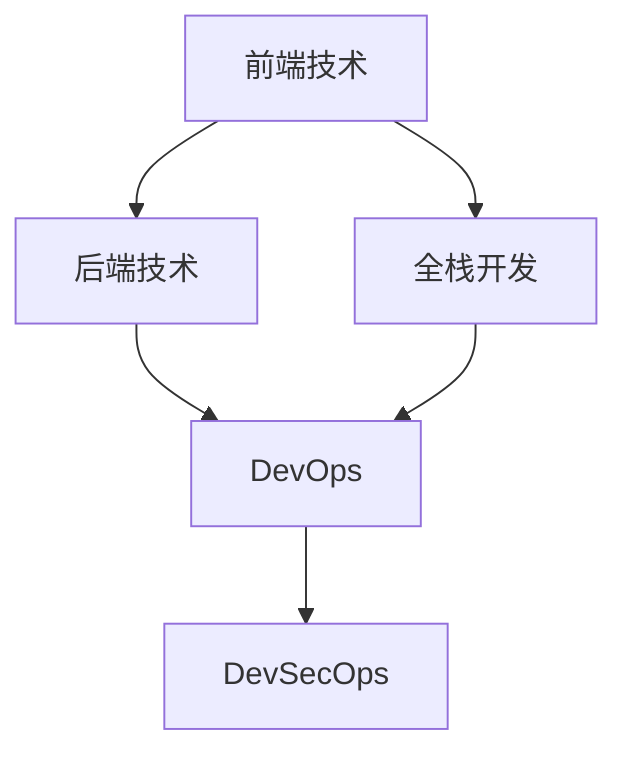

                 

# Web全栈开发：从前端到后端的全面指南

> 关键词：Web开发,前端技术,后端技术,全栈开发,框架,组件化开发,DevOps,DevSecOps

## 1. 背景介绍

### 1.1 问题由来
在现代互联网应用开发中，Web开发已经成为一个复杂而多样化的领域。传统的Web开发模式是将前端和后端分离，由不同的团队分别负责。前端负责用户界面的展示和交互逻辑，后端负责数据处理和业务逻辑。这种分离模式虽然能提高开发效率和团队协作性，但也带来了一些问题：

1. 沟通成本高：前后端分离导致沟通不畅，特别是在需求变更时，双方需要频繁协调。
2. 技术栈不统一：前端和后端使用不同的技术栈，增加了学习和维护成本。
3. 性能瓶颈明显：前端和后端之间的数据交互通常需要多次网络请求，增加了延迟和带宽消耗。

为了解决这些问题，全栈开发应运而生。全栈开发指的是开发者能够独立完成前端和后端的开发工作，无需依赖其他团队。这种模式能够显著提升开发效率，降低沟通成本，同时减少性能瓶颈，提高应用的质量和稳定性。

### 1.2 问题核心关键点
全栈开发的核心在于整合前端和后端的技术栈，使开发者具备跨领域的技术能力。具体来说，全栈开发者需要掌握以下几项关键技术：

1. 前端框架：如React、Vue、Angular等，负责用户界面的构建和交互逻辑的实现。
2. 后端框架：如Node.js、Django、Flask等，负责数据处理和业务逻辑的实现。
3. 数据库技术：如MySQL、MongoDB、Redis等，用于存储和管理数据。
4. DevOps工具：如Docker、Kubernetes、CI/CD等，用于自动化部署和运维。
5. DevSecOps工具：如OWASP Top 10、SAST、DAST等，用于提升应用的安全性和可靠性。

通过掌握这些关键技术，全栈开发者可以构建高质量、高可扩展性的Web应用。

## 2. 核心概念与联系

### 2.1 核心概念概述

为了更好地理解全栈开发的概念，本节将介绍几个密切相关的核心概念：

- 前端技术：包括HTML、CSS、JavaScript等，用于构建用户界面和实现交互逻辑。
- 后端技术：包括服务器端编程语言、数据库、中间件等，用于处理数据和业务逻辑。
- 全栈开发：指的是开发者能够独立完成前端和后端的开发工作，无需依赖其他团队。
- DevOps：通过自动化部署和运维工具，提升软件交付的速度和稳定性。
- DevSecOps：结合DevOps和信息安全技术，提升应用的安全性和可靠性。

这些概念之间的逻辑关系可以通过以下Mermaid流程图来展示：



这个流程图展示了几项核心概念之间的联系：

1. 前端和后端技术相互依赖，共同构成了Web应用的完整生态。
2. 全栈开发者能够同时掌握前端和后端技术，实现无缝衔接。
3. DevOps工具能够提升应用的交付效率和稳定性。
4. DevSecOps工具能够提升应用的安全性和可靠性。

这些概念共同构成了全栈开发的技术框架，使其能够实现高性能、高安全、高可靠性的Web应用。

## 3. 核心算法原理 & 具体操作步骤
### 3.1 算法原理概述

全栈开发的原理可以简单概括为“整合前后端技术，实现无缝衔接”。具体来说，全栈开发包括以下几个关键步骤：

1. 选择合适的技术栈：根据项目需求，选择合适的前端和后端技术栈。
2. 设计统一的API接口：在前端和后端之间设计统一的API接口，实现数据的传递和交互。
3. 实现跨平台开发：通过Web框架和前端技术，实现跨平台开发，适配不同的设备和浏览器。
4. 实施DevOps和DevSecOps：通过自动化工具和信息安全技术，提升应用的交付效率和安全性。

### 3.2 算法步骤详解

下面详细介绍全栈开发的具体操作步骤：

**Step 1: 选择合适的技术栈**

根据项目需求，选择合适的技术栈。一般来说，前端技术可以选择React、Vue、Angular等框架，后端技术可以选择Node.js、Django、Flask等框架。例如，如果要构建一个现代化的电商网站，可以选择React作为前端框架，Node.js作为后端框架，MySQL作为数据库。

**Step 2: 设计统一的API接口**

在前端和后端之间设计统一的API接口，实现数据的传递和交互。通常使用RESTful API或GraphQL等标准接口协议。例如，可以使用Express.js作为后端框架，设计统一的API接口，在前端通过Axios等库发送HTTP请求，获取数据并进行展示。

**Step 3: 实现跨平台开发**

通过Web框架和前端技术，实现跨平台开发，适配不同的设备和浏览器。例如，使用React构建前端页面，使用Express.js作为后端框架，使用MongoDB作为数据库，能够实现跨平台开发，适配不同的设备和浏览器。

**Step 4: 实施DevOps和DevSecOps**

通过自动化工具和信息安全技术，提升应用的交付效率和安全性。例如，使用Docker容器化技术，使用Kubernetes进行容器编排，使用CI/CD自动化部署，使用OWASP Top 10和SAST、DAST等工具进行安全扫描，提升应用的交付效率和安全性。

### 3.3 算法优缺点

全栈开发具有以下优点：

1. 开发效率高：全栈开发者能够同时完成前端和后端的开发工作，减少沟通成本，提高开发效率。
2. 技术栈统一：全栈开发者使用统一的技术栈，降低学习和维护成本。
3. 性能优化好：全栈开发者能够同时优化前端和后端的性能，提升应用的用户体验。
4. 安全性强：全栈开发者能够同时关注前后端的安全问题，提升应用的安全性。

同时，全栈开发也存在以下缺点：

1. 技术要求高：全栈开发者需要掌握多门技术，学习曲线较陡峭。
2. 开发成本高：全栈开发者需要独立完成前后端的开发工作，工作量大。
3. 团队协作难：全栈开发者独立开发，与团队协作可能存在问题。
4. 维护成本高：全栈开发者需要同时维护前后端的代码，维护成本较高。

尽管存在这些缺点，但全栈开发仍然是一种高效、灵活的开发模式，适用于中小型项目的开发。

### 3.4 算法应用领域

全栈开发已经在许多领域得到了广泛的应用，包括：

- 电商网站：构建现代化的电商网站，提升用户体验。
- 在线教育平台：构建在线教育平台，提供丰富多样的教学资源。
- 医疗健康应用：构建医疗健康应用，提供远程诊疗和健康管理服务。
- 社交媒体应用：构建社交媒体应用，提供社交互动和内容分享服务。
- 物联网应用：构建物联网应用，实现设备之间的互联互通。

除了这些经典应用外，全栈开发还可以应用于更多场景中，如在线客服、虚拟会议、智能家居等，为各行各业提供创新性的解决方案。

## 4. 数学模型和公式 & 详细讲解  
### 4.1 数学模型构建

本节将使用数学语言对全栈开发的核心原理进行更加严格的刻画。

假设前端和后端之间存在数据交换，数据量为 $D$，前端发送请求时延为 $T_{\text{front}}$，后端处理时延为 $T_{\text{back}}$，数据传输时延为 $T_{\text{trans}}$。则总时延 $T_{\text{total}}$ 为：

$$
T_{\text{total}} = T_{\text{front}} + T_{\text{back}} + T_{\text{trans}}
$$

如果前后端之间存在API接口，则总时延还可以进一步简化为：

$$
T_{\text{total}} = T_{\text{front}} + \frac{D}{R_{\text{api}}}
$$

其中 $R_{\text{api}}$ 为API接口的处理速率。

### 4.2 公式推导过程

以下我们以一个简单的电商网站为例，推导全栈开发中的关键公式。

假设前端使用React框架，后端使用Node.js框架，数据库使用MySQL，采用RESTful API进行数据交换。前端页面由React组件组成，后端逻辑由Node.js代码实现，数据存储在MySQL数据库中。

**前端页面加载时间**：
$$
T_{\text{front}} = T_{\text{React}} + T_{\text{HTTP}} + T_{\text{DB}}
$$

其中 $T_{\text{React}}$ 为React组件渲染时间，$T_{\text{HTTP}}$ 为HTTP请求响应时间，$T_{\text{DB}}$ 为数据库查询时间。

**后端处理时间**：
$$
T_{\text{back}} = T_{\text{Node}} + T_{\text{MySQL}}
$$

其中 $T_{\text{Node}}$ 为Node.js代码执行时间，$T_{\text{MySQL}}$ 为MySQL数据库操作时间。

**数据传输时间**：
$$
T_{\text{trans}} = T_{\text{HTTP}} + T_{\text{DB}}
$$

其中 $T_{\text{HTTP}}$ 为HTTP请求响应时间，$T_{\text{DB}}$ 为数据库查询时间。

**API接口处理时间**：
$$
T_{\text{api}} = \frac{D}{R_{\text{api}}}
$$

其中 $R_{\text{api}}$ 为API接口的处理速率。

**总时延**：
$$
T_{\text{total}} = T_{\text{front}} + T_{\text{back}} + T_{\text{trans}} + T_{\text{api}}
$$

将上述公式代入，得到：

$$
T_{\text{total}} = T_{\text{React}} + 2T_{\text{HTTP}} + 2T_{\text{DB}} + T_{\text{Node}} + T_{\text{MySQL}} + \frac{D}{R_{\text{api}}}
$$

### 4.3 案例分析与讲解

假设前端使用React框架，后端使用Node.js框架，数据库使用MySQL，API接口的处理速率为 $R_{\text{api}}=1\text{MB/s}$。

**前端页面加载时间**：
- $T_{\text{React}}=0.2\text{s}$
- $T_{\text{HTTP}}=0.1\text{s}$
- $T_{\text{DB}}=0.5\text{s}$

则 $T_{\text{front}} = 0.2\text{s} + 0.1\text{s} + 0.5\text{s} = 0.8\text{s}$

**后端处理时间**：
- $T_{\text{Node}}=0.5\text{s}$
- $T_{\text{MySQL}}=0.3\text{s}$

则 $T_{\text{back}} = 0.5\text{s} + 0.3\text{s} = 0.8\text{s}$

**数据传输时间**：
- $T_{\text{HTTP}}=0.1\text{s}$
- $T_{\text{DB}}=0.5\text{s}$

则 $T_{\text{trans}} = 0.1\text{s} + 0.5\text{s} = 0.6\text{s}$

**总时延**：
$$
T_{\text{total}} = 0.8\text{s} + 0.8\text{s} + 0.6\text{s} + \frac{D}{1\text{MB/s}}
$$

假设用户浏览的网页数据量为 $D=1\text{MB}$，则：

$$
T_{\text{total}} = 0.8\text{s} + 0.8\text{s} + 0.6\text{s} + 1\text{s} = 3.2\text{s}
$$

由此可见，通过优化前后端性能、减少数据传输时间和API接口处理时间，可以显著提升Web应用的性能。

## 5. 项目实践：代码实例和详细解释说明
### 5.1 开发环境搭建

在进行全栈开发实践前，我们需要准备好开发环境。以下是使用Node.js和React开发的环境配置流程：

1. 安装Node.js：从官网下载并安装Node.js，确保安装最新版本的Node.js。
2. 安装npm和yarn：npm和yarn是Node.js的包管理工具，用于安装和管理依赖库。
3. 安装IDE：如Visual Studio Code、WebStorm等，用于编写和调试代码。
4. 安装MySQL：从官网下载并安装MySQL数据库，创建相应的数据库和表。
5. 安装Express.js：npm install express --save

完成上述步骤后，即可在本地环境开始全栈开发实践。

### 5.2 源代码详细实现

下面我们以构建一个简单的电商网站为例，给出使用Node.js和React进行全栈开发的PyTorch代码实现。

首先，定义电商网站的数据模型：

```javascript
const express = require('express');
const app = express();

// 定义商品数据模型
app.use(express.json());
let products = [
  { id: 1, name: 'iPhone 12', price: 6999 },
  { id: 2, name: 'iPad Air', price: 4999 },
  { id: 3, name: 'MacBook Air', price: 9999 }
];

// 定义商品路由
app.get('/products', (req, res) => {
  res.send(products);
});

// 定义商品详情路由
app.get('/products/:id', (req, res) => {
  const id = parseInt(req.params.id);
  const product = products.find(p => p.id === id);
  if (!product) return res.status(404).send('Product not found');
  res.send(product);
});

// 启动服务器
app.listen(3000, () => console.log('Server started on port 3000'));
```

然后，定义React前端页面：

```javascript
import React, { useState, useEffect } from 'react';
import axios from 'axios';

function App() {
  const [products, setProducts] = useState([]);

  useEffect(() => {
    axios.get('/products')
      .then(response => setProducts(response.data))
      .catch(error => console.error(error));
  }, []);

  return (
    <div>
      <h1>Product List</h1>
      <ul>
        {products.map(product => <li key={product.id}>{product.name} - {product.price}</li>)}
      </ul>
    </div>
  );
}

export default App;
```

接下来，定义后端逻辑和数据库连接：

```javascript
const express = require('express');
const app = express();

// 定义商品数据模型
app.use(express.json());
let products = [
  { id: 1, name: 'iPhone 12', price: 6999 },
  { id: 2, name: 'iPad Air', price: 4999 },
  { id: 3, name: 'MacBook Air', price: 9999 }
];

// 定义商品路由
app.get('/products', (req, res) => {
  res.send(products);
});

// 定义商品详情路由
app.get('/products/:id', (req, res) => {
  const id = parseInt(req.params.id);
  const product = products.find(p => p.id === id);
  if (!product) return res.status(404).send('Product not found');
  res.send(product);
});

// 启动服务器
app.listen(3000, () => console.log('Server started on port 3000'));
```

最后，启动开发服务器并在浏览器中查看效果：

```javascript
npm start
```

打开浏览器，输入 http://localhost:3000，即可在浏览器中查看电商网站的效果。

### 5.3 代码解读与分析

让我们再详细解读一下关键代码的实现细节：

**数据模型**：
- 使用Express框架定义了商品数据模型，包含id、name、price等属性。
- 在路由中定义了商品列表和详情路由，使用Express的路由中间件实现。

**React前端页面**：
- 使用React组件定义了电商网站的页面，通过useEffect钩子获取后端数据，渲染商品列表。
- 使用axios库发送HTTP请求，获取商品列表数据，使用useState钩子管理数据状态。

**后端逻辑**：
- 使用Express框架定义了商品列表和详情路由，返回商品列表和详情数据。
- 使用数据模型保存商品数据，提供GET请求接口。

**数据库连接**：
- 使用MySQL数据库保存商品数据，提供GET请求接口。

通过以上代码实现，我们可以看到全栈开发中前端和后端的无缝衔接。前端通过HTTP请求获取数据，后端通过RESTful API提供数据服务。

## 6. 实际应用场景
### 6.1 智能客服系统

基于全栈开发技术的智能客服系统，可以高效处理大量客户咨询，提升客户服务质量。传统客服系统通常需要配置多台服务器，维护成本高，响应速度慢。而使用全栈开发技术，可以构建集成了语音、文本、图像等多种交互方式的智能客服系统，实现实时响应和智能推荐，提高客户满意度。

在技术实现上，可以构建一个全栈开发的智能客服平台，前端使用React构建用户界面，后端使用Node.js处理客户请求，数据库使用MySQL存储用户数据，通过API接口实现数据交互。系统可以实时监测客户咨询数据，自动生成智能回答，并通过多种渠道（如网站、APP、微信等）进行推送。

### 6.2 在线教育平台

在线教育平台需要提供丰富的教学资源和互动体验，全栈开发技术能够满足这些需求。使用全栈开发技术，可以构建一个集成了视频、音频、图片、文档等多种教学资源的在线教育平台，实现直播、录播、互动等教学方式。

在技术实现上，可以构建一个全栈开发的在线教育平台，前端使用React构建教学界面，后端使用Node.js处理用户请求，数据库使用MySQL存储教学资源，通过API接口实现数据交互。系统可以实时推送教学内容和互动信息，并通过多种渠道（如网站、APP、微信等）进行推送。

### 6.3 医疗健康应用

医疗健康应用需要提供高效、准确的健康管理服务，全栈开发技术能够满足这些需求。使用全栈开发技术，可以构建一个集成了患者数据、医疗记录、医生咨询等多种功能的医疗健康应用，实现智能问诊、健康监测、远程诊疗等功能。

在技术实现上，可以构建一个全栈开发的医疗健康应用，前端使用React构建患者界面，后端使用Node.js处理用户请求，数据库使用MySQL存储医疗数据，通过API接口实现数据交互。系统可以实时监测患者健康数据，自动生成健康建议，并通过多种渠道（如网站、APP、微信等）进行推送。

### 6.4 未来应用展望

随着全栈开发技术的不断发展，其在更多领域的应用前景将更加广阔。

在智慧城市治理中，全栈开发技术可以构建集成了传感器、摄像头、数据中心等多种功能的智慧城市平台，实现实时监测、智能分析、精准管理等功能。

在金融行业，全栈开发技术可以构建集成了多种交易、结算、风控功能的一站式金融服务平台，实现高效、安全、透明的服务。

在社交媒体中，全栈开发技术可以构建集成了多种内容发布、互动、推荐功能的一站式社交平台，实现个性化推荐、实时互动等功能。

总之，全栈开发技术将在更多领域得到应用，为各行各业带来创新性的解决方案。

## 7. 工具和资源推荐
### 7.1 学习资源推荐

为了帮助开发者系统掌握全栈开发的技术基础和实践技巧，这里推荐一些优质的学习资源：

1. 《JavaScript 权威指南》：权威的JavaScript学习资源，涵盖语言基础、框架使用、调试技巧等。
2. 《Node.js 实战》：Node.js开发实战指南，涵盖Node.js基础、中间件开发、应用部署等。
3. 《React 实战》：React开发实战指南，涵盖React基础、组件化开发、应用构建等。
4. 《MySQL 实战》：MySQL数据库实战指南，涵盖MySQL基础、数据建模、性能优化等。
5. 《DevOps 实战》：DevOps实践指南，涵盖CI/CD、容器化、自动化部署等。

通过学习这些资源，相信你一定能够快速掌握全栈开发的关键技术，并用于解决实际的开发问题。

### 7.2 开发工具推荐

高效的开发离不开优秀的工具支持。以下是几款用于全栈开发开发的常用工具：

1. Visual Studio Code：一款轻量级的代码编辑器，支持多种语言和框架，配置灵活。
2. WebStorm：一款专业的JavaScript开发工具，支持React、Vue、Angular等框架。
3. MongoDB Compass：一款可视化数据库管理工具，支持MongoDB数据库的操作和管理。
4. Docker：一款容器化平台，支持应用部署和运行。
5. Kubernetes：一款容器编排工具，支持应用自动化部署和运维。

合理利用这些工具，可以显著提升全栈开发任务的开发效率，加快创新迭代的步伐。

### 7.3 相关论文推荐

全栈开发技术的发展得益于学界的持续研究。以下是几篇奠基性的相关论文，推荐阅读：

1. "A Survey of Web Application Architecture Styles"：综述了多种Web应用架构风格，包括MVC、MVVM等，为全栈开发提供了理论基础。
2. "Programming Languages as a Service"：探讨了编程语言即服务的发展方向，为全栈开发提供了技术支撑。
3. "Building Web Applications with the MVC Design Pattern"：介绍了MVC设计模式的应用，为全栈开发提供了设计思路。
4. "The Future of Web Development"：探讨了Web开发未来的发展方向，为全栈开发提供了趋势分析。
5. "Full-stack Development in Practice"：介绍了全栈开发的实践经验，为全栈开发提供了实用指南。

这些论文代表了大全栈开发技术的发展脉络。通过学习这些前沿成果，可以帮助研究者把握学科前进方向，激发更多的创新灵感。

## 8. 总结：未来发展趋势与挑战
### 8.1 总结

本文对全栈开发的核心概念和技术原理进行了全面系统的介绍。首先阐述了全栈开发的发展背景和核心关键点，明确了全栈开发在提高开发效率、降低沟通成本等方面的独特价值。其次，从原理到实践，详细讲解了全栈开发的数学模型和关键操作步骤，给出了全栈开发任务开发的完整代码实例。同时，本文还广泛探讨了全栈开发在智能客服、在线教育、医疗健康等多个行业领域的应用前景，展示了全栈开发的巨大潜力。此外，本文精选了全栈开发的各类学习资源，力求为读者提供全方位的技术指引。

通过本文的系统梳理，可以看到，全栈开发技术正在成为Web开发的重要范式，极大地提升了Web应用的开发效率和用户体验。未来，伴随全栈开发技术的不断演进，相信Web应用将能够实现更高效、更安全、更可靠的发展，为各行各业带来更大的价值。

### 8.2 未来发展趋势

展望未来，全栈开发技术将呈现以下几个发展趋势：

1. 前端技术升级：前端技术将持续升级，从传统的HTML、CSS、JavaScript发展到React、Vue等框架，甚至发展到WebAssembly等新一代技术。
2. 后端技术融合：后端技术将不断融合，从传统的服务器端编程语言发展到Node.js、Python等跨平台语言，甚至发展到函数即服务(FaaS)等新型架构。
3. DevOps工具优化：DevOps工具将不断优化，从传统的CI/CD发展到Kubernetes、Docker等自动化平台，甚至发展到云原生等新一代架构。
4. DevSecOps普及：DevSecOps技术将不断普及，从传统的安全扫描发展到SAST、DAST等自动化工具，甚至发展到区块链等新一代安全技术。
5. 微服务架构：全栈开发将采用微服务架构，从传统的单应用架构发展到微服务架构，提升应用的扩展性和可靠性。

这些趋势凸显了全栈开发技术的广阔前景。这些方向的探索发展，必将进一步提升Web应用的性能和安全性，为开发者带来更高的开发效率和更好的用户体验。

### 8.3 面临的挑战

尽管全栈开发技术已经取得了不少进展，但在迈向更加智能化、普适化应用的过程中，它仍面临着诸多挑战：

1. 技术栈选择：不同的技术栈各有优缺点，选择合适的技术栈是一个难题。
2. 项目复杂度：全栈开发涉及多个技术栈，项目复杂度较高，管理难度较大。
3. 团队协作：全栈开发需要跨团队协作，团队协作难度较大。
4. 学习成本：全栈开发需要掌握多门技术，学习成本较高。
5. 维护成本：全栈开发需要维护多个技术栈，维护成本较高。

尽管存在这些挑战，但全栈开发仍然是一种高效、灵活的开发模式，适用于中小型项目的开发。

### 8.4 研究展望

面对全栈开发所面临的种种挑战，未来的研究需要在以下几个方面寻求新的突破：

1. 技术栈选择：开发出更加通用、易用的技术栈，降低技术栈选择的难度。
2. 项目复杂度：开发出更加模块化、组件化的开发框架，降低项目的复杂度。
3. 团队协作：开发出更加高效的协作工具，提升团队协作效率。
4. 学习成本：开发出更加友好的学习资源，降低学习成本。
5. 维护成本：开发出更加高效的维护工具，降低维护成本。

这些研究方向的探索，必将引领全栈开发技术迈向更高的台阶，为开发者带来更大的开发效率和更好的用户体验。面向未来，全栈开发技术还需要与其他人工智能技术进行更深入的融合，如自然语言处理、计算机视觉等，多路径协同发力，共同推动Web应用的进步。只有勇于创新、敢于突破，才能不断拓展Web应用的边界，让全栈开发技术更好地造福人类社会。

## 9. 附录：常见问题与解答
**Q1：全栈开发和前后端分离有什么不同？**

A: 全栈开发指的是开发者能够独立完成前端和后端的开发工作，前后端分离则是将前端和后端分别由不同团队负责。全栈开发能够显著提高开发效率，降低沟通成本，但开发难度较大，维护成本较高。前后端分离能够降低开发难度，但沟通成本较高，容易产生性能瓶颈。

**Q2：全栈开发的优势和劣势分别是什么？**

A: 全栈开发的优势在于能够独立完成前端和后端的开发工作，提高开发效率，降低沟通成本。但全栈开发的劣势在于开发难度较大，维护成本较高，学习成本较高。

**Q3：全栈开发适用于哪些类型的项目？**

A: 全栈开发适用于中小型项目，如电商网站、在线教育、医疗健康等。对于大型项目，前后端分离可能更为适合，便于团队分工协作。

**Q4：如何进行全栈开发的数据建模？**

A: 进行全栈开发的数据建模，需要考虑前端和后端的交互逻辑和数据结构。一般来说，可以采用RESTful API进行数据交互，使用MySQL等关系型数据库进行数据存储，使用MongoDB等非关系型数据库进行大数据存储。

**Q5：全栈开发中如何进行数据传输优化？**

A: 全栈开发中进行数据传输优化，可以从多个方面入手，如使用CDN加速数据传输，使用WebSocket进行实时数据传输，使用压缩算法减少数据量，使用异步加载技术提升用户体验等。

通过以上常见问题与解答，相信你能够更好地理解全栈开发的核心概念和技术原理，并用于解决实际的开发问题。

